# 十、使用 Burp 宏和扩展

在本章中，我们将介绍以下配方：

*   创建会话处理宏
*   被夹在饼干罐里
*   添加很棒的 pentester 插件
*   通过手动扫描问题扩展创建新问题
*   使用活动扫描++扩展

# 介绍

本章涵盖两个也可以混合在一起的独立主题：宏和扩展。Burp 宏使渗透测试人员能够自动化事件，如登录或参数读取，以克服潜在的错误情况。扩展，也称为插件，扩展了 Burp 中的核心功能。

# 软件工具要求

为了完成本章中的食谱，您需要以下内容：

*   OWASP 断开的 Web 应用程序（VM）
*   OWASP 多翅目（`http://<Your_VM_Assigned_IP_Address>/mutillidae`）
*   GetBoo（`http://<Your_VM_Assigned_IP_Address>/getboo`）
*   Burp 代理社区或专业人员（[https://portswigger.net/burp/](https://portswigger.net/burp/) ）

# 创建会话处理宏

在 Burp 中，项目选项选项卡允许测试人员设置会话处理规则。会话处理规则允许测试人员在发出 HTTP 请求时指定 Burp 将采取的与会话令牌或 CSRF 令牌相关的一组操作。Spider 和 Scanner 的作用域中有一个默认会话处理规则。然而，在这个配方中，我们将创建一个新的会话处理规则，并使用一个宏来帮助我们在使用 Repeater 时从一个未经验证的会话创建一个经过验证的会话。

# 准备

使用 OWASP Mutilliae II 应用程序，我们将创建一个新的 Burp 会话处理规则和一个关联的宏，以便在使用中继器时从未经身份验证的会话创建经过身份验证的会话。

# 怎么做。。。

1.  导航到 Mutillidae 中的登录页面。以用户名`ed`和密码`pentest`登录应用程序。
2.  单击注销按钮立即注销应用程序，并确保应用程序确认您已注销。
3.  切换到 Burp Proxy HTTP history 选项卡。查找您刚刚发出的注销请求以及随后未经验证的`GET`请求。选择未经验证的请求，即第二个`GET`。右键单击并将该请求发送到 Repeater，如下所示：

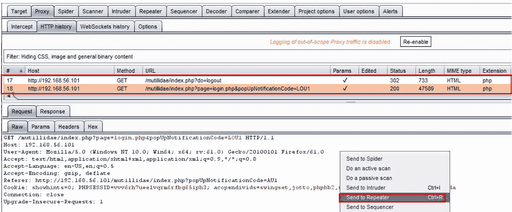

4.  切换到 Burp Repeater，然后单击 Go 按钮。在响应的“渲染”选项卡上，确保收到“未登录”消息。我们将使用此场景构建会话处理规则，以处理未经身份验证的会话，并使其成为经过身份验证的会话，如下所示：

5.  切换到 Burp 项目选项选项卡，然后切换到会话选项卡，然后单击会话处理规则部分下的添加按钮，如下所示：

6.  单击“添加”按钮后，将出现一个弹出框。为新规则指定一个名称，如`LogInSessionRule`，并在规则操作下选择运行宏，如下所示：

7.  另一个弹出框出现，这是会话处理操作编辑器。在第一部分的“选择宏”下，单击“添加”按钮，如下所示：

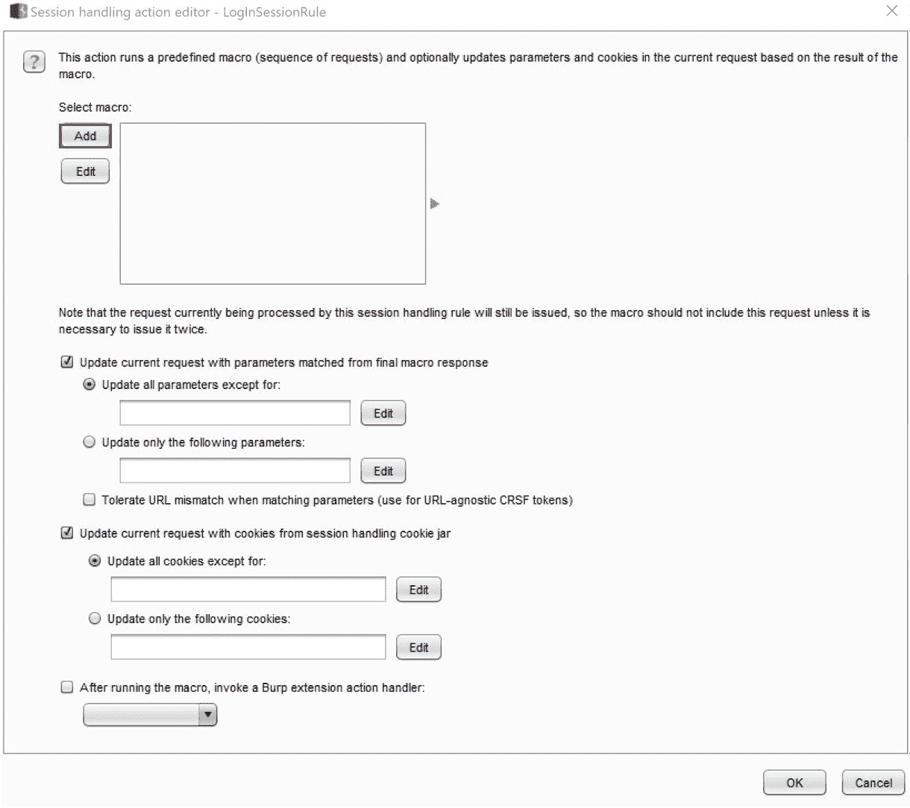

8.  单击“添加”按钮后，将显示“宏编辑器”以及“宏录制器”的另一个弹出窗口，如下所示：

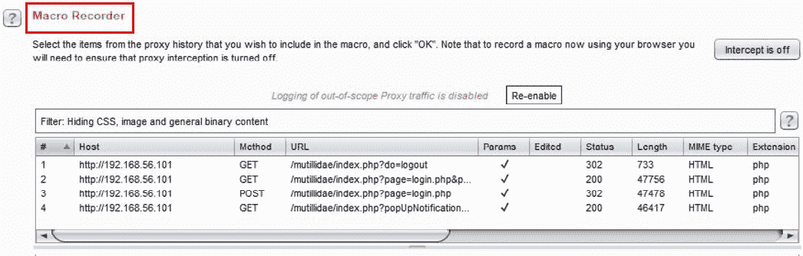

注意：1.7.35 中存在一个禁用宏记录器的错误。因此，单击“添加”按钮后，如果记录器未出现，请将 Burp 版本升级到 1.7.36 或更高版本。

9.  在宏记录器中，查找您登录的`POST`请求以及以下`GET`请求。在“宏录制器”窗口中高亮显示这两个请求，然后单击“确定”，如下所示：

10.  上一个对话框中突出显示的这两个请求现在显示在“宏编辑器”窗口中。给宏一个描述，如`LogInMacro`，如下所示：

11.  单击“配置项目”按钮以验证用户名和密码值是否正确。完成后单击“确定”，如下所示：

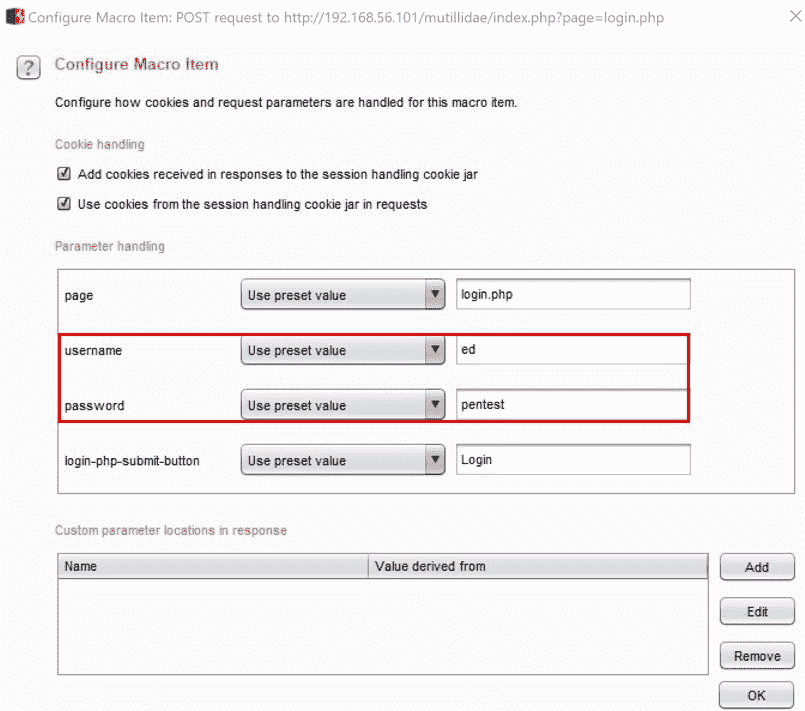

12.  单击“确定”关闭宏编辑器。您应该在会话处理操作编辑器中看到新创建的宏。单击“确定”关闭此对话框窗口，如下所示：

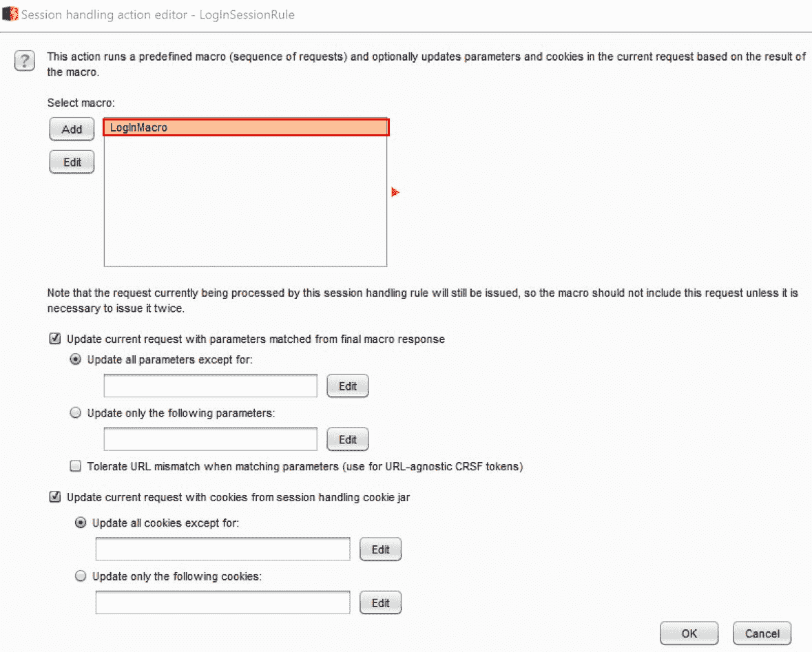

13.  关闭会话处理操作编辑器后，将返回到会话处理规则编辑器，您现在将看到使用宏名称填充的规则操作部分。单击此窗口的“范围”选项卡以定义将使用此规则的工具：

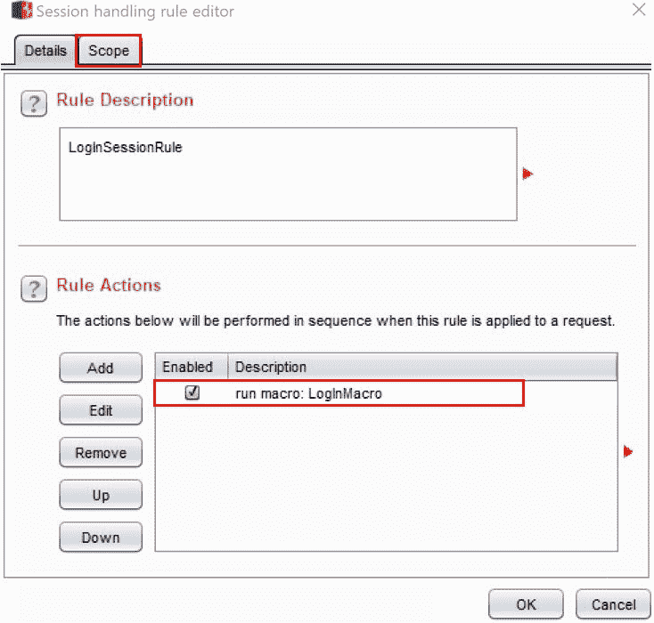

14.  在会话处理规则编辑器的“范围”选项卡上，取消选中其他框，只选中中继器。在 URL 范围下，单击包含所有 URL 单选按钮。单击“确定”关闭此编辑器，如下所示：

15.  现在，您应该可以在“会话处理规则”窗口中看到新的会话处理规则，如下所示：

16.  返回到以前未登录应用程序的 Repeater 选项卡。单击 Go 按钮显示您现在以 Ed 身份登录！这意味着您的会话处理规则和关联的宏已工作：

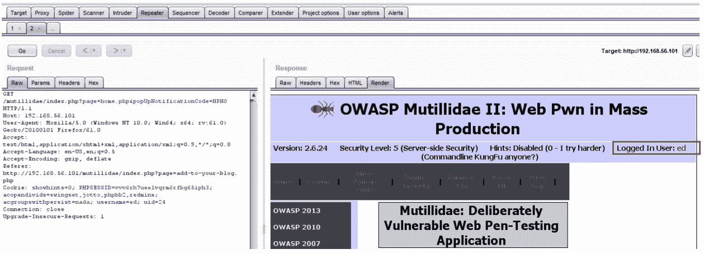

# 它是如何工作的。。。

在这个配方中，我们看到了如何通过重播登录过程将未经身份验证的会话更改为经过身份验证的会话。宏的创建允许编写脚本并将手动步骤分配给 Burp 套件中的各种工具。

Burp 允许测试人员配置会话处理规则，以解决工具套件可能遇到的各种情况。这些规则规定了在满足这些条件时要采取的额外行动。在此配方中，我们通过创建一个新的会话处理规则（称为宏）来处理未经验证的会话。我们将此规则的范围限制为仅用于演示目的的中继器。

# 被夹在饼干罐里

在针对某个应用程序时，Burp 捕获它在针对目标站点代理和爬取 HTTP 流量时遇到的所有 cookie。Burp 将这些 cookie 存储在名为**cookie jar**的缓存中。此 cookie jar 在默认会话处理规则中使用，可以在 Burp 工具套件（如代理、入侵者和蜘蛛）之间共享。在 cookiejar 中，有一个请求的历史表。该表详细说明了每个 cookie 域和路径。可以从 cookie jar 中编辑或删除 cookie。

# 准备

我们将打开 Burp 饼干罐，看看里面。然后，使用 OWASP GetBoo 应用程序，我们将识别添加到 Burp Cookie 罐中的新 Cookie。

# 怎么做。。。

1.  关闭并重新启动 Burp，以清除任何历史记录。切换到 Burp 项目选项选项卡，然后切换到会话选项卡。在 Cookie Jar 部分中，单击打开 Cookie Jar 按钮，如下所示：

2.  此时会出现一个新的弹出框。由于我们还没有代理流量，cookie jar 是空的。让我们针对一个应用程序捕获一些 cookie，如下所示：

3.  在 OWASP 登录页中，单击链接以访问 GetBoo 应用程序，如下所示：

4.  单击登录按钮。在登录屏幕上，键入用户名和密码`demo`，然后单击登录按钮。

5.  回到 Burp 饼干罐。你现在有三块饼干。每个 cookie 都有一个标识的域、路径、名称和值，如下所示：

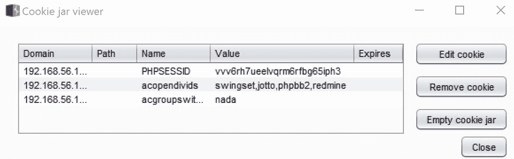

6.  选择列表中的最后一个 cookie，然后单击编辑 cookie 按钮。将数值从`nada`修改为`thisIsMyCookie`，然后点击确定，如下所示：

7.  该值现在已更改，如下所示：

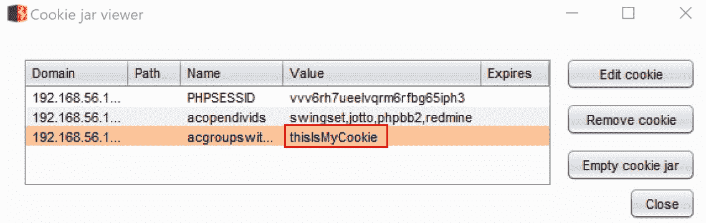

8.  Burp Cookie Jar 的默认作用域是 Proxy 和 Spider。但是，您可以扩展范围以包括其他工具。单击中继器的复选框，如下所示：

现在，如果您创建一个新的会话处理规则并使用默认的 Burp Cookie Jar，您将看到请求中使用的 Cookie 的新值。

# 它是如何工作的。。。

会话处理规则在针对目标应用程序自动化请求时使用 Burp Cookie Jar 进行 Cookie 处理。在这个配方中，我们查看了 Cookie 罐，了解了它的内容，甚至修改了捕获的 Cookie 的一个值。使用默认 Burp Cookie Jar 的任何后续会话处理规则都将在请求中看到修改后的值。

# 添加很棒的 pentester 插件

作为 web 应用程序测试人员，您将找到方便的工具添加到您的曲目中，以提高评估效率。Burp 社区提供了许多精彩的扩展。在本食谱中，我们将添加两个选项，并解释它们如何使您的评估更好。Retire.js 和软件漏洞扫描器是两个插件，这两个插件与被动扫描器一起使用。

注意：这两个插件都需要 Burp Professional 版本。

# 准备

使用 OWASP Mutilliae II 应用程序，我们将添加两个方便的扩展，帮助我们在目标中发现更多漏洞。

# 怎么做。。。

1.  切换到 Burp Extender 选项卡。去 BApp 商店找到两个插件-`Retire.js`和`Software Vulnerability Scanner`。单击每个插件的安装按钮，如下所示：

2.  安装这两个插件后，转到 Extender 选项卡，然后是 Extensions，然后是 Burp Extensions 部分。确保两个插件都启用了复选框内的复选标记。另外，请注意软件漏洞扫描程序有一个新选项卡，如下所示：

3.  返回 Firefox 浏览器并浏览 Mutillidae 主页。通过右键单击并选择被动扫描此分支，执行轻量级、侵入性较小的被动扫描，如下所示：

4.  注意从这两个插件创建的其他发现。`Vulners`插件是软件漏洞扫描工具，它发现了大量 CVE 问题，并且`Retire.js`确定了 jQuery 易受攻击版本的五个实例，如下所示：

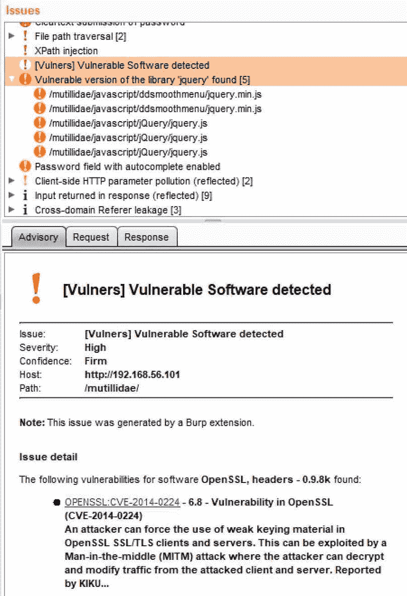

# 它是如何工作的。。。

Burp 功能可以通过 PortSwigger API 进行扩展，以创建自定义扩展，也称为插件。在此配方中，我们安装了两个插件，用于帮助识别应用程序中包含的具有已知漏洞的旧版本软件。

# 通过手动扫描问题扩展创建新问题

虽然 Burp 提供了 web 应用程序中常见的许多安全漏洞的列表，但有时您会发现问题，需要创建自定义扫描查找。这可以使用手动扫描问题扩展来完成。

注意：此插件需要 Burp Professional 版本。

# 准备

使用 OWASP Mutillidae II 应用程序，我们将添加手动扫描问题扩展，创建显示查找的步骤，然后使用扩展创建自定义问题。

# 怎么做。。。

1.  切换到 Burp Extender 选项卡。去 BApp 商店，找到标有`Manual Scan Issues`的插件。单击安装按钮：

2.  返回 Firefox 浏览器并浏览 Mutillidae 主页。
3.  切换到 Burp Proxy | HTTP history 选项卡，找到您刚才在浏览主页时提出的请求。单击响应选项卡。请注意，过于详细的服务器头指示 web 服务器类型和版本以及所使用的操作系统和编程语言。攻击者可以使用此信息对技术堆栈进行指纹识别，并识别可利用的漏洞：

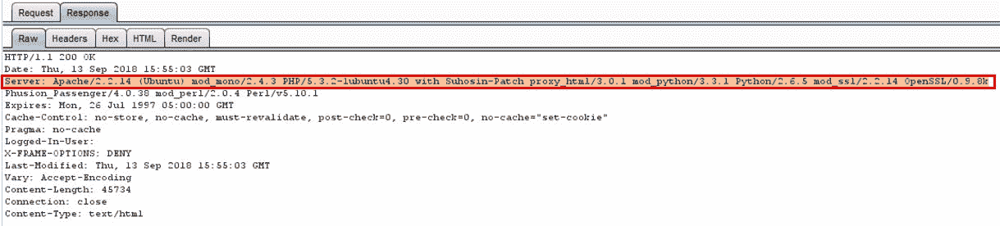

4.  由于这是一个查找，我们需要手动创建一个新问题，以便为我们的报告捕获它。查看请求时，右键单击并选择添加问题，如下所示：

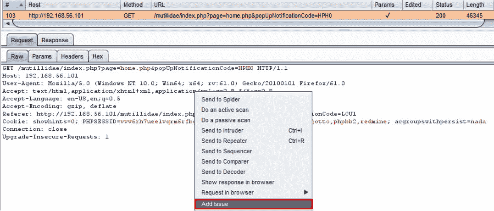

5.  此时会出现一个弹出对话框。在“常规”选项卡中，我们可以创建一个新的发行名称`Information Leakage in Server Response`。显然，您可以在问题细节、背景和补救方面添加更多的措辞，如下所示：

6.  如果我们切换到 HTTP 请求选项卡，我们可以将消息编辑器中的请求选项卡的内容复制并粘贴到文本区域，如下所示：

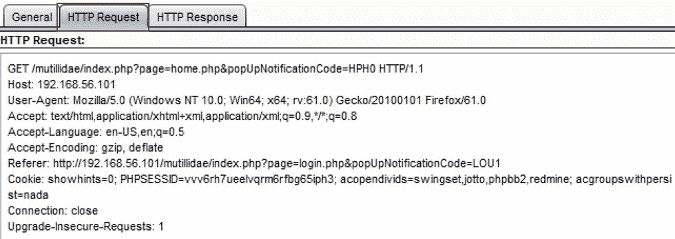

7.  如果我们切换到 HTTP 响应选项卡，我们可以将消息编辑器中的响应选项卡的内容复制并粘贴到文本区域。
8.  完成后，返回到“常规”选项卡并单击“导入查找”按钮。您应该看到新创建的扫描问题添加到问题窗口中，如下所示：

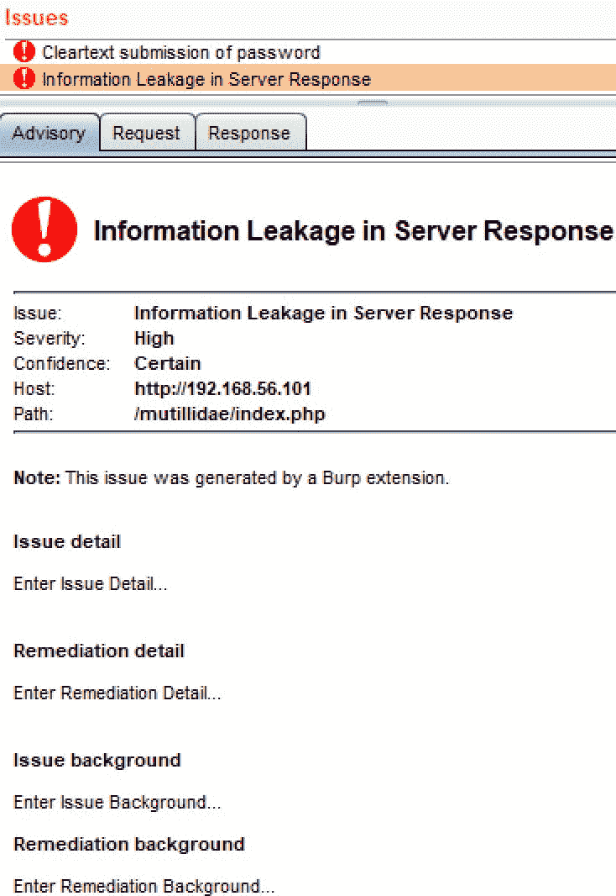

# 它是如何工作的。。。

如果 Burp 核心问题列表中没有问题，测试人员可以使用手动扫描问题扩展创建自己的问题。在这个配方中，我们为服务器响应中的信息泄漏创建了一个问题。

# 另见

有关 Burp 识别的所有问题定义的列表，请转至[https://portswigger.net/kb/issues](https://portswigger.net/kb/issues) 。

# 使用活动的 Scan++扩展

一些扩展可以帮助查找具有特定有效负载的漏洞，如 XML，或者帮助查找隐藏的问题，如缓存中毒和 DNS 重新绑定。在此配方中，我们将添加一个名为**active Scan++**的活动扫描程序扩展，它有助于识别这些更专门的漏洞。

注意：此插件需要 Burp Professional 版本。

# 准备

使用 OWASP Mutillidae II 应用程序，我们将添加活动扫描++扩展，然后对目标运行活动扫描。

# 怎么做。。。

1.  切换到 Burp Extender | BApp Store 并选择`Active Scan++`分机。单击“安装”按钮安装扩展，如下所示：

2.  返回 Firefox 浏览器并浏览 Mutillidae 主页。

3.  切换到 Burp Target 页签，然后切换到 Site map 页签，右键点击`mutillidae`文件夹，选择 Active scan this branch，如下所示：

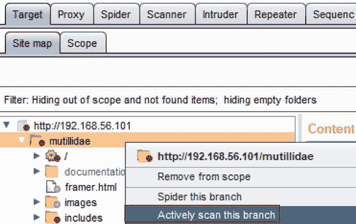

4.  当“活动扫描向导”出现时，您可以保留默认设置并单击“下一步”按钮，如下所示：

按照提示操作，然后单击“确定”开始扫描过程。

5.  活动扫描程序完成后，浏览至“问题”窗口。记下新添加的扩展发现的任何其他问题。您始终可以通过查找此问题找到的扩展是由 Burp extension:Active Scan++消息生成的，如下所示：

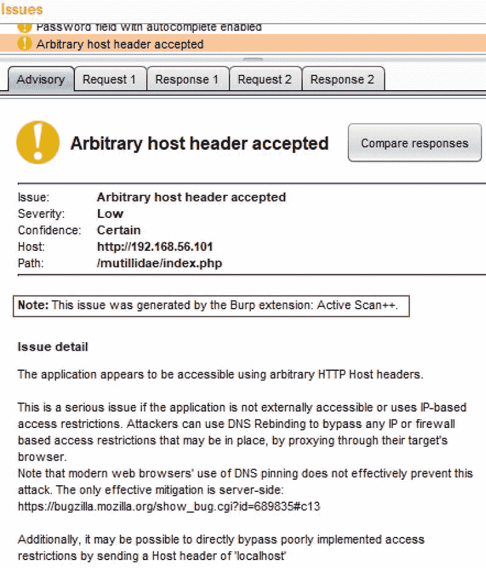

# 它是如何工作的。。。

通过使用扩展，Burp 功能可以扩展到核心发现之外。在此配方中，我们安装了一个插件，该插件扩展了活动扫描仪功能，以帮助识别其他问题，如任意标头注入，如本配方中所示。