# 十一、实现高级主题攻击

在本章中，我们将介绍以下配方：

*   执行**XML 外部实体**（**XXE**攻击
*   使用**JSON 网络令牌**（**JWT**）
*   使用 Burp 合作者确定**服务器端请求伪造**（**SSRF**）
*   测试**跨源资源共享**（**CORS**）
*   执行 Java 反序列化攻击

# 介绍

本章涵盖了从中级到高级的主题，如处理 JWT、XXE 和 Java 反序列化攻击，以及如何使用 Burp 来帮助进行此类评估。对于一些高级攻击，Burp 插件在简化测试人员所需的任务方面提供了巨大的帮助。

# 软件工具要求

为了完成本章中的食谱，您需要以下内容：

*   OWASP**破网应用**（**BWA**）
*   多天线链路
*   Burp 代理社区或专业人员（[https://portswigger.net/burp/](https://portswigger.net/burp/) ）

# 执行 XXE 攻击

XXE 是一个针对解析 XML 的应用程序的漏洞。攻击者可以使用任意命令操纵 XML 输入，并将这些命令作为 XML 结构中的外部实体引用发送。然后，XML 由配置较弱的解析器执行，从而为攻击者提供请求的资源。

# 准备

使用 OWASP Mutillidae II XML 验证程序页面，确定应用程序是否容易受到 XXE 攻击。

# 怎么做。。。

1.  导航到 XML 外部实体注入页面，即通过 Others | XML 外部实体注入| XML 验证程序：

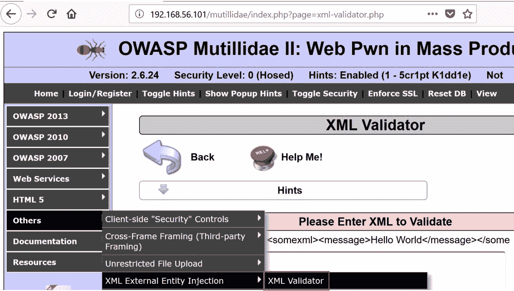

2.  在 XML 验证程序页面上，执行该页面上提供的示例 XML。单击“验证 XML”按钮：

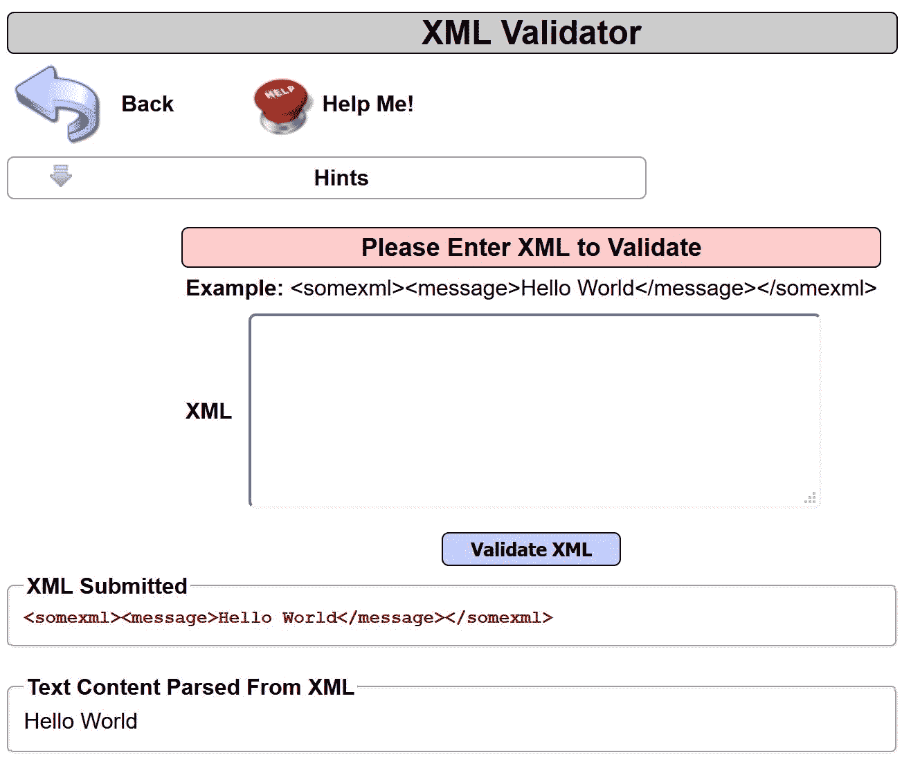

3.  切换到 Burp Proxy | HTTP history 选项卡，查找您刚刚提交的验证 XML 的请求。右键单击并将请求发送到中继器：


4.  注意`xml`参数中提供的值：


5.  使用 Burp Proxy Interceptor 将此 XML 参数值替换为以下有效负载。这个新的有效负载将向操作系统上的一个文件发出一个请求，该文件应该被限制查看，即`/etc/passwd`文件：

```
<?xml version="1.0"?>
    <!DOCTYPE change-log[
        <!ENTITY systemEntity SYSTEM "../../../../etc/passwd">
    ]>
    <change-log>
        <text>&systemEntity;</text>
    </change-log>
```

因为新的 XML 消息中有奇怪的字符和空格，所以让我们在 Decoder 部分中键入此负载，并对其进行 URL 编码，然后再将其粘贴到`xml`参数中。

6.  切换到解码器部分，在文本区域键入或粘贴新的有效负载。单击“编码为…”按钮并从下拉列表中选择 URL 选项。然后，使用*Ctrl*+*C*复制 URL 编码的有效负载。通过向右滚动，确保复制所有有效负载：


7.  切换到 Burp Proxy Intercept 选项卡。使用 Intercept is on（截取打开）按钮打开截取器。
8.  返回 Firefox 浏览器并重新加载页面。当请求暂停时，用新的 URL 编码的有效负载替换`xml`参数的当前值：

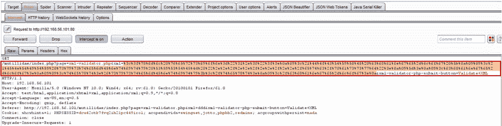

9.  单击“前进”按钮。通过将按钮切换到 Intercept 处于关闭状态来关闭 interceptor。
10.  注意，返回的 XML 现在显示了`/etc/passwd`文件的内容！XML 解析器允许我们访问操作系统上的`/etc/passwd`文件：


# 它是如何工作的。。。

在此配方中，不安全的 XML 解析器在 XML 中接收驻留在服务器上的`/etc/passwd`文件的请求。由于配置较弱的解析器，因此不会对 XML 请求执行任何验证，因此会将资源免费提供给攻击者。

# 与 JWT 合作

随着越来越多的站点提供客户端 API 访问，JWT 通常用于身份验证。这些令牌持有与目标站点上授予用户访问权限的资源相关的标识和声明信息。Web 渗透测试人员需要阅读这些标记并确定它们的强度。幸运的是，有一些方便的插件使在 Burp 中使用 JWT 令牌变得更加容易。我们将在本食谱中了解这些插件。

# 准备

在这个配方中，我们需要生成 JWT 令牌。因此，我们将使用**OneLogin**软件协助完成此任务。要完成此配方，请浏览 OneLogin 网站：[https://www.onelogin.com/](https://www.onelogin.com/) 。单击顶部的开发者链接，然后单击获取开发者帐户链接（[https://www.onelogin.com/developer-signup](https://www.onelogin.com/developer-signup) ）。

注册后，系统将要求您验证帐户并创建密码。请在开始此配方之前执行这些帐户设置任务。

使用 OneLogin SSO 帐户，我们将使用两个 Burp 扩展来检查站点分配为身份验证的 JWT 令牌。

# 怎么做。。。

1.  切换到 Burp BApp Store 并安装两个插件 JSON Beautifier 和 JSON Web 令牌：


2.  在 Firefox 浏览器中，转到 OneLogin 页面。URL 将特定于您创建的开发人员帐户。使用在开始此配方之前设置帐户时建立的凭据登录帐户：


3.  切换到 Burp Proxy | HTTP 历史记录选项卡。使用 URL`/access/auth`查找 POST 请求。右键单击并单击“发送到中继器”选项。
4.  您的主机值将特定于您设置的 OneLogin 帐户：


5.  切换到 Repeater（中继器）选项卡，请注意，您还有两个与您安装的两个扩展相关的选项卡：


6.  单击 JSON 美化器选项卡，以更可读的方式查看 JSON 结构：


7.  单击 JSON Web 令牌选项卡以显示与[中可用的调试器非常相似的调试器 https://jwt.io.](https://jwt.io) 此插件允许您阅读声明内容并操作各种暴力测试的加密算法。例如，在下面的屏幕截图中，请注意如何将算法更改为**nOnE**，以便尝试创建新的 JWT 令牌以放入请求中：

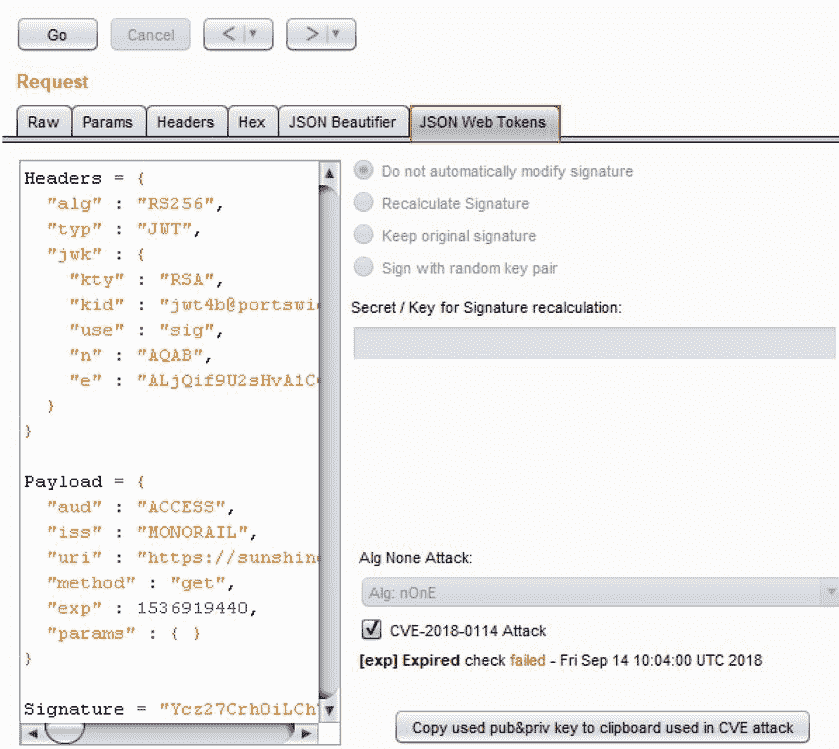

# 它是如何工作的。。。

两个扩展，JSON Beautifier 和 JSON Web 令牌，通过提供 Burp UI 方便可用的调试器工具，帮助测试人员以更简单的方式使用 JWT 令牌。

# 使用 Burp 合作者确定 SSRF

SSRF 是一个漏洞，允许攻击者强制应用程序代表攻击者发出未经授权的请求。这些请求可以像 DNS 查询一样简单，也可以像来自攻击者控制的服务器的命令一样疯狂。

在此配方中，我们将使用 Burp Collaborator 检查 SSRF 请求可用的开放端口，然后使用入侵者确定应用程序是否将通过 SSRF 漏洞对公共 Burp Collaborator 服务器执行 DNS 查询。

# 准备

使用 OWASP Mutillidae II DNS 查找页面，确定应用程序是否存在 SSRF 漏洞。

# 怎么做。。。

1.  切换到 Burp 项目选项|杂项选项卡。请注意 Burp Collaborator 服务器部分。您可以选择使用私人 Burp Collaborator 服务器，您可以设置该服务器，也可以使用 PortSwigger 提供的可公开访问 internet 的服务器。对于此配方，我们将使用公共配方：


2.  选中标有“通过未加密 HTTP 进行轮询”的框，然后单击“运行状况检查…”按钮：


3.  出现一个弹出框来测试各种协议，以查看它们是否将连接到 internet 上可用的公共 Burp Collaborator 服务器。

4.  检查每个协议的消息以查看哪些协议成功。完成后，单击关闭按钮：

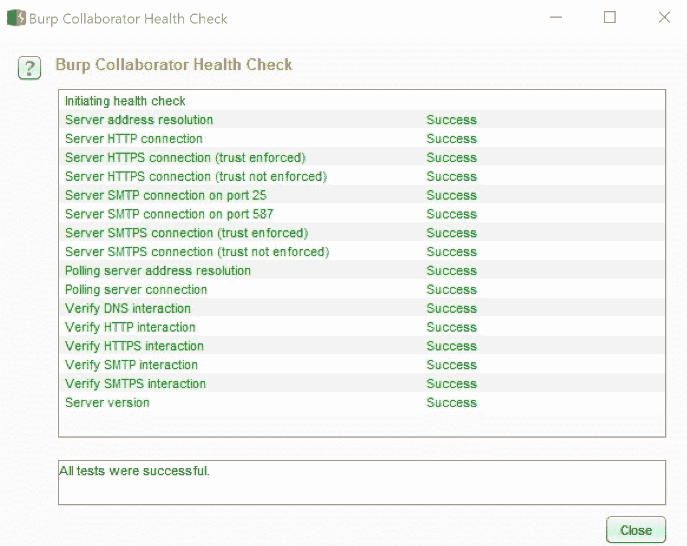

5.  从顶级菜单中，选择 Burp | Burp Collaborator client：

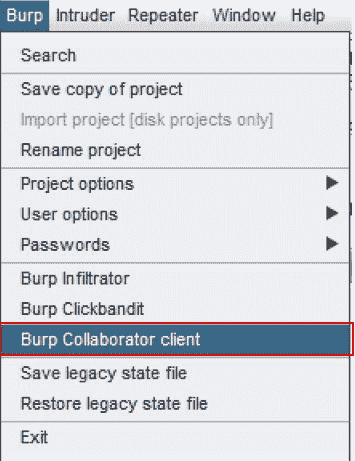

6.  此时会出现一个弹出框。在标记为“生成协作者有效载荷”的部分中，将 1 更改为 10：


7.  单击“复制到剪贴板”按钮。保留所有其他默认设置。不要关闭 Collaborator 客户端窗口。如果关闭窗口，将丢失客户端会话：


8.  返回 Firefox 浏览器并导航至 OWASP 2013 | A1–注入（其他）| HTML 注入（HTMLi）| DNS 查找：

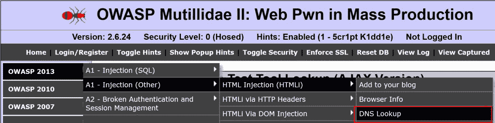

9.  在 DNS 查找页面上，键入 IP 地址并单击查找 DNS 按钮：


10.  切换到 Burp Proxy | HTTP history 选项卡，并在 DNS 查找页面上找到刚刚创建的请求。右键单击并选择发送到入侵者选项：


11.  切换到 Burp 入侵者|位置选项卡。清除所有建议的有效负载标记并突出显示 IP 地址，单击*添加§*按钮在`target_host`参数的 IP 地址值周围放置有效负载标记：


12.  切换到 Burp 入侵者|有效载荷选项卡，并使用粘贴按钮将从 Burp Collaborator 客户端复制到剪贴板的 10 个有效载荷粘贴到有效载荷选项[简单列表]文本框中：

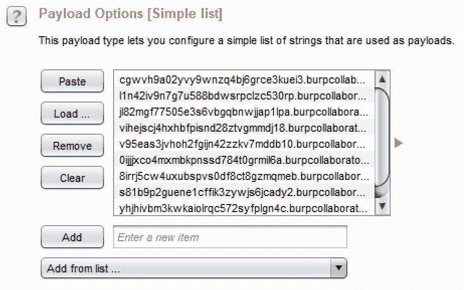

确保取消选中有效负载编码复选框。

13.  单击开始攻击按钮。在处理有效负载时，将弹出攻击结果表。允许攻击完成。注意，`burpcollaborator.net`URL 位于`target_host`参数的有效负载标记位置：


14.  返回 Burp Collaborator 客户端并单击“立即轮询”按钮，查看是否有任何 SSRF 攻击通过任何协议成功。如果有任何请求泄漏到网络之外，这些请求将与使用的特定协议一起显示在此表中。如果此表中显示了任何请求，则需要将 SSRF 漏洞报告为查找结果。从这里显示的结果可以看出，应用程序代表攻击者提供的有效负载进行了大量 DNS 查询：


# 它是如何工作的。。。

网络泄漏和过于慷慨的应用程序参数可使攻击者让应用程序代表攻击者通过各种协议进行未经授权的调用。在这种情况下，应用程序允许 DNS 查询泄漏到本地计算机外部并连接到 internet。

# 另见

有关 SSRF 攻击的更多信息，请参阅位于[的 PortSwigger 博客条目 https://portswigger.net/blog/cracking-the-lens-targeting-https-hidden-attack-surface](https://portswigger.net/blog/cracking-the-lens-targeting-https-hidden-attack-surface) 。

# 测试 CORS

实现 HTML5 CORS 的应用程序意味着该应用程序将与位于不同来源的另一个域共享浏览器信息。根据设计，浏览器保护可防止外部脚本访问浏览器中的信息。这种保护称为**同源政策**（**SOP**。然而，CORS 是一种允许绕过 SOP 的方法。如果应用程序希望与完全不同的域共享浏览器信息，则可以使用正确配置的 CORS 头来实现。

Web 渗透测试人员必须确保处理 AJAX 调用的应用程序（例如 HTML5）没有错误配置的 CORS 头。让我们看看 Burp 如何帮助我们识别这些错误配置。

# 准备

使用钢笔测试工具查找页面的 OWASP Mutillidae II AJAX 版本，确定应用程序是否包含配置错误的 CORS 头。

# 怎么做。。。

1.  导航到 HTML5 |异步 JavaScript 和 XML |笔测试工具查找（AJAX）：

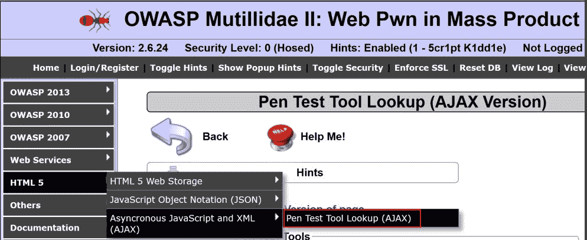

2.  从列表中选择一个工具，然后单击“查找工具”按钮：

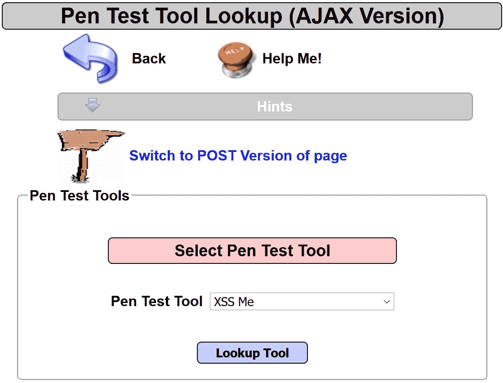

3.  切换到 Burp Proxy | HTTP history 选项卡，并从 AJAX 版本的 Pen 测试工具查找页面中查找您刚刚提出的请求。翻到响应选项卡：

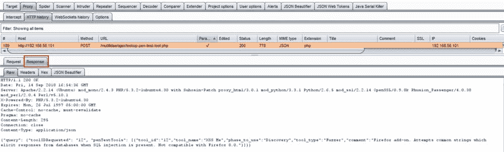

4.  让我们通过选择同一响应选项卡的 headers 选项卡来更仔细地检查标题。虽然这是一个 AJAX 请求，但调用是应用程序的本地调用，而不是跨源域调用。因此，不存在 CORS 标头，因为它不是必需的。但是，如果调用外部域（例如，Google API），则需要 CORS 头：

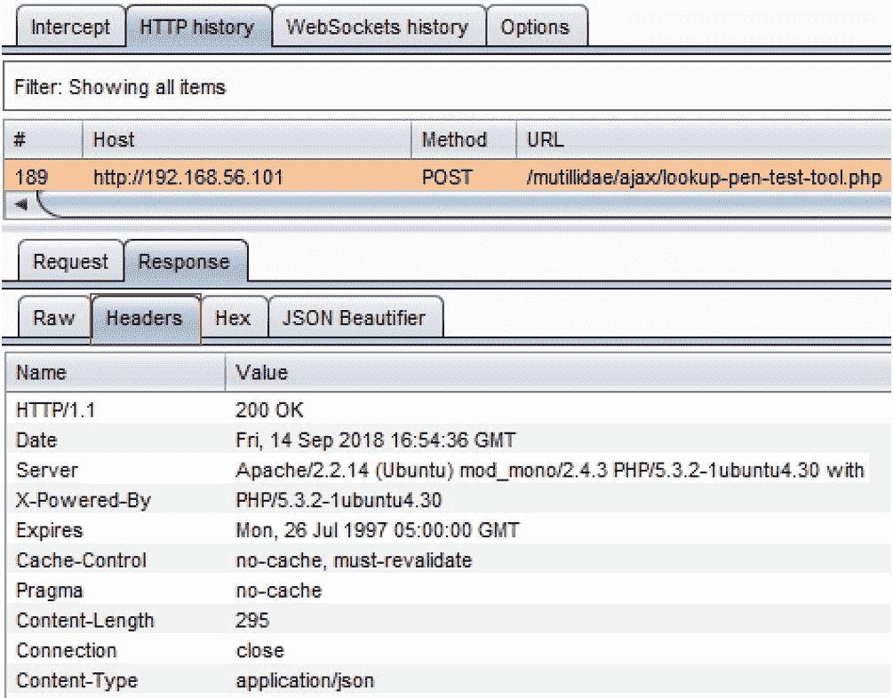

5.  在 AJAX 请求中，会调用外部 URL（例如，跨域）。为了允许外部域从用户的浏览器会话接收 DOM 信息，必须存在 CORS 头，包括`Access-Control-Allow-Origin: <name of cross domain>`。
6.  如果 CORS 标头未指定外部域的名称，而是使用通配符（`*`，则这是一个漏洞。Web pentesters 应将此作为错误配置的 CORS 标头漏洞包含在其报告中。

# 它是如何工作的。。。

由于此配方中使用的 AJAX 调用来自同一个地方，因此不需要 CORS 头。然而，在许多情况下，AJAX 调用是对外部域进行的，需要通过 HTTP 响应`Access-Control-Allow-Origin`头获得明确的权限。

# 另见

有关错误配置的 CORS 标题的更多信息，请参阅位于[的 PortSwigger 博客条目 https://portswigger.net/blog/exploiting-cors-misconfigurations-for-bitcoins-and-bounties](https://portswigger.net/blog/exploiting-cors-misconfigurations-for-bitcoins-and-bounties) 。

# 执行 Java 反序列化攻击

**序列化**是各种语言提供的一种机制，允许以二进制格式保存对象的状态。它用于速度和模糊处理。将对象从二进制转换回对象是反序列化。在对象内使用用户输入和随后将对象序列化的情况下，它创建用于任意代码注入和可能的远程代码执行的攻击向量。我们将研究一个 Burp 扩展，它将帮助 web 渗透测试人员评估应用程序的 Java 反序列化漏洞。

# 准备

使用 OWASP Mutillidae II 和手工编制的序列化代码片段，我们将演示如何使用**Java Serial Killer Burp**扩展来帮助执行 Java 反序列化攻击。

# 怎么做。。。

1.  切换到 Burp BApp Store 并安装 Java Serial Killer 插件：

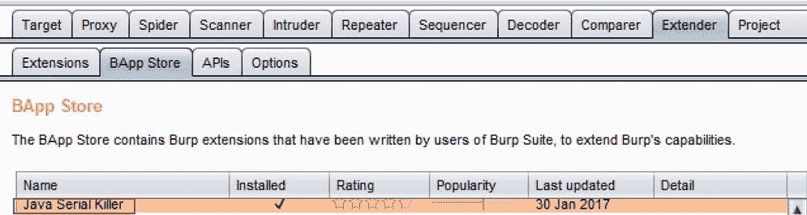

为了使用序列化对象创建场景，我们将接受一个标准请求并向其中添加一个序列化对象，以演示如何使用扩展将攻击者控制的命令添加到序列化对象。

2.  请注意，添加到 Burp UI 菜单顶部的新选项卡专用于新安装的插件。
3.  导航到 Mutillidae 主页。

4.  切换到 Burp Proxy | HTTP history 选项卡，通过浏览 Mutillidae 主页查找您刚刚创建的请求：


不幸的是，Mutillidae 中没有任何序列化对象，因此我们必须自己创建一个。

5.  切换到 Decoder 选项卡并复制序列化对象的以下片段：

```
AC ED 00 05 73 72 00 0A 53 65 72 69 61 6C 54 65
```

6.  将十六进制数字粘贴到“解码器”选项卡中，单击“编码为…”。。。按钮，然后选择 base 64：


7.  从 Decoder 选项卡复制 base-64 编码值，并将其粘贴到发送到 Java Serial Killer 选项卡的请求的底部。使用*Ctrl*+*C*复制出解码器，*Ctrl*+*V*将其粘贴到请求的空白区域的任意位置：

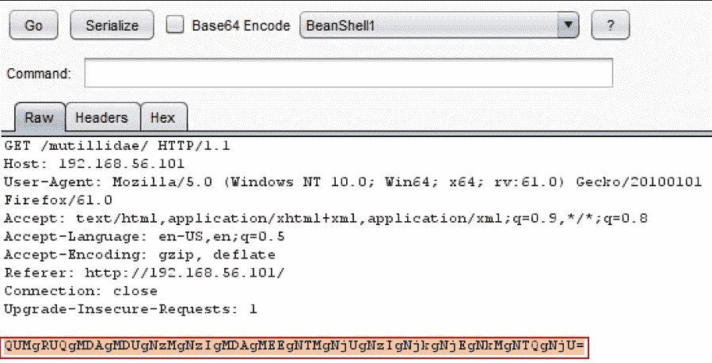

8.  在 Java Serial Killer 选项卡中，从下拉列表中选择 Java 库。对于此配方，我们将使用 CommonCollections1。选中 Base64 编码框。添加要嵌入序列化对象的命令。在本例中，我们将使用 nslookup 127.0.0.1 命令。突出显示有效负载并单击序列化按钮：

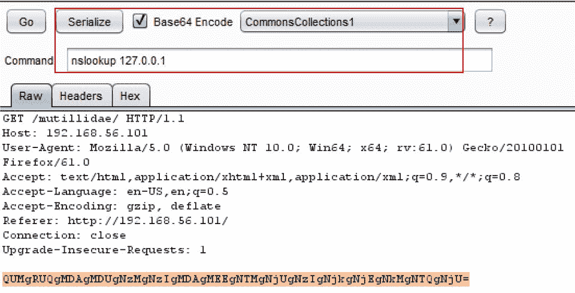

9.  单击 Serialize 按钮后，请注意有效负载已更改，现在包含您的任意命令，并且是 base-64 编码的：


10.  单击 Java Serial Killer 选项卡中的 Go 按钮以执行有效负载。尽管您可能会在响应中收到错误，但理想情况下，您会有一个侦听器，例如`tcpdump`，侦听端口`53`上的任何 DNS 查找。从侦听器中，您将看到对您在`nslookup`命令中指定的 IP 地址的 DNS 查询。

# 它是如何工作的。。。

如果应用程序代码直接将用户输入接收到对象中，而没有对这些输入执行清理，则攻击者有机会提供任意命令。然后，输入被序列化并在应用程序所在的操作系统上运行，从而为远程代码执行创建一个可能的攻击向量。

# 还有更多。。。

由于此配方方案有点做作，您可能无法在网络侦听器上收到对`nslookup`命令的响应。下载具有已知 Java 反序列化漏洞的应用程序（即 Jenkins、JBoss）的易受攻击版本后，请重试该方法。重复使用此处显示的相同步骤，仅更改目标应用程序。

# 另见

*   有关真实 Java 反序列化攻击的更多信息，请查看以下链接：
    *   **赛门铁克**：[https://www.symantec.com/security_response/attacksignatures/detail.jsp?asid=30326](https://www.symantec.com/security_response/attacksignatures/detail.jsp?asid=30326)
    *   **毛地黄安保**：[https://foxglovesecurity.com/2015/11/06/what-do-weblogic-websphere-jboss-jenkins-opennms-and-your-application-have-in-common-this-vulnerability/](https://foxglovesecurity.com/2015/11/06/what-do-weblogic-websphere-jboss-jenkins-opennms-and-your-application-have-in-common-this-vulnerability/)
*   要了解更多关于这个 Burp 插件的信息，请查看[https://blog.netspi.com/java-deserialization-attacks-burp/](https://blog.netspi.com/java-deserialization-attacks-burp/)