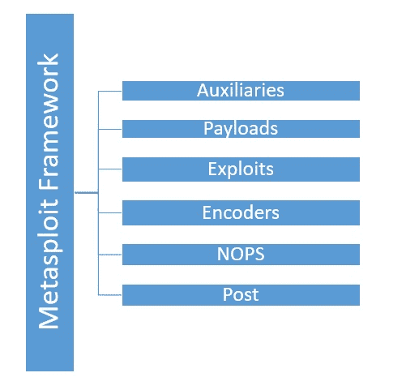
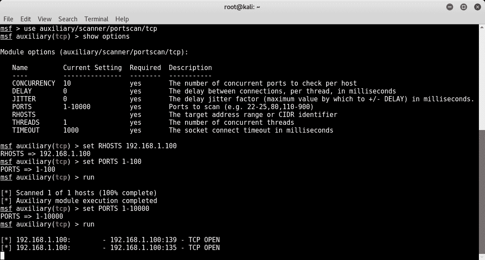
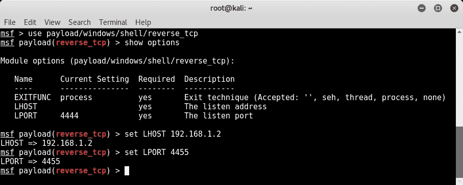
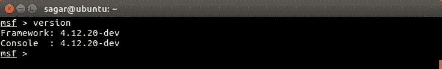
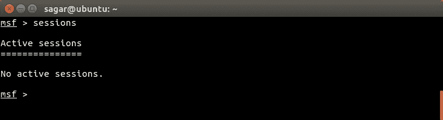
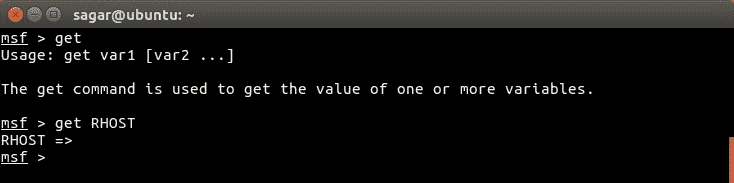
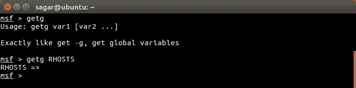

# 三、Metasploit 组件和环境配置

对于我们用来执行特定任务的任何工具，从内到外了解该工具总是很有帮助的。对该工具的详细了解使我们能够恰当地使用它，使其发挥最大的能力。现在，您已经了解了 Metasploit 框架及其安装的一些基本知识，在本章中，您将了解 Metasploit 框架的结构以及 Metasploit 生态系统的各个组件。本章将介绍以下主题：

*   后裂体的解剖与结构
*   Metasploit 组件--辅助设备、漏洞利用、编码器、有效负载和 post
*   msfconsole 和通用命令入门
*   配置本地和全局变量
*   更新框架

# 后裂体的解剖与结构

了解 Metasploit 结构的最佳方法是浏览其目录。当使用 Kali Linux 时，Metasploit 框架通常位于路径`/usr/share/metasploit-framework`，如以下屏幕截图所示：


大体上，Metasploit 框架结构如以下屏幕截图所示：



Metasploit 框架有一个非常清晰和定义良好的结构，框架内的工具/实用程序根据它们在渗透测试生命周期的各个阶段的相关性进行组织。在阅读本书的过程中，我们将使用这些类别中的工具/实用程序。

在下一节中，我们将简要概述所有 Metasploit 组件。

# 变质碎屑成分

Metasploit 框架根据其在渗透测试阶段的作用，有各种组件类别。以下各节将详细了解每个组件类别的职责。

# 辅助设备

到目前为止，您已经了解到 Metasploit 是一个完整的渗透测试框架，而不仅仅是一个工具。当我们称之为框架时，它意味着它由许多有用的工具和实用程序组成。Metasploit 框架中的辅助模块只不过是执行特定任务（在我们的渗透测试生命周期范围内）的一小段代码。例如，您可能需要执行验证特定服务器的证书是否已过期的简单任务，或者您可能希望扫描子网并检查是否有任何 FTP 服务器允许匿名访问。使用 Metasploit 框架中的辅助模块可以很容易地完成这些任务。

Metasploit 框架中有 1000 多个辅助模块，分布在 18 个类别中。

下表显示了 Metasploit 框架中存在的各类辅助模块：

| `gather` | `pdf` | `vsploit` |
| `bnat` | `sqli` | `client` |
| `crawler` | `fuzzers` | `server` |
| `spoof` | `parser` | `voip` |
| `sniffer` | `analyze` | `dos` |
| `docx` | `admin` | `scanner` |

不要被 Metasploit 框架中存在的大量辅助模块弄得不知所措。您可能不需要单独了解每个模块。您只需要在所需的上下文中搜索正确的模块并相应地使用它。现在我们将了解如何使用辅助模块。

在本书中，我们将根据需要使用许多不同的辅助模块；但是，让我们从一个简单的例子开始：

1.  打开终端窗口，使用命令`msfconsole`启动 Metasploit。
2.  选择`auxiliary`模块`portscan/tcp`对目标系统进行端口扫描。
3.  使用`show`命令，列出运行此辅助模块需要配置的所有参数。
4.  使用`set RHOSTS`命令，设置目标系统的 IP 地址。
5.  使用`set PORTS`命令，选择要在目标系统上扫描的端口范围。
6.  使用`run`命令，使用前面配置的参数执行辅助模块。

您可以在以下屏幕截图中看到前面提到的所有命令的使用情况：



# 功绩

利用漏洞是 Metasploit 框架中最重要的部分。漏洞攻击是一段实际的代码，它将使您能够访问目标系统。基于支持该漏洞利用的平台，有 2500 多个漏洞利用分布在 20 多个类别中。现在，您可能会想，在这么多可用的漏洞中，哪一个是需要使用的呢。只有在对目标进行广泛的枚举和脆弱性评估后，才能决定对目标使用特定的攻击。（参见[第 1 章](06.html)、*Metasploit 及配套工具介绍*中渗透测试生命周期一节）。对目标进行适当的枚举和漏洞评估将为我们提供以下信息，我们可以根据这些信息选择正确的攻击：

*   目标系统的操作系统（包括确切版本和体系结构）
*   打开目标系统上的端口（TCP 和 UDP）
*   服务以及目标系统上运行的版本
*   特定服务易受攻击的概率

下表显示了 Metasploit 框架中可用的各种类型的漏洞利用：

| **Linux** | **视窗** | **Unix** | **OS X** | **苹果 iOS** |
| `irix` | `mainframe` | `freebsd` | `solaris` | `bsdi` |
| `firefox` | `netware` | `aix` | `android` | `dialup` |
| `hpux` | `jre7u17` | `wifi` | `php` | `mssql` |

在接下来的章节中，我们将了解如何对易受攻击的目标使用漏洞攻击。

# 编码器

在任何给定的实际渗透测试场景中，我们攻击目标系统的尝试很可能会被目标系统上存在的某种安全软件检测/注意到。这可能会危及我们访问远程系统的所有努力。这正是编码器救援的时候。编码器的工作是混淆我们的漏洞和有效载荷，使其不被目标系统上的任何安全系统所察觉。

下表显示了 Metasploit 框架中可用的各种编码器类别：

| `generic` | `mipsbe` | `ppc` |
| `x64` | `php` | `mipsle` |
| `cmd` | `sparc` | `x86` |

在接下来的章节中，我们将更详细地介绍编码器。

# 有效载荷

为了理解有效载荷的作用，让我们考虑一个真实的例子。某国某部队研制的新型导弹,其射程可达 500 公里,速度极快。现在，导弹弹体本身没有用处，除非它装满了正确的弹药。现在，该部队决定在导弹内装载高爆炸性材料，以便当导弹击中目标时，导弹内的爆炸性材料爆炸并对敌人造成所需的伤害。因此，在这种情况下，导弹内的高爆炸性物质就是有效载荷。有效载荷可以根据导弹发射后造成的损害的严重程度进行更改。

类似地，Metasploit 框架中的有效负载允许我们决定一旦利用成功，将在目标系统上执行什么操作。以下是 Metasploit 框架中可用的各种有效负载类别：

*   **单件**：有时也称为内联或非分段有效载荷。此类有效载荷是一个完全独立的攻击单元，需要外壳代码，这意味着它们拥有攻击目标上漏洞所需的一切。这种有效载荷的缺点是其尺寸。由于它们包含完整的漏洞利用和外壳代码，因此有时会非常庞大，在具有大小限制的特定场景中变得毫无用处。
*   **Stagers**：在某些情况下，有效载荷的大小非常重要。即使只有一个额外字节的有效负载也可能无法在目标系统上正常工作。stagers 有效载荷在这种情况下很方便。stagers 有效载荷只是在攻击系统和目标系统之间建立连接。它没有利用目标系统上的漏洞所需的外壳代码。由于体积非常小，它非常适合许多场景。
*   **阶段**：一旦阶段式有效载荷在攻击系统和目标系统之间建立了连接，则“阶段”有效载荷将下载到目标系统上。它们包含利用目标系统上的漏洞进行攻击所需的外壳代码。

以下屏幕截图显示了可用于从受损 Windows 系统获取反向 TCP 外壳的示例有效负载：



在接下来的章节中，您将学习如何使用各种有效负载和漏洞利用。

# 邮递

**post**模块包含各种脚本和实用程序，帮助我们在成功利用漏洞后进一步渗透到目标系统。一旦我们成功利用漏洞并进入目标系统，攻击后模块可以通过以下方式帮助我们：

*   升级用户权限
*   转储操作系统凭据
*   窃取 cookie 和保存的密码
*   从目标系统获取密钥日志
*   执行 PowerShell 脚本
*   让我们的访问持久化

下表显示了 Metasploit 框架中可用的各类“post”模块：

| **Linux** | **视窗** | **OS X** | **思科** |
| Solaris | 火狐 | 艾克斯 | 安卓 |
| 多个 | 拉链 | 动力壳 |  |

Metasploit 框架有 250 多个此类利用后实用程序和脚本。在接下来的章节中，当我们讨论更多关于后开发技术时，我们将使用其中的一些。

# 玩 msfconsole

现在我们已经对 Metasploit 框架的结构有了基本的了解，让我们实际地开始学习`msfconsole`的基础知识。

`msfconsole`只是 Metasploit 框架的一个简单命令行界面。尽管`msfconsole`一开始可能有点复杂，但它是与 Metasploit 框架交互的最简单、最灵活的方式。在本书的整个过程中，我们将使用`msfconsole`与 Metasploit 框架进行交互。

一些 Metasploit 版本确实提供 GUI 和基于 web 的界面。但是，从学习的角度来看，始终建议您掌握 Metasploit 框架的命令行控制台，即`msfconsole`。

让我们看看一些`msfconsole`命令：

*   `banner`命令：`banner`命令是一个非常简单的命令，用于显示 Metasploit 框架标题信息。此信息通常包括其版本详细信息以及当前安装版本中可用的漏洞利用、辅助设备、有效负载、编码器和 nops 生成器的数量。

其语法为`msf> banner`。下面的屏幕截图显示了`banner`命令的使用：


*   `version`命令：`version`命令用于检查当前 Metasploit Framework 安装的版本。您可以访问以下网站查看 Metasploit 官方发布的最新版本：
    [https://github.com/rapid7/metasploit-framework/wiki/Downloads-by-Version](https://github.com/rapid7/metasploit-framework/wiki/Downloads-by-Version)

其语法为`msf> version`。下面的屏幕截图显示了`version`命令的使用：



*   `connect`命令：Metasploit 框架中的`connect`命令提供了与 putty 客户端或 netcat 类似的功能。您可以使用此功能进行快速端口扫描或获取端口标题。

其语法为`msf> connect <ip:port>`。下面的屏幕截图显示了`connect`命令的使用：


*   `help`命令：顾名思义，`help`命令提供了有关 Metasploit 框架中任何命令用法的附加信息。

其语法为`msf> help`。下面的屏幕截图显示了`help`命令的使用：


*   `route`命令：`route`命令用于添加、查看、修改或删除网络路由。这用于高级场景中的旋转，我们将在本书后面介绍。

其语法为`msf> route`。下面的屏幕截图显示了`route`命令的使用：


*   `save`命令：有时，在复杂的目标环境中执行渗透测试时，Metasploit 框架中会进行大量配置更改。现在，如果渗透测试需要在稍后的时间点再次恢复，那么从头开始重新配置 Metasploit 框架将非常痛苦。`save`命令将所有配置保存到一个文件中，并在下次启动时加载，从而保存所有重新配置工作。

其语法为`msf>save`。下面的屏幕截图显示了`save`命令的使用：


*   `sessions`命令：一旦我们的目标被成功利用，我们通常会在目标系统上获得一个 shell 会话。如果我们同时处理多个目标，那么可能会同时打开多个会话。Metasploit 框架允许我们在需要时在多个会话之间切换。`sessions`命令列出了当前与各种目标系统建立的所有活动会话。

其语法为`msf>sessions`。下面的屏幕截图显示了`sessions`命令的使用：



*   `spool`命令：就像任何应用都有调试日志来帮助调试错误一样，`spool`命令将所有输出与控制台一起打印到用户定义的文件中。以后可以根据需求分析输出文件。

其语法为`msf>spool`。下面的屏幕截图显示了`spool`命令的使用：


*   `show`命令：`show`命令用于显示 Metasploit 框架内的可用模块，或在使用特定模块时显示附加信息。

其语法为`msf> show`。下面的屏幕截图显示了`show`命令的使用：


*   `info`命令：`info`命令用于显示 Metasploit 框架内特定模块的详细信息。例如，您可能希望查看有关 MeterMeter 有效负载的信息，例如受支持的架构 ia 以及执行此操作所需的选项：

其语法为`msf> info`。下面的屏幕截图显示了`info`命令的使用：


*   `irb`命令：`irb`命令从 Metasploit 框架内调用交互式 Ruby 平台。交互式 Ruby 平台可用于创建和调用定制脚本，通常在开发后阶段使用。

其语法为`msf>irb`。下面的屏幕截图显示了`irb`命令的使用：


*   `makerc`命令：当我们使用 Metasploit 框架对目标进行 pen 测试时，我们会发出很多命令。在作业或那个特定的会话结束时，我们可能想回顾一下我们通过 Metasploit 执行的所有活动。`makerc`命令只是将特定会话的所有命令历史记录写入用户定义的输出文件。

其语法为`msf>makerc`。下面的屏幕截图显示了`makerc`命令的使用：


# Metasploit 中的变量

对于我们在 Metasploit 框架中使用的大多数漏洞，我们需要为一些变量设置值。以下是 Metasploit 框架中一些常见且最重要的变量：

| **变量名** | **变量说明** |
| `LHOST` | 本地主机：此变量包含攻击者系统的 IP 地址，即发起攻击的系统的 IP 地址。 |
| `LPORT` | 本地端口：此变量包含攻击者系统的（本地）端口号。当我们期望利用漏洞提供反向 shell 时，通常需要这样做。 |
| `RHOST` | 远程主机：此变量包含目标系统的 IP 地址。 |
| `RPORT` | 远程端口：此变量包含我们将攻击/利用的目标系统上的端口号。例如，为了利用远程目标系统上的 FTP 漏洞，RPORT 将设置为 21。 |

*   `get`命令：`get`命令用于检索 Metasploit 框架内特定局部变量中包含的值。例如，您可能希望查看为特定攻击设置的目标系统的 IP 地址。

其语法为`msf>get`。下面的屏幕截图显示了`msf> get`命令的使用：



*   `getg`命令：`getg`命令与`get`命令非常相似，只是它返回包含在全局变量中的值。

其语法为`msf> getg`。下面的屏幕截图显示了`msf> getg`命令的使用：



*   `set`和`setg`命令：`set`命令为 Metasploit 框架内的一个（本地）变量（如`RHOST`、`RPORT`、`LHOST`和`LPPORT`分配一个新值。但是，`set`命令为变量分配一个对有限会话/实例有效的值。`setg`命令永久性地为（全局）变量分配一个新值，以便在需要时可以重复使用。

其语法是：

```
msf> set <VARIABLE> <VALUE>
msf> setg <VARIABLE> <VALUE>
```

我们可以在下面的屏幕截图中看到`set`和`setg`命令：


*   `unset`和`unsetg`命令：`unset`命令只是通过`set`命令清除先前存储在（本地）变量中的值。`unsetg`命令通过`setg`命令清除先前存储在（全局）变量中的值：

语法是：

```
msf> unset<VARIABLE>
msf> unsetg <VARIABLE>
```

我们可以在下面的屏幕截图中看到`unset`和`unsetg`命令：


# 更新 Metasploit 框架

Metasploit 框架由 Rapid 7 提供商业支持，拥有一个非常活跃的开发社区。几乎每天都会在各种系统中发现新的漏洞。对于任何此类新发现的漏洞，您很有可能在 Metasploit 框架中获得随时可用的漏洞。然而，为了跟上最新的漏洞和利用漏洞的情况，保持 Metasploit 框架的更新是很重要的。您可能不需要每天更新框架（除非您非常积极地参与渗透测试）；但是，您可以将每周更新作为目标。

Metasploit 框架提供了一个名为`msfupdate`的简单实用程序，它连接到相应的在线存储库并获取更新：


# 总结

在本章中，我们已经了解了 Metasploit 框架的结构和一些常见的控制台命令。在下一章中，我们将实际开始使用 Metasploit 框架在目标系统上执行信息收集和枚举。要在 Metasploit 框架中使用大多数模块，请记住以下顺序：

1.  使用`use`命令选择所需的 Metasploit 模块。
2.  使用`show options`命令列出执行所选模块所需的所有变量。
3.  使用`set`命令设置所需变量的值。
4.  使用`run`命令使用前面配置的变量执行模块。

# 练习

您可以尝试以下练习：

*   浏览 Metasploit 框架的目录结构
*   尝试本章中讨论的一些常见控制台命令
*   将 Metasploit 框架更新至最新可用版本