# 五、使用 Metasploit 搜索漏洞

在上一章中，您学习了各种信息收集和枚举技术。现在我们已经收集了有关目标系统的信息，是时候检查目标系统是否易受攻击，以及我们是否可以在实际中利用它了。在本章中，我们将介绍以下主题：

*   设置 Metasploit 数据库
*   漏洞扫描与利用
*   从 Metasploit 内执行 NMAP 和 Nessus 扫描
*   使用 Metasploit 辅助工具进行漏洞检测
*   使用`db_autopwn`自动开发
*   探索 Metasploit 的后期开发功能

# 管理数据库

到目前为止，我们已经看到，Metasploit 框架是各种工具、实用程序和脚本的紧密耦合集合，可用于执行复杂的渗透测试任务。在执行这些任务时，会以某种形式生成大量数据。从框架的角度来看，必须安全地存储所有数据，以便在需要时可以高效地重用。默认情况下，Metasploit 框架在后端使用 PostgreSQL 数据库来存储和检索所有必需的信息。

现在，我们将了解如何与数据库交互以执行一些琐碎的任务，并确保在开始渗透测试活动之前正确设置数据库。

对于初始设置，我们将使用以下命令设置数据库：

```
root@kali :~# service postgresql start
```

此命令将在 Kali Linux 上启动 PostgreSQL 数据库服务。在开始使用`msfconsole`命令之前，这是必需的：

```
root@kali :~# msfdb init 
```

此命令将启动 Metasploit Framework 数据库实例，是一次性活动：


`db_status`：一旦我们启动了 PostgreSQL 服务并启动了`msfdb`，我们就可以开始使用`msfconsole`：

```
msf> db_status
```

`db_status`命令将告诉我们后端数据库是否已成功初始化并与`msfconsole`连接：

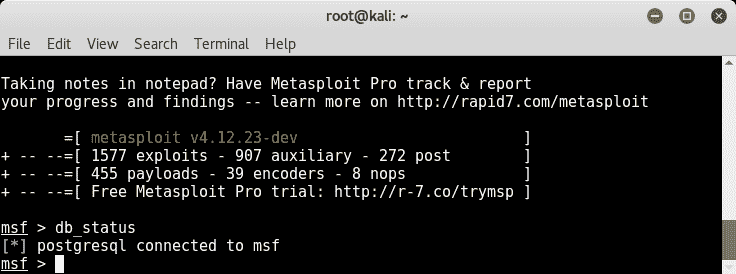

# 工作空间

假设您正在同时为不同的客户机执行多个渗透测试任务。您当然不希望来自不同客户端的数据混合在一起。理想的方法是创建逻辑分区来存储每个分配的数据。Metasploit 框架中的工作区有助于我们实现这一目标。

下表显示了与管理工作空间相关的一些常用命令：

| **序号** | **命令** | **目的** |
| 1. | `workspace` | 这将列出 Metasploit 框架中以前创建的所有工作区 |
| 2. | `workspace -h` | 此列表列出了与`workspace`命令相关的所有开关的帮助 |
| 3. | `workspace -a <name>` | 这将使用指定的`name`创建一个新的工作区 |
| 4. | `workspace -d <name>` | 这将删除指定的工作区 |
| 5. | `workspace <name>` | 这会将工作区的上下文切换到指定的名称 |

以下屏幕截图显示了`workspace`命令与各种开关的用法：


# 导入扫描

我们已经知道 Metasploit 框架的通用性以及它与其他工具的集成程度。Metasploit 框架提供了一个非常有用的功能，可以从其他工具（如 NMAP 和 Nessus）导入扫描结果。如以下屏幕截图所示，`db_import`命令可用于将扫描导入 Metasploit 框架：


*   `hosts`命令：很可能我们已经对整个子网执行了 NMAP 扫描，并将扫描导入 Metasploit Framework 数据库。现在，我们需要检查扫描期间发现哪些主机处于活动状态。如以下屏幕截图所示，`hosts`命令列出了扫描和导入过程中发现的所有主机：


*   `services`命令：一旦 NMAP 扫描结果导入数据库，我们就可以查询数据库，过滤出我们可能感兴趣利用的服务。带有适当参数的`services`命令，如下图所示，查询数据库并过滤掉服务：

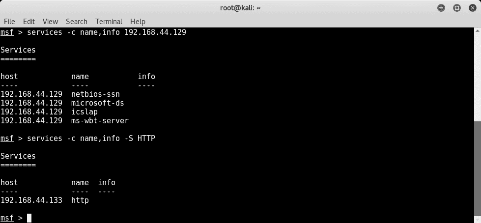

# 备份数据库

假设您使用 Metasploit 框架在一项复杂的渗透测试任务上工作了很长时间。现在，由于一些不幸的原因，您的 Metasploit 实例崩溃并无法启动。在一个新的 Metasploit 实例上从头开始返工将是非常痛苦的！这就是 Metasploit 框架中的备份选项的作用所在。如下面的屏幕截图所示，`db_export`命令将数据库中的所有数据导出到外部 XML 文件。

然后，您可以保护导出的 XML 文件的安全性，以防发生故障后需要恢复数据：

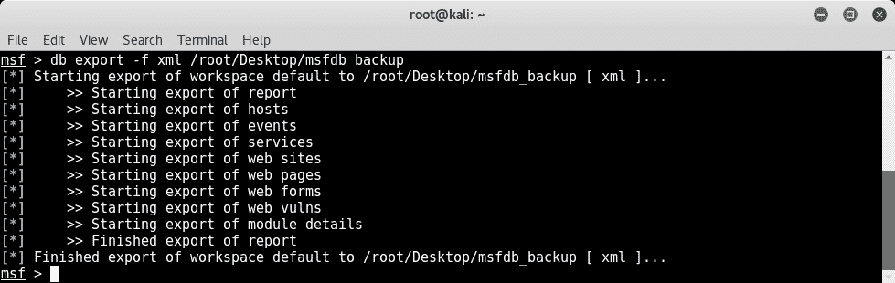

# NMAP

NMAP 是网络映射器的首字母缩写，是一种非常先进的工具，可用于以下目的：

*   主机发现
*   服务检测
*   版本枚举
*   漏洞扫描
*   防火墙测试与绕过

NMAP 是一个有数百个参数可供配置的工具，完全涵盖它超出了本书的范围。但是，下表将帮助您了解一些最常用的 NMAP 开关：

| **序号** | **NMAP 开关** | **目的** |
| 1. | `-sT` | 执行连接（TCP）扫描 |
| 2. | `-sU` | 执行扫描以检测打开的 UDP 端口 |
| 3. | `-sP` | 执行简单的 ping 扫描 |
| 4. | `-A` | 执行主动扫描（包括隐形 syn 扫描、操作系统和版本检测以及跟踪路由和脚本） |
| 5. | `-sV` | 执行服务版本检测 |
| 6. | `-v` | 打印详细输出 |
| 7. | `-p 1-1000` | 仅扫描范围为 1 到 1000 的端口 |
| 8. | `-O` | 执行操作系统检测 |
| 9 | `-iL <filename>` | 从`<filename>`中指定的文件扫描所有主机 |
| 10 | `-oX` | 以 XML 格式输出扫描结果 |
| 11 | `-oG` | 以灰色格式输出扫描结果 |
| 12 | `--script <script_name>` | 针对目标执行`<script_name>`中指定的脚本 |

例如：`nmap -sT -sV -O 192.168.44.129 -oX /root/Desktop/scan.xml`。

上面的命令将对 IP 地址`192.168.44.129`执行连接扫描，检测所有服务的版本，识别目标运行在哪个操作系统上，并将结果保存到路径`/root/Desktop/scan.xml`处的 XML 文件中。

# NMAP 扫描法

在上一节中，我们已经看到 Metasploit 框架提供了从 NMAP 和 Nessus 等工具导入扫描的功能。但是，也可以选择从 Metasploit 框架内启动 NMAP 扫描。这将立即将扫描结果存储在后端数据库中。

然而，这两种方法没有太大区别，只是个人选择的问题。

*   从`msfconsole`扫描：`db_nmap`命令，如以下屏幕截图所示，从 Metasploit 框架内启动 NMAP 扫描。扫描完成后，您可以简单地使用`hosts`命令列出扫描的目标。

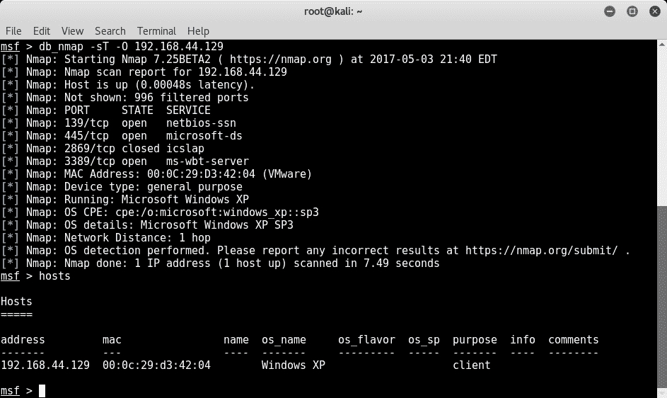

# 内苏斯

Nessus 是一种流行的脆弱性评估工具，我们已经在[第 1 章](06.html)、*Metasploit 简介和支持工具*中看到过。现在，将 Nessus 与 Metasploit 结合使用有两种选择，如下所示：

*   在目标系统上执行 Nessus 扫描，保存报告，然后使用本章前面讨论的`db_import`命令将其导入 Metasploit 框架
*   直接通过`msfconsole`加载、启动和触发目标系统上的 Nessus 扫描，如下一节所述

# 从 msfconsole 使用 Nessus 进行扫描

在使用 Nessus 开始新的扫描之前，在`msfconsole`中加载 Nessus 插件非常重要。加载插件后，您可以使用一对凭据连接到 Nessus 实例，如下一个屏幕截图所示。

在`msfconsole,`中加载`nessus`之前，请确保使用`/etc/init.d/nessusd start`命令启动 Nessus 守护进程。

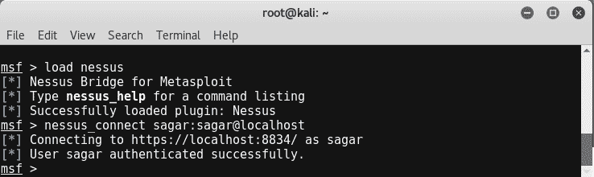

一旦`nessus`插件被加载，并且我们连接到`nessus`服务，我们需要选择我们将用于扫描目标系统的策略。可使用以下命令执行此操作：

```
msf> nessus_policy_list -
msf> nessus_scan_new <Policy_UUID>
msf> nessus_scan_launch <Scan ID>
```

您还可以在以下屏幕截图中看到这一点：


一段时间后，扫描完成，我们可以使用以下命令查看扫描结果：

```
msf> nessus_report_vulns <Scan ID>
```

您还可以在以下屏幕截图中看到这一点：


# 使用 Metasploit 辅助工具进行漏洞检测

我们在上一章中看到了各种辅助模块。Metasploit 框架中的一些辅助模块也可用于检测特定漏洞。例如，以下屏幕截图显示了检查目标系统是否易受 MS12-020 RDP 漏洞攻击的辅助模块：

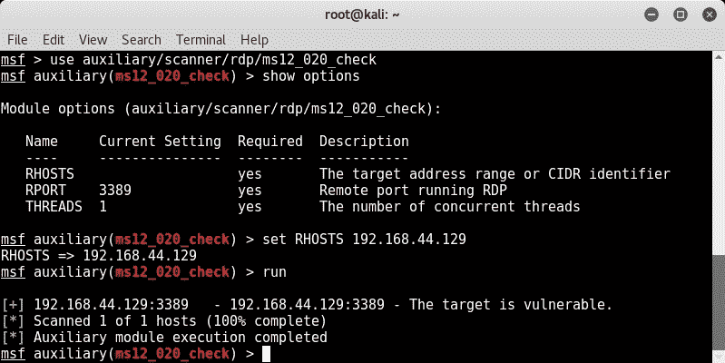

# 使用 db_autopn 自动利用漏洞

在上一节中，我们已经了解了 Metasploit 框架如何帮助我们从各种其他工具（如 NMAP 和 Nessus）导入扫描。现在，一旦我们将扫描结果导入数据库，下一个逻辑步骤将是查找与导入的扫描中的漏洞/端口匹配的漏洞利用。我们当然可以手动完成这项工作；例如，如果我们的目标是 Windows XP，并且它的 TCP 端口 445 处于打开状态，那么我们可以针对它测试`MS08_67 netapi`漏洞。

Metasploit 框架提供了一个名为`db_autopwn`的脚本，该脚本自动执行漏洞匹配过程，如果发现匹配，则执行适当的漏洞攻击，并为我们提供远程 shell。但是，在尝试此脚本之前，需要考虑以下几点：

*   `db_autopwn`脚本正式从 Metasploit 框架中降级。您需要显式下载并将其添加到 Metasploit 实例中。
*   这是一个资源非常密集的脚本，因为它尝试针对目标的所有漏洞排列和组合，从而使其非常嘈杂。
*   此脚本不再推荐用于任何生产系统的专业使用；但是，从学习的角度来看，您可以在实验室的任何测试机器上运行它。

以下是开始使用`db_autopwn`脚本的步骤：

1.  打开终端窗口，然后运行以下命令：

```
wget https://raw.githubusercontent.com
/jeffbryner/kinectasploit/master/db_autopwn.rb
```

2.  将下载的文件复制到`/usr/share/metasploit-framework/plugins`目录。
3.  重新启动`msfconsole`。
4.  在`msfconsole`中，键入以下代码：

```
msf> use db_autopwn
```

5.  使用以下命令列出匹配的漏洞：

```
msf> db_autopwn -p -t
```

6.  使用以下命令利用匹配的漏洞：

```
 msf> db_autopwn -p -t -e
```

# 实施漏洞利用

后攻击是渗透测试的一个阶段，我们对目标系统的访问有限（或完全），现在，我们希望搜索某些文件、文件夹、转储用户凭据、远程捕获屏幕截图、从远程系统转储击键、升级权限（如果需要），并尝试使我们的访问持久化。在本节中，我们将了解 MeterMeter，它是一种先进的有效负载，以其功能丰富的后期开发能力而闻名。

# 什么是流量计？

MeterMeter 是一种高级可扩展有效负载，它使用内存中的*DLL 注入。它显著提高了 Metasploit 框架的后期开发能力。通过通过 stager 套接字进行通信，它提供了广泛的客户端 Ruby API。MeterMeter 的一些显著特点如下：*

*   **隐身**：流量计完全驻留在受损系统的内存中，不向磁盘写入任何内容。它不会产生任何新的进程；它将自己注入到被破坏的过程中。它能够轻松地迁移到其他正在运行的进程。默认情况下，MeterMeter 通过加密通道进行通信。这从法医学的角度对受损系统留下了有限的痕迹。
*   **可扩展**：可在运行时添加功能，直接通过网络加载。可以向 MeterMeter 添加新功能，而无需重新构建。`meterpreter`有效载荷无缝运行，速度非常快。

下面的屏幕截图显示了我们利用 Windows XP 目标系统上的`ms08_067_netapi`漏洞获得的`meterpreter`会话。

在使用该漏洞之前，我们需要通过发出`use payload/windows/meterpreter/reverse_tcp`命令，然后设置 LHOST 变量的值来配置 MeterMeter 有效负载。


# 搜索内容

一旦我们破坏了我们的目标系统，我们可能想要寻找特定的文件和文件夹。这完全取决于渗透测试的背景和意图。MeterMeter 提供了一个搜索选项，可以在受损系统上查找文件和文件夹。以下屏幕截图显示了搜索位于 C drive 上的机密文本文件的搜索查询：


# 截屏

成功妥协后，我们可能想知道妥协后的系统上正在运行哪些活动和任务。截图可能会给我们一些有趣的信息，告诉我们受害者在那个特定时刻正在做什么。为了远程捕获受损系统的屏幕截图，我们执行以下步骤：

1.  使用`ps`命令列出目标系统上运行的所有进程及其 PID。
2.  定位`explorer.exe`过程，记录其 PID。
3.  将 MeterMeter 迁移到`explorer.exe`流程，如下图所示：

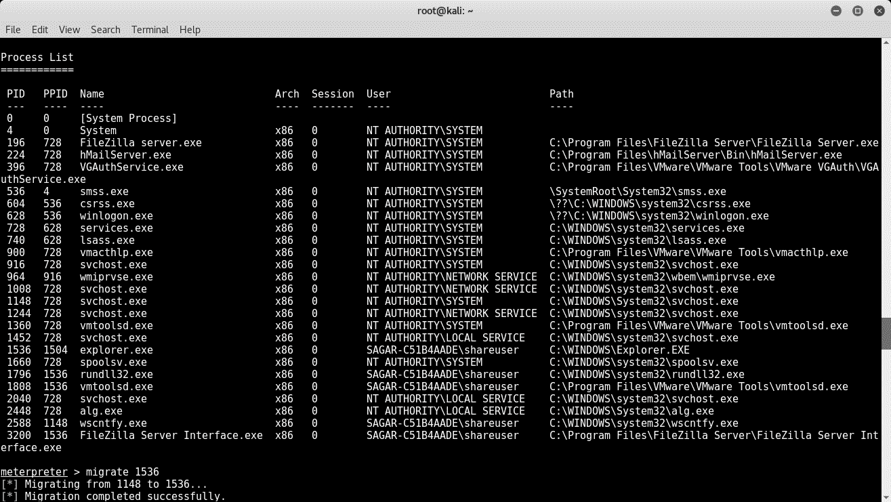

将 MeterMeter 迁移到`explorer.exe`后，加载`espia`插件，然后启动`screengrab`命令，如下图所示：

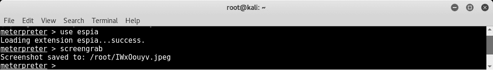

我们受损系统的屏幕截图已保存（如下所示），我们可以注意到受害者正在与 FileZilla 服务器交互：

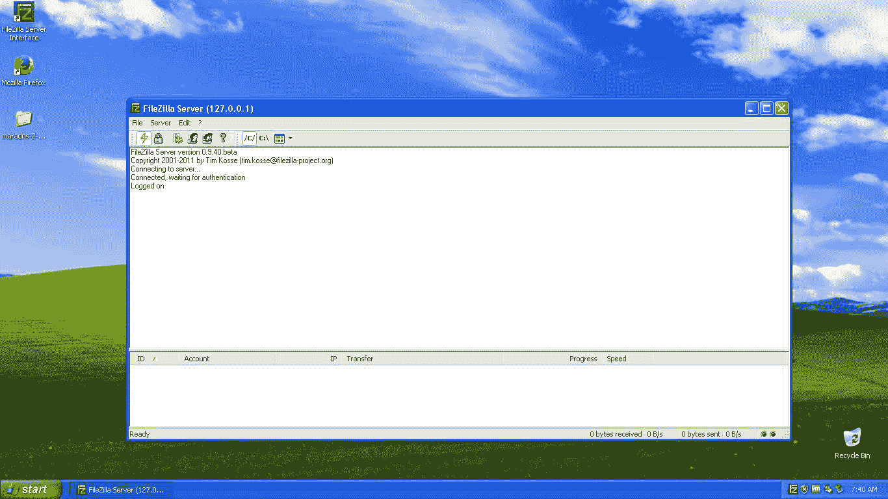

# 击键记录

除了屏幕截图，另一个非常有用的 MeterMeter 功能是键盘记录。MeterMeter 击键嗅探器将捕获受损系统上按下的所有键，并将结果转储到控制台上。`keyscan_start`命令用于在受损系统上启动远程按键记录，而`keyscan_dump`命令用于将所有捕获的按键输出到 Metasploit 控制台：

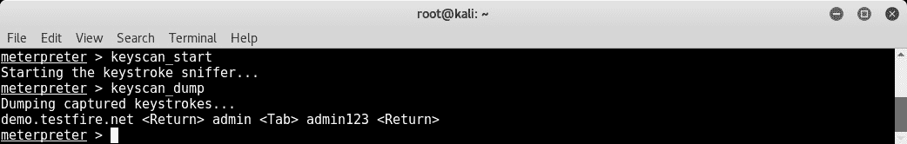

# 使用 JTR 转储散列和破解

Windows 在其 SAM 数据库中以加密格式存储用户凭据。一旦我们破坏了我们的目标系统，我们希望获得该系统上的所有凭据。如下图所示，我们可以使用`post/windows/gather/hashdump`辅助模块从远程系统转储密码散列：


一旦我们有了一堆凭证，下一步就是破解它们并检索明文密码。Metasploit 框架有一个辅助模块`auxiliary/analyze/jtr_crack_fast`，用于触发针对转储散列的密码破解程序。

完成后，模块将显示明文密码，如以下屏幕截图所示：

**jtr** is an acronym for **John the Ripper,** the most commonly used password cracker.

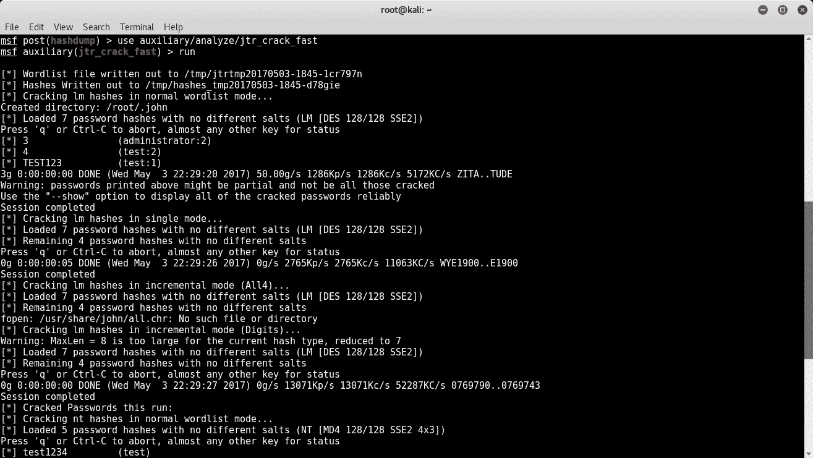

# Shell 命令

一旦我们成功利用该漏洞并获得 MeterMeter 访问权限，我们就可以使用`shell`命令获得对受损系统的命令提示访问权限（如下面的屏幕截图所示）。命令提示符访问将使您感觉好像在实际操作目标系统：

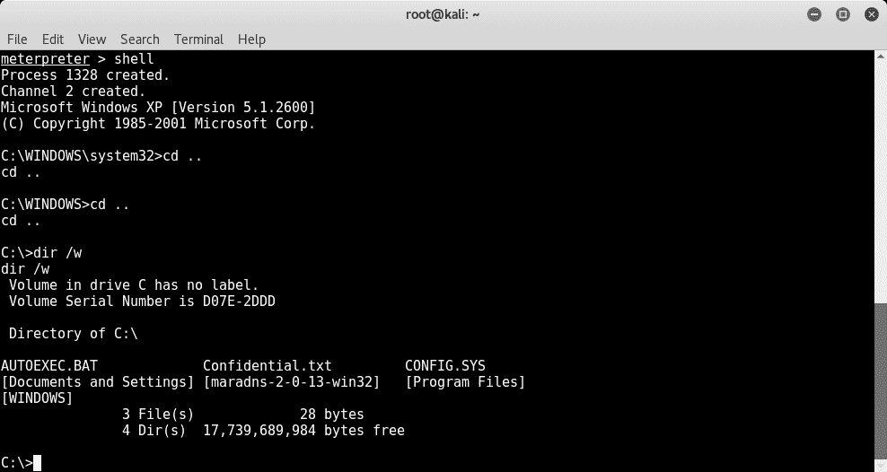

# 特权升级

我们可以利用漏洞获得远程计量器访问，但很可能我们对受损系统的权限有限。为了确保我们能够完全访问和控制受损系统，我们需要将权限提升为管理员权限。MeterMeter 提供升级权限的功能，如以下屏幕截图所示。首先，我们加载一个名为`priv`的扩展，然后使用`getsystem`命令升级权限。

然后，我们可以使用`getuid`命令验证我们的特权级别：


# 总结

在本章中，您学习了如何设置 Metasploit 数据库，然后探索了使用 NMAP 和 Nessus 进行漏洞扫描的各种技术。最后，我们了解了 Metasploit 框架的高级开发后功能。在下一章中，我们将了解 Metasploit 框架有趣的客户端开发特性。

# 练习

您可以尝试以下练习：

*   找出并尝试使用可用于漏洞检测的任何辅助模块
*   尝试探索除本章讨论的功能外，MeterMeter 的各种功能
*   试着找出`db_autopwn`是否有其他选择