# 六、将 Premist、Parcel 和批量提取器用于文件恢复和数据雕刻

现在，我们已经了解了如何创建证据的法医图像，让我们来看看使用 Premist、Parcel 和 Bulk Extractor 进行文件恢复和数据雕刻的过程。

当我们上次讨论文件系统时，我们看到各种操作系统使用它们自己的文件系统来存储、访问和修改数据。同样，存储媒体也使用文件系统来完成同样的任务。

元数据或关于数据的数据有助于操作系统识别数据。元数据包括技术信息，例如创建和修改日期以及数据的文件类型。这些数据使查找和索引文件变得更加容易。

文件雕刻使用特定特征（如文件结构和文件头）从未分配的空间检索数据和文件，而不是由文件系统创建或关联的传统元数据。

顾名思义，**未分配空间**是操作系统或文件表标记为空或未分配给任何文件或数据的存储介质区域。尽管文件的位置和相关信息不存在，有时甚至已损坏，但文件的页眉和页脚中仍然存在一些特征，可以识别文件甚至文件片段。

即使文件扩展名已更改或完全丢失，文件标题也包含可以识别文件类型的信息，并通过分析页眉和页脚信息尝试雕刻文件。数据雕刻是一个相当长的过程，应该使用自动化工具来节省时间。如果调查人员了解他们要查找的文件类型，以便更好地聚焦并节省时间，这也会有所帮助。然而，这是法医学，我们知道时间和耐心是关键。

在文件头中以十六进制格式显示的一些常见文件类型包括：

*   **联合摄影专家组****JPEG**：`FF D8 FF E0`
*   **便携文件格式**（**PDF**：`25 50 44 46`

在后面的章节中，我们将介绍更多关于文件和头的分析，让我们看看 Kali Linux 中用于数据雕刻的三种工具。

# 法医检验图像在 Parcel 和 Parcel 中的应用

对于该工具，使用了由 Nick Micus 创建的数字法医工具测试图像，专门用于测试数据雕刻工具。选择此特定图像进行此练习的主要原因之一是 Nick Mikus 被列为最重要的开发人员之一。正如最前面的第一行所示，它显示了与作者 Jesse Kornblum 和 Kris Kendall 一起的版本号。图片可在[免费下载 http://dftt.sourceforge.net/test11/index.html](http://dftt.sourceforge.net/test11/index.html) 。

一旦您熟悉了此练习，您可以尝试从该网站上的[上的其他图像中提取数据 http://dftt.sourceforge.net/](http://dftt.sourceforge.net/) 。

# 使用 Foremost 进行文件恢复和数据雕刻

Premist 是一个简单有效的 CLI 工具，通过读取文件的页眉和页脚来恢复文件。我们可以通过单击应用程序开始 Premist | 11 取证| Premist：


成功启动后，将打开一个终端，显示程序版本、创建者和一些开关以供使用：


要更好地了解最前面的内容和使用的开关，请尝试浏览最前面的`System Manager's Manual`。这可以通过输入以下命令来完成：

```
man foremost
```


使用的语法如下所示：

```
foremost -i (forensic image) -o (output folder) -options
```

在本例中，我们将位于桌面上的`11-carve-fat.dd`文件指定为输入文件（`-i`，并将名为`Foremost_recovery`的空文件夹指定为输出文件（`-o`。此外，还可以根据需要指定其他开关。

要开始用最前面的命令雕刻`11-carve-fat.dd`图像，我们在终端中键入以下命令：

```
foremost -i 11-carve-fat.dd -o Foremost_recovery
```


虽然在处理过程中发现的字符看起来很不清楚，但结果将在指定的输出文件夹中进行明确分类和汇总。

为了快速访问前面的一些命令，您还可以使用`foremost -h`。

指定的输出文件夹必须为空，否则会遇到问题，如以下屏幕截图所示：


# 查看最重要的结果

完成雕刻过程后，我们可以进入`Foremost_recovery`输出文件夹：

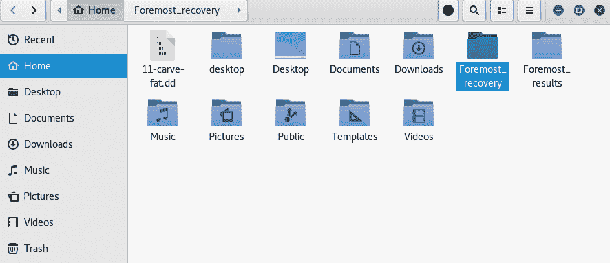

如果我们打开输出目录，我们可以看到按文件类型分类的雕刻项目以及一个`audit.txt`文件夹，其中包含发现的详细信息：


在`audit.text`文件中，我们看到了由 Frontest 找到的项目的列表视图，以及它们的`Sizes`和`File Offset`位置：

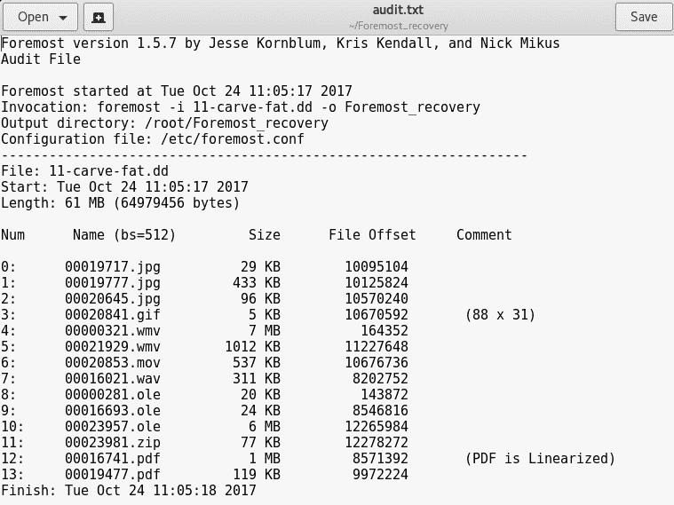

向下滚动`audit.txt`文件时，您应该会看到找到的文件摘要，这在雕刻较大图像时特别有用：


`audit.txt`文件中列出的前三个文件是`.jpg`图像文件，我们可以在`Foremost_recovery`输出文件夹中的`jpg`子文件夹中看到这些文件：

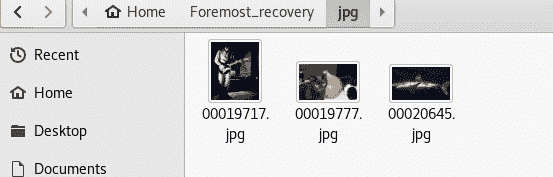

正如我们所看到的，最重要的是非常强大的数据恢复和文件雕刻工具。根据所用驱动器或图像的大小，文件雕刻可能需要很长时间。如果已经知道需要恢复的文件类型，则最好使用`-t`选项指定该类型的文件，以减少搜索整个图像所花费的时间。

再次运行之前，请记住选择新的或空的输出文件夹。

# 使用 Parcel 进行数据雕刻

Parcel 是对早期版本的“最重要”的改进。Parcel 旨在解决切割数据时 CPU 和 RAM 的高使用率问题。

# 在 Parcel 中指定文件类型

与最重要的不同，研究人员必须在 Parcel 配置文件中指定感兴趣的文件类型。此文件名为`scalpel.conf`，位于`etc/scapel/`：


要指定文件类型，调查员必须删除包含文件类型的行开头的注释，因为所有受支持的文件类型都会在文件类型开头用哈希标记注释掉。下面的屏幕截图显示了默认的 Parcel 配置文件（`scalpel.conf`，所有文件类型都已注释掉。请注意，每行都以一个 hashtag 开头：

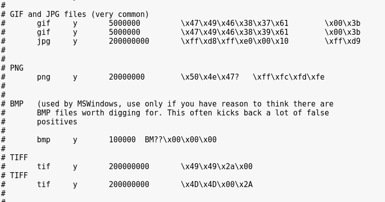

我们删除了一些行开头的哈希标记，让 Parcel 知道如何搜索这些特定的文件类型，这也减少了搜索所有支持的文件类型所需的时间。以下屏幕截图显示，随着注释被删除，Parcel 将搜索 GIF 和 JPG 文件：


在指定要雕刻的图像之前，请确保执行此步骤。如果不这样做，研究人员会收到一条有用的错误消息，提醒他们这样做。

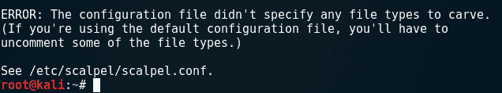

# 用 Parcel 雕刻锉刀

一旦我们修改了文件类型并保存了`scalpel.conf`文件，我们就可以通过点击侧栏上的“显示应用程序”按钮启动 Parcel，并在搜索框中输入`scalpel`，然后出现在屏幕顶部，如图所示。点击`scalpel`框开始：


一旦启动，就会打开一个终端，显示版本号（1.60）、作者（Golden G.Richard III），如前所述，表明它基于最前面的 0.69。如前所述，还显示 Parcel 使用语法和其他选项：

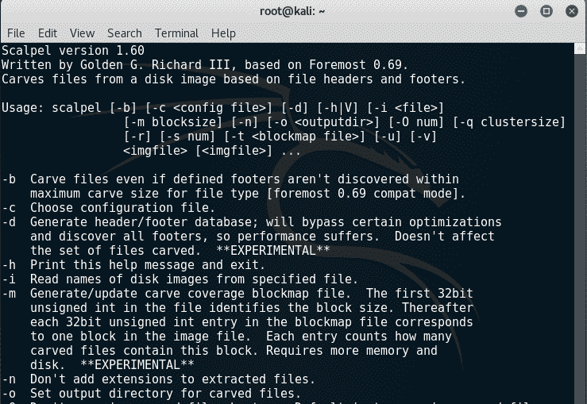

在本例中，使用了用于雕刻最前面（`11-carve-fat.dd`的相同图像。同样，必须指定输入文件和输出文件夹。要在 Parcel 中列出可用的选项和开关，请使用`scalpel -h`。

Parcel 中使用了以下语法：

```
scalpel -o scalpelOutput/ 11-carve-fat.dd
```


在前面的屏幕截图中，我们可以看到 Parcel 构建了一个雕刻列表，显示带有页眉和页脚信息的文件类型以及雕刻的文件数量。

仔细观察 Parcel 输出的最后几行，我们可以看到雕刻过程是`100%`完成的，雕刻的是`18`文件：


# 查看 Parcel 的结果

现在我们可以转到名为`ScalpelOutput`的输出文件夹来查看雕刻文件：

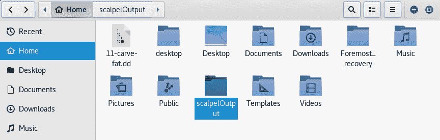

Parcel 输出的结果与最重要的结果类似，两个输出文件夹都包含带有雕刻文件的不同子文件夹，以及一个`audit.txt`文件，其中包含调查结果的详细信息：

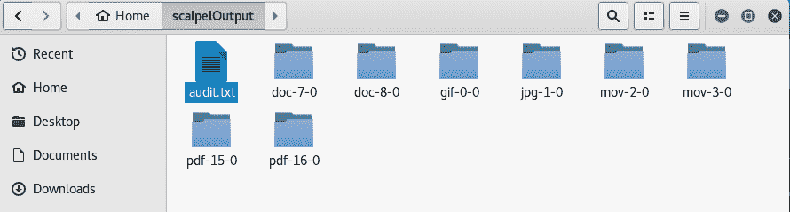

在`jpg-1-o`文件夹中，我们可以看到五个`.jpg`文件，其中三个带有实际图像：


尽管 Parcel 的结果显示，在工具运行时，在雕刻列表中识别出五个带有`.jpg`页眉和页脚的文件，但其中一些文件可能无法打开。这些文件很可能是误报：

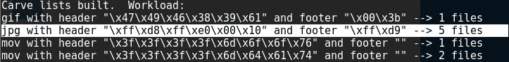

以下屏幕截图显示了`audit.txt`文件的片段，显示了有关雕刻文件的信息：

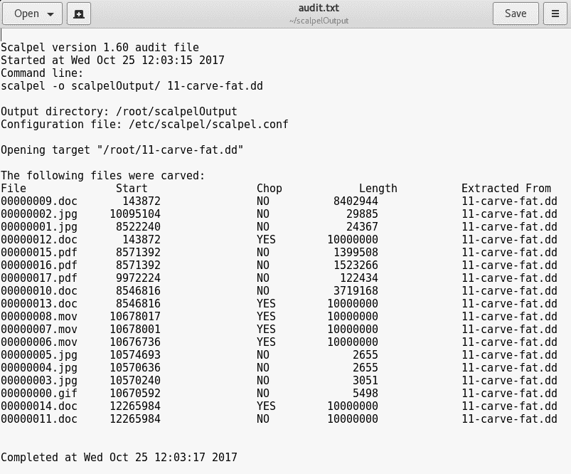

# 比较 Parcel 和 Parcel

虽然 Parcel 返回的文件比最前面的多，但请进行您自己的练习，比较最前面的和 Parcel 找到的雕刻文件。不幸的是，这两个工具返回的文件名不是原始文件名，在某些情况下，可能会有雕刻文件的副本，因为许多文件可能是碎片，看起来是单独的文件。试着手动浏览在 Foremost 和 Parcel 的输出文件夹中找到的文件，并进行您自己的比较研究，看看哪个工具更成功。

Forestone 和 Parcel 中使用的测试图像文件（`11-carve-fat.dd`包含 15 个不同类型的文件，如下载页面（[中所列 http://dftt.sourceforge.net/test11/index.html](http://dftt.sourceforge.net/test11/index.html) 。这在比较雕刻文件时应该很有用：

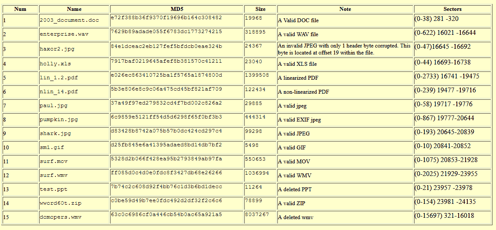

# 散装提取器

Bulk_ 提取器是我们将在本章中介绍的第三个也是最后一个工具。到目前为止，我们已经看到，最重要的和 Parcel 在文件恢复和雕刻方面非常出色，但仅限于特定的文件类型。为了进一步提取数据，我们可以使用批量提取器。

虽然 Premoments 和 Parcel 可以恢复图像、音频、视频和压缩文件，但 Bulk Extractor 可以提取在调查中非常有用的几种其他类型的信息。

尽管 Bulk Extractor 能够恢复和雕刻图像、视频和文档类型文件，但 Bulk Extractor 可以雕刻和提取的其他数据包括：

*   信用卡号码
*   电子邮件地址
*   网址
*   在线搜索
*   网站信息
*   社交媒体简介和信息

# 批量提取机的法医测试图像

在本例中，我们将使用名为`terry-work-usb-2009-12-11.E01`*的免费证据文件。*

该文件可直接从 digital corpora 网站下载，该网站允许将法医证据图像用于法医研究目的。本练习中使用的文件可直接从[下载 http://downloads.digitalcorpora.org/corpora/scenarios/2009-m57-patents/drives-redacted/](http://downloads.digitalcorpora.org/corpora/scenarios/2009-m57-patents/drives-redacted/)

所需文件是下载页面上的最后一个文件，大小仅为 32 MB：


# 使用散装提取器

启动批量提取器，首先输入`bulk_extractor -h`显示一些常用参数和选项：

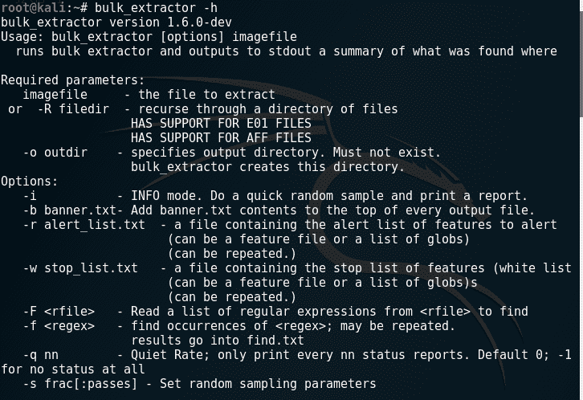

与 Premist 和 Parcel 一样，使用`bulk_extractor`的语法非常简单，需要指定输出文件夹（`-o`和法医图像。对于本练习，如前所述，我们将从`terry-work-usb-2009-12-11.E01`图像中提取数据，并将输出保存到名为`bulk-output`的文件夹中。

使用的语法如下所示：

```
bulk_extractor -o bulk_output terry-work-usb-2009-12-11.E01
```


一旦完成，`bulk_extractor`表示所有线程都已完成，并提供过程摘要，甚至一些发现。如下图所示，`bulk_extractor`显示 MD5 散列、已处理的总 MB，甚至报告已发现三种电子邮件功能：


# 查看批量 _ 提取器的结果

要查看`bulk_extractor`的输出和结果，我们还可以通过键入`ls -l`来显示终端内的目录列表。我们可以看到`bulk_output`文件夹是由`bulk_extractor`创建的：


我们现在可以通过键入`ls -l bulk_output`来列出输出文件夹（`bulk_output`的内容：

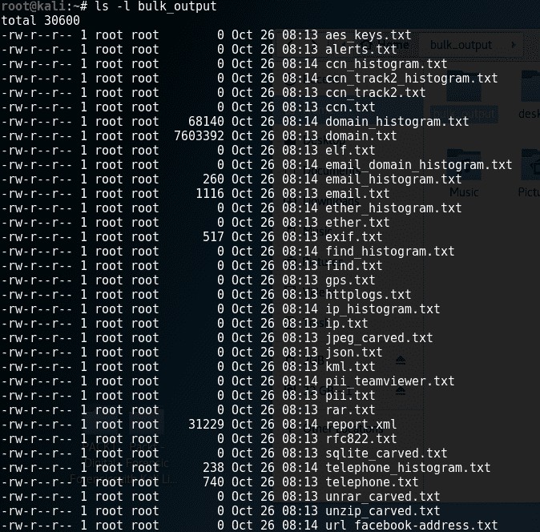

该列表被一分为二，以显示`bulk_extractor`发现的一些工件：


应该注意的是，并非所有列出的文本文件都包含数据。只有文本文件名左边的数字大于`0`的文件才真正包含数据。

文本文件`ccn.txt`是**信用卡号**的缩写，其中包含的信用卡信息可能已被窃取、非法使用或存储，并可能意图进行信用卡欺诈。

如果浏览到输出文件夹位置，则可以查看各个文本文件中的所有提取数据。查看`telephone_histogram.txt`文件显示电话号码：

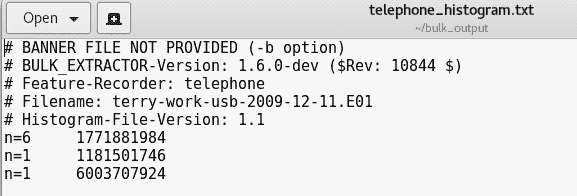

`url.txt`文件显示了许多访问过的网站和链接：

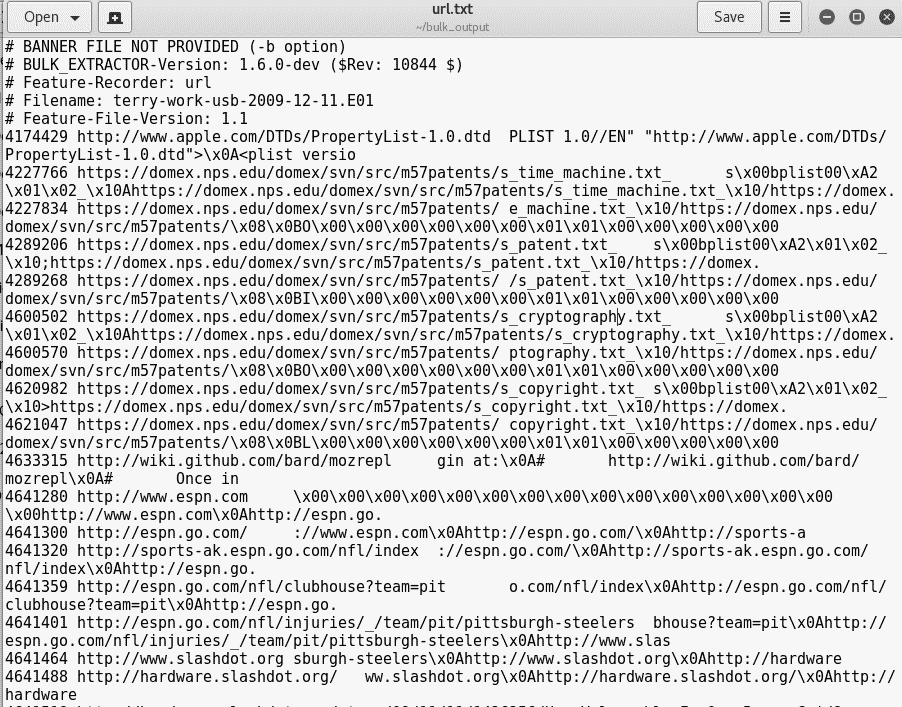

虽然这是一个使用小型证据文件完成的简单练习，但请务必查看[上的许多其他可用证据文件 http://digitalcorpora.org/](http://digitalcorpora.org/) 看看`bulk_extractor`揭示了什么。如果您的带宽和存储空间允许，请尝试下载尽可能多的图像，并使用我们将在其他章节中使用的其他工具。

# 总结

在本章中，我们学习了在 Kali Linux 中使用三种现成工具进行文件恢复和数据提取。我们首先使用令人印象深刻的 Frontister 执行文件雕刻，它在整个图像中搜索文件头和页脚中支持的文件类型。然后，我们用新的 Parcel 做了同样的事情，但必须通过选择我们想要雕刻的文件类型进行轻微的修改。普洛斯特和解剖刀向我们展示了一份`audit.txt`文件，总结了雕刻清单及其细节，以及包含实际证据的子文件夹

Bulk_extractor 是一个很好的工具，它可以切割数据，还可以查找有用的信息，如电子邮件地址、访问的 URL、Facebook URL、信用卡号码和各种其他信息。Bulk_extractor 适用于需要文件恢复和雕刻的调查，以及最前面的或 Parcel，甚至两者兼有。

既然我们已经讨论了文件雕刻和恢复，那么让我们继续讨论更具分析性的内容。在下一章中，我们将使用非常强大的易变性来研究 RAM 和分页文件，作为内存取证的一部分。再见！