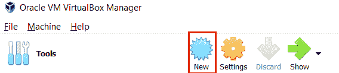
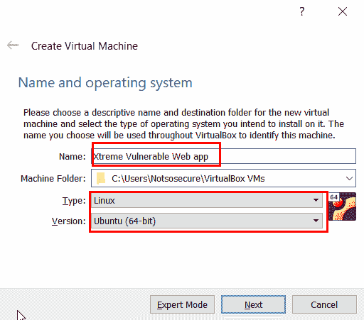
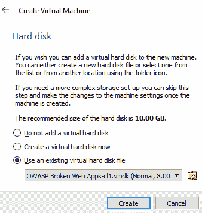
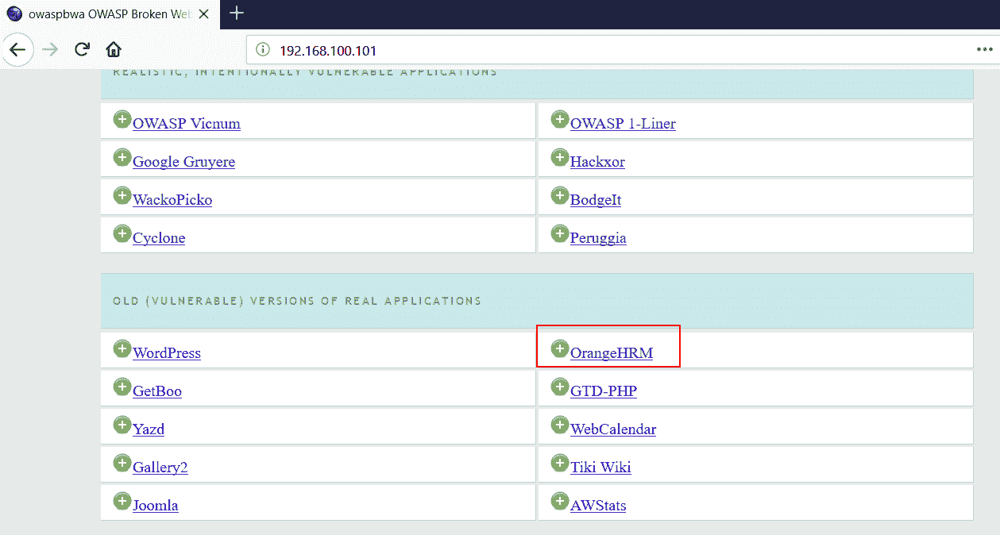
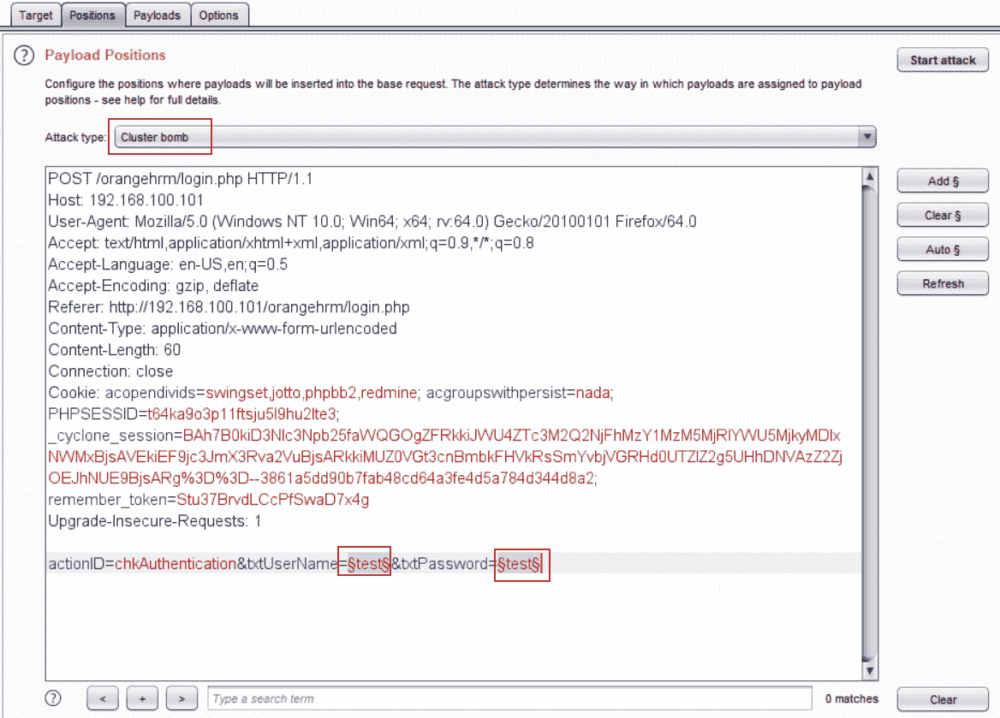
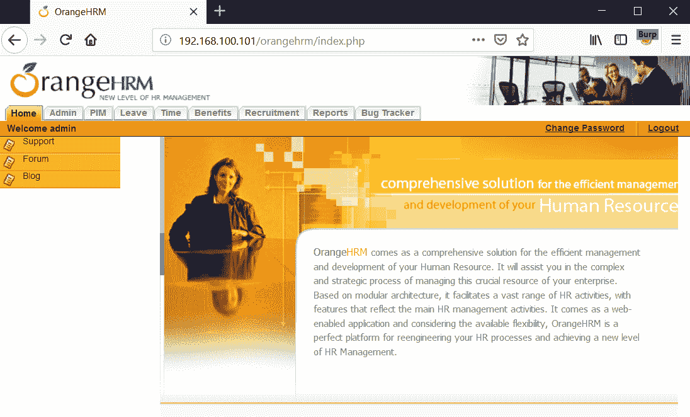

# 五、准备应用渗透测试

在本章中，我们将通过 Burp 测试各种易受攻击的应用，以更好地了解如何使用 BurpSuite 高效地测试易受攻击的应用。

本章将介绍以下主题：

*   设置易受攻击的 web 应用
*   侦察和文件发现
*   使用 Burp 测试认证模式

# 设置易受攻击的 web 应用

为了让我们从本章开始，读者必须下载以下易受攻击的应用：

*   Xtreme 易受攻击的 Web 应用
*   OWASP 断开的 Web 应用

# 设置 Xtreme 易受攻击的 Web 应用

要设置 Xtreme 易受攻击的 Web 应用，请执行以下步骤：

1.  下载 Xtreme 易受攻击的 Web 应用；访问[https://download.vulnhub.com/xvwa/](https://download.vulnhub.com/xvwa/) 点击`xvwa.iso`
2.  下载后，打开 VirtualBox 并单击新建：

3.  设置新虚拟机的名称。我们将其命名为：

4.  提供大约 1024MB 的 RAM，如以下屏幕截图所示：

5.  下一个

# 设置 OWASP 断开的 Web 应用

要设置 OWASP 断开的 Web 应用，请执行以下步骤：

1.  从[下载 OWASP BWAhttps://download.vulnhub.com/owaspbwa/](https://download.vulnhub.com/owaspbwa/) ；进入网站并点击`OWASP_Broken_Web_Apps_VM_1.2.7z`。
2.  下载后，打开 VirtualBox，如下图所示，单击 New。
3.  设置新虚拟机的名称。我们将其命名为：

4.  提供大约 1024MB 的 RAM，然后选择使用现有虚拟硬盘文件选项，如以下屏幕截图所示：

6.  选择提取的 OWASP Web 应用`.vmdk`文件并单击创建。这将创建一个虚拟机。要启动此虚拟机，请从计算机列表中选择该计算机，然后单击开始按钮。

# 通过 Burp 进行认证测试

本主题主要讨论在未设置速率限制的情况下尝试强制验证页面。我们将学习如何在各种登录页面上使用 Burp 来尝试使用一组用户名和密码字典强制进行认证。最后，我们还将检查认证页是否容易受到 SQL 注入的攻击

# 使用 Burp 入侵者强制登录页面

让我们不要浪费时间，快速进入几个应用，看看如何使用 Burp 在认证页面上强制执行凭据。我们将暴力破解的第一个应用是 OWASP BWA 列表中的 OrangeHRM

打开应用后，将显示一个登录页面；没有注册此应用的选项。所以我们有两种选择，要么测试 SQL 注入，要么测试基于蛮力字典的密码，希望其中一个用户名和密码组合达到有效。以下屏幕截图显示了主页：

此应用的默认凭据为`admin`：`admin`，但是，为了显示如何强制登录页面，密码已更改为另一个字典单词。让我们继续输入任意随机用户名和密码，`test`和`test`，然后单击登录。确保在执行此操作时，您的代理处于打开状态，并且您收到了向入侵者发送此请求的截获，如以下屏幕截图所示：

转到入侵者选项卡并单击清除§按钮以删除所有预定义的攻击点。我们的核心关注点是攻击用户名和密码值，因此我们选择用户名和密码字段并将其添加到我们的攻击点，并将攻击类型更改为群集炸弹，如以下屏幕截图所示：

现在，在我们继续之前，让我们了解为什么我们选择集束炸弹作为攻击类型。Burp 的入侵者能力有四种不同的攻击类型。这四种攻击类型是：

*   狙击手
*   撞锤
*   干草叉
*   集束炸弹

在上一章中，我们已经研究了这些攻击类型。现在我们已经了解了不同的攻击类型，让我们继续我们的集群炸弹，并输入用户名和密码有效载荷的值。转到有效载荷部分，选择有效载荷集 1，并在有效载荷选项中选择添加自列表。。然后选择用户名。如果您使用的是 Burp Basic，您可以从[下载单词列表 https://github.com/danielmiessler/SecLists](https://github.com/danielmiessler/SecLists) ，选择添加选项，给出用户名的路径。对于专业用户，请查看以下屏幕截图：

对于基本用户，下载列表后，只需单击加载。。。并提供顶级用户名短名单文件的路径，如以下屏幕截图所示：

同样，选择 Payload set 2 并通过列表中的 add（添加）为专业用户选择 password（密码），对于基本用户，通过 load（加载）选项选择 password（密码）。如果专业用户不想在 Burp 中使用默认列表，他们也可以使用自定义列表。因此，密码的有效负载设置已设置，如以下屏幕截图所示：

配置完成后，我们可以单击 Start attack，它将强制执行用户名和密码集，如果任何组合命中都正确，则为我们提供有效凭据，例如：

如您所见，其中一个组合命中成功，并给出状态 302，这意味着有可能这是正确的密码。让我们继续并在浏览器中请求这个。在请求上单击鼠标右键并在浏览器中选择“请求”，然后在当前会话中，您将看到一个 Burp URL。将其复制并粘贴到 URL 空间中，如以下屏幕截图所示，您已成功登录：

# 测试 SQL 注入的认证页

在本模块中，我们将看到如何执行测试以验证应用的认证页是否易受 SQL injeciton 攻击。我们将首先了解 SQL 注入如何影响登录页面，它的后台逻辑是什么，以及它如何执行并允许我们登录。然后，我们将测试一些应用，看看应用是否容易受到 SQL 注入的攻击。

登录页面上要测试 SQL 注入的神奇字符串具有相同的逻辑，但由于验证的原因，它们的表示方式不同。整个目标是尝试走出 SQL 语法的输入字段，并尝试将负载作为 SQL 查询的一部分执行，这将导致 true。例如，一些样本。。。

# 总结

在本章中，我们将设置易受攻击的 web 应用。此外，我们还通过 Burp 检测应用中的文件和文件夹。最后，我们学习了如何在各种登录页面上使用 Burp 来尝试使用一组用户名和密码字典强制进行认证。

在下一章中，我们将使用 Burp Suite 识别漏洞