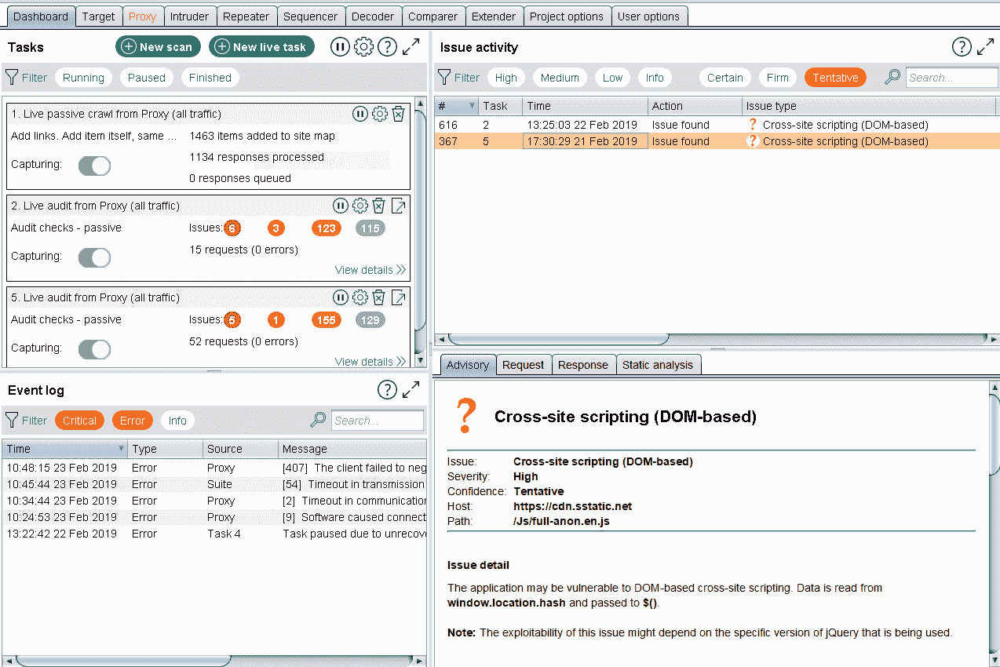
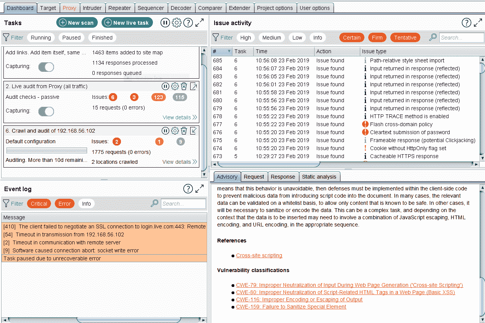
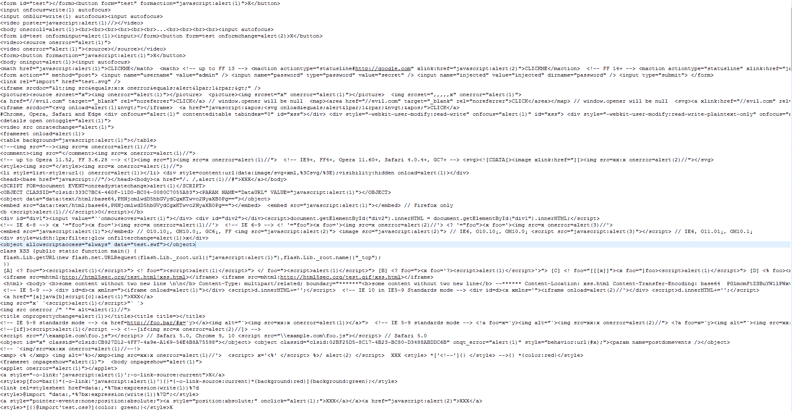
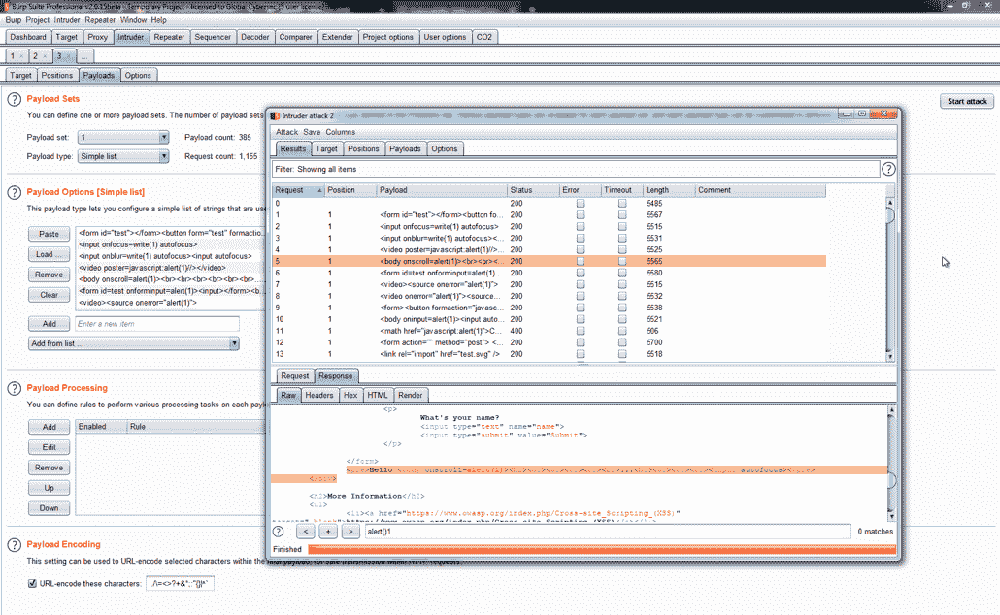
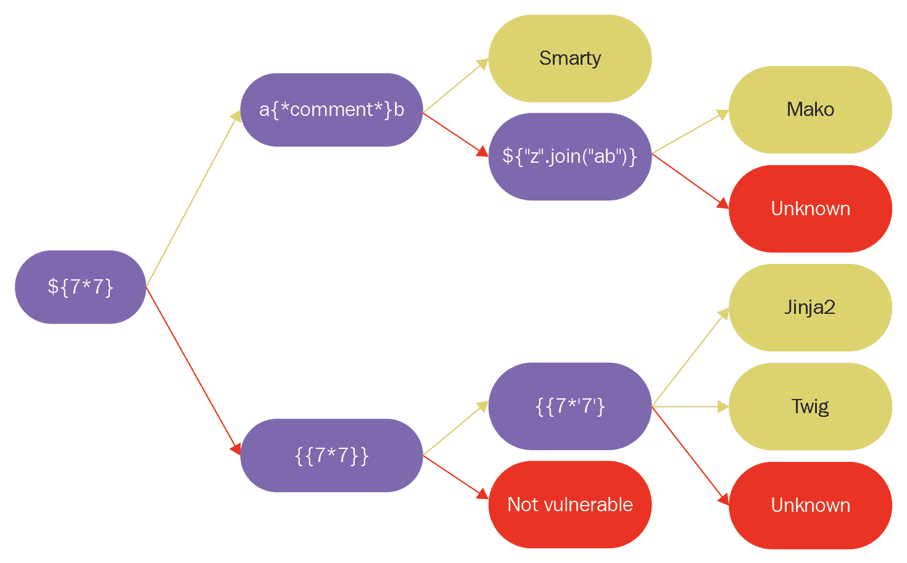

# 六、使用 BurpSuite 识别漏洞

BurpSuite 不仅仅是一个 HTTP 代理；它是一整套用于检测和利用漏洞的工具。事实上，我们将使用 BurpSuite 向开发人员解释这些漏洞是如何以他们能够理解的方式工作的。在本章中，我们将重点介绍如何使用 BurpSuite 和一些扩展来检测漏洞。我们将讨论以下主题：

*   检测 SQL 注入缺陷
*   检测操作系统命令注入
*   检测**跨站点脚本**（**XSS**漏洞
*   检测与 XML 相关的问题，如**XML 外部实体**（**XXE**）
*   检测**服务器端模板注入**（**SSTI**）
*   检测**服务器端请求伪造**（**SSRF**）

# 检测 SQL 注入缺陷

SQL 注入是由应用中的弱输入验证控件生成的漏洞。它允许恶意用户执行任意 SQL 代码，从而公开存储的信息，并且在某些关键情况下，允许完全控制应用所在的服务器。

使用 BurpSuite 检测 SQL 注入有三种主要方法：第一，手动插入测试字符串；二是利用扫描仪；第三，通过使用一个名为 CO2 的扩展，它在后台使用**sqlmap**，这是一个用于开发和检测 SQL 注入的工具。让我们来看看这三种方法。

# 人工检测

手动检测是指使用**代理**工具和**入侵者**工具逐个请求分析请求，以检测错误或意外行为，从而检测 SQL 注入。

假设您有一个应用，允许用户查看有关在数据库中注册的用户的信息；为此，应用将使用以下请求：

```
GET /dvwa/vulnerabilities/sqli/?id=1&Submit=Submit HTTP/1.1 Host: 192.168.1.72 User-Agent: Mozilla/5.0 (Windows NT 6.1; Win64; x64; rv:66.0) Gecko/20100101 Firefox/66.0 Accept: text/html,application/xhtml+xml,application/xml;q=0.9,*/*;q=0.8 Accept-Language: en-US,en;q=0.5 Accept-Encoding: gzip, deflate Referer: http://192.168.1.72/dvwa/vulnerabilities/sqli/ Connection: close Cookie: security=low; ...
```

# 扫描仪检测

使用 BurpSuite 检测 SQL 注入和任何漏洞的最简单方法是通过扫描仪。要使用扫描仪，请执行以下操作：

1.  打开 Burp Suite 以查看主仪表板，如以下屏幕截图所示。请注意，这仅在专业版中可用；社区版没有扫描仪作为选项。如果使用社区版，则使用 ZAP 代理中包含的扫描仪（可在此处找到：[https://www.owasp.org/index.php/OWASP_Zed_Attack_Proxy_Project](https://www.owasp.org/index.php/OWASP_Zed_Attack_Proxy_Project) ：



2.  在此屏幕中，单击新建扫描。此按钮将启动向导以配置扫描；在这里，您可以添加要扫描的所有 URL、限制扫描范围、为经过认证的扫描设置凭据，以及创建特定任务，例如筛选器。要执行应用扫描，请输入要扫描的 URL，如以下屏幕截图所示：


3.  接下来，单击应用登录并为应用添加凭据。在本例中，我们为网站添加用户，如以下屏幕截图所示：


4.  点击 OK 按钮，扫描仪将开始检测，如下图所示。Burp Suite 将询问您是否需要更多信息来执行扫描：



现在，让我们转到下一种检测方法，即二氧化碳检测。

# 二氧化碳检测

CO2 是 BurpSuite 的一个流行扩展，它集成了 sqlmap，这是一个用 Python 开发的工具，主要用于检测和利用 web 应用中的 SQL 注入。让我们看看 CO2 的安装和工作，如下所示：

1.  要安装 CO2，请导航到 Burp Suite 中的 Extender 选项卡，然后单击 BApp Store；在这里，您可以找到最新版本的列表，如以下屏幕截图所示：


2.  要安装，请单击安装按钮，Burp Suite 安装中将出现一个新选项卡，如以下屏幕截图所示：

3.  CO2 实际上只是 sqlmap 的前端扩展。为了工作，它。。。

# 检测操作系统命令注入

命令注入是另一个输入验证错误，它是在与操作系统直接交互时产生的。这通常是因为应用正在使用一个函数，例如`exec()`、`execve()`或`system()`。

与 SQL 注入和本章中描述的所有漏洞一样，OS 命令注入可以通过使用 scanner 方法并遵循类似步骤进行检测。因此，我们将描述如何手动检测此漏洞。

# 人工检测

要检测命令注入漏洞，请打开 Burp Suite 并在您认为存在潜在漏洞的位置拦截请求。

我们认为 IP 参数中存在漏洞。正常应用的流程是用户插入一个 IP 地址，然后应用对该 IP 地址执行 ping。如果我们试图想象后端发生了什么，我们可以假设 IP 参数是由 PHP 中的一个变量接收的；然后它与字符串 ping 连接起来，创建一个包含命令和 IP 地址的字符串。

最后，这个完整的字符串作为参数传递给负责在低级命令中执行的函数。因此，如果 IP 参数没有以正确的方式验证。。。

# 检测 XSS 漏洞

XSS 有三种不同的类型，但它们都有一个共同点，即它们从输入验证错误中派生出来，用于管理用于注入 JavaScript 代码或 HTML 标记的字符。因此，我们可以使用如下屏幕截图所示的一些输入（这是 OWASP 项目的备忘单），并将其作为有效负载添加到入侵者工具中：



来自 OWASP 项目的备忘单

检测 XSS 漏洞的方法是在响应的 HTML 中查找这些代码，而不进行编码或修改，或者在注入测试字符串后没有发现错误。

要添加备忘单，请使用与向入侵者添加有效负载列表类似的过程。打开入侵者工具，单击有效载荷选项卡，然后选择加载按钮。最后，标记所有您认为易受攻击的参数，然后单击开始攻击，如以下屏幕截图所示：



易受攻击的参数列表

在前面的屏幕截图中，我们可以看到入侵者如何启动所有字符串，以及其中一个字符串如何影响已确认 XSS 中的响应。

# 检测与 XML 相关的问题，如 XXE

XML 问题需要请求接受 XML，因此我们需要在标头的`content-type`中包含此信息，如下所示：

```
text/xml
application/xml
```

我们可以在 BurpSuite 中配置一个过滤器来检测头中包含此信息的请求。要配置过滤器，请转到目标工具，然后单击过滤器栏。到达后，选择 XML 文件格式，如果需要，编写我们知道所有请求都需要的`content-type`字符串，如以下屏幕截图所示：


过滤可能存在漏洞的请求后，在入侵者中添加公共测试字符串作为有效负载列表。。。

# 检测 SSTI

SSTI**漏洞在很大程度上取决于测试应用使用的引擎。但是，模板引擎的主要思想是传递一个由引擎解释的参数，然后创建视图。因此，大多数引擎都在等待文本解析并显示它。以以下为例：**

 **```
any=Hello 
<b>Hello</b> 
```

在前面的示例中，应用接收字符串，引擎自动添加 HTML 标记以显示该字符串。此外，这些引擎可以解释作为参数传递的值，例如运算符。例如：

```
any=Hello ${7*7} 
Hello 49 
```

在这种情况下，发动机使用传递的值评估`*`运算符。因此，如果您将一个意外字符串作为参数传递，它可能会被反射，或者可以用来提取有用的信息，如下所示：

```
personal_greeting=username<tag> 
Hello 

personal_greeting=username}}<tag> 
Hello user01 <tag> 
```

在这里，引擎解释参数以显示相关信息，就像它是一个查询一样。James Kettle 于 2015 年创建了一个地图，根据所使用的引擎检测 SSTI 漏洞。以下屏幕截图显示了 Kettle 的地图，以检测 SSTI 是否存在，并根据输入进行推断：



使用 Burp Suite 检测 SSTI 漏洞需要手动进行，并且需要捕获并输入测试参数，首先检测引擎使用的是什么，然后检测它是否有漏洞。

# 检测 SSRF

SSRF 背后的基本思想是找到对内部资源的访问，这些资源可以被操纵以访问未经授权的资源。例如，假设我们有以下 URL：

```
    https://site.com/process.php?url=192.168.2.34/data/
```

在本例中，我们有一个在`site.com`域后面公开的网站，它使用从内部 IP 检索到的信息处理一些事情。如果开发人员未验证`url`参数，恶意用户可以访问位于内部 IP 或具有相同可见性的其他 IP 中的未经授权的资源。

要检测此类漏洞，我们可以使用 Burp Suite 的扫描仪，它将自动检测这些漏洞，或者在目标工具中应用过滤器来查找。。。

# 总结

在本章中，我们了解了 BurpSuite 用于检测与输入验证弱点相关的最常见漏洞的工具。

大多数都是使用 Burp Suite 的扫描仪检测到的，这是一个活动的扫描仪，在 pentester 导航应用时工作。因此，与其他扫描仪相比，它更具交互性，能够访问隐藏区域。但是，可以通过发送精心编制的请求并在响应中引起注意来检测此漏洞。对于这个任务，入侵者工具是 BurpSuite 中最有用的工具。

在下一章中，我们将查找与输入验证无关的错误。**