# 九、使用 BurpSuite 利用漏洞——第二部分

正如我们在上一章中所看到的，Burp Suite 是一种灵活的工具，用于检测和利用漏洞。在本章中，我们将利用其他类型的漏洞，展示 Burp Suite 中的更多选项和功能。

在本章中，我们将介绍以下主题：

*   使用 SSRF/XSPA 执行内部端口扫描
*   使用 SSRF/XSPA 从内部机器提取数据
*   使用不安全的直接对象引用（IDOR）缺陷提取数据
*   利用安全错误配置
*   使用不安全的反序列化来执行 OS 命令
*   利用加密漏洞
*   强制 HTTP 基本认证
*   暴力强迫形式
*   绕过文件上载限制

# 使用 SSRF/XSPA 执行内部端口扫描

**服务器端请求伪造**（**SSRF**是一个漏洞，恶意用户可以向托管应用的服务器发送手动请求，通常是从用户角度看无法直接访问的服务器。

目前，这是一个非常流行的漏洞，因为它对使用 Elasticsearch 和 NoSQL 数据库等技术的云基础设施有很大影响。

在下面的代码片段中，我们可以看到它的效果：

```
<?php 
   if (isset($_GET['url'])){ 
         $url = $_GET['url']; 
         $image = fopen($url, 'rb'); 
         header("Content-Type: image/png"); 
         fpassthru($image); 
   } 
```

此代码易受攻击，因为它在未经验证的情况下接收到`url`参数，然后。。。

# 对后端执行内部端口扫描

在评估网络时，端口扫描是网络发现的最基本和最有用的活动之一。在应用中，安全评估仅限于评估中确定的范围，但 SSRF 和 XSPA 允许用户从应用执行端口扫描。为了演示如何执行此技术，我们将使用 Acunetix 创建的易受攻击的测试应用，您可以在[找到该应用 http://testphp.vulnweb.com/](http://testphp.vulnweb.com/) 。

这是一个易受攻击的应用，可用于了解一些攻击和测试脚本或工具，如以下屏幕截图所示：


1.  打开 Burp Suite 的仪表板，单击新建扫描。在范围中添加 Acunetix 的 URL，然后单击开始，如以下屏幕截图所示：

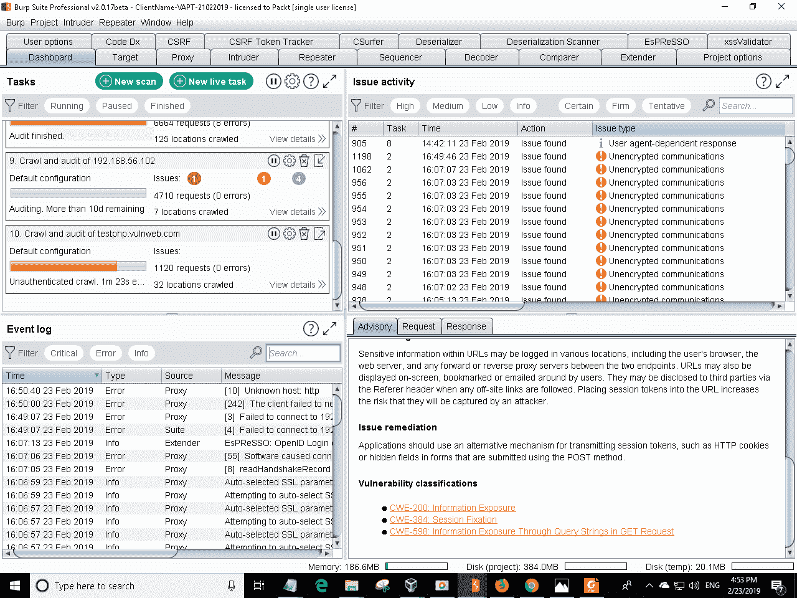

2.  扫描应用后，Burp Suite 检测到 URL（[http://testphp.vulnweb.com/showimage.php](http://testphp.vulnweb.com/showimage.php) 易受 SSRF 影响。此 PHP 文件接受 URL 作为参数，如下行所示：

```
http://testphp.vulnweb.com/showimage.php?file=http://192.168.0.1:80
```

3.  要执行自动端口扫描，我们可以使用入侵者。首先，停止请求，并将其发送给入侵者，如以下屏幕截图所示：


4.  清除默认创建的通配符，并自行添加一个新通配符，如以下屏幕截图所示：

```
GET /showimage.php?file=http://192.168.0.1:port HTTP/1.1 
Host: testphp.vulnweb.com 
User-Agent: Mozilla/5.0 (Windows NT 6.1; Win64; x64; rv:66.0) Gecko/20100101 Firefox/66.0 
Accept: text/html,application/xhtml+xml,application/xml;q=0.9,*/*;q=0.8 
Accept-Language: en-US,en;q=0.5 
Accept-Encoding: gzip, deflate 
Connection: close 
Cookie: login=test%2Ftest 
Upgrade-Insecure-Requests: 1 
```

现在，您可以将有效负载定义为一个列表，从 0 到 65535，我们将选择随机选项。为什么？由于一些**入侵防御系统**（**IP**）检测到对同一 IP 的顺序请求，因此通过使用随机选项，我们可以尝试避免被检测到：


5.  现在，启动攻击，如以下屏幕截图所示：


为什么有效？如果看到响应，则可以查看连接是否成功，如下所示：


当端口打开时，响应不会显示任何错误。作为提示，您可以分析长度列以检测响应中何时有更改，并查看是否出现错误。

# 使用 SSRF/XSPA 从内部机器提取数据

SSRF 和 XSPA 漏洞还可用于其他操作，例如将信息从服务器提取到后端所在的网络中，或从承载应用的服务器提取信息。让我们分析以下请求：

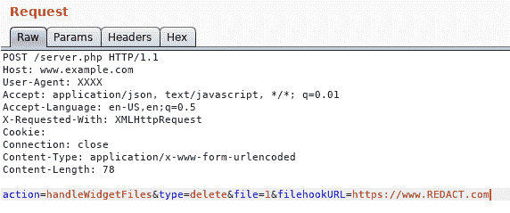

此处，`filehookURL`参数易受攻击，因此使用鼠标的次键将其发送到 Repeater tool，并在`/etc/passwd`中修改参数以提取文件，如下所示：

```
action=handleWidgetFiles&type=delete&file=1&filehookURL=file:///etc/passwd 
```

将其发送到应用。如果有效，应用将向您显示。。。

# 使用不安全的直接对象引用（IDOR）缺陷提取数据

IDOR 是一个漏洞，允许恶意用户访问承载应用的服务器中的文件、数据库或敏感文件。

为了识别易受 IDOR 攻击的应用，有必要测试管理应用路径的每个变量。让我们看一个如何利用此类漏洞的示例。

# 使用 BurpSuite 开发 IDOR

在以下屏幕截图中，您有一个易受攻击的应用，并且已拦截下一个请求：

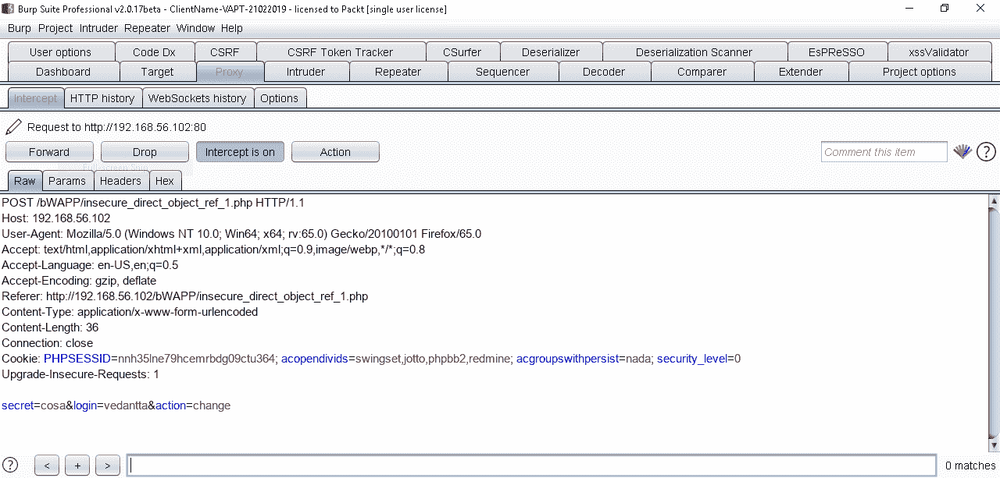

我们在这个请求中有它们的参数；登录、操作和密码。此处易受攻击的参数是 login。`secret`变量是用户注册时分配的数据；存在的漏洞是，如果恶意用户修改登录参数，应用会在未经验证的情况下更改指定用户的机密值。因此，我们创建了另一个名为**vendetta2**的用户，试图修改与该个人相关的秘密值，如下所示。。。

# 利用安全错误配置

术语*错误配置*非常开放，它可能意味着许多与安全相关的事情。同时，很难确定这些漏洞的影响；其中一些漏洞可能只是信息性的，显示用于构建应用的技术信息，而另一些则可能非常关键，提供对服务器或应用的访问，从而暴露所有漏洞。

因此，在本节中，我们将展示不同的常见错误，以及如何使用 BurpSuite 利用这些错误。

# 默认页面

服务器管理员安装 web 服务器或其他应用是很常见的，他们不会对其进行配置以避免显示默认页面，因此，查找以下页面是正常的：

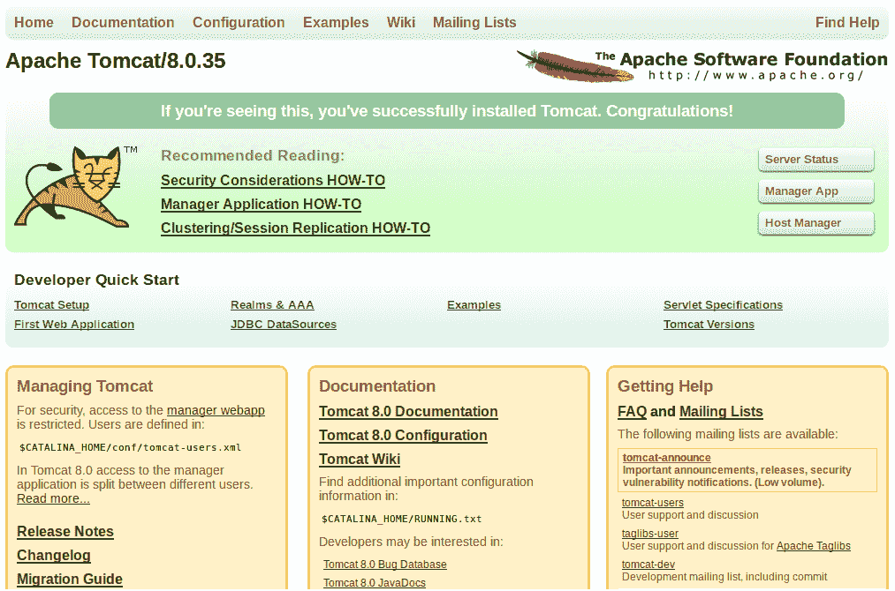

此默认页面可能是通用的，但它显示的信息可能有用，具体取决于环境。例如，在本例中，我们看到 ApacheTomcat 的默认页面。Tomcat 是一个具有管理部分的应用服务器，Tomcat 具有默认用户和密码。因此，如果您检测到这个默认页面，您只需输入`tomcat`凭证，即可查看所有选项。一种常见的攻击包括。。。

# 目录列表

系统管理员和开发人员在文件系统中分配不正确的访问权限是正常的，这允许用户访问敏感的文件，例如备份、配置文件、源代码文件，或者只访问一个目录，该目录允许用户更详细地了解服务器和应用的托管位置。

为了发现所有这些结构，我们可以使用以下三种主要方法：

*   扫描
*   映射应用
*   入侵者

让我们详细探讨每种方法。

# 扫描

扫描器，包括 BurpSuite 扫描器，有算法来检测合理的路径和公共文件；实际上，通用文件可以用作横幅抓取，以检测潜在的漏洞。

如果检测到合理的文件，它将作为问题显示在扫描仪结果中，如以下屏幕截图所示：

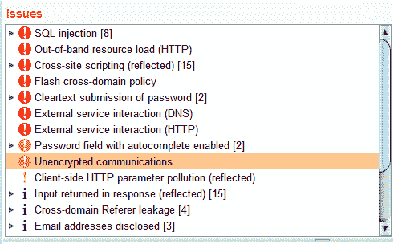

# 映射应用

在 Burp Suite 中，您可以找到在目标工具中映射的所有不同文件，它在目标工具中创建了一个包含所有网站结构的树。如果单击某个文件，它将在右侧详细显示，详细说明该文件是否可访问，以及该文件的类型：

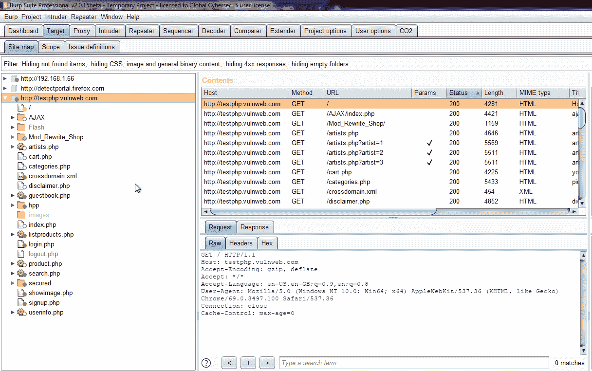

这种映射基本上是自动的；您只需要在应用中工作，而 Burp Suite 正在缓存所有请求并创建此树，但 Burp Suite 也有一个用于此目的的特定工具。

在目标工具中，有一个称为范围的选项卡；在这里，可以将 URL 或路径定义为作用域，以便对其进行深度映射。当您发出请求时，请求中有许多资源链接到其他资源。Burp Suite 分析寻找这些链接的请求和响应，并使用可从中检索的信息绘制站点地图，如以下屏幕截图所示：

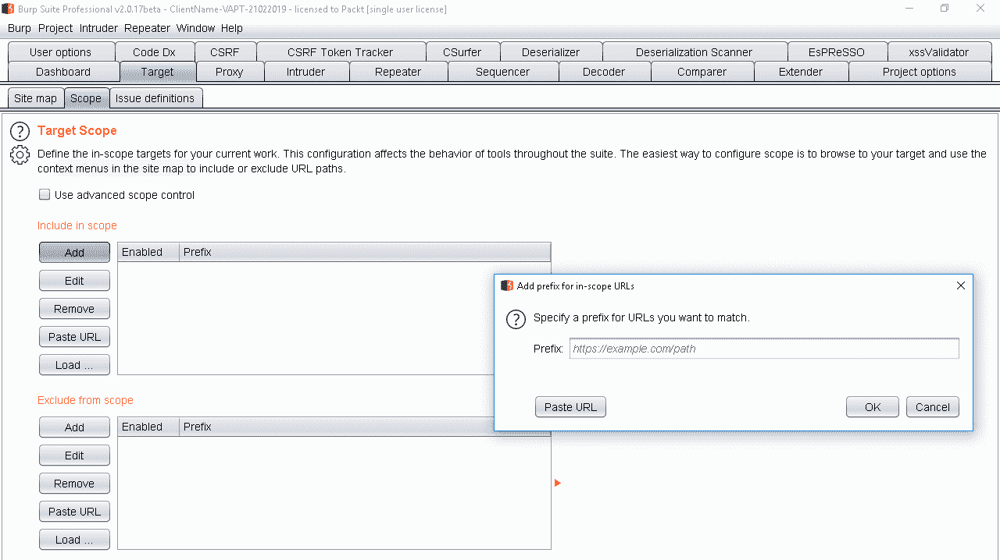

如果应用具有经过认证的部分，建议您提供凭据，因为每次 Burp Suite 尝试访问经过认证的部分时，代理都会启动一个弹出窗口，这可能会让人恼火。发生这种情况时，只需输入凭据，代理将保存它们以备将来的请求。

# 使用入侵者

我认为入侵者是 BurpSuite 中最灵活的工具。你可以用它做任何事。在使用 Burp Suite Community Edition（您没有高级选项和工具）时，入侵者可以为所有这些选项和工具提供限制，这意味着执行任务的时间更长，但它可以执行任何类型的任务。

因此，为了检测目录列表和敏感文件，我们将使用公共列表。例如，我们可以有一个包含公共目录的列表，例如**内容管理系统**（**CMS**）中的常用路径、电子商务应用以及自制应用中使用的正常路径，例如`/users/`、`/admin/`、`/administrator/`、`process.php`、`/config/`等等。

另一方面，我们需要有一个列表与共同的。。。

# 默认凭据

如前所述，在本节中，有些应用在安装时具有默认凭据。对于其中一些，这是因为它们不是直接安装的，而是与操作系统一起使用软件包，或者因为它们是另一个应用的一部分。例如，一些**集成开发环境**（**IDE**）在其安装中有 web 或应用服务器，用于测试目的。

此外，也有使用**数据库管理系统**（**DBMS**）的测试工具或软件包，但这些系统存在暴露它们的漏洞或默认访问。

在完成一些调查后，您将能够了解应用背后的应用、服务器和技术，只需查找术语“默认密码”，即可找到正确的凭据，或访问存储凭据的 web，如以下屏幕截图所示：

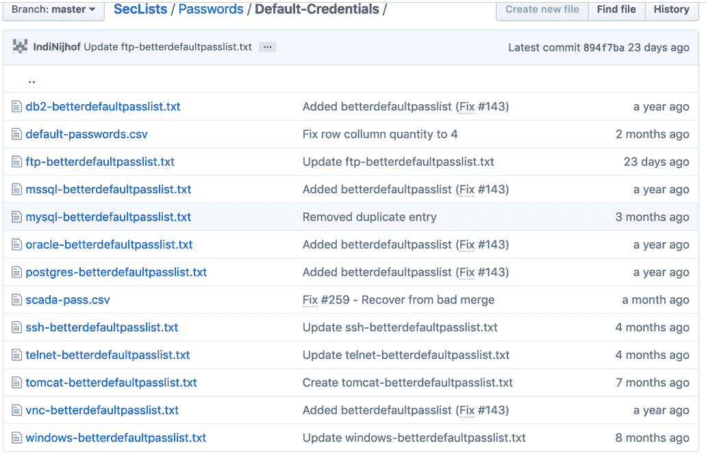

要识别正确的应用，只需将它们作为有效负载加载到入侵者中并启动应用，我们将在本章中详细介绍。

# 不受信任的 HTTP 方法

HTTP 协议有不同的方法，通常我们会知道`GET`、`POST`和`CONNECT`方法，因为它们是最常用的方法。但是，也有其他方法可用于获取有关服务器的信息、将文件上载和删除到应用中或获取调试信息。

使用 BurpSuite 测试这些方法很容易。在代理中，只需按以下方式修改请求：

```
OPTIONS / HTTP/1.1 
```

实际上，`OPTIONS`是一种让我们知道 web 服务器上允许使用哪些方法的方法。可以出现的方法有`PUT`、`DELETE`、`TRACE`、`TRACK`和`HEAD`。这些方法的开发超出了本书的范围，因为很多方面取决于应用中的环境。

# 使用不安全的反序列化来执行 OS 命令

在某些编程语言中，序列化是将对象状态转换为字节流的过程，这意味着 0 和 1。反序列化过程将字节流转换为内存中的对象。

在 web 技术中，有更简单的情况，例如，常见的反序列化是将 JSON 格式传递为 XML 格式的过程。这很简单，但真正的问题开始于使用本机对象的技术，例如 Java，在 Java 中我们可以传递到内存中的直接调用。

事实上，当应用反序列化无效的输入时，就会出现该漏洞，从而创建可能对应用有潜在风险的新对象。

# 利用脆弱性

假设您有一个易受攻击的应用正在使用 pickle 库。这是一个 Python 模块，它实现不同的函数来序列化和反序列化。但是，该模块本身并不实现保护。它需要通过开发人员的验证来实现。请查看以下易受攻击的代码段：

```
import yaml 
with open('malicious.yml') as yaml_file: 
contents = yaml.load(yaml_file) 
print(contents['foo'])
```

这段代码在没有任何验证的情况下读取 YAML 文件。恶意用户可以输入可能执行其他操作的输入，例如命令，如下所示：

```
POST /api/system/user_login HTTP/1.1 Host: 192.168.1.254 User-Agent: Mozilla/5.0 (Windows NT 6.1; Win64; x64; rv:66.0) ...
```

# 利用加密漏洞

Burp Suite 不仅可以利用与加密相关的漏洞，还允许用户执行分析以检测弱算法。

要执行此分析，我们需要创建一个捕获。此捕获只是一个导航，我们在其中登录和注销应用，以便创建会话、令牌和 ID。我们的想法是创造最大的捕获，我们可以有一个样本。

创建捕获后，使用 Burp Suite 中的正常历史记录，转到 Sequencer 工具，然后单击立即分析，如以下屏幕截图所示：

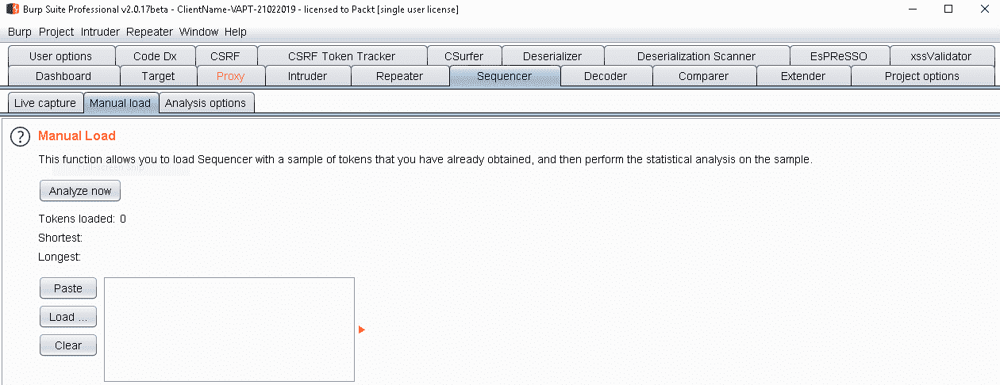

在这里，您可以看到最终分析，如下所示：

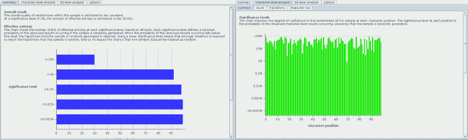

归根结底

现在，您可以根据熵、字符集和概率来确定所使用的算法是否弱。

# 强制 HTTP 基本认证

基本认证是一种访问控制类型，主要用于内部环境，以限制对网站中受限区域的访问。它有很多弱点，包括：

*   基本认证以纯文本形式发送信息。这意味着恶意用户可以截获客户端发送到服务器的信息并提取凭据。
*   密码由 Base64 编码保护。这并不意味着密码是加密的；任何人都可以使用解码器（如 Burp Suite 中包含的解码器）获取普通密码，如以下屏幕截图所示：


# 用 BurpSuite 强迫它

我们将展示如何使用 BurpSuite 攻击基本认证。想象一下，我们家里有一台家用路由器，用来为我们提供互联网。大多数设备使用基本认证。因此，访问 URL 路由器和 web 浏览器将显示一个窗口，如以下屏幕截图所示：


现在，配置 Burp Suite 以拦截发送到服务器的凭据，如以下屏幕截图所示：

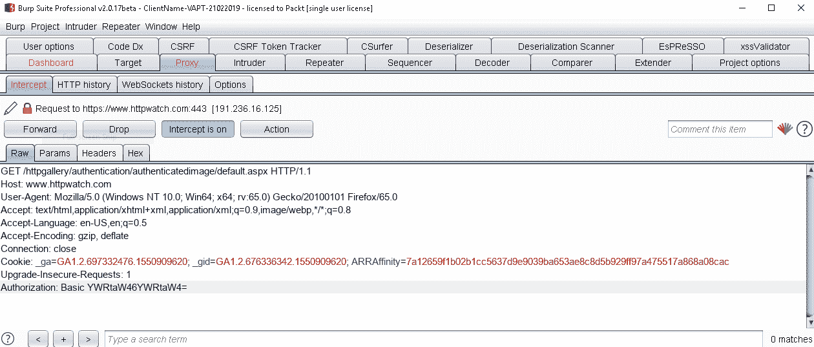

在这里，您可以在标题中看到参数 authorization。因此，复制指定给参数的值，并将其粘贴到解码器部分，以了解它是什么。请记住，基本认证使用 Base64 编码来保护信息：


现在，我们知道基本认证所使用的结构是`user:password`，因此为了强制控制，我们需要按照此结构发送凭据。我们将使用潜在用户和密码的列表，并将它们存储在 TXT 文件中，以便将它们用作有效负载。我建议您在 Facebook、LinkedIn 和 Yahoo 等公共服务中查找泄漏的密码，因为它们是真实的密码，而不仅仅是普通的字典，因此您更有可能访问受限区域。这里，我们有一个小示例列表，如下所示：


现在我们有了密码和用户列表，使用鼠标的辅助按钮单击原始请求，并将其发送到入侵者工具：

1.  首先，我们将选择集束炸弹选项来发送我们的请求。由于我们只有一个列表，我们希望 Burp Suite 测试列表中所有可能的组合，如以下屏幕截图所示：


2.  然后，我们将选择分配给授权参数的值作为通配符。但是，诀窍是在同一参数上创建通配符，因为我们必须向密码和用户插入值，如以下屏幕截图所示：


3.  然后，转到“有效载荷”选项卡，在这里，我们将选择我们的列表。然而，最重要的一步是，我们需要使用基本认证使用的结构在 Base64 中对输入进行编码。首先，在有效负载集部分，选择使用两个有效负载集。我们是否使用相同的列表并不重要，但我们需要将它们作为单独的有效载荷使用，如以下屏幕截图所示：


4.  然后，选择第一个有效负载列表，并在位置 1 的文本框分隔符中添加`:`字符。这将插入第一个值之后，如以下屏幕截图所示：

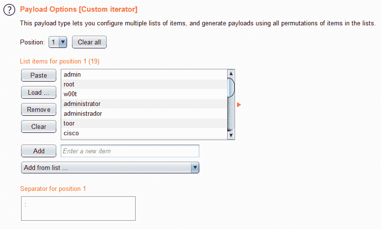

5.  然后，要对有效负载进行编码，请单击添加有效负载处理规则。在这里，选择列表中的 Encode 选项，然后选择 Base64 Encode。使用此配置，所有有效负载都将以 Base64 编码发送，如以下屏幕截图所示：

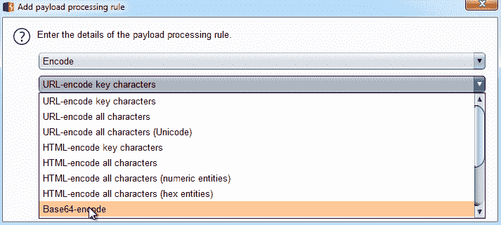

6.  现在，返回有效负载设置部分并选择第二个位置。在这里，选择用户和密码列表，但在文本框中保留位置 2 的文本框分隔符为空。另外，创建对有效负载进行编码的规则。返回“位置”选项卡并单击开始攻击，如以下屏幕截图所示：


当入侵者显示 HTTP 错误代码 200 时，这意味着组合是正确的。

# 暴力强迫形式

如前所述，由于存在安全问题，不建议使用基本认证。更常见的是使用认证表单。这些认证表单包含在 HTML 或其他客户端技术表单中，这些表单被传递到后端，在后端处理凭据以确定用户是否有权访问资源。

需要注意的是，确定用户是否有效的所有处理都将在后端进行。有时，建议在客户端使用结构验证，以限制错误尝试的次数。

# 带 BurpSuite 的自动化

要对表单执行暴力强制，我们将停止将凭据上载到应用的请求，如以下代码块所示，其中用户正在访问登录部分：

```
POST /api/system/user_login HTTP/1.1 
Host: 192.168.1.254 
User-Agent: Mozilla/5.0 (Windows NT 6.1; Win64; x64; rv:66.0) Gecko/20100101 Firefox/66.0 
Accept: application/json, text/javascript, */*; q=0.01 
Accept-Language: en-US,en;q=0.5 
Accept-Encoding: gzip, deflate 
Referer: http://192.168.1.254/ 
Content-Type: application/x-www-form-urlencoded; charset=UTF-8 
X-Requested-With: XMLHttpRequest 
Content-Length: 210 
Connection: close 
Cookie: SessionID_R3=CZY02VcjdwIxtH3ouqkBUrgg7Zu2FICRqkEP5A0ldSiF5FQ67nioWM30PzyYGv9jMQk0a1lvs2lrv1fMX3wqGXSZu176PYZeEDCDxbA0rbAESGMeXNw0PEc0GZ7n2h0; username=admin 

{"csrf":{"csrf_param":"ugObcytxp0houtiW8fxOsDYc074OxoV","csrf_token":"nOyb061GDehdAk04E1PG8qBGWTNwNr0"},"data":{"UserName":"admin","Password":"admin"}}
```

在这个请求中，我们可以识别应用接收用户名和密码的参数。因此，使用鼠标的第二个按钮，单击紧急菜单并选择发送到入侵者。在这里，我们将在有参数的地方创建通配符。请注意，这不是一个常见的`POST`请求，其中参数被指定为值。在这里，我们有一个不同的结构，但它的工作方式是相同的。

在这种情况下，应用不使用任何类型的编码。我们只需将有效载荷配置为一个普通列表，选择集束炸弹作为攻击类型，以及我们之前的列表，如以下屏幕截图所示：


要完成，请单击开始攻击。入侵者将启动一个窗口，我们可以在其中看到结果。有一些应用，当凭据不正确时，会以 302 错误代码响应，以再次将用户重定向到登录页面。在这种情况下，应用总是以 200 错误代码响应，因此需要详细分析响应。要以简单的方式执行此操作，我们可以检查列长度并查找指示不同结果的值的变化，如以下屏幕截图所示：

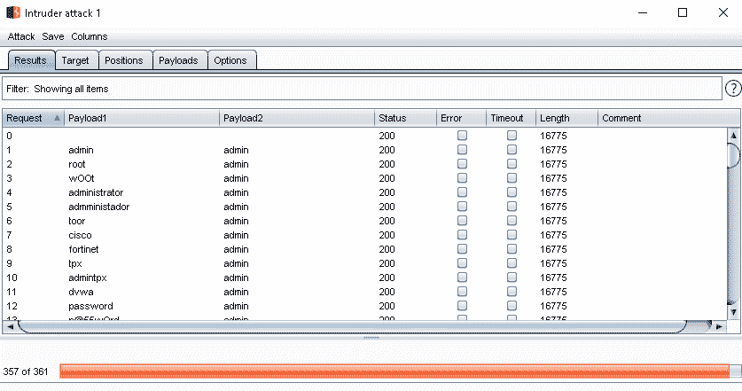

# 绕过文件上载限制

许多应用允许用户上传文件。管理这些文件有不同的方法：一些应用直接将文件作为二进制文件上载，另一些应用对文件进行编码以减小文件大小并在数据库中进行管理。让我们探讨如何修改应用建立的限制以管理文件。

# 绕过类型限制

当应用允许您上载文件时，开发人员通常知道允许哪些类型的文件，因此验证恶意用户不能上载其他类型的文件是很重要的。验证这一点的常用方法是使用扩展文件。因此，如果应用管理文档，开发人员可能允许使用 PDF 文件和 DOCX 文档，但这是否安全？

文件扩展名不是应用需要进行的唯一验证。恶意用户可以上载具有有效扩展名的恶意文件；例如，传播恶意软件。

首先，我们将使用名为 Metasploit 的工具创建恶意 PDF。Metasploit 是一个允许攻击漏洞的攻击框架，主要在基础设施中；但它也有一些辅助模块来执行一些任务，比如用嵌入的恶意代码创建二进制文件。您可以在[中获得 Metasploit 的副本 https://www.metasploit.com/](https://www.metasploit.com/) 。

要安装它，只需解压缩目录中的文件。要创建 PDF，请执行以下步骤：

1.  使用`adobe_utilprintf`工具，将我们的 PDF 转换为恶意 PDF。您可以使用任何 PDF 来执行此操作。
2.  选择 PDF 以使用指令集。
3.  选择要使用的有效负载。Metasploit 具有不同的有效负载，可在执行文件时或在本例中打开文件时执行操作。最简单的有效负载是从打开文件的计算机创建到远程计算机的连接。这是一个反向外壳。

4.  设置远程 IP 地址和端口，如以下屏幕截图所示：


5.  选择所有选项后，使用说明漏洞攻击创建文件，如以下屏幕截图所示：


打开您正在使用 Burp Suite 评估的应用，并在允许用户上载文件的部分拦截请求。假设我们有以下易受攻击的请求：


一个易受攻击的请求示例

在这个请求中，我们可以看到有两个限制。首先，我们有一个大小限制，这是为了避免上传最大的文件。我们可以从以下几行中看到这一限制：

```
Content-Type: multipart/form-data; boundary=---------------------------12057503491 

-----------------------------12057503491 
Content-Disposition: form-data; name="name" 
```

因此，如果我们修改这些值，就有可能上载比用户预期大小更大的文件。

另一个限制是文件，如下所示：

```
test_by_destron23.pdf 
-----------------------------12057503491 
```

这个应用正在等待一个特定的扩展名，如果我们上传另一个文件，比如我们修改过的 PDF，看看会发生什么。

您将看到文件是如何以二进制方式上载到服务器的。此时，服务器上有一个恶意 PDF 文件，其他用户可能会下载该文件，从而导致感染。为了确认文件是否相同，您可以下载该文件并将下载的文件与您自己的文件进行比较。

这一点的结论是，文件只是应用中的另一种输入类型，您可以使用类似于 Burp Suite 的表单输入来修改它。

# 总结

在本章中，我们学习了 Burp Suite 用来利用不同类型漏洞的常规工具。特别是，我们利用 SSRF 和 XSPA 在内部网络中执行命令、提取信息和执行任务。此外，我们还回顾了这些漏洞的来源。我们回顾了 IDOR 漏洞，了解了如何手动利用它，以及如何使用入侵者自动利用它。接下来，我们回顾了一些与配置相关的漏洞；它们如何可以是关键的，而不是关键的，以及我们如何能够自动化其中的一些。

我们还执行了暴力强制，以在两种不同类型的认证中查找有效凭据。我们创建了一个恶意 PDF，并学习了如何将其上载到网站。。。