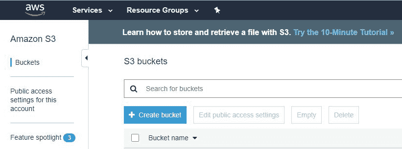
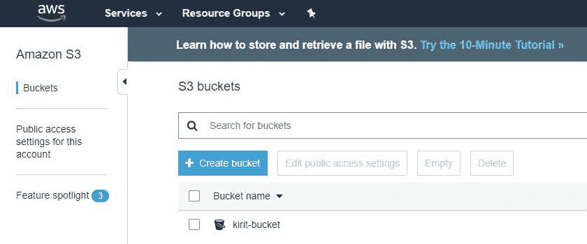
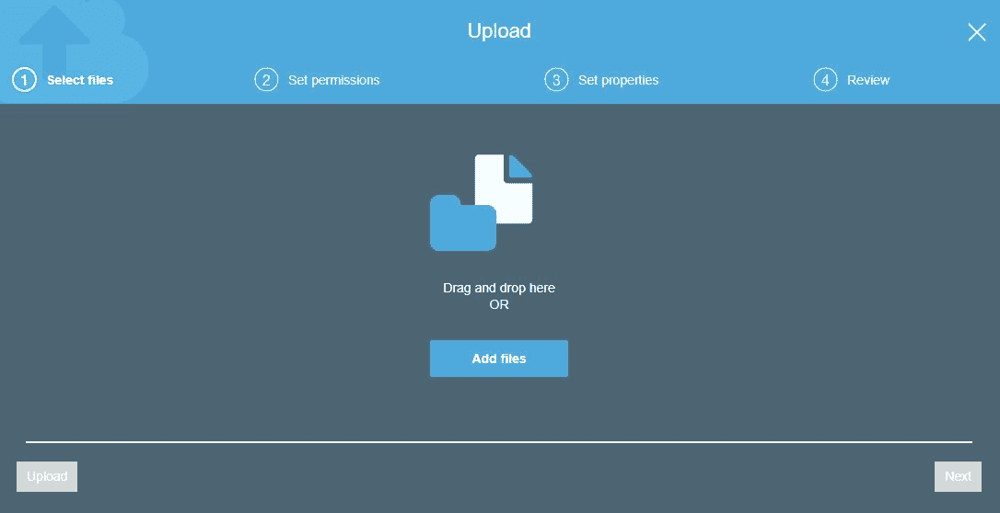
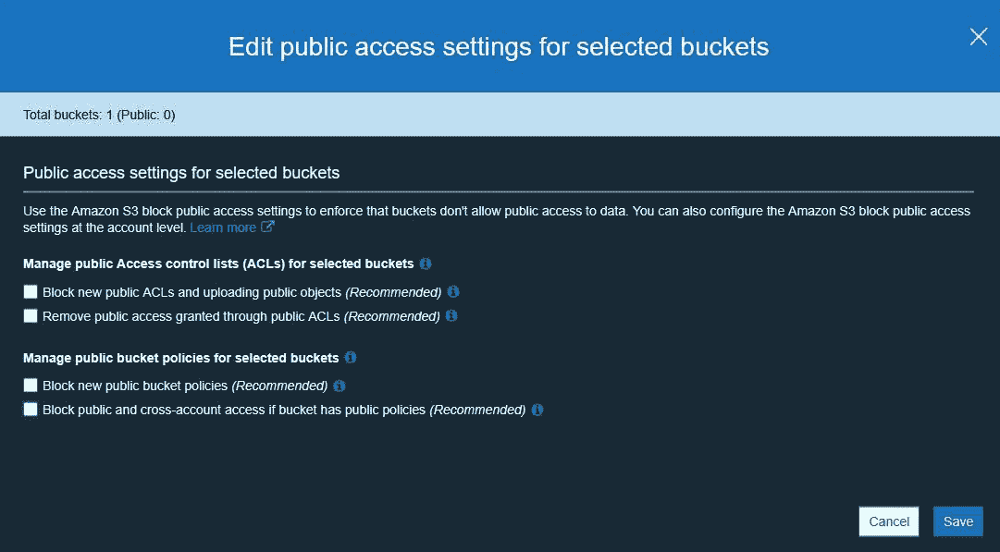
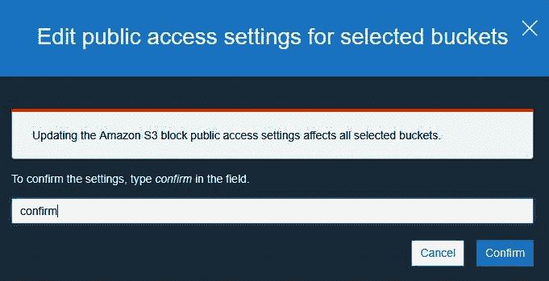
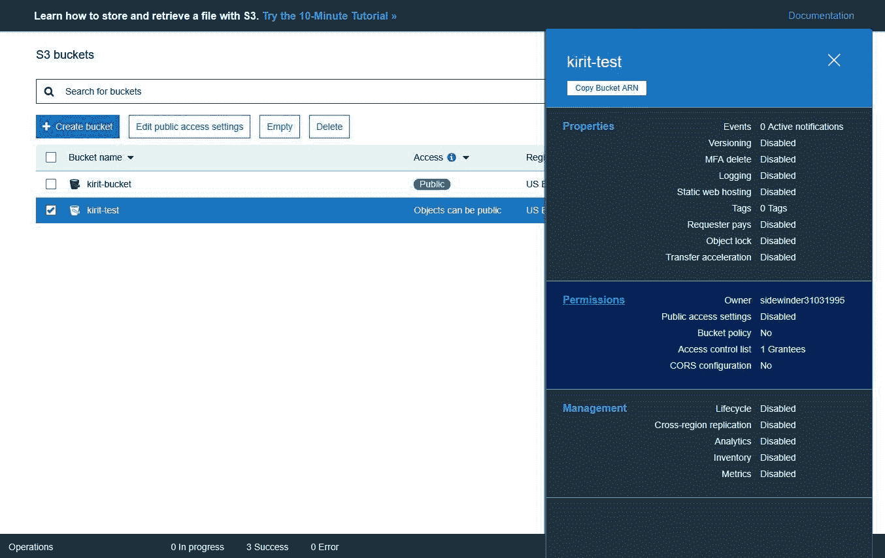
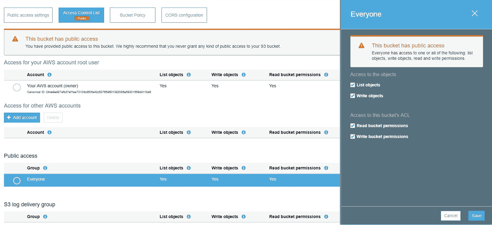
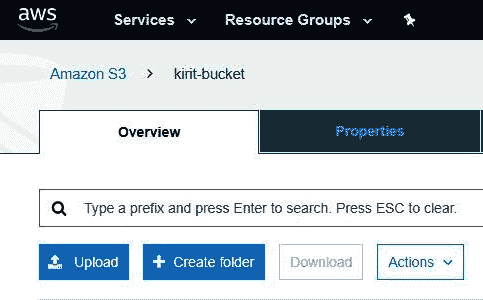

# 七、侦察——识别易受攻击的 S3 桶

**简单存储服务**（**S3**）存储桶是 AWS 基础设施最常见的攻击面之一，也是最容易受到黑客攻击的存储桶。

本章介绍 AWS S3 存储桶的概念、它们的用途以及如何设置和访问它们。然而，本章的主要重点是各种 S3 存储桶权限，识别配置不良或许可的存储桶的不同方法，以及连接到这些存储桶。最后，我们将重点介绍基于域名和子域名称在多个区域中识别易受攻击的 S3 存储桶的自动化方法，并探测它们的权限以查找潜在易受攻击的存储桶。

在本章中，我们将介绍以下主题：

*   设置我们的第一个 S3 存储桶
*   探索 AWS S3 权限和访问 API
*   从易受攻击的 S3 存储桶进行读写

# 设置您的第一个 S3 存储桶

我们将首先转到 S3 主页[https://s3.console.aws.amazon.com/s3/](https://s3.console.aws.amazon.com/s3/) ：

1.  在 S3 主页上，单击 Create bucket：



2.  在下一页中，为 bucket 指定一个名称：


分配存储桶名称时，必须遵循以下准则：

3.  如果愿意，您可以选择地理区域；我们正在为我们的桶命名`kirit-bucket`。
4.  单击创建 bucket，您的 bucket 将被创建：



一旦 bucket 启动并运行，您应该能够将对象上传到 bucket。如果您想知道对象是什么，它可以是任何文件，例如图像文件、音乐文件、视频文件或文档。

5.  要上载对象，请单击 bucket 并选择 upload：



文件浏览器将打开，您可以上传任何需要的文件。

6.  要下载对象，只需勾选该对象的复选框，然后选择下载：


# S3 权限和访问 API

S3 存储桶有两个权限系统。第一个是**访问控制策略**（**ACPs**，主要由 web UI 使用。这是一个简化的权限系统，为其他权限系统提供了一个抽象层。或者，我们有**IAM 访问策略**，它们是 JSON 对象，为您提供了权限的粒度视图。

权限应用于 bucket 或对象。Bucket 权限类似于主密钥；为了向某人提供对对象的访问，您需要首先向他们提供对 bucket 的访问，然后是对单个对象本身的访问。

正如我们前面看到的，可以从 WebGUI 访问 S3 bucket 对象。否则，可以使用`aws s3`cmdlet 从 AWS 命令行界面（**CLI**访问它们。您可以使用它上载、下载或删除 bucket 对象。

为了使用 AWS CLI 上载和下载对象，我们可以采取以下方法：

1.  首先安装`awscli`：

```
sudo apt install awscli
```

2.  使用新的用户凭证配置`awscli`。为此，我们需要访问密钥 ID 和秘密访问密钥。要获取这些信息，请执行以下步骤：
    1.  登录到 AWS 管理控制台
    2.  单击页面右上角的用户名
    3.  单击下拉菜单中的安全凭据链接
    4.  查找访问凭据部分，并复制最新的访问密钥 ID
    5.  单击同一行中的“显示”链接，复制机密访问密钥
3.  获取这些信息后，发出以下命令：

```
aws configure
```

输入您的访问密钥 ID 和机密访问密钥。记住不要将此公开，以确保您的帐户安全。您可以将默认区域和输出格式设置为“无”。

4.  一旦您的帐户设置完毕，就可以很容易地访问 S3 bucket 的内容：

```
aws s3 ls s3://kirit-bucket
```

前面代码中的`kirit-bucket`将替换为您的 bucket 名称。

5.  如果要遍历 bucket 中的目录，只需在前面输出中列出的目录后面加上`/`，例如，如果我们有一个名为`new`的文件夹：

```
aws s3 ls s3://kirit-bucket/new
```

6.  要将文件上载到 S3 存储桶，请发出`cp`cmdlet，后跟文件名和具有完整文件路径的目标存储桶：

```
aws s3 cp abc.txt s3://kirit-bucket/new/abc.txt
```

7.  要删除 S3 存储桶上的文件，请发出`rm`cmdlet，后跟完整文件路径：

```
aws s3 rm s3://kirit-bucket/new/abc.txt
```

# ACPs/ACLs

**访问控制列表**（**ACL**的思想与允许访问 S3 bucket 的防火墙规则非常相似。每个 S3 存储桶都有一个连接到它的 ACL。这些 ACL 可以配置为提供对 S3 存储桶的 AWS 帐户或组访问

ACL 有四种主要类型：

*   **读取**：具有读取权限的经过身份验证的用户将能够查看 bucket 中对象的文件名、大小和上次修改的信息。他们还可以下载他们有权访问的任何对象。
*   **写入**：经过身份验证的用户具有读取和删除对象的权限。用户还可以删除他们没有权限的对象；此外，他们还可以上载新对象。
*   **读取 acp**：经过身份验证的用户可以查看他们有权访问的任何 bucket 或 object 的 ACL。
*   **写入 acp**：经过身份验证的用户可以修改其访问的任何 bucket 或 object 的 ACL。

对于特定的受让人，一个对象最多只能有前四种类型组合中的 20 个策略。受让人指的是任何单独的 AWS 帐户（即电子邮件地址）或预定义的组。IAM 账户不能被视为受让人。

# 桶政策

每个 S3 bucket 都附带了 bucket 策略，这些策略可以应用于 bucket 及其内部的对象。如果有多个存储桶，则可以轻松复制策略。通过指定资源（如`"data/*"`，可以将策略应用于各个文件夹。这将对文件夹中的每个对象应用策略。

您可以使用 web UI 向 S3 存储桶添加策略。该操作位于 bucket Properties 页面的 Permissions 选项卡下：


接下来，我们将了解如何为 IAM 用户配置 bucket 访问。

# IAM 用户策略

为了提供对单个 IAM 帐户的 S3 访问，我们可以使用 IAM 用户策略。这是一种非常简单的方式，可以限制对任何 IAM 帐户的访问。

当必须将 ACL 权限应用于一个特定 IAM 帐户时，IAM 用户策略非常有用。如果您想知道是使用 IAM 还是 bucket 策略，一个简单的经验法则是确定权限是针对多个 bucket 中的特定用户，还是有多个用户，每个用户都需要自己的权限集。在这种情况下，IAM 策略比 bucket 策略更适合，因为 bucket 策略仅限于 20KB。

# 访问策略

访问策略是细粒度的权限，描述在对象或 bucket 上授予任何用户的权限。它们以 JSON 格式描述，可分为三个主要部分：`"Statement"`、`"Action"`和`"Resource"`。

以下是 JSON 中的 bucket 策略示例：

```
{
    "Version": "2008-02-27",
    "Statement": [
     {
            "Sid": "Statement",
            "Effect": "Allow",
            "Principal": {
            "AWS": "arn:aws:iam::Account-ID:user/kirit"
        },
        "Action": [
            "s3:GetBucketLocation",
            "s3:ListBucket",
            "s3:GetObject"
        ],
        "Resource": [
            "arn:aws:s3:::kirit-bucket"
        ]
     }
  ]
}
```

JSON 对象有三个主要部分。首先，在`"Statement"`部分中，我们可以看到有两点需要注意—`"Effect":"Allow"`和包含`"AWS":"arn:aws:iam::Account-ID:user/kirit"`的`"Principal"`部分。这本质上意味着`"kirit"`用户帐户被授予对对象的权限。

第二个是`"Action"`部分，它描述了允许用户使用的权限。我们可以看到用户可以列出`"s3:ListBucket"`bucket 中的对象，并从`"s3:GetObject"`bucket 下载对象。

最后，`Resource`部分描述了授予权限的资源。综上所述，策略总结为允许`kirit`用户帐户在名为`kirit-bucket`的 bucket 下使用`GetBucketLocation`、`ListBucket`和`GetObject`。

# 创建易受攻击的 S3 存储桶

在下一个练习中，我们将尝试从一个已向全世界公开的易受攻击的 S3 存储桶进行读写。为了做到这一点，我们将设置一个 S3 bucket，并故意使其易受攻击，使其公开可读写。

我们将首先转到 S3 主页（[https://s3.console.aws.amazon.com/s3/](https://s3.console.aws.amazon.com/s3/) ）并创建可公开访问的易受攻击的存储桶：

1.  创建一个新的 S3 存储桶。
2.  创建 bucket 后，选择 bucket 并单击编辑选定 bucket 的公共访问设置：


3.  取消选中所有复选框，然后单击保存。这样做是为了消除对存储桶实施的任何访问限制：



4.  AWS 将要求您确认变更；在字段中键入`confirm`并单击确认：



5.  单击 bucket，然后在侧面板上单击权限选项卡：



6.  转到“访问控制列表”，然后在“公共访问”下，单击“所有人”。侧面板将打开；启用所有复选框。这告诉 AWS 允许公众访问存储桶；这就是使铲斗易受攻击的原因：



7.  单击 Save，bucket 将被公开。

现在我们有了易受攻击的 bucket，我们可以将一些对象上传到它并公开它们；例如，我们将一个小文本文件上传到 bucket，如下所示：

1.  创建一个小文本文档。
2.  输入您的 bucket 并单击 Upload：



3.  选择文件并上载它。

上传文件后，单击对象，您将收到一个 S3URL，从外部访问该对象。您只需将浏览器指向 URL 即可访问 bucket：


对象 URL 链接位于页面底部，如前面的屏幕截图所示。

我们的易受攻击的 S3 桶现已建立，并向公众开放；任何人都可以读取或写入此存储桶。

在下一章中，我们将学习如何识别此类易受攻击的存储桶，并使用 AWSBucketDump 过滤数据。

# 总结

在本章中，我们了解了什么是 S3 bucket，如何设置 S3 bucket，以及如何在 S3 bucket 上授予访问权限。我们详细了解了 S3 权限，以及每种权限的适用方式和位置。我们介绍了如何设置 AWS CLI 并通过 CLI 访问 S3 存储桶。我们还了解了使 S3 bucket 易受攻击的设置。最后，我们建立了自己的易受攻击的 S3 存储桶，我们将在下一章中使用它。

在下一章中，我们将学习如何利用 S3 存储桶。我们将研究用于利用易受攻击的 S3 存储桶的工具。并且，我们将学习在利用易受攻击的 S3 存储桶后可以应用的各种开发后技术。

# 进一步阅读

*   **亚马逊 S3 REST API 简介**：[https://docs.aws.amazon.com/AmazonS3/latest/API/Welcome.html](https://docs.aws.amazon.com/AmazonS3/latest/API/Welcome.html)
*   **亚马逊 S3 示例**：[https://boto3.amazonaws.com/v1/documentation/api/latest/guide/s3-examples.html](https://boto3.amazonaws.com/v1/documentation/api/latest/guide/s3-examples.html)
*   **在策略**[中指定权限 https://docs.aws.amazon.com/AmazonS3/latest/dev/using-with-s3-actions.html](https://docs.aws.amazon.com/AmazonS3/latest/dev/using-with-s3-actions.html)