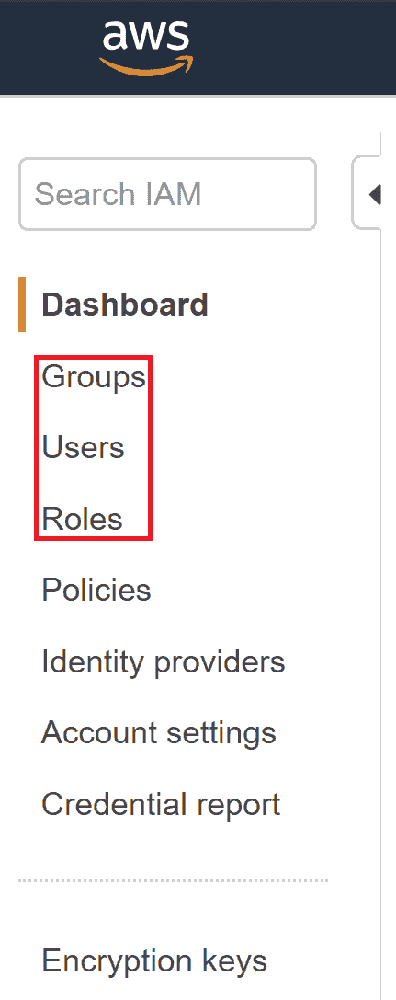
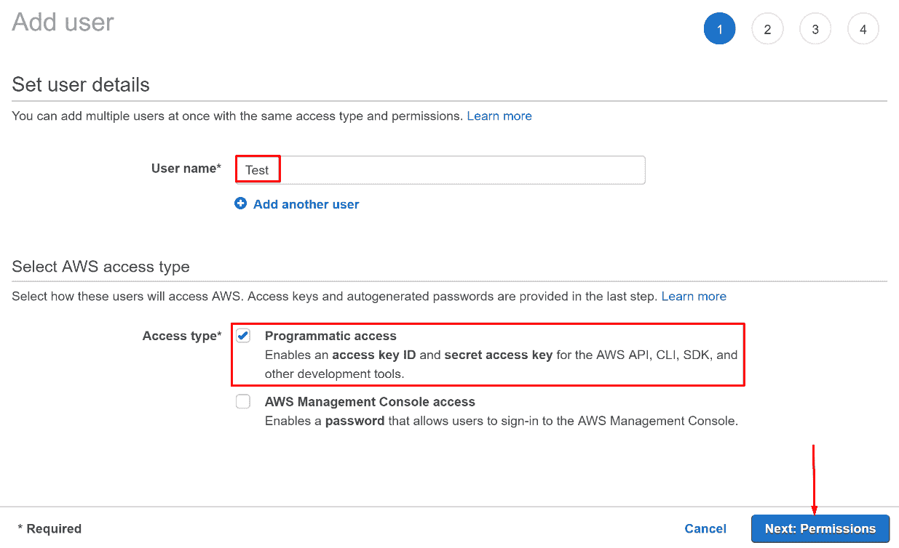
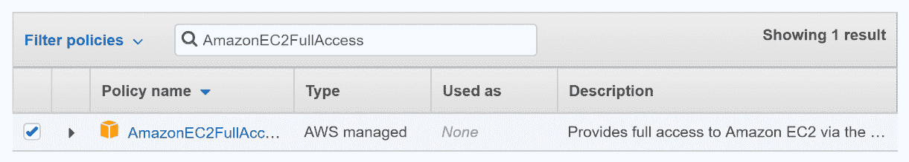
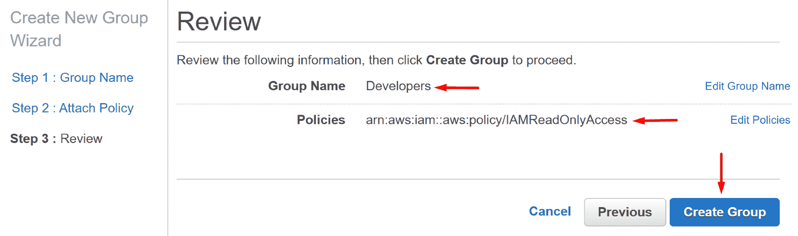
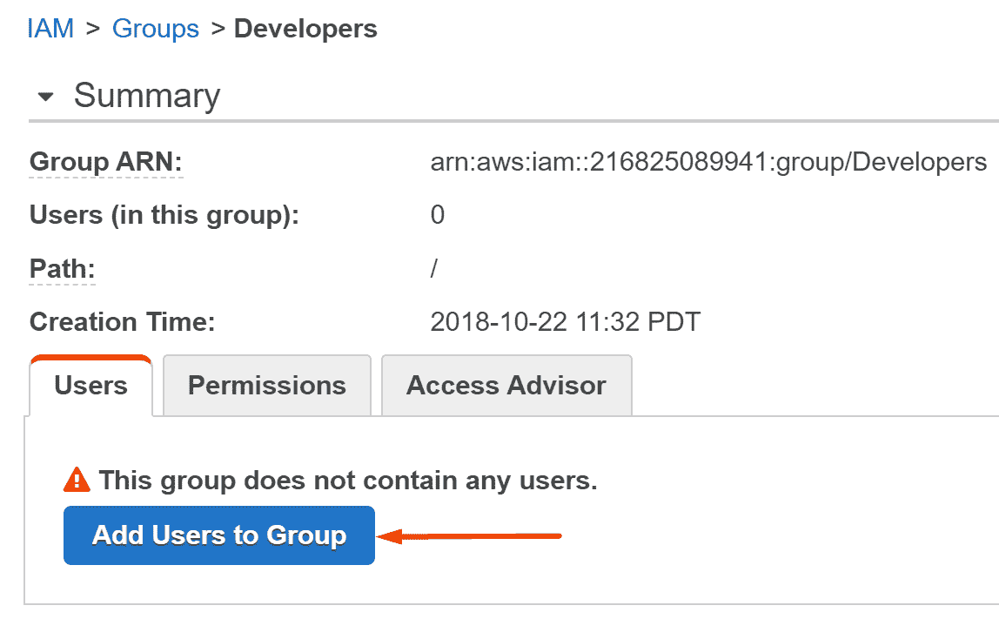
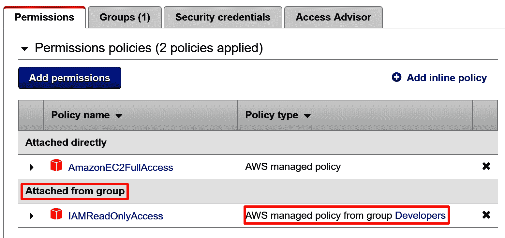
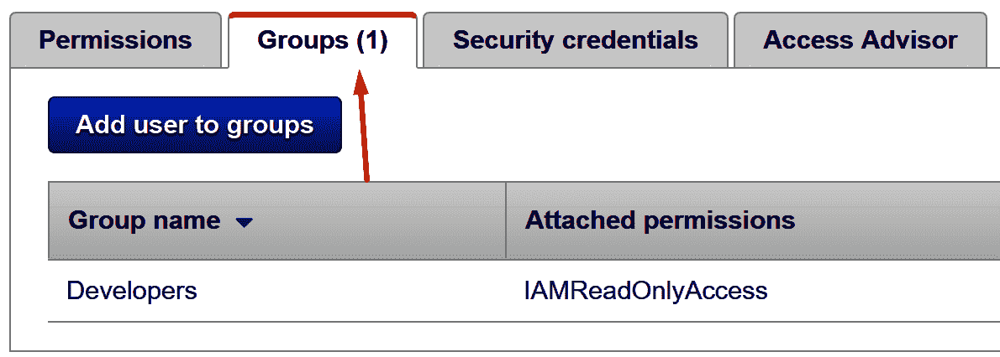
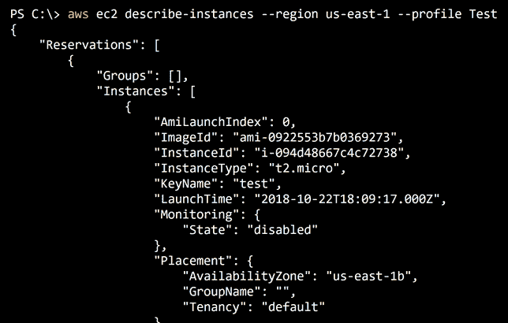

# 九、AWS 上的身份访问管理

AWS 通过 IAM 服务为用户提供了许多不同的身份验证方法，其中最常见的包括用户帐户和角色。IAM 用户提供了为需要长期访问环境的内容设置凭据的方法。用户可以通过使用用户名和密码通过 web UI 进行身份验证，或者通过使用 API 密钥（访问密钥 ID 和秘密访问密钥）以编程方式发出请求来访问 AWS API。

另一方面，角色提供了在用户/服务/应用程序需要时将临时凭据委派给他们的方法。拥有`sts:AssumeRole`权限的 IAM 用户可以扮演角色，获取一组仅在少量时间内有效的 API 密钥（访问密钥 ID、秘密访问密钥和会话令牌）。默认情况下，寿命设置为这些密钥到期前一小时。这些密钥将具有分配给假定角色的权限，并且它们通常用于完成某些任务。通过使用此模型，环境中的 AWS 用户并不总是拥有他们可能需要使用的所有权限；相反，他们可以请求角色拥有的权限，因为他们需要这些权限。这允许更严格的审核和权限管理。

AWS IAM 中还有被称为**组**的资源。组可用于将公共权限集委托给一组用户。在示例 AWS 环境中，可能有一个名为**开发者**的组，该组提供对公司开发者需要访问的服务的访问。然后，可以将用户添加到组中，他们将继承与该组关联的权限。只要用户是关联组的成员，他们将只保留提供的权限。单个用户最多可以是 10 个独立组的成员，单个组最多可以容纳帐户中允许的用户总数。

IAM 用户、角色和组对于我们的攻击过程和我们对 AWS 基础设施的基本了解非常重要。本章旨在深入了解 IAM 服务的一些常见功能，以及我们如何将其用作常规 AWS 用户和攻击者。

在本章中，我们将使用 IAM 服务涵盖以下主题：

*   如何创建 IAM 用户、组、角色和关联权限
*   如何限制特定角色可以访问的 API 操作和资源
*   使用 IAM 访问密钥
*   签署 AWS API 请求

# 创建 IAM 用户、组、角色和关联权限

登录 AWS web 控制台后，可以通过导航到 IAM 服务页面来创建用户、组和角色：

1.  要进入 IAM 页面，请单击页面左上角的“服务”按钮，然后搜索并单击 IAM 页面的相关链接：


在 AWS web 控制台的服务下拉菜单中搜索 IAM 服务

2.  下图显示了 IAM 仪表板上用户、组和角色的相关链接。单击用户继续：



IAM 仪表板上的相关链接

3.  要创建 IAM 用户，请单击页面左上角的添加用户按钮：


用户仪表板上的添加用户按钮

然后，您将看到一个页面，该页面请求用户名和向新用户提供的访问类型。您可以选择的两种访问类型之一是编程访问，它为用户创建访问密钥 ID 和秘密访问密钥，以便用户可以通过类似于 AWS CLI 或为各种编程语言提供的 SDK 的方式访问 AWS API。另一个是 AWS 管理控制台访问，它将自动生成密码或允许您设置自定义密码，以便用户可以访问 AWS web 控制台。

4.  在我们的示例中，让我们创建一个名为`Test`的用户，该用户允许对 AWS API 进行编程访问。填写完毕后，您可以单击“下一步：权限”继续：



图 4：创建一个名为 Test 的新用户，通过编程访问 AWSAPI

5.  继续后，您将看到三个选项，用于设置此新用户的权限。

如果您想创建一个没有任何权限的用户（例如，如果您以后要处理这些权限），您可以单击 Next:Review 跳过此页面。

提供的三个选项允许您执行以下操作：

单击第三个选项将现有策略直接附加到用户：


图 5：选择将现有策略直接附加到新用户的选项

执行此操作后，您将看到 IAM 策略列表。

6.  在出现的搜索框中，键入`AmazonEC2FullAccess`并选中出现的策略左侧的框。此策略将为用户提供对 EC2 服务以及通常与 EC2 一起使用的其他服务的完全访问权。如果您有兴趣查看此策略的 JSON 文档，可以单击策略名称旁边的箭头，然后单击{}JSON 按钮：


图 6：查看所选 IAM 策略的 JSON 文档

IAM 策略是 JSON 格式的文档，用于指定允许或拒绝哪些权限，这些权限应用于哪些资源，以及在哪些条件下这些权限对特定用户、组或角色有效。

IAM 策略有两种：AWS 管理的策略和客户管理的策略。AWS 管理的策略是 AWS 管理的预定义权限集。AWS 管理的策略可以通过策略名称旁边的小橙色 AWS 符号识别。不允许客户修改这些 AWS 管理的策略，在设置权限时提供这些策略是为了方便：



图 7：选择了 AWS 管理策略 AmazonEC2FullAccess

客户管理的策略与 AWS 管理的策略相同，只是它们必须创建，并且可以随时完全自定义。这些策略允许您将细粒度访问权委托给帐户中的各种 IAM 用户、组和角色。

7.  我们现在可以单击窗口右下角的“下一步：查看”按钮继续。下一页将是我们刚刚设置的内容的摘要，因此我们可以继续并单击窗口右下角的 Create user（创建用户）按钮。
8.  接下来，您将看到一条绿色的成功消息，以及查看或下载此新用户的关联访问密钥 ID 和秘密访问密钥的选项：


图 8：创建新 IAM 用户后显示的成功页面

这是您唯一可以使用这些凭据的时间，因此安全地将这些信息存储在只有您才能访问的位置非常重要。

创建角色和组也可以遵循相同的一般流程。

如果我们想创建一个组并向其中添加新用户，我们可以按照以下步骤操作：

1.  导航到 AWS web 控制台中 IAM 页面的“组”选项卡，然后单击左上角的“创建新组”。
2.  提供此组的名称；在我们的示例中，它将是`Developers`。
3.  我们将被要求选择要附加到此组的 IAM 策略，我们将搜索该策略；我们将把 IAMReadOnlyAccess AWS 管理策略添加到我们的组中。
4.  点击下一步，我们将看到想要创建的组的摘要，在这里，我们可以通过单击右下角的 create group 来完成此过程，如以下屏幕截图所示：



图 9：使用附加的 IAMReadOnlyAccess 策略创建名为 Developers 的新组

5.  现在该组已创建，我们可以从 IAM 组页面单击它，我们将看到类似于以下屏幕截图的内容，我们可以单击添加用户到组按钮将新用户添加到其中：



我们新创建的组中还没有任何用户

6.  然后，我们可以搜索并选中之前创建的`Test`用户旁边的框，然后单击添加用户按钮，如以下屏幕截图所示，以完成此过程：


选择测试用户并将其添加到新开发人员组

7.  现在，如果我们导航到`Test`用户的用户页面，我们可以看到我们之前附加的 AmazonEC2FullAccess AWS 管理策略已附加到我们的用户，以及附加自组的另一部分，其中包括我们的用户从`Developers`组继承的 IAMReadOnlyAccess AWS 管理策略：



直接附加到用户的策略和从 Developers 组继承的策略

8.  如果我们对用户所在的组以及用户从中继承的策略感到好奇，我们可以单击组（1）选项卡，它将为我们提供以下信息：



我们的用户所属的组以及我们从这些组继承的策略

无法将角色添加到组中，但可以使用与用户和组相同的方式附加和删除 IAM 策略。角色还有一个重要的特性，称为**信任关系**。信任关系指定谁可以承担（请求临时凭据）相关角色，以及在什么条件下可以发生。

我创建了一个角色，该角色与 AWS EC2 服务建立了信任关系，这意味着 EC2 资源可以为该角色请求临时凭据。以下屏幕截图显示了查看特定角色时的“信任关系”选项卡：


信任关系选项卡

在突出显示的部分中，我们可以看到我们有一个受信任的实体，它是身份提供者 ec2.amazonaws.com。

信任关系在名为**假定角色策略**文档的 JSON 文档中指定。我们的示例角色指定了以下假定角色策略文档：

```
{
  "Version": "2012-10-17",
  "Statement": [
    {
     "Effect": "Allow",
      "Principal": {
        "Service": "ec2.amazonaws.com"
      },
      "Action": "sts:AssumeRole"
    }
  ]
}
```

下一节将更深入地描述策略及其支持的密钥，但基本上，这个 JSON 文档所说的是允许 EC2 服务（主体）在针对这个角色时运行`sts:AssumeRole`操作（效果）。主体还可以包括 IAM 用户、其他 AWS 服务或其他 AWS 帐户。这意味着您可以承担跨帐户角色，这是作为攻击者在帐户中建立持久性的常见方法。这将在[第 11 章](11.html)中进一步说明，*使用 Boto3 和 Pacu 来维持 AWS 持久性*。现在，我们将继续研究使用 IAM 策略限制 API 操作和可访问资源。

# 使用 IAM 策略限制 API 操作和可访问资源

IAM 策略是将权限委派给帐户中的用户、角色和组的方式。它们是简单的 JSON 文档，指定具体允许或拒绝哪些权限，哪些资源可以/不能使用这些权限，以及在哪些条件下应用这些规则。我们可以使用它们在 AWS 环境中实施细粒度权限模型。

# IAM 政策结构

以下 JSON 文档是为描述 IAM 策略文档的一些关键功能而创建的示例：

```
{
    "Version": "2012-10-17",
    "Statement": [
        {
            "Sid": "MyGeneralEC2Statement"
            "Effect": "Allow",
            "Action": "ec2:*",
            "Resource": "*"
        },
        {
            "Effect": "Allow",
            "Action": [
                "iam:GetUser"
            ],
            "Resource": "arn:aws:iam::123456789012:user/TestUser"
        },
        {
            "Effect": "Allow",
            "Action": "sts:AssumeRole",
            "Resource": "*",
            "Condition": {
                "Bool": {
                    "aws:MultiFactorAuthPresent": "true"
                }
            }
        }
    ]
}
```

本政策举例说明了 IAM 政策的一些最常见特征。首先，我们有`Version`键，它指定正在使用的策略语言的版本。最佳实践是使用最新版本，目前为`2012-10-17`，除此之外无需考虑太多。

接下来，我们有`Statement`键，这是一个 JSON 对象列表，称为语句。语句是权限的单独声明以及与之相关的设置。语句可以由`Sid`、`Effect`、`Action`、`NotAction`、`Principal`、`Resource`和`Condition`键组成。

`Sid`是可选字段，是您选择的字符串，用于帮助区分策略中的不同语句。它不需要提供，但如果需要，它基本上只是让读者更容易理解策略。在前面的策略中，`MyGeneralEC2Statement`Sid 表示该语句是 EC2 服务的通用语句。

`Effect`键是一个必填字段，可以设置为`Allow`或`Deny`，它声明列出的 AWS 权限（在`Action`或`NotAction`下）是被明确允许还是被明确拒绝。前面示例策略中的所有语句都显式允许关联的权限。

需要一个`Action`或`NotAction`键，其中包含一组 AWS 权限。几乎每次，您都会看到使用`Action`而不是`NotAction`。前面示例策略中的第一条语句明确允许使用 IAM 策略通配符（`*`的`ec2:*`操作。

权限设置为`[AWS Service]:[Permission]`格式，因此`ec2:*`权限指定了与 AWS EC2 服务相关的每一个权限（如`ec2:RunInstances`和`ec2:CopyImage`。通配符可以在 IAM 策略的不同位置使用，例如在以下权限中：`ec2:Describe*`。这将代表每一个以`Describe`开头的 EC2 许可（例如`ec2:DescribeInstances`和`ec2:DescribeImages`。`NotAction`稍微复杂一点，但基本上，它们与`Action`相反。这意味着`NotAction ec2:Modify*`将代表所有 AWS 服务的每个 API 调用，但以`Modify`开头的 EC2 权限除外（例如`ec2:ModifyVolume`和`ec2:ModifyHosts`。

`Principal`键适用于不同类型的 IAM 策略，超出了我们目前所看到的范围（如上一节中的“承担角色”策略文档）。它表示语句要应用到的资源，但它会自动隐含在用户、角色和组的权限策略中，因此我们现在将跳过它。

`Resource`键是必填字段，是`Action`/`NotAction`部分下指定权限适用于哪些 AWS 资源的列表。此值通常仅指定为通配符，它表示任何 AWS 资源，但最好将大多数 AWS 权限锁定到必须在其上使用的所需资源。在第二条语句中，我们在示例策略中列出了资源，资源被列为`arn:aws:iam::123456789012:user/TestUser`，它是帐户中具有`123456789012`帐户 ID 和`TestUser`用户名的用户的 ARN。这意味着我们只允许（效果）对帐户中具有`123456789012`ID 和`TestUser`用户名（资源）的用户执行`iam:GetUser`API 调用（操作）。请注意，尽管资源中列出了帐户 ID，但许多 API 调用不能在属于与进行调用的用户/角色不同的 AWS 帐户的资源上使用，即使存在通配符而不是帐户 ID。

`Condition`键是一个可选字段，指示在什么条件下应用语句的规范。在前面示例的第三条语句中，我们将名为`aws:MultiFactorAuthPresent`的`Bool`条件（布尔值，换句话说，`true`/`false`）设置为 true。这意味着要应用此语句（允许对任何资源的`sts:AssumeRole`权限），用户/角色必须通过 AWS 的多因素身份验证；否则，该权限是不允许的。还有许多其他条件可以指定，例如任何 API 调用都需要特定的源 IP 地址，要求在特定的时间范围内进行 API 调用，等等（请参见[https://docs.aws.amazon.com/IAM/latest/UserGuide/reference_policies_elements_condition_operators.html](https://docs.aws.amazon.com/IAM/latest/UserGuide/reference_policies_elements_condition_operators.html) 。

# IAM 策略的目的和用法

作为攻击者，了解 IAM 策略的工作原理非常重要，因为一旦您能够读取它们，您就可以准确地确定您对环境的访问权限，以及为什么您所进行的某些 API 调用会因拒绝访问错误而失败，即使它们似乎应该被允许。可能是您的目标资源未在策略中指定，您未通过多因素身份验证，或者可能是由于其他各种原因。

当我们在攻击过程中检查受损的密钥时，我们希望看到如下声明：

```
{
    "Effect": "Allow",
    "Action": "*",
    "Resource": "*"
}
```

此语句为我们提供管理员级别的权限。因为它允许使用`*`权限，并且`"*"`字符是一个通配符，这意味着允许使用与 AWS 服务相关的任何权限。资源也是通配符，因此我们可以对目标帐户中的任何资源运行任何 API 调用。有一个 AWS 管理的 IAM 策略具有这些权限，称为`AdministratorAccess`策略。本保单的 ARN 为`arn:aws:iam::aws:policy/AdministratorAccess`。

要在测试时管理用户的权限，您可以将 IAM 策略附加到用户、角色或组，以向他们提供或拒绝策略中设置的权限。到目前为止，我们所研究的策略类型可以重用并附加到多种不同类型的资源。例如，同一 IAM 策略可以同时附加到用户、组和/或角色。

内联策略也存在，与托管策略一样，内联策略不是独立的资源，然后附加到用户、角色或组，而是直接在用户、角色或组上创建的。内联策略不能像托管策略那样重用，因此，安全性最佳做法是尽量避免使用内联策略。作为攻击者，我们可以出于几种不同的恶意原因使用它们，但由于它们仅适用于单个资源，因此在攻击期间创建一个资源时会更加隐蔽。它们的工作原理与托管策略相同，但需要一组不同的权限与之交互。有时，您可能会发现受损用户/角色可能有权使用内联策略，但不能使用托管策略，反之亦然。

以下屏幕截图来自 AWS web 控制台，它显示了我设置的 IAM 用户，该用户同时具有托管策略（AmazonEC2FullAccess）和内联策略（TestPolicy）：


附加到 IAM 用户的 AWS 管理策略和内联策略

# 使用 IAM 访问密钥

既然我们已经创建了一个用户和访问密钥，并且了解了 IAM 策略是如何工作的，现在是时候让它们发挥作用来进行一些 AWS API 调用了：

1.  首先，让我们安装 AWS**命令行界面**（**CLI**）。最简单的方法（如果您的计算机上安装了 Python 和`pip`）是运行以下`pip`命令：

```
pip install awscli --upgrade --user
```

2.  然后，您可以通过运行以下命令来检查安装是否成功：

```
aws --version
```

有关操作系统的更多具体说明，请访问：[https://docs.aws.amazon.com/cli/latest/userguide/installing.html](https://docs.aws.amazon.com/cli/latest/userguide/installing.html) 。

3.  要将我们的用户凭据添加到 AWS CLI 以便进行 API 调用，我们可以运行以下命令，将我们的凭据存储在`Test`配置文件下（注意，配置文件允许您从命令行管理多组不同的凭据）：

```
aws configure --profile Test
```

4.  系统将提示您输入几个不同的值，包括您的访问密钥 ID 和密钥，这是我们在前面创建`Test`用户后提供的。然后，将要求您输入默认的地区名称，在我们的示例中，我们将选择`us-west-2`（俄勒冈州）地区。最后，将要求您输入默认的输出格式。我们将选择`json`作为默认格式，但还有其他可用值，例如`table`。以下屏幕截图显示我们在新安装的 AWS CLI 中设置`Test`配置文件的凭据：


使用新创建的凭据创建测试配置文件

我们的新配置文件现在将存储在 AWS CLI 凭据文件中，该文件位于以下文件中：`~/.aws/credentials`。

5.  要更新该配置文件的凭据/设置，您可以再次运行相同的命令，并且要在泄露凭据时添加新的凭据集，您只需将配置文件的名称从`Test`更改为对您添加的密钥有意义的名称即可。现在我们已经安装了 AWS CLI 并设置了`Test`配置文件，开始使用我们的凭据就很简单了。需要记住的一点是，因为我们使用的是 AWS CLI 配置文件，所以您需要记住在所有 AWS CLI 命令中包含`--profile Test`参数，以便使用正确的凭据进行 API 调用。

6.  一个非常有用的开始命令是由**安全令牌服务**（**STS**（[提供的`GetCallerIdentity`APIhttps://docs.aws.amazon.com/STS/latest/APIReference/API_GetCallerIdentity.html](https://docs.aws.amazon.com/STS/latest/APIReference/API_GetCallerIdentity.html) ）。此 API 调用提供给每个 AWS 用户和角色，不能通过 IAM 策略拒绝。这允许我们使用此 API 作为枚举有关密钥的一些常见帐户信息的方法。继续并运行以下命令：

```
aws sts get-caller-identity --profile Test
```

您应该看到如下屏幕截图所示的输出：


从测试配置文件运行 sts:GetCallerIdentity 命令

输出包括用户 ID、帐户 ID 和当前用户的 ARN。用户 ID 是您的用户在 API 后端的引用方式，通常，我们在进行 API 调用时不需要它。帐户 ID 是此用户所属帐户的 ID。

在您拥有帐户 ID 的情况下，可以通过多种方法枚举帐户中存在的用户和角色，而无需在目标帐户中创建日志，但这种攻击通常在攻击后的情况下没有多大帮助，对于社会工程之类的东西更有用。当前用户的**亚马逊资源名**（**ARN**）包括账号 ID 和用户名。

我们使用 AWS CLI 进行的所有其他 API 调用都将以类似的方式运行，并且大多数 AWS 服务都在 AWS CLI 中受支持。列出您可以针对的服务以及如何引用它们的一个小技巧是运行以下命令：

```
aws a
```

基本上，此命令尝试以`a`服务为目标，但由于该服务不是真正的服务，AWS CLI 将打印出所有可用的服务，如以下屏幕截图所示：


对无效服务运行 AWS CLI 命令以列出可用服务

同样的技巧也可以用于列出每个服务可用的 API。假设我们知道要以 EC2 服务为目标，但不知道要运行的命令的名称。我们可以运行以下命令：

```
aws ec2 a
```

这将尝试运行不存在的`a`EC2 API 调用，因此 AWS CLI 将打印出您可以选择的所有有效 API 调用，如以下屏幕截图所示：


运行无效的 AWS CLI 命令以列出目标服务（EC2）支持的命令

有关 AWS 服务或 API 调用的更多信息，如描述、限制和支持的参数，我们可以使用`help`命令。对于 AWS 服务，可以使用以下命令：

```
aws ec2 help
```

对于特定的 API 调用，可以使用以下命令：

```
aws ec2 describe-instances help
```

为了完成本节，让我们利用前面附加到用户的 AmazonEC2FullAccess 策略：

1.  如果我们想列出默认区域中的所有实例（我们之前选择了`us-west-2`，我们可以运行以下命令：

```
aws ec2 describe-instances --profile Test
```

如果您的帐户中没有运行任何 EC2 实例，您可能会看到如下屏幕截图所示的输出：


当目标区域没有 EC2 实例时，尝试描述 EC2 实例的结果

2.  在不指定区域的情况下，这将自动以`us-west-2`区域为目标，因为我们在设置凭证时将其作为默认输入。这可以通过使用`--region`参数在每个 API 调用中手动完成，如以下命令中所示：

```
aws ec2 describe-instances --region us-east-1 --profile Test
```

我们的测试账号有一个 EC2 实例在`us-east-1`中运行，所以这次的输出会有所不同。它将如以下屏幕截图所示：



描述`us-east-1`区域中的 EC2 实例时返回的部分输出

数据将以 JSON 格式返回，因为这是我们在设置凭据时指定的默认格式。它将包括许多与它在该地区找到的 EC2 实例和目标帐户相关的信息，例如实例 ID、实例大小、用于启动实例的映像、网络信息等等。

这些信息的各个部分可以在后续请求中收集和重用。这方面的一个例子是注意到每个实例都附加了哪些 EC2 安全组。系统会向您提供安全组的名称和 ID，然后可以在试图描述应用于这些组的防火墙规则的请求中使用这些 ID。

3.  在我们`ec2:DescribeInstances`调用的结果中，我们可以看到`sg-0fc793688cb3d6050`安全组已附加到我们的实例。我们可以通过将该 ID 输入到`ec2:DescribeSecurityGroups`API 调用中来获取有关该安全组的信息，如以下命令所示：

```
aws ec2 describe-security-groups --group-ids sg-0fc793688cb3d6050 --region us-east-1 --profile Test
```

现在，我们将看到应用于前面描述的实例的入站和出站防火墙规则。以下屏幕截图显示了应用于我们实例的命令和一些入站流量规则：


命令和一些入站交通规则

我们可以看到，在`IpPermissions`键下，允许从任何 IP 地址（`0.0.0.0/0`入站访问端口 22。屏幕截图中没有显示指定 EC2 实例出站流量规则的`IpPermissionsEgress`键。

# 手动签署 AWS API 请求

大多数 AWS API 调用要求在将数据发送到 AWS 服务器之前对其中的某些数据进行签名。这样做有几个不同的原因，例如允许服务器验证 API 调用方的身份，保护数据在传输到 AWS 服务器时不被修改，以及防止重播攻击，攻击者以某种方式拦截您的请求并自己再次运行。默认情况下，签名请求的有效期为五分钟，因此从技术上讲，如果在五分钟窗口关闭之前拦截并重新发送请求，则可能会发生重播攻击。AWS CLI 和 AWS SDK（例如位于[的`boto3`Python 库）https://boto3.amazonaws.com/v1/documentation/api/latest/index.html](https://boto3.amazonaws.com/v1/documentation/api/latest/index.html) 自动为您处理所有的请求签名，您无需考虑。

不过，在一些情况下，您可能需要手动签署 API 请求，因此本节将简要介绍如何做到这一点。如果您使用的编程语言没有 AWS SDK，或者您希望完全控制发送到 AWS 服务器的请求，那么您将需要执行类似操作的唯一实际情况是。支持两个版本的签名（v2 和 v4），但对于我们的用例，我们几乎总是使用 v4。

有关签名请求和细节的更多信息，请访问 AWS 文档的链接：[https://docs.aws.amazon.com/general/latest/gr/signing_aws_api_requests.html](https://docs.aws.amazon.com/general/latest/gr/signing_aws_api_requests.html) 。

基本上，使用签名 v4 对 AWS API 请求进行手动签名的过程包括四个单独的步骤：

1.  创建规范化请求（[https://docs.aws.amazon.com/general/latest/gr/sigv4-create-canonical-request.html](https://docs.aws.amazon.com/general/latest/gr/sigv4-create-canonical-request.html) ）
2.  创建要签名的字符串（[https://docs.aws.amazon.com/general/latest/gr/sigv4-create-string-to-sign.html](https://docs.aws.amazon.com/general/latest/gr/sigv4-create-string-to-sign.html) ）
3.  计算该字符串的签名（[https://docs.aws.amazon.com/general/latest/gr/sigv4-calculate-signature.html](https://docs.aws.amazon.com/general/latest/gr/sigv4-calculate-signature.html) ）
4.  将该签名添加到您的 HTTP 请求（[https://docs.aws.amazon.com/general/latest/gr/sigv4-add-signature-to-request.html](https://docs.aws.amazon.com/general/latest/gr/sigv4-add-signature-to-request.html) ）

AWS 文档中有一些关于如何完成此过程的很好的示例。

下面的链接有示例 Python 代码，显示了整个过程并解释了过程中的步骤：[https://docs.aws.amazon.com/general/latest/gr/sigv4-signed-request-examples.html](https://docs.aws.amazon.com/general/latest/gr/sigv4-signed-request-examples.html) 。

# 总结

在本章中，我们介绍了 IAM 服务的一些基础知识，如 IAM 用户、角色和组。我们还研究了如何使用 IAM 策略限制环境中的权限，以及 IAM 用户访问密钥和 AWS CLI。此外，还提供了有关手动签署 AWS HTTP 请求的信息，供您在极少数情况下使用。

这些基本主题将在本书中一次又一次地出现，因此，掌握 AWS IAM 服务非常重要。IAM 服务的更多功能、复杂性和细节我们在本章中没有介绍，但一些更重要的功能将在本书的其他章节中单独讨论。本章内容的主要原因是在您稍后深入了解 AWS 的更高级主题和服务时提供知识基础。

在下一章中，我们将介绍如何使用 AWS`boto3`Python 库和被盗的访问密钥来枚举我们自己的权限，以及如何将权限升级到管理员！我们还将介绍 Pacu，一个 AWS 攻击工具包，它已经自动化了许多这些攻击过程，并使自己更容易实现自动化。权限枚举和权限提升是 AWS pentests 不可或缺的部分，所以请做好准备！