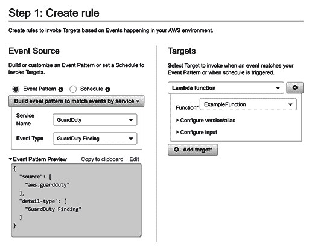

# 十六、GuardDuty

作为攻击者，了解我们的目标环境中正在进行什么样的监视非常重要，因为它可以并且将影响整个攻击计划。如果我知道每当发生 XYZ 时都会启用某种类型的监视触发，那么我就永远不会执行 XYZ，因为我知道我会被抓到。相反，我会选择另一条更容易被忽视的路线。如果我知道环境中没有监控，那么我可以采取最简单或最快速的方式实现目标，而不用担心触发某些操作的警报。

**亚马逊网络服务****AWS**提供多种安全服务，但主要的安全监控服务称为**GuardDuty**。重要的是要注意，即使在禁用 GuardDuty 的环境中，这也不意味着没有任何监控在进行。这是因为有很多工具，AWS 的内部工具以及提供监控选项的第三方工具。本章将介绍 AWS 监控服务 GuardDuty，这是一种在环境中捕获低挂果实的廉价内部解决方案。

在本章中，我们将介绍以下主题：

*   GuardDuty 及其发现简介
*   警惕并对警戒发现作出反应
*   绕过警卫

# GuardDuty 及其发现简介

GuardDuty 是 AWS 提供的一种持续监控服务，用于识别和提醒帐户内的可疑或不想要的行为。目前分析的数据源有三个，分别是**虚拟私有云**（**VPC**流量日志、CloudTrail 事件日志和**域名****系统**（**DNS**日志。请注意，不需要在您的帐户上启用 VPC 流日志记录和 CloudTrail 事件日志记录，GuardDuty 就可以使用它们，而且目前无法在 AWS 中查看 DNS 日志。这意味着，即使环境中没有活动的流日志并且 CloudTrail 被禁用，GuardDuty 仍将从 VPC 流日志、CloudTrail 事件日志和 DNS 日志生成发现。

还需要注意的是，如果请求通过 AWS DNS 解析程序路由，GuardDuty 只能接收 DNS 日志，这是 EC2 实例的默认设置。如果更改了此设置，并且请求正在使用备用 DNS 解析程序（如 Google 或 CloudFlare），则 GuardDuty 无法接收该 DNS 数据并发出警报。

GuardDuty 也可以跨帐户管理，其中单个主帐户控制一个或多个成员帐户的 GuardDuty 监控和配置。如果您发现自己处于组织的 GuardDuty 主帐户中，您将有可能在与之连接的每个帐户上操纵监控配置。

For more information on cross-account GuardDuty configurations, visit the AWS documentation here: [https://docs.aws.amazon.com/guardduty/latest/ug/guardduty_accounts.html](https://docs.aws.amazon.com/guardduty/latest/ug/guardduty_accounts.html).

GuardDuty 针对各种不同的项目生成调查结果。有关最新列表，请访问[https://docs.aws.amazon.com/guardduty/latest/ug/guardduty_finding-types-active.html](https://docs.aws.amazon.com/guardduty/latest/ug/guardduty_finding-types-active.html) 审查产生的一组活跃的调查结果。

在较高级别上，GuardDuty 基本上会提醒您有关可能类似恶意行为的事件，例如，如果 EC2 实例正在与已知的恶意软件命令和控制服务器通信，EC2 实例正在与已知的比特币挖掘池通信，或者正在使用已知的黑客操作系统。这些警报可以设置为向`CloudWatch`事件发送通知，然后您可以对发现作出反应：


AWS web 控制台中帐户中报告的示例担保结果列表

大多数安全查找类型依赖于机器学习来建立帐户中用户正常活动的基线。如果某个内容超出该基线并与该查找类型匹配，它将发出警报。考虑一个具有两个 IAM 用户的 AWS 帐户和启用 GARDWORD 任务。其中一个用户经常使用 IAM 服务来管理用户、组和角色，并管理所有这些用户的权限。另一个用户只使用 EC2 服务，即使他们有权做更多的事情。如果两个用户都试图枚举 IAM 用户、组或角色的权限，则 GuardDuty 很可能不会触发 IAM 用户，因为这样与 IAM 服务交互是该用户基线的一部分。另一方面，EC2 用户可能会生成`Recon:IAMUser/UserPermissions`GuardDuty 查找类型，这表示用户正在尝试枚举帐户中的权限（这打破了为他们建立的基线）。

有许多非常简单的守卫查找类型，用于从攻击者那里捕获低垂的果实。这些类型的发现通常很简单或明显，即使你没有直接想到它们，你也不应该触发它们。其中一些发现包括端口扫描 EC2 实例、强制使用**安全外壳**（**SSH**/**远程桌面协议**（**RDP**）服务器，或者使用 Tor 与 AWS 通信。在本章中，我们将重点介绍更具体的 AWS 调查结果和更高级的调查结果，因为简单的调查结果类型不一定在本书的范围内，无论如何，它们应该很容易绕过或避免。

要考虑的另一个重要注意事项是如何使用机器学习和基线来确定它是否应该触发发现。如果您所在的沙箱环境由于测试工具和攻击方法而不断受到攻击，那么 GuardDuty 可能会将此活动检测为您帐户的基线。如果是这样的话，那么它可能不会触发您预期的某些发现，因为它已经确定了这种类型的活动在环境中是正常的。

# 警惕并对警戒发现作出反应

默认情况下，GuardDuty 将生成调查结果并在 web 控制台上提供。也可以设置`CloudWatch`事件规则，以便在这些发现出现时对其作出反应。要通过 AWS web 控制台执行此操作，我们可以导航到`CloudWatch`事件规则页面并创建新规则。对于此规则，我们将选择 GuardDuty 作为要匹配的服务，然后选择 GuardDuty Finding 作为要匹配的事件类型。然后，我们将选择某种目标，将调查结果的信息发送给他们。目标可以是各种各样的东西，例如**简单通知服务**（**SNS**）主题，然后通过文本或电子邮件将发现的数据发送给安全团队，或者可能是 Lambda 函数，然后该函数对发现类型作出反应，尝试并自动修正：



针对 Lambda 函数的新 CloudWatch 事件规则

此屏幕截图显示正在创建一个`CloudWatch`事件规则，以在 GuardDuty 发现时触发，并在触发时以`ExampleFunction`Lambda 函数为目标。这种规则允许您针对 GuardDuty 触发的发现自动发出警报和/或进行防御。

一个示例 Lambda 函数可能解析`CloudWatch`事件发送给它的数据，确定触发的查找类型，然后根据该类型做出反应。例如，如果 GuardDuty 警告 EC2 实例正在连接到已知的加密货币相关域，Lambda 函数可能会自动阻止对 EC2 实例所在安全组中该域的出站 internet 访问。您还可以将另一个目标添加到`CloudWatch`事件规则中，该规则使用 SNS 向您的安全团队发送文本消息。这样，如果检测到与加密货币相关的活动，Lambda 函数将自动阻止该活动，并向安全团队发出警报，然后他们可以决定应采取哪些步骤来再次正确保护环境。

# 绕过警卫

有很多发现是 GuardDuty 触发的，有很多方法可以绕过这些检测，这样你就不会被抓到。并不是每件事都能被绕过，但作为攻击者，您至少应该了解 GuardDuty 在寻找什么，以便在攻击环境时能够主动避免或绕过它。可能只有一个关于您活动的 GuardDuty 警报就可以关闭您对该帐户的访问，但也有可能在警报出现时没有人真正注意到它们，因此在这种情况下您不必太担心。

如果你想在这方面取得真正的进步，你还可以有目的地触发某些警戒警报，以便在你正在环境中秘密地做其他事情时，发送任何正在听的防守队员进行雁行追逐。此外，如果您知道目标帐户正在使用`CloudWatch`事件触发 GuardDuty 发现，您甚至可以使用`CloudWatch`事件`PutEvents`API 提供完全虚假的 GuardDuty 发现，因为它包含意外数据，可能会破坏`CloudWatch`事件规则的目标。此外，您可以以正确的格式发送数据，但只能使用错误的信息，因为在尝试修正发现时，这可能会使防御者和/或他们的自动化系统感到困惑。

# 用武力绕过一切

我们将看到的第一个旁路并不是真正的旁路，但它会阻止 GuardDuty 提醒我们。这包括禁用对帐户中的 GuardDuty 检测器的监视或将其全部删除。您可能不应该使用此方法，因为它具有多大的破坏性，并且可能对您正在攻击的环境产生多大的影响，但最好知道它是一种选择。请记住，此示例仅针对单个区域，但可能需要跨每个区域运行这些命令，因为必须在每个区域的基础上启用 GuardDuty。

我们可以通过`ListDetectors`命令识别现有的警戒探测器，如以下所示：

```
 aws guardduty list-detectors 
```

如果我们在当前区域中找到一个，我们可以通过运行以下命令来禁用它：

```
aws guardduty update-detector --detector-id <ID of the detector we found> --no-enable 
```

现在，我们目前所在地区的探测器将不再监测和报告任何发现。

我们甚至可以进一步删除检测器，而不是禁用它。我们可以使用以下命令执行此操作：

```
aws guardduty delete-detector --detector-id <ID of the detector we found> 
```

既然它不存在，它就不可能监视我们了。

# 通过 IP 白名单绕过一切

绕过所有 GuardDuty 的最佳和最有效的方法是将您自己的攻击者 IP 地址添加到目标帐户中的受信任 IP 地址列表中。这是一个简单的过程，GuardDuty 不会触发与 GuardDuty 设置的枚举或修改有关的任何事件，因此它可能会在雷达下飞行，即使在更现代、更先进的环境中也是如此。如果我们查看 AWS web 控制台中 GuardDuty 的列表选项卡，我们将看到类似于以下屏幕截图的内容：


在 AWS web 控制台中显示 GuardDuty 的受信任 IP 列表和威胁列表

在这个屏幕截图中，我们可以看到有一个可信 IP 列表和威胁列表部分。分别，它们基本上是白名单和黑名单 IP 地址的一种方式，告诉 GuardDuty 要么忽略来自这些 IP 地址（白名单）的发现，要么触发来自这些 IP 地址（黑名单）的所有内容。

作为一名攻击者，这是令人惊讶的。我们可以在不触发任何警报的情况下将自己的 IP 地址列入白名单，然后在环境中发疯，从那时起就不用担心安全问题。

当您尝试将自己添加为受信任的 IP 时，可能会遇到一个问题，即 GuardDuty 允许的每个区域最多有一个受信任的 IP 列表。这意味着，如果我们的目标已经在使用受信任的 IP 列表，我们将不得不稍微修改我们的攻击。首先要做的是确定他们实际上是否在使用受信任的 IP 列表。请注意，GuardDuty 基于每个区域进行监控，因此可能需要对每个可用区域中的每个 GuardDuty 检测器重复这些步骤。我们可以通过运行以下 AWS**命令行界面**（**CLI**命令）来实现：

```
   aws guardduty list-detectors 
```

这将返回当前区域中 GuardDuty 检测器的 ID。在我们的例子中，结果是`e2b19kks31n78f00931ma8b081642901`。如果没有返回探测器 ID，则表示当前区域中未启用 GuardDuty，如果您试图绕过它，这是一个好消息！然后，我们将使用以下命令检查此检测器，以查看是否已经存在与其关联的受信任 IP 列表：

```
 aws guardduty list-ip-sets --detector-id e2b19kks31n78f00931ma8b081642901 
```

如果已经存在受信任的 IP 集，将返回其 ID，否则将返回空列表。我们将研究的第一个场景假设他们已经没有使用可信 IP 列表。这是我们最好的情况。

要启动此攻击，我们需要在本地计算机上创建一个文本文件，其中包含要列入白名单的 IP 地址。我们将把它命名为`ip-whitelist.txt`文件。然后，由于 GuardDuty 要求包含 IP 白名单的文件托管在 S3 中，因此我们将该文件上载到我们自己的攻击帐户内的 S3 存储桶中，并公开该文件。这样做的原因是，我们始终可以控制正在使用的白名单，甚至可以在约定期间根据需要对其进行修改。对于本例，我们将说我们使用的是`bucket-for-gd-whitelist`S3 存储桶。首先，我们将使用以下命令将文件上载到 bucket：

```
 aws s3 cp ./ip-whitelist.txt s3://bucket-for-gd-whitelist
```

接下来，我们要确保我们的文件是公开可读的，以便 GuardDuty 在将其设置为白名单时可以根据需要读取它。我们可以使用以下命令执行此操作：

```
aws s3api put-object-acl --acl public-read --bucket bucket-for-gd-whitelist --key ip-whitelist.txt 
```

请记住，存储桶本身或您的帐户上的设置可能会阻止公共对象，因此，如果您在运行此命令时收到拒绝访问消息，或者该命令似乎不起作用，请确保存储桶或帐户的公共访问设置已正确配置为允许公共对象。

现在我们的文件应该可以在这个 URL 公开访问（仅此示例）：[https://s3.amazonaws.com/bucket-for-gd-whitelist/ip-whitelist.txt](https://s3.amazonaws.com/bucket-for-gd-whitelist/ip-whitelist.txt) 。

接下来，我们将为前面使用以下命令识别的 GuardDuty 检测器创建新的受信任 IP 列表：

```
 aws guardduty create-ip-set --detector-id e2b19kks31n78f00931ma8b081642901 --format TXT --location https://s3.amazonaws.com/bucket-for-gd-whitelist/ip-whitelist.txt --name Whitelist --activate
```

如果成功，您将收到一个响应，其中包括新创建的受信任 IP 集的 ID。现在，就这样。您的 IP 位于当前区域中 GuardDuty 的活动受信任 IP 列表中，这意味着 GuardDuty 不会为其生成调查结果（从 GuardDuty 列表页面）。

正如您可能已经猜到的，有一个 Pacu 模块来自动化这个过程。从 Pacu，我们可以使用`guardduty__whitelist_ip`模块在每个区域执行此操作。我们可以使用以下命令执行此操作：

```
 run guardduty__whitelist_ip --path https://s3.amazonaws.com/bucket-for-gd-whitelist/ip-whitelist.txt
```

完成后，Pacu 将在每个 AWS 地区的 GuardDuty 中将您的 IP 地址列入白名单。

现在，我们将看一个场景，其中目标 AWS 帐户已经有了 GuardDuty trusted IP list 设置。我们不能只添加另一个列表，因为每个 GuardDuty 检测器最多有一个可信 IP 列表。我们可以用几种不同的方法来处理这个问题。在我们运行`ListIPSets`命令并看到实际上已经建立了一个可信的 IP 列表之后，我们可以继续删除现有的 IP 集，然后实现一个将我们自己的 IP 列为白名单的 IP 集。如果您正在使用 Pacu，并且 Pacu 检测到一个现有的受信任 IP 集，它将提示您删除它并创建自己的或跳过该检测器。唯一的问题是，删除现有的受信任 IP 白名单可能会在环境中产生意想不到的后果，这意味着我们可能会在试图保持秘密时吸引更多的注意力。

我们的另一个选择是更新当前的受信任 IP 列表，以包括我们自己的 IP 以及最初存在的所有 IP。为此，我们从`ListIPSets`API 调用中收集 IP 集 ID 并运行`GetIPSet`命令：

```
 aws guardduty get-ip-set --detector-id e2b19kks31n78f00931ma8b081642901 --ip-set-id 37w2992c2274llq7u4121o8af11j4971 
```

如果我们在本节前面创建的受信任 IP 列表上运行该命令，则输出将如下所示：

```
{
    "Format": "TXT",
    "Location": "https://s3.amazonaws.com/bucket-for-gd-whitelist/ip-whitelist.txt",
    "Name": "Whitelist",
    "Status": "ACTIVE"
}
```

我们将考虑这个信任的 IP 列表作为一个我们以前没有见过的（即使我们自己设置它）。我们要做的是访问 URL 并下载当前列表，然后修改列表以包含我们自己的攻击者 IP 地址。完成后，我们将执行与前面相同的过程，将此文件上载到我们自己的个人 S3 存储桶中，并使该文件公开可读。

完成后，我们将使用`UpdateIPSet`API，而不是像前面那样使用`CreateIPSet`API。我们可以使用以下命令用新的可信 IP 列表更新现有的可信 IP 列表：

```
 aws guardduty update-ip-set --detector-id e2b19kks31n78f00931ma8b081642901 --ip-set-id 37w2992c2274llq7u4121o8af11j4971 --location https://s3.amazonaws.com/our-own-bucket-for-gd-whitelist/our-own-ip-whitelist.txt --activate
```

现在，我们将用自己的 IP 地址更新受信任的 IP 列表，而不删除任何已被列入白名单的 IP，因此不会在环境中引起任何可能引起我们注意的骚动。

作为一个负责任的（聪明的）攻击者，我们还必须遵循一个步骤。这一步是 AWS 交战/渗透测试/攻击的最后一步，我们将恢复原始白名单，以便在查看配置时不会显得奇怪，我们的 IP 不再存储在他们可以访问的列表中。为此，我们应该保存最初与受信任 IP 列表关联的 URL，直到参与结束，然后再次使用`UpdateIPSet`API 将其还原回该 URL。通过这样做，我们的 IP 在参与期间会被列入白名单，并得到 GuardDuty 的保护，然后在完成后，我们会离开环境，而不会对其中的资源进行任何重大修改。

另一个更重要的注意事项是，如果您攻击的帐户由另一个外部主帐户控制，则您将无法修改受信任的 IP 列表设置。管理担保交叉账户时，只有主账户可以这样做。当主帐户上载受信任的 IP 列表时，该列表将应用于属于该主帐户的所有 GuardDuty 成员，这对于破坏 GuardDuty 主帐户的攻击者来说是惊人的。

# 绕过 EC2 实例凭据过滤警报

本节将重点介绍一种单一的 GuardDuty 查找类型：`UnauthorizedAccess:IAMUser/InstanceCredentialExfiltration`。AWS 文档描述，当从外部 IP 地址（[使用通过实例启动角色专门为 EC2 实例创建的凭据时，将触发此发现 https://docs.aws.amazon.com/guardduty/latest/ug/guardduty_unauthorized.html#unauthorized11](https://docs.aws.amazon.com/guardduty/latest/ug/guardduty_unauthorized.html#unauthorized11) 。基本上，当启动一个 EC2 实例并将 IAM 实例配置文件附加到该实例时，GuardDuty 希望该角色的凭据仅在该单个实例中使用，或者至少听起来是这样，但我们很快就会开始讨论。

这一发现之所以在本章中有自己的部分，是因为在 AWS 项目中，您有可能触发它的场景是多么常见。我们在渗透测试中发现，收集这些凭据的最常见方法是在附加了 IAM 实例概要文件的 EC2 实例上获取服务器端请求伪造。然后可以向 EC2 元数据 URL（[发出 HTTP 请求 http://169.254.169.254/](http://169.254.169.254/) ）并要求提供这些凭证。在这种情况下，您没有在服务器上执行命令，因此需要对获取的凭据进行过滤以使用它们。这就是 GuardDuty 查找的步骤，并标识 EC2 实例凭据来自外部 IP 地址。

尽管这是攻击环境时最常见的一种发现，但它也是最容易完全绕过的发现之一。需要注意的重要一点是，当文档中说，“*是从**外部 IP 地址使用的，*指的是所有 EC2 外部的 IP 地址，并不意味着 IAM 实例配置文件所连接的 EC2 实例外部。

考虑到这些信息，旁路很简单。我们所需要做的就是在我们自己的攻击者帐户中启动一个 EC2 实例（如果我们知道的话，在与我们 SSRF 的服务器相同的区域中，以便源 IP 在区域范围内），使用 AWS CLI、Pacu 等配置凭据，然后进行黑客攻击。对于 Pacu，您只需运行`set_keys`命令并输入从目标 EC2 实例窃取的访问密钥 ID、秘密访问密钥和会话令牌，就可以运行任何模块或 API 命令，而无需担心 GuardDuty`UnauthorizedAccess:IAMUser/InstanceCredentialExfiltration`警报。

要在运行 Ubuntu Server 18.04 LTS 的我们自己的帐户中启动此 EC2 实例，在使用您在 AWS EC2 中创建的 SSH 密钥的名称替换`<your ec2 ssh key name>`后，我们可以运行以下命令（您需要修改映像 ID 和区域参数值，以便在`us-east-1`以外的区域中运行此命令）：

```
 aws ec2 run-instances --region us-east-1 --image-id ami-0ac019f4fcb7cb7e6 --instance-type t2.micro --key-name <your ec2 ssh key name> --count 1 --user-data file://userdata.txt
```

`userdata.txt`文件应包含以下内容，将安装`Python3`、`Pip3`、`Git`、AWS CLI 和`Pacu`：

```
#!/bin/bash
apt-get update
apt-get install python3 python3-pip git -y
pip3 install awscli
cd /root
git clone https://github.com/RhinoSecurityLabs/pacu.git
cd pacu/
/bin/bash install.sh
```

启动实例后，可以使用命令行上提供的 SSH 密钥将其 SSH 到其中。然后，我们可以运行以下命令：

*   `sudo su`
*   `cd /root/pacu`
*   `python3 pacu.py`
*   `set_keys`

此时，系统将提示您将角色的凭据输入 Pacu，以便您可以开始。如果您尝试更改目录时`/root/pacu`文件夹不存在，则该实例可能仍在安装用户数据脚本中定义的各种软件。请稍等一两分钟，然后再次检查。如果仍然没有显示，请查看`/var/log/cloud-init-output.log`处的文件内容，查看在安装上述任何软件期间是否出现任何错误，或者该软件是否仍在运行。

现在，只要您停留在这个实例中，您就不必担心被警告的 GuardDuty 查找，但是如果您移动到 EC2IP 范围之外，它可能会在您的第一个 API 调用时触发。

另一个需要强调的要点是，`UnauthorizedAccess:IAMUser/InstanceCredentialExfiltration`GuardDuty 警报只针对您帐户中的 EC2 实例。这意味着，如果您碰巧通过某个其他 AWS 服务托管的服务器访问凭据，则此安全警报不会注意您对这些凭据所做的操作。这意味着，如果您碰巧在 Lambda 函数上获得了远程代码执行，并且从环境变量中窃取了凭据，那么您可以将这些凭据导出到任何系统并使用它们，而不用担心被这个特定的 GuardDuty 查找类型检测到。AWS Glue 开发端点也是如此；如果您从 Glue 开发端点的元数据 API 中窃取凭据，您可以放心地将它们过滤到任何地方，因为 GuardDuty 不会跟踪它们。

Glue 是一个有趣的例子，因为开发端点基本上似乎是在其他人的帐户（由 AWS 自己拥有）中启动的 EC2 实例，当然还有一些修改。这意味着来自 Glue 开发端点的凭证过滤实际上可能会在 AWS 拥有的 AWS 帐户中触发一个 GuardDuty 警报，该警报实际上是在该帐户中启动的，但这对我们的攻击者来说并不重要，因为我们的目标本身不会拥有此信息。

# 绕过操作系统（PenTest）警报

在`PenTest`类别的调查结果类型下有三个警戒警报。这些发现是`PenTest:IAMUser/KaliLinux`、`PenTest:IAMUser/ParrotLinux`和`PenTest:IAMUser/PentooLinux`，分别在从 Kali Linux 服务器、Parrot Linux 服务器或 Pentoo Linux 服务器发出 AWS API 调用时发出警报。只要您知道是什么导致它们被检测到，就可以很容易地绕过它们。

无论您使用哪个客户端与 API 交互，无论它是来自支持的各种语言（如 Java、Python 或 Node.js）、AWS CLI（在后台使用 Python）、AWS web 控制台还是原始 HTTP 请求的 SDK 之一，您将始终拥有一个用户代理，用于描述您的操作系统和版本，以及发出请求时正在使用的其他软件及其版本。然后 CloudTrail 会记录此用户代理字符串，就像我们在[第 15 章](15.html)、*Pentesting CloudTrail*中看到的那样。

以下是在 Kali Linux 上使用 AWS CLI 时发送的示例用户代理：

```
 aws-cli/1.16.89 Python/3.6.8 Linux/4.19.0-kali1-amd64 botocore/1.12.79 
```

这个用户代理告诉我们一些事情：

*   AWS CLI 版本 1.16.89 用于发出请求。
*   AWS CLI 在后台使用 Python 版本 3.6.8。
*   操作系统是 Kali Linux，内核版本为 4.19.0，运行 AMD64。
*   Python 使用的是`botocore`库的 1.12.79 版。

以下是在 Parrot Linux 上使用 AWS CLI 时发送的示例用户代理：

```
 aws-cli/1.16.93 Python/3.6.8 Linux/4.19.0-parrot1-13t-amd64 botocore/1.12.83
```

这个用户代理告诉我们一些事情：

*   AWS CLI 版本 1.16.93 用于发出请求。
*   AWS CLI 在后台使用 Python 版本 3.6.8。
*   操作系统是 Parrot Linux，内核版本为 4.19.0，运行 AMD64。
*   Python 使用的是`botocore`库的 1.12.83 版。

在 Pentoo Linux 上使用 AWS CLI 时发送的示例用户代理如下所示：

```
[aws-cli/1.16.93 Python/2.7.14 Linux/4.17.11-pentoo botocore/1.12.83] 
```

这个用户代理告诉我们一些事情：

*   AWS CLI 版本 1.16.93 用于发出请求。
*   AWS CLI 在后台使用 Python 版本 2.7.14。
*   操作系统是 PentooLinux，内核版本为 4.17.11。
*   Python 使用的是`botocore`库的 1.12.83 版。

使用 AWS web 控制台时，大多数 CloudTrail 日志将使用以下用户代理：

```
   signin.amazonaws.com 
```

此用户代理告诉我们，用户登录到 AWS web 控制台，而不是使用另一种与 API 交互的方法。

对于 Kali、Parrot 和 Pentoo Linux 用户代理，我们可以看到它们都包含各自的操作系统名称（`kali`、`parrot`、`pentoo`）。这基本上就是 GuardDuty 在报告其提供的`PenTest`查找类型时，为识别这些操作系统的使用而寻找的全部内容。

要获得您自己的用户代理，您可以向将登录到 CloudTrail 的 API 发出任何 AWS 请求，然后您可以查看 CloudTrail 事件的详细信息以查看记录了哪些用户代理。如果您使用 Python`boto3`库与 AWS API 交互，则可以使用以下代码行打印出您的用户代理：

```
print(boto3.session.Session()._session.user_agent())
```

为了避免这些安全检查，即使我们使用的是 Kali Linux、Parrot Linux 或 Pentoo Linux，我们也只需要在向 AWS API 发出请求之前修改我们正在使用的用户代理。只要 GuardDuty 在我们的用户代理中没有检测到`kali`、`parrot`或`pentoo`，那么我们就没事了。

下面的代码块显示了一个小示例，说明了如何检测这些操作系统中的任何一个，如何在该场景中更改用户代理，以及如何使用修改后的用户代理成功发出请求。这段代码遵循了我们在本书中遵循的相同的 Python 3 和`boto3`模式：

```
import random

import boto3
import botocore

# A list of user agents that won't trigger GuardDuty
safe_user_agents = [
 'Boto3/1.7.48 Python/3.7.0 Windows/10 Botocore/1.10.48',
 'aws-sdk-go/1.4.22 (go1.7.4; linux; amd64)',
 'aws-cli/1.15.10 Python/2.7.9 Windows/8 botocore/1.10.10'
]

# Grab the current user agent
user_agent = boto3.session.Session()._session.user_agent().lower()

# Check if we are on Kali, Parrot, or Pentoo Linux against a lowercase version of the user agent
if 'kali' in user_agent.lower() or 'parrot' in user_agent.lower() or 'pentoo' in user_agent.lower():
 # Change the user agent to a random one from the list of safe user agents
 user_agent = random.choice(safe_user_agents)

# Prepare a botocore config object with our user agent
botocore_config = botocore.config.Config(
 user_agent=user_agent
)

# Create the boto3 client, using the botocore config we just set up
client = boto3.client(
 'ec2',
 region_name='us-east-1',
 config=botocore_config
)

# Print out the results of our EC2 DescribeInstances call
print(client.describe_instances())
```

本质上，这段代码所做的只是检查`kali`、`parrot`或`pentoo`是否在客户端的用户代理字符串中，如果是，则将其更改为已知的安全用户代理。对请求的修改将允许我们完全绕过 GuardDuty 进行的 PenTest/用户代理检查。

尽管直接使用`boto3`库绕过这些安全检查很容易，但在使用 AWS CLI 时，这有点棘手（尽管并非不可能）。您还需要将此代码添加到您正在使用的任何其他软件中，以确保在攻击过程中不会被检测到；然而，幸运的是，Pacu 考虑到了这一点。

启动 Pacu（`python3 pacu.py`时，会自动为您执行对 Kali、Parrot 和 Pentoo Linux 的检查。如果 Pacu 检测到您正在运行这些操作系统中的任何一个，那么它将自动从本地存储的列表中选择一个已知的安全用户代理，并将此新用户代理用于 Pacu 发出的任何和所有 AWS 请求。此检查将应用于创建的整个 Pacu 会话，因此您将只看到在创建 Pacu 会话时所做更改的警告。如果您将该会话移动到另一台计算机，它将保留它最初选择的用户代理，因此所有请求在 CloudTrail 中显示为一致。

在 Pacu 启动时，当您在我们正在研究的三个操作系统之一上创建新会话时，您将看到如下消息：


Pacu 中的内置警卫防御

现在，任何检查 CloudTrail 日志的人都会看到我们使用的是 Windows 10，而不是 Kali Linux。这意味着 GuardDuty 会看到同样的事情，不会触发我们的任何发现。

虽然这些发现被列在`PenTest`担保类别下，听起来并不一定恶意，但这些检查是我们可以绕过的最重要的检查之一。这是因为使用这三种操作系统中的任何一种都会让防守者产生高度怀疑，因为他们知道这三种操作系统在他们的环境中通常不使用（或从未使用过），这意味着我们的攻击可能会在短时间内被调查并停止。

在这种情况下修改我们的用户代理时，使用看似随机的用户代理作为替代品可能并不总是有意义的。假设我们破坏了一个严格使用 AWS Java SDK 进行 API 调用的帐户，但我们破坏了一个用户并更改了我们的用户代理，以反映我们正在使用 Python`boto3`库。这对任何关注这类事情的后卫来说都是可疑的。这种类型的检测是非常不可靠的，因为用户代理控制着用户，所以它可能不是您经常遇到的事情，但不管怎样，关注它可能是明智的。

为了击败任何用户代理检测，我们可能会查看我们目标帐户的 CloudTrail 日志，以找到之前由我们泄露的用户进行的 API 调用。然后，我们可以复制该用户代理并将其用作我们自己的，一举两得。我们将隐藏这样一个事实，即我们使用的是 Kali、Parrot 或 Pentoo Linux，并且我们将通过使用以前见过的用户代理来适应环境的规范。

# 其他简单旁路

与前面讨论的内容类似，GuardDuty 检查有许多不同的内容，因此每个内容可能需要单独的旁路。

我们可以遵循的绕过`low-hanging-fruit`检查的最简单规则包括：

*   不要使用 Tor 网络与 AWS 通信
*   不从 EC2 实例或向 EC2 实例进行端口扫描
*   不要强行使用 SSH/RDP 服务器
*   不要与已知的坏网络、主机或 IP 进行通信

不过，我们还应该记住其他一些。

# 数字加密货币

如果我们想挖掘加密货币（在合法的 PenTest 期间，您永远不应该这样做），我们将需要查看`CryptoCurrency:EC2/BitcoinTool.B!DNS`和`CryptoCurrency:EC2/BitcoinTool.B`GuardDuty 警报。这些警报会触发与已知与加密货币相关活动（[相关联的域和 IP 地址相关的网络活动 https://docs.aws.amazon.com/guardduty/latest/ug/guardduty_crypto.html](https://docs.aws.amazon.com/guardduty/latest/ug/guardduty_crypto.html) ）。这意味着我们可以通过避免直接连接到已知的加密货币相关域和 IP 地址（如交换和挖掘池）来绕过这一问题。

# 行为

绕过 GuardDuty 行为检查也可能相当简单。

为了绕过`Behavior:EC2/NetworkPortUnusual`查找，EC2 实例在异常端口上与远程主机通信时会触发该查找，我们只需要确保我们正在执行的任何恶意软件命令和控制都使用公共端口，例如`80`（HTTP）或`443`（HTTPS），而不是一些随机的高编号端口。

当发送到远程主机的网络流量异常大时，会触发`Behavior:EC2/TrafficVolumeUnusual`GuardDuty 查找。作为防御者，这可能表明您的内部网络存在数据外泄。作为一名攻击者，我们可以通过限制出站带宽来绕过这一发现，这样就不会同时发生大量流量。相反，在一段较长的时间内，将会有少量的交通量。

# 资源消耗

当检测到旨在将计算机资源启动到帐户（EC2）中的 API 时，`ResourceConsumption:IAMUser/ComputeResources`GuardDuty 查找将触发。通过避免在 GuardDuty 监控的区域内使用`RunInstances`EC2 API，我们可以绕过这种发现类型。如果没有对每个区域进行监视，我们可以在未受监视的区域中启动 EC2 实例；然而，如果每个区域都被监控，那么我们可以通过完全避免 API 调用或使用另一个 AWS 服务来启动我们需要的服务器来绕过这个问题。

我们可以通过使用 AWS 中的许多服务之一来实现这一点，这些服务也可以启动服务器，其中一些包括**Lightsail**实例、Glue 开发端点或**AppStream**实例。在这些情况下，我们仍然会在目标帐户中启动服务器，但 GuardDuty 不会检测到它们，因为我们避免了`RunInstances`EC2 API。

# 隐身

我们已经介绍了两种与 CloudTrail 相关的 GuardDuty 查找类型，但在**s****tealth**类别下还有第三种类型：`Stealth:IAMUser/PasswordPolicyChange`。当帐户密码策略被削弱时（例如，如果最小密码长度从 15 个字符更改为 8 个字符），将触发此操作。为了避免这一发现，我们不应该触及我们正在攻击的帐户中的密码强度要求。

# 特洛伊木马

GuardDuty 特洛伊木马类中的大多数发现都可以通过从不与已知的坏 IP 地址和域通信来避免，这很容易做到。然而，有一个发现`Trojan:EC2/DNSDataExfiltration`有点不同。当发现 EC2 实例正在通过 DNS 查询过滤数据时，将触发此查找。为了避免这种情况，我们可以简单地决定在受损的 EC2 实例中不使用 DNS 数据过滤方法。

此外，如前所述，GuardDuty 只能读取使用 AWS DNS 服务器的 DNS 请求的 DNS 日志。可能会自定义恶意软件以使用备用 DNS 解析程序（AWS DNS 的 EC2 默认值除外）进行 DNS 过滤，这将完全绕过 GuardDuty，因为它永远不会看到流量。

# 其他

还有其他一些我们没有讨论的安全性发现类别，这是因为它们通常更难绕过，需要针对特定情况的攻击，或者它们包含在我们讨论的另一个主题中。

# 总结

GuardDuty 目前的状态还处于早期阶段，它会寻找大量低挂果实来检测环境中的恶意活动。在针对 AWS 环境的攻击过程中，许多检查（有时是所有检查）都很容易绕过和/或避免。尽管本章试图涵盖目前关于 GuardDuty 的所有已知信息，但随着时间的推移，该服务正在缓慢更新和改进。这尤其是因为它的检测涉及到机器学习。

由于 GuardDuty 所处的位置，它可能不是一个很好的全面解决方案，因此当您攻击 AWS 环境时，请务必记住，它可能不是唯一关注您的东西。即使您使用 GuardDuty 和其他监控工具一起攻击环境，尝试尽可能绕过 GuardDuty 仍然是非常有用和实用的，这样您就不会因为一些悬而未决的问题而被捕获，或者因为环境中更高级的监控设置而被捕获。