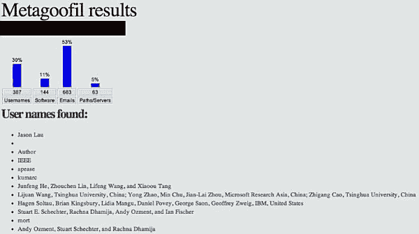
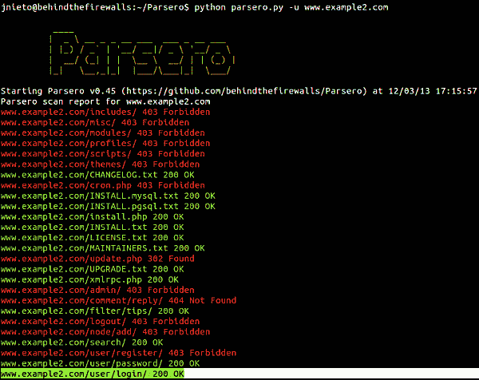
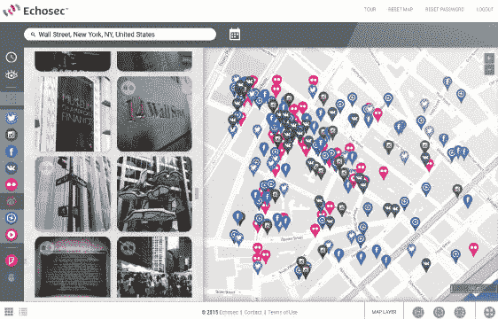
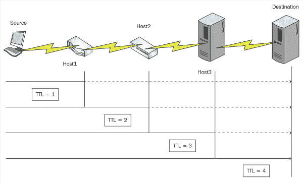

# 三、情报收集工具

让我们开始实际使用 Kali NetHunter。我们将从研究有助于从目标主机或网络收集情报的工具开始这一旅程。我们将在本章中遇到的工具将是那些倾向于在 pentesting 的第一阶段部署的工具，并且有可能在以后的阶段再次部署。

在本章中，我们将介绍以下主题：

*   情报收集的目标
*   收集有用信息的工具
*   下载和复制网站
*   谷歌黑客
*   社交网络
*   使用 WHOIS
*   nslookup

# 技术要求

要完成本章，您需要安装 Kali NetHunter（[http://kali.org](http://kali.org) ）。请参见[第 1 章](01.html)、*Kali NetHunter 简介*，了解在 Android 设备上安装 Kali NetHunter 的相关信息。

# 情报收集的目标

在您能够有效地部署用于入侵系统或以其他方式破坏系统的任何工具之前，您必须了解关于它的任何信息。这一过程可能需要很短的时间，也可能需要相当长的时间，这取决于你所采取的谨慎程度和所需的深度。为了加速这一过程，NetHunter 提供了一整套专门为此目的而设计的工具。

由于本书没有明确的目标，我们将探索一系列用于收集不同类型信息的工具。我们将假设有大量关于目标的信息需要收集，我们必须简单地部署正确的工具来获取它。请记住，在现实世界中，可能会根据客户的需求，使用三种流行方法之一来接近您执行 pentest。考虑到这一点，让我们根据所提供或需要收集的信息量，回顾一下 pentest 的三种流行方法：

*   **白框**：用于描述测试的术语，在测试开始前向测试人员提供完整信息，稍后可以询问其他问题。通常，此测试用于客户端需要执行审计的情况，并且不需要模拟实际攻击。
*   **灰盒**：在这种类型的测试中，为测试人员提供有限的信息，以指导测试或控制测试的范围。例如，客户机可能会提供服务器名称和 IP 地址的列表，如果发现这些名称和 IP 地址，您可以在这里与客户机联系，以获取有关如何继续的进一步说明。
*   **黑盒**：在这种类型的测试中，没有提供任何信息，攻击者必须自己获取所有信息。这种类型的测试最接近于模拟外部攻击者将面临的实际环境，必须在过程中获取信息。

在您参与测试之前，了解客户的目标和他们想要的测试类型非常重要。在本书中，我们将假设我们正在运行一个黑盒测试，并且必须挖掘并获取我们需要的信息，以继续进行 pentesting 过程的后续阶段。

在渗透测试领域，还有许多其他类型的测试格式，但我们不会在本书中介绍它们。相反，我们将通过将自己局限于这三种类型来保持简单。

# 拍摄信息

你可能已经意识到，多亏了互联网，你只需要花时间和精力去利用的资源似乎无穷无尽。我们可以利用丰富的知识；然而，拥有这么多信息有一个真正的缺点：如果你不小心，你可能会不知所措。一旦您进行了足够长的测试，并且熟悉了可以显示的信息类型，您将了解哪些信息更有价值。

根据我自己的经验，以及我多年来指导过的人的经验，我发现学习快速识别有用信息需要一段时间。通常，作为初学者，您会发现自己收集的信息远远多于实际使用的信息，同时可能会遗漏一些似乎没有多大用处的项目。当你获得在五旬斋期间可以采取的不同行动的经验时，你将学会识别有用的信息，无论是立即有用的信息还是以后有用的信息。

# 可用信息的类型

为了在情报收集过程中保持注意力集中，简要列出可以发现的信息类型很重要。

让我们从确定我们正在寻找或可能遇到的、以后有用的信息类型开始。提前设定期望值是很重要的，因为它可以帮助您掌握 Kali 提供的哪些工具可以帮助您实现目标。我想知道哪些信息最有可能有用，但我也尝试对这些信息进行优先级排序，并确定我可以使用各种工具收集的项目。

# 网络信息

在渗透测试的攻击前阶段，获取有关网络的信息非常有用。我们的目标是确定设备之间发生的事务、使用的服务、IP 和 MAC 地址等。

以下是我们可以从网络中提取的简短信息列表：

*   DNS 信息
*   IP 地址
*   流氓网站或不受监控的网站
*   正在运行的 TCP/UDP 服务
*   **虚拟专用网**（**VPN**信息
*   电话号码，包括模拟和 VoIP
*   认证系统
*   用户和组信息

*   来自运行服务的标题信息
*   系统架构
*   主机名
*   用户名和相关密码

# 组织数据

**组织信息**是描述和概述企业或组织内部运作和流程的任何信息。这些信息可以有多种形式，但除了组织结构图、商业计划、社交媒体或管理数据之外。

可能与组织相关的信息包括：

*   员工信息，如姓名、职务和电子邮件地址
*   公司网站
*   组织员工目录（例如，电话簿）
*   公司的实际地址
*   公司网站编码中的注释
*   组织安全策略

这是很多信息，我们可以收集所有信息，然后是一些信息，利用 Kali NetHunter 提供的信息。只需运行一些基本的脚本和工具，就可以收集大量的信息。

信息收集的方法包括：

*   **开源智能****OSIT**：OSIT 从各种在线资源收集信息；这是了解目标的一种有效且相对简单的方法。OSIT 使用互联网搜索引擎、社交媒体网站、博客、论坛和其他来源来收集有关目标的信息。
*   您还可能会发现自己参与了许多被动方法，旨在从目标获取信息。对于被认为是被动的方法，你不能直接接触或询问目标，留下较少的机会被发现并使你的努力受阻。此外，被动方法还合理地模拟了许多用于从公共来源获取信息的方法，也称为获取 OSIT。

你可能想知道，为什么在这本书中，我们有时使用的工具不是 Kali 的原生工具。这是因为，在许多情况下，我要么试图展示正常的做事方式，要么就用卡利自己的工具来完成同样的任务，而不是更完整、更高效、更好的方式。

同样重要的是要说明，如果您希望再次检查数据，还有其他可用的工具可以验证结果。

# 收集有用信息的工具

NetHunter 有许多工具用于收集目标信息，每一个工具都提供其他工具无法提供的信息。在本书中，我们将介绍 NetHunter 中的许多工具，但不是全部，因为有很多。我们将介绍更强大的工具以及您在工作中最可能使用的工具；然而，当你在户外进行自己的探索时，你可能会发现你希望使用的其他工具。

在本章中，Kali 和软件之外的工具混合使用。展示这两种工具背后的想法不仅是演示如何以其他方式获取信息，而且是演示如何组合来自多个来源的信息，以帮助您完成这一过程。

如果一个目标，如一个组织，有一个网站，那可能是一个开始进行侦察的好地方。一家公司的网站提供了很多细节，比如内部联系人的电子邮件地址、电话号码和分机号码。如果一个职业页面可用，它将详细说明公司内部使用的技术所提供的职位空缺类型。该网站是该组织在数字世界中的代表。

开始时，检查一个网站，寻找可能有用的信息。请注意以下细节：

*   电子邮件地址
*   物理位置
*   职位公告
*   电话簿列表

# 使用 Shodan

NetHunter 阿森纳中一个更有用的工具是用于访问 Shodan 的第三方应用程序。**Shodan**是一个功能强大的搜索引擎，用于查找连接到互联网的设备。使用 Shodan，可以轻松识别目标组织内部的多个硬件和软件。

为什么叫这个奇怪的名字？Shodan 的名字来源于游戏系统休克。*SHODAN*字符名称是赛博朋克恐怖主题游戏的主要对手 Sensient Hyper Optimized Data Access Network 的首字母缩写。

为了释放 Shodan 的全部力量，你需要熟练地创造性地使用关键词。关键字可以是不同项目的任何编号，但在本例中，它们通常是制造商名称和设备型号。在某些情况下，它甚至可能是不寻常设备的名称，例如嵌入式设备或**物联网**（**物联网**小工具。一旦你有了使用关键词的想法，你就可以在 Shodan 中使用这些关键词来搜索设备。你甚至可以通过使用过滤命令来优化你的结果，如果你不知所措。

Shodan 已经存在了大约十年，并且继续变得更加能干和有效。Shodan 与其他搜索引擎不同，它能够搜索连接到互联网的设备。最初，人们期望它能够找到连接到互联网的计算机和打印机，但现在它能够定位设备，例如命名物联网对象。基本上，只要可以从互联网上访问或查看，就有可能使用 Shodan 进行搜索。

作为一名 pentester，你会发现你可以很快很容易地找到那些不应该连接到互联网或公开曝光的设备或系统。如果需要的话，搜索引擎也可以成为一个非常有用的工具，用于在您自己的网络上查找未经授权的或恶意设备。

为了开始使用 Shodan，您需要访问他们的网站[Shodan.io](http://shodan.io)注册并创建一个帐户。完成后，您将获得唯一的**应用程序编程接口**（**API**键）进入 Shodan 应用程序：


Shodan 网站

要使用 Shodan，您需要执行以下操作：

1.  启动应用程序列表中的 Shodan 应用程序。
2.  如果这是您第一次使用应用程序，请输入 API 密钥。
3.  输入关键字搜索并点击**搜索**按钮

几分钟后，Shodan 将返回满足搜索条件的单个系统的列表。和其他搜索引擎一样，点击任何一个搜索结果都可以获得目标的详细信息，包括港口和服务等项目。在某些结果中，您甚至可以单击端口号附近的**+**标志以获取服务和其他相关信息。

如果您无法在设备上找到 Shodan 应用程序，这可能是因为您在安装 KaliNetHunter 时没有选择安装它。如果你没有安装它，你可以很容易地安装后，使用谷歌播放和搜索 Shodan 应用程序的事实。


Shodan 搜索的结果

# 使用过滤器

使用 Shodan，您可以单独或与其他人一起使用过滤器来过滤和缩小搜索结果，并将搜索集中到特定的条件，例如国家、城市、产品或版本。但是，我们可以使用关键字进行搜索；这些关键字包括特定于目标的内容。假设你想找到思科设备；关键词应该是“思科”。

例如，为了发现运行 Apache web server 3.2.8 版的 web 服务器，可以使用以下关键字：

```
apache/3.2.8 200 ok
```

虽然这种类型的搜索有效，但您将了解到，通过结合搜索术语和过滤器，可以进行更有效的搜索。例如，您可以在萨克拉门托搜索运行 IIS/8.5 的所有组织的 Microsoft web 服务器：

```
IIS/8.5 hostname:<targetcompany.com> city:Sacramento
```

# 使用美他古非

**Metagoofil**是一款触手可及的强大工具，Kali NetHunter 将其作为收集信息的一种方式提供给您。简而言之，Metagoofil 会根据您提供的标准从谷歌搜索和下载信息。收集的元数据信息来自您指定的目标公司的公共文档（如 PDF、Doc、XLS、PPT、Docx、PPTX 和 XLSX 文件）。它下载这些文件并将其保存到本地驱动器，然后使用内置库从文件中提取元数据。下图显示终端窗口中的 Metagoofil：


那么，什么是元数据？元数据是描述计算机上的某些东西（如文件）的信息。实际上，元数据的一个很好的例子是附加到保存到硬盘驱动器的文件的属性。如果这个文件是一个图像，我们可以查看它的属性，并发现我们能够看到是什么设备拍下了这张照片以及颜色深度、大小和其他信息，例如在某些情况下的 GPS 数据。根据所分析的文件类型，可以显示的信息可能包括用户名、软件版本以及服务器或机器名。

**Metadata** is present on many types of objects, including all types of files and data repositories. In fact, many applications and devices in use today embed metadata in the information they create by default. This is the case with many of the images created by digital cameras and smartphones, as well as files created by products such as Microsoft Word. This metadata is responsible for storing details such as the coordinates of where a picture was taken – this information can be retrieved and will reveal things that the creator may wish to keep secret.

# 使用 Metagoofil 收集信息的练习

在本练习中，我们将使用 Metagoofil 从目标域内的文档中提取元数据。

根据您正在运行的 NetHunter 版本的不同，您可以在某些更新似乎已将其删除时，立即从命令行运行此实用程序。如果您在终端窗口中键入`metagoofil`命令，并且收到一条消息，表明该命令不可用，请运行以下命令：

```
apt-get install metagoofil 
```

让我们使用 Metagoofil 扫描域中的元数据。为了保证安全，我们将使用[kali.org](https://www.kali.org/)网站，但您可以选择其中一个域名替换该域名。

Metagoofil 为我们提供了许多扫描此域的选项：

*   `-d`：指定要搜索的域。
*   `-t`：要下载的文件类型。
*   `-l`：这限制了结果（如果没有指定，则显示默认值直到 200），太大的值将花费更长的时间，而较小的值将加快性能，但产生的结果更少。

*   `-n`：限制下载的文件。
*   `-o`：保存下载文件的位置。
*   `-f`：带操作摘要的输出文件名称。

在命令提示下，键入`metagoofil -d kali.org -t pdf,xls -l 200 -n 25 -f results.html`，然后按*键进入*。

结果将需要一段时间才能返回，但它将包含类似于以下截图的详细信息，该截图是从我自己的搜索中返回的。我在另一个域名上运行了这个，我已经删除了这个域名。注意列表中的用户名、用于创建检索到的文件的软件，甚至电子邮件地址：



在浏览器中查看 Metagoofil 的结果

此信息将使用`-f`开关保存到（或应该保存）文件中。

实际结果更长，更详细，但为了简洁起见，不能全部显示在这里。

# 使用 Nikto

获得更多关于目标及其网站信息的一种方法是使用 Nikto。**Nikto**是一款 web 服务器扫描仪，旨在测试 web 服务器的各种问题，包括 6700 多个危险文件和程序，检查服务器的过时版本，以及识别大约 300 种不同服务器类型的版本特定问题。此外，它还能够检查服务器配置问题、HTTP 服务器选项，并尝试对 web 服务器和软件进行指纹识别。最后，扫描项目和插件经常更新，并且可以自动更新。

请记住，并非每个问题都是你可以利用的，但通过一些研究，你会发现很多问题都是可以利用的。扫描返回的一些数据将显示信息项，这些信息项可用于添加以后可能有用的更多信息。还可以检查日志文件中已扫描的未知项目。

以下屏幕截图显示了使用 Nikto 扫描网站的结果：


Nikto 扫描结果

让我们与 Nikto 一起做一些练习，展示它是如何工作的，并提供一些有用的选项。

# 练习-与 Nikto 合作

Nikto 是一个命令行实用程序，因此打开一个终端窗口开始使用该应用程序。

要运行最基本类型的扫描，我们只需发出以下命令并按*Enter*：

```
nikto -h <IP address or host name> 
```

此命令告诉 Nikto（使用`-h`开关）您选择的主机名或 IP 地址。在我的案例中，我选择了网站[webscatest.com](http://webscantest.com/)，这是为此类活动/实践而建立的。请注意，返回结果需要一些时间，因此如果命令看起来已挂起或不起作用，请不要担心。

当您得到结果时，请仔细查看返回的内容。

在我的结果中，我注意到表明存在`robots.txt`文件的信息。我用浏览器打开了这个文件，输入了[www.webscatest.com/robots.txt](http://www.webscantest.com/robots.txt)，我收到了一些关于这个网站的简单信息，包括内容类型和文件夹。我还注意到在[www.webscatest.com/login.php](http://www.webscantest.com/login.php)上显示登录页面的信息。这可能是以后尝试破解密码时需要注意的好信息。最后，我还应该指出，结果告诉了我 Web 服务器的类型和版本，以及在本例中运行在 Ubuntu 上的 Apache2.4.7 操作系统。

还包括其他结果，例如漏洞，这些结果会因您的目标而异。

想知道你是否能变得更隐秘一点吗？那么，您可以使用`-evasion`或`-e`开关并指定一个选项。在我的例子中，我使用`1`指定随机编码。这可能有助于愚弄或逃避一些侦查机制，足以让你的攻击处于雷达之下。您可以按如下方式使用此选项：

```
nikto -e 1 -h webscantest.com 
```

这里我不会介绍所有选项，但我鼓励您使用“帮助”选项来尝试其他一些开关。您可以通过输入`nikto -Help`来访问此项，以显示所有可用的交换机。

此工具的最后一个提示：使用`-o`开关将结果保存到文件中，如下所示：

```
nikto -h <IP address or hostname> -o <filename> 
```

我通常将文件名指定为 HTML 文件，例如`test.html`。只需保存您的结果，因为这样可以在以后需要参考信息以获取有用信息时节省时间。

# 什么是 robots.txt？

有时搜索引擎不足以得到你想要的东西，因为它们不能显示你想要的一切。搜索引擎只显示了网络上可用信息的一小部分，许多搜索引擎利用这一缺点来避免在搜索引擎中显示内容。其中一种方法是调整名为`robots.txt`的文件。

网站所有者可以利用`robots.txt`文件试图控制谁能看到网站中的内容。实际上，文件放在网站的根目录中，当机器人或机器人访问网站试图对内容进行编目时，文件将起作用。机器人访问一个网站，如[www.sample.com](http://www.sample.com)。但是，在执行之前，它会检查`robots.txt`文件是否存在。如果该文件存在，它将读取该文件以查看是否允许继续，如果允许，则在何处继续。在本例中，假设`robots.txt`在[www.sample.com/robots.txt](http://www.sample.com/robots.txt)中找到，其内容如下：

```
User-agent: * 
Disallow: / 
```

`User-agent: *`表示该信息适用于所有机器人。`Disallow: /`告知机器人不要访问网站上的任何页面。实际上，`robots.txt`应该被任何访问站点的机器人读取，以对其内容进行分类。当它读取文件时，它应该处理指令并做出相应的反应，但让我们指出实际情况。

实际上，关于此文件，有两个关键点需要记住：

*   虽然目的是让`robots.txt`被普遍接受，但实际上，机器人可以忽略您的`/robots.txt`。这对于扫描网站和 web 服务器的安全漏洞的恶意 web 爬虫以及垃圾邮件发送者使用的电子邮件地址收集器来说尤其如此。所有人都倾向于忽略该文件。

*   任何人都可以查看实际的`robots.txt`文件，因为默认情况下它是可公开访问的。找到这个文件的人（例如，通过使用谷歌黑客）可以看到网站的哪些部分被禁止访问，然后浏览。

这里的底线是`robots.txt`确实按设计工作。只需要一个恶意软件或一个简单的谷歌搜索就可以了解网站的结构，或者一个不尊重文件并导致潜在问题的恶意软件。这意味着您不应该使用该文件隐藏信息，因为它很容易定位、读取和绕过。该文件仅用于*建议*现场不应访问的部分；它没有强制执行这些规则：


robots.txt 的内容示例

# 使用 Parsero

就 Kali 而言，实际上有一些工具可以查找站点的`robots.txt`并读取内容。其中一个工具**Parsero**专门设计用于查看文件内容，并注意用于阻止机器人访问这些位置的*禁止*条目。以下屏幕截图显示 Parsero 正在运行：



Parsero 欢迎屏幕

Parsero 读取 web 服务器的`robots.txt`文件，查看不允许的条目，然后检查该位置是否可访问。实际上，文件中的条目类似于`Disallow: /portal/ login`意味着此网站或链接[www.chieforiyano.com/portal/login](http://www.chieforiyano.com/portal/login)上的内容不应被蜘蛛索引。这可能看起来非常简单明了，但如果你想收集 pentest 的信息，这可能是一个障碍；幸运的是，我们可以绕过这个文件。

有时，用户只需在其 web 浏览器中键入路径即可访问“禁止”条目中的路径。然而，由于`robots.txt`中可能有许多不允许的条目，因此可能有一长串条目需要检查。Parsero 可以用来检查一长串的条目，看看哪些是有效的，这样你就知道哪些路径需要调查，而不会浪费时间。

# 练习–使用 Parsero

在本练习中，我们将探讨几个使用 Parsero 的示例。

如果您安装的 Kali 没有安装 Parsero，请使用`apt-get install parsero`命令并选择`Yes`进行安装。

首先，如果我们想索引一个站点以查看哪些不允许的条目是有效的，我们使用以下方法：

```
parsero -u www.example.com
```

或者，我们可以使用这个：

```
parsero -u <website domain name> 
```

其次，如果我们想使用搜索引擎查看哪些路径是有效的，我们可以将命令更改为：

```
parsero -u www.bing.com -sb  
```

或者，您可以使用以下选项：

```
parsero -u <website domain name> -sb 
```

在这种情况下，Parsero 将在 bing 中搜索结果。

一旦有了已验证目录的列表，就可以使用 web 浏览器或其他工具查看服务器上的路径，以查看可能存在的文件或信息。

# 使用 wget

您可能会发现下载一份网站副本以供本地考试，并使用它运行其他测试非常有用。如果您希望这样做，最简单的方法就是使用`wget`命令，这是一个标准的 Linux 工具，用于从网站检索信息。`wget`实用程序是一个非交互式下载程序。

需要注意的是，使用`wget`或类似工具下载网站的技术并非完全被动，而是半被动。虽然被动信息收集避免了与目标的直接接触，从而使过程匿名且无法跟踪，但半被动会留下更多信息。半被动信息收集更直接地与目标接触，可以在日志中留下信息，可以由目标和所揭示的活动进行分析。关键是信息是事后发现的，我们的活动在发生时不会引起注意。

# 练习–与 wget 合作

为了简单起见，对于这个练习，我建议您使用一个小型网站或个人网站，因为这样会使过程更快，因为下载的内容会更少。但是，如果您确实需要下载更大的网站，请注意带宽需求和存储空间需求将相应增加。

虽然我们正在讨论如何将网站内容下载到本地系统，但这里有一些事情需要记住：首先，在移动设备上，存储空间可能会很贵，这意味着您需要确保有足够的存储空间来存储目标网站的内容。如果空间不足，则命令将失败，或者如果系统上的空间即将耗尽而没有用完，则设备可能会遇到其他问题。

其次，如果您正在进行此操作，请确保您意识到，如果您通过蜂窝数据链路执行此操作，您将很快耗尽您的数据分配（如果您有）。

首先，我们希望将网站下载到系统上与目标同名的目录。要执行此操作，请在命令行中发出以下命令：

```
wget -m http://<web address> 
```

`-m`选项创建网站的镜像。

如果需要下载整个站点，请使用以下命令：

```
wget -r --level=1 -p http://<web address> 
```

此命令使用`-r`和`--level=1`参数下载指定 URL 上的所有页面。图像等组件将包含在下载版本中。

如果您的目标是一个小型站点，那么这两个命令都不应该花费那么长的时间来完成（可能几秒钟到几分钟），并且您应该找到复制到本地系统的内容。下载内容后，您可以在 web 浏览器中打开这些内容，并执行诸如查看源代码等操作，以查看是否可以找到有关该网站的任何评论或线索。您还可以在文件中搜索关键字或短语，这些关键字或短语可能会为您提供有用的信息。

# 使用 HTTrack

当然，wget 只是一个普通的 Linux 工具；让我们使用 HTTrack 工具以不同的方式下载网站。此工具包含在 Kali 中，提供的选项远远多于 wget 本身提供的选项。

**HTTrack**是一款网站复印机。它允许用户使用图形用户界面（GUI）或命令行界面（CLI）创建网站的脱机镜像版本，允许脱机浏览。

HTTrack 还拥有更新现有下载站点和恢复中断下载的能力。

让我们尝试使用 HTTrack 下载一个网站。

# 练习–使用 HTTrack

要使用 HTTrack，让我们从基本选项开始：

1.  打开终端窗口。
2.  键入`mkdir test`命令。这将创建一个名为 test 的目录。你可以用任何你想要的名字；然而，这将是我们存储下载的地方。
3.  键入`cd test`或您使用的任何目录名。
4.  键入`httrack <website name>`命令。

5.  按*键进入*。根据目标站点的大小，下载可能需要一些时间。为了我的测试，我用`www.webscantest.com`练习。
6.  下载完成后，使用文件管理器（工具栏上的蓝色文件夹图标）浏览到该文件夹。

7.  单击任何文件，将启动相应的应用程序，例如您的 web 浏览器。这可能需要一点摸索，但你可能会偶然发现一些有趣的东西。例如，考虑下面我发现的页面：


目标网站的登录页面

在较大的网站上，您可能需要考虑微调您的请求，这样就限制了结果。您可以通过使用`-r`开关发出命令来执行此操作，如下所示：

```
httrack -r2 <website name> 
```

在本例中，`-r`开关与 2 选项一起使用，该选项告诉它只能在站点上深入两层。注意，开关是小写的 r；如果使用大写字母 R，则此操作无效。

想在运行`httrack`时获得更多指导吗？一个向导类型的帮助系统可以引导您完成这个过程。您可以通过启用`-W`（大写）开关来使用此功能：

```
httrack -W <website name> 
```

尝试不同的选择；使用`httrack -h`可以看到它们的巨大阵列。

完成此命令后，您可以浏览到您创建的文件夹并查看已下载的内容。

# 谷歌黑客

在收集信息时，我们不应忽视的一个资源是搜索引擎。在本节中，我们将特别关注谷歌和一个称为谷歌黑客攻击的过程。目前，谷歌是一个非常强大的信息收集工具，只需执行简单的关键字搜索，但如果你想更具体、更精细地调整搜索以获得更高质量的结果，该怎么办？你有没有在谷歌的搜索框中输入一个关键词或一组术语，希望得到有用的信息，却只得到几页结果，而与你所寻找的内容几乎没有关系？如果你有，你不是唯一一个有这个问题的人，但好消息是，使用谷歌黑客可以大大改善你的搜索结果，帮助你获得相关信息。

Google hacking（或一些人称之为 Google dorking）利用特殊关键字构造查询，以优化搜索以收集信息。在熟练且耐心的帮助下，检索有用的信息是完全可能的，例如密码、配置数据和登录门户。

# 练习–什么是正确的搜索引擎

为了成功地进行谷歌黑客攻击，我们需要首先覆盖所谓的**运营商**来奠定基础。运算符是一种特殊的关键字或术语，用于指示 Google 查找特定时间或格式的信息。运算符可以在任何搜索的上下文中使用，甚至可以串在一起创建更复杂、更有针对性的搜索。虽然我们将讨论每种方法的正确使用，但我强烈建议您花一些时间与它们一起工作，学习在您自己的查询中使用它们的不同方法，或者如何优化您的搜索：

*   Cache 关键字显示 Google 以前存储在其服务器上的网站的缓存版本。
    *   用法：`cache:<website URL>`

*   Link 关键字显示具有指向指定 URL 的链接的网站。
    *   用法：`link:<website URL>`

*   Info 提供有关该网站的信息。
    *   用法：`info:<website URL>`

*   站点限制对位置的搜索。
    *   用法：`<keyword> site:<website name>`

*   Allintitle 返回标题中包含指定关键字的页面。
    *   用法：`allintitle:<keywords>`

*   Filetype 用于仅返回特定类型的文件。
    *   用法：`filetype:<file extension> <keywords>`

*   Allinurl 返回带有特定查询的结果。
    *   用法：`allinurl:<keywords>`

考虑到这些关键字，让我们讨论几个示例，向您展示如何使用它们。我将在这里提出一些问题，并说明如果您自己尝试这些问题，应该返回什么内容：

*   **Allinurl 网络摄像头**：此查询将返回任何包含*网络*和*摄像头*组合词的 URL。
*   **Allintitle 病毒描述**：此查询将返回标题中有*病毒*和*描述*字样的任何页面。
*   **文件类型：xls 用户名密码电子邮件**：这将返回任何包含关键字*用户名*、*密码*和*电子邮件*的 xls（Microsoft Excel 文件）。还可以将关键字组合在一起，生成更精细、更强大的查询。

*   **Allinurl:nuke 文件类型：xls**：此查询将查找包含单词*nuke*的 URL，然后查找 xls 文件并返回结果。

如果你发现自己被想法困住了，看看**谷歌黑客数据库**（**GHDB**。您可以在[www.hackersforcharity.com](http://www.hackersforcharity.com/)找到该网站。在这里，您将发现许多简单和复杂的谷歌黑客使用示例，您可以检查、剖析和修改这些示例，以了解如何从结果中获得更多信息。

# 地方

许多组织倾向于在各种在线地图上插入其业务地址，以帮助客户更轻松地找到其实际位置。谷歌地图、必应地图、Waze 和 MapQuest 等网站帮助每个人在一个国家找到自己的路。然而，如果渗透测试人员正在进行黑盒测试或没有目标公司的物理地址，这也有助于更快地找到目标组织。

# 社交网络

为了收集个人信息，没有太多的信息来源可以与社交网络竞争。这些网络不仅变得极其丰富，而且是收集信息的非常宝贵的工具。这在很大程度上是因为这些服务的用户倾向于过度获取信息。对大多数人来说，在网上分享比保守秘密更令人兴奋。当然，如果小心使用，社交网络是与朋友和家人交流的好方式；然而，在某些情况下，它可以提供大量关于个人和职业关系的信息。

获取目标信息的最常见社交平台如下：

*   脸谱网
*   啁啾
*   谷歌+（*最近被谷歌*停产）
*   LinkedIn
*   一款图片分享应用
*   Tumblr

# 使用 Echosec

我最喜欢的挖掘这些社交网络服务中披露的数据的工具之一是**Echosec**。这项服务提供的不仅仅是在社交网站上定位信息的服务；它聚合了多个站点的信息，然后使用地理数据定位帖子的发布位置。是的，你读对了；它可以在地图上显示向网络发帖的位置，甚至允许您调整时间范围。

下图显示了 Echosec 接口：



Echosec 的部分作用是因为社交网络要么使用嵌入帖子中的位置数据，要么使用其他功能将其放置在地图上（如 IP 地址）。Facebook、Twitter 和 Instagram 等服务可以在你发布的帖子中包含几乎所有现代设备内置的 GPS 信息。虽然这听起来很酷，因为它可以让你向朋友和家人展示你去过的地方，但它也有一个缺点：它可以让其他人看到相同的信息。这可以让恶意的一方看到你在哪里工作、玩耍和生活，更不用说你去过哪里了。所有这些信息都有助于识别个人习惯以及其他个人信息。

作为一个戊酯，你不应该忽视这些信息的价值。我们可以通过名为 Echosec 的服务在[检索此信息 http://app.echo](http://app.echosec.net/) [sec.net](http://app.echosec.net/)。要使用此服务，您只需要一个位置和一点时间。

# 练习-与 Echosec 合作

要使用 Echosec 分析某个位置的社交媒体帖子，请参阅以下步骤：

1.  转到[https://app.echosec.net](https://app.echosec.net) 。
2.  点击**选择区域**按钮。在目标区域周围绘制一个框。
3.  向下滚动以查看结果。

有可能色情图片有时会出现在搜索结果中。即使这种情况不常见，也会时不时发生。

# 与侦察队合作

你想加快收集信息和对目标进行全面侦察的过程吗？侦察是给你的！诚然，您将变得更加熟练，从而能够更快地手动收集信息，但诸如 Recon Ng 之类的工具只会提高此过程的速度和效率。所以，让我们仔细看看这个工具，看看它是如何工作的。

**Recon Ng**是一款功能强大的工具，旨在模仿被称为**框架**的类似工具的界面和设计。该工具基于一种设计，它包含独立模块、与数据库的交互、交互式帮助，并自动为用户完成命令。然而，Recon Ng 并不是为了与现有框架竞争而设计的，它更多地是对已经流行的其他渗透测试工具的补充。

Recon Ng 配备 80 个侦察模块、2 个发现模块、2 个利用模块、7 个报告模块和 2 个导入模块。以下是一些例子：

*   `command_injector`：远程命令注入外壳接口
*   `csv_file`：高级 CSV 文件导入器
*   `email_validator`：验证电子邮件
*   `mailtester`：MailTester 电子邮件验证程序
*   `migrate_contacts`：联系人到域数据迁移器
*   `facebook_directory`：Facebook 目录爬虫
*   `metacrawler`：元数据提取器
*   `instagram`：Instagram 地理定位搜索
*   `twitter`：推特地理位置搜索
*   `dev_diver`：开发潜水员储存库活动检查员
*   `linkedin_crawl`：LinkedIn 档案爬虫

您可以在[查看整个侦察模块列表 https://www.darknet.org.uk/2016/04/recon-ng-web-reconnaissance-framework/](https://www.darknet.org.uk/2016/04/recon-ng-web-reconnaissance-framework/) 。

# 寻找技术数据

在侦察过程中收集信息时，您还希望尽量获取尽可能多的技术数据，以便收集。幸运的是，今天有很多方法可以帮助我们收集信息；许多是在你的指尖上，内置在你最喜欢的操作系统中，而另一些则需要不同的方法。

# 使用 WHOIS

WHOIS 已经存在很长一段时间了，但是它是一个非常有用的工具。

# 运动-从 WHOIS 中获得最大收益

1.  在 Kali NetHunter 终端，键入`whois <domainname>`，例如：

```
whois usatoday.com 
```

输出将向您显示有关域名注册的所有可公开访问的信息，例如注册人、公司联系方式、公司地址以及域名创建、续订和到期日期：


verisign 的 WHOIS 结果

域名注册商通常为其客户提供隐私选择。这将限制买方的信息公开记录。

# nslookup

我们还应该关注的一个技术领域是 DNS 或域名系统，它负责将主机名解析为 IP，将 IP 解析为主机名。此服务在网络上运行非常常见，在大多数环境中基本上都是必需的服务。

如果您回想一下您的网络体验，DNS 是一个包含有关 IP 地址和相应主机名之间关系的信息的数据库。当客户机希望获取与给定主机名（在称为正向查找的查询中）相关的 IP 地址时，将在 DNS 内执行一个进程，其中主机名位于数据库中，并且返回地址。数据库中的每个 IP 到主机名关系都称为记录。并非 DNS 中的所有记录都是相同的，它们存在许多不同的类型，每种类型导致不同类型的资源。正在查找文件服务器的 IP 吗？那是一张唱片。正在寻找邮件服务器？那是一张 MX 唱片。下表列出了这些不同的记录：

| **记录类型** | **说明** |
| A. | 将主机名解析为 IPv4 地址 |
| AAAA | 与“A”记录相同，但适用于 IPv6 |
| MX | 记录该域的邮件服务器的位置 |
| NS | 列出域的名称服务器 |
| CNAME | 创建别名 |
| SOA | 显示对域具有权限的用户 |
| SRV | 服务记录 |
| PTR | 唱片的反面 |
| 反相 | 谁负责行政管理 |
| 欣福 | 主机信息 |
| 文本 | 简单文本记录可用于注释 |

既然我们知道了这些信息，我们该如何使用它呢？这就是 nslookup 的用武之地。Nslookup 允许我们与 DNS 服务器交互并查询不同的记录类型。执行查询以检索 HINFO 或 TXT 记录可以生成对您有用的信息，如注释或其他详细信息。此外，检索其他记录（如 MX 记录）可以为您提供邮件服务器的地址，或者 NS 记录可以告诉您目标 DNS 服务器的地址。

运行`nslookup`需要使用终端窗口或命令行直接发出命令。

在其默认操作模式下，`nslookup`将返回与主机名对应的 IP 地址，或者以的其他方式返回，具体取决于您提供的主机名。例如，让我们通过运行以下命令来查找 website.com 的 IP 地址：

```
nslookup website.com 
```

它将返回类似于以下内容的内容：

```
Server:     8.8.8.8 
Address:    8.8.8.8 

Non-authoritative answer: 
Name:    website.com 
Address: 134.170.185.46 
Name:    website.com 
Address: 134.170.188.221 
```

这里，`8.8.8.8`是本地主机配置使用的 DNS 服务器的地址。

紧接着，我们看到了`website.com`的信息。在本例中，DNS 服务器返回了两个答案，表明该网站使用了一个负载平衡系统，通常称为循环。本质上，这意味着当您浏览本网站时，您将被发送到这两个地址中的一个，您的问题将得到解决并得到适当的回答。

同样重要的是要注意回复中的文本，该文本表示对我们的查询的“非权威答案”。此响应表示我们正在查询的 DNS 服务器不包含所查询域的完整信息。此答案通常表示已向您提供了客户端上次请求中缓存的信息。

# 反向 DNS 查找

可以通过提供 IP 地址来执行反向查找查询，如下所示：

```
nslookup 134.170.185.46 
```

这将返回类似以下内容的信息：

```
Server:     8.8.8.8 
Address:    8.8.8.8 
```

非权威性回答：

```
46.185.170.134.in-addr.arpa    name = grv.website.com
```

# 查找 NS 记录

域的 NS 记录包含对该域具有权威性的名称服务器的 IP 地址。检索 NS 记录很简单：我们只是像以前一样运行一个查询，但是现在我们包含了-type 开关，告诉实用程序只返回 NS 记录：

```
nslookup -type=ns microsoft.com 
```

响应类似于以下内容：

```
Server:     8.8.8.8 
Address:    8.8.8.8 
```

以下是非权威性的答案：

```
website.com    nameserver = ns3.web.net
website.com    nameserver = ns4.web.net
website.com    nameserver = ns1.web.net
website.com    nameserver = ns2.web.net
```

# 查询 MX 记录

域的 MX 记录包含处理域消息的邮件服务器的 IP 地址。当您向域发送电子邮件时，例如`@website.com`，邮件将被路由到网站的 MX 服务器。

您可以使用`-type=mx`选项查询域的 MX 记录。例如：

```
 nslookup -type=mx website.com 
```

它将响应如下输出：

```
Server:     8.8.8.8 
Address:    8.8.8.8 
```

以下是非权威性的答案：

```
website.com    mail exchanger = 10 website-com.mail.protection.mailserver.com
```

# 查询 SOA 记录

域的**开始授权**（**SOA**记录提供域本身的技术信息。可通过使用-`type=soa`选项进行检索：

```
nslookup -type=soa website.com 

Server:     8.8.8.8 
Address:    8.8.8.8 
```

以下是非权威的答案：

```
microsoft.com 
    origin = ns1.website.net 
    mail addr = msnhst.website.com 
    serial = 2014110802 
    refresh = 7200 
    retry = 600 
    expire = 2419200 
    minimum = 3600 
```

# 查询其他 DNS

根据设计，Nslookup 将查询主机系统当前配置为使用的同一 DNS 服务器。但是，如果您希望更改`nslookup`正在查询的 DNS 服务器，可以使用以下命令：

```
nslookup website.com ns1.web.net 
```

此命令将为我们提供对`microsoft.com`之前查询的权威性答案：

```
Server: ns1.web.net Address: 65.55.37.62#53 Name: website.com Address: 134.170.185.46 Name: website.com Address: 134.170.188.221 
```

这不仅对于获取权威信息很有用，而且对于检索某个 DNS 当前缓存的信息也很有用。

还请注意，仔细检查 WHOIS 结果，对域具有权威性的名称服务器位于结果的底部。您可以将 WHOIS 查询返回的服务器与 nslookup 一起使用。

# 使用 dnsenum

让我们使用另一个内置于 Kali 中的工具**dnsenum**来检查 DNS 信息。简单地说，dnsenum 是一个脚本，用于从域中提取 DNS 信息并显示非连续的 IP 块。以下是此脚本功能的简短列表：

*   获取主机的地址记录
*   获取名称服务器
*   获取 MX 记录
*   在名称服务器上执行 AXFR 查询
*   通过谷歌抓取获取额外的名称和子域
*   从文件中强制执行子域
*   计算 C 类域网络范围并对其执行 WHOIS 查询
*   写入`domain_ips.tx`t 文件 IP 块

让我们来看看如何使用 DNSENUM。

# 练习-与 dnsenum 合作

**Dnsenum**是一种快速、高效的获取与 nslookup 相同信息的方法，无需跳转太多障碍。

要最基本地使用 dnsenum，只需在终端窗口发出以下命令：

```
dnsenum <domain name> 
```

这将返回有关记录的结果列表，包括名称服务器、MX 服务器和 a 记录。它还将尝试执行区域传输。

要尝试为相同名称查询其他 DNS 服务器吗？使用以下命令：

```
dnsenum -dnsserver <IP address of server> <domain name> 
```

当您试图查询某个域的权威服务器时，`dnsserver`的使用尤其有用。

# 使用 DNSMAP

另一种了解子域、IP 地址和构建网络图片或地图的有效方法是使用 DNSMAP。这个实用程序能够执行多个操作，但现在让我们将其作为了解子域和目标的相关 IP 地址的一种方法。

您可以使用 DNSMAP 执行以下任何操作：

*   查找远程服务器
*   查找允许您映射不明显/难以找到的网络块的域名
*   使用蛮力定位内部 DNS 名称和 IP 地址的能力

要使用 DNSMAP 定位子域，只需执行以下命令：

```
dnsmap <domain name> 
```

例如，它将被视为如下所示：

```
dnsmap microsoft.com 
```

还有另一种工具可以有效地从 DNS 收集信息：凶猛。**凶猛**与同类型的其他工具相同，但它仍然值得一读，因为它提供了另一个有吸引力的选择。

凶猛的核心是一个扫描器，帮助定位目标域的非连续 IP 空间和主机名。这意味着，在许多方面，它是一种收集信息的方法，用于诸如 nmap 之类的工具。它可以定位目标网络内外的潜在目标。

要使用 FIRE 对 DNS 命名空间执行扫描，请发出以下命令：

```
fierce -dns <domain name> 
```

使用实际域名的示例如下所示：

```
fierce -dns zonetransfer.me 
```

下图显示了此示例扫描的结果：


# 使用跟踪路由

**Traceroute**采用 ICMP 协议作为组件进行设计。Traceroute 允许管理员映射数据包从源到目标的路径。Traceroute 在 Windows 和 Linux 系统中都存在。

Traceroute 通过稍微增加 TTL 值来发送数据包，最初 TTL 值为`1`。第一个路由器接收数据包，降低 TTL 值，然后离开数据包，因为它的 TTL 值为`0`。

路由器将 ICMP 超时消息发送回源：



traceroute 有许多非命令行版本，如果您觉得它们更易于使用的话。

# 总结

有大量资源可供您获取有关目标源的详细信息，您在执行渗透测试时应该熟悉这些资源。在本章中，我们学习了如何研究目标并使用收集的信息来了解受害者。

在下一章中，我们将在信息收集过程中吸取的经验教训的基础上，通过使用扫描和枚举来处理这些信息。

# 进一步阅读

您可以签出[http://kali.tools.org](http://kali.tools.org) 了解有关本章主题的更多信息。