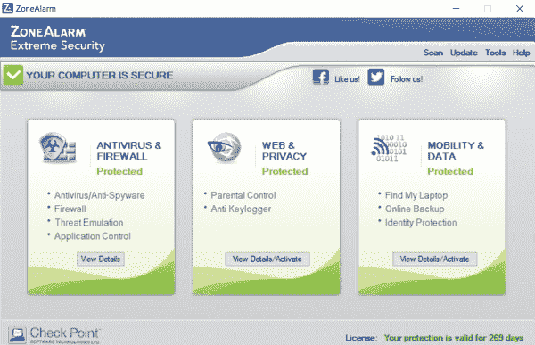
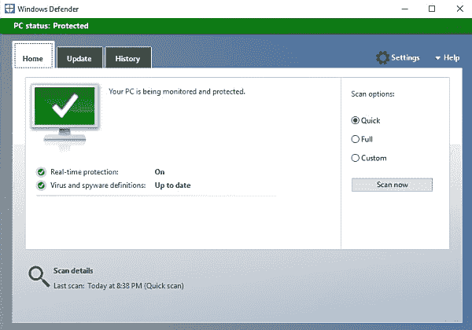
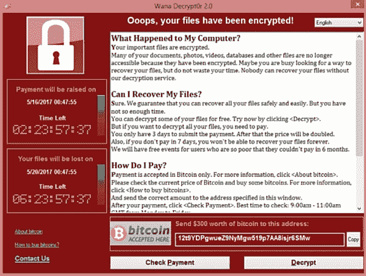
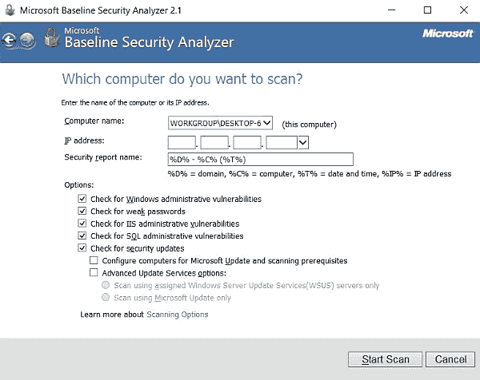
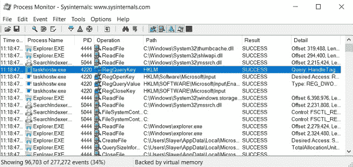
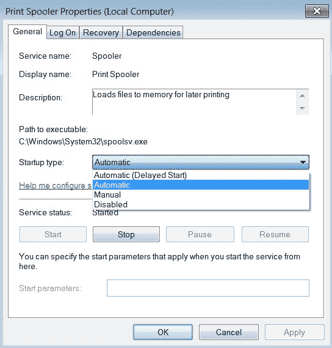
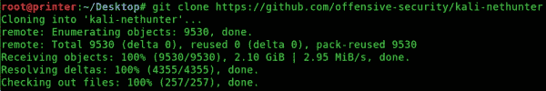
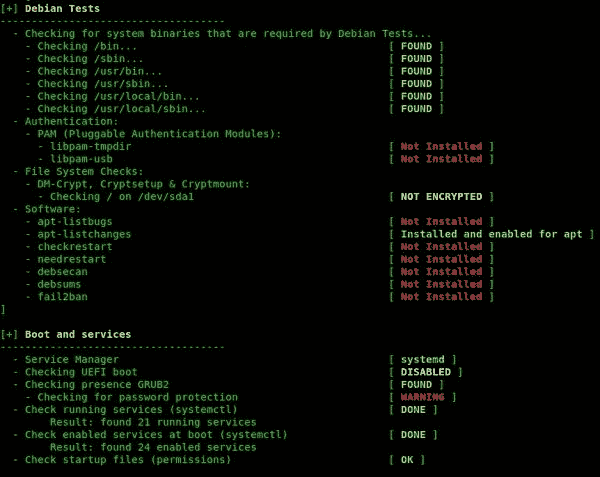
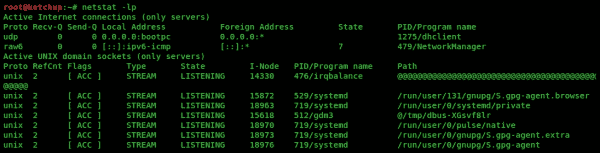

# 十、加固技术与对策

进入渗透测试和攻击性安全领域总是非常令人兴奋；学习利用系统和网络的艺术很有趣。有时，你的职业道路可能会从黑客入侵客户网络转变为帮助组织保护其网络基础设施免受黑客和其他潜在威胁。在过去几年中，每天都有如此多的网络攻击报告。让我们不要忘记那些在本地网络中没有报告网络攻击的组织，因为它们正试图保护自己的组织声誉，最后，还有那些尚未检测到网络入侵的组织。

很多时候，组织都会创造工作岗位，雇佣新人担任网络安全专业人员，但职位和职务描述并不完全符合渗透测试，而是作为安全管理员或安全工程师。这些角色通常由紫色团队的职能组成，如[第 2 章](02.html)*中所述，理解五旬斋过程*的各个阶段。紫色团队是红色和蓝色团队的组合，他们在网络安全中的进攻和防守双方采取行动，以检测、缓解和实施组织中的网络攻击对策。

在本章中，我们将学习各种强化技术，以改善系统的安全状态。此外，我们还将研究可在组织基础设施上实施的防范和缓解网络攻击的对策。

在本书即将结束之际，对于渗透测试人员来说，了解不同平台上的不同强化和缓解技术以防止安全威胁并降低风险同样重要。

在本章中，我们将介绍以下主题：

*   共同的安全威胁
*   保护网络设备
*   保护客户端操作系统
*   保护服务器操作系统的安全
*   保护移动设备平台的安全

开始吧！

# 安全威胁与对策

在本节中，我们将了解各种安全威胁以及如何实施应对措施。

# 病毒

病毒是一段恶意代码，旨在对系统（如计算机）造成危害。病毒通常不是自己执行的，而是需要一个人的行动；此操作只需点击或运行病毒感染的文件即可完成，该文件将触发恶意代码执行。

一种著名的病毒被称为**蠕虫**。蠕虫是一种自我复制的病毒，可以在网络中传播，而无需人类的任何帮助。

想象一下，创建一个无需用户交互就可以自我复制的程序，并将系统资源压得喘不过气来，以至于蠕虫病毒感染的系统几乎（如果不是完全）无法使用。一旦蠕虫病毒被创建并触发其自我复制过程，对网络进行消毒就相当困难。

为了防止病毒和蠕虫感染恶意软件，建议在所有主机设备（如台式机和系统服务器）上启用端点保护，如防病毒或反恶意软件保护。但是，确保每个防病毒客户端始终更新最新的病毒定义以最佳地保护主机非常重要。

以下是一些防病毒供应商：

*   区域武装
*   卡巴斯基实验室
*   比特卫士
*   前卫的
*   赛门铁克

以下是 ZONEALARM 极端安全用户界面的屏幕截图：

您可能想知道是否必须购买受保护的商业防病毒软件。在 Microsoft Windows 平台上，有一个内置/预加载的反恶意软件保护，由 Microsoft 创建，称为**Windows Defender**，它是免费的。Windows Defender 针对各种类型的威胁提供实时保护。以下屏幕截图显示电脑状态：

近年来，加密恶意软件出现在数字世界，并对全球许多系统造成重大损害，因为几乎没有人准备好预防或减轻这种新型威胁；这种类型的恶意软件称为**勒索软件**。勒索软件的目标非常简单：一旦受害者系统被感染，恶意软件就会对整个系统进行加密，使其不稳定，并将数据作为人质保存在磁盘驱动器上，直到支付勒索。但是，用于加密受害者系统的磁盘驱动器的加密密钥经常被更改，以防止受害者解密驱动器并删除勒索软件。以下是受害者系统上的*WannaCry*勒索软件变体的屏幕截图：

当被勒索软件感染时，受害者系统上显示的唯一窗口是支付屏幕。组织中最有价值的资产之一是数据。黑客看到了数据的价值，因此创造了加密恶意软件来劫持这一特定资产。但是，不建议支付任何赎金，我们知道这些数据非常有价值，可能包含重要的财务记录和敏感信息。一旦受害者提供了他们的信用卡信息，就绝对不能保证攻击者会提供解密密钥；相反，他们可能会从受害者的信用卡上盗取资金。

许多威胁情报和防范公司，如 Check Point 软件技术公司（[https://www.checkpoint.com/](https://www.checkpoint.com/) 、卡巴斯基实验室（[https://www.kaspersky.co.in/](https://www.kaspersky.co.in/) ）和 Bitdefender（[https://www.bitdefender.com/](https://www.bitdefender.com/) ，开发了反勒索软件保护，以帮助防止和解密受感染的系统。

以下是 ZoneAlarm 反勒索软件客户端的屏幕截图：

一旦在系统上安装了反勒索软件保护，一旦检测到互联网连接，它就会自动更新。如果勒索软件试图在本地系统上安装自身，反勒索软件保护将对系统进行消毒，并解密受勒索软件影响的任何文件。

防范勒索软件的对策包括：

*   在客户端系统上安装反勒索软件保护。
*   定期备份数据。
*   在操作系统上安装最新更新。
*   使防病毒应用程序保持最新。

# 其他常见病毒

以下是一些其他常见病毒：

*   **特洛伊木马**：**特洛伊木马病毒伪装成合法软件或应用程序，但其核心具有恶意负载。这个想法是欺骗受害者在他们的系统上运行应用程序；一旦特洛伊木马被执行，恶意有效负载会在用户不知情的情况下在后台卸载自身。一些特洛伊木马用于创建*后门*，让黑客未经授权进入受害者的系统，这些被称为**远程访问特洛伊木马**（**RATs**。**
***   **间谍软件**：**间谍软件是一种病毒，它将自身安装在受害者的系统上，收集用户的活动等信息并将信息发送回其创建者。间谍软件的一个例子是一个键盘记录器，它隐藏在受害者的系统中并收集用户的击键。*****   **Rootk****its**：Rootkit 病毒的主要目标是成为计算机内核的一部分。rootkit 通常对操作系统和防病毒应用程序不可见。其目的是获取受害者计算机上的根级别权限，这将授予恶意软件对系统的完全访问权限，允许其执行任何操作。****

 ****恶意软件通常通过以下媒介传播：

*   电子邮件
*   网络文件共享
*   互联网或驾车下载
*   社会工程

以下是针对恶意软件的一些对策和缓解措施：

*   在所有系统上安装反恶意软件保护。
*   确保反恶意软件应用程序始终是最新的。
*   定期在所有系统上运行病毒扫描。
*   在操作系统上安装最新更新。
*   在电子邮件服务器上启用垃圾邮件过滤。
*   不要点击任何可疑的电子邮件或 web URL。

# 客户端系统安全

在本节中，我们将重点关注操作系统的安全性。在一个组织中，IT 部门通常对每个独特的系统都有一个基线。安全基线规定了应如何安装和配置操作系统，以确保满足安全要求。

操作系统的安全基线通常包括以下内容：

*   禁用操作系统上任何不必要的服务。
*   定期安装系统更新和修补程序。
*   强制实施密码复杂性策略。
*   禁用或删除任何不必要的用户帐户。
*   确保安装并更新了端点保护（如防病毒软件）。
*   启用责任的系统日志记录。

# Windows 基线

为 MicrosoftWindows 创建基线实际上非常简单。以下目标可用作建立基线的检查表：

*   操作系统安装应使用 NTFS 文件系统在磁盘驱动器的单个分区上完成。
*   安装最新修补程序并启用 Windows 自动更新，以确保所有漏洞都得到相应的修补。
*   启用和配置 Windows 防火墙。
*   安装并更新防病毒保护。
*   禁用任何不必要的服务。

基线是一个点，从该点可以进行未来的参考，以确定流程或系统是否在正常能力范围内运行。

**Microsoft Baseline Security Analyzer**（**MBSA**允许系统管理员和安全专业人员扫描本地系统或基于 Windows 的系统网络，以查找任何安全错误配置。

MBSA 可在[找到 https://www.microsoft.com/en-us/download/details.aspx?id=19892](https://www.microsoft.com/en-us/download/details.aspx?id=19892) 。

采取以下步骤创建基线：

1.  安装 Microsoft 基线后，打开应用程序。您将看到以下窗口：

2.  点击扫描电脑。您可以选择使用计算机的主机名或 IP 地址作为扫描目标。在本练习中，我们将在计算机名字段中使用默认主机名。

3.  单击开始扫描，如以下屏幕截图所示：

4.  结果将自动填充到新窗口中，如以下屏幕截图所示：

结果将显示需要系统管理员注意的各种安全问题和错误配置。检测到的每个问题都有一个严重性等级，以便轻松确定系统上最关键的安全问题。

# Windows 注册表

Windows 注册表存储系统的所有配置和记录–从系统启动到关闭的所有操作。注册中心，更广为人知的是**蜂巢**，通过使用注册键来维护其记录。配置单元是注册表中的一组逻辑键、子键和值，其中包含一组包含其数据备份的支持文件。注册表是一个分层数据库，其中包含对 Windows 操作以及在 Windows 上运行的应用程序和服务至关重要的数据。每个操作、配置、任务等都有一个唯一的键。监控任何异常变化或活动都有助于检测安全隐患。监视和审核 Windows 注册表的一个工具是**进程监视器**：

Process Monitor 是 Microsoft 的**系统内部**实用程序套件的一部分。要下载过程监视器，请访问[https://docs.microsoft.com/en-us/sysinternals/downloads/procmon](https://docs.microsoft.com/en-us/sysinternals/downloads/procmon) 。

# 用户帐户

系统上的每个用户都应该有自己的用户帐户，但有时用户不再在某个组织中，或已移动到另一个部门或位置，并且其用户帐户在特定系统上保持启用状态。在系统上禁用不必要的用户帐户是良好的安全实践。

要禁用 Windows 上的用户帐户，请打开“控制面板”|用户帐户|管理帐户。

在 Microsoft Windows 上禁用或删除来宾帐户。这会阻止用户使用来宾用户帐户访问您的计算机。

# 补丁管理

补丁管理过程包括以下目标：

*   使用工具自动检测更新和修补程序。
*   对发现的漏洞进行评估，以确定其严重程度以及修复问题所需的修补程序。
*   获取解决安全问题所需的补丁。
*   在非生产机器上测试修补程序，以确定安全问题是否得到解决。
*   将经过测试的修补程序部署到组织内的系统。
*   维护所有系统。

Microsoft Windows 提供了自动下载和安装更新、修补程序和 service Pack 的选项。要调整 Windows Update 的选项，请导航至控制面板| Windows Update |更改设置：

# 防火墙

Microsoft Windows 操作系统具有内置防火墙，可防止恶意流量进入和离开本地系统。要确保启用 Windows 防火墙，请导航至控制面板| Windows 防火墙，如以下屏幕截图所示：

要调整配置，例如在防火墙上创建、修改或删除规则，请单击高级设置，如以下屏幕截图所示：

# 禁用服务

在操作系统上激活未使用的服务可能会带来潜在的安全风险，因为攻击者可能会利用正在运行的服务中的漏洞试图破坏系统。禁用操作系统上任何不必要的服务非常重要。

以下是未使用时应禁用的非综合性服务列表：

*   文件传输协议（FTP）
*   电信网
*   通用即插即用（UPnP）
*   SQL Server
*   互联网信息服务（IIS）

要在 Microsoft Windows 上禁用服务，请打开控制面板|管理工具|服务：

您将能够启动、停止和重新启动任何可用的服务。要进行修改，只需双击服务：

# Linux 基线

正如我们在上一节中了解到的，安全基线通常涉及创建允许安全、轻松地部署机器的映像。以下是为 Linux 操作系统创建安全基线的指南：

*   确保 Linux 操作系统始终更新最新的安全补丁。可以使用`yum update`或`apt-get update && apt-get upgrade`命令执行此操作。
*   确保强制执行强密码策略。

*   禁用任何未使用的服务。
*   启用磁盘加密。
*   启用日志记录和审核。
*   配置防火墙策略。
*   禁用 USB 设备。
*   安全的 web 服务。
*   创建备份和保留策略。
*   避免使用不安全的服务，如 HTTP、Telnet 和 FTP。

Linux 和 Windows 安全策略在两种操作系统上都可以互换使用。

# Linux 安全扫描程序

**巴克证券**[http://www.buck-security.net/buck-security.html](http://www.buck-security.net/buck-security.html) 是为基于 Ubuntu 和 Debian 的 Linux 操作系统设计的安全扫描程序。

要安装 buck security，您需要从其官方 GitHub 存储库下载文件。使用命令`git clone https://github.com/davewood/buck-security`执行此功能，如下图所示：

接下来，使用`cd buck-security`命令将目录更改为`buck-security`文件夹。进入`buck-security`目录后，可以执行该工具对本地系统执行安全审计。要执行该实用程序，请使用如下屏幕截图所示的`./buck-security`命令：

**Lynis**是为 Linux 和 macOS 操作系统设计的另一种安全审计和合规工具。它具有在本地或远程系统上执行安全审核和非特权扫描的能力。据开发者称，Lynis 通常用于安全审计、合规性测试、渗透测试、漏洞评估和系统强化。

进一步的关于 Lynis 的信息可以在他们的官方网站上找到：[https://cisofy.com/lynis](https://cisofy.com/lynis) 。

要开始使用 Lynis，您需要使用`git clone https://github.com/CISOfy/lynis`从官方 GitHub 存储库下载项目文件。

接下来，使用`cd lynis`将目录更改为`lynis`文件夹。

要执行本地安全扫描，只需使用`./lynis audit system`或`lynis audit system`命令即可。

要执行远程安全扫描，请使用`lynis system remote <ip address of remote host>`命令。

要执行对渗透测试有用的非特权扫描，请使用`lynis --pentest`命令：

# 在 Linux 中禁用服务

要确定基于 Linux 的系统上正在运行的服务，`ps ax`命令将显示当前正在使用其 PID 运行的服务列表，如以下屏幕截图所示：

如我们所见，列出了 PID 的相应服务。您可能被指派停止或终止服务；要在本地系统上立即终止，请使用`kill -9 <PID>`命令。

假设您希望看到任何正在运行的具有`firefox`字符串的服务/进程–使用`ps –A |grep firefox`命令：

输出显示`firefox-esr`服务当前正在本地系统上运行，该系统使用`2340`PID。我们可以使用 PID 和`kill`命令来终止此服务，如下面的屏幕截图所示：

另一个可以帮助确定 Linux 中正在运行的服务的实用程序是`netstat`命令。使用`netstat –lp`命令将显示当前处于监听状态的网络协议和相应的程序：

使用`update-rc.d –f <server-name> remove | stop`命令将禁用 Linux 中不需要的服务。

# 强化网络设备

要最小化路由器的攻击面，请使用以下检查表：

*   更改所有默认密码。
*   创建强密码。
*   禁用 HTTP 服务器及其配置。
*   禁用 ping 响应，例如 ICMP 回显回复。
*   应用**访问控制列表**（**ACL**进行流量过滤。
*   禁用不安全的服务，如 Telnet。
*   将固件和操作系统更新至最新稳定版本。
*   禁用不必要的服务。

下面的检查表可以用作加固开关的基础：

*   应用端口安全性。
*   强制实施密码策略以实现强大的密码和复杂性。
*   使用 SSH 而不是 Telnet。
*   禁用**动态中继协议**（**DTP**）。DTP 使链路自动成为中继。
*   不要使用 VLAN 1。
*   启用生成树根保护和 BPDU 保护。
*   启用 DHCP 侦听。

# 强化移动设备

有时，在讨论智能手机的话题时，我们会听到一位安卓用户提到他们已经在自己的设备上扎根。什么是生根？在 Android 生态系统中，*rooting*是指移动设备上的根级别访问。与 Linux 一样，root 用户帐户被视为在系统上具有超级/完全权限的用户；由于 Android 是基于 Linux 的，因此获得完全的管理权限被称为**根目录**。

拥有具有完全访问权限的设备非常棒，这意味着您可以安装和修改应用程序和系统资源以满足您的需要。然而，rooting 对 Android 用户来说有很多安全风险。首先，设备的保修失效或无效，如果它是根，并且它有更高的感染恶意软件的可能性。在生根过程中，设备可能会导致其无法使用，或者 Android 用户称之为*砖块*（无法使用）。虽然用户能够在根设备上安装和修改系统，但这会阻止 Android 设备接收和/或安装制造商提供的空中**（**OTA**更新。**

 **系统更新对于任何设备都非常重要，无论是台式机、服务器、路由器、交换机、防火墙还是移动设备（如智能设备）。系统更新是为了修复 bug 和安全问题而创建和发布的。因此，根设备更容易受到损害。

类似于支持安卓设备以获得完全/超级用户权限，对应的术语是苹果设备的*越狱*。越狱为移动用户提供根级别的权限，并允许您从苹果应用商店以外的来源下载应用程序。

以下是为 Android 和 iOS 设备制定安全检查表/基线的指南：

*   确保操作系统保持最新。
*   不要为 Android 设备设置根目录。
*   仅从官方应用商店下载和安装移动应用程序，如谷歌 Play 商店和苹果应用商店。
*   从可信的安全供应商处下载并安装防病毒应用程序。
*   确保锁屏已启用。
*   确保在 iPhone/iPad 或 Android 设备上启用密码锁。
*   确保更改默认密码。
*   在 web 浏览器中禁用加载项和 JavaScript。

# 总结

在本章中，我们介绍了常见的安全威胁以及可能的对策和缓解技术。我们讨论了组织内系统安全基线的必要性，并研究了一些工具，以帮助我们衡量 Windows 和 Linux 操作系统的安全风险。然后，我们讨论了网络设备（如路由器和交换机）的各种加固技术，最后我们学习了加固移动设备。

在下一章中，我们将探讨如何为实验室构建环境。******