# 四、将 Metasploit 用于侦察

信息收集或**侦察**（**侦察**）是渗透测试周期中最关键、最耗时的阶段。在测试 web 应用时，需要收集尽可能多的信息。你掌握的信息越多越好。信息可以是任何类型–web 服务器横幅、IP 地址、运行 web 应用服务的打开端口列表、任何支持的 HTTP 头等等。此类信息将帮助渗透测试人员对 web 应用执行测试检查。

在本章中，我们将介绍使用 Metasploit 进行侦察。我们将了解您可以使用哪些模块执行侦察。

我们将讨论以下主题：

*   侦察概论
*   主动侦察
*   被动侦察

# 技术要求

以下是本章的先决条件：

*   Metasploit**社区版**（**CE**已安装 web 界面）
*   基于*nix 的系统或 Microsoft Windows 系统
*   访问 Shodan 和 Censys 帐户获取 API 密钥

# 侦察概论

简而言之，*侦察*是 pentester 将尽可能多地收集与他们正在测试的 web 应用相关的信息的阶段。侦察可分为两类：

*   **主动侦察**：收集目标信息和来自目标的信息
*   **被动侦察**：通过第三方来源收集目标信息

让我们在下面的部分中详细了解这两个方面。

# 主动侦察

主动侦察（或*主动攻击*是一种侦察类型，在此期间，测试人员通过自己的系统或通过一台二手**虚拟专用服务器**（**VPS**）与目标服务器/系统进行通信。在本章中，我们将介绍使用 Metasploit 中的内置脚本执行主动和被动侦察的一些方法。

# 抢旗

横幅抓取是一种用于获取网络上设备信息的技术，例如操作系统、开放端口上运行的服务、使用的应用或版本号。这是信息收集阶段的一部分。Metasploit 有许多模块，可用于从不同类型的服务收集横幅。

在下面的示例中，我们将使用`http_version`模块，该模块检测在给定 IP 上 HTTP 协议上运行的服务的版本号和名称：

1.  从项目选项卡栏转到模块，并在搜索模块框中键入`http_version`：


2.  现在，单击模块名称。这将把我们重定向到模块选项，在那里我们可以指定目标地址和其他设置，如下面的屏幕截图所示。

在本例中，我们将选择端口`80`，因为我们知道 HTTP 协议正在端口`80`上运行。此值可以更改为运行 HTTP 的任何端口号：


3.  设置好所有内容后，单击上一个屏幕截图中显示的 Run Module 按钮。将创建一个新任务。单击“项目选项”选项卡中的“任务”以查看任务的状态：


4.  当模块完成执行时，我们可以返回到“分析”选项卡，并单击运行模块的主机 IP：


5.  我们会看到模块已经检测到并打印了`80`端口上运行的服务信息下的横幅，如下图所示：

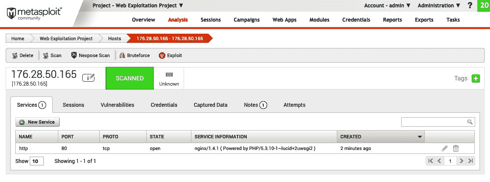

接下来，让我们看看如何检测 web 应用的 HTTP 头。

# HTTP 头检测

现在让我们尝试检测 web 应用的 HTTP 头。HTTP 标头可以显示有关应用的许多信息，例如所使用的技术、内容长度、cookie 过期日期、XSS 保护等：

1.  导航至模块部分并搜索`http_header`：


2.  单击模块名称将进入选项页面，在该页面中可以指定目标地址、端口号、线程等：


3.  配置设置后，单击运行模块，将启动一个新任务：


4.  任务完成后，我们可以转到“分析”选项卡，在“注释”部分，我们将能够看到扫描仪模块发现的所有标题：


接下来，让我们看看 web robot 页面枚举。

# Web 机器人页面枚举

`robots.txt`（或*机器人排除标准*是网站与爬虫或机器人进行通信的一种方法。让我们看看如何在以下步骤中完成枚举：

1.  要阻止来自`Googlebot`的子文件夹，我们将使用以下语法：

```
User-agent: Googlebot 
Disallow: /example-subfolder/
```

2.  为了告诉所有机器人不要抓取网站，我们可以将以下数据放入文本文件中：

```
User-agent: *
Disallow: /
```

在本节中，我们将使用`robots_txt`辅助工具获取网站`robots.txt`文件的内容：

1.  首先用`robots_txt`关键字搜索模块：


2.  单击模块将重定向到选项页面，在那里我们可以设置目标地址、RPORT、PATH、VHOST 等。在我们的案例中，我们使用了`www.packtpub.com`的示例作为 VHOST：


3.  单击“运行”模块后，将创建一个新任务，我们将能够在“任务”窗口中看到脚本运行的状态：

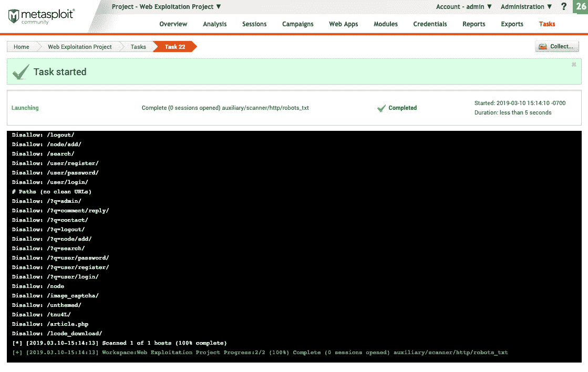

4.  任务完成后，我们可以返回分析选项卡，点击目标主机的 Notes 部分，查看网站`robots.txt`文件中列出的所有目录列表，如下图所示：


接下来，让我们在给定的网站上查找一些配置错误的 Git 回购。

# 查找隐藏的 Git 回购

有时，在生产服务器上部署来自 Git 的代码时，开发人员会将`git`文件夹留在公共目录中。这是危险的，因为它可能允许攻击者下载应用的整个源代码。

让我们看看`git_scanner`模块，它帮助我们发现网站上配置错误的回购协议：

1.  首先搜索`git_scanner`关键字：


2.  单击模块将重定向到模块选项页面，在该页面中指定目标地址和端口，然后单击运行模块：

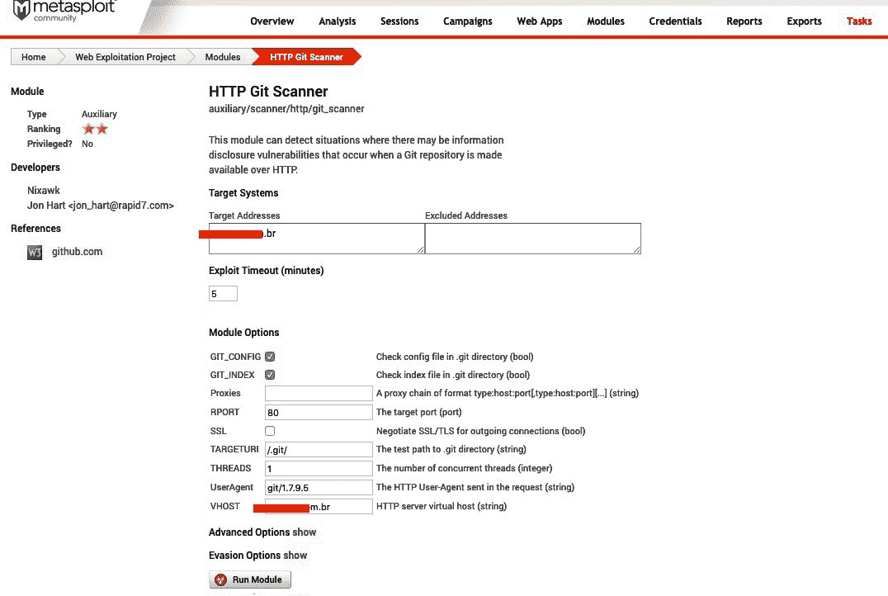

3.  将创建一个新任务，如以下屏幕截图所示：

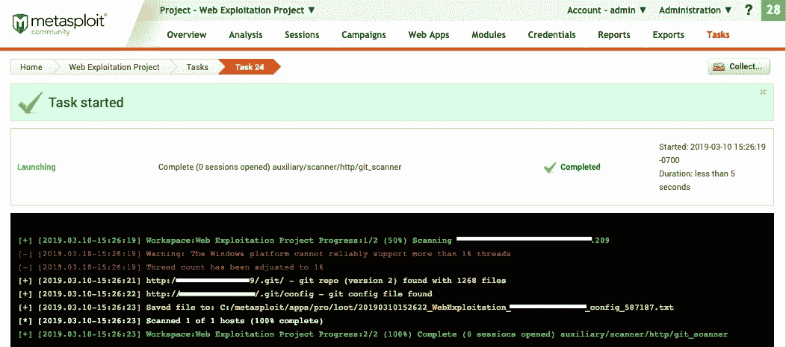

4.  任务完成后，我们可以转到“分析”选项卡并单击主机。在 Notes 部分，我们看到辅助程序已经找到了存储库的`config`和`index`文件：

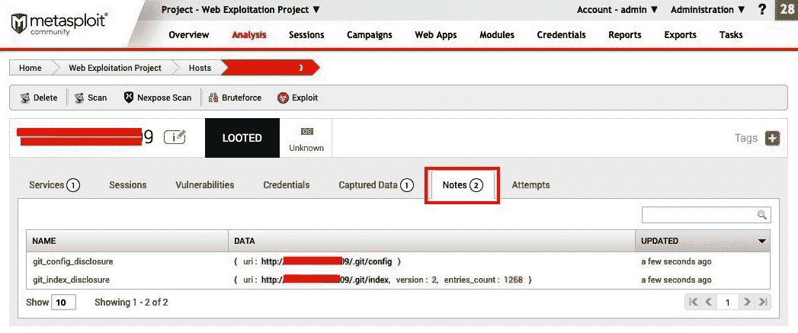

5.  接下来，我们可以转到 Captured Data（捕获数据）选项卡，查看辅助服务器找到的文件的内容：


6.  点击视图显示`config`文件的内容，其中包含`git`URL、版本和一些分支信息。此信息还可用于下载应用的全部源代码：

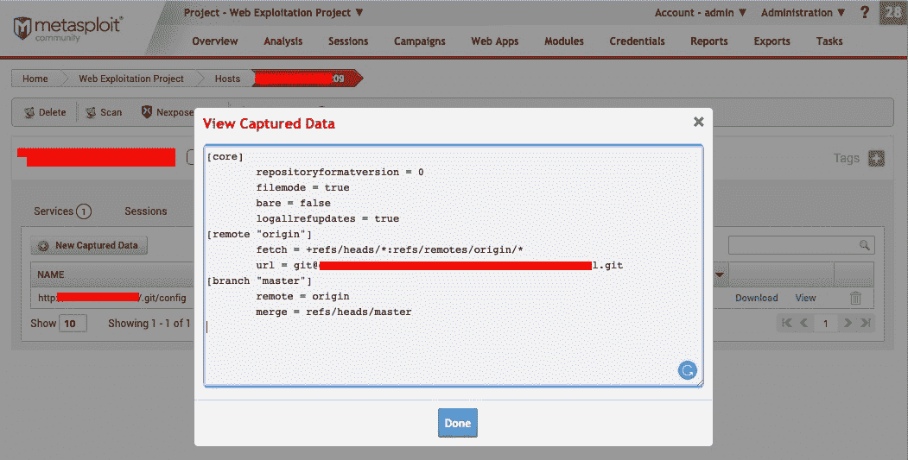

接下来，我们将检查开放代理服务。

# 开放代理检测

这是一个非常简单的脚本。它允许我们检查在端口上找到的代理服务是否是开放代理。如果代理服务是开放代理，我们可以将服务器用作代理来执行不同的攻击并避免检测，特别是在红色团队活动期间。执行以下步骤以了解如何执行此操作：

1.  首先在模块选项卡中搜索`open_proxy`关键字，如以下屏幕截图所示：


2.  单击模块名称，我们将被重定向到设置 IP、端口和 URL 以检查代理设置的选项。
3.  单击运行模块将创建一个新任务：

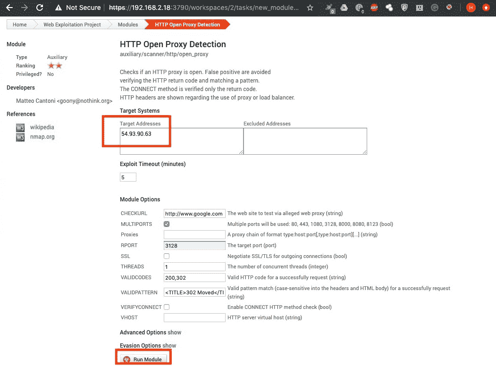

如果代理打开，我们将在任务窗口中看到一条消息，如以下屏幕截图所示：


现在，我们对使用 Metasploit 执行主动侦察有了更好的了解，让我们转到下一个主题，学习被动侦察。

# 被动侦察

被动侦察是一种收集目标信息的方法，无需主动与系统接触。我们不会直接接触这些系统。相反，我们将使用间接方法收集有关目标的信息，例如，通过 Shodan 和 Censys。

Metasploit 有很多辅助设备帮助被动侦察。在本节中，我们将介绍使用 Metasploit 辅助设备执行被动侦察的一些方法。

# 存档域 URL

存档域 URL 是执行被动侦察的最佳方式之一，因为它们告诉我们网站及其 URL 的历史。有时，网站被更改，但一些旧文件和文件夹留在服务器上；这些可能包含漏洞并允许我们访问。org 和 Google Cache 是我们可以用来搜索存档域 URL 的两种服务。

Metasploit 还有一个用于此目的的内置辅助工具：

1.  我们可以在搜索模块屏幕中使用`enum_wayback`关键字来查找我们需要的辅助工具：


2.  点击模块，我们将被重定向到选项页面，在那里我们可以输入网站域名。然后，单击运行模块：


创建一个新任务，模块成功运行，并打印在任务窗口中找到的输出，如以下屏幕截图所示：

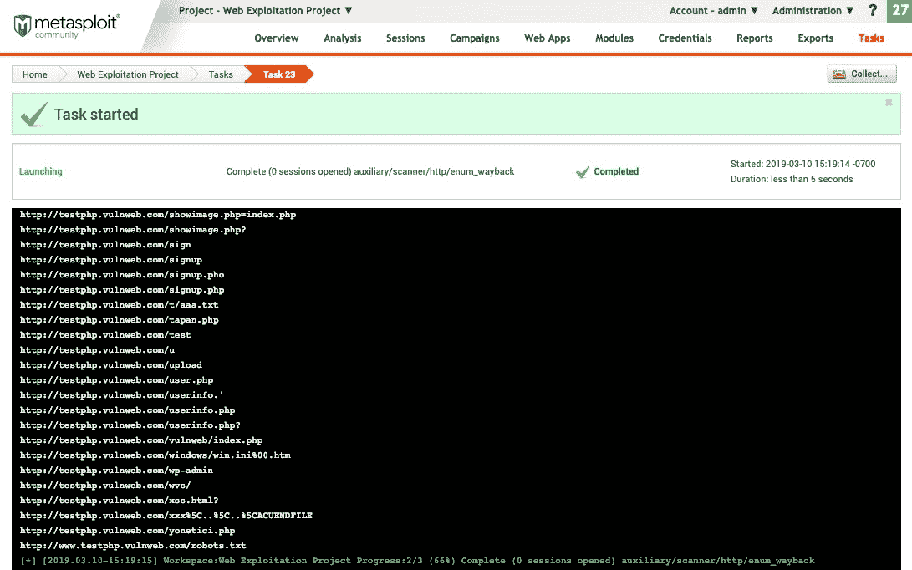

接下来，将向您介绍 Censys。

# 森斯

CENSIS 是连接到互联网的设备的搜索引擎。C.C.系统是由密歇根大学开发 ZMAP 的安全研究人员于 2015 创建的。

Censys 连续扫描和记录互联网上的设备：

1.  Metasploit 还有一个内置的辅助工具，允许我们进行 Censys 扫描。我们可以在模块搜索中使用`censys`关键字来定位脚本：


2.  点击模块将带我们进入选项页面，但在此之前，我们需要在`censys.io`上登录到我们的帐户，并获取 API ID 和密码，这将在模块中使用：

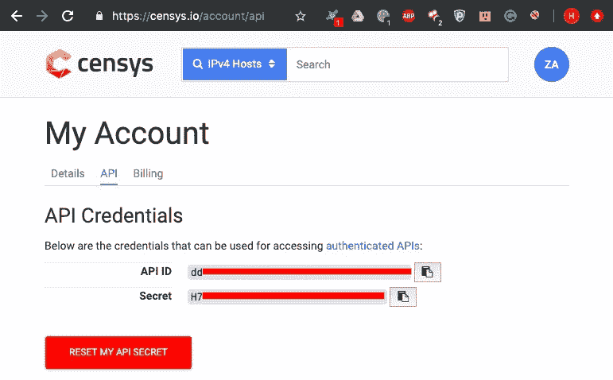

3.  我们在模块选项中输入 API ID 和 Secret，并将域名指定为目标地址。我们以`packtpub.com`为例：

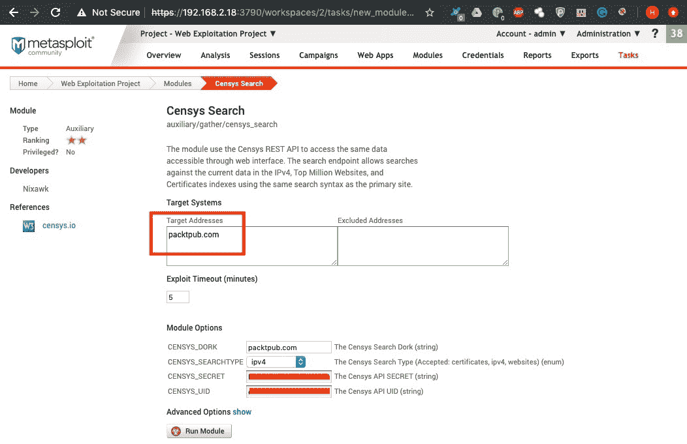

4.  单击 Run 模块将创建一个新任务。辅助设备将搜索不同的主机及其端口。结果将按以下屏幕截图所示打印：

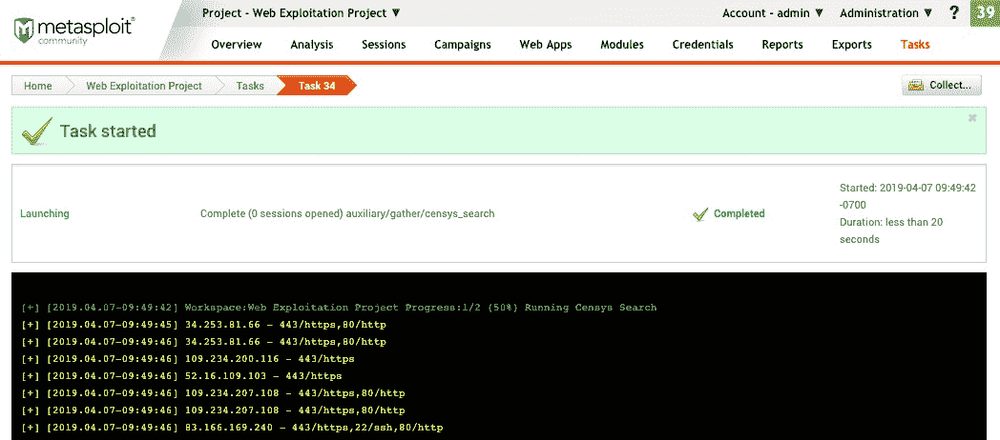

Metasploit 还有用于搜索 Shodan 和 Zoomeye 数据库的模块，如以下屏幕截图所示：

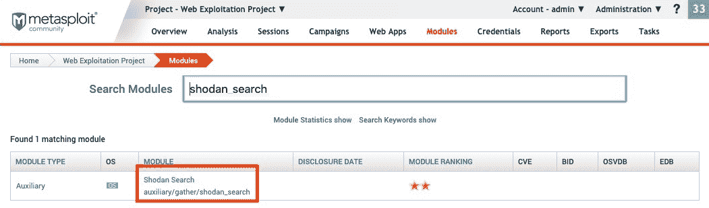

以下屏幕截图显示了`shodan_search`模块的输出：

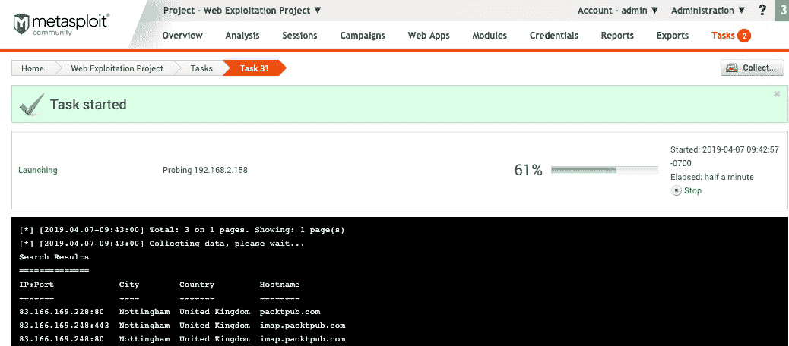

5.  要运行 Zoomeye 模块，我们可以搜索`zoomeye`关键字并像对 Shodan 一样运行该模块。这显示在以下屏幕截图中：

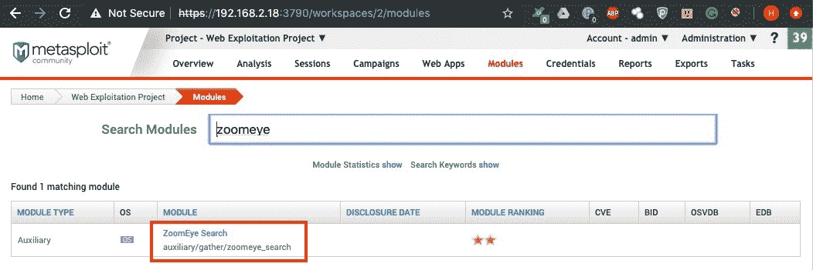

接下来，我们将了解 SSL 侦察。

# SSL 侦察

**安全套接字层**（**SSL**）被组织用于确保服务器和客户端之间的加密通信。在本节中，我们将介绍 Metasploit 模块，该模块使用 SSL 实验室的 API 收集主机上运行的 SSL 服务的信息：

1.  我们可以在模块搜索中搜索`ssllabs`关键字找到模块，如下图所示：


2.  单击模块名称将重定向到选项页面。在这里，我们设置目标并单击运行模块：

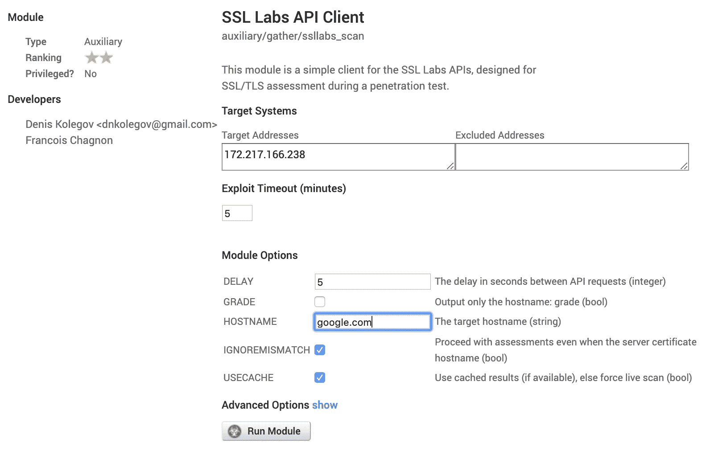

将创建一个新任务，它将向我们显示扫描结果和输出，如以下屏幕截图所示：

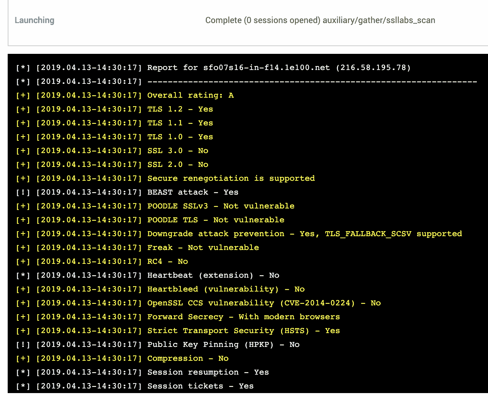

SSL 可以公开很多信息，例如证书颁发机构、组织名称、主机和内部 IP。我们可以使用相同的模块了解服务器上运行的 SSL 版本，检查服务器允许的密码，还可以检查目标站点是否启用了**HTTP 严格传输安全**（**HSTS**）。

# 总结

在本章中，我们了解了侦察过程。我们从使用 HTTP 头和发现 Git repo 的主动侦察开始。然后，我们转向被动扫描，在这里我们查看了 Shodan 和 SSL 分析，并使用归档网页获取与目标相关的信息。

在下一章中，我们将学习如何使用 Metasploit 执行基于 web 的枚举。我们将重点介绍 HTTP 方法枚举、文件和目录枚举、子域枚举等。

# 问题

1.  HTTP 标头检测模块未显示任何输出。这是否意味着模块工作不正常？

2.  Metasploit web 界面中的端口扫描有点问题。对此你能做些什么？

3.  在 Metasploit 框架中使用自定义模块时，能否在 Metasploit web 界面中加载它们？

4.  我的组织为我提供了安装在 VPS 上的 Metasploit web 界面。如何确保 Web 界面的登录页受到保护？

# 进一步阅读

要阅读有关此主题的更多信息，您可以查看以下 URL：

*   [https://metasploit.help.rapid7.com/docs/replacing-the-ssl-certificate](https://metasploit.help.rapid7.com/docs/replacing-the-ssl-certificate)
*   [https://github.com/rapid7/metasploit-framework/wiki/Metasploit-Web-Service](https://github.com/rapid7/metasploit-framework/wiki/Metasploit-Web-Service)
*   [https://www.offensive-security.com/metasploit-unleashed/scanner-http-auxiliary-modules/](https://www.offensive-security.com/metasploit-unleashed/scanner-http-auxiliary-modules/)