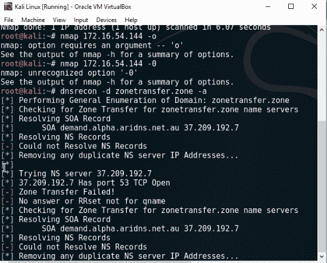
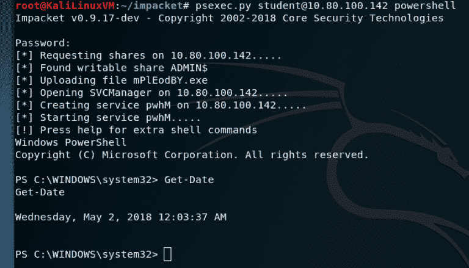
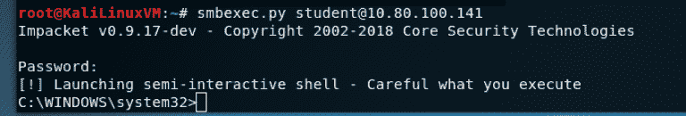
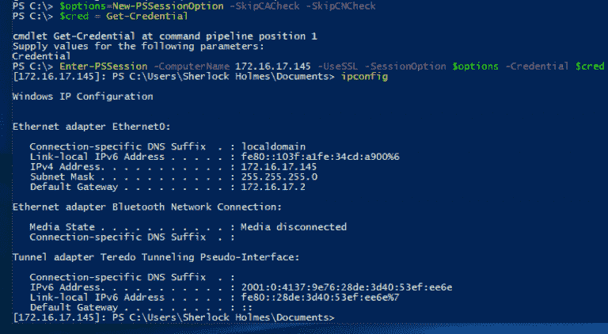

# 三、渗透测试方法

成功进行笔试的最重要因素之一是基本方法。缺乏一个正式的方法论意味着没有统一性，我相信你不想成为一个资助笔试的人，而看着测试员无所事事地四处闲逛。

方法定义了在任何信息安全审计计划过程中遵循和实施的一套规则、做法和程序。渗透测试方法定义了一个路线图，其中包含实际想法和经验证的实践，可用于评估网络、应用、系统或其任何组合的真实安全态势。

虽然渗透测试人员的技能需要针对具体的工作，但其执行方式不应如此。也就是说，一个合适的方法应该为进行完整和真实的渗透测试提供一个细致的框架，但不一定是阻碍性的，它应该允许测试人员充分探索他们的直觉。

# 技术要求

您的系统中必须安装 Kali Linux 和 Nmap，因为我们将在本章中使用它们。

# 渗透测试方法

在确定测试类型的范围时，了解不同类型的测试及其组成很重要；这可以分为三组：

*   **白盒渗透测试**：在这里，测试人员对被测试的系统有完整的访问和深入的了解。测试人员与客户机合作，可以访问内部信息、服务器、软件运行、网络图，有时甚至是凭据。此测试类型通常用于在新应用投入生产之前对其进行测试，并作为**系统开发生命周期**（**SDLC**的一部分进行常规测试；这有助于在投入生产之前识别漏洞并进行补救。

*   **黑箱渗透测试**：在黑箱渗透测试方法中，测试人员只能获得高级信息。测试人员完全不知道系统/网络，使此测试类型尽可能接近真实世界。测试人员必须在客户同意的范围内，使用创造性的方法获取所有信息。虽然这种方法模仿真实世界，但有时在测试时可能会遗漏一些区域。如果没有正确确定范围，对客户机来说可能会非常昂贵，而且会非常耗时。测试人员将研究所有攻击向量并报告其发现。测试人员必须小心，因为在这种类型的测试中，东西可能会断裂。

*   灰色盒子渗透试验：1、在两个极端的中间是灰箱渗透试验；只有有限的信息可供测试人员从外部攻击系统。这些测试通常在有限的范围内运行，测试人员拥有一些关于系统的信息。

无论选择哪种测试，都必须遵循标准或指导原则，以确保最佳实践。我们将更详细地讨论一些最流行的标准：

*   OWASP 测试指南
*   PCI 渗透测试指南
*   渗透测试执行标准
*   NIST 800-115
*   **开源安全测试方法手册**（**OSSTMM**

# OWASP 测试指南

**开放式 Web 应用安全项目**（**OWASP**是一个开源社区项目，开发软件工具和基于知识的文档，帮助人们保护 Web 应用和 Web 服务。OWASP 是系统架构师、开发人员、供应商、消费者和参与设计、开发、部署和测试 web 应用和 web 服务安全性的安全专业人员的开源参考点。简而言之，OWASP 旨在帮助每个人和任何人构建更安全的 web 应用和 web 服务。《OWASP 测试指南》的一个最好的方面是，它全面地描述了确定调查结果所呈现的业务风险。《OWASP 测试指南》根据风险可能对业务产生的影响以及风险发生的可能性对风险进行评级。通过 OWASP 测试指南中描述的这些方面，可以找出给定发现的总体风险评级，从而根据其发现的结果为组织提供适当的指导。
OWASP 测试指南主要关注以下内容：

*   web 应用测试中的技术和工具
*   信息收集
*   认证测试
*   业务逻辑测试
*   数据验证测试
*   拒绝服务攻击测试
*   会话管理测试
*   Web 服务测试
*   AJAX 测试
*   风险严重性
*   可能的风险

# PCI 渗透测试指南

对于那些需要遵守 PCI 要求的公司来说，一切都变得现实了。PCI v3.2 不仅是强制性的，PCI 标准安全理事会还发布了将渗透测试作为漏洞管理计划一部分的指南。

2016 年 4 月，**支付卡行业安全标准委员会**（**PCI SSC**）发布了**PCI 数据安全标准**（**PCI DSS**版本 3.2。随着更新，出现了对需求的澄清、附加指南和七个附加新需求

为了解决与持卡人数据泄露相关的问题并防止现有漏洞攻击，PCI DSS v.3.2 包含了各种更改，其中大多数更改是针对服务提供商的。这包括新的渗透测试要求，现在要求服务提供商至少每六个月或在细分控制/方法发生任何重大变化后进行细分测试。此外，还有一些要求，以确保服务提供商全年持续监控和维护关键的安全控制。

# 渗透测试执行标准

渗透测试执行标准包括七个主要部分。它们涵盖了渗透测试的所有内容——从笔试后的初步沟通和努力；通过信息收集和威胁建模阶段，测试人员在幕后工作，以更好地了解被测试公司；通过漏洞研究、开发和后期开发，让测试人员的实用安全知识发挥作用，并与商业智能相结合；最后是报告，它以客户能够理解的格式概述了整个过程。
本版本可视为 v1.0 版，因为本标准的核心元素已经固化，并通过行业进行了一年多的现场测试。v2.0 正在制作中，并将提供更多的粒度级工作，如渗透测试每个元素可以执行的强度级。由于笔测试与其他测试不同，测试范围从 web 应用或网络测试到完全的红队黑匣子测试，所述级别将使组织能够概述他们希望测试人员公布的复杂性，并使测试人员能够在组织认为必要的领域提高强度。在情报收集部分可以看到一些初步的级别工作。
以下是本标准定义的主要章节，作为进行渗透试验的依据：

*   参与前互动
*   情报收集
*   威胁建模
*   脆弱性分析
*   剥削
*   剥削后
*   报告

# NIST 800-115

**国家标准与技术研究所专门出版物**（**NIST-SP-800-115**是信息安全测试与评估的技术指南。本出版物由 NIST 的**信息技术实验室**（**ITL**制作。

本指南将安全评估定义为确定被评估实体满足特定安全要求的有效性的过程。当您查看指南时，您将看到它包含大量用于测试的信息。虽然文档没有像我们希望的那样经常更新，但它是一个可行的资源，可供我们在构建测试方法时参考。

它们提供了设计、实施和维护技术信息、安全测试以及检查过程和程序的实用指南，涵盖了关键要素或技术安全测试和检查。

这些可用于多种原因，例如查找系统或网络中的漏洞，验证是否符合策略或其他要求。本指南的目的不是提供一个包罗万象的信息安全测试和检查计划，而是概述技术安全测试和检查的关键要素，重点介绍具体技术、每种技术的优点和局限性，以及使用建议。
NIST 800-115 标准为笔式测试员提供了一个伟大的地图，这是公认的行业标准。此模型是确保渗透测试计划符合最佳实践的一个好方法。

# 开源安全测试方法手册

OSSTMM 不是最容易阅读或最有趣的文档，但它充满了实用且相关的高级安全信息。它也是地球上最著名的操作安全手册，每月下载量约为 50 万次，原因有一个：了解它的人有着明显的安全优势，因为它的说明比当前安全行业的热门话题早了大约十年。
OSSTMM 的目标是提出一个互联网安全测试标准。其目的是形成一个完整的测试基线，当遵循该基线时，确保进行了彻底和全面的渗透测试。这应使客户确信技术评估的水平独立于其他组织关注的问题，如渗透测试提供商的公司概况。

# 通用渗透测试框架

虽然其中一些标准的要求数量不同，但可以大致分为以下几个阶段：

*   侦察
*   扫描和枚举
*   获取访问权限
*   特权升级
*   维护访问权限
*   掩盖你的行踪
*   报告

让我们更详细地了解每个阶段。 

# 侦察

渗透测试的大部分时间将花在测试的第一个关键部分。虽然有些人将此阶段分为主动和被动两个阶段，但我更喜欢将它们组合在一起，因为所获取的数据本身就说明了问题。

侦察是一种系统性的方法，在这种方法中，你试图定位并收集尽可能多的目标信息，这就是所谓的脚印。

脚印涉及的技术包括但不限于以下：

*   社会工程（这很有趣）
*   互联网研究（谷歌、必应、LinkedIn 等）
*   垃圾桶潜水（弄脏你的手）
*   冷电话

这基本上是你获取目标信息的任何方式，所以要有创意。那么，我们在找什么？

好的，每一点信息都是有用的，但是它需要被优先考虑，并且记住一些你起初可能不觉得有用的东西可能会在其他地方派上用场。但首先，重要的是：

*   组织内的联系人姓名
*   组织的其他地点（如有）
*   电子邮件地址（我们以后可以将其用于网络钓鱼、捕鲸或鱼叉网络钓鱼）
*   公司内重要人物的电话号码（可用于网络钓鱼）
*   公司内部使用的系统，如 Windows 或 Linux
*   职位公告
*   员工简历（过去/现在）

虽然所有这些都是不言自明的，但招聘启事似乎有点奇怪；然而，假设你遇到一个系统管理员，根据他们要求的职位要求，你可以得到很多关于他们内部系统的信息。这可以用来找出攻击向量或发现漏洞。

员工简历以类似的方式工作；通过了解员工的技能，您可以确定他们可能运行或不运行的系统类型。

虽然这可能看起来很乏味，但请记住，您拥有的信息越多，您在以后做出决策时的能力就越强。我个人发现，在整个订婚过程中，我又回到了这个阶段。 

# 扫描和枚举

毫无疑问，几乎每一个安全专业人员都想直接跳进漏洞利用箱，但他们不了解基本知识、漏洞利用，最重要的是，他们所处的环境。这可能会导致错误或更糟的情况，例如在活动环境中破坏东西。

扫描和枚举允许笔测试人员了解其环境。从这些扫描中得到的结果为红色团队提供了一个利用不同系统中漏洞的起点。扫描正在查找目标主机上运行的所有可用网络服务（TCP 和 UDP）。这可以帮助红队成员发现 SSH/Telnet 是否打开以尝试暴力登录，并发现文件共享以从中下载数据、可能存在漏洞的网站或可能持有用户名和密码的打印机。枚举是指发现网络上的服务，从而对网络提供的信息有更大的感知服务。

# 扫描

当怀疑缓解控制（如防火墙、入侵检测系统和文件完整性监视）是否有效时，最好进行全面渗透测试。扫描将定位单个漏洞；但是，渗透测试将尝试验证这些漏洞是否可在目标环境中被利用。让我们看看每种类型。

# ARP 扫描

通过使用 ARP 广播，我们可以利用获取 IP 信息的优势。每个 ARP 广播帧请求谁拥有哪个 IP 地址，IP 地址每次增加一个。一旦主机拥有该 IP 地址，它将使用请求的 IP 地址及其 MAC 地址响应请求。

ARP 扫描是一种有效的快速方法，通常不会触发任何警报；问题是 ARP 是第二层协议，所以不能跨越网络边界。意思是如果红队在网络`192.100.0.0/24`上，而你的目标在网络`10.16.X.0/24`上，你就不能向`10.16.X.0/24`发送 ARP 请求。

# 网络映射器（Nmap）

Nmap 是端口扫描和枚举中最重要的工具。本指南涵盖了 Nmap 的所有选项和模块，超出了本书的范围；相反，我们将介绍我在测试时主要使用的扫描。但首先，这里有一些关于港口国的信息：

*   **打开**：目标机器上的应用正在侦听该端口上的连接/数据包
*   **关闭**：端口没有应用监听，但可以随时打开
*   **过滤**：防火墙、过滤器或其他网络障碍正在阻止端口，因此 Nmap 无法判断端口是否打开或关闭

以下是可用的 Nmap 选项：

*   `O`：操作系统检测
*   `p`：端口扫描
*   `p-`：扫描所有端口（`1-65535`）
*   `p 80,443`：扫描端口`80`和``443``
*   `p 22-1024`：扫描端口`22`至`1024`
*   `top-ports X`：`X`是一个数字，它会扫描`X`热门端口的编号；我通常用 100 进行快速扫描
*   `sV`：服务检测
*   `Tx`：设置扫描速度
*   `T1`：端口扫描速度非常慢
*   `T5`：非常快的端口扫描（非常嘈杂）
*   `sS`：隐形扫描
*   `sU`：UDP 扫描
*   `A`：操作系统检测、版本检测、脚本扫描、跟踪路由

# Nmap 端口扫描程序/TCP 扫描

此服务将通过在目标主机上的每个端口上启动（`SYN`连接来启动。如果端口打开，主机将以（`SYN`、`ACK`响应。通过启动器发送的重置（`RST`）关闭连接：


# Nmap 半开/隐形扫描

此选项将首先在目标主机上的每个端口上发送（`SYN`连接。如果端口打开，主机将用（`SYN`、`ACK`回复请求。

如果端口未打开（即关闭），主机将用连接重置（`RST`）进行应答。
如果没有收到响应，则假定端口已过滤。TCP 扫描和隐形扫描之间的区别在于，连接启动器不会以确认（`ACK`数据包）进行响应。这是一次有效的扫描，因为没有建立完整的连接，所以不会记录。

# Nmap 操作系统检测

此选项将使用各种技术尝试识别操作系统类型和版本。这对于漏洞检测非常有用。在操作系统版本上进行快速搜索将显示操作系统的已知漏洞和漏洞，通过以下命令帮助您更好地了解情况：

```
nmap 172.16.54.144 –O
```

# Nmap 服务检测

与操作系统检测类似，此选项尝试确定服务和版本，如以下屏幕截图所示：

```
nmap 172.16.54.144 –sV 
```


# Nmap ping 扫描

此选项将向给定范围内的每个 IP 地址发送 ICMP 请求。如果主机已启动并配置为响应 ping 请求，它将使用 ICMP 回复进行回复，如以下屏幕截图所示：

```
nmap 172.16.54.0/24 –sP
```


# 列举

枚举是 web 应用中发现的所有攻击和弱点的基础。开发视图将这些攻击和弱点合并为漏洞，并根据它们在相对开发阶段的发生情况对它们进行分类。这可能是一个设计、实现或部署阶段。有几种枚举技术；我们将看一些

# 中小企业股份

**SMB**代表**服务器消息块**。它是一种文件共享协议，由 IBM 发明，自 20 世纪 80 年代中期开始出现。SMB 协议旨在允许计算机通过**局域网**（**LAN**向远程主机读写文件。通过 SMB 提供的远程主机上的目录称为共享。

这种技术有几个好处，我们将对此进行讨论。

# DNS 区域传输

DNS 是我最喜欢的协议，因为它是信息宝库。如果您可以请求区域传输，测试人员可以获取特定区域的所有 DNS 记录。这将标识网络中所有主机的主机名到 IP 地址关系。如果攻击者了解网络方案，这可能是发现网络上所有主机的最快方法。DNS 还可以产生在网络上运行的服务，如邮件服务器。

# DNSRecon

DNSRecon 是我的 DNS 侦察和枚举工具。在本例中，我们将从`domain.foo`请求区域转移。在`domain.foo`上运行的 DNS 服务器将返回它知道的`domain.foo`及其关联子域的所有记录。这将为我们提供服务器的名称以及相应的主机名和域的 IP 地址。它返回了所有 DNS 记录，它们是`TXT records (4)`、`PTR records (1)`、`MX records for mail servers (10)`、`IPv6 A records (2)`和`IPv4 A records (12)`。这些记录提供了一些关于网络的非常有趣的信息。一条记录显示其 DC 办公室的 IP 地址，另一条记录显示其防火墙设备的 IP 地址，另一条记录显示其拥有 VPN 及其 IP 地址，另一条记录显示邮件服务器登录门户的 IP 地址，如以下屏幕截图所示：

```
 dnsrecon -d zonetranfer.zone -a
 -d: domain
 -a: perform zone transfer
```



# SNMP 设备

**简单网络管理协议**简称**SNMP**，用于记录和管理网络设备和应用。SNMP 可用于远程配置设备和应用，但如果不加保护，也可用于提取有关所述应用和设备的信息。这些信息可用于更好地了解网络：

```
snmpwalk 192.16.1.1 -c PUBLIC
```

`-c`: This is a community string to authenticate to a device.

# 数据包捕获

在诊断网络问题、凭证嗅探或查看流量时，捕获两台主机之间的数据包非常有用。

# 命令

这是一个命令行实用程序，用于嗅探特定类型的网络流量和数据：

*   `-i eth0`：选择要监听的接口
*   `port 80`：选择要监听的端口
*   `host 172.16.1.1`：只收集到主机的流量
*   `src`：数据来自
*   `dst`：数据将发送至
*   `-w output.pcap`：捕获磁盘上文件的流量

# 钢丝鲨

这是一个 GUI 实用程序，用于嗅探网络流量，如以下屏幕截图所示：

*   `ip.addr/ip.dst/ip.src == 172.16.1.1`
*   `tcp.port/tcp.dstport/tcp.srcport == 80`
*   `udp.port/udp.dstport/udp.srcport == 53`


# 获取访问权限

正是在这一阶段，笔试人员试图在公司内部网络中站稳脚跟。如今，鱼叉式网络钓鱼似乎是实现这一目标的一种非常普遍和有效的方式。可以针对该公司发起精心策划的鱼叉式网络钓鱼活动，并根据侦察阶段收集的信息创建令人信服的场景。

获取访问权限还可以包括使用远程服务上的漏洞/凭据登录到系统，然后执行有效负载。

Metasploit 和 PowerShell Empire 可以在这方面提供帮助，因为它们都可以创建有效负载，也称为 stager。在目标上执行 stager 后，它将在内存中运行。这种风格只留下很少的法医证据。另一种情况是将二进制文件推送到远程系统，并通过命令行执行二进制文件，这同样有效。这种方法速度更快，并且不依赖于互联网下载来获得成功。

# 功绩

有时测试人员可能会遇到可以利用的服务。利用漏洞可能是初始访问的手段；只需确保该漏洞是 100%可靠的。此外，多次运行漏洞攻击可能会使系统崩溃。此初始访问选项通常非常小心地使用，除非您已经测试过，并且知道自己在做什么。

总是嘘！也许并不总是这样，但我从来没有见过/能够记得在 telnet 之外使用的另一种服务，这是无论如何都不应该使用的。SSH 与 Linux 的搭配就像花生酱与果冻的搭配一样。

# Linux 漏洞攻击

Linux 漏洞攻击通常不是针对操作系统本身，而是针对正在运行的服务。在这里，您将找到一个针对 Linux 设备运行的常见漏洞列表。请记住，漏洞利用在发行版和服务版本之间会有所不同：

*   CVE-2018-1111
*   发现 Red Hat Linux DHCP 客户端易受命令注入攻击
*   CVE-2017-7494

# Windows 漏洞攻击

Windows 漏洞攻击通常针对操作系统的侦听服务。以下是针对在 Windows 的端口`445`上运行的 SMB 服务的列表：

*   永恒蓝–MS17-010
*   MS08-67
*   MS03-026

以下是笔式测试仪经常使用的一些工具：

*   PsExec：

PsExec 是 Sysinternals 工具包中包含的一个工具；它用于远程管理，是笔测试人员、系统管理员和黑客中流行的工具。PsExec 二进制文件通常复制到机器上的`$admin`共享，然后使用远程管理在远程机器上创建服务。请记住，PsExec 需要在远程计算机上具有管理员权限：

1.  下载系统内部构件
2.  打开 PowerShell 提示符
3.  类型`cd <Sysinternals directory>`
4.  类型`.\PSexec \\<IP addr of remote machine> -u <user> -p <password> <cmd>`

以下屏幕截图描述了获得的输出：


*   **Impacket**：用于处理网络协议的 Python 类集合。

初始设置可按如下方式进行：

1.  打开终端
2.  类型`cd /tmp`
3.  类型`git clone https://github.com/CoreSecurity/impacket.git`
4.  类型``pip install ``

使用以下命令在 Impacket 上启用 PSexec、WMI 和 SMBexec：

*   **PSexec**：

```
psexec.py <username>:<password>@<ip addr> powershell 
```

上述命令的输出显示在以下屏幕截图中：



*   **WMI**：

```
wmiexec.py <username>:<password>@<ip addr> powershell
```

上述命令的输出显示在以下屏幕截图中：


*   **SMBexec**：

```
wmiexec.py <username>:<password>@<ip addr>
```

上述命令的输出显示在以下屏幕截图中： 



*   **PS 远程处理**：

要在目标计算机上启用 PS 远程处理，请执行以下步骤：

1.  在目标计算机上以管理员身份打开 PowerShell
2.  键入以下内容：``powershell -NoProfile -ExecutionPolicy Bypass -Command "iex ((new-object net.webclient).DownloadString('https://raw.githubusercontent.com/ansible/ansible/devel/examples/scripts/ConfigureRemotingForAnsible.ps1'))"``
3.  启用 PS 远程处理
4.  类型`winrm set winrm/config/client/auth '@{Basic="true"}'`
5.  类型`winrm set winrm/config/service/auth '@{Basic="true"}'`
6.  类型`winrm set winrm/config/service '@{AllowUnencrypted="true"}'`

要启用 PS 远程进入目标机器，请执行以下步骤：

1.  打开 PowerShell。
2.  类型`$options=New-PSSessionOption -SkipCACheck -SkipCNCheck`
3.  输入`$cred = Get-Credential`。这将提示您输入凭据。
4.  输入`Enter-PSSession -ComputerName <hostname> -UseSSL -SessionOption $options -Credential $cred`。

您将看到配置详细信息，如以下屏幕截图所示：



以类似的方式，我们还将看到如何在远程目标上启用 WMI 并使用 WMI 访问远程目标

*   **WMI**：以管理员身份打开 PowerShell 并运行以下命令可以在远程目标上启用 WMI：

```
netsh firewall set service RemoteAdmin enable
```

要使用 WMI 访问远程目标，可以通过打开 PowerShell 来完成，键入以下命令并观察输出，如以下屏幕截图所示：

`wmic /node:<target IP addr> /user:<username> process call create "cmd.exe /c <command>"`


# 提升特权

一旦机器遭到破坏，获得的任何访问权限通常都是低权限的。由于笔测试的目的是模拟真实世界的攻击，这包括寻找通常保存在受限服务器上的敏感信息；测试人员需要找到提升其权限的方法。在 Windows**Active Directory**（**AD**环境中，这意味着可以访问域管理员帐户。

# 维护访问权限

一旦建立了立足点（即远程访问），就可以很快将其删除，因为系统可以重新启动，用户可以注销。这就是持久访问的用武之地；它可以通过多种方式实现。维护持久访问的最佳策略是同时使用多种技术。

例如，可以在网络中安装一个物理后门（Dropbox），稍后可以在其无线范围内访问。更具创造性的方法是在受损机器上设置一个计划任务，以便在启动时运行并定期执行，例如每天执行一次：


# 掩盖你的行踪

无论发生什么情况，所有业务都应由客户授权。这并不是说，在所有的扫描和利用都结束后，一个人打包回家；仍然需要有人以他们能够理解的方式向客户展示调查结果。但在此之前，我们必须清除遗留在环境中的漏洞或工具。有时这可能意味着删除二进制文件或编辑日志，我说编辑是因为任何没有看到日志的系统管理员都应该很快关注。由于 Windows 和 Linux 都有各自的日志机制，而且它们都有很好的文档记录，所以这里不需要介绍它们。我建议你跟踪你在系统中所做的改变，当你需要隐藏某些东西时要有创造力；使用适合帐户的系统服务名称或用户名，例如，不要将帐户命名为`EliteHAK3R`。

# 报告

这就把我们带到了期末考试，有些人会说这是考试中最无聊的部分；但是，如果您遵循前面的阶段，报告就不会单调乏味或困难。我试着一边做笔记，要么在纸上，要么使用 Dradis，一个内置的 Kali 工具，可以通过`service dradis start`调用。请记住，它是一个 web 服务，因此局域网上的任何人都可以使用`https://IP of kali machine:3004`URL 访问它–第一次运行时，它会提示您设置密码。

Dradis 允许您从 Nmap、NESSUS、NEXPOSE 和其他一些文件导入文件，这使得在与队友一起工作时记笔记变得轻松；您可以轻松共享信息并随时更新扫描的最新结果。

# 总结

本章向您介绍了渗透测试中的各种方法，以规划和确定渗透测试的范围。下一章将介绍如何使用被动和主动技术发现和收集有关目标和环境的信息和数据。