# 十一、无线渗透测试

在我们之前的大部分讨论中，我们已经研究了在连接到有线网络时涉及渗透测试的技术。这包括内部**局域网**（**局域网**）和公共互联网上的 web 应用评估等技术。值得关注的一个重点领域是无线网络。无线网络无处不在，已部署在各种环境中，如商业、政府、教育和住宅环境。因此，渗透测试人员应确保这些网络具有适当数量的安全控制，并且没有配置错误。

在本章中，我们将讨论以下主题：

*   **无线网络**：在本主题中，我们将介绍控制客户端（如笔记本电脑和平板电脑）如何通过无线网络接入点进行身份验证和通信的底层协议和配置。
*   **侦察**：就像我们通过有线连接进行的渗透测试一样，Kali Linux 和其他系统中有一些工具可以添加和利用，以识别潜在的目标网络，以及我们在攻击过程中可以利用的其他配置信息。
*   **身份验证攻击**：与试图破坏远程服务器不同，我们将讨论的攻击围绕获得对无线网络的身份验证访问。一旦经过验证，我们就可以连接并实施我们之前研究过的工具和技术。
*   **身份验证后要做什么**：这里，我们将讨论身份验证机制被破解后可以采取的一些行动。其中包括对接入点的攻击，以及如何绕过无线网络中实施的公共安全控制。还解决了嗅探无线网络流量以获取凭据或其他信息的问题。

对无线网络渗透测试有一个坚实的理解变得越来越重要。技术正在迅速采用**物联网**（**物联网**的概念，其目的是将越来越多用于舒适和方便的设备移动到互联网上。推动这一进步的将是无线网络。

因此，将需要越来越多的此类网络，这对应于攻击面的增加。客户和组织需要了解风险以及攻击者如何攻击这些系统。

# 技术要求

在本章中，使用了两种不同的 USB 天线。第一个是 TP-LINK TL-WN722N 无线 N150 高增益 USB 适配器，另一个是阿尔法 AWUSO36NH 高增益 USB 无线 G/N 远程 Wi-Fi 网络适配器。这两种产品在商业市场上都很容易买到。有关更多信息，请访问以下网站了解支持的无线天线和芯片组：[http://aircrack-ng.org/doku.phpid=compatibility_drivers &DokuWiki=090ueo337eqe94u5gkjo092di6](http://aircrack-ng.org/doku.phpid=compatibility_drivers&DokuWiki=090ueo337eqe94u5gkjo092di6#which_is_the_best_card_to_buy)哪张卡是最好买的卡。

# 无线网络

无线网络由协议和配置控制，其方式与有线网络大致相同。无线网络利用无线电频谱频率在接入点和连接的网络之间传输数据。就我们而言，**无线局域网**（**W****局域网**）与标准**局域网**（**局域网**有很多相似之处。渗透测试人员的主要重点是识别目标网络并获得访问权限。

# 802.11 概述

管理无线网络的最高标准是 IEEE 802.11 标准。这组规则最初是为了便于使用和快速连接设备而开发的。1997 年发布的初始标准没有解决安全问题。从那时起，这些标准进行了多次修改；第一个对无线网络有重大影响的是 802.11b。这是最广泛接受的标准，于 1999 年发布。

由于 802.11 标准使用无线电信号，特定地区有不同的与无线网络使用相关的法律法规。不过，一般来说，802.11 标准及其相关修订版中只内置了几种类型的安全控制。

# 有线等效隐私标准

**有线等效隐私**（**WEP**标准）是第一个与 802.11 标准一起开发的安全标准。WEP 于 1999 年与第一个广泛采用的 802.11 迭代一起首次部署，其设计目的是提供与有线网络相同的安全性。这是通过使用 RC4 密码组合来实现的，以提供机密性，并使用 CRC32 实现完整性。

通过使用 64 位或 128 位密钥对 WEP 网络进行身份验证。64 位密钥是通过输入一系列 10 个十六进制字符派生的。这些初始的 40 位与 24 位的**初始化向量**（**IV**）组合，形成 RC4 加密密钥。对于 128 位密钥，104 位密钥或 26 个十六进制字符与 24 位 IV 组合以创建 RC4 密钥。

对 WEP 无线网络进行身份验证分为四个阶段：

1.  客户端向 WEP 访问点发送请求以进行身份验证。
2.  WEP 访问点向客户端发送一条明文消息。
3.  客户端获取输入的 WEP 密钥并加密接入点传输的明文消息。客户端将其发送到接入点。
4.  接入点使用自己的 WEP 密钥对客户端发送的消息进行解密。如果消息被正确解密，则允许客户端连接。

如前所述，WEP 的设计并没有以消息的机密性和完整性为中心。因此，WEP 实现存在两个关键漏洞。首先，CRC32 算法本身并不用于加密，而是用于对错误进行校验和。第二个原因是 RC4 容易受到所谓的初始化向量攻击。IV 攻击是可能的，因为 RC4 密码是一种流密码，因此，同一密钥不应使用两次。在繁忙的无线网络上，24 位密钥太短，无法使用。在大约 50%的情况下，相同的 IV 将在 5000 次使用内用于无线通信信道。这将导致冲突，从而 IV 和整个 WEP 密钥可以反转。

由于存在安全漏洞，WEP 在 2003 年开始逐步淘汰，以支持更安全的无线实施。因此，您很有可能看不到一个在野外实现的接入点，但直到今天，在商业市场上销售的接入点仍然启用了 WEP。此外，您可能会遇到仍然使用此协议的传统网络。

# Wi-Fi 保护访问（WPA）

随着 WEP 无线网络实施的安全漏洞日益明显，802.11 标准得到了更新，以在无线网络的机密性和完整性方面应用更高程度的安全性。这是通过 2003 年在 802.11i 标准中首次实施的**Wi-Fi 保护接入**（**WPA**标准）的设计完成的。2006 年，WPA 标准进一步更新为 WPA2，从而成为 Wi-Fi 保护接入网络的标准。WPA2 有三个不同的版本，每个版本都使用自己的身份验证机制：

*   **WPA Personal**：这种类型的 WPA2 实现通常出现在住宅或中小型企业环境中。WPA2 使用预共享密钥，该密钥是从密码和无线网络的广播**服务集标识符**（**SSID**的组合中导出的。此密码由用户配置，长度可以是 8 到 63 个字符。然后，将该密码与 SSID 以及 SHA1 散列算法的 4096 个交互进行混合。
*   **WPA Enterprise**：WPA/WPA2 的企业版使用 RADIUS 认证服务器。这允许对用户和设备进行身份验证，并严重降低强制预共享密钥的能力。
*   **Wi-Fi 保护设置（WPS）**：这是一种更简单的身份验证版本，使用 PIN 码而不是密码或密码短语。最初是作为将设备连接到无线网络的一种更简单的方式开发的，我们将看到如何破解此实现，从而揭示无线网络实现中使用的 PIN 码和密码。

出于我们的目的，我们将重点测试 WPA 个人和 WPS 实现。对于 WPA Personal，身份验证和加密通过使用四向握手进行处理：


1.  接入点向客户端发送一个随机数，称为**符号**。
2.  客户端创建另一个名为**SNonce**的随机数。将用户输入的 SNonce、ANonce 和密码组合起来，创建所谓的**消息完整性检查**（**麦克风**。麦克风和 SNonce 被发送回接入点。
3.  接入点将 ANonce、SNonce 和预共享密钥散列在一起，如果它们匹配，则对客户端进行身份验证。然后，它向客户端发送加密密钥。
4.  客户端确认加密密钥。

我们将重点关注 WPA 个人实现中的两个关键漏洞：

*   **弱预共享密钥**：在 WPA 个人实现中，用户是配置接入点设置的用户。通常，用户会使用简短、易于记忆的密码配置访问点。如前所示，我们能够嗅探接入点和客户端之间的通信量。如果我们能够捕捉到四次握手，我们就拥有所有必要的信息来反转密码，然后向网络进行身份验证。

*   **WPS**：受 Wi-Fi 保护的设置是最终用户通过 PIN 将设备连接到无线网络的一种用户友好方式。打印机和娱乐设备等设备通常会使用这项技术。用户只需在启用 WPS 的接入点和启用 WPS 的接入点上按下按钮，即可建立连接。缺点是这种身份验证方法是通过使用 PIN 来完成的。该 PIN 码可以反转，不仅显示 WPS PIN 码，还显示无线密码。

# 无线网络侦察

与通过局域网或公共互联网进行渗透测试一样，我们需要进行侦察以识别目标无线网络。与网络连接不同的是，我们还必须注意并确保不针对我们无权测试的网络。这在讨论无线渗透测试时成为一个重要问题，因为您经常会发现许多无线网络与目标网络混合在一起。在我们的目标组织及其相关网络位于办公楼或公园的情况下尤其如此。

# 天线

开始无线渗透测试时的一个关键考虑因素是天线的选择。虚拟机和笔记本电脑通常没有适当的无线网卡和天线来支持无线渗透测试。因此，您必须获得支持的外部天线。不过，这些天线中的大多数可以在网上以适中的价格轻松买到。

# Iwlist

Kali Linux 有几个工具可以用来识别无线网络；一个基本工具是`iwlist`Linux 命令。此命令列出无线网卡范围内的可用无线网络。打开命令提示符并键入以下内容：

```
    # iwlist wlan0 scan 
```

以下屏幕截图显示了输出：


虽然这是一个简单的工具，但它为我们提供了一些很好的信息。这包括无线接入点的 BSSID 或 MAC 地址（稍后将变得重要）、身份验证和加密的类型以及其他信息。

# 基斯米特

Kismet 是安装在 Kali Linux 2.0 上的无线扫描仪、IDS/IPS 和数据包嗅探器的组合。用 C++编写，Kismet 提供了一些通常在纯命令行工具中通常无法找到的附加功能。要启动 Kismet，您可以导航到应用|无线攻击| Kismet，或在命令提示符中键入以下内容：

```
    # kismet 
```

当命令执行时，您将被带到一个窗口。有不同的颜色方案可用，初始消息将验证您是否能够在终端中看到 Kismet：


如果查看终端没有问题，请单击“是”。

Kismet 需要有一个分析来源。这将是 Kali Linux 安装上的无线接口。如果您不确定，请在命令提示符中键入`ifconfig`；以 WLAN 开头的接口是您的无线接口：


按*回车*键表示是。

下一个屏幕允许您输入 Kismet 用于扫描的界面。在下面的屏幕截图中，我们输入`wlan0`，因为这是我们正在使用的界面：


点击*进入*增加界面。此时，Kismet 将开始收集无线接入点。这包括每个接入点正在使用的 BSSID 和通道：


通过 Kismet 的输出，您可以开始了解系统可以看到哪些无线网络。从这里开始，尝试识别作为渗透测试一部分的无线接入点或网络。

# 流浪汉

另一个用于无线渗透测试的命令行工具是 WAIDPS 工具。虽然该 Python 脚本被称为无线网络入侵检测平台，但它可以方便地收集有关无线网络和客户端的信息。要使用 WAIDPS，只需从网站[下载`WAIDPS.py`Python 脚本即可 https://github.com/SYWorks/waidps](https://github.com/SYWorks/waidps) 。

下载后，将脚本放入任何目录，然后使用以下命令运行脚本：

```
    # python waidps.py
```

执行命令后，当脚本在配置中运行时，您将看到一个屏幕：


WAIDPS 有一个可选功能，可将无线接入点的 MAC 地址与已知制造商列表进行比较。如果您知道特定目标使用特定制造商作为其接入点，则此功能非常有用：

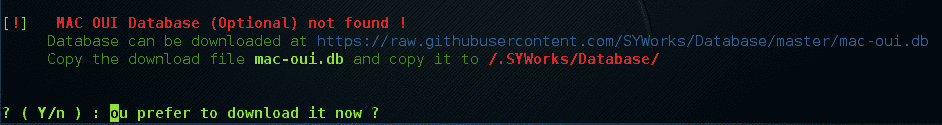

初始配置运行后，WAIDPS 将提供范围内的接入点和无线网络列表。此外，还有关于使用的加密类型以及身份验证机制的信息。另一个好的信息是压水堆或功率指示器。这表示特定接入点信号的强度。数字越接近零，信号越强。如果您的目标是特定的访问点，这将非常有用。如果信号弱于您所希望的，则表示您可能需要靠近实际接入点：

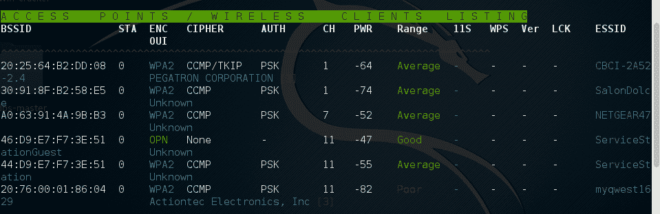

除了识别无线接入点外，WAIDPS 还能够扫描可能已启用无线但未与接入点关联的客户端。如果您需要伪造似乎来自合法客户端的 MAC 地址，则此信息可能非常有用：


# 无线测试工具

Kali Linux 附带了许多基于命令行和 GUI 的工具。可以利用这些工具将我们的网络接口转换为网络监视器，捕获流量，并反转身份验证密码。第一个工具 Aircrack ng 是一套工具。此外，我们还将研究其他一些命令行和 GUI 工具，这些工具涵盖了无线渗透测试中涉及的全部任务。

# 空勤人员

Aircrack ng 是一套允许渗透测试人员测试无线网络安全性的工具。该套件包括执行以下与无线渗透测试相关任务的工具：

*   **监控**：这些工具是专门为捕获流量以供后续分析而设计的。我们将更深入地了解 Aircrack ng 工具捕获无线流量的能力，我们可以在其他第三方软件（如 Wireshark）上使用这些工具进行检查。
*   **攻击**：这些工具可用于攻击目标网络。它们包括允许反认证攻击和重放攻击的工具，这些攻击利用了 Aircrack ng 执行数据包注入的能力，其中 Aircrack ng 实际上将数据包发送到无线数据流中，作为攻击的一部分发送到客户端和接入点。
*   **测试**：这些工具允许测试无线卡等硬件的无线功能。
*   **破解**：Aircrack ng 工具集还能够破解 WEP、WPA 和 WP2 中的无线预共享密钥。

除了命令行工具外，Aircrack ng 还用于许多基于 GUI 的工具中。有一个坚实的理解如何空气裂纹 NG 工作将提供一个坚实的基础，使用其他工具，我们将在本章稍后探讨。

# 预共享密钥破解

现在，我们将针对 WPA2 无线网络使用 Aircrack ng 工具套件。这个过程包括识别我们的目标网络，捕获四向握手，然后利用字列表强制执行密码，该密码与无线网络的 SSID 结合，是预共享密钥。通过破解密码，我们将能够对目标无线网络进行身份验证：

1.  确保已插入无线网卡，并且该网卡工作正常。为此，在命令行中输入以下命令：

```
    # iwconfig
```

该命令应输出类似于以下屏幕截图的内容。如果看不到无线接口，请确保已正确配置：


在这里，我们将我们的无线接口标识为`wlan0`。如果您有多个接口，也可以看到`wlan1`。确保在这些测试期间使用了正确的接口。

2.  我们将在 Aircrack ng 套件中使用的第一个工具是`airmon-ng`。此工具允许我们将无线网卡更改为监控模式。这很像将网络接口置于混杂模式。这使我们能够捕获比普通无线网卡更多的流量。要查找`airmon-ng`中可用的选项，请键入以下内容：

```
    # airmon-ng -h
```

这将产生以下结果：

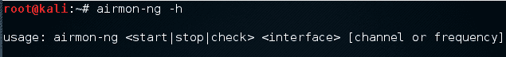

要将无线网卡更改为监视模式，请键入以下内容：

```
    # airmon-ng start wlan0
```

如果成功，我们将看到：


如果我们使用`iwconfig`再次检查接口，我们可以看到我们的接口也发生了变化：


有时，某些过程会干扰将无线网卡置于监视器模式。当您执行`airmon-ng start wlan0`命令时，您可能会看到以下消息：


在这种情况下，有三种可能的过程会在监视器模式下干扰无线网卡。在本例中，我们运行以下命令：

```
    # airmon-ng check kill

```


此时，发出以下命令将允许我们继续：

```
    # pkill dhclient
    #pkill wpa_supplicant

```

这会杀死可能干扰`airmon-ng`的进程。要重新启用这些过程，请在使用 Aircrack ng 工具完成后，在命令行中键入以下两个命令：

```
    # service networking start
    # service network-manager start 
```

如果仍然存在任何问题，可以重新启动 Kali Linux，这些服务将重新启用。

在下一步中，我们需要扫描目标网络。在上一节中，我们讨论了识别潜在目标网络所需的一些侦察。在本例中，我们将使用一个名为`airodump-ng`的工具来识别我们的目标网络，以及识别它正在使用的 BSSID 和它正在广播的频道。要访问`airodump-ng`的选项，请在命令提示符中键入以下内容：

```
    # airodump-ng -help
```

这将产生以下部分输出：


现在我们将使用`airodump-ng`命令来识别我们的目标网络。键入以下命令：

```
    # airodump-ng wlan0mon  
```

`airodump-ng`只要你让它跑，它就会跑。一旦看到目标网络，按*Ctrl*+*C*停止。您将看到以下输出。我们已经确定了我们将尝试以红色破解的网络：

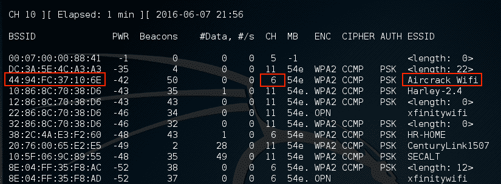

3.  上一步为我们确定了三条关键信息。首先，我们已经确定了我们的目标网络`Aircrack_Wifi`。其次，我们有 BSSID，它是目标网络的 MAC 地址`44:94:FC:37:10:6E`，最后是通道号`6`。下一步是捕获目标接入点之间的无线通信量。我们的目标是捕捉四向握手。要开始捕获流量，请在命令提示符中键入以下内容：

```
    # - airodump-ng wlan0mon -c 6 --bssid 44:94:FC:37:10:6E -w wificrack  
```

该命令告诉`airodump-ng`使用监视器接口捕获目标网络的 BSSID 和信道的流量。以下屏幕截图显示了命令的输出：

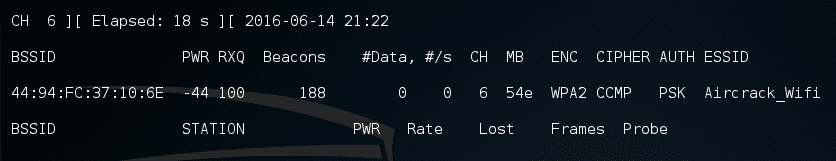

在命令运行时，我们希望确保捕获握手。如果客户端使用有效握手进行连接，则命令输出将显示握手已被捕获：

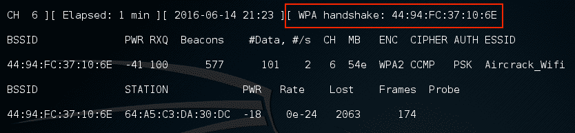

如果无法获得 WPA 握手，请查看是否有客户端访问网络。在这种情况下，我们看到一个连接到目标无线网络的站点，其 MAC 地址为`64:A5:C3:DA:30:DC`。由于此设备已通过身份验证，如果连接暂时丢失，它很可能会自动重新连接。在这种情况下，我们可以在命令行中键入以下命令：

```
    # aireplay-ng -0 3  -a 44:94:FC:37:10:6E - c 64:A5:C3:DA:30:DC  wlan0mon 
```

`aireplay-ng`命令允许我们将数据包注入通信流，并对客户端进行身份验证。然后，这将迫使客户端完成我们可以捕获的新 WPA 握手。

5.  抓拍握手后，按*Ctrl*+*C*停止`airodump-ng`。如果检查根文件夹，我们将看到从转储创建的四个文件：

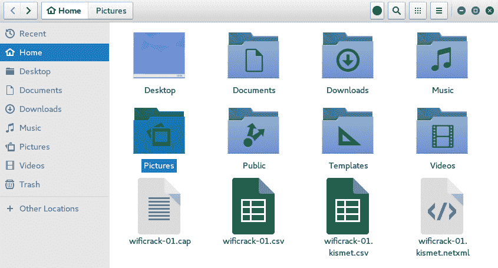

我们可以在 Wireshark 中检查`wificrack-01.cap`文件。如果我们深入到 EAPOL 协议，我们实际上可以看到我们捕获的四向握手：


进一步检查显示了特定的 WPA 关键时刻及其相关信息：

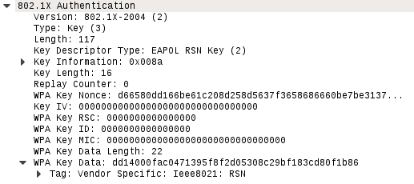

6.  我们有必要的信息试图破解 WPA 预共享密钥。为此，我们使用`aircrack-ng`工具。以下是`aircrack-ng`命令：

```
        #aircrack-ng -w rockyou.txt -b 44:94:FC:37:10:6E wificrack-01.cap

```

在前面的命令中，我们使用`-b`选项标识目标网络的 BSSID。然后我们指向捕获文件`wificrack-01.cap`。最后，我们使用单词列表的方式与破解密码文件的方式大致相同。在这种情况下，我们将使用`rockyou.txt`单词列表。命令设置完成后，点击*进入*按钮`aircrack-ng`开始工作：

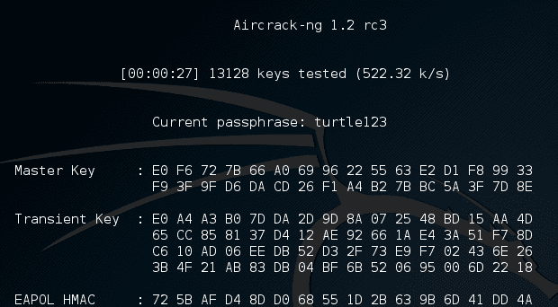

Aircrack ng 将使用`rockyou.txt`密码列表，并针对捕获文件尝试各种组合。如果预共享密钥中使用的`passcode`在文件中，`aircrack-ng`将产生以下消息：

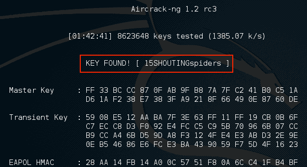

从前面的屏幕截图中，我们可以看到`passcode "15SHOUTINGspiders"`在我们用来暴力的`rockyou.txt`文件中。还请注意，这大约花费了一小时 42 分钟，最终尝试了总共 8623648 个不同的密码。这种技术可以在任何密码列表中尝试，就像我们在密码破解一章中讨论的那样。请记住，密码的长度可以是 8 到 63 个字符。可用的组合数量太多，无法尝试。不过，这种攻击对于易于记忆或简短的密码短语是成功的，这与破解密码的方式大致相同。

# WEP 开裂

WEP 裂解工艺与 WPA 裂解工艺非常相似。识别目标网络，捕获流量（包括身份验证机制），然后通过暴力攻击来反转密钥。但也有一些不同之处。与 WPA 破解相反，在 WPA 破解中，我们所要做的就是捕获四向握手，在 WEP 破解中，我们必须确保收集足够的**初始化向量**（**IVs**）来正确破解 WEP 密钥。尽管这似乎是一项艰巨的任务，但可以使用各种技术来强制执行此过程，并使嗅探流量所需的时间尽可能短：

1.  为了开始破解 WEP 的过程，我们以与 WPA 破解相同的方式将无线网卡置于监控模式。键入以下命令：

```
    # airmong-ng start wlan0
```

2.  我们尝试使用以下命令查找目标网络：

```
    # airodump-ng wlan0mon 
```

这将生成无线网络列表：

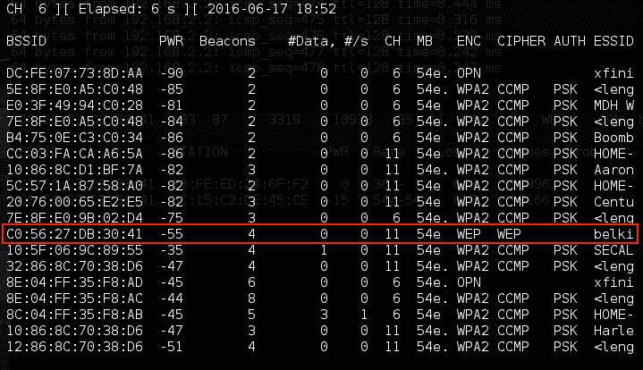

我们已经确定了一个运行 WEP 的目标网络，其 BSSID 为`C0:56:27:DB:30:41`。同样，我们需要注意这一点，以及接入点正在使用的信道，在本例中，信道`11`。

3.  在目标无线网络上捕获数据。在这里，我们将使用`airodump-ng`命令捕获此数据：

```
    # airodump-ng -c 11 -w belkincrack --bssid C0:56:27:DB:30:41

```

此命令将`airdump-ng`指向相应通道上的目标网络。此外，我们正在捕获写入`"belkincrack"`文件的流量。此命令生成以下输出：

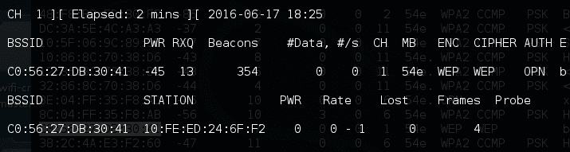

请注意，我们还没有看到任何数据在这个访问点上移动。这很重要，因为我们需要捕获包含 IVs 的数据包，以便破解 WEP 密钥。

4.  我们必须伪造目标网络的身份验证。本质上，我们正在使用一个名为`aireplay-ng`的 Aircrack ng 工具来告诉接入点我们拥有正确的 WEP 密钥，并准备进行身份验证。尽管我们没有正确的密钥，但以下命令允许我们伪造身份验证，并允许我们与 WEP 接入点通信：

```
      # aireplay-ng -1 0 -a C0:56:27:DB:30:41 wlan0mon
```

在前面的命令中，我们用`"-1"`、`"0"`作为重传时间、`"-a"`作为目标接入点的 BSSID，进行`aireplay-ng`假认证。该命令产生以下结果：

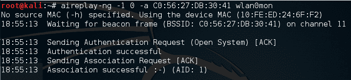

我们现在能够与 WEP 接入点进行通信。

5.  正如我们在步骤 3 中看到的，很少有数据通过访问点来回移动。我们需要捕获大量数据，以确保我们能够抓取这些 IVs 并强制碰撞。我们可以再次使用`aireplay-ng`增加接入点的数据量。在下面的命令中，我们将执行 ARP 请求重放攻击。在这次攻击中，我们将使用`aireplay-ng`将 ARP 请求重新传输到接入点。每次它这样做，就会产生一个新的 IV，增加我们迫使碰撞的机会。打开第二个命令提示符并键入以下内容：

```
      # aireplay-ng -3 -b C0:56:27:DB:30:41 wlan0mon
```

在前面的命令中，`"-3"`告知`aireplay-ng`在特定接口`"wlanomon"`上对以下网络`"-b"`进行 ARP 请求重放攻击。命令运行后，您需要通过 ping 同一网络上的另一台主机来强制执行 ARP 请求。这将强制 ARP 请求。一旦启动，您将看到以下输出：


如果我们返回到第一个命令提示符，`airodump-ng`正在运行，我们会看到数据速率开始增加。在这种情况下，超过 16000 个 IVs：

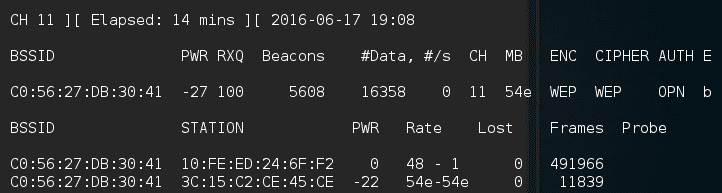

6.  打开第三个终端。在这里，我们将开始 WEP 破解。这可以在`airodump-ng`命令捕获 IVs 时运行。要启动该过程，请键入以下命令：

```
    # aircrack-ng belkincrack-01.cap

```

在这里，我们只是将`aircrack-ng`指向正在运行的捕获文件。`aircrack-ng`立即开始工作，如截图所示：

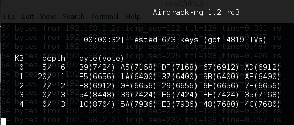

`aircrack-ng`可能表示没有足够的静脉注射，当有足够的静脉注射时会再次尝试。正如我们在下面的屏幕截图中看到的，`aircrack-ng`能够确定 WEP 密钥。总共有 15277 个 IV 被捕获，用于裂解。此外，在不到三分钟的时间内测试了`73253`键：

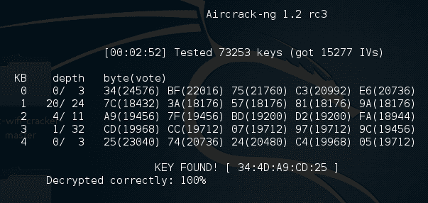

正如我们在这次攻击中所看到的，通过适当的无线通信量和`aircrack-ng`工具套件，我们能够确定允许我们对网络进行身份验证的 WEP 密钥。正是这种攻击的易用性使 WEP 身份验证转变为 WPA 身份验证。虽然由于这次攻击，WEP 网络在野外变得越来越稀少，但您仍然可能看起来有些脆弱。如果您确实遇到了这些漏洞，这种攻击非常适合向客户展示存在的重大安全漏洞。

# 小精灵

PixieWPS 是一种离线暴力强制工具，用于反转 WPS 无线接入点的 PIN。PixieWPS 的名字来源于 Dominique Bongard 发现的 Pixie 尘埃攻击。此漏洞允许野蛮强制 WPS PIN。（有关此漏洞的更多详细信息，请参阅 Bongard 的演示：[https://passwordscon.org/wp-content/uploads/2014/08/Dominique_Bongard.pdf](https://passwordscon.org/wp-content/uploads/2014/08/Dominique_Bongard.pdf)

要访问 PixieWPS，请在命令提示符中键入以下命令：

```
    # pixiewps
```

该命令将为您提供不同的命令选项。为了使 PixieWPS 正常工作，必须获得大量信息。这包括：

*   加入者公钥
*   注册人公钥
*   加入者哈希-1
*   加入者哈希-2
*   身份验证会话密钥
*   报名者暂时

由于需要所有这些组件，PixieWPS 通常作为另一个工具（如 Wifite）的一部分运行。

# 威菲特

Wifite 是一个自动化的无线渗透测试工具，利用与 Aircrack ng 和 Reaver 及 PixieWPS 命令行工具相关的工具。

这使 Wifite 能够捕获流量并反转 WEP、WPA 和 WPS 类型无线网络的身份验证凭据。导航到应用|无线攻击| Wifite 或通过命令行启动 Wifite：

```
    # wifite
```

其中一个将带您进入初始屏幕：


Wifite 将自动将无线网卡置于监控模式，然后开始扫描无线网络：

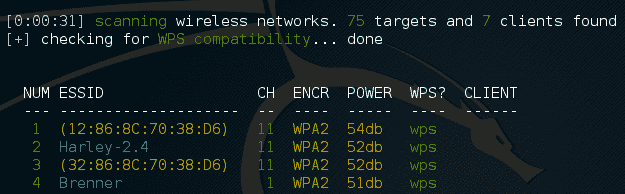

一旦在列表中看到目标网络，在本例中为 ESSID 或广播 SSID Brenner，点击*Ctrl*+*C*。此时，系统将提示您输入单个数字或测试范围。在这种情况下，我们输入数字`4`并点击*输入*：


Wifite 通过捕获必要的信息自动启动 WPS Pixie 攻击。如果成功，将显示以下内容：

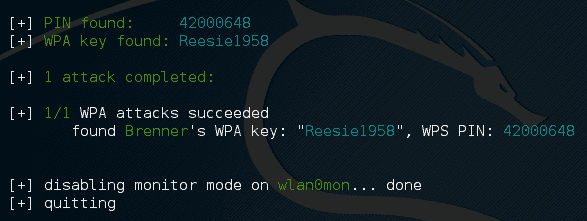

如果存在 WPS 漏洞，就像这里的无线网络一样，Wifite 能够确定 WPA 密钥和 PIN。

# 蕨类 Wifi 饼干

Fern Wifi Cracker 是一个基于 GU 的工具，用 Python 编写，用于测试无线网络的安全性。目前有两个受支持的版本：一个付费的专业版，功能更多；一个免费版，功能有限。Kali Linux 附带的版本需要`aircrack-ng`和其他无线工具才能正常工作。

要启动 Fern，您可以导航到应用|无线攻击| Fern Wifi Cracker，或在命令提示符中键入以下内容：

```
    # fern-wifi-cracker
```

以下屏幕截图是加载的初始页面：

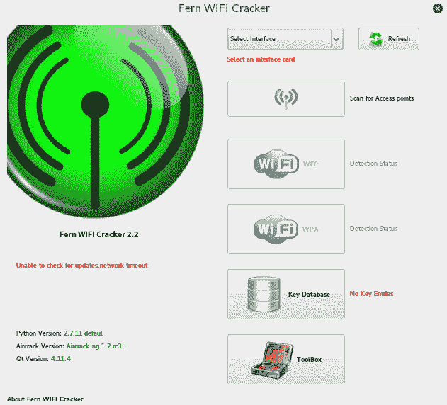

我们将使用 Fern Wifi Cracker 攻击同一无线网络 Aircrack Wifi，利用 GUI，而不是在攻击中使用命令行：

1.  选择界面。单击选择界面下拉菜单。在这种情况下，我们将选择 wlan0。Fern 将自动将我们的界面置于监控模式：


2.  单击“扫描访问点”按钮。Fern 将自动扫描天线范围内的无线网络。扫描完成后，Wifi WEP 和 Wifi WPA 按钮将从灰色变为彩色，表示已检测到使用这些安全设置的无线接入点：

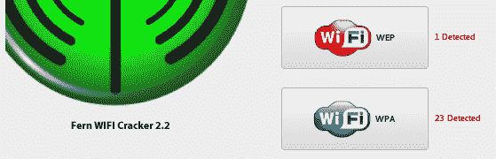

2.  Clicking on the Wifi WPA button displays an attack panel, which contains a graphical representation of the WPA wireless access points that we can attack. In this case, we will select the button for Aircrack_Wifi:

    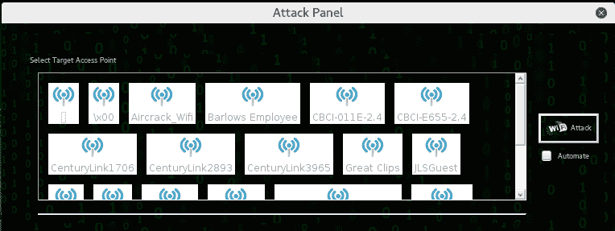

3.  This screen provides details about the selected access point. In addition, Fern Wifi Cracker allows for a WPA attack or a WPS attack. In this case, we will stay with a WPA attack:

    

4.  Set the passcode file that Fern Wifi-Cracker will use to reverse the passcode. In this case, we have crafted a special Wi-Fi passcode list and point Fern Wifi-Cracker to that text file:

    

5.  单击 Wifi 攻击按钮。Fern Wifi Cracker 完成了我们之前在 Aircrack ng 部分中介绍的整个过程。这包括对客户端进行身份验证，然后捕获四向握手。最后，Fern Wifi Cracker 将在密码文件中移动，如果密码在该文件中，将显示以下消息：


Fern Wifi Cracker 负责破解 Wi-Fi 网络和接入点方面的后端工作。虽然使用此工具似乎更容易，但最好对 Aircrack ng 的工作原理有一个坚实的了解。Fern Wifi Cracker 和其他基于 GUI 的 Wi-Fi 破解程序基于 Aircrack ng，对该工具集有深入的了解可以让您充分了解此类程序的幕后情况。

# 邪恶双生攻击

进入任何一个大城市或公司环境，都不可能找不到 Wi-Fi 信号。其中许多，特别是在公共场所，Wi-Fi 点不需要身份验证，而其他点则为您提供了一个专属门户，可能只需要您接受某些条款和条件，或者要求您使用电子邮件或 Facebook 帐户等登录。

邪恶孪生攻击，也称为流氓接入点或假接入点，是一种未经所有者知情或同意而伪装为合法接入点的接入点。连接到合法接入点的最终用户将连接到假接入点，因为它通常是更强的信号。

设置伪点的攻击者现在将能够捕获受密码保护的 SSID 的实际密码，从而为中间人攻击和其他攻击奠定基础。

我们需要包括机组套件和`dnsmasq`。dnsmasq 是一个小型、轻量级的工具，可作为一个易于配置的 DNS 转发器和 DHCP 服务器。根据你想要使用的攻击向量，你需要一些额外的工具，比如 AutoT1 和 Ty2 T2：

1.  确认您拥有这些工具。我们知道 Aircrack 工具和 Apache2 已预装在 Kali 上。在终端中，输入`apt-get install dnsmasq`。如果它已经安装好了，你将无事可做；否则，系统将提示您确认安装。

2.  通过使用`airmon-ng start <interface>`将其中一个无线适配器置于监视模式，然后启动`airodump-ng <interface>`以开始列出当前正在广播的所有网络，从而确定您的目标网络：


3.  您可能会看到与屏幕截图中类似的错误。在大多数情况下，这些都可以安全地忽略。如果您遇到问题，请使用`kill <PID>`结束流程。例如，我会使用 kill`610`来结束`NetworkManager`过程：

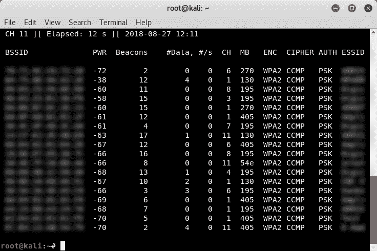

注意目标网络的 BSSID（MAC 地址）、ESSID（广播名称、SSID）和信道。

4.  为`dnsmasq`设置一个要使用的配置文件。我使用`mkdir tmp`在我的主目录中创建了一个名为`tmp`的文件夹。更改了目录，然后在终端输入了`touch dnsmasq.conf`。这将创建一个名为`dnsmasq`的文件。键入`nano dnsmasq.conf`将在`cli`nano 文本编辑器中打开`dnsmasq.conf`文件。输入以下行：

```
interface=<at0>
dhcp-range=10.0.0.10,10.0.0.250,12h
dhcp-option=3,10.0.0.1
dhcp-option=6,10.0.0.1
server=8.8.8.8
log-queries
log-dhcp
listen-address=127.0.0.1
```

在`dnsmasq.conf`文件中，我们只指定了接口（`at0`）、要使用的`dhcp`范围（`10.0.0.10 - 10.0.0.250`、`12h`租赁时间）、`dhcp-option=3`作为网关（`10.0.0.1`），以及`dhcp-option=3`作为 DNS 服务器（`10.0.0.1`）。为什么界面是`at0`？这是因为`airbase-ng`创建了一个名为`at0`的默认桥接接口。

使用*Ctrl*+*O*、*Y*保存您在 nano 中的更改，并使用*Ctrl*+*X*退出。

5.  设置`airbase-ng`。这将创建我们的接入点。使用`airbase-ng -e <ESSID> -c <channel> <monitor interface>`进行设置。我的目标`ESSID`设置为`ARRIS-4BE2`，通道设置为`11`，监控界面为`wlan0mon`：


6.  启用`at0`接口，使用`iptables`位，启用/禁用流量通过。您可以一个接一个地执行这些操作，如图所示。

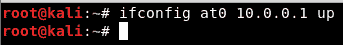


使用`dnsmasq -C <config file> -d`启动`dnsmasq`：

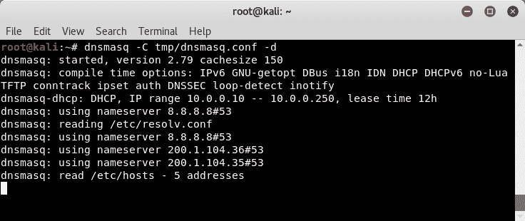

7.  您可以阻止流量通过并捕获如前所示的 IVS（使用`echo 0 > /proc/sys/net/ipv4/ip_forward`），或者您可以向用户提供一个捕获门户，或者只允许流量通过（使用`echo 1 > /proc/sys/net/ipv4/ip_forward`）重定向特定目标站点以设置 MitM 攻击。

在这里，我们可以将其分为几个方向。我们可以继续并建立一个成熟的邪恶孪生兄弟（Rogue AP）来捕获网络密码，或者我们可以建立中间人攻击，通过合并其他工具（如`dsniff`工具套件或`sslstrip`来嗅探和捕获连接到我们无线信号的任何客户端的流量，或者结合**浏览器攻击框架**（**牛肉**）通过劫持用户浏览器直接攻击客户端。

# 后开裂

如果您成功获取了 WPA 或 WEP 密钥，您现在就可以通过网络进行身份验证。一旦进入无线网络，您就拥有了我们在本书中讨论过的相同范围的工具。这是因为一旦正确验证，您的 Kali Linux 安装就只是**局域网**（**局域网**）的一部分，就像我们通过网线连接一样。因此，我们能够扫描其他设备、利用漏洞、利用系统漏洞并提升我们的凭据。

# MAC 欺骗

在展示无线网络上的其他漏洞时，我们可以探索一些有用的技术。其中一个问题是绕过一个称为 MAC 过滤的公共无线控制。MAC 过滤是某些路由器上的一种控制，仅允许特定的 MAC 地址或 MAC 类型。例如，您可能正在测试使用 iPad 的商业场所。无线网络只允许 MAC 地址具有前三个十六进制字符`34:12:98`。其他组织可能有一组允许加入的 MAC 地址列表。

如果您能够泄露 WPA 密钥，但发现您无法加入网络，则目标组织可能正在利用某种形式的 MAC 地址过滤。为了绕过这个问题，我们将使用 Macchanger 命令行工具。这个简单的命令允许我们将 MAC 地址更改为允许我们连接的地址。首先，您可以很容易地从以前的侦察和破解尝试中找到新的 MAC 地址。Airodump ng 工具将识别连接到无线网络的客户端。此外，使用 Wireshark 通过捕获文件进行解析将允许您识别潜在的有效 MAC 地址。

对于本例，我们已经识别了一个连接到目标无线网络的无线客户端，其 MAC 地址为`34:12:98:B5:7E:D4`。要将我们的 MAC 地址更改为合法的 MAC 地址，只需在命令行中键入以下内容：

```
    # macchanger -mac=34:12:98:B5:7E:D4 wlan0
```

该命令生成以下输出：


此外，如果我们运行`ifconfig wlan0`命令，我们可以看到我们伪造的 MAC 地址：


我们现在能够绕过接入点上发生的任何 MAC 过滤。现在可以连接到无线网络。就像我们能够妥协的任何系统一样，设置持久性是另一个关键步骤。这给了我们一定程度的把握，如果我们失去连接，我们将能够再次访问该系统。

# 坚持不懈

一旦我们有了一种有效的方法来验证无线网络并能够连接，下一步就是设置持久性。其中一个重点领域是无线路由器。大多数无线路由器都有基于 web 的控制台或其他控制台，合法管理员可以在其中登录和管理路由器。通常，这些路由器位于我们所连接的无线局域网子网的起始位置。例如，如果我们连接到`Wifi_Crack`并运行`ifconfig wlan0`命令，它会将我们标识为具有`10.0.0.7`的 IP 地址。

如果我们通过 Iceweasel 浏览器导航到[`http://10.0.0.1`](http://10.0.0.1)，我们将进入此页面。您还可以在终端中键入`route -n`，这将为您提供默认网关：


如果我们在没有密码的情况下输入`admin`用户名，然后单击“确定”，我们将得到以下结果：

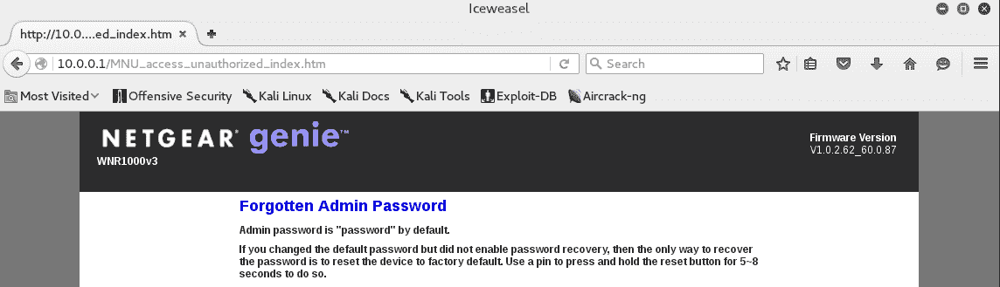

我们看到的是管理员帐户的默认密码。虽然不常见，但此网络的系统管理员保留无线路由器的默认凭据的可能性也不在范围之外。如果我们没有收到此错误消息，则 internet 上有大量的资源，用于聚合各种路由器、交换机和无线接入点的默认管理员帐户。

一个这样的站点是[http://www.routerpasswords.com/](http://www.routerpasswords.com/) 。如果这不起作用，下一个选项是使用我们前面介绍的技术强制登录。

如果我们能够破坏管理员帐户并获得对管理设置的访问权限，请注意允许您再次登录的信息，例如 WPS PIN:


管理员可以更改无线接入点 WPA 密码，但通常会保留 WPS PIN。此外，您还应检查是否能够访问 MAC 地址过滤控件：


从这里，您可以输入几个 MAC 地址，以便将来使用。

# 嗅探无线通信

在研究嗅探无线通信的技术时，有两种技术可用。第一种是在经过身份验证并连接到目标 WLAN 时嗅探 WLAN 流量。在这种情况下，有能力利用中间人攻击和诸如 Ettercap 之类的工具，强制网络流量通过我们的测试机器。

第二种技术是嗅探我们可以从特定无线网络获得的所有无线通信量，并使用 WPA 或 WEP 密码对其进行解密。如果我们试图通过不连接 WLAN 来限制占地面积，这可能是必要的。通过被动地嗅探流量并稍后解密，我们减少了被检测到的机会。

# 嗅探 WLAN 流量

就像在有线局域网中，在无线局域网上，我们有能力嗅探网络流量。以下嗅探技术要求您已通过测试无线网络的正确身份验证，并已从路由器接收到有效的 IP 地址。这种类型的嗅探将利用 eTerCap 工具进行 ARP 中毒攻击并嗅出凭据：

1.  Start Ettercap by going to Applications | Sniffing and Spoofing | Ettercap-gui or by entering `ettercap-gui` into command prompt. Navigate to Sniff and click on Unified Sniffing. Once there, you will be given a drop-down list of network interfaces. Choose your wireless interface, in our case, WLAN0:

    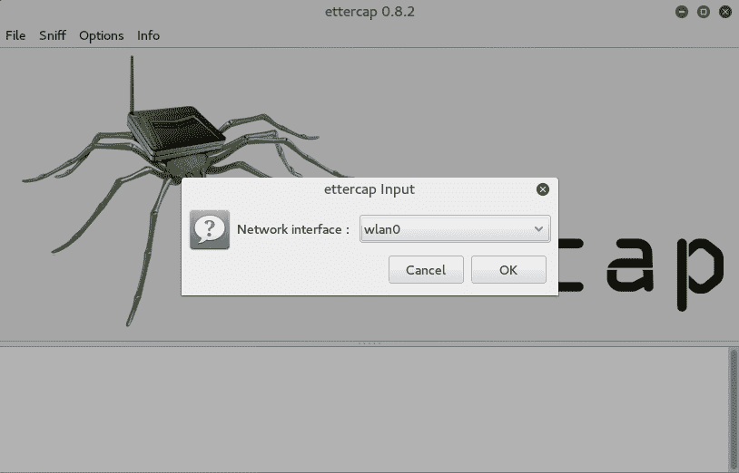

2.  单击主机，然后单击主机扫描。扫描完成后，点击主机列表。如果它是一个活跃的无线网络，你应该在那里看到一些主机。

3.  Click on MiTM and then ARP Poisoning. On the next screen, choose one IP address and click on Target 1, and then a second IP address and click on Target 2:

    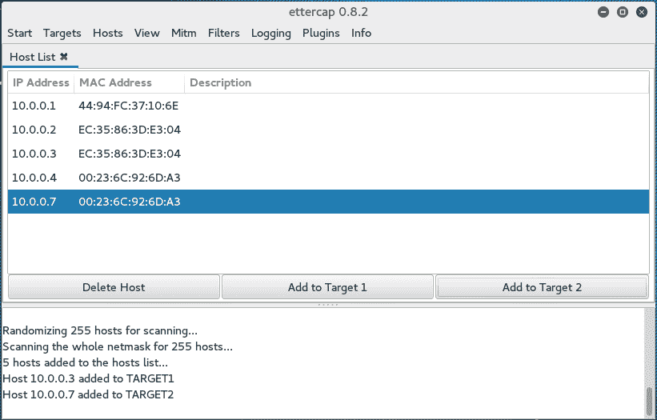

4.  Click on the Sniff Remote Connections radio button and click OK:

    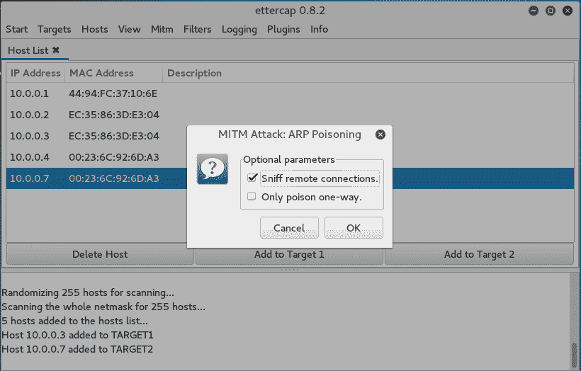

这将启动 ARP 中毒攻击，我们将能够看到我们选择的两台主机之间的所有流量。

5.  开始捕捉线鲨。当您进入第一个屏幕时，请确保选择无线接口，在本例中为 WLAN0:


当您检查流量时，我们可以看到许多类型的流量被捕获。最值得注意的是我们两台主机之间已打开的 Telnet 会话：

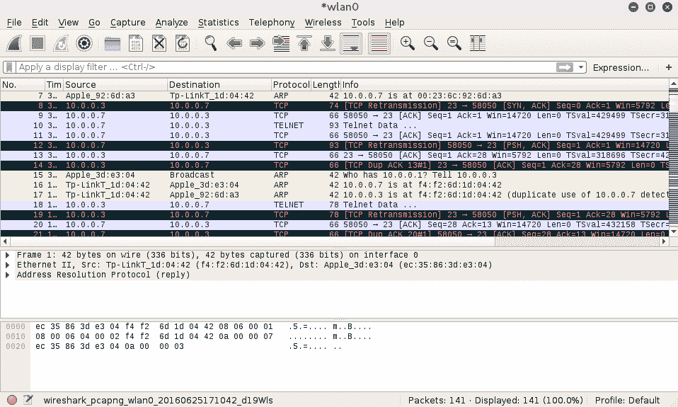

如果我们右键单击 Telnet 会话并选择 Follow TCP Stream，我们可以看到 Metasploitable 实例的凭据，该实例具有明文形式的 Telnet 凭据：

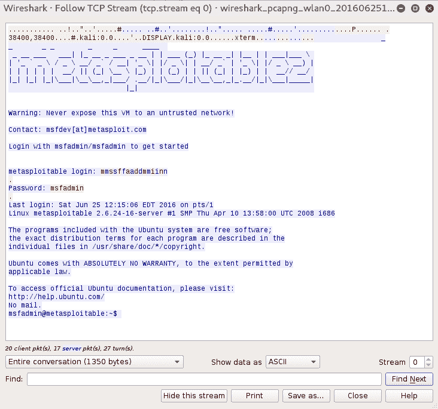

# 被动嗅探

在被动嗅探中，我们没有通过网络的身份验证。如果我们怀疑有可能向恶意主机检测等入侵预防控制发出警报，这是避免这些控制的一个好方法，同时仍然可以获取潜在的机密信息：

1.  被动扫描目标网络上的无线通信量。确保您的无线网卡处于监控模式：

```
    # airmon-ng start wlan0  
```

2.  使用`airodump-ng`工具嗅探网络流量，与我们在 WPA 破解部分所做的相同：

```
    # airodump-ng wlan0mon -c 6 --bssid 44:94:FC:37:10:6E -w wificrack
```

3.  只要您想，就可以运行该工具。为了确保能够解密流量，我们需要确保捕获完整的四路握手（如果是 WPA 网络）。一旦我们获得足够的流量，点击*Ctrl*+*C*。
4.  Navigate to the folder with the capture file and double-click. This should automatically open the capture in Wireshark:

    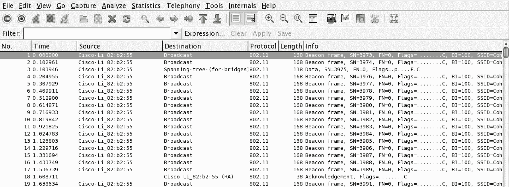

捕获是加密的，所有可见的都是一些`802.11`数据包。

5.  在 Wireshark 中，导航到“编辑”，然后导航到“首选项”。新的弓将打开；单击协议旁边的三角形，然后单击 802.11。应打开以下窗口：


6.  点击编辑。这将使您进入一个屏幕，输入 WEP 或 WPA 解密密钥。点击新建。在“密钥类型”下，输入`WPA`，然后输入密码和 SSID。在这种情况下，它将是`Induction:Coherer`。单击应用并确定：


7.  要将此解密密钥应用于我们的捕获，请导航至查看，然后向下导航至无线工具栏。启用无线工具栏。在主屏幕中，您将看到以下内容：

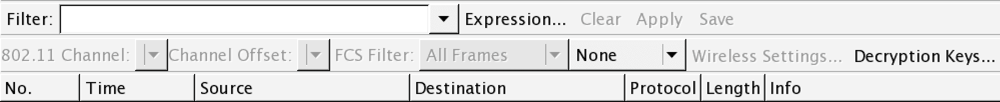

8.  在无线工具栏上，单击解密密钥。将出现一个框。在左上角的下拉菜单中，选择 Wireshark 作为解密模式。确保选择了适用的密钥。单击应用并确定：

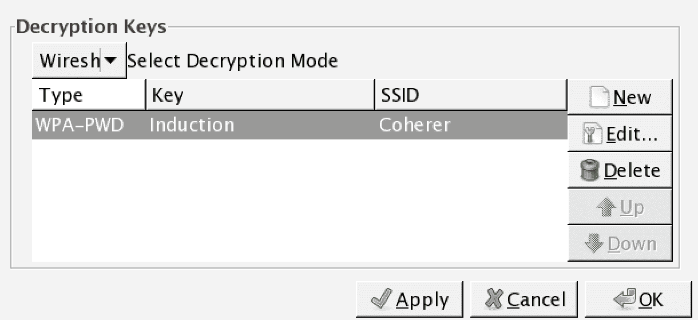

9.  Wireshark 将解密密钥应用于捕获，并且在适用的情况下，能够解密流量：


正如前面的屏幕截图所示，可以解密我们捕获的流量，而无需加入网络。需要重申的是，这种技术需要为捕获的每个会话进行完整的四向握手。

# 总结

无线网络的使用遍及所有组织。与我们迄今为止探索的任何系统一样，无线网络也存在漏洞。Kali Linux 提供的工具可以利用这些漏洞，如流量加密或身份验证方法。渗透测试人员通过演示这些漏洞及其相关漏洞，使使用这些类型网络的人员能够清楚地了解他们需要采取什么措施来保护自己免受攻击。随着世界进入一个越来越无线的世界，智能手机、笔记本电脑和物联网，无线网络及其安全控制不断接受测试至关重要。

在下一章中，我们将讨论无线网络作为更大的渗透测试方法的一部分：在移动设备笔测试平台上使用 Kali Linux 的 Nethunter。我们将看到一些技术以一种新的方式呈现，使用灵活的渗透测试工具。