# 二、磨锯子

一个工匠只有在他的工具和工具需要设置和维护时才是好的。既然您对安装什么样的 Kali Linux 发行版感兴趣，本章将帮助您设置和配置平台的个人版本。Kali Linux 是多功能的，可以在多个用例中使用。

当您第一次决定使用 Kali Linux 时，您可能没有考虑过各种常见和不常见的用法。本章向您介绍最适合您的 Windows 渗透测试要求的 ups、我们用于确保测试结果准备就绪并正确呈现的文档工具，以及操作这些工具所需的 Linux 服务的详细信息。许多书，包括沃尔夫·霍尔顿（Wolf Halton）写的第一本关于渗透测试的书，都按照卡利安全桌面上的子菜单顺序设置了章节。我们发现这不太直观。我们将所有的设置放在一开始，以减少首次使用 Kali 的用户的困惑，因为在开始使用其他工具之前，必须了解一些事情，例如文档工具。本章标题为*磨锯子*的原因是因为一个贫穷的工人，或者一个没有经验的黑客，责备他的工具，一个熟练的工匠花更多的时间准备工具，所以他们的工作进行得更快。

在 Kali Gnome3 桌面菜单中，有一个子菜单称为**收藏夹**，在您第一次运行时，这些工具将是 Kali Linux 的创建者认为是工作安全分析师需要了解的最不可或缺的工具。在本章中，在安装和设置之后，我们将向您展示我们最常用的工具。这些可能会成为你的最爱。以下屏幕截图显示默认情况下的收藏夹菜单。默认值如下所示：

*   **Firefox ESR**：网络浏览器
*   **终端**：Bash 终端仿真器
*   **文件**：类似于 Windows Explorer.exe 的文件管理器
*   **metasploit 框架**：开发框架的金标准
*   **armitage**：metasploit 的 GUI 前端
*   **burpsuite**：一种 web 应用攻击代理
*   **牛肉 xss 框架**：跨站点脚本工具
*   **法拉第 IDE**：一个多用户笔测试环境，支持超过 70 种工具，包括 Metasploit、Burpsuite、Terminal 等
*   **Leafpad**：文本编辑应用


Kali Linux 上的许多系统服务与 Ubuntu 和其他基于 Debian 平台的 Linux 服务器上的系统服务相同，但由于有些安全工具使用客户机/服务器模式，因此有些服务需要提前启动服务器才能成功运行测试。

我们将在本章学习以下主题

*   将 Kali Linux 安装到加密 USB 驱动器
*   从实时 DVD 运行 Kali
*   安装和配置应用程序
*   设置和配置 OpenVAS
*   报告测试
*   在 Kali Linux 上运行服务

# 技术要求

*   您选择的 Kali 发行版（Gnome、KDE、LXDE 或 MATE）
*   至少 16 GB 大小的空白 USB 驱动器。
*   具有手动启动选项的笔记本电脑或工作站

# 将 Kali Linux 安装到加密 USB 驱动器

作为一名安全工程师，安全的网络环境（如大多数拥有 IT 部门的组织中的网络环境）给您带来了一些挑战。该公司可能有一份特定的批准申请清单。防病毒应用程序通常从中心位置进行管理。安全工具被错误地归类为邪恶的黑客工具或恶意软件包。许多公司都有防御性规定，禁止在公司计算硬件上安装任何非 Microsoft Windows 的操作系统。

为了增加挑战，它们禁止公司网络上的非公司资产。您将发现的主要问题是，为 Windows 编写的经济型渗透测试工具非常少，而少数具有 Windows 版本的工具，如**Metasploit**，往往会与较低级别的操作系统功能发生冲突。由于大多数公司的笔记本电脑必须在系统上运行防病毒软件，因此您必须在 Metasploit 的目录上执行一些严重的异常巫毒。反病毒软件将隔离 Metasploit 附带的所有病毒和工具。此外，本地入侵保护软件和本地防火墙规则也会导致问题。这些操作系统功能和安全附加组件旨在防止黑客攻击，而这正是您准备要做的。

**支付卡行业数字安全标准**（PCI DSS 3.2.1）要求处理支付数据的任何 Windows 计算机或与处理支付数据的任何计算机在网络上的任何计算机都应进行修补，运行防火墙，并在其上安装防病毒软件。此外，许多公司的 IT 安全政策规定，任何最终用户都不能在不受惩罚的情况下禁用防病毒保护。

使用 Windows 机器作为渗透测试机器的另一个问题是，您可能会不时进行外部测试。为了进行适当的外部测试，测试机必须在公共互联网上。在关闭所有安全应用程序的情况下，将 Windows 计算机挂在公共网络上是不明智的。这样的配置可能会在上网 20 分钟内被蠕虫感染。

那么答案是什么？加载 Kali Linux 的加密可引导 USB 驱动器。在 Kali 的安装屏幕上，可以选择使用所谓的**持久性**将 Kali 安装到 USB 驱动器。这使您能够安装到 USB 驱动器，并能够将文件保存到 USB，但驱动器未加密。通过在 Linux 机器上安装 USB 驱动器，您的文件就可以在那里获取。这对于试用 Kali 来说很好，但您不希望真正的测试数据在 USB 驱动器上四处浮动。通过在 USB 驱动器上正常完整安装 Kali，可以在磁盘上使用完整的磁盘加密。如果 USB 被破坏或丢失，数据仍然是安全的。

在本章中，我们将把 Kali 安装到 64 GB 的 USB 磁盘上。您可以使用较小的网络，但请记住，您将从测试中收集数据，即使在小型网络上，这也可能会产生大量数据。我们几乎每天都进行测试，所以我们使用了 1 TB USB 3.0 驱动器。对于大多数测试来说，64 GB 的驱动器是一个很好的尺寸。

# 安装的先决条件

在本章中，您需要一个 64 GB 的 thumb 驱动器、一个烧录成 DVD 的 Kali 副本以及一台开机时具有 DVD 播放机和 USB 功能的机器。您可以在[下载 Kalihttps://www.kali.org/downloads/](https://www.kali.org/downloads/) 并查找链接以下载您想要的版本。以下屏幕截图显示了部分下载页面：

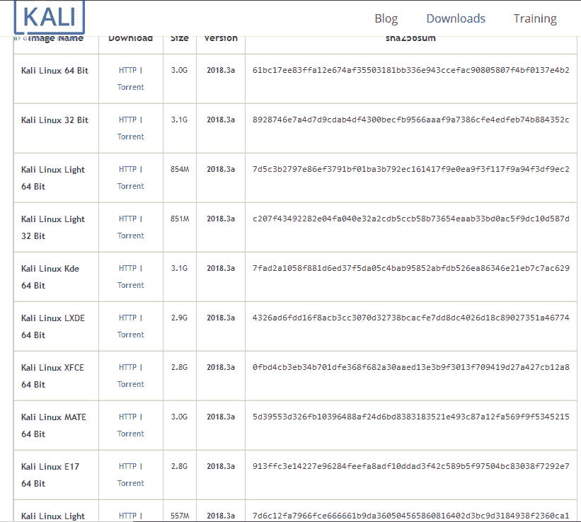

由于我们在[第 1 章](01.html)*选择您的发行版*中向您展示了几种 Kali 发行版，下面的屏幕截图显示了当您一次下载所有可用的 Kali Linux ISO 文件时发生的情况。


# 启动

准备好后，将 DVD 和 USB 驱动器插入机器。

确保在机器通电之前插入 USB*。您希望机器在引导时看到 USB，以便安装程序在安装过程中看到它。*

现在接通机器电源，您将看到以下屏幕。从菜单中选择图形安装。


如果您使用通过在第六行选择 Install 命令找到的文本安装程序，则此安装也将起作用。

# 配置安装

如果您曾经安装过 Linux 的任何发行版，那么安装的第一部分应该非常熟悉。您将看到一系列用于设置国家、语言和键盘的屏幕。根据您选择的区域设置和语言进行设置。通常，安装程序会发现键盘，您可以单击所选的键盘。美国的默认选项是美国标准英语和美国标准键盘映射。进行适当的更改，然后单击每个页面上的“继续”按钮。

在这些配置之后，您将获得如下窗口，以提供一个**主机名**。给它一个独特的名称，而不是默认名称。这将有助于以后使用保存的数据和屏幕截图。如果有几个人在使用 Kali，并且所有的机器都被命名为 Kali，那么可能会混淆数据的确切来源。


下一个屏幕截图要求输入域名。使用您或您的公司控制的真实域名。不要使用虚假域名，如`.local`或`.localdomain`。如果你在互联网上做生意，或者是一名学生，想成为一名安全专业人士，请使用合适的域名。这使得跟踪路由和跟踪数据包更容易。域名很便宜。如果域名属于你的雇主，而你不能只使用他们的域名，请申请一个子域名，如`testing.mycompany.com`。


在下一个窗口中，将要求您提供根密码。给这个一个*强*密码。密码越长越复杂越好。请记住，经过几次测试后，网络密钥将在此设备上。与大多数计算机操作不同，在渗透测试期间，您将使用根帐户，而不是普通用户帐户。您需要能够打开和关闭端口，并完全控制网络堆栈。

标准的 Kali 安装不会为您提供添加标准用户的机会。如果您在笔记本电脑上安装 Kali，并将此笔记本电脑用于测试以外的其他用途，请创建一个标准用户并授予其`sudoer`权限。你永远不想养成使用你的`root`账户浏览万维网和发送电子邮件的习惯。

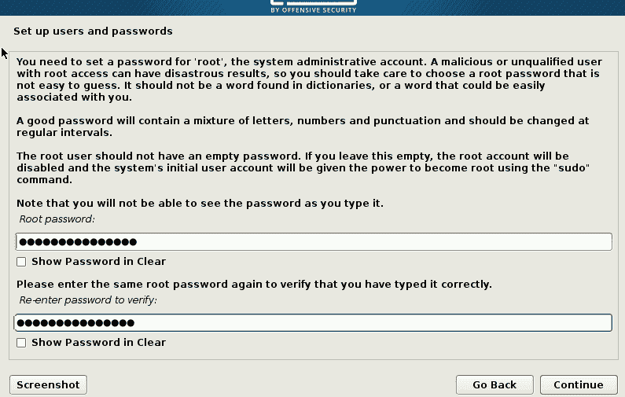

接下来，您将被要求选择您的时区。通过图形地图上的位置或下拉菜单进行设置，或选择 UTC 偏移量。Kali Linux 上的许多工具都会输出时间戳，这些都是法律证据，证明你做到了你所说的，当你说你做到了的时候。

# 设置驱动器

下一步是设置驱动器，对其进行加密，并对驱动器进行分区。下一个对话框将要求您为此安装选择一种分区类型。

1.  拾取引导-使用整个磁盘并设置加密 LVM。这将完全加密整个驱动器，而不仅仅是加密`/home`目录。


在下一个窗口中，将要求您选择一个要安装 Kali Linux 的磁盘。

警告请小心选择 USB 磁盘，而不是本地驱动器。如果您选择本地驱动器，您将从该驱动器擦除操作系统。注意：在下面的窗口中，您可以看到 USB 驱动器和 VMware 虚拟磁盘。虚拟磁盘是用于此演示的虚拟机的硬盘驱动器。

2.  选择 USB 磁盘并单击“继续”。

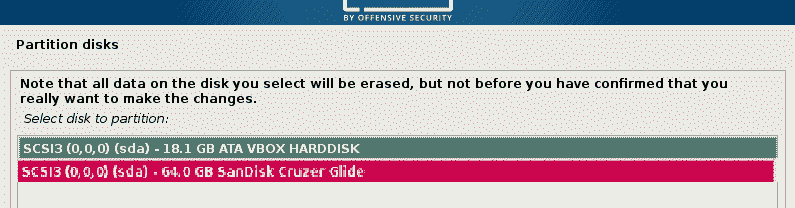

3.  在下一个窗口中，将询问您如何对驱动器进行分区。选择默认值并单击“继续”。

接下来，将要求您保存分区信息，这将启动分区过程。

单击“继续”时，您要安装的磁盘上的所有数据都将丢失。单击是，然后继续。

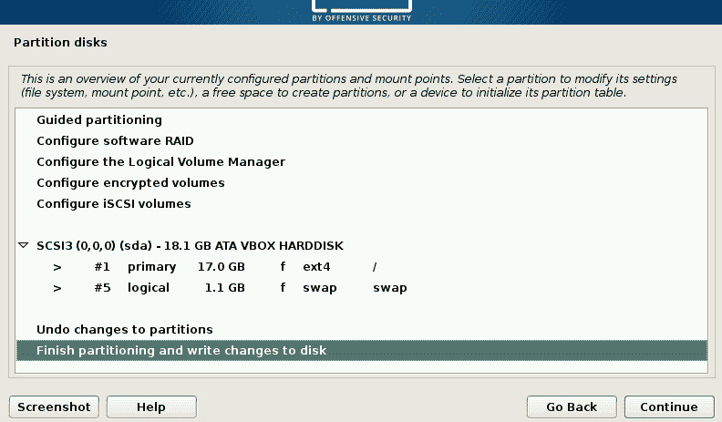

这将启动磁盘加密和分区过程。首先，驱动器被完全擦除和加密。这需要一段时间。喝杯咖啡，或者到外面散散步更好。1 TB 的驱动器加密大约需要 30 小时。64 GB 驱动器大约需要 30 分钟。

在下一个窗口中，将要求您为驱动器加密创建密码短语。您将在启动 Kali 时使用此密码短语。注意术语**密码短语**。

用一些长而容易记住的词：一首歌、一首诗或一段引语中的一句话！时间越长越好！*玛丽养了一只小羊羔，然后步行到镇上*。即使这个短语中没有数字，开膛手约翰也要花一个多月的时间才能破解。

接下来，将要求您确认这些更改。点击**完成分区并将更改写入磁盘**，然后点击**继续**。

现在，系统将启动分区过程。


分区过程完成后，系统安装将开始。USB 是一种速度较慢的协议，甚至与 ATA 硬盘驱动器相比，所以现在可能是热茶的时候了。


接下来，将询问您是否要使用网络镜像。点击**是**按钮！这将选择靠近您所在位置的存储库镜像，并有助于在以后更新系统时加快更新速度。

您的安装过程现在将完成，系统将要求您重新启动系统。请确保在重新启动前卸下安装盘。

# 启动新安装的 Kali

现在我们准备点燃卡利。将您的 Kali USB 驱动器插入您的机器并接通电源。在启动过程开始时，您将能够手动选择启动驱动器。具体的击键方式因机器类型和品牌而异。无论您的机器使用什么过程，您都会得到一个可用驱动器的菜单来引导。选择 USB 驱动器并继续。当系统启动时，您将看到一个屏幕，询问您的密码短语。这是您在安装过程中选择的密码短语。这不是根登录密码。输入密码短语并点击*回车*键。

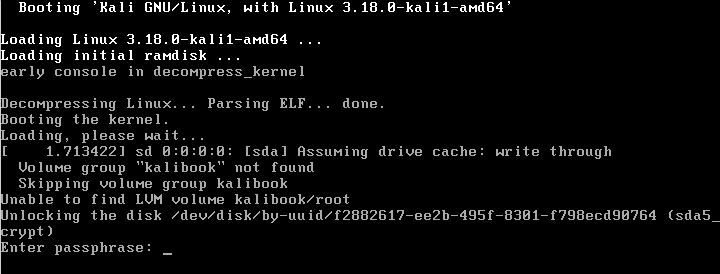

这将从现在未加密的驱动器启动系统的实际引导过程。系统启动后，将显示一个登录屏幕，如下所示。如果安装了 e17 版本的 Kali Linux，您将看到以下屏幕。


在 e17 版本中，您使用 root 凭据登录终端仿真器屏幕，然后键入`startx`打开 GUI。

下面的屏幕截图是如果您安装了标准的 Gnome3 版本，您将看到的内容。

在标准 Gnome3 GUI 安装中，您将看到一个**GUI 桌面管理器**（**GDM**登录屏幕截图，如下所示：


**Hacker trick**:
Before we go any further we would advise you to use these tools only on systems you have written authorization to test, or systems that you personally own. Any use of these tools on a machine you do not have authorization to test is illegal under various Federal and State laws. When you get caught, you will go to jail. Sentences for hacking tend to be exorbitantly long.

Get a personal copy of the testing waiver that your company receives to allow them to test the client's network and systems. This document should contain the dates and times of testing and the IP addresses and/or networks to be tested. This is the scope of your testing. This document is your *Get out of jail free card*. Do not test without this.

现在，让我们登录并继续我们的设置。下面的屏幕截图显示了 Gnome3 桌面。


第一次登录时，请检查所有内容是否都是最新的。因为这是一个滚动发行版，所以几乎总是会有一些更新。有几种方法可以访问终端仿真器：

1.  单击左上角的“应用程序”菜单栏，向上拉一个终端窗口。转到应用程序|常规应用程序|系统工具|终端。
2.  在同一应用程序菜单中，转到应用程序|收藏夹|终端。
3.  您可能会注意到“收藏夹”菜单也显示为桌面左侧的按钮栏。单击终端按钮。
4.  在裸机安装（与虚拟机安装相反）上，您可以点击*Alt*+*F2*打开运行对话框，然后键入`gnome-terminal`。

其中任何一个都会打开终端或命令行窗口。键入以下内容：

```
root@kalibook :~#  apt-get update  
```

这将刷新更新列表并检查新更新。接下来，运行：

```
root@kalibook :~#  apt-get -y upgrade  
```

这将运行升级过程，因为`-y`自动回答是升级。系统将运行所有应用程序的升级。如有必要，请重新启动。

# 从实时 DVD 运行 Kali

在执行取证或恢复任务时，从实时磁盘运行 Kali Linux 是最好的选择。Live Disk 不会将任何内容写入计算机的硬盘驱动器。一些工具，例如**OpenVAS**根本无法工作，因为它们必须进行配置，并且必须保存文件更新。你不能从 DVD 上这么做。

要从 DVD 运行 Kali，只需将磁盘加载到正在测试的机器中并从中引导即可。您将看到以下屏幕。这是您在本章前面部分中选择图形安装程序的屏幕。我们现在将讨论这些选项。请注意，在 DVD 的 boot live 中有几个选项。

*   从第一个选项启动将加载 Kali，并完成一个工作网络堆栈。您可以使用此选项在网络上运行许多工具。此模式的最佳用途之一是恢复死机。它可能允许您在操作系统驱动器死机后恢复崩溃的机器。不管你用 fsck 和其他磁盘工具做什么，它都不会自动恢复。如果从 live DVD 启动，则可以运行 fsck，很可能会使驱动器恢复到足以从中复制数据的状态。然后，您可以使用 Kali 将数据从驱动器复制到网络上的另一台机器。
*   从第二个选项引导将在没有运行服务和网络堆栈的情况下引导 Kali。当系统出现问题时，此选项很好。可能是被闪电击中，网络接口卡损坏了。您可以在此模式下执行上述操作并将数据复制到已安装的 USB 驱动器。
*   第三种选择是法医模式。使用此选项引导时，引导时尽量不要触摸机器本身。没有驱动器旋转，并且内存没有像正常启动时那样完全刷新。这允许您从上次引导中捕获旧内存，并允许您在不实际接触数据的情况下对任何驱动器进行取证拷贝。您没有工作的网络堆栈或正在运行的服务。
*   从第四个和第五个选项启动需要将 Kali 安装到 USB 驱动器上，并从 USB 驱动器运行。当您从 USB 启动时，您将看到相同的屏幕，但您将选择其中一个选项。对于具有持久性选项的 USB，请参见列出的链接（[http://kali.org/prst](http://kali.org/prst) 为一篇优秀的教程。
*   如果您熟悉 Linux 命令行，您可能需要第六个选项。这是**Debian Ncurses**安装程序。它具有图形安装程序的所有功能，但缺少图形安装程序的现代流畅外观。您还可以将此安装程序与用于完全安装到加密 USB 的选项一起使用。步骤都是一样的。
*   **图形安装**用于直接安装到硬盘上，正如在我们的演示中一样，您也可以使用它对 USB 或闪存驱动器进行完整安装。

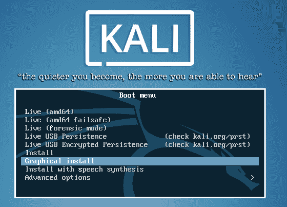

# 安装和配置应用程序

你需要的大部分东西都预装在 Kali 上。如果您在特定领域与 Kali 合作，Kali 将在[中提供特定类别的工具列表 https://tools.kali.org/kali-metapackages](https://tools.kali.org/kali-metapackages) 页面，如下图截图所示：

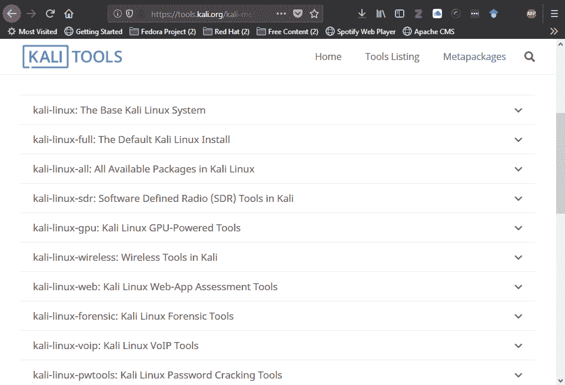

这是一个有用的数据源，但它可能会迫使你做出选择，从而使你的生活有点复杂。我们发现有一些应用程序是有用的，但它们并没有随基本安装一起加载。我们还将设置和配置 OpenVAS 以用作漏洞扫描程序。

# Gedit–Gnome 文本编辑器

Kali 附带了**Leafpad**作为其默认文本编辑器。这是一个非常轻量级的文本编辑器。Kali 的桌面是基于 Gnome 的，Gnome 文本编辑器**Gedit**是一个更好的编辑器。要安装：

```
root@kalibook :~#  apt -y install gedit  
```

一旦安装，您将在常规应用程序|附件中找到它。

# Geany–平台无关代码 IDE

Geany 是 Wolf 最喜欢的文本编辑器/IDE。它有很多字符串编辑功能，以及自动代码标记闭包和高亮显示。最后，它可以在从 Kali 到 Windows 的任何平台上工作。有一个在你所接触的所有平台上都能工作的编辑器，这是一个节省时间的方法。只需 Geany 项目网站（[上的更多功能 https://www.geany.org/Main/About](https://www.geany.org/Main/About) 如下所示：

*   构建编译和执行代码的系统
*   代码折叠
*   代码导航
*   构造完成/代码段
*   符号名自动完成
*   许多受支持的文件类型，包括 C、Java、PHP、HTML、Python、Perl 等
*   符号列表
*   简单项目管理
*   插件接口

要安装：

```
root@kalibook :~#  apt -y install geany  
```

一旦安装，您将在常规应用程序编程中找到它。

下面的屏幕截图显示了 Geany 在 Kali Linux 上的实现。注意突出显示的代码和包含的端子以显示输出。

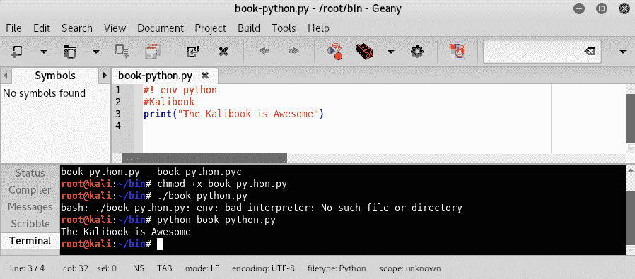

# Terminator–用于多任务处理的终端仿真器

这是 Bo 最喜欢的终端应用程序。你可以把屏幕分成几个窗口。当同时运行多个 SSH 会话时，这将非常有帮助。它还有一个广播功能，您可以在所有窗口中同时运行相同的字符串。以下是《终结者》网站（[的一些主要功能 https://gnometerminator.blogspot.com/p/introduction.html](https://gnometerminator.blogspot.com/p/introduction.html) ：

*   在网格中排列端子
*   标签
*   拖放终端的重新排序
*   键盘快捷键
*   GUI 首选项编辑器，用于保存多个布局和配置文件

要安装：

```
    root@kalibook :~#  apt -y install terminator

```


# Etherape–图形化协议分析工具

这是一个很棒的视觉被动/主动网络嗅探工具。它适用于嗅探 Wi-Fi 网络。它可以向您显示服务运行的位置，还可以向您显示用户在哪里进行可疑的 bit torrent 下载以及大多数公司网络上未经批准的其他行为。

要安装：

```
root@kalibook :~#  apt -y install etherape 
```

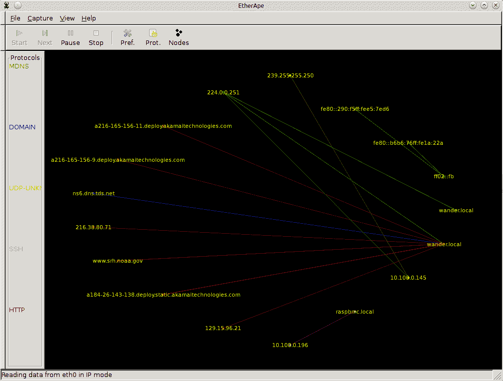

# 设置和配置 OpenVAS

侦察是一切，所以一个好的漏洞扫描器是必不可少的。Kali 以前安装了 OpenVAS。现在您必须安装 OpenVAS。

要安装：

```
root@kalibook :~#  apt -y install openvas  
```

使用前必须对其进行配置和更新。幸运的是，Kali 附带了一个有用的脚本来设置这个。这可以在应用程序|漏洞分析| openvas 初始设置下找到。单击此按钮将打开一个终端窗口并为您运行脚本。这将为 SSL 设置自签名证书，并下载最新的漏洞文件和相关数据。它还将为系统上的管理员帐户生成密码。

确保并保存此密码；您需要它才能登录。您可以在首次登录后进行更改。


Kali 还附带了一个检查设置脚本，用于检查服务和配置。如果出现问题，它将为您提供有关该问题的帮助信息。此脚本可在应用程序|系统服务| openvas 检查设置中找到。

单击此按钮，终端窗口将打开并运行脚本。


脚本结果如以下屏幕截图所示：

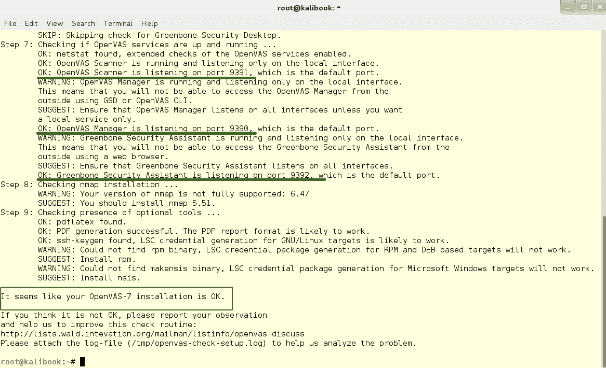

注意：此检查显示服务的运行端口。该检查显示一条警告，大意是这些服务仅在本地接口上运行。这对你的工作很好。在某些时候，在其他机器上运行 OpenVAS 服务器可能会对您有所帮助，以提高扫描速度。

接下来，我们将登录到 Greenbone web 界面以检查 Openvas。

1.  打开浏览器，进入`https://localhost:9392`。您将看到自签名证书的安全警告；接受此选项，您将获得一个登录屏幕，如下所示：


2.  您将使用用户名`admin`和设置期间生成的非常长且复杂的密码登录。别担心，一旦我们登录，我们将改变这一点。登录后，您将看到以下页面。

3.  现在转到管理|用户选项卡，如下所示：

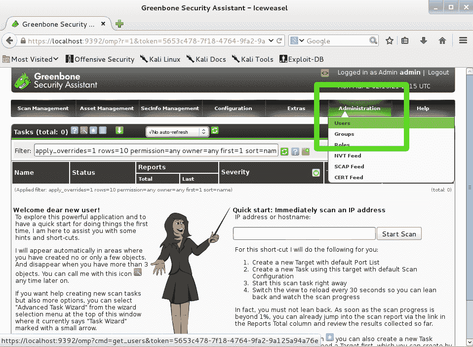

这将带您进入用户管理页面。

4.  点击名称`admin`右侧的扳手链接；这将为管理员用户打开编辑页面。


5.  将单选按钮更改为使用现有值到空白字段；添加新密码并单击“保存”按钮。


我们现在已经完成了 OpenVAS 的设置，并准备做一些真正的工作。

# 报告测试

清晰的文档有助于您报告您的工作。我们使用两种文档工具来组织文档：

*   基普诺特
*   德拉迪斯

文档管理器不仅仅是一个美化的文本编辑器或弱文字处理器。适当的文件需要有组织的归档结构。当然，Windows 安全分析师可以创建一个文件夹结构，让他们在 Kali Linux 中组织文档，就像在 Windows 工作站上一样。它是内置的文档组织应用程序，使用它们可以减少丢失或意外递归文件夹的机会。跟踪调查文件更容易。您还可以为目录结构创建模板，以便在结构上进行标准化，这也使您的工作更轻松。

# KeepNote–独立文档管理器

**KeepNote**是一个更简单的工具，如果您单独工作，它就足够了。要查找 KeepNote，请打开应用程序菜单，然后单击应用程序|常用应用程序| Office | KeepNote。下面的屏幕截图显示了 KeepNote 设置，类似于记录短测试的方式。


**Hacker note**:
To edit images, as shown in the preceding screenshot, open a terminal and type:
`**root@kalibook: ~# apt install gimp**`
`**Then drag the images from your working image directory into the keepnote directory.**`

# Dradis–基于 web 的文档管理器

**Dradis**是一个 web 应用程序，可用于与团队共享文档。Dradis 的默认 URL 为`https://127.0.0.1:3004`。应用程序可以托管在远程安全服务器上，这是 Dradis 的最佳功能。以下截图来自[http://dradisframework.org](http://dradisframework.org) 。

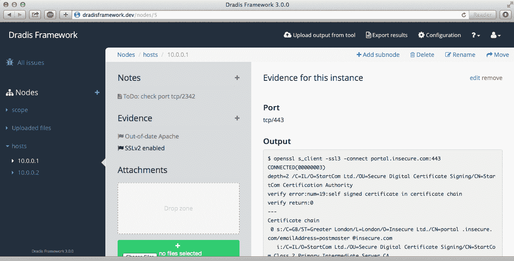

# 在 Kali Linux 上运行服务

当您需要时，有几种服务需要打开。Windows 和 Linux 中服务的一般用途是在计算机启动时启动它们。大多数管理员很少花时间管理服务，除非出现问题。在 Kali 系统中，当您没有实际执行安全分析任务时，您将倾向于关闭工作站，并且您肯定不希望通过 internet 访问工作站上的安全工具，如 OpenVAS 或 Metasploit。这意味着您希望在需要时启动它们，在不使用它们时关闭它们。

您可以从应用程序菜单应用程序|系统服务中找到启动和停止 Kali 服务的命令

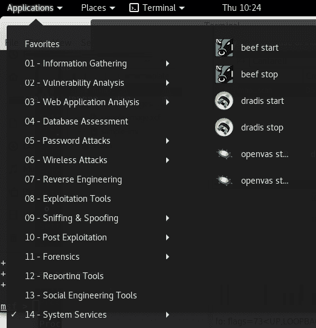

使用服务的另一种方法是在命令行上使用`systemctl`。作为一个例子，考虑 HTTP（ApACE2）。有几种服务选项：

*   **启动**：启动 Apache Web 服务器并显示**进程 ID**（**PID**）*。*
*   **状态**：显示服务器的状态。是吗？它下来了吗？它卡住了吗？
*   **重启**：关闭服务器并在不同的 PID 上重启。如果服务器被卡住或您更改了服务器所依赖的网络进程，请使用此选项。
*   **重新加载**：重新读取配置。在对配置进行微小更改时使用此选项。
*   **停止**：关闭 Web 服务器。

下面的屏幕截图显示了比较 apache2 Web 服务器状态请求的`apache2ctl`和`systemctl`的读数。一整本书可能都是关于强大的`systemctl`命令的。


# 总结

本章向您展示了两种设置 Kali Linux 的方法，这样您就可以使用公司发行的 Windows 笔记本电脑或任何其他笔记本电脑，从而提高 Kali Linux 的性能，而不必仅仅为了 Kali 而申请一台新机器。大多数企业不允许双重启动计算机，在 VM 上运行 Kali 会限制 Kali 安装的资源。此外，本章还向您展示了我们使用的两种报告工具，以及每种工具最有意义的情况。我们将首次向您展示如何设置 OpenVAS。我们还向您展示了如何在 Kali Linux 上运行服务。