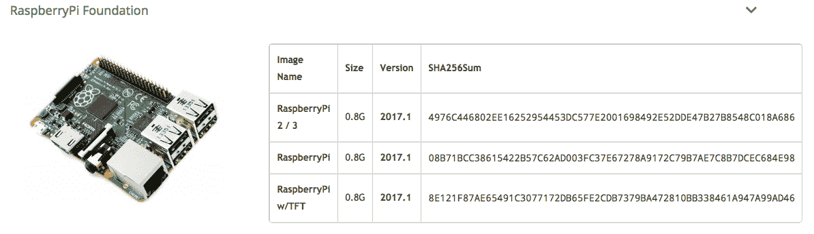
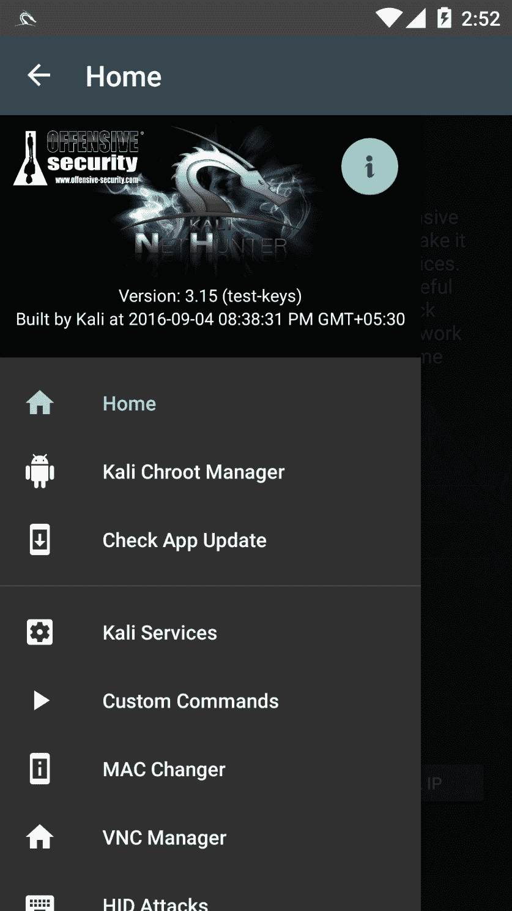
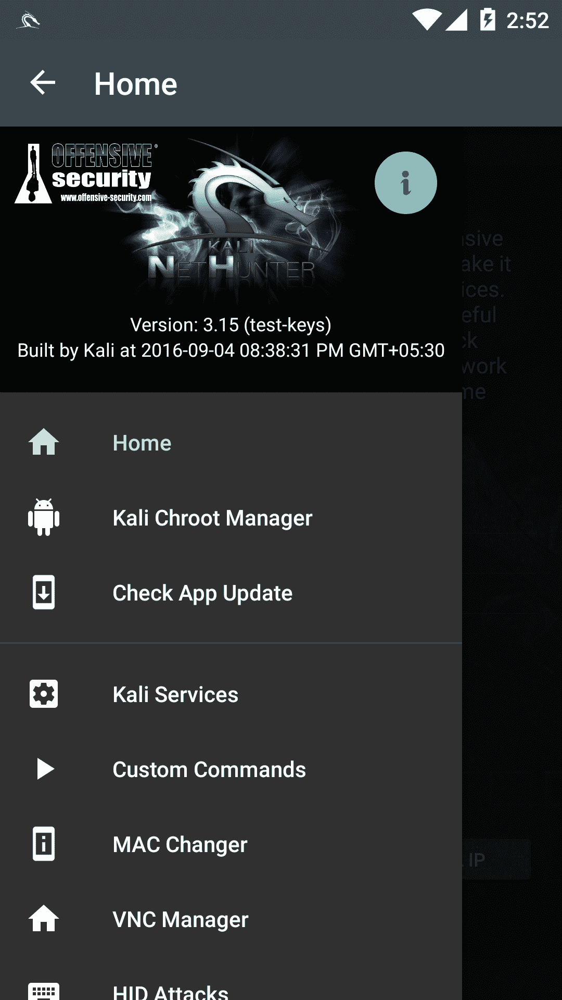
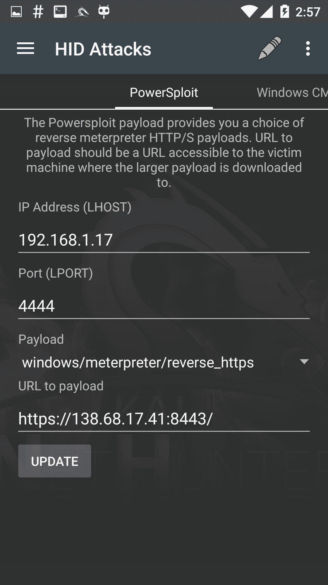
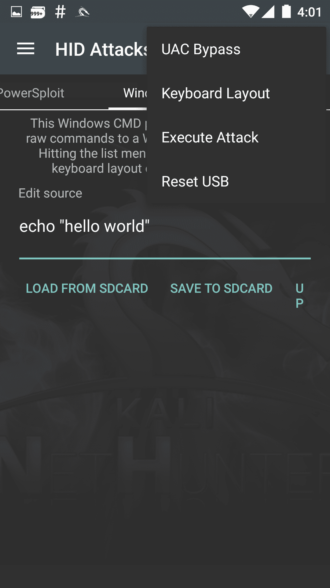
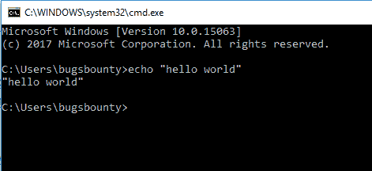
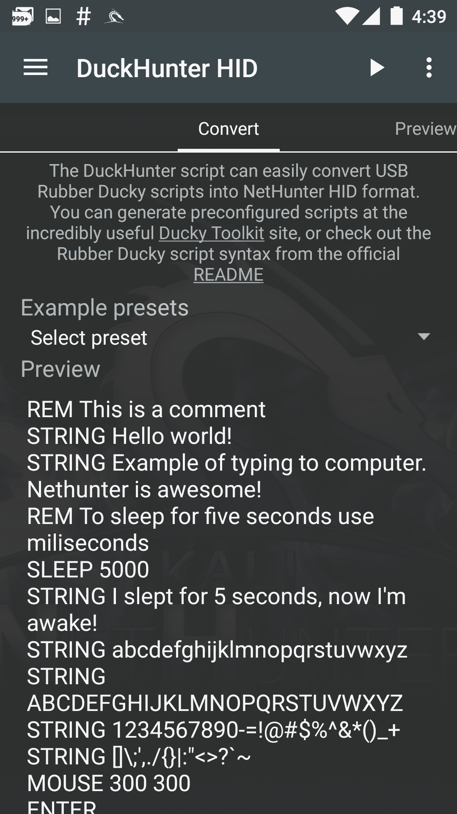
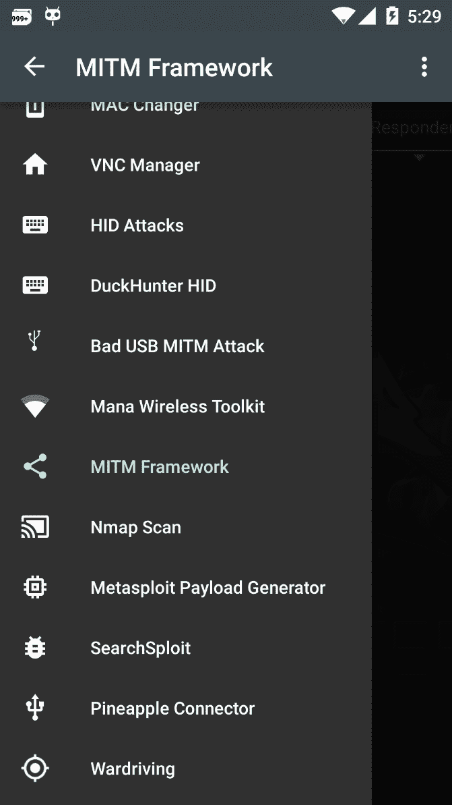
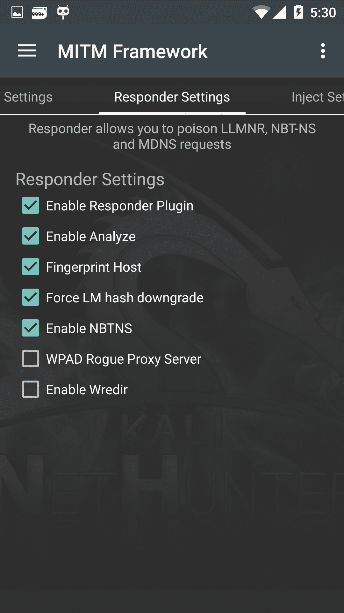
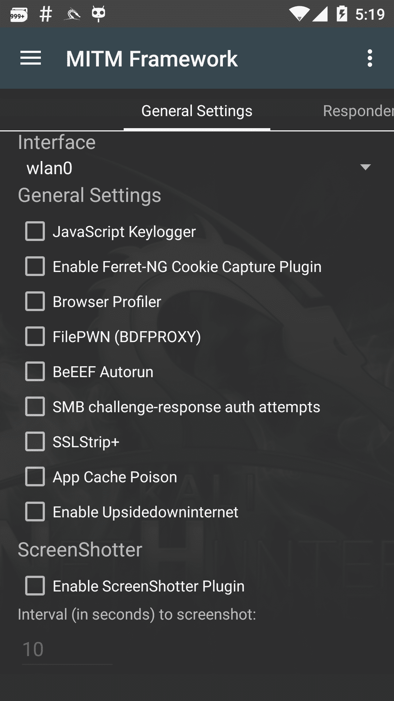

# 十一、口袋里的 Kali——NetHunter 和树莓

在本章中，我们将介绍以下配方：

*   在树莓皮上安装 Kali
*   安装 NetHunter
*   超人打字-隐藏攻击
*   我能给手机充电吗？
*   设置一个邪恶的接入点

# 介绍

在某些情况下，在进行 pentest 时，客户可能会要求我们进行适当的红队攻击。在这种情况下，带着笔记本电脑走进办公室可能看起来可疑，这就是为什么本章派上用场的原因。我们可以使用手机或 Raspberry Pi 等小型设备进行红队合作，并使用它们有效地执行 pentest。在本章中，我们将讨论在 Raspberry Pi 和兼容手机上设置 Kali Linux，并使用它对网络执行一些很酷的攻击。

# 在树莓皮上安装 Kali

Raspberry Pi 是一款价格合理的 ARM 电脑。它的体积非常小，这使得它具有可移植性，因此它最适合于类似 Kali Linux 的系统使用便携式设备执行 pentesting。

在本教程中，您将了解如何在 Raspberry Pi 上安装 Kali Linux 映像。

# 准备

Raspberry Pi 支持 SD 卡。在 Raspberry Pi 上设置 Kali 的最佳方法是创建一个可引导 SD 卡并将其插入 Pi。

# 怎么做。。。

要在 Raspberry Pi 上安装 Kali，请遵循给定的步骤：

1.  我们将首先从攻击性安全的网站[下载该图像 https://www.offensive-security.com/kali-linux-arm-images/](https://www.offensive-security.com/kali-linux-arm-images/) ：



2.  下载图像后，我们可以使用不同的方法将图像写入存储卡。
3.  在 Linux/macOS 上，可以使用`dd`实用程序来完成。可使用以下命令使用`dd`实用程序：

```
        dd if=/path/to/kali-2.1.2-rpi.img of=/dev/sdcard/path bs=512k  
```

4.  一旦这个过程完成，我们可以将 SD 卡插入 Pi 并打开电源。
5.  我们将看到我们的 Kali 启动：


我们可以参考此链接了解更详细的指南：[https://docs.kali.org/downloading/kali-linux-live-usb-install](https://docs.kali.org/downloading/kali-linux-live-usb-install) 。

# 安装 NetHunter

如攻击性安全的官方维基所述：

“Kali NetHunter 是一款安卓 ROM 覆盖，包括一个强大的**移动渗透测试平台**。覆盖层包括一个自定义内核、一个 Kali Linux chroot 和一个附带的 Android 应用，可以更轻松地与各种安全工具和攻击进行交互。除了 Kali Linux 中的渗透测试工具库外，NetHunter 还支持其他几个类，例如**HID 键盘攻击**、**BadUSB 攻击**、**邪恶 AP 魔法攻击**，等等。有关组成 NetHunter 的移动部件的更多信息，请查看我们的 NetHunter 组件页面。NetHunter 是由攻击性安全和社区利用的开源项目。”

在本食谱中，您将学习如何在 Android 设备上安装和配置 NetHunter，并使用它执行攻击。我们可以在[找到支持的硬件列表 https://github.com/offensive-security/kali-NetHunter/wiki](https://github.com/offensive-security/kali-nethunter/wiki) 。

# 准备

在开始之前，我们需要将该设备与 Team Win Recovery Project 一起作为自定义恢复安装。

# 怎么做。。。

要安装 NetHunter，请执行给定的步骤：

1.  我们下载 NetHunter ZIP 文件并将其复制到 SD 卡，然后重新启动手机进入恢复模式。我们正在使用一加一与氰 MOD 12.1。同时按下电源和音量降低按钮可启动恢复模式。
2.  一旦进入恢复模式，我们选择在屏幕上安装并选择 ZIP 文件。我们可以从[下载 ZIPhttps://www.offensive-security.com/kali-linux-NetHunter-download](https://www.offensive-security.com/kali-linux-nethunter-download) ：


3.  完成后，我们会重新启动手机，并在应用菜单中看到 NetHunter。

4.  但在开始之前，我们需要在 Play Store 的手机上安装 BusyBox：


5.  完成后，我们运行应用并单击安装：


6.  接下来，我们打开 NetHunter，从菜单中选择 Kali Chroot Manager：



7.  我们单击 ADD METAPACKAGES，我们将为下一个配方做好准备：


# 超人打字-隐藏攻击

NetHunter 具有一项功能，允许我们将设备和 OTG 电缆转换为键盘，从而在任何连接的 PC 上键入任何给定命令。这允许我们执行 HID 攻击。

“HID（人机界面设备）攻击向量是通过键盘仿真实现定制硬件和限制旁路的显著组合。因此，当我们插入设备时，它将被检测为键盘，并且使用微处理器和车载闪存存储器，可以向键盘发送非常快的击键集。获取用户的机器并完全破坏它。”
https://www.safaribooksonline.com/library/view/metasploit/9781593272883/

# 怎么做。。。

要执行 HID 攻击，请执行给定的步骤：

1.  我们可以通过打开 NetHunter 应用来执行这些操作。
2.  在菜单中，我们选择 HID 攻击：



3.  我们将看到两个选项卡：PowerSploit 和 Windows CMD：



4.  让我们试试 Windows 命令；在“编辑源代码”框中，我们可以键入要执行的命令。我们甚至可以从选项中选择 UAC 旁路，使命令在不同版本的 Windows 上以管理员身份运行：


5.  我们从 UAC 旁路菜单中选择 Windows 10，然后键入一个简单命令：

```
        echo "hello world"  
```


6.  然后，我们将手机连接到 Windows 10 设备，并从菜单中选择执行攻击：



7.  我们将看到正在执行的命令：



欲了解更多信息，请访问[https://github.com/offensive-security/kali-NetHunter/wiki/NetHunter-HID-Attacks](https://github.com/offensive-security/kali-nethunter/wiki/NetHunter-HID-Attacks) 。

# 我能给手机充电吗？

在本食谱中，我们将研究一种不同类型的隐藏攻击，称为 DuckHunter 隐藏攻击。这使我们能够将臭名昭著的 USB 橡皮鸭脚本转换为 NetHunter HID 攻击。

# 怎么做。。。

要执行 DuckHunter HID 攻击，请执行给定的步骤：

1.  我们可以通过打开 NetHunter 应用来执行这些操作。
2.  在菜单中，我们选择 DuckHunter 隐藏攻击。
3.  “转换”选项卡是我们可以键入或加载脚本以执行的位置：



4.  让我们从一个简单的`Hello world!`脚本开始。
5.  我们在任何设备上打开文本编辑器，然后连接设备并单击播放按钮。

6.  我们将看到这是在编辑器中自动键入的：


7.  internet 上有多个脚本可用于使用 NetHunter 执行多个攻击：


8.  这些可以下载并加载到 NetHunter 中，然后用于攻击受害者的 PC；该列表可在[中找到 https://github.com/hak5darren/USB-Rubber-Ducky/wiki/Payloads](https://github.com/hak5darren/USB-Rubber-Ducky/wiki/Payloads) 。

更多信息请参见[https://github.com/hak5darren/USB-Rubber-Ducky/wiki](https://github.com/hak5darren/USB-Rubber-Ducky/wiki) 。

# 设置一个邪恶的接入点

MANA toolkit 是 SensePost 创建的邪恶接入点实现工具包，可用于执行 Wi-Fi、AP 和 MITM 攻击。一旦受害者连接到我们的接入点，我们将能够执行多个操作，您将在本食谱中了解这些操作。

# 怎么做。。。

要设置恶意访问点，请执行给定的步骤：

1.  它很容易使用。在 NetHunter 菜单中，我们选择 Mana Wireless Toolkit：



2.  它将在“常规设置”选项卡中打开。在这里，我们可以选择界面和其他选项，例如捕获 cookie。这可以通过使用 NetHunter 支持的外部无线卡执行邪恶孪生攻击来执行无线攻击：


3.  您在前面的章节中了解了 responder。我们可以通过这个工具包使用 responder 来捕获网络哈希。
4.  首先，我们连接到要对其执行攻击的网络。

5.  接下来，我们切换到 Responder 设置选项卡并检查我们希望执行的攻击。我们选择 wlan0 作为我们的接口：



6.  要更改要侦听的接口，请切换到“常规设置”选项卡，并从下拉列表中的接口列表中进行选择：



7.  现在，我们从右侧的选项菜单中单击开始 mitm 攻击。

8.  我们将看到一个终端窗口打开，我们的攻击将被执行。我们将看到攻击捕获的主机信息和密码哈希：


9.  类似地，还有其他攻击，如 Nmap 扫描、生成 Metasploit 有效负载等。

欲了解更多信息，请访问[https://github.com/offensive-security/kali-NetHunter/wiki](https://github.com/offensive-security/kali-NetHunter/wiki) 。