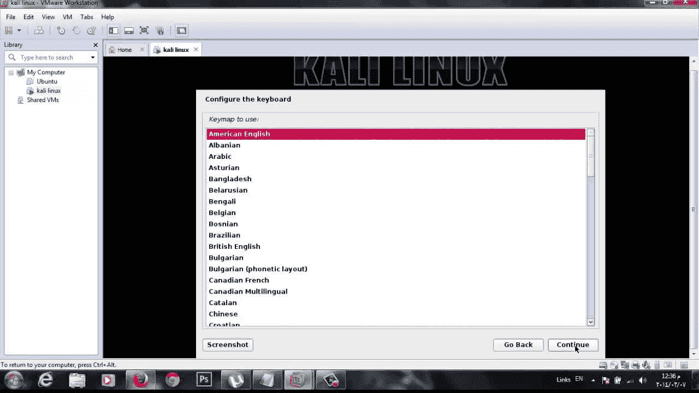
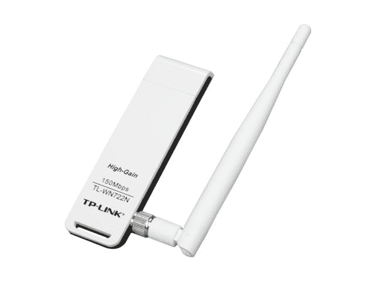

# 一、Kali Linux 与无线网络

在本章中，我们将介绍以下配方：

*   安装 Kali Linux
*   在 PC 上安装 Kali Linux
*   在虚拟环境中安装 Kali Linux
*   更新 Kali Linux
*   准备无线测试

# 介绍

在当今世界，共享信息最常见的方式之一是使用无线通信。Wi-Fi 在许多地方都有使用，包括家庭、工作场所、机场、咖啡馆、零售店和许多其他数不胜数的地方。

随着这种通信方式的普及，人们已经放弃了这样一个结论：有大量有价值的信息正在穿越这些网络。正是由于这些信息和这些网络中固有的弱点，它们成为那些希望窃取访问权或信息或两者的人的共同目标。

在本书中，我们有两个目的，一个目的是向您介绍 Kali Linux 中用于审计无线网络的工具，另一个目的是展示一些可能的不同攻击。此方法不仅可以为您提供有关攻击及其工作方式的信息，还可以为您提供有关降低这些攻击的可能性或有效性的宝贵见解。

# 开始与卡莉

Kali Linux 适用于执行 pentesting 和取证的人员；然而，在本书中，我们将更多地关注前者而不是后者。事实上，关于 pentesting 的主题，我们将只关注于使用那些用于测试和破坏无线网络或设备安全性的工具。

为了充分利用这本书，并了解如何利用它渗透无线网络，您应该具备一些基本技能，使事情变得更简单。如果您打算开始这段无线网络审计之旅，您至少应该具备以下技能：

*   熟悉 TCP/IP 协议和 IPv4
*   对**开放系统互连**（**OSI**模型的了解
*   了解网络帧类型（即 IEEE 802.3、802.11 等）
*   了解无线电频率和技术是有帮助的，但可以选择
*   有安装和使用无线设备和网络的经验
*   使用 Kali Linux 的实际操作经验是有帮助的，但我们将在这一过程中填补您的知识空白
*   如果您打算利用虚拟化来托管安装程序，则可以选择使用虚拟化的经验
*   网络故障排除经验
*   使用命令行的舒适性

再一次，在最后几点中，缺少它们不会伤害你，但是拥有它们会在很大程度上帮助你在这本书和你的爱情生涯中。

# 安装 Kali Linux

准备将 Kali Linux 安装到计算机系统与您可能遇到的其他操作系统类似，首先要确保您具有正确的系统要求。

# 准备

要开始工作，让我们看看您需要具备的最低硬件要求，以便安装产品：

*   Kali 操作系统的最小 10 GB 硬盘空间
*   对于 i386 和 amd64 系统，512 MB 的 RAM
*   CD/DVD 驱动器或 USB 启动支持
*   一个积极的互联网连接是可取的

同样，请记住，此处列出的内容代表最低限度，您将希望尽可能多地超出这些范围，以确保性能达到最佳水平。就我个人而言，我建议至少有 4GB 的 RAM，如果不是更多的话（我个人使用的系统中分别有 8GB 或 16GB，但我过去使用过 4GB 的内存，而且还不错）。

您还应该注意，对 Kali 的要求非常低，这将使您能够很好地运行产品，即使是在使用了几年的计算机上。

# 怎么做。。。

一旦您根据需要确认或升级了系统硬件，您现在需要选择如何安装 Kali。Kali 提供了几种不同的安装和运行产品的方法，每种方法都有各自的优点，但也有各自的缺点。然而，在本书中，我们将假设两种选择之一，即在 PC 上和虚拟环境中进行物理安装。

# 虚拟化与物理化

使用虚拟化而不是直接安装在系统上的问题是您应该考虑的一个问题。虚拟化是一种常见的选择，多年来，无论大小的组织都在使用它，许多组织都在自由地使用它来满足各种需求。对于许多人来说，转向虚拟化的驱动力可能有很多因素，包括系统整合、节能、优化硬件使用、应用程序和系统隔离、易于管理以及测试等等。

然而，对于渗透测试人员来说，虚拟化的使用往往有点不同。

pentester 方面的动机之一是能够在主机上以不同的配置运行测试环境。例如，将 Microsoft Windows 作为主机运行，并将一个或多个 Kali 环境作为来宾在系统顶部的虚拟化环境中运行，这样就可以进行整合，同时还可以根据需要进行专门的配置。

转向虚拟化的另一个原因是利用所谓的**隔离**或**沙箱**。基本上，这意味着来宾系统与主机系统分离，允许系统访问网络和 internet，而不允许两者相互干扰。在客人使用的工具和技能可能会损害或危及主机或其他系统的情况下，这一点至关重要。

当然，您并不是一无所获，也不是每种情况下都是理想的，虚拟化也没有什么不同。一个可能被证明存在问题的领域与硬件支持有关。在某些情况下，由于虚拟化技术，物理设备可能无法按您需要的方式运行。一个例子是无线网络和蓝牙；这些技术可能要求 Kali 直接在硬件上运行，而不是在虚拟环境中运行。虽然这种限制并不常见，但可能会令人沮丧。当然，如果我没有提到存在变通方法，并且可以在虚拟化环境中使用一些硬件选项，这是不可能的，但是这些变通方法可能非常复杂和专业，并且超出了本工作的范围。

我必须注意，在某些虚拟化平台上，可以使用 USB 直通来启用外部 USB 适配器。但是，此选项的支持和功能因实际使用的软件平台而异。有关如何在您的环境中完成此任务的详细信息，请咨询您的软件。

# 安装前检查表

就像许多可用的操作系统一样，Kali 有一些独特和特定的要点需要考虑，以使安装正常进行。幸运的是，Kali 的安装要求相当简单，但肯定有一些事情会影响您的体验，并使 Kali 的运行方式不太理想。

为确保获得最佳安装和性能，以下是一个需要考虑的项目清单示例：

*   您是将 Kali 安装到硬盘上，还是从可移动媒体上运行它？
*   系统当前有多少内存？更多的内存有助于更好的体验和更好的 Kali 系统性能。在我自己的个人系统上，我使用 8GB 运行，Kali 运行得很好。如果您使用硬盘以外的其他设备运行 Kali，则更多的内存可能会带来更好的性能，因为更多的 Kali 可以保存在内存中。
*   您将运行哪些应用程序？如果您将在 Kali 中安装其他应用程序，您可能需要调整配置以考虑它们的包含。一些实用程序需要特殊的硬件（如无线设备）才能正常工作。如果您依赖这些功能或将来将使用这些功能，请确保所有硬件都兼容或可以升级。
*   你有什么类型的硬盘？我已经用传统驱动器和 SSD 运行了 Kali，而在这两种驱动器中，SSD 运行得更好，有助于获得更令人满意的体验和性能。
*   Kali 为您喜爱的应用程序和设备提供了广泛的软件支持，并且随着时间的推移，这种支持只会不断增加。Kali 中包含了应用程序，涵盖了您可能遇到的许多用途和情况，但您可以根据需要添加这些应用程序。

# 选择安装选项

在我们评估我们的系统适合安装卡利之后，我们现在需要考虑如何安装它。阅读本书的大部分人可能在 Windows 环境中有丰富的经验，因此，几乎总是直接将操作系统安装到硬盘上。然而，正如我们刚刚了解到的，Kali 提供了额外的安装选项。我们现在需要确定安装位置的路径。

让我们看看主要选项，以及是什么让每个选项成为好的选择或坏的选择：

*   **在没有持久性的情况下安装到闪存驱动器**：如果您希望使用 Kali 进行取证，这是一种合适的安装方法，因为它不会改变主机，因此不会影响系统上的潜在证据。如果您希望 Kali 帮助您进行网络或主机故障排除，这也是一种非常合适的安装方法。如果您希望有一个可移植的环境，可以在任何系统上运行，而无需担心主机或闪存驱动器本身的更改，那么它也可能是理想的。
*   **安装到具有持久性的闪存驱动器**：此安装方法适用于您希望能够随身携带 Kali 进行故障排除、取证或携带便携式 pentesting 工具包的情况，但您希望能够保存文件并对系统进行更改，而不会在每次关闭系统时丢失这些更改。
*   **安装到硬盘**：这是非常流行和有用的，因为它提供了最好的性能，因为每次启动时不需要将文件加载到内存中。此安装还提供了保存文件和进行更改的功能，而不会在重新启动时丢失。如果您想要一个保留更改的系统，尤其是如果您倾向于根据自己的需要调整系统，那么这是理想的。
*   **作为虚拟化环境安装**：此选项与安装到硬盘驱动器类似，只是操作系统安装到允许更改 Kali guest 的虚拟化环境中。
*   **从 CD 或 DVD 运行**：我在这里包括这个选项，因为这是另一个类似于将 Kali 安装到非持久性闪存驱动器的选项。这往往比这里介绍的任何其他方法都要慢。



使用虚拟机软件虚拟化运行的 Kali Linux

如果将使用非常特定的硬件（如高性能图形卡）破解密码，建议在台式计算机上安装 Kali Linux。如果需要将操作系统从一个客户站点传送到另一个客户站点，或者需要测试无线设备，建议使用笔记本电脑。笔记本电脑和台式电脑的操作系统安装相同。

就我个人而言，我在虚拟环境和专用笔记本电脑上运行 Kali，Kali 是唯一安装的操作系统。我选择的系统是一台老式的联想笔记本电脑，带有触摸屏、2.4 GHz CPU、8 GB RAM、250 GB SSD、蓝牙、Wi-Fi，其他功能不多。这绝对不是最先进的，但它背后有足够的动力和功能，我可以用多余的马力做我需要的事情。
我选择笔记本电脑是基于两个主要问题，即硬件支持和电源。通过选择一个稍微旧一点的系统，我不必担心 Kali 支持硬件，也不必担心必须寻找解决方案才能使系统正常工作，它确实做到了。关于电源，我指的是 Linux 传统上不需要最强大的硬件来获得良好的性能。事实上，Linux 传统上运行在较旧的硬件上，没有其他操作系统会遇到的问题。然而，我确保我不会倒退到我需要使用的工具太多的地步。我发现过去五年或更短时间内生产的硬件在大多数情况下都可以运行 Kali。

# 硬盘驱动器选择

在为 Kali 选择系统时，您不想在硬盘驱动器方面走捷径。获得一个至少有 150 GB 空间的驱动器通常是个好主意，但是如果可能的话，你应该考虑比这更大的驱动器，因为你无疑会安装不包含在迦梨中的其他工具（更不用说你所生成的数据也会占用空间）。

请记住，作为一名渗透测试人员，您不仅会被要求，而且会被要求对您的发现保密，对于许多测试，这意味着要擦拭硬盘以确保安全。虽然可以清理已安装的操作系统，使其恢复到基本状态或原始状态，但您可能仍需要擦除驱动器。建议按照您希望的方式设置系统，然后对其进行映像，这样您就可以有效地擦除驱动器，然后随意恢复原始映像。永远记住，失去对信息的控制或泄露信息不仅会让你的客户感到不安，还会让你面临诉讼、名誉损失、职业损失和恶果。基本上，对测试期间和之后收集的数据采取适当的预防措施。

当我购买目前的 Kali 系统时，我做的第一件事就是用更大的 SSD 驱动器替换硬盘驱动器。我觉得这项投资是一项很好的投资，原因很多，我将在这里解释。
首先，使用 SSD 驱动器通常会在一定程度上减少系统的电池消耗。当你不能插到墙上时，这种电池消耗的减少会导致更长的移动使用时间。
其次，SSD 驱动器比传统硬盘驱动器快很多。SSD 驱动器的读写速度比传统硬盘驱动器快。能够更快地检索和操作数据对于渗透测试人员（或任何相关人员）来说是一个巨大的好处。
最后，SSD 驱动器可能比旧的传统驱动器承受更大的冲击。计算机内部缺少旋转磁盘意味着移动和运输 drive plus 系统导致驱动器故障的可能性要小得多。
这些是我在转向固态时考虑的事情，我不觉得我做了一个错误的选择。

# 网卡和无线网络

你需要考虑的是迦梨将如何连接到网络以及您可能执行的测试类型。也就是说，我们在本节中考虑的是您选择的网络接口，即有线或无线。无线是你今天（或过去 10 年制造的）遇到的几乎任何一类设备上的常见组件。另一方面，设备上的有线网络连接已变得不那么常见，许多笔记本电脑和笔记本电脑都将其全部丢弃。

在无线网络的情况下，您可能会发现，设备中包含的或通过其他方式（如 USB）添加的许多无线网卡都可以与 Kali 一起使用，不会出现问题，或者可以通过从制造商处获取正确的驱动程序来进行纠正。下图显示了流行的 USB 无线网络适配器的一个示例：


USB Wi-Fi 适配器

在考虑购买外部 Wi-Fi 适配器时，我想指出的一点是，您是否会在某个时候运行 Kali NetHunter。Kali NetHunter 在本书的其他部分进行了讨论，但简而言之，它是一款基于 Android 的 Kali 版本，适用于智能手机和平板电脑等移动设备。如果您计划在测试中使用此平台，则应确保您在此处购买的 Wi-Fi 适配器与两种形式的 Kali 兼容，这样您就不必购买超过所需数量的适配器。

您可以使用蓝牙执行某些测试的另一种无线形式，在这种情况下，您可能需要为此购买额外的适配器。购买另一个适配器的原因是，默认情况下，蓝牙只能扩展到 30 英尺或 10 米的范围。如果您需要更大的范围来扫描更大的区域，您可以购买一个工业蓝牙适配器，该适配器将扫描范围扩展到 1000'或更大。

# 在 PC 上安装 Kali Linux

因此，考虑到我们的系统需求和考虑因素，还有半个小时左右的空闲时间，我们现在准备安装 Kali。有了所需的硬件，您首先需要从[获得一份 Kali Linux 的副本 https://www.kali.org/](https://www.kali.org/) ，这是为您的硬件设计的。目前，i386、amd64 以及 ARM（armel 和 armhf）平台都支持 Kali。

# 准备

在安装之前，您需要下载适合您硬件的版本，例如适用于 64 位系统的 amd64。

因此，让我们开始安装过程来创建我们的 Kali 系统。

# 怎么做。。。

1.  启动安装过程需要从使用 Kali 准备的 DVD 或闪存驱动器启动系统，方法是将 ISO 文件刻录到介质中，或准备带有这些文件的 USB 驱动器。
2.  您可以从选择的介质启动安装。从可移动媒体（如 DVD 或 USB）引导的实际过程因硬件而异，因此请咨询供应商，了解如何在系统上执行此操作。
3.  从您选择的介质启动后，系统将提示您希望执行哪种类型的安装。您可以选择图形或文本模式安装。为了更好地展示流程，我们将在这里使用图形模式。
4.  选择安装模式后，为您所在地区选择语言、位置和键盘布局。
5.  选择这些选项后，安装脚本会将映像复制到系统的硬盘上，并对硬件进行粗略扫描，以查找网络接口。
6.  出现提示后，选择系统的主机名。
7.  接下来，为系统的非 root 用户提供全名。
8.  将根据您提供的全名创建默认用户 ID。如果名称不可接受，您可以选择一个新名称（如果愿意）。
9.  出现提示时，选择时区。
10.  接下来，安装程序将探测您的磁盘，并为您提供两种选择。您可以选择使用整个驱动器专用于 Kali，也可以使用**逻辑卷管理器**（**LVM**来定制安装。如果您不熟悉 LVM，建议您选择使用整个驱动器
11.  根据您的需要，您可以选择将所有文件保留在一个默认分区中，或者为一个或多个顶级目录设置单独的分区。
12.  单击“继续”后，安装程序将继续安装。
13.  配置网络镜像。Kali 使用一个中央存储库来分发应用程序。您需要根据需要输入任何适当的代理信息。
14.  接下来，安装 GRUB。GRUB 是 Linux 的引导加载程序。如果没有，则需要安装 GRUB。
15.  最后，单击“继续”重新启动到新的 Kali 安装中。

软件安装完成后，您可以使用安装过程中设置的凭据登录。

# 在虚拟环境中安装 Kali

在虚拟环境中安装 Kali 是另一种选择，它并不比在硬盘上安装困难多少。在这个配方中，我们将使用 Kali 创建我们自己的虚拟机。本配方末尾的目标是拥有我们自己的完全配置、可操作和定制的虚拟机，该虚拟机将运行 Kali 发行版。

需要记住的一点是，在[kali.org](https://www.kali.org/)网站上，可以下载虚拟机，该虚拟机既可以在 Oracle 的 VirtualBox 中使用，也可以在 VMware 中使用。如果您不希望从头开始创建自己的虚拟机，只需下载其中一个虚拟机映像，加载您选择的虚拟化软件，然后就可以开始了。但是，请记住，您可能更愿意从头开始创建自己的虚拟机，这样您就可以完全按照自己希望的方式进行自定义和设置。

# 准备

如果您选择虚拟化 Kali 并将其用于无线网络测试，则需要注意的是，您需要配置虚拟环境以与主机系统上的外部适配器一起工作。在大多数情况下，您需要使用外部 USB 无线适配器，并了解如何配置虚拟化软件以使用通常称为 USB 直通的技术。由于这是虚拟化软件包所独有的，因此我们在此不介绍此过程。

# 怎么做。。。

此处记录的步骤是使用 VMware Player 执行的，但在其他虚拟化平台（如 VirtualBox）上非常类似。但是，无论使用何种虚拟化平台，您都需要从 Kali 网站下载 32 位或 64 位 ISO 文件。

1.  在您的软件中，您需要创建一个新的虚拟机。
2.  选择出现提示时下载的 ISO 文件。

3.  选择许多虚拟化软件包将自动检测的来宾操作系统，但在某些情况下可能需要调整设置。
4.  设置新虚拟机的名称和位置。
5.  设置磁盘空间（20 GB 就足够了，但越大越好）。
6.  查看硬件配置并启动虚拟机。
7.  选择 Graphical Install（图形化安装）可以正常选择语言、时区、主机名等。
8.  当提示输入磁盘分区时，选择硬盘驱动器并选择一体机。
9.  单击 finish partitioning（完成分区）并将更改写入磁盘，选择 yes（是）进行写入。
10.  设置网络镜像和引导加载程序。
11.  等待安装完成。

# 更新 Kali Linux

安装 Kali Linux 后，更新发行版以确保您拥有所有工具的最新版本，并应用可能已发布的任何修补程序和其他修复程序，这不是一个坏主意。您不仅应该在安装系统后对其应用更新，还应该出于同样的原因定期进行更新。事实上，更新和补丁是相当定期发布的，所以最好养成检查这些的习惯，这样你就不会错过任何东西或让自己不安全。

必须认识到，更新应始终在安装完成后立即运行，并定期运行。这有很多原因，主要是因为新工具可以发布，或者由于图像或 ISO 文件已经发布在网站上，应用程序数据库可能已经进行了新的更新。更不用说定期更新软件是保护自己免受安全问题影响的关键因素。

# 怎么做。。。

为了使 Kali 保持最新，过程非常简单。要运行更新的快速检查，请运行以下命令。

1.  打开命令提示符。
2.  输入以下命令：`apt-get update`

3.  按*键进入*
4.  命令完成后，输入以下命令：`apt-get dist-upgrade`
5.  按*键进入*

此过程将花费几分钟（或更长时间），具体取决于您的 internet 连接和需要下载的更新数量。如果您让您的系统保持最新状态并定期检查，您可以预期该过程不会像您第一次执行该过程那样耗时。

# 准备无线测试

在我们安装了 Kali 之后，我们需要做一些事情来准备在无线世界中进行适当的测试。我们首先要做的一件事是准备好我们的系统，获取无线设备的信息，以及获取正确执行测试所需的适配器或天线。

让我们了解一些连接到系统的无线设备（或网络适配器）的基础知识。

# 怎么做。。。

首先，让我们看看如何识别无线适配器：

1.  您应该掌握的第一条信息是网络连接的名称和类型。稍后，当您使用各种实用程序和脚本以及确保您拥有适当和最佳的适配器以从测试中获得最佳结果时，这些信息将非常有用。
2.  因此，让我们介绍如何定位和识别您当前的网络适配器，以及哪些信息将在稍后的渗透测试中有用。

使用 ifconfig 标识网络适配器。

Linux 中有一个命令，可以方便地帮助我们识别无线连接及其状态，这个命令是`ifconfig`。此命令可通过命令行访问，显示有关系统上存在的每个适配器及其关联名称的网络连接信息。

要运行该命令，只需在 Kali 命令行中键入以下内容：

```
Ifconfig
```

1.  按*键进入*
2.  您将从命令中检索的结果将类似于以下内容：


正如您在前面的屏幕截图中所看到的，我们有很多信息。那么，让我们把它分解一下。

您应该注意的第一条信息是网络连接的名称，在本例中，网络连接被命名为`eth0`和`lo`。根据网络类型，您可以在这些位置使用名称，如`eth1`或其他标签。出于我们的目的，我们应该看到一个标签为`wlan0`或`wlan1`的适配器，或者以`wlan`前缀开头的表示无线的东西。为了进行分析，我们将使用`eth0`适配器；lo 适配器是环回虚拟适配器，在这里不适用于我们。

您还应该注意这一行中的单词`UP`或`DOWN`，这将告诉您适配器是在线还是离线。

第二条重要信息是以标签`inet`开头的行。这一行为我们提供了有关当前配置的 IPv4 地址和相关网络掩码的信息以及其他详细信息。它正下方的这条线提供了相同类型的信息，但适用于 IPv6。

下一行给我们一条标记为`ether`的信息，它是网络适配器的**媒体访问控制**（**MAC**地址，也称为适配器的**物理地址。**

线路的平衡提供了有关网络配置和数据传输的详细信息。我们现在将忽略这些。

您应该始终熟悉每个适配器至少前三行的内容（就我们的目的而言，仅您的无线适配器就足够了）。当您稍后使用各种工具和脚本攻击无线网络时，所有这些信息都会派上用场：

1.  选择网络适配器。
2.  您需要采取的下一个操作之一是选择执行测试所需的无线网络适配器或项目。虽然您可以使用内置在笔记本或其他设备中的适配器，但在某些情况下它们确实缺乏一些功能。
3.  某些功能可能不存在于内部适配器中，但可能需要具备：
    *   支持外部天线的能力
    *   能够执行数据包注入（某些攻击需要）
    *   某些卡上不兼容的芯片组可能无法与某些特定的实用程序配合使用
    *   缺乏对新无线标准的支持
    *   缺乏对不同频率的支持

这是一个简短的功能列表，缺少对的支持或功能可能会限制您准确、完整地执行测试的能力。

正是考虑到这一点，我将展示一个适配器的示例，它非常常见，并且工作得非常好。下图是支持此处所述列表中许多功能的适配器 by TP Link 的示例：



外部 USB 无线适配器

从前面的照片中可以看出，该适配器最显著的特点是使用了外部天线，旨在提供更好的性能。您甚至可以更换此适配器上的天线，以提供不同的覆盖范围和性能。

那么，您如何知道哪个适配器适合您呢？在大多数情况下，您可以使用内部无线网络适配器，但并不总是这样。如果您打算对无线网络执行高级攻击，请增加测试的范围和功率。

# 还有更多。。。

要添加到配方的概念中，您可以参考以下部分以获得更多理解。

# 蓝牙适配器

如果您将使用蓝牙进行测试，您将希望获得一个适配器，以便能够有效地执行此类测试。虽然大多数设备，如笔记本、平板电脑、台式机和其他计算平台，都支持蓝牙，但这些设备往往距离较短（平均 10 米或 30 英尺），不支持重要功能，如数据包注入（我们将在后面了解）。

一些在 pentesting 中非常有用的蓝牙适配器示例包括 Sena UD100 和 Ubertooth 适配器。

第一个是 Sena UD100，它是一个 USB 蓝牙适配器，支持数据包注入和外部（可更换）天线。默认情况下，适配器支持高达 1000 英尺的范围（这意味着它可以拾取到该范围内的设备，或者通过天线升级进一步拾取设备）。


UD100 工业蓝牙适配器

另一个适配器 Ubertooth One 与其说是标准适配器，不如说是开发板，但它也可以用于我们的测试。从本质上讲，适配器不仅是一个网卡，而且是一个开源（硬件和软件）系统，可用于开发和实现您自己的功能。以下是 Ubertooth One 的图像。


长牙的那个

那么，您如何决定是否需要蓝牙适配器？在大多数情况下，如果您打算进行远程扫描、执行数据包注入，或者仅检测支持蓝牙功能的设备以外的任何操作，那么您可能需要购买一个适配器。