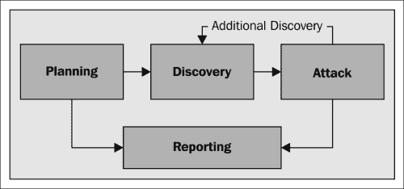

# 一、无线渗透测试简介

在本章中，我们将介绍渗透测试过程的关键概念，特别是无线渗透测试。

渗透测试是模拟对系统或网络的攻击的过程，以指出其错误配置、弱点或安全漏洞及其相关漏洞，这些漏洞可被真正的攻击者用来访问系统或网络。

识别和评估漏洞的过程称为**漏洞评估**，有时被用作渗透测试的同义词，但实际上它们是不同的过程；事实上，渗透测试通常包括漏洞评估和后续攻击阶段，以实际利用发现的漏洞。在某些情况下，根据渗透测试的范围，不需要进行完整的漏洞评估，因为渗透测试可能只关注特定的攻击漏洞。

渗透测试可以是外部测试，也可以是内部测试。外部渗透测试（有时也称为*黑盒*渗透测试）试图模拟真实的外部攻击，而没有事先向渗透测试人员提供有关目标系统和网络的信息，而内部渗透测试（有时也称为*白盒*）由渗透测试人员执行，他们作为内部人员被授予访问权限，试图利用网络漏洞来增加他们的权限，并做他们无权做的事情，例如，发起中间人攻击，我们将在[第 7 章](7.html "Chapter 7. Wireless Client Attacks")、*无线客户端攻击*中看到。

在本书中，我们将主要关注外部渗透测试。

# 渗透测试阶段

渗透测试过程可分为四个主要阶段或阶段，如下：

*   计划
*   发现
*   袭击
*   报告

详细描述这些阶段的渗透测试过程和方法的有用指南是 NIST CSRC SP800-115*信息安全测试和评估技术指南*（见附录的参考第 1.1 节），见 [http://csrc.nist.gov/publications/nistpubs/800-115/SP800-115.pdf](http://csrc.nist.gov/publications/nistpubs/800-115/SP800-115.pdf) 。

四阶段渗透测试方法的方案如下图所示，取自刚刚引用的先前出版物：

我们现在将探索这四个阶段中的每一个。

## 规划阶段

规划阶段是渗透测试的一个关键部分，尽管它并不总是被赋予应有的重要性。在这一阶段，我们定义了渗透测试的范围和所谓的*参与规则*，这是渗透测试人员和客户之间达成的协议的结果，该协议将在双方之间的合同中正式确定。必须明确的是，渗透测试人员不得在没有合同的情况下或在合同规定的范围和参与规则之外操作，否则他/她可能会陷入严重的法律纠纷。范围是关于测试哪些网络以及客户希望通过渗透测试实现的目标。

在这一点上，我们需要考虑，例如，扫描无线网络的区域，要测试的网络的信号覆盖范围，以及它们的大小，它们将被认为是被连接的客户端的数量。我们还定义了测试的目标，如应评估的特定漏洞及其优先级；是否应列举流氓和隐藏的接入点，是否应对客户端进行无线攻击。

除其他外，接洽规则包括预计的时间线以及进行测试的日期和时间、客户的法律授权、生成报告的格式、付款条件和保密协议条款，根据该条款，测试结果由测试人员保密。

### 注

可在附录中参考 1.4 和 1.5 提供的链接上获取定义接洽范围和规则的工作表（需要注册到 SAN Institute 网站）。

一旦确定了参与的范围和规则，渗透测试团队就定义了用于测试执行的资源和工具。

## 发现阶段

在发现阶段，我们收集尽可能多的关于渗透测试范围内网络的信息。该阶段也称为信息收集阶段，非常重要，因为它精确地定义了我们测试的目标，并允许收集有关这些目标的详细信息并暴露其潜在漏洞。

特别是在我们的范围内，我们将收集以下信息：

*   隐藏网络和恶意访问点
*   连接到网络的客户端
*   网络使用的身份验证类型；我们希望找出开放或使用 WEP 的网络，因此，这些网络容易受到攻击
*   可通过无线信号到达的组织外围区域

发现阶段可以通过两种主要类型的无线网络扫描实现，**主动**和**被动**。主动扫描意味着发送探测请求包以识别*可见*接入点，而被动扫描意味着捕获和分析所有无线流量，并允许发现隐藏的接入点。

我们将在[第 3 章](3.html "Chapter 3. WLAN Reconnaissance")、*WLAN 侦察*中了解更多关于无线扫描以及如何使用 Kali Linux 中包含的无线扫描仪，如 airmon、airodump 和 Kismet，来执行无线渗透测试的发现阶段。

## 攻击阶段

攻击阶段是渗透测试过程中最实际的部分，我们试图利用发现阶段发现的漏洞来访问目标网络。

这被称为*攻击*子阶段，在我们的案例中，可能涉及尝试破解身份验证密钥以连接到网络，设置恶意和蜜罐访问点，并直接攻击客户端以恢复密钥。下一阶段（如合同要求）称为*后开发*，涉及在我们获得访问权后对网络和基础设施进行攻击，例如控制接入点，对客户端进行中间人攻击。

值得重申的是，我们绝不应该进行合同中没有明确要求的攻击。此外，攻击阶段应根据交战规则中规定的与客户建立的条款和方式进行。例如，如果目标是生产系统或网络，我们可以与客户约定在工作时间以外进行此类攻击，因为无线连接和提供的服务可能会中断。

我们将涵盖从[第 4 章](4.html "Chapter 4. WEP Cracking")、*WEP 破解*到[第 7 章](7.html "Chapter 7. Wireless Client Attacks")、*无线客户端攻击*的攻击阶段。

## 报告阶段

报告是渗透测试的最后阶段。前几个阶段非常重要，因为它们是我们计划和执行测试的地方，但以有效的方式将测试结果和发现传达给客户仍然很重要。该报告可作为确定应对措施和缓解活动的参考点，以解决已识别的漏洞。它通常由两个主要部分组成，即执行摘要和技术报告。

### 执行摘要

执行总结是对测试目标、方法和结果的高级总结，主要针对非技术管理层。因此，总结应使用清晰的语言和可理解的术语，避免过多的技术术语和表达。

执行摘要应包括：

*   对测试目标的描述
*   对所发现问题的概述和说明
*   客户组织安全风险状况的定义
*   对发现的漏洞进行补救并降低风险的计划
*   改进组织安全态势的建议

### 技术报告

技术报告包括渗透测试的深入描述、发现和攻击阶段发现的详细信息，以及对已识别漏洞给客户带来的风险的评估和风险缓解计划。因此，技术报告涵盖的内容与执行摘要相同，但从技术角度来看，主要针对 it 执行官，他们应随后应用报告中提供的补救活动。

我们将在[第 8 章](8.html "Chapter 8. Reporting and Conclusions")、*报告和结论*中介绍报告阶段。

# 总结

在本章中，我们介绍了无线渗透测试，并简要描述了它分为四个主要阶段：规划、发现、攻击和报告。

在下一章中，我们将看到如何在您的计算机上安装 Kali Linux，并且我们将检查您的无线适配器必须满足的条件，以便开始无线渗透测试。