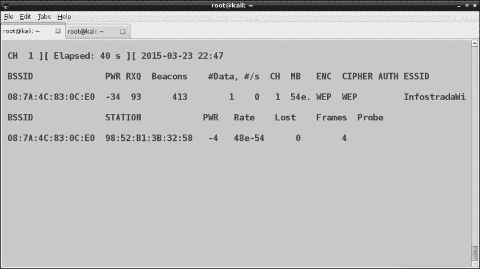
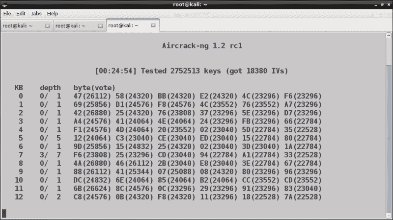
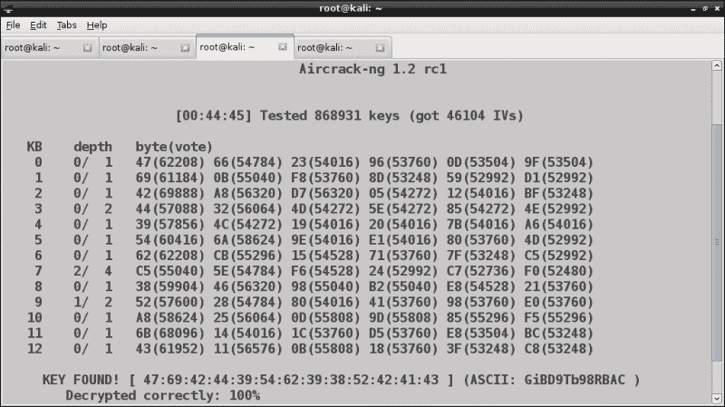
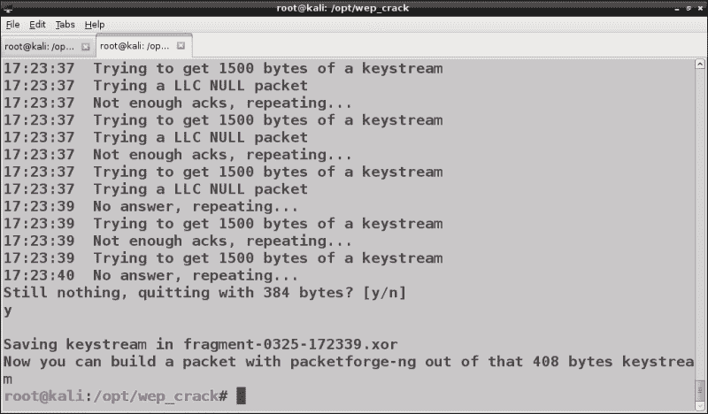
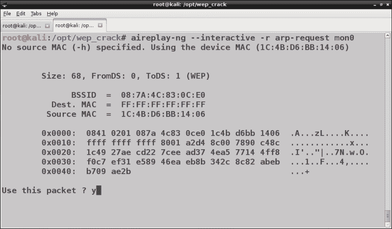
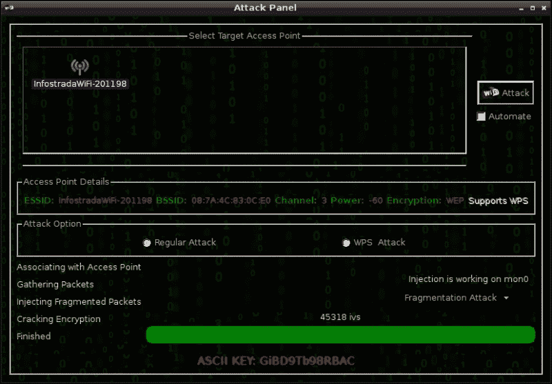
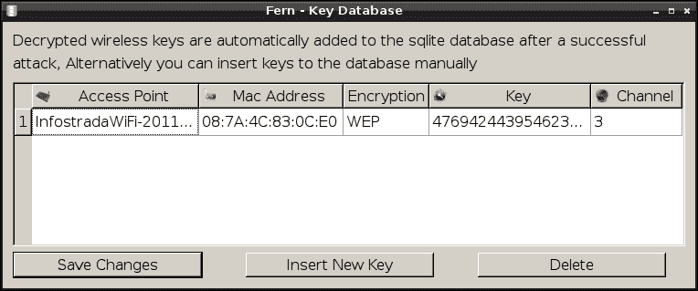

# 四、WEP 破解

在本章中，我们将介绍**有线等效隐私**（**WEP**）协议及其漏洞，展示如何使用 Kali Linux 中包含的一些工具，即 Aircrack ng suite 和 Fern WiFi Cracker 破解 WEP 密钥。

我们将讨论以下主题：

*   WEP 简介
*   带机组 ng 的 WEP 破解
*   使用自动化工具进行 WEP 破解

# WEP 简介

WEP 协议与最初的 802.11 标准一起引入，作为为无线 LAN 实现提供身份验证和加密的一种手段。基于**RC4**（**Rivest Cipher 4**）流密码，具有 40 位或 104 位的**预共享密钥**（**PSK**），具体取决于实现。将 24 位的伪随机**初始化向量**（**IV**）与预共享密钥连接，以生成 RC4 用于实际加密和解密过程的每包密钥流。因此，生成的密钥流可以是 64 位或 128 位长。

在加密阶段，密钥流与明文数据异或以获得加密数据，而在解密阶段，加密数据与密钥流异或以获得明文数据。加密过程如下图所示：


## 针对 WEP 的攻击

首先，我们必须说 WEP 是一种不安全的协议，已经被 Wi-Fi 联盟弃用。它受到与密钥流生成、IVs 使用和密钥长度相关的各种漏洞的影响。

IV 用于向密钥流添加随机性，试图避免重复使用相同的密钥流来加密不同的数据包。在 WEP 的设计中没有实现这一目的，因为 IV 只有 24 位长（2^24=16777216 个可能值），并且在每个帧内以明文形式传输。因此，在一段时间后（取决于网络流量），相同的 IV 和相同的密钥流将被重新使用，从而允许攻击者收集相关的密码文本并执行统计攻击以恢复明文和密钥。

第一次众所周知的针对 WEP 的攻击是 2001 年的 Fluhrer、Mantin 和 Shamir（**FMS**攻击。FMS 攻击依赖于 WEP 生成密钥流的方式，以及它还使用*弱*IVs 生成弱密钥流的事实，使得攻击者能够收集足够数量的使用这些密钥流加密的数据包，对其进行分析并恢复密钥。

为完成 FMS 攻击而收集的 IVs 数量约为 250000（40 位密钥）和 1500000（104 位密钥）。

Korek 增强了 FMS 攻击，提高了其性能。

Andreas Klein 发现 RC4 密钥流和密钥之间的相关性比 Fluhrer、Mantin 和 Shamir 发现的可用于破解 WEP 密钥的相关性要多。

2007 年，**Pyshkin、Tews 和 Weinmann**（**PTW**）扩展了 Andreas Klein 的研究并改进了 FMS 攻击，显著减少了成功恢复 WEP 密钥所需的 IVs 数量。

事实上，PTW 攻击不像 FMS 攻击那样依赖弱 IVs，而且非常快速有效。它能够恢复 104 位 WEP 密钥，使用少于 40000 帧的成功概率为 50%，使用 85000 帧的成功概率为 95%。

PTW 攻击是 Aircrack ng 用来破解 WEP 密钥的默认方法。

FMS 和 PTW 攻击都需要收集大量帧才能成功，并且可以被动地进行，嗅探目标 AP 同一信道上的无线通信量并捕获帧。问题是，在正常情况下，我们将不得不花费相当长的时间被动收集攻击所需的所有数据包，特别是在 FMS 攻击中。

为了加速这一过程，我们的想法是在网络中重新注入帧以产生响应流量，以便我们能够更快地收集必要的 IVs。适用于此目的的一种帧类型是 ARP 请求，因为 AP 广播它，并且每次都使用一个新的 IV。由于我们与 AP 没有关联，如果我们直接向 AP 发送帧，它们将被丢弃，并发送一个取消身份验证帧。相反，我们可以从相关客户端捕获 ARP 请求，并将它们重新传输到 AP。

这种技术被称为**ARP 请求重放**攻击，也是 Aircrack ng 为实施 PTW 攻击而采用的。

### 注

**WEP 纵深攻击**

这些攻击背后的数学和密码学超出了本书的范围。对于那些有兴趣了解攻击细节和技术的人来说，一个有价值的资源是[上的机组 ng 链接和参考页面上的*技术论文*部分 http://www.aircrack-ng.org/doku.php?id=links#technique_papers](http://www.aircrack-ng.org/doku.php?id=links#technique_papers) 。

# 机组 ng 导致 WEP 破解

现在我们已经探索了 WEP 漏洞及其相关攻击，我们准备开始动手部分。在本节中，我们将了解如何使用 Aircrack ng 套件破解 WEP 密钥。

在侦察阶段，我们收集了有关要测试的每个网络的信息，例如 BSSID、它运行的通道以及使用的安全协议。在这里，我们关注一个受 WEP 保护的网络，并开始捕获 AP 和相关客户端在相对信道上交换的帧。

我们可以通过将 Wi-Fi 路由器设置为使用 WEP 来尝试这种攻击。我们假设 AP 的 BSSID 为 08:7A:4C:83:0C:E0，信道为 1。第一步是在通道 1 上启动监视器模式，如前一章所述：

```
airmon-ng start wlan0 1

```

为了捕获目标网络的流量，我们将执行以下命令：

```
airodump-ng --channel 1 --bssid 08:7A:4C:83:0C:E0 --write wep_crack mon0

```



此命令将所有捕获的帧保存到`wep_crack`pcap 文件中。我们将了解在有客户端连接到 AP 和没有客户端时如何破解 WEP 密钥。

## 与连接的客户端破解 WEP 密钥

从前面的屏幕截图中，我们看到有一个客户端（其 MAC 地址为 98:52:B1:3B:32:58）连接到我们的目标 AP。

由于我们与 AP 没有关联，我们自己也不能发送 ARP 请求，所以我们捕获并重新传输该客户端发送的请求。

为此，我们使用 aireplay ng，这是一种设计用于注入帧的工具，它有各种选项来执行不同的攻击，我们将在本书中看到。我们已经在[第 2 章](2.html "Chapter 2. Setting Up Your Machine with Kali Linux")*使用 Kali Linux*设置您的机器时使用了它来测试注射用无线适配器。

要破解 WEP 密钥，我们将执行以下步骤：

1.  We open a new tab in the terminal emulator and run the following command:

    ```
    aireplay-ng --arpreplay -h 98:52:B1:3B:32:58 -b 08:7A:4C:83:0C:E0 mon0

    ```

    这里，`-b`是 BSSID，`- h`是客户端 MAC 地址，`-arpreplay`（或-3）是 ARP 请求重放攻击选项。

    

    我们切换到输出为`airodump-ng`的终端，我们应该注意到捕获的帧数（#Data）快速增加。

2.  After collecting a sufficient number of packets (that is, as we have seen, about 40,000 for the PTW attack implemented by aircrack-ng), we can begin to try cracking the WEP key, starting `aircrack-ng` in a new console tab.

    Aircrack ng 是一种可以从保存在`.cap`文件中的帧中恢复密钥的工具，使用 PTW 攻击作为默认方法。我们运行以下命令：

    ```
    aircrack-ng -b 08:7A:4C:83:0C:E0 wep_crack-01.cap

    ```

    这里`-b`是（像往常一样）BSSID。如果`aircrack-ng`未能破解 WEP 密钥，则等待`airodump-ng`收集更多的 IVs 并重试该过程（默认情况下，每收集 5000 个 IVs）：


在下面的屏幕截图中，我们可以看到`aircrack-ng`试图破解密钥，但捕获的 IVs 数量仍然很少：



最后，返回破解键，以十六进制和 ASCII 显示：



## 在没有连接客户端的情况下破解 WEP 密钥

在本节中，我们将介绍更复杂的情况，即在没有与 AP 关联的客户端的情况下恢复密钥。

由于我们无法回复 ARP 请求帧，我们需要以某种方式模拟 AP 身份验证（假身份验证）。为此，我们执行以下命令：

```
aireplay-ng --fakeauth 0 -o 1 -e InfostradaWiFi-201198 -a 08:7A:4C:83:0C:E0 -h 1C:4B:D6:BB:14:06 mon0

```

这里，`--fakeauth`（或-1）是假认证选项，`0`是以秒为单位的重新关联时间（无延迟），`-o`是每次发送的包数，`-e`是网络 SSID，`-a`是 BSSID，`-h`是`mon0`接口的 MAC 地址：


我们应该看到消息说假身份验证已经成功。如果我们收到一条`Got a deauthentication packet!`消息，可能 AP 应用了 MAC 过滤，只允许访问特定的 MAC 地址。

### 碎裂与斩击

接下来，我们需要找到一种方法来生成用 AP 使用的 WEP 密钥加密的 ARP 请求帧，但是我们没有，我们正在寻找恢复它的方法！

这里有两种攻击可以帮助我们：**碎片**和**斩斩斩**攻击。并非所有的无线设备驱动程序都支持这两种方式，也不是所有的 AP 都能被成功攻击，因此这些攻击可以在其他方式中执行。

即使没有连接客户端，接入点也会发送帧。碎片攻击允许恢复用于加密帧的密钥流（而不是实际密钥），从 AP 传输的单个帧开始。密钥流的最大大小可以等于**MTU**（**最大传输单元**），即 1500 字节。

要执行攻击，我们运行以下命令：

```
aireplay-ng --fragment -b 08:7A:4C:83:0C:E0 -h 1C:4B:D6:BB:14:06 mon0

```


程序捕获来自 AP 的帧，并要求确认是否要使用此数据包。我们确认，然后程序尝试恢复多达 1500 字节的密钥流。当达到足够的字节数（384）时，它要求退出并保存恢复的密钥流。如果我们接受，则输出中出现`Saving keystream in fragment...`消息，攻击成功终止：



然后我们可以继续伪造 ARP 请求，将其注入网络，我们将在下一步看到。否则，我们可以尝试劈砍攻击。

ChopChop 攻击也可以像碎片攻击一样从单个 WEP 加密帧恢复密钥流，但它稍微复杂一些，通常速度较慢，因为它只依赖于密码文本，而不依赖任何已知的纯文本。

要执行它，我们执行以下命令：

```
aireplay-ng --chopchop -b 08:7A:4C:83:0C:E0 -h 1C:4B:D6:BB:14:06 mon0

```

输出将类似于以下屏幕截图：


如果攻击成功，我们注意到密钥流和纯文本被保存。

### 锻造和注射 ARP 请求帧

恢复密钥流后，现在可以使用`packetforge-ng`工具伪造加密的 ARP 请求：

```
packetforge-ng --arp -a 08:7A:4C:83:0C:E0 -h 1C:4B:D6:BB:14:06 -k 192.168.1.100 -l 192.168.1.1 -y fragment-0325-172339.xor -w arp- request

```

这里，`--arp`（或-0）表示 ARP 数据包，`-a`表示 AP 的 MAC 地址，`-h`表示源 MAC 地址，`-k`表示目的 IP 地址，`-l`表示源 IP 地址，`-y`表示密钥流文件（通过之前看到的攻击获得），以及`-w`是我们需要保存生成的 ARP 请求的文件：


一旦我们伪造了 ARP 请求，我们可以向其注入`aireplay-ng`：

```
aireplay-ng --interactive -r arp-request mon0

```

在下面的屏幕截图中，我们可以注意到正在注入的 ARP 请求的细节：



`--interactive`选项允许我们注入我们选择的帧，用`-r`选项指定。

我们切换回`airodump-ng`终端，我们应该观察到捕获帧的数量（#数据）在增加：

当我们有足够的个帧时，我们可以启动`aircrack-ng`处理生成的`pcap`文件并恢复密钥：

```
aircrack-ng -b 08:7A:4C:83:0C:E0 wep_crack-10.cap

```


## 使用自动化工具进行 WEP 破解

在上一节中，我们介绍了使用 Aircrack ng 套件中包含的工具进行 WEP 密钥破解，该套件提供了广泛的选项以及高水平的控制和粒度。对于无线渗透测试人员来说，学习使用这些工具并理解所实施攻击的逻辑是至关重要的。

Kali Linux 中还有其他工具可以自动执行 WEP 破解过程，因此使用起来更方便、快捷。

其中之一是一个名为 Wifite 的 Python 脚本，它使用 Aircrack ng 工具进行密钥破解。我们可以在 Wifite 网站[上下载该程序并阅读文档和使用示例 https://code.google.com/p/wifite/](https://code.google.com/p/wifite/) 。该计划的最新版本可在[上获得 https://github.com/derv82/wifite](https://github.com/derv82/wifite) 。我们将在[第 5 章](5.html "Chapter 5. WPA/WPA2 Cracking")*WPA/WPA2 破解*中介绍 Wifite。

另一个简单而自动化的程序是 Fern WiFi Cracker，我们将在下一步探索它。

## 使用蕨类 WiFi 饼干进行 WEP 破解

Fern WiFi Cracker 是一个用 Python 编写的基于 Qt 库的 GUI 工具，它依赖 Aircrack ng 工具完成底层工作。

它不仅设计为只需点击几下鼠标即可破解 WEP 和 WPA/WPA2 键，还可以对 AP 和客户端执行其他各种无线攻击。

要运行该程序，我们导航到**应用程序菜单****卡利 Linux****无线攻击****802.11 无线工具****蕨类 wifi 饼干**。

GUI 简单直观。在窗口顶部，有一个下拉菜单，列出可用的无线接口。我们选择界面，程序将其置于监控模式：


要扫描无线网络，我们点击**扫描接入点**按钮，除了相关按钮外，我们应该看到检测到的 WEP 或 WPA 加密网络的数量：


我们点击**Wi-Fi WEP**按钮，打开一个窗口，在顶部显示检测到的 WEP 网络。

我们选择我们的目标网络，并在下面的窗格中查看其详细信息。底部是攻击窗格，我们可以在其中选择对网络执行哪种攻击。对于本例，我们选择左侧的**碎片攻击**选项，然后点击右上角的**Wi-Fi 攻击**：


攻击窗格显示了随着捕获的 IVs 数量的增加，攻击的进程：


最后，程序返回窗口底部的破解键（十六进制）。我们可以右键单击它并复制密钥或转换为 ASCII 文本：


完成后，攻击面板将显示 ASCII 键如下：



在主窗口中，我们可以看到**密钥数据库**条目已经填充了我们恢复的密钥：


事实上，在完成攻击后，破解的密钥被保存在 SQLite 数据库中，我们可以通过点击**密钥数据库**按钮查看其详细信息：



# 总结

在本章中，我们介绍了 WEP 协议、为破解密钥而开发的攻击、Aircrack ng 套件以及 Kali Linux 中实现这些攻击的其他自动化工具。

在下一章中，我们将介绍 WPA/WPA2 协议以及用于攻击它的工具。