# 二、配置 Kali——第 1 部分

作为一名未来的道德黑客和/或渗透测试人员，在测试有效负载或练习黑客技能时，确保您不会干扰或对其他人的计算机或网络基础设施（如您的组织）造成任何伤害或损害，这一点非常重要。为了进一步阐述，我们将使用一个简单的类比。假设您在一家名为 ACME（虚构的组织）的公司工作，您是网络/系统管理员。您的 IT 主管注意到您对网络安全感兴趣，并且您在成为渗透测试人员或道德黑客方面具有巨大潜力。因此，他们批准为您提供渗透测试认证方面的官方培训。一旦培训结束，通过**授权培训中心**（**ATC**）进入虚拟实验室的权限通常会终止，这对您来说是一个真正的挑战：培训课程和实验室访问结束后，您将如何练习您的黑客技能？另一个挑战是，在组织的网络上使用黑客技术是侵入性的和非法的。

这使我们认识到建立自己的个人实验室环境对于练习和提高技能的重要性。此外，拥有我们自己的渗透测试实验室将允许我们尝试新的攻击、工具和技术，而无需担心被侵入或在公司网络中造成安全漏洞。最重要的是，在本章中，您将了解构建和设计合适的渗透测试实验室的重要性，以便在 Windows 和 Linux 操作系统上实践各种黑客技术。

在本章中，我们将介绍以下主题：

*   实验室概况
*   建设我们的实验室
*   设置 Kali Linux
*   安装 Nessus
*   设置 Android 模拟器
*   安装 Metasploi 表 2

# 技术要求

要完成本章中的练习，请确保您满足以下硬件和软件要求：

*   Oracle 虚拟机虚拟箱
*   VMware Workstation Pro
*   Kali Linux 2019.2
*   Nessus 漏洞扫描程序
*   Android 操作系统（x86 版本 4.4-r4）
*   表 2

# 实验室概况

在本节中，我们将讨论设计和建立我们自己的渗透测试实验室所需的方法和组件。为了建立我们的实验室，我们将建立一个虚拟实验室基础设施，以确保我们能够节省资金，而不必购买物理计算机和网络设备。

在以下各节中，我们将开始讨论在构建渗透测试实验室环境中使用虚拟化的重要性，因为虚拟化在本章和本书其余部分中扮演着重要角色。之后，我们将深入安装 Kali Linux 并创建一个虚拟网络。

# 虚拟化

根据我作为一名学生、讲师和专业人士的经验，当一个人开始在 IT 领域学习时，他通常认为物理实验室基础设施是绝对必要的。从某种程度上说，这是真的，但是建立物理实验室有很多缺点。

这些不利因素包括但不限于以下方面：

*   存储所需的许多服务器和网络设备所需的物理空间。
*   每个设备的功耗将导致整体较高的财务支出率。
*   构建/购买每个物理设备（无论是网络设备还是服务器）的成本。

这些只是学生或初学者最关心的问题之一。在大多数情况下，一个人只有一台电脑，无论是台式机还是笔记本电脑。**虚拟化**的概念作为对这些不利因素的回应而出现，为 IT 领域打开了许多大门，使许多人和组织能够高效地优化和管理其硬件资源。

*什么是虚拟化，它有什么帮助？*IT 行业中的虚拟化概念允许组织减少对多个物理设备项目的需求，如服务器、网络和安全设备。在早期，需要在单个物理设备上安装操作系统，如 Microsoft Windows Server。通常，类似服务器的设备由一个用于 CPU 的高端处理器、大量 RAM 和大量存储组成。但是，主机操作系统（Microsoft Windows Server）在很多情况下都没有充分利用硬件资源（CPU 和 RAM）。这种资源浪费通常被称为**服务器蔓延**。

下图显示了三台物理服务器，每台服务器都有自己的主机操作系统和可用硬件资源：


要快速查看 Microsoft Windows 操作系统上资源的利用率，只需打开任务管理器并选择“性能”选项卡。下面的屏幕截图是我当前设备的截图。

我们可以看到 CPU、内存和其他资源目前没有得到充分利用；仔细观察**CPU**和**内存**图，我们可以看到它们的使用率不超过 80%-90%，并且不到 50%的容量：


如果我们能够在一个物理设备上运行多个操作系统（如 Windows 和 Linux），该怎么办？我们完全可以利用虚拟化。这将使我们能够使用称为**虚拟机监控程序**的组件，更好地管理和高效地最大化可用资源。

# 管理程序

虚拟机监控程序是虚拟化中最重要的组件。它负责创建一个来宾操作系统用来运行的模拟环境。每种类型的操作系统，无论是为桌面、服务器、网络或移动设备设计的，都需要特定的硬件组件，以确保最佳和无缝的功能。这就是 hypervisor 发挥其魔力使不可能的事情发生的地方，允许您在一台计算机上运行多个不同的操作系统。

虚拟机监控程序可以通过以下两种方式之一安装在硬件设备上，本章稍后将对此进行更详细的探讨：

*   它可以安装在主机操作系统（如 Windows、Linux 或 macOS）上。
*   它可以直接安装在硬件之上，以便作为本机操作系统运行。

**主机操作系统**是指直接安装在设备上的操作系统，如运行 Windows 10 的台式机或笔记本电脑。**来宾操作系统**是安装在虚拟机监控程序中的操作系统（被认为是虚拟化的）。

以下列出了可用的虚拟机监控程序类型：

*   类型 1
*   类型 2

在接下来的两部分中，我们将介绍这两种类型的虚拟机监控程序，并了解它们的相似性和差异。

# 1 型虚拟机监控程序

类型 1 虚拟机监控程序有时被称为**裸机虚拟机监控程序**，因为它通常直接部署到物理服务器的硬件上。在此模型中，安装在虚拟机监控程序上的任何操作系统都可以直接访问硬件资源，例如 CPU、RAM 和**网络接口卡**（**NIC**。该模型允许每个来宾操作系统直接与物理设备上可用的任何硬件组件交互；因此，渲染部署模型比类型 2 模型更有效。

下图说明了每个来宾操作系统（虚拟机）如何通过虚拟机监控程序与单个物理服务器机箱的物理硬件组件交互。例如，虚拟机可以通过虚拟机监控程序直接访问物理硬件：

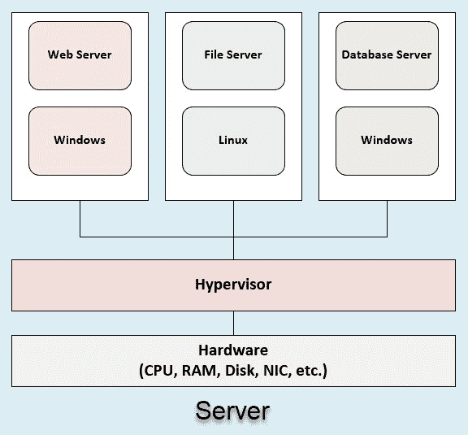

以下是免费和商用 1 型虚拟机监控程序的列表：

*   VMware ESXi（免费）
*   VMware ESX（商用）
*   Microsoft Hyper-V 服务器（免费）
*   XCP ng（免费/商用）

现在，您对 1 型虚拟机监控程序有了更好的了解，让我们了解 2 型虚拟机监控程序。

# 2 型虚拟机监控程序

在 2 型虚拟机监控程序部署模型中，虚拟机监控程序应用程序安装在主机操作系统的顶部，而不是直接安装在硬件组件上。主机操作系统的示例包括 Microsoft Windows、Apple macOS 和各种风格的 Linux。hypervisor 不能像在 type1 部署模型中那样直接访问本地系统上的硬件资源。相反，类型 2 部署中的虚拟机监控程序与主机操作系统接口，以访问任何可用的资源。主机操作系统通常需要一定数量的资源，如 CPU 和 RAM 利用率，以实现最佳功能，其余资源则提供给来宾虚拟机的 Type2 虚拟机监控程序。

下图说明了在单个系统（如台式机或笔记本电脑）上，每个组件如何与其他组件交互。仔细看，每个虚拟机都可以间接访问资源（CPU、内存等）。当涉及到硬件资源时，操作系统将具有优先权，剩下的资源将提供给运行中的虚拟机：


下面是类型 2 虚拟机监控程序的简要列表。请注意，有些是免费的，有些是商业的：

*   Microsoft 虚拟 PC（免费）
*   Oracle VM VirtualBox（免费）
*   VMware Player（免费）
*   VMware Workstation Pro（商用）
*   VMware Fusion（商用）
*   用于 Mac 的 Parallels Desktop（商用）

您可能想知道类型 1 或类型 2 哪个管理程序更好？老实说，这取决于你的情况。就我个人而言，我的笔记本电脑上安装了一个 2 型虚拟机监控程序，其中包含一些虚拟机，我将这些虚拟机用于远程位置的培训和其他情况。在家时，我在家实验室的 Intel NUC 上安装了一个 1 型虚拟机监控程序，它有多个虚拟机，每个虚拟机都有不同的用途。

现在您对虚拟机监控程序的概念有了更好的了解，让我们了解虚拟机监控程序的功能，因为这将帮助我们构建一个虚拟网络来创建渗透测试实验室。

# 附加组件

在本节中，我们将概述完成实验室所需的其他组件，包括查看虚拟交换机是什么以及我们将在实验室中使用的不同类型的操作系统。

# 虚拟交换机

您可能想知道，既然我们将要创建一个虚拟化的实验室环境，那么我们将如何创建一个网络，以确保所有不同的虚拟机都彼此连接。我们需要一些网线、网络交换机甚至其他网络设备吗？最重要的是，我们需要确保我们的虚拟环境与现有网络的其他部分和互联网隔离，因为我们不希望对公共服务器发起无意的攻击，因为这将是非法的，并且会带来法律上的复杂性。

幸运的是，每个虚拟机监控程序都包含一个虚拟交换机，它为我们提供了基本的第 2 层交换功能。一些虚拟机监控程序在其虚拟交换机上提供**虚拟 LAN**（**VLAN**）分配，而其他虚拟机监控程序则不提供。由于我们正在继续构建一个独立的虚拟实验室，所以我们需要一个虚拟交换机来连接攻击者的机器和其他易受攻击的机器。

# 操作系统

作为未来的道德黑客、渗透测试人员或网络安全专业人员，建议您测试各种技术，以模拟对不同类型操作系统的真实攻击。有时，当您在组织的网络和服务器上进行渗透测试或执行漏洞评估时，您会遇到许多不同的操作系统。我们将在实验室环境中使用以下操作系统，我将为每个操作系统提供一个下载链接：

*   **视窗 10**：[https://www.microsoft.com/en-us/evalcenter/evaluate-windows-10-enterprise](https://www.microsoft.com/en-us/evalcenter/evaluate-windows-10-enterprise)
*   **Windows Server 2016**：[https://www.microsoft.com/en-us/evalcenter/evaluate-windows-server-2016](https://www.microsoft.com/en-us/evalcenter/evaluate-windows-server-2016)
*   **Ubuntu 服务器**：[https://www.ubuntu.com/download/server](https://www.ubuntu.com/download/server)
*   **卡利 Linux**：[https://www.kali.org/downloads/](https://www.kali.org/downloads/)
*   **可分解的**：[https://sourceforge.net/projects/metasploitable/files/Metasploitable2/](https://sourceforge.net/projects/metasploitable/files/Metasploitable2/)
*   **OWASPBWA**：[https://sourceforge.net/projects/owaspbwa/](https://sourceforge.net/projects/owaspbwa/)

这里列出的每个操作系统在我们的实验室中都有其独特的用途。在本章的剩余部分中，我们将对每个操作系统执行各种类型的攻击。

微软评估中心（[https://www.microsoft.com/en-us/evalcenter/](https://www.microsoft.com/en-us/evalcenter/) 允许用户下载并试驾其平台上可用的任何应用程序和操作系统，为期 180 天，同时为您选择的应用程序提供全功能支持。

**开放式 Web 应用安全项目**（**OWASP**（[）https://www.owasp.org](https://www.owasp.org) 创建了一个虚拟机，允许网络安全专业人员执行具有已知漏洞的各种应用程序；这是**OWASP 断开的 Web 应用程序**（**OWASPBWA**虚拟机。Metasploitable 是由 Rapid7（[创建的基于 Linux 的易受攻击虚拟机 https://www.rapid7.com](https://www.rapid7.com) 。其目的是帮助人们在安全的环境中学习和实践渗透测试。

在本节中，我们介绍了虚拟化的基本要素，包括核心组件、虚拟机监控程序，现在我们已经准备好构建虚拟实验室环境，以支持许多操作系统和用例。在下一节中，我们将着眼于把所有的部分放在一起，并建立我们的实验室。

# 建设我们的实验室

现在是时候组装所有组件并配置我们自己的渗透测试实验室了。在选择一种管理程序之前，我们需要确定当前可用的资源。如果您当前只有一台笔记本电脑或台式电脑，我们将使用 2 型虚拟机监控程序，如 Oracle VM VirtualBox 或 VMware Workstation Pro。如前所述，2 型虚拟机监控程序部署将允许我们使用现有资源（如单个笔记本电脑或台式电脑）来构建虚拟实验室环境，而无需担心购买额外的硬件组件（如服务器）。

要开始安装虚拟机监控程序，让我们下载并安装 Oracle VM VirtualBox：

1.  进入[www.virtualbox.org](http://www.virtualbox.org)，然后导航至网站下载部分，根据您当前的操作系统选择您的平台类型：


2.  下载应用程序后，就可以安装它了。请确保使用安装向导中提供的默认配置。完成后，打开 VirtualBox 以确保安装成功。您将看到类似于以下屏幕截图的内容：

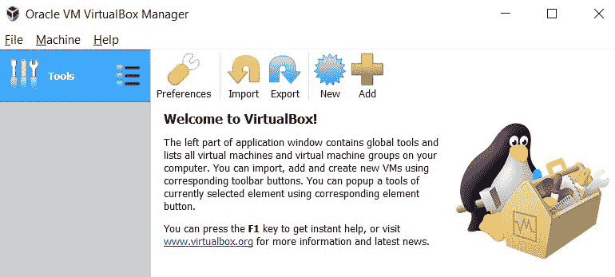

3.  或者，如果您希望在实验室中使用 VMware Workstation，则当前可在[上使用该工作站 https://www.vmware.com/products/workstation-pro.html](https://www.vmware.com/products/workstation-pro.html) 。下载后，在安装过程中使用默认配置继续安装应用程序。完成后，应显示用户界面，如以下屏幕截图所示：


如果您使用的是较旧版本的 Oracle VM VirtualBox 或 VMware Workstation，则无需升级，因为以前的版本已包含继续配置我们的实验室所需的功能。

设计一个合适的渗透测试实验室最重要的事情之一是确保我们拥有互连虚拟机的最佳网络设计。在下一节中，我们将详细介绍如何使用 Oracle VM VirtualBox 和 VMware Workstation Pro 创建虚拟网络。

# 创建虚拟网络

下图显示了我们将在虚拟实验室环境中使用的一般网络拓扑：

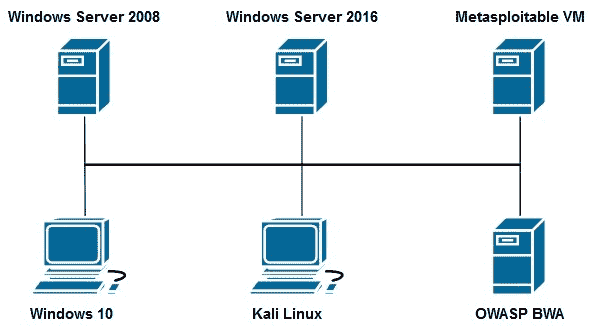

在下一节中，我们将为实验室中的每个虚拟机分配一个适当的 IP 地址。每个虚拟机使用虚拟机监控程序中的虚拟交换机进行互连。路由器是不需要的，因为这只是一个简单的实验室设计。

Windows Server 2008 计算机是可选的，不是必需的。

让我们看看如何构建虚拟网络：

1.  如果您使用的是 VirtualBox，请单击 Tools | Network 右侧的菜单图标：


将打开一个新窗口，您可以选择创建、删除或修改虚拟网络适配器的属性。在本练习中，我们将创建一个新的虚拟适配器，用于连接虚拟机监控程序中的每个虚拟机。这实现了虚拟交换机的效果。

2.  单击“创建”以添加新的虚拟适配器：


主机操作系统将花费几分钟时间在计算机上创建新的虚拟网络适配器。

3.  创建虚拟网络适配器后，VirtualBox 中的 network manager 组件将自动为接口分配 IP 地址。但是，我们将根据我们的偏好配置 IP 寻址方案。首先，只需选择虚拟网络适配器，然后单击属性修改配置。
4.  确保您选择了使用以下屏幕截图中显示的 IP 地址和子网掩码手动配置适配器的选项。单击应用在网络适配器上注册配置：


5.  或者，我们可以在虚拟网络适配器上配置**动态主机配置协议**（**DHCP**服务器，为连接到此虚拟网络的每个虚拟机提供一系列 IP 地址。如果要启用 DHCP 服务，请使用以下配置：

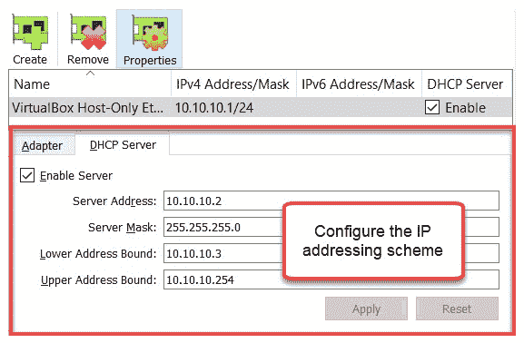

6.  对于那些喜欢 VMware Workstation 的人，我们将为您提供服务。在 VMware Workstation 中配置虚拟网络非常简单。打开 VMware Workstation 应用程序并选择 Edit | Virtual Network Editor…，如以下屏幕截图所示：

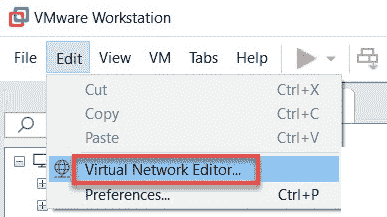

7.  Windows 上的**用户访问控制**（**UAC**会提示您输入管理员权限。提供授权后，虚拟网络编辑器窗口将打开。如您所见，存在三个虚拟网络适配器：


我们将修改 VMnet1 虚拟适配器。仅主机适配器为所有连接的虚拟机和主机创建虚拟网络。这种类型的配置允许所有虚拟机在隔离和没有 internet 连接的情况下无缝通信。

8.  要修改 VMnet1 适配器，请选择适配器并调整配置，如以下屏幕截图所示：

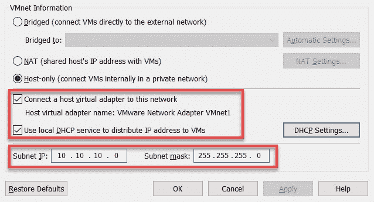

这些配置复制了以前在 Oracle VM VirtualBox 中执行的配置。

现在我们已经掌握了使用 Oracle VM VirtualBox 和 VMware Workstation Pro 构建虚拟网络所需的知识，让我们开始在实验室安装虚拟机并设置 Kali Linux。

# 设置 Kali Linux

让我们设置我们的第一个虚拟机，我们的攻击者机器，Kali Linux。Kali Linux 操作系统是一个基于 Debian 的 Linux 平台，由 300 多个用于渗透测试和取证的工具组成。它是渗透测试人员使用的最流行的平台之一，因为它包含许多特性和相当多的功能，例如：

*   全磁盘加密
*   支持**Linux 统一密钥设置**（**LUKS**）紧急自毁加密（Nuke）
*   辅助功能
*   取证模式
*   具有多个持久性的实时 USB

首先，可以在官方网站（[www.Kali.org](http://www.kali.org)上）和攻击性安全域（[上找到 Kali Linuxhttps://www.offensive-security.com/kali-linux-vm-vmware-virtualbox-image-download/](https://www.offensive-security.com/kali-linux-vm-vmware-virtualbox-image-download/) ）。在设置 Kali Linux 时，有许多方法，例如从 ISO 文件安装和将虚拟预配置映像导入虚拟机监控程序。对于我们的设置过程，我们将使用后一种方法。导入虚拟设备是无缝的，只需很少的时间；它还避免了使用 ISO 文件安装时出现错误配置的机会。

根据我个人的经验，在大多数情况下，使用预配置的虚拟映像设置 Kali Linux 也会更有效。要开始，我们可以采取以下步骤：

1.  导航至[https://www.offensive-security.com/kali-linux-vm-vmware-virtualbox-image-download/](https://www.offensive-security.com/kali-linux-vm-vmware-virtualbox-image-download/) 并根据您的操作系统体系结构下载 32 位或 64 位 Kali Linux VMware 映像。根据虚拟机监控程序软件的供应商选择 VMware 或 VirtualBox 映像：

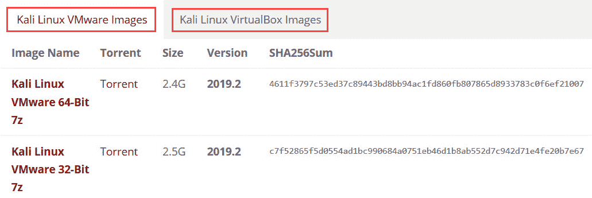

2.  无论您是否下载了 VirtualBox 或 VMware 映像，请确保解压缩内容。如果已下载 VirtualBox 图像，则文件夹中会有一个具有类似命名约定的文件，如以下屏幕截图所示：


3.  您可以右键单击文件并选择使用| VirtualBox Manager 打开：

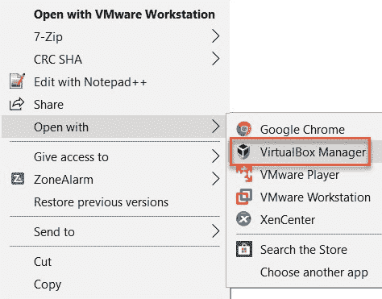

4.  接下来会出现**导入虚拟设备**向导。只需点击导入。导入过程需要几分钟才能完成：


导入过程完成后，您将在 VirtualBox 仪表板上看到新的虚拟机：


5.  将 Kali Linux 导入 VMware 工作站。确保已下载并解压缩虚拟映像文件夹。以下是解压缩文件夹的内容。右键单击以下屏幕截图中突出显示的文件，然后选择“使用| VMware Workstation 打开”：

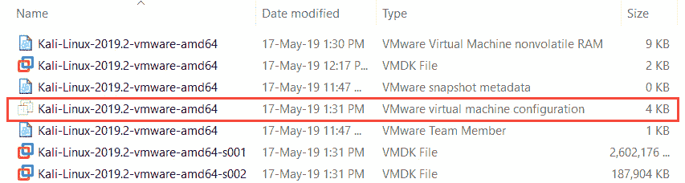

6.  然后，VMware Workstation 将打开，提供“导入虚拟机”窗口。单击导入：


此过程需要几分钟才能完成。完成后，新虚拟机将在 VMware Workstation 上的库中提供：


与使用 ISO 映像手动安装操作系统相比，导入虚拟映像的好处在于所有配置都是自动完成的。配置包括创建用于存储的虚拟硬盘驱动器和资源分配，如处理器、RAM 和 NIC。导入虚拟映像可消除安装阶段出现任何错误配置的机会。导入阶段完成后，用户可以随后对单个虚拟机进行调整，例如增加或减少每个虚拟机的资源。

# 将虚拟网络连接到虚拟机

现在，我们已经创建了虚拟网络适配器，并将 Kali Linux 导入到我们的虚拟机监控程序中。现在是将我们的攻击者机器 Kali Linux 连接到我们的虚拟网络（虚拟交换机）的时候了。

首先，我将指导您通过 Oracle VM VirtualBox 配置硬件资源的步骤：

1.  选择 Kali Linux 虚拟机并单击设置：


2.  设置窗口打开后，选择网络选项。在这里，您可以在当前虚拟机上启用/禁用网络适配器。选择仅主机适配器选项，将在下面自动选择虚拟网络适配器：


3.  接下来，我们将在 VMware Workstation 上进行相同的调整。首先，在 Kali Linux 虚拟机上单击编辑虚拟机设置：

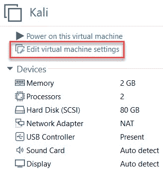

虚拟机设置窗口将打开。在这里，您可以在 hypervisor 菜单中自定义任何硬件组件上的设置。

4.  选择网络适配器，然后选择自定义：特定虚拟网络| VMnet1（仅主机）：


请记住，VMnet1 适配器具有我们的自定义 IP 方案。

5.  我们可以为我们的 Kali Linux 虚拟机通电，以确保其正常工作。Kali Linux 的默认用户名/密码为`root`/`toor`。
6.  成功登录后，您将可以访问桌面：


现在，我们已经清楚地了解了如何在 Oracle VM VirtualBox 和 VMware Workstation 中设置虚拟机，以及如何在每个虚拟机监控程序应用程序中配置虚拟网络。让我们继续在实验室中设置其他应用程序和其他类型的虚拟机。

# 安装 Nessus

当您进入渗透测试和漏洞评估领域时，您必须熟悉的一个工具是**Nessus**。Nessus 是市场上最流行的脆弱性评估工具之一。Nessus 应用程序使用 web 界面进行控制，该界面允许用户创建自定义扫描。此外，Nessus 还包含各种类型行业的预构建扫描模板，如**支付卡行业**（**PCI**合规扫描仪。

Nessus 的创建者 Tenable 表示，Nessus 能够检测 47000 多个**常见漏洞和暴露**（**CVE**）。作为未来的道德黑客/渗透测试人员，在安全审计阶段使用 Nessus 将大大有助于您快速发现安全漏洞。

Nessus 在许多平台上都受支持，如 Windows 和 Kali Linux。**Nessus Home**版免费供个人使用，每次扫描最多可扫描 16 个 IP 地址。要获得 Nessus 家庭版，只需点击[https://www.tenable.com/products/nessus-home](https://www.tenable.com/products/nessus-home) 并填写登记表以获得激活许可证。注册后，您将被重定向到下载中心，在那里您可以为您的平台选择合适的版本：

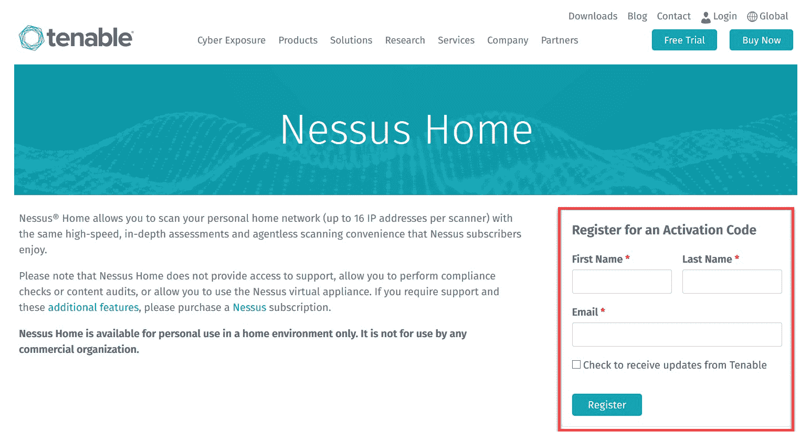

如果您要在 Windows 操作系统上安装 Nessus，过程非常简单。下载 Windows 可执行文件并运行它。

但是，要在 Kali Linux 上安装 Nessus，请执行以下步骤：

1.  打开终端并运行以下命令以升级平台上当前安装的所有应用程序：

```
apt-get update && apt-get upgrade
```

2.  在[填写登记表，从 Tenable 获得激活码 https://www.tenable.com/products/nessus/nessus-essentials](https://www.tenable.com/products/nessus/nessus-essentials) [。](https://www.tenable.com/products/nessus/nessus-essentials) 
3.  导航至 Nessus 下载页面[https://www.tenable.com/downloads/nessus](https://www.tenable.com/downloads/nessus) 并根据您的操作系统架构下载 32 位或 64 位版本：


4.  在 Kali Linux 上下载 Nessus 后，打开终端，将目录更改为`Downloads`文件夹，并使用以下命令开始安装：

```
 dpkg -i Nessus-8.3.1-debian6_amd64.deb
```

运行上述命令的输出如下：


5.  安装完成后，使用以下命令在 Kali Linux 上启动 Nessus 服务：

```
 /etc/init.d/nessusd start 
```

或者，如果希望 Nessus 服务在 Kali Linux 引导过程中自动启动，可以使用以下命令启用此功能：

```
update-rc.d nessusd enable 
```

6.  在 Kali Linux 上完成安装后，在 web 浏览器中输入`https://localhost:8834/`。此时，系统将提示您创建用户帐户：


7.  接下来，系统将提示您输入 Nessus 许可证以激活产品。您需要*步骤 2*中的激活码来完成此阶段：

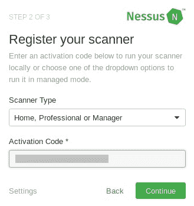

8.  完成激活阶段后，Nessus 将尝试连接到 internet 以下载其他资源。完成此过程需要几分钟：

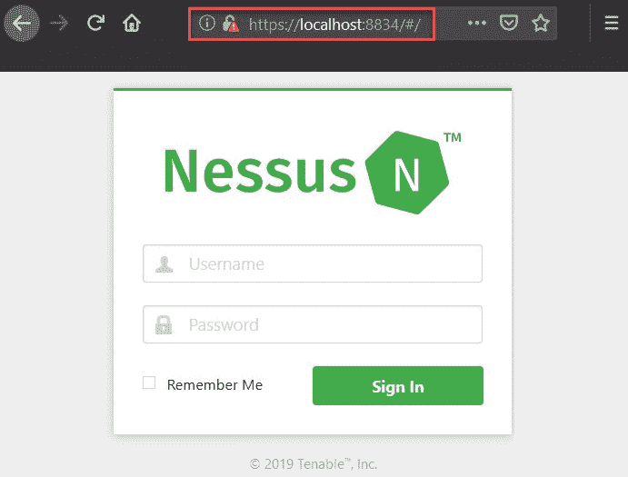

9.  登录后，您的用户仪表板将可用。在这里，您可以创建新的扫描和模板，并根据您的首选项修改现有资源：


在本书中，我们将在渗透测试阶段探索 Nessus 的功能。

完成本节之后，您现在可以在 Kali Linux 上安装和设置 Nessus 漏洞扫描程序。在下一节中，您将学习如何在实验室环境中安装 Android 作为虚拟机。

# 设置 Android 模拟器

作为渗透测试人员和/或道德黑客，您将在该领域遇到许多不同类型的目标和操作系统。进入网络安全领域的一种操作系统是移动平台 Android。在本节中，我们将了解如何将 Android 操作系统 4.4 版设置为虚拟机，该虚拟机将成为渗透测试实验室环境的一部分。

请注意，[www.osboxes.org](http://www.osboxes.org)拥有几乎所有类型操作系统的虚拟映像库，包括台式机、服务器，甚至移动操作系统。此网站允许您下载所选的虚拟映像，并将其无缝加载到虚拟机监控程序（如 Oracle VM VirtualBox 或 VMware Workstation）中。

让我们了解如何在渗透测试实验室中创建虚拟 Android 机器：

1.  首先，进入[https://www.osboxes.org/android-x86/](https://www.osboxes.org/android-x86/) 为您的实验室下载 Android 移动操作系统。
2.  搜索 Android-x86 4.4-r4 版本并下载虚拟机监控程序的 VirtualBox 或 VMware 虚拟映像：


3.  文件下载到桌面计算机后，解压缩文件夹以查看内容。
4.  接下来，右键单击`.ovf`文件并选择打开方式选项，然后选择 VMware 或 VirtualBox 选项，如以下屏幕截图所示：

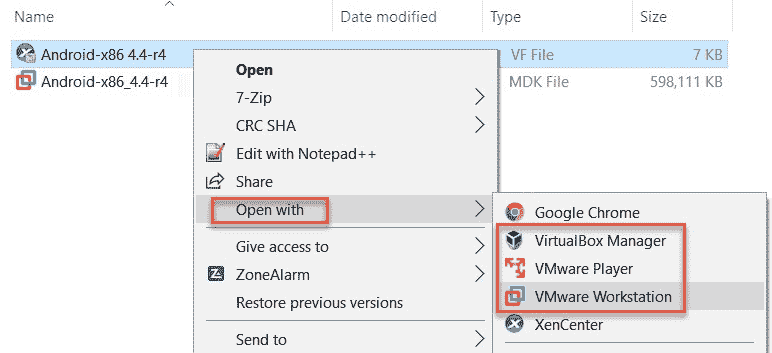

5.  此时将显示导入向导。选择导入以开始该过程：


导入过程需要几分钟才能完成，新的 Android 虚拟机将出现在您的虚拟机监控程序库中。

6.  我选择在我的 Android 虚拟机上使用以下配置。但是，您可以根据需要增加或减少虚拟机上的资源。确保虚拟网络适配器已分配给 Custom（VMnet1），如以下屏幕截图所示：


7.  在启动 Android 虚拟机之后，一旦它完全加载，您将看到一个界面。Android 4.4 的完整功能在您的虚拟机中可用。

一旦安卓虚拟机通电，它将在您的实验室网络上充当真实的物理安卓设备。这模拟了一个不仅具有典型操作系统（如 Windows 和 Linux）的环境，还具有移动平台（如 Android）。既然你的实验室里有一个虚拟 Android 机器，让我们来看看下一节中设置一个易受攻击的基于 Linux 的虚拟机。

# 安装 Metasploi 表 2

如前所述，Metasploitable 虚拟机由团队在 Rapid7（[www.Rapid7.com](http://www.rapid7.com)上创建，用于网络安全意识和培训。在本节中，我将引导您完成在实验室中设置 Metasploitable 虚拟机所涉及的步骤：

1.  首先，您需要从[下载虚拟图像文件 https://sourceforge.net/projects/metasploitable/files/Metasploitable2/](https://sourceforge.net/projects/metasploitable/files/Metasploitable2/) 。下载到计算机后，解压缩 ZIP 文件夹以查看内容。
2.  接下来，右键单击以下突出显示的文件，然后选择要导入的选项或使用您选择的虚拟机监控程序打开的选项：


3.  导入过程完成后，新虚拟机将显示在虚拟机监控程序（VirtualBox 或 VMware）中的库中。确保网络适配器设置为自定义（VMnet1），就像我们实验室的虚拟网络一样：

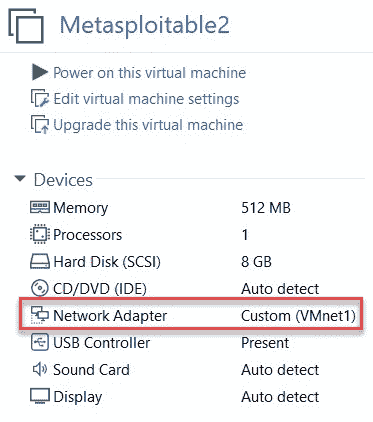

4.  要测试虚拟机，请打开它的电源，然后让它启动。引导过程完成后，您将看到登录凭据（用户名/密码）是系统标题`msfadmin/msfadmin`的一部分：

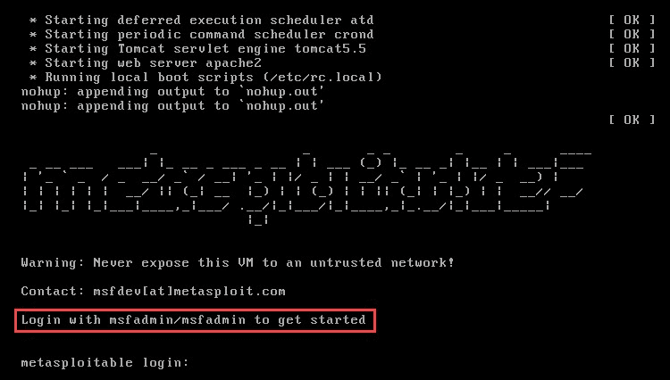

5.  使用凭据登录虚拟机，并使用`ifconfig`命令验证其是否具有有效的 IP 地址：


对于每个虚拟机，请确保已记录 IP 地址。在本书的其余章节中，我将使用的 IP 地址可能与您的略有不同，但操作系统和虚拟机配置将是相同的。

现在，您的实验室中有一个易受攻击的基于 Linux 的操作系统。在练习渗透测试技术和磨练技能时，始终建议在实验室中混合使用各种目标操作系统。此方法允许您了解如何对各种不同的目标执行攻击，这一点很重要，因为企业网络通常混合了许多不同的设备和操作系统。你不想参与渗透测试，因为目标组织主要拥有 Linux 设备，但你的技能只针对基于 Windows 的系统；作为一名渗透测试人员，这将是一个不好的迹象！因此，尽可能在实验室中模拟企业网络将有助于提高技能。

# 总结

在本章中，我们首先讨论了拥有我们自己的独立实验室环境对实施进攻性安全训练的重要性。我们深入研究了虚拟化的概念，并研究了它现在和将来将如何帮助我们。在本章后面，我们将介绍如何在 Oracle VM VirtualBox 和 VMware Workstation 上配置虚拟网络，因为这些网络将用于互连所有虚拟机（攻击者和受害者机器）。然后，我们将 Kali Linux 和 Android 部署到我们的渗透测试实验室。

现在我们已经对设计和构建实验室环境有了基本的了解，让我们在下一章中继续部署基于 Windows 和 Linux 的操作系统。

# 问题

1.  在主机操作系统上安装了哪种类型的虚拟机监控程序？
2.  虚拟化有哪些好处？
3.  免费虚拟机监控程序有哪些示例？
4.  如何在 Kali Linux 中安装脱机软件包/应用程序？
5.  虚拟机监控程序中的操作系统通常称为什么？

# 进一步阅读

建议额外阅读以下链接：

*   **卡利 Linux 文档**：[https://docs.kali.org/](https://docs.kali.org/)
*   **Nessus 用户指南**：[https://docs.tenable.com/Nessus.htm](https://docs.tenable.com/Nessus.htm)
*   **虚拟化**：[https://www.networkworld.com/article/3234795/what-is-virtualization-definition-virtual-machine-hypervisor.html](https://www.networkworld.com/article/3234795/what-is-virtualization-definition-virtual-machine-hypervisor.html)