# 五、被动信息收集

在道德黑客和/或渗透测试方面开始职业生涯是非常令人兴奋的，而且大多数时候，我们的头脑会有点不知所措，导致我们只访问像这样一本书中关于利用系统的章节。然而，进行渗透测试就像在家里开始一个新项目。在你的后院建一个游泳池之前，有几件事你必须考虑，比如可用的空间、材料的成本、承包商的费用和其他细节。信息收集是黑客生命周期和渗透测试的一个非常重要的阶段。

在本章中，我们将重点介绍被动信息收集技术和方法。我们将学习如何通过使用 Kali Linux 上的在线资源和工具，利用互联网获取我们需要的有关目标的信息和具体细节。

我们将讨论以下主题：

*   侦察和足迹
*   理解被动信息收集
*   理解**开源智能**（**OSIT**）
*   使用顶级 OSIT 工具
*   确定目标技术和安全控制
*   查找云资源中的数据泄漏
*   了解 whois 并使用 HTTrack 复制网站
*   使用 Sublist3r 查找子域

亲爱的读者！请确保您**在没有适当**法律许可**的情况下，不会**对任何目标组织、网络或系统执行扫描。

# 技术要求

本章的技术要求如下：

*   **卡利 Linux**：[https://www.kali.org/](https://www.kali.org/)
*   **马尔蒂戈**：[www.paterva.com](http://www.paterva.com)
*   **侦察**：[https://bitbucket.org/LaNMaSteR53/recon-ng](https://bitbucket.org/LaNMaSteR53/recon-ng)
*   **收割机**：[https://github.com/laramies/theHarvester](https://github.com/laramies/theHarvester)
*   **OSR 框架**：[https://github.com/i3visio/osrframework](https://github.com/i3visio/osrframework)
*   **HTTrack**：[www.HTTrack.com](http://www.httrack.com)
*   **子列表 3R**：[https://github.com/aboul3la/Sublist3r](https://github.com/aboul3la/Sublist3r)
*   **S3 扫描仪**：[https://github.com/sa7mon/S3Scanner](https://github.com/sa7mon/S3Scanner)

# 侦察和足迹

黑客攻击的各个阶段包括侦察、扫描、获取访问权限、维护访问权限和清除跟踪。侦察阶段是渗透测试中最重要的阶段，因为这是道德黑客或渗透测试人员进行广泛研究以尽可能多地收集目标信息的阶段。此外，封装外形将有助于创建目标的配置文件，收集配置文件信息，如运行服务、开放端口和操作系统。

我们现在将更详细地研究侦察和足迹。

# 侦察

从军事角度看，侦察是对敌方目标的观察和研究。在网络安全中，作为渗透测试人员，我们使用各种工具和技术收集有关目标组织及其基础设施的详细信息。

侦察在渗透测试领域至关重要。作为一名渗透测试人员，在试图通过攻击获取访问权限之前，我们肯定需要了解我们的目标，以及它的漏洞和操作系统。在侦察阶段收集的信息将有助于我们选择正确的工具和技术来成功利用目标。

侦察可分为两类：

*   **被动**：采用间接进近，不与目标交战
*   **活动**：直接与目标交战，收集具体细节

接下来，我们将深入了解足迹。

# 脚印

足迹是指尽可能多地收集目标相关信息的过程。在 footprinting 中，目标是获得有关目标的具体细节，例如其操作系统和正在运行的应用程序的服务版本。收集的信息可以以各种方式用于访问目标系统、网络或组织。Footprint 允许渗透测试人员了解目标基础设施的安全态势，快速识别目标系统和网络上的安全漏洞，创建组织的网络地图，并将重点区域缩小到特定的 IP 地址、域名，以及所需信息的设备类型。

足迹是侦察阶段的一部分；然而，由于足迹能够提供关于目标的更具体的细节，我们可以认为足迹是侦察阶段的一个子集。下图提供了侦察和足迹如何结合的视觉概述：


以下是足迹的主要目标：

*   收集网络信息（域名、IP 寻址方案和网络协议）
*   收集系统信息（用户名和组名、路由表、系统名称和类型）
*   收集组织信息（员工详细信息、公司目录和位置详细信息）

为了成功获取有关目标的信息，我建议使用以下足迹方法：

*   检查雅虎、必应和谷歌等搜索引擎
*   执行谷歌黑客技术（高级谷歌搜索）
*   通过 Facebook、LinkedIn、Instagram 和 Twitter 等社交媒体平台收集信息
*   公司网站的足迹
*   执行电子邮件示意图技术
*   使用`whois`命令
*   正在执行 DNS 封装
*   网络足迹技术
*   社会工程

您现在可以区分侦察和足迹。在渗透测试过程中，侦察和足迹都是必需的，因为它们都提供了有关目标的重要信息。在下一节中，我们将深入探讨被动信息收集。

# 理解被动信息收集

被动信息收集是指使用间接方法获取有关目标的信息。这种方法从许多来源获得公开的信息，从而消除与潜在目标的直接接触。被动信息收集通常是富有成效的，许多组织通常会发布有关其组织的信息和细节，作为其现有和潜在客户的营销策略。有时，当组织在招聘网站上公布空缺职位时，招聘人员会发布潜在候选人的技术要求。从渗透测试人员的角度来看，技术细节可以指示组织网络基础设施中运行的平台和应用程序的类型。

我们已经介绍了被动信息收集的概念。现在，让我们深入学习下一节中关于 OsIt 的知识。

# 理解 OSIT

如前所述，渗透测试的第一阶段是收集给定目标或组织的尽可能多的信息。在利用和访问网络或系统之前收集信息将有助于渗透测试人员缩小攻击范围，并设计适合目标攻击面的特定类型的攻击和有效载荷。我们将利用现有最大的计算机网络：互联网，开始信息收集阶段。

下图简要概述了在目标上可以找到 OSIT 的不同区域：

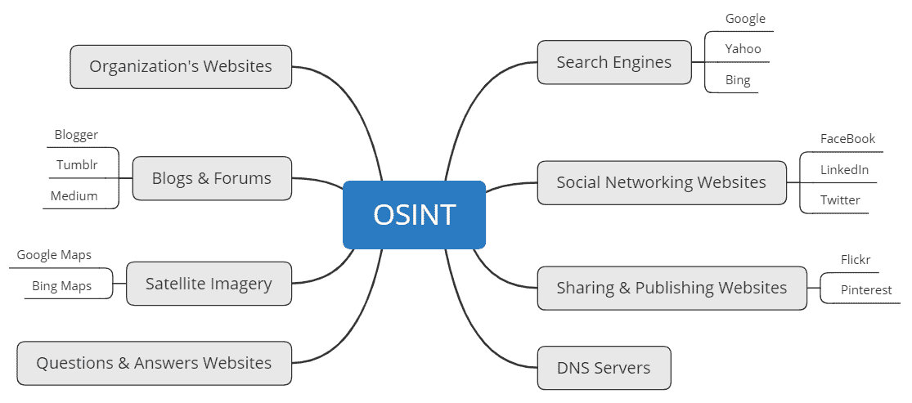

互联网有很多平台，从论坛、消息板到社交媒体平台。许多公司创建了一个在线展示，以帮助向潜在客户推销他们的产品和服务。在这样做的过程中，公司网站 Facebook、Instagram、Twitter、LinkedIn 等的创建确保其潜在客户了解他们是谁以及提供什么服务和产品。市场营销部门通常负责确保组织的在线存在感，并确保其数字产品组合始终是最新和引人注目的。

组织通常在各种互联网平台上发布自己的信息，如博客和招聘网站。由于互联网是如此容易获得和访问，人们很容易通过使用搜索引擎和确定其基础设施来收集目标组织的信息。这种技术被称为**OSIT。**

在这里，渗透测试人员或道德黑客使用各种工具和技术，利用互联网上公开的信息创建目标组合。OSIT 是一种被动信息收集方式，渗透测试仪不直接接触或连接实际目标，而是询问有关目标的合法可靠来源。

多年来，我注意到很多求职网站，招聘人员在网站上发布公司内部 IT 职位空缺，但招聘人员指定理想的应聘者应该具备特定技术方面的经验。这对公司和申请人来说都是一件好事；然而，它也可能是坏的。以下是公司在招聘网站上发布技术的利弊：

以下是优点：

*   潜在的应聘者将知道如果他们被录用，他们将面临什么样的环境。
*   潜在的候选人可以事先确定他们是否具备该工作所需的技能。

这些是缺点：

*   该公司正在向公众部分公开其技术。
*   黑客可以确定基础设施并更好地选择漏洞和工具来执行网络攻击。

让我们来看看下面的截图。仔细观察，我们注意到招聘海报上注明他们同时使用 Cisco 和 HP 网络技术，该公司使用 AVAYA PBX 系统作为其**互联网语音协议**（**VoIP**系统），并且他们在其网络中运行 Windows Server 2008 和/或 2012：

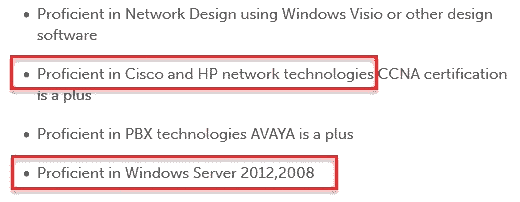

作为渗透测试人员，我们可以看到该公司正在其 IT 基础架构中使用特定类型的技术。从渗透测试人员的角度来看，如果该组织是渗透测试的目标，我们现在可以将攻击范围缩小到这些特定技术。

现在我们已经完成了关于更好地理解 OSIT 的这一部分，让我们深入了解使用 OSIT 工具的实际操作。

# 使用顶级 OSIT 工具

在本节中，我将演示一些可用于 Kali Linux 的最流行的 OSIT 工具。每个工具都将帮助我们使用互联网上的各种信息源创建目标的个人资料。

在接下来的几个小节中，我们将介绍以下 OSIT 工具：

*   马尔蒂戈
*   侦察
*   收割机
*   肖丹
*   OSR 框架

现在，让我们深入研究这些神奇的工具。

# 马尔蒂戈

Maltego 由**Paterva**（[www.Paterva.com](https://www.paterva.com/web7/)创建，是一款图形交互式数据挖掘应用程序，能够在互联网上查询和收集各种来源的信息，并以易于阅读的图形呈现数据。这些图显示了每个实体和目标之间的关系。

要开始，您需要一个用户帐户来访问 Maltego 的功能和特性：

1.  进入[www.paterva.com](https://www.paterva.com/web7/)点击**社区**。将显示一个下拉菜单。点击**注册（免费）**创建用户账号：


2.  创建用户帐户后，请确保在登录之前验证您的电子邮件地址。完成此步骤后，返回您的 Kali Linux 桌面。点击应用程序|收藏夹| Maltego 打开**Maltego**工具，如下图所示：


3.  应用程序打开后，单击 Maltego CE（免费）配置并运行 Maltego 社区版：

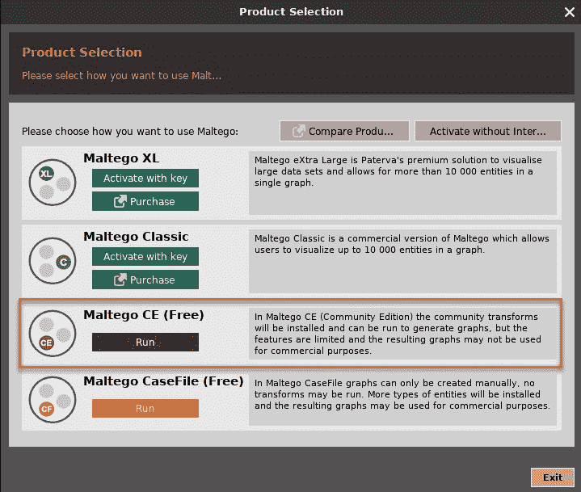

4.  接下来，您将看到 Maltego 配置向导。确保使用之前在 Paterva 网站上创建的相同用户帐户登录，然后单击“下一步”。阅读并按照配置向导接下来几个步骤中的说明进行操作。您可以将所有内容保留在默认状态，然后单击“下一步”，直到流程结束：


5.  一旦配置窗口关闭，将显示通用 Maltego 界面，如以下屏幕截图所示。在起始页上，有许多变换集可以添加到 Maltego。**转换**是一种开源资源，Maltego 可以查询信息。添加变换是可选的：


6.  要开始收集目标组织的信息，我们必须首先打开一个新的图表。为此，单击左上角的 Maltego 图标，然后单击**新建**。创建新图形后，您将在左侧看到各种类型的信息（实体），而在右侧，您将看到概览、详图视图和属性视图。

7.  要添加公司的域，请单击域实体并将其拖动到图形的中心。默认情况下，`paterva.com`将显示为目标域。让我们将域值更改为其他值。在界面左侧，点击**属性视图**。您可以编辑**域名**字段中的值，如下图所示：


8.  一旦域名更改，我们可以继续并解析该域的网站 URL。右键单击域实体，单击所有转换，然后选择网站[快速查找]。此转换将简单地发现网址（参见左侧的屏幕截图）并显示关系（参见右侧的屏幕截图）：


9.  接下来，我们可以尝试获取网站地址的 IP 地址。右键点击网址（[www.google.com](http://www.google.com)）|所有转换|到 IP 地址（DNS）。下面右侧的屏幕截图显示了为[www.google.com](http://www.google.com)解析的 IP 地址。请注意，这是[www.google.com](http://www.google.com)URL 使用的众多 IP 地址之一：


10.  我们可以把这一阶段做得更进一步。发现属于[google.com](http://google.com)域名的**顶级域名**（**TLD**如何？要完成此任务，我们首先右键单击域实体（[google.com](http://google.com)并选择**到域【查找其他 TLD】**，如下面左侧的屏幕截图所示。转换完成后，Maltego 将在图形平面上以树状结构显示信息，如右侧的屏幕截图所示：


11.  现在，收集已注册到域的联系人的电子邮件地址如何？我们可以右键单击 IP 地址实体|所有转换|到电子邮件地址[来自 whois 信息]。如果有任何电子邮件地址，将显示它们，如右侧屏幕截图所示：


12.  此外，我们可以尝试获取域的**名称服务器**（**NSE**）。右键单击域实体（`google.com`）|所有转换|到 DNS 名称–NS（名称服务器）。将显示域的所有 NSE，如右侧屏幕截图所示：。


现在，您对 Maltego 的功能以及如何导航各种转换有了更好的了解。Maltego 的一个很好的特性是图形上的关系映射，可以帮助您分析信息和实体。

完成本节之后，您现在已经熟悉使用 Maltego 收集信息。在下一节中，我们将使用基于 Python 的工具来帮助我们进行被动信息收集。

# 侦察

Recon ng 是一个用 Python 编写的 OSIT 侦察框架。该工具本身具有自己的模块、数据库、交互式帮助和菜单系统，类似于 Metasploit。Recon ng 能够使用各种开源平台执行基于 web 的信息收集技术。

Recon ng 已经是 Kali Linux 中工具库的一部分。进入 Recon ng 界面，只需点击左上角**应用**展开应用菜单，然后选择**01–信息采集**。你应该看看**侦察**。单击它打开框架：

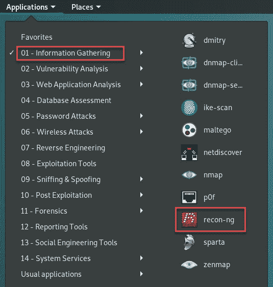

此外，您可以打开 Linux 终端窗口并键入`recon-ng`来运行框架。

要下载并设置最新版本的 Recon ng，请使用以下说明：

1.  在终端上执行以下配置以下载并安装最新版本的 Recon ng：

```
git clone https://github.com/lanmaster53/recon-ng.git
cd recon-ng
pip install -r REQUIREMENTS
./recon-ng
```

完成后，屏幕应类似于以下屏幕截图：

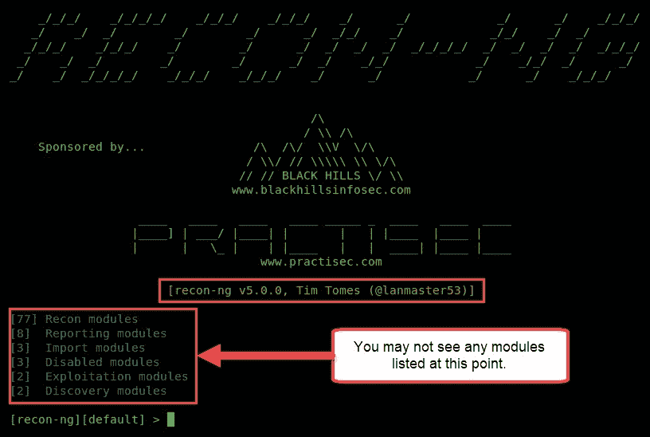

2.  如果未安装或启用任何模块，请使用以下命令将所有模块安装到 Recon ng 上：

```
marketplace install all 
```

或者，您可以使用`modules reload`命令重新加载所有模块。

现在，Recon ng 框架已经打开，让我们使用以下说明熟悉其界面：

1.  要查看**侦察 ng v5**中的所有模块，我们必须使用`modules search`命令查看所有可用模块的列表。所有模块将按其类别（`Discovery`、`Exploitation`、`Recon`、`Reporting`等）显示，如以下屏幕截图所示：

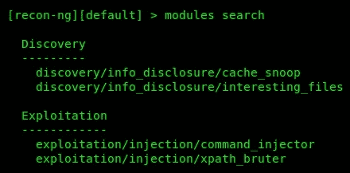

作为渗透测试人员，您可以在整个职业生涯中为多个组织使用相同的工具。我们可以在 Recon ng 中创建工作区，以帮助更有效地隔离项目/数据。如果仔细查看命令行界面，您将看到方括号中的单词`default`。这意味着我们目前处于 Recon ng 的默认工作区内。

2.  要创建工作区，我们可以使用`workspaces create <worksplace-name>`命令。我们将创建一个名为`pentest`的新工作区。使用侦察界面内的`workspaces create pentest`命令。
3.  要查看所有现有工作区并验证新工作区的创建，我们可以使用`workspaces list`命令：

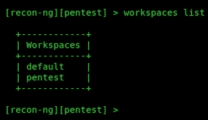

4.  要使用`pentest`工作区，请使用`workspaces select pentest`命令。工作区应在命令行界面上更改。
5.  现在我们已经将一家公司及其域添加到数据库中，让我们搜索一个模块来执行`whois`查找。我们可以使用`modules search whois`命令，其中`whois`是关键字或搜索条件：

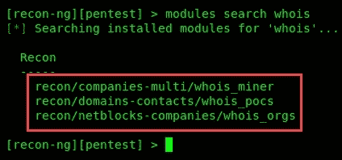

6.  我们将使用**联系人**（**POCS**模块）获取与该领域相关人员的更多详细信息。为此，请执行`modules load recon/domains-contacts/whois_pocs`命令。使用`info`命令将向您提供模块说明以及是否需要其他参数：


`default`值由模块开发者设置；在 Recon ng 中为每个模块设置自己的来源。此外，您可以使用`info`命令查看有关模块的详细信息。`input`命令将列出模块`SOURCE`组件的输入值。`input`命令用于验证特定模块的`SOURCE`值。

7.  让我们将`SOURCE`值设置为`microsoft.com`；这可以通过使用`options set SOURCE microsoft.com`命令来完成，如以下屏幕截图所示：


8.  一旦一切设置正确，使用`run`命令对域执行模块。一旦模块完成分析，我们就可以使用`show contacts`命令查看信息列表，例如一个人的名字和姓氏、电子邮件地址、地区和国家。

如您所见，Recon ng 是一个非常强大的工具，能够很好地处理数据管理。组织通常为许多目的创建子域；有些可以用作登录门户，或者只是用作网站上的另一个目录。

要获取目标的子域列表，请遵循以下步骤：

1.  让我们从使用`modules search site`命令搜索合适的模块开始。Recon ng 将返回一些包含`site`作为其名称一部分的模块。

2.  我们将使用`google_site_web`模块。只需执行`modules load recon/domains-hosts/google_site_web`命令：

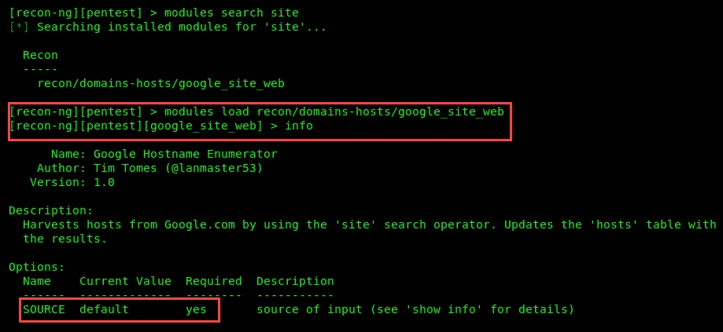

3.  接下来，我们使用`options set SOURCE microsoft.com`命令更改此模块的`SOURCE`值，如下图所示：

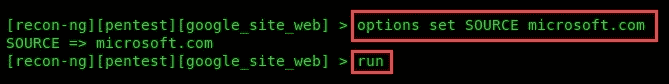

4.  使用`run`命令执行此模块。

5.  模块完成查询后，使用`show hosts`命令查看为`microsoft.com`域找到的子域列表：

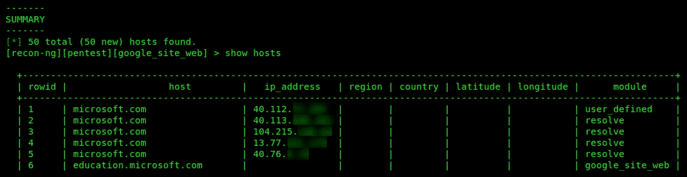

6.  现在，让我们让这更激动人心。获取子域的 IP 地址怎么样？为此，我们将运行`module load recon/domains-hosts/brute_hosts`命令并将`SOURCE`值设置为`microsoft.com`：


7.  模块执行完毕后，再次使用`show host`命令。您应该看到对应于子域的 IP 地址：


作为渗透测试人员，编写报告可能会非常困难，因为报告是在执行各种任务和使用多种工具时执行的操作和获得的结果的总结。Recon ng 有几个报告模块，可以生成多种格式的报告。`dashboard`命令将提供使用 Recon ng 执行的任务摘要，如下所示：


要生成报告，可以使用`modules search report`命令。这将使您可以查看 Recon ng 界面内的报告模块列表。我们将创建一个 HTML 格式的报告。要创建报告，请执行以下步骤：

1.  执行`modules load reporting/html`命令。
2.  使用`options set CREATOR`命令设置报表的创建者。
3.  使用`options set CUSTOMER`命令设置客户。
4.  使用`options set FILENAME`命令设置报告文件名的输出位置。
5.  最后，使用`run`命令执行模块并生成报表。

以下屏幕截图具有与上述使用`reporting/html module`生成和导出报告文件的步骤相对应的标签：

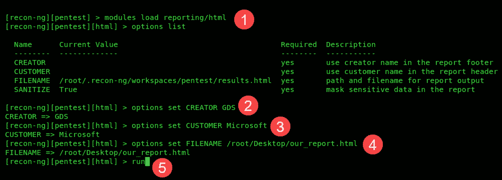

最后，导航到 Kali Linux 机器上的输出位置并打开 HTML 文件。视图应类似于以下内容：


现在，信息被很好地分类和总结以供查看。

在下一节中，我们将了解如何使用**the Harvester**收集与组织相关人员的电子邮件地址。

# 收割机

Harvester 旨在收集给定公司的电子邮件地址、域和员工详细信息。Harvester 使用互联网上的多个开放资源，如搜索引擎，以可读的格式拼凑细节。

有关收割机的更多详细信息，请参见其 GitHub 页面：
 [https://github.com/laramies/theHarvester](https://github.com/laramies/theHarvester)

要开始使用收割机，请执行以下步骤：

1.  打开终端窗口，执行`theharvester`。该工具的描述和使用将显示在终端上，如以下屏幕截图所示：


2.  让我们尝试收集电子邮件地址公开发布的公司员工的电子邮件地址，例如论坛、网站、博客和社交媒体平台。我们可以使用`theharvester –d <domain> –b <data source>`命令来执行此操作。在我们的示例中，我们将搜索`checkpoint.com`域的电子邮件地址，同时使用 Google 作为数据源：

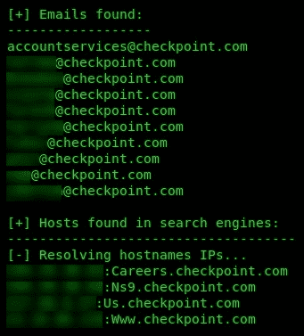

结果为我们提供了该公司一些员工的一些公司电子邮件帐户以及一些子域的 IP 地址。我建议使用各种数据源收集尽可能多的信息。收集公司电子邮件地址的目的之一是执行网络钓鱼攻击。

接下来，我们将使用 Shodan 搜索引擎，索引**物联网**（**物联网**）和其他在线设备来检索关于潜在目标的信息。

# 肖丹

Shodan（[www.Shodan.io](http://www.shodan.io)是一个搜索引擎，对连接到互联网的各种设备进行索引。这是什么意思？为了详细说明，让我们以一个真实的例子来发现某个漏洞级别的设备。2019 年 1 月，黑客新闻（[https://thehackernews.com](https://thehackernews.com) 发表了一篇文章，指出全球有 9000 多台 Cisco SMB RV320 和 RV325 路由器受到新攻击的影响。这些漏洞是 CVE-2019-1652 和 CVE-2019-1653，它们允许恶意人员获取配置文件并控制设备。

本文可在以下网址找到：

[https://thehackernews.com/2019/01/hacking-cisco-routers.html](https://thehackernews.com/2019/01/hacking-cisco-routers.html)

想象一下，你对在互联网上发现所有这种性质的设备感兴趣。使用 Shodan 作为常规搜索引擎，我们可以快速发现多个符合`cisco rv325`搜索条件的设备，如下面的屏幕截图所示。仔细看：我们可以看到在线 Cisco RV325 路由器的列表，它们的 IP 地址、主机名和位置：


结果提供设备和 IP 地址的地理位置信息，以及固件版本等标题信息。在左边，我们可以看到一张全球地图，显示每个国家和组织的互联网连接设备数量。只需点击一个国家、一个组织，甚至一个 IP 地址，就能为我们过滤这些信息。

点击 IP 地址可以更深入地了解所选设备，如主机名、开放端口、运行服务、组织、**互联网服务提供商**（**ISP**）详细信息以及设备易受攻击的漏洞，如以下屏幕截图所示：

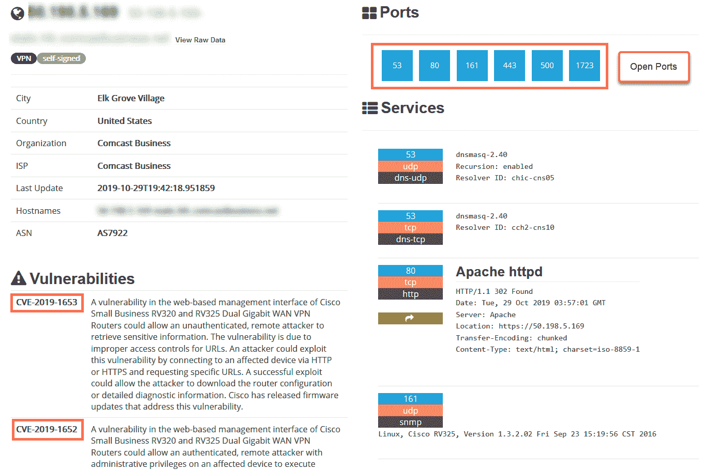

从 Shodan 收集的信息可以帮助您在渗透测试期间建立目标组织的更好的概况，因为它可以为您提供可能的操作系统版本和其他技术细节，您可以使用这些信息成功利用您的目标。简言之，Shodan 可以帮助您确定目标公司组织和 IT 基础架构中的技术和控制系统。

在下一节中，我们将了解**OSR 框架**。

# OSR 框架

另一个很棒的 OSIT 工具是 OSRFramew。此工具集使用用户名、DNS 记录、DeepWeb 搜索等执行查找。

首先，我们可以在终端上执行`osrf`命令，以提供工具本身的使用说明。假设我们需要在社交媒体平台上获取目标公司的公司电子邮件地址列表。以下是 OSR 框架的组成部分，我们可以利用这些组成部分从各种来源收集信息：

*   `domainfy`：检查使用单词和昵称的域名是否可用
*   `entify`：从提供的 URI 中提取使用正则表达式的实体
*   `mailfy`：获取有关电子邮件帐户的信息
*   `checkfy`：验证给定的电子邮件地址是否与模式匹配
*   `phonefy`：通过电话号码查找与垃圾邮件行为相关的信息
*   `searchfy`：在多个平台上进行查询
*   `usufy`：查找具有给定昵称的注册帐户

在第一个示例中，我们可以尝试使用`whois`数据库获取有关目标域的信息。使用`domainfy.py --whois –n <target>`语法，框架将在几分钟后开始查询`whois`并以表格形式提供结果。在我们的示例中，我使用了`domainfy.py --whois –n checkpoint`命令专门检索包含名称`checkpoint`的任何域的信息。

结果如下：


接下来，我们可以尝试获取给定搜索字符串的电子邮件地址。在第二个示例中，我们试图发现包含`checkpoint`字符串的电子邮件地址，该字符串已在 internet 上的各种网站上使用。我们可以使用`mailfy.py –n checkpoint`命令开始。我们将看到一个表格，显示符合我们搜索条件、域和平台位置的电子邮件地址，如以下屏幕截图所示：

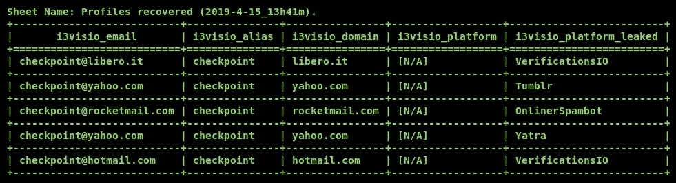

在第三个示例中，我们将使用一个字符串来搜索 OSRFramew 的所有服务。要完成此任务，请在终端上使用`seachfy.py –q string`命令。完成后，将显示结果并告诉您找到的位置、别名和 URL，如以下屏幕截图所示：

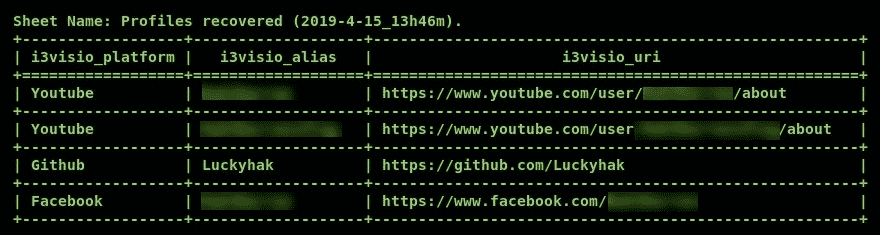

此外，使用 OSR 框架检查电话号码泄漏非常简单。使用**`phonefy.py –n number`**命令，OSRFramew 将开始搜索。以下屏幕截图显示给定电话号码的 URL 位置和平台：


在最后一个示例中，我们可以搜索用户名。使用`usufy.py –n string`命令将允许 OSRFramew 搜索各种在线资源。在本例中，我搜索了`p@55w0rd1`作为用户名，结果如下：

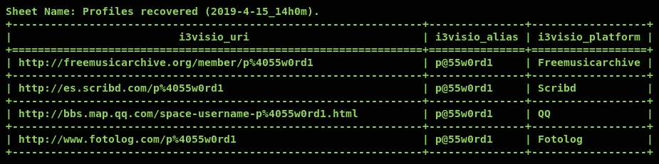

正如您所看到的，OSRFramew 是 Kali Linux 平台中另一个非常强大的工具。使用这样的工具可以在信息收集过程中节省大量时间。

完成本节后，您现在可以使用多个 OSIT 工具收集有关目标组织的特定和详细信息。在下一节中，我们将讨论云资源中的数据泄漏问题。

# 确定目标技术和安全控制

作为渗透测试人员，在执行外部网络渗透测试之前，确定目标网络或组织使用的技术非常重要。在对目标网络或组织进行任何攻击之前，发现目标使用的技术通常非常有用。作为渗透测试人员，它使我们能够更好地为自己配备适当的工具，以便高效、成功地完成工作。想象一下，当你开始一份新的木工工作时，第一天你就没有任何工具，你怎么能期望成功呢？

此外，事先了解目标网络上使用的技术和安全控制将使我们能够通过研究和开发利用目标系统和网络上已知的安全弱点来更好地做好准备。我们将在下面的章节中更详细地研究这个想法。

# 使用 Shodan 发现技术

我们首先将使用 Shodan 来帮助我们发现在目标服务器上运行的技术。请记住，Shodan 是物联网设备的搜索引擎，提供有关连接到互联网的设备的深入信息。

要开始，请遵循以下步骤：

1.  使用您的网络浏览器，进入[https://www.shodan.io](https://www.shodan.io) 。
2.  您可能需要在 Shodan 注册并创建一个帐户以获得更好的结果。
3.  在搜索栏中，输入要搜索设备的组织。以下屏幕截图显示了 Shodan 上的搜索栏：

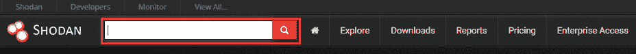

4.  搜索完成后，单击搜索结果中的目标以访问使用 Shodan 找到的信息。

5.  在目标页面上，您将看到开放网络端口、正在运行的服务及其版本以及正在使用的任何技术的列表：

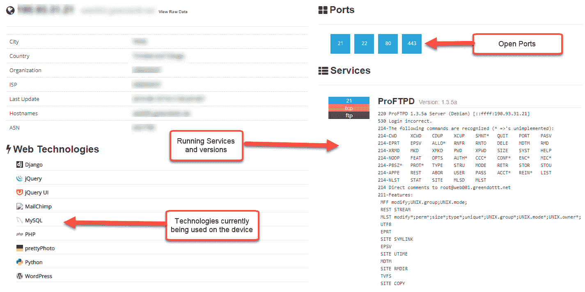

6.  向下滚动一点，如果在目标上发现任何已知漏洞，Shodan 将提供一个包含描述的列表：


在下一节中，我们将使用**Netcraft**收集有关目标 web 服务器底层技术的更详细信息。

# Netcraft 的力量

Netcraft 允许我们收集有关目标域的信息，例如网络块信息、注册信息、电子邮件联系人、托管服务器的操作系统和 web 平台。

要开始，请使用以下说明：

1.  使用您的网络浏览器，进入[https://www.netcraft.com/.](https://www.netcraft.com/)
2.  在以下屏幕截图中突出显示的搜索栏中，输入域：

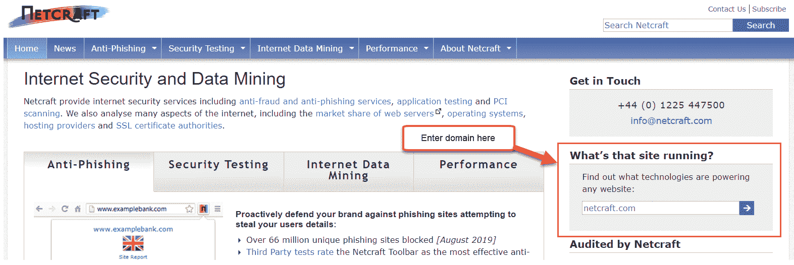

如果搜索没有返回任何内容，请将`www`作为网址的一部分。

3.  结果页面将出现，提供有关目标的网络相关信息。向下滚动一点，直到看到**托管历史记录**。本节为您提供托管服务器的操作系统、web 服务器平台和服务版本，如下所示：

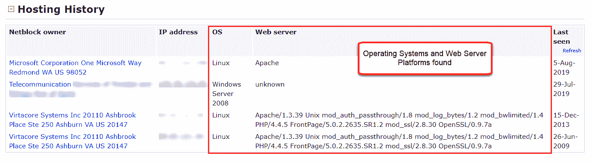

4.  再向下滚动一点，直到看到**站点技术**。本节向您介绍 Netcraft 能够在目标 web 服务器上识别的技术：

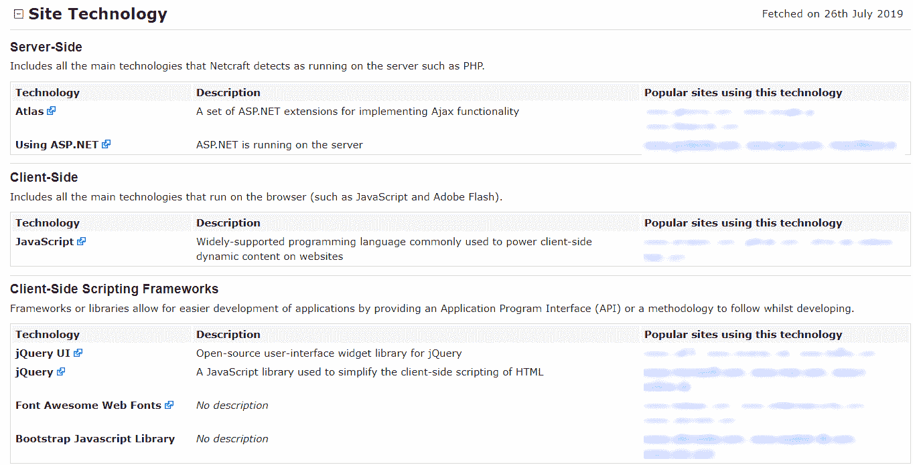

如您所见，Netcraft 能够为我们提供非常有用的信息。我们现在可以获取所发现的信息，并对技术进行进一步研究，以发现已知的漏洞和利用漏洞危害目标。

# 用 WhatWeb 识别技术

最后，我们可以看看在 Kali Linux 中使用**WhatWeb**工具。WhatWeb 能够识别用于网站、电子邮件地址、web 框架和数据库的技术。

要开始使用 WhatWeb，请遵循以下步骤：

1.  打开新终端，输入`whatsweb –h`命令，进入帮助菜单，显示语法。
2.  要针对我们实验室中的目标（如 Metasploitable）运行 WhatWeb，请使用`whatweb <target>`命令，如下所示：


WhatWeb 能够为我们提供在 Metasploitable 虚拟机的 web 服务器平台上使用的技术。

3.  接下来，使用`whatweb –v <target>`命令，提供详细输出，如下所示：


在这里显示的详细输出中，WhatWeb 为我们提供了更多关于所用插件及其结果的详细描述。

在本节中，我们完成了各种练习，旨在帮助我们发现正在目标网络或系统上使用的技术。在下一节中，我们将深入了解云资源。

# 查找云资源中的数据泄漏

在过去几年中，云计算已经成为 IT 行业增长最快的趋势之一。云计算允许公司在云提供商的数据中心内迁移和利用计算资源。云计算提供商有一个现收现付模式，这意味着你只为你使用的资源付费。一些云服务提供商允许每分钟付费计划，而另一些则使用每小时付费结构。

有三大云提供商：

*   **亚马逊网络服务****AWS**：亚马逊云服务
*   **微软 Azure**：微软的云服务
*   **谷歌云平台****GCP**：谷歌的云服务

云提供商通常向客户提供的服务是存储设施。AWS 存储设施称为**简单存储服务**（**S3**。每当客户启用 S3 服务时，就会创建一个 bucket。bucket 是 AWS 平台内的存储单元，客户可以在其中添加或删除文件。在 Microsoft Azure 中，文件存储设施称为**Azure 文件**。此外，在 GCP 上，该存储设施被称为**谷歌云存储**。

在信息安全领域，我们必须记住，当公司使用云平台时，云平台上的数据必须得到安全保护，就像存储在本地（即本地存储）时一样。有时，管理员会忘记启用安全配置，或者缺乏有关云解决方案安全性的知识。例如，这可能导致攻击者发现目标组织的 AWS S3 存储桶。现在让我们来看一个简单的例子。

[http://flaws.cloud/](http://flaws.cloud/) is a website that you can use to learn about cloud security vulnerabilities.

在我们的练习中，我们将使用 S3Scanner 工具。请按照以下步骤开始：

1.  此工具未预先安装在 Kali Linux 中，因此我们需要使用以下命令创建 GitHub 存储库的克隆：

```
git clone https://github.com/sa7mon/S3Scanner.git
```

2.  接下来，使用`cd S3Scanner`命令将目录更改为`S3Scanner`文件夹。
3.  现在，您需要为该工具安装其他依赖项。别担心，开发人员让这一步对我们来说非常容易。要完成此步骤，请使用`pip install -r requirements.txt`命令。
4.  一旦完成，我们现在可以在目标域上使用我们的工具。使用`python ./s3scanner.py domain`语法，工具扫描程序将为 AWS S3 bucket 创建一个域，并确定它是否可访问。
5.  以下屏幕截图显示了如何使用 S3Scanner 检查`flaws.cloud`域上的任何 AWS S3 存储桶：


6.  已在域上找到一个存储桶。此外，您可以在文本文件中创建域列表，并一次查询整个文件。以下是查询`sites.text`文件中存储的多个域的示例：

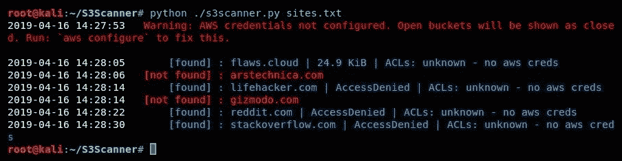

7.  此外，我们可以使用`host`命令解析域的 IP 地址。然后，通过使用带有`ptr`参数的`nslookup`实用程序，可以执行反向查找，这将导致我们获得 AWS S3 bucket 的实际名称，如以下屏幕截图所示：

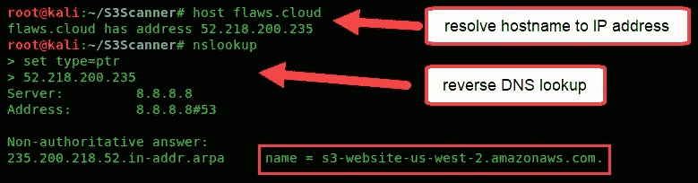

数据泄漏可能发生在任何平台和任何组织上。作为一名即将到来的渗透测试人员和网络安全专业人员，你必须在真正的黑客攻击和利用它们之前知道如何找到它们。公司可以在云平台上存储敏感数据，甚至在云服务提供商网络上完全不保护其他数据。这可以导致成功检索数据和帐户。

# 了解谷歌黑客和搜索运营商

谷歌黑客攻击的概念实际上并不是入侵谷歌的网络基础设施或系统，而是在谷歌搜索引擎中使用高级搜索参数。通过在谷歌搜索栏中插入特殊的搜索操作员，我们可以使用谷歌帮助我们在互联网上查找易受攻击的系统、隐藏信息和资源。

让我们设想一下，您希望使用 Google 搜索引擎查找各种网站，但不希望看到包含某些关键字或短语的结果。我们可以使用`<string of text here> -<keyword>`语法来实现这一点。关键字是要排除的短语或文本。

让我们看一下以下示例：


在我们的示例中，我们正在搜索渗透测试工具。同时，我们告诉谷歌搜索算法不要显示任何包含单词`kali`的结果。此外，我们可以使用`<string of text here> "keyword"`语法查看确实包含关键字的结果。

下表是谷歌搜索运营商的简要列表，也称为**谷歌 dorks**，可帮助您在互联网上查找敏感信息：


此外，攻击性安全（[www.aproval-Security.com](http://www.offensive-security.com)团队维护漏洞数据库（[www.aproval-db.com](https://www.exploit-db.com/)，该数据库有一个专用部分，称为**谷歌黑客数据库**（**GHD**（[）https://www.exploit-db.com/google-hacking-database](https://www.exploit-db.com/google-hacking-database) ). GHD 由社区成员不断更新，并包含许多类别的搜索参数，如以下屏幕截图所示：


每个搜索参数都可以复制并粘贴到 Google search 中，并相应地显示结果。GHD 中的每个条目都包含搜索操作员的简要说明。

以下是用于发现 Cisco**Adaptive Security Appliance**（**ASA**）的搜索参数，该设备具有公开的登录页面：

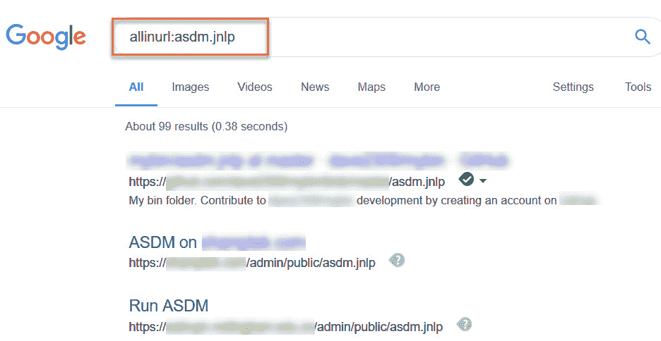

此类敏感信息和隐藏目录可能成为黑客的游乐场；同样，对于渗透测试仪来说，这是一座等待开采的金矿。

我们已经完成了关于谷歌黑客攻击的讨论。在下一节中，我们将尝试使用 Kali Linux 在本地复制网站。

# 利用 whois 和 HTTrack 复制网站

在本节中，我们将了解两个特定的资源。我们将使用 whois 帮助我们从目标域的域注册商处收集联系信息，并使用**HTTrack**在本地复制网站。

让我们深入了解 whois 的功能以及它如何对我们有益。

# 谁

whois 是一个数据库，它记录所有注册域的注册信息。以下是通常存储用于公共记录的一些信息类型的简要列表：

*   注册人联系信息
*   行政联系信息
*   技术联系信息
*   域名解析服务器
*   重要日期，如注册、更新和到期日期
*   注册表域 ID
*   注册信息

访问 whois 数据库非常简单：您可以使用 Google 搜索引擎查找各种数据库。一些 whois 网站包括[www.whois.net](http://www.whois.net)、[whois.domaintools.com](http://whois.domaintools.com/)、[who.is](https://who.is/)和[www.whois.com](http://www.whois.com)。然而，Kali Linux 包含一个内置的 whois 工具。要在域上执行`whois`查找，请执行以下步骤：

1.  打开终端，使用`whois <domain-name>`语法，如下图所示：


2.  输出显示在域的终端上。渗透测试人员可以利用获得的信息对目标组织进行各种类型的攻击。

在下一节中，您将学习如何使用 HTTrack 在本地复制网站。

# 离线浏览工具

HTTrack（[www.htrack.com](http://www.httrack.com)允许我们离线查看整个网站。它通过创建在线网站的克隆副本并将其本地存储在我们的计算机上来实现这一点。要使用 HTTrack，只需打开一个新的终端窗口并执行以下步骤：

1.  执行`httrack`命令调用交互向导。
2.  输入项目的名称。
3.  设置目标路径以存储目标网站的脱机副本。点击*回车*将使用括号中的默认值。
4.  指定 URL。
5.  选择适当的行动。
6.  确认详细信息并启动 HTTrack 以镜像网站。

下面是一个屏幕截图，显示了我们刚才概述的步骤：


克隆网站非常有用，因为您可以发现并访问在线版本无法访问的隐藏资源和文件。作为一名渗透测试人员，您可以彻底探索每个脱机目录；通常情况下，网站管理员通常不会对旧数据和文件进行任何清理，因此会有很多需要探索的地方。

完成本节之后，您就具备了将目标网站复制到 Kali Linux 机器上所需的知识。在下一节中，我们将尝试检索目标域的子域。

# 使用 Sublist3r 查找子域

作为互联网用户，你会意识到，MSN、Google、Yahoo 和 Bing 等多个搜索引擎经常学习和索引新的和现有的网站，以改进其搜索结果。如果你搜索一家公司的网站，你最有可能发现主域名，如`company.com`。然而，许多组织出于各种原因创建子域。作为渗透测试人员，我们希望发现目标组织的所有可能子域，因为它们可能导致登录门户和敏感的公司目录，其中可能包含机密文件和资源。

我们可以使用**子列表 3R**工具，利用搜索引擎的力量完成这项任务。Sublist3r 是一个基于 Python 的工具，用于使用 OSIT 枚举（提取/获取）给定网站的子域，如搜索引擎和其他互联网索引平台。

Sublist3r 工具不是本地安装在 Kali Linux 上的，因此我们需要从其 GitHub 存储库下载它。

要开始，请执行以下步骤：

1.  在 Kali Linux 机器上打开终端并执行以下命令：

```
git clone https://github.com/aboul3la/Sublist3r.git
```

2.  克隆过程完成后，使用`cd Sublist3r`命令将目录更改为`Sublist3r`文件夹。

3.  此时，我们可以使用 Sublist3r 工具使用`python sublist3r.py –d domain-name`命令搜索目标域（公司）的子域。左侧的屏幕截图显示了工具的成功调用，而右侧的屏幕截图显示了在终端上填充的结果：


使用这个工具可以为我们节省大量的时间，而这些时间本可以花在手动搜索互联网上。

现在，您已经了解了如何在 Kali Linux 上使用 Sublist3r 工具有效地发现目标网站的子域。

# 总结

在本章中，我们讨论了在攻击目标之前进行侦察的重要性。在此阶段收集的信息对渗透测试的后续阶段至关重要。信息收集有助于为渗透测试人员研究系统安全和网络开发所需的安全漏洞奠定基础。

我们概述了侦察和足迹之间的区别，并介绍了如何使用各种 OSIT 工具获取有关各种目标的信息。

在下一章*主动信息收集*中，我们将介绍更多关于信息收集的主题。

# 问题

1.  脚印的目的是什么？
2.  哪些 OSIT 工具可用于收集信息？
3.  使用谷歌搜索，您如何查看特定域的搜索结果？
4.  指定一个声誉良好的在线资源，用于研究漏洞。
5.  您对收集目标公司的域注册表信息感兴趣。你会使用什么资源？
6.  如何发现公司网站的子域？

# 进一步阅读

*   **网络应用信息采集**：[https://hub.packtpub.com/web-application-information-gathering/](https://hub.packtpub.com/web-application-information-gathering/)
*   **开源智能**：[https://hub.packtpub.com/open-source-intelligence/](https://hub.packtpub.com/open-source-intelligence/)