# 十五、网站渗透测试——获取访问权限

在本章中，我们将比目前更深入地探讨网站和数据库渗透测试。作为渗透测试人员，我们需要根据交战规则模拟对目标组织系统和网络的真实攻击。然而，虽然能够进行信息收集（如侦察和扫描网站）是非常出色的，但真正的挑战是何时进入。准备潜入敌人的基地是很好的，但是如果你只是站在远处什么也不做，所有的准备都将化为乌有！

在本章中，我们将介绍如何妥协并获得对 web 服务器和 web 应用程序的访问。此外，您还将学习一些实际操作的技术和方法，以发现漏洞和检索数据。

在本章中，我们将介绍以下主题：

*   探索 SQL 注入的危险
*   SQL 注入漏洞及其利用
*   跨站点脚本漏洞
*   自动发现漏洞

# 技术要求

本章的技术要求如下：

*   卡利 Linux:[https://www.kali.org/](https://www.kali.org/)
*   Windows 7、8 或 10
*   OWASP**破网应用**（**BWA**项目：[https://sourceforge.net/projects/owaspbwa/](https://sourceforge.net/projects/owaspbwa/)
*   针剂：[https://www.acunetix.com/](https://www.acunetix.com/)
*   bWAPP:[https://sourceforge.net/projects/bwapp/](https://sourceforge.net/projects/bwapp/)

# 探索 SQL 注入的危险

如前一章所述（[第 14 章](14.html)、*执行网站渗透测试*、**SQL 注入**（**SQLi**）允许攻击者直接将一系列恶意 SQL 代码/查询插入后端数据库服务器。此漏洞允许攻击者通过添加、删除、修改和检索数据库中的条目来操纵记录。

在本节中，我们将介绍以下主题：

*   SQL 注入漏洞带来的危险
*   使用 SQL 注入漏洞绕过登录

现在，让我们详细了解 SQL 注入的危险。

# SQL 注入漏洞带来的危险

成功的 SQL 注入攻击可导致以下情况：

*   **认证旁路**：允许用户在没有有效凭证或权限的情况下访问系统
*   **信息披露**：允许用户获取敏感信息
*   **数据完整性受损**：允许用户操作数据库中的数据
*   **数据可用性受损**：阻止合法用户访问系统上的数据
*   **在受损系统上远程执行代码**：允许恶意用户远程在系统上运行恶意代码

接下来，让我们来看看如何使用 SQL 注入绕过登录。

# 使用 SQL 注入绕过登录

在本练习中，我们将使用 OWASP BWA 虚拟机演示如何使用 SQL 注入绕过身份验证。要启动，请打开 OWASP BWA 虚拟机的电源。几分钟后，虚拟机将向您提供其 IP 地址。

前往您的 Kali Linux（攻击者）机器，并按照以下步骤操作：

1.  在 Kali Linux 的 web 浏览器中输入 OWASP BWA 虚拟机的 IP 地址。
2.  点击**OWASP Mutillidae II**应用程序，如下所示：


3.  导航到以下页面：OWASP 2013 | A2-中断的身份验证和会话管理|身份验证绕过|通过 SQL 注入|登录：

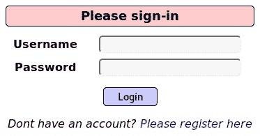

4.  在**用户名**字段中输入以下任一字符：
    *   `**'**`
    *   `**/**`
    *   `**--**`
    *   `**\**`
    *   `**.**`

如果发生错误，请检查服务器生成的消息。

如果网站的登录页面没有出现错误，请尝试使用正确或错误的语句，例如`1=1 --`或**`1=0 --`**。

当我们运行此程序时，应该会出现类似于以下错误的情况。如果仔细观察，可以看到 web 服务器应用程序和数据库之间使用的查询`SELECT username FROM accounts WHERE username= ' ' ' ;`，如下所示：

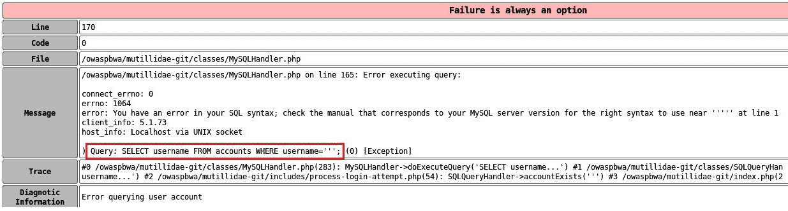

可以通过 SQL 查询确定以下内容：

`INSERT`命令用于添加数据。`UPDATE`用于更新数据，`DELETE`或`DROP`用于删除数据，`MERGE`用于合并表和/或数据库中的数据。

5.  让我们尝试合并一些语句。在**用户名**字段中使用**`' or 1=1 --`**（在`--`之后有空格）语句，然后点击**登录**：

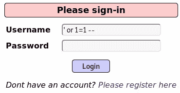

语句选择表中的第一条记录并返回它。在检查登录状态后，我们可以看到我们现在以`admin`的身份登录。这意味着第一条记录是`admin`：

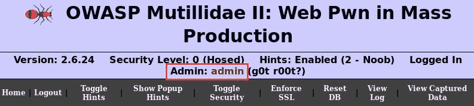

语句选择表中的第一条记录并返回值，即`admin`。

6.  让我们尝试另一个用户并稍微修改一下代码。我们将尝试以用户`john`身份登录。在用户名字段中插入用户名`john`，在密码字段中插入以下 SQL 命令：

```
' or (1=1 and username = 'john') --
```

确保双连字符（`--`后有空格，点击**登录**执行命令。以下截图显示我们能够以用户`john`的身份成功登录：

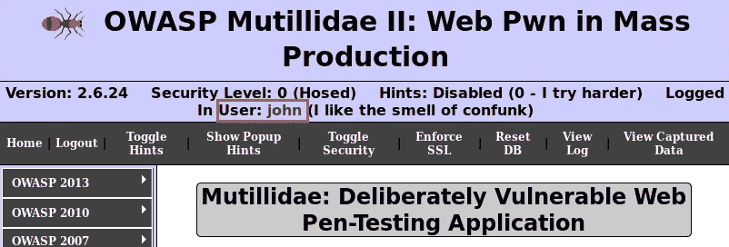

您可以使用这些技术在 web 服务器上使用 SQL 注入攻击绕过身份验证。在下一节中，我们将介绍 SQL 注入漏洞和漏洞利用。

# SQL 注入漏洞及其利用

在本节中，我们将探讨以下使用 SQL 注入的漏洞和利用漏洞：

*   使用 GET 发现 SQL 注入
*   读取数据库信息
*   查找数据库表
*   提取敏感数据，如密码

要使用 GET 开始发现 SQL 注入，请使用以下说明：

1.  打开 OWASP BWA 虚拟机的电源。几分钟后，虚拟机将向您提供其 IP 地址。
2.  前往您的 Kali Linux（攻击者）计算机，并在 Kali Linux 的 web 浏览器中输入 OWASP BWA 虚拟机的 IP 地址。
3.  点击**bWAPP**应用程序，如下图：


4.  使用`bee`作为用户名，使用`bug`作为密码登录应用程序。然后单击登录：


5.  如图所示选择**SQL 注入（搜索/获取）**选项，点击**Hack**继续：


6.  将出现一个搜索框和表。在搜索字段中输入数据时，GET 请求用于从 SQL 数据库检索信息并将其显示在网页上。现在，让我们搜索包含字符串`war`的所有电影：

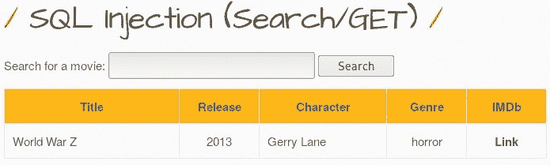

**Disclaimer**: The information visible in the preceding screenshot was retrieved from the locally stored database inside the Metasploitable virtual machine; specifically, it is within the bWAPP vulnerable web application section. Additionally, the virtual machines used are on an isolated virtual network.

仔细查看 web 浏览器中的 URL，我们可以看到`sqli_1.php?title=war&action=search`用于从数据库返回/显示结果。

7.  如果在搜索字段中使用`1'`字符，使用`sqli_1.php?title=1'&action=search`时会出现如下错误：


此错误表示目标易受 SQL 注入攻击。错误表明我们在搜索字段中插入的语法有问题。此外，该错误还表明该数据库是 MySQL 服务器。此类泄露性错误不应以这种方式告知用户。数据库错误只能由数据库管理员/开发人员或其他负责人访问。这是 web 应用程序和数据库服务器之间配置错误的迹象。

8.  将 URL 调整为`http://192.168.56.101/bWAPP/sqli_1.php?title=1' order by 7-- -`，我们得到如下响应：


输出表明至少有七个表。我们可以通过在 URL 中使用`order by 7-- -`来判断这一点。请注意，在下一步中，当我们调整 URL 以检查其他表时，会出现一个错误。

9.  让我们使用以下 URL 检查是否有八个表：`http://192.168.56.101/bWAPP/sqli_1.php?title=1' order by 8-- -`。如我们所见，返回了一条错误消息：

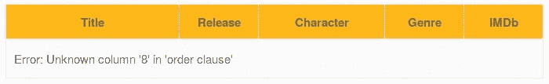

因此，我们可以确认我们有七个表。

10.  现在，我们可以将 URL 调整为`http://192.168.56.101/bWAPP/sqli_1.php?title=1' union select 1,2,3,4,5,6,7-- -`。下面的屏幕截图显示了结果。web 应用程序（bWAPP）返回同一行中的值`2`、`3`、`5`和`4`。因此，我们可以确定表`2`、`3`、`4`和`5`容易受到攻击：


11.  为了检查数据库版本，我们可以在下面的 URL 中用`@@version`代替易受攻击的表，得到`http://192.168.56.101/bWAPP/sqli_1.php?title=1' union select 1, @@version,3,4,5,6,7-- -`：


12.  我们现在可以尝试使用以下 URL`http://192.168.56.101/bWAPP/sqli_1.php?title=1' union select 1,table_name,3,4,5,6,7 from information_schema.tables-- -`获取表名：


现在，我们有了数据库中的所有表。以下表格由开发人员创建：


13.  我们现在将尝试从`users`表中检索用户凭据。首先，我们需要从 users 表中获取列的名称。使用 PHP magic 方法可能会遇到一个小问题：该错误不允许我们在 PHP magic 方法中插入/查询字符串。例如，如果在 URL 中插入`users`字符串，我们将无法从`users`表中检索信息，这意味着数据库不会返回任何列。要绕过此错误，请将`users`字符串转换为 ASCII。`users`的 ASCII 值为**117 115 101 114 115**。
14.  现在，我们只能从`users`表中检索列。我们可以使用以下 URL:`http://192.168.56.101/bWAPP/sqli_1.php?title=1' union select 1,column_name,3,4,5,6,7 from information_schema.columns where table_name=char(117,115,101,114,115)-- -`：


`Char()` allows SQL injection to insert statements in MySQL without using double quotes (`""`).

15.  使用`http://192.168.56.101/bWAPP/sqli_1.php?title=1' union select 1,login,3,4,5,6,7 from users-- -`可以查看`users`表的`email`列，如*步骤 14*所述：


16.  要检索密码，请将 URL 调整为`http://192.168.56.101/bWAPP/sqli_1.php?title=1' union select 1,password,3,4,5,6,7 from users-- -`：


17.  现在，我们有了密码的散列。我们可以使用在线或离线哈希标识符来确定哈希类型：


18.  此外，您还可以使用在线散列解码器，例如**CrackStation**（[https://crackstation.net/](https://crackstation.net/) ）进行解密：


通过在 web 浏览器的 URL 中操作 SQL 语句，我们已成功地从 SQL server 检索到用户凭据。

在下一节中，我们将学习如何在目标服务器上使用 POST 检测 SQL 注入。

# 使用 POST 发现 SQL 注入

在本练习中，我们将尝试发现 POST 是否可以进行 SQL 注入。**POST**方法用于向 web 服务器发送数据。此方法与用于检索数据或资源的**GET**方法不同。我们将使用以下拓扑来完成此练习：


要开始使用 POST 检测 SQL 注入，请使用以下说明：

1.  在 Kali Linux 计算机上启用 Burp 代理，并确认您的 web 浏览器代理设置正确。如果您不确定，请参阅[第 7 章](07.html)、*使用漏洞扫描器*，特别是*打嗝套件*部分，其中包含在 Kali Linux 机器上配置打嗝套件所需的所有详细信息。

2.  确保在 Burp 套件上启用了**拦截**，如下所示：


3.  在 Kali Linux 上打开 web 浏览器，并在地址栏中输入 OWASP BWA IP 地址。

确保定期单击 Burp Suite 上的**转发**按钮，在 Kali Linux web 浏览器和 OWASP BWA web 服务器之间转发数据。

4.  点击**bWAPP**，如下图所示。使用凭证`bee`（用户名）和`bug`（密码）登录**bWAPP**门户。请注意，这些是**bWAPP**虚拟机的默认用户凭据：

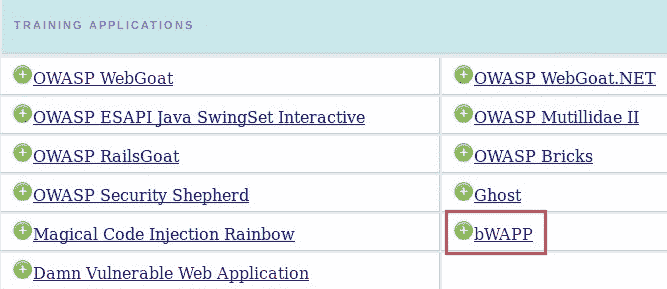

5.  在右上角，使用下拉菜单选择**SQL 注入（搜索/发布）**，然后点击**黑客**加载漏洞：


6.  在搜索字段中输入一个单词，点击**搜索**提交（发布）数据：


数据库将通过声明是否找到电影来响应。

7.  在 Burp Suite 上，选择目标站点地图选项卡以查看 Kali Linux 上的 web 浏览器和 OWASP BWA web 服务器之间的所有**获取**和**发布**消息。
8.  选择最近的**POST**消息，该消息应包含您刚才执行的搜索：


以下为本**帖子**的内容：


9.  在`Raw`内容窗口的任意位置单击鼠标右键，选择**保存项目**选项。在 Kali Linux 中，将桌面上的文件另存为`postdata.txt`。
10.  成功保存文件后，让我们使用 SQLmap 在目标服务器上发现 POST 中的任何 SQL 注入（SQLi）漏洞。使用以下命令执行此任务：

```
sqlmap –r /root/Desktop/postdata.txt
```

11.  SQLmap 将尝试检查任何/所有`POST`参数，并确定应用程序是否易受攻击。以下显示了一些可能的漏洞：


在前面的屏幕截图中，SQLmap 能够注意到`'title'`参数可能有漏洞，数据库也可能是 MySQL 平台。此外，以下是已找到的可注入参数的示例：


前面的屏幕截图显示，SQLmap 已确定`'title'`参数也容易受到 SQL 注入攻击。最后，以下是 SQLmap 有效负载：

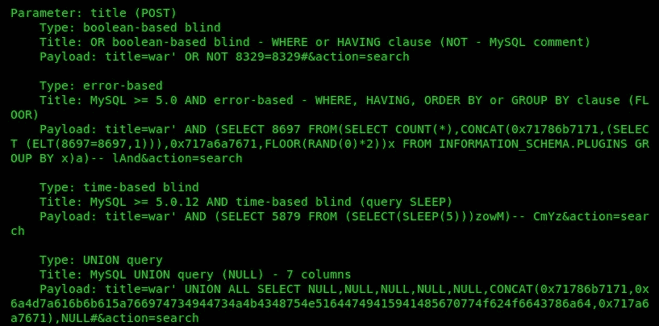

在这里，SQLmap 为我们提供了一些关于测试内容、测试方式和结果的总结。通过**SQLmap**提供给我们的信息，我们确切地知道目标网站在哪里容易受到 POST 的 SQLi 攻击，以及如何利用特定有效负载的弱点。

完成此练习后，您现在可以使用 Burp 套件和 SQLmap 来发现 POST 消息中的 SQL 注入漏洞。

在下一节中，您将学习如何使用 SQLmap 工具来发现 SQL 注入。

# 使用 SQLmap 检测 SQL 注入和提取数据

SQLmap 是一种自动 SQL 注入工具，它允许渗透测试人员发现漏洞、执行漏洞攻击、操纵记录以及从数据库检索数据。

要使用 SQLmap 执行扫描，请使用以下命令：

```
sqlmap –u "http://website_URL_here"
```

此外，以下参数可用于执行各种任务：

*   `--dbms=database_type`：执行后端暴力攻击。一个例子是`--dbms=mysql`。
*   `--current-user`：检索当前数据库用户。
*   `--passwords`：枚举密码哈希。
*   `--tables`：枚举数据库中的表。
*   `--columns`：枚举表中的列。
*   `--dump`：转储数据表条目。

在下一节中，我们将讨论防止 SQL 注入的方法。

# 防止 SQL 注入

在本节中，我们将简要介绍一些基本技术，以最小化和防止对系统的 SQL 注入攻击。我们还将以简单的形式介绍最佳实践。

以下技术可用于防止 SQL 注入攻击：

*   以最低权限运行数据库服务。
*   使用**web 应用程序防火墙**（**WAF**或 IDS/IPS 监控所有数据库流量。
*   清理数据。
*   过滤所有客户端数据。
*   抑制用户端上的错误消息。
*   使用自定义错误消息而不是默认消息。
*   使用安全的 API。
*   在数据库服务器上执行常规黑盒渗透。
*   使用用户输入上的参数集合强制执行类型和长度检查；这会阻止代码执行。

在下一节中，我们将了解**跨站点脚本**（**XSS**漏洞。

# 跨站点脚本漏洞

如前一章所述，XSS 允许攻击者将客户端脚本注入到其他用户查看的网页中。因此，当不知情的用户访问包含恶意脚本的网页时，受害者的浏览器将在后台自动执行这些恶意脚本。

在本节中，我们将介绍如何通过查看以下主题来发现各种 XSS 漏洞：

*   理解 XSS
*   发现反射 XSS
*   发现存储的 XSS
*   利用 XSS–将易受攻击的页面访问者与 BeEF 挂钩

在下一节中，我们将了解什么是 XSS。

# 理解 XSS

如前一章所述，XSS 攻击是通过利用动态创建的网页中的漏洞进行的。这允许攻击者将客户端脚本注入其他用户查看的网页。当一个不知情的用户访问一个包含 XSS 的网页时，用户的浏览器将在后台开始执行恶意脚本，而受害者没有意识到。

在以下练习中，我们将在 OWASP BWA 虚拟机上同时使用**WebGoat**和**bWAPP**：

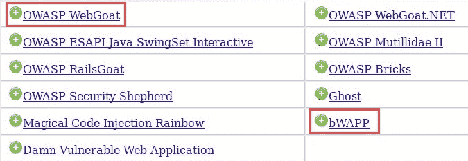

**WebGoat**的用户名/密码为`guest`/`guest`。**bWAPP**的用户名/密码为`bee`/`bug`。

接下来，我们将看一看反射的 XSS。

# 发现反射 XSS

在反射的 XSS 攻击中，数据被插入，然后反射回网页。在本练习中，我们将介绍在目标服务器上发现反射的 XSS 漏洞的过程。

要完成此任务，请执行以下说明：

1.  导航至**bWAPP**应用程序并登录。
2.  选择**跨站点脚本-反射（获取）**并点击**黑客**以启用此漏洞页面：


3.  不在表单中输入任何详细信息，点击**进入**。查看 web 浏览器地址栏中的 URL，您可以看到 URL 可以编辑：


4.  为了测试该字段是否容易受到反射 XSS 的攻击，我们可以在**First name**字段中插入自定义 JavaScript。插入以下 JavaScript：

```
<script>alert("Testing Reflected XSS")
```

在**姓氏**字段中，使用以下命令关闭脚本：

```
</script>
```

以下屏幕截图显示了您需要执行的操作：

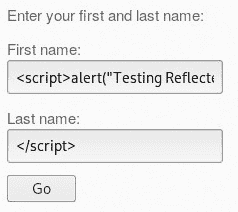

5.  点击**Go**在服务器上执行脚本。将出现以下弹出窗口：

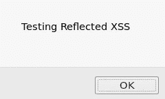

这表示脚本在目标服务器上运行时没有任何问题；因此，服务器容易受到 XSS 攻击。

在下一节中，我们将研究存储的 XS。

# 发现存储的 XSS

在存储的 XSS 中，渗透测试仪注入将存储在目标数据库中的恶意代码。

在本练习中，我们将介绍发现目标服务器上存储的 XSS 漏洞的过程。

要完成此任务，请使用以下说明：

1.  导航到 bWAPP 应用程序并登录。
2.  选择**跨站点脚本-存储（博客）**并点击**黑客**以启用此漏洞页面：


3.  您可以在文本字段中输入任何消息，然后单击提交。输入的文本现在将存储在数据库中，如在线留言板、论坛或带有评论部分的网站：

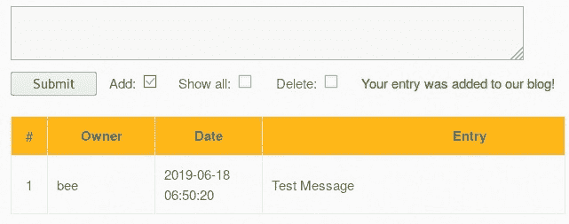

此外，我们可以看到表、字段和列。

4.  我们可以在文本字段中输入以下脚本并点击**提交**：

```
<script>alert("Testing Stored XSS")</script>
```

5.  提交脚本后，您将收到以下弹出窗口，验证脚本是否成功运行：


查看表格，第二行没有任何实际条目：

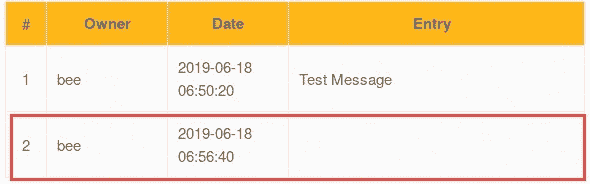

这个新条目反映了我们的脚本已经插入并存储在数据库中。如果有人打开此网页，脚本将自动执行。

在下一节中，我们将演示如何使用**浏览器攻击框架**（**BeEF**攻击 XSS 漏洞。

# 利用 XSS–将易受攻击的页面访问者与 BeEF 挂钩

BeEF 是一种安全审计工具，渗透测试人员使用它来评估系统和网络的安全态势并发现漏洞。它允许您钩住客户端浏览器并利用它。挂钩是让受害者点击包含 JavaScript 代码的网页的过程。JavaScript 代码随后由受害者的 web 浏览器处理，并将浏览器绑定到 Kali Linux 上的 BeEF 服务器。

对于本练习，我们将使用以下拓扑：


让我们开始使用 BeEF 来利用 XSS 漏洞：

1.  要打开 BeEF，请转至**应用程序****08–开发工具****BeEF xss 框架**。BeEF 服务将启动并显示以下详细信息以访问 BeEF 界面：


WEB UI 和钩子 URL 很重要。JavaScript 钩子通常嵌入到发送给受害者的网页中。一旦被访问，JavaScript 将在受害者的浏览器上执行，并创建到 BeEF 服务器的挂钩。钩子脚本中使用的 IP 地址是服务器的 IP 地址。在我们的实验室里，它是 Kali Linux（攻击者）机器。

2.  网络浏览器将自动打开登录门户。如果无法打开，请使用`http://127.0.0.1:3000/ui/panel`：


用户名为`beef`，您将在初始启动时设置密码。

3.  在 Kali Linux 上启动 Apache web 服务：

```
service apache2 start
```

4.  编辑位于 web 服务器目录中的网页。

```
cd /var/www/html nano index.html
```

5.  在 HTML 页面的头部插入代码，如下所示：


IP 地址属于运行 BeEF 服务器的 Kali Linux 机器。

6.  在 Windows 计算机上，打开 web 浏览器并插入 Kali Linux 计算机的 IP 地址：


7.  回到你的 Kali Linux 机器上。您现在有了一个钩状浏览器。单击钩住的浏览器：

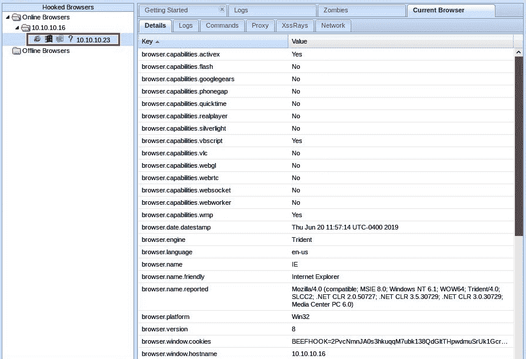

8.  点击`Commands`选项卡。在这里，您可以在受害者的 web 浏览器上执行操作。让我们在客户端显示一个通知。

9.  单击命令选项卡|社会工程|假通知栏：


最右侧的列将显示攻击的描述。准备好后，单击 Execute 启动它。

10.  现在，前往 Windows 机器。您将在 web 浏览器中看到一个假通知栏：


BeEF 允许您对受害者的浏览器界面执行客户端攻击。

在本节中，我们介绍了用于发现目标上 XSS 漏洞的各种方法和技术，并使用 BeEF 执行了 XSS 攻击。在下一节中，我们将执行自动 web 漏洞扫描。

# 自动发现漏洞

在本节中，我们将了解如何使用工具帮助我们自动发现 web 应用程序和服务器漏洞。Burp Suite、Acunetix 和 OWASP ZAP 将用于执行漏洞扫描。

# Burp 套件教程

在[第 7 章](07.html)*中，我们使用漏洞扫描工具*概述了使用 Burp 套件的好处和功能。在本节中，我们将进一步演示如何使用此工具执行自动漏洞发现。

我们可以使用 Burp 套件对特定页面或网站执行自动扫描。开始之前，请确保您已配置以下设置：

*   在攻击者计算机（Kali Linux）上配置 web 浏览器以使用 Burp 套件代理。如果您在执行此任务时遇到困难，请重新阅读[第 7 章](07.html)、*使用漏洞扫描工具*。
*   确保打开 OWASP BWA 虚拟机并捕获其 IP 地址。

一旦这些配置到位，我们可以开始采取以下步骤：

1.  使用 Kali Linux 机器上的 web 浏览器导航到 OWASP BWA 虚拟机中的**DVWA**。

2.  点击**SQL 注入**按钮，如下图：

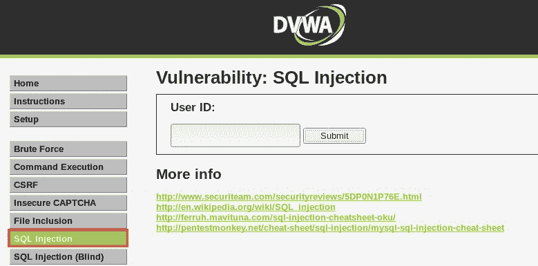

3.  打开打嗝套件并确保**截取**已打开。
4.  在 DVWA 网页上，点击**提交**按钮向服务器发送 HTTP 请求：


5.  在 Burp 套件中，您应该能够看到 HTTP 请求。右键单击上下文窗口中的任意位置，选择**进行活动扫描**：


这将允许 Burp Suite 在目标网页上执行自动扫描，以发现任何 web 漏洞。

以下是使用 Burp Suite 完成扫描后的结果示例：


选择发现的每个问题将为您提供特定漏洞的细分。

在下一节中，我们将学习如何使用 Acunetix 发现 web 漏洞。

# 针剂

Acunetix 是业界最流行和公认的 web 应用程序漏洞扫描器之一。它目前是《财富》500 强公司中使用的领先漏洞扫描工具之一。Acunetix 旨在通过扫描目标网站或 web 服务器来提供高级 XSS 和 SQL 注入攻击。

要开始使用 Acunetix，请遵循以下步骤：

1.  转到[https://www.acunetix.com/vulnerability-scanner/download/](https://www.acunetix.com/vulnerability-scanner/download/) 并注册试用版。Acunetix 是一种商业产品，但我们可以为我们的练习购买试用版。
2.  完成注册后，您将看到以下屏幕：

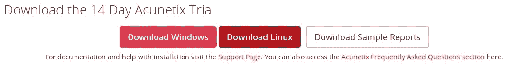

下载 Linux 版本，因为我们将在攻击者机器 Kali Linux 上使用它。

3.  下载`acunetix_trial.sh`文件后，使用`chmod +x acunetix_trial.sh`命令将可执行权限应用于本地用户帐户。要开始安装，请使用如下所示的`./acunetix_trial.sh`命令：

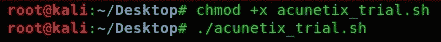

4.  在命令行界面上，通读并接受**最终用户许可协议**（**EULA**）。
5.  在 Kali Linux 中打开 web 浏览器并输入以下地址`https://kali:13443/`，以访问 Acunetix 用户界面。使用安装过程中创建的用户帐户登录：


6.  要开始新的扫描，点击**创建新目标**或**添加目标**，如下所示：


7.  将打开**添加目标**弹出窗口，可指定目标：

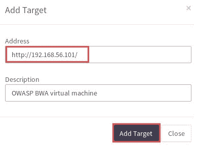

8.  添加目标后，将向您提供自定义扫描的选项：


现在，我们将保留所有选项的默认设置。

9.  指定扫描类型和报告选项：


Acunetix 允许您根据业务需要生成以下类型的报告：

10.  准备好后，开始扫描目标。

扫描完成后，Acunetix 主仪表板上会显示摘要，如下所示：

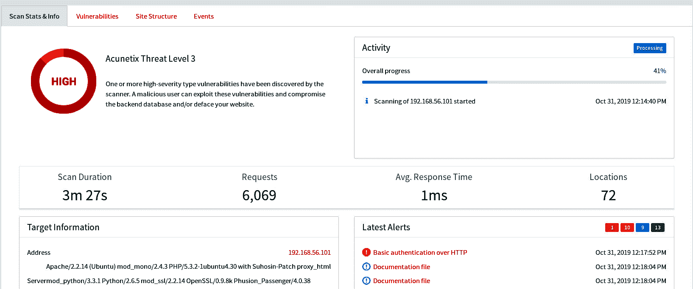

您可以快速查看扫描的持续时间和发现的任何高风险漏洞。

11.  要查看发现的漏洞的详细列表，请单击**漏洞**选项卡并选择其中一个 web 漏洞：

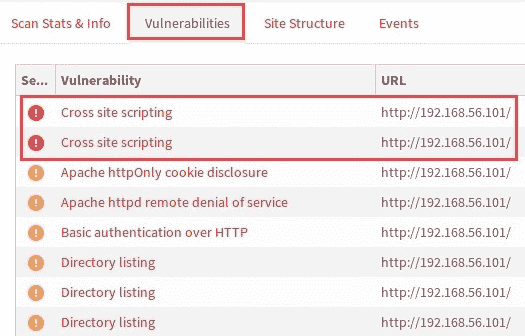

要创建报告，请单击**生成报告**。报告向导将允许您根据 web 应用程序渗透测试的目标指定最适合的报告类型。生成报告后，您可以将文件下载到桌面上。以下为执行报告的 PDF 版本：

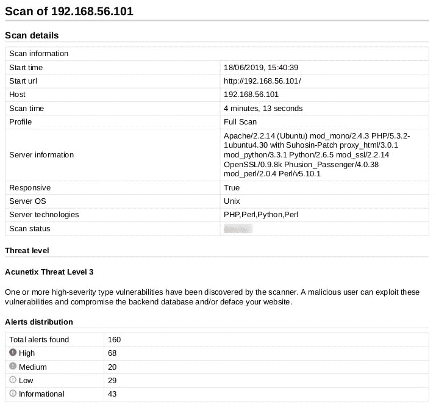

Acunetix 绝对是渗透测试武器库的必备工具。它将允许您在任何 web 应用程序上快速执行黑盒测试，并以易于阅读和理解的报告形式呈现结果。

在下一节中，我们将学习如何使用 OWASP ZAP 执行 web 漏洞评估。

# OWASP ZAP

OWASP**Zed 攻击代理**（**ZAP**项目由 OWASP 创建，是一个免费的安全工具，用于通过简单易用的界面发现 web 服务器和应用程序上的漏洞。

OWASP ZAP 预先安装在 Kali Linux 中。首先，让我们在目标 OWASP BWA 虚拟机上执行 web 漏洞扫描。

要开始使用 OWASP ZAP，请执行以下步骤：

1.  打开 OWASP-ZAP，然后导航到应用程序| 03-Web 应用程序分析| OWASP-ZAP。在界面上，单击自动扫描，如下所示：


2.  输入 OWASP BWA 虚拟机的 IP 地址，然后单击“攻击”开始安全扫描：


在扫描阶段，OWASP ZAP 将在目标上执行爬网。**爬行**是一种网络安全扫描程序检测隐藏目录并尝试访问它们（爬行）的技术：


3.  扫描完成后，单击“警报”选项卡以查看找到的所有基于 web 的漏洞以及每个漏洞在目标上的位置：

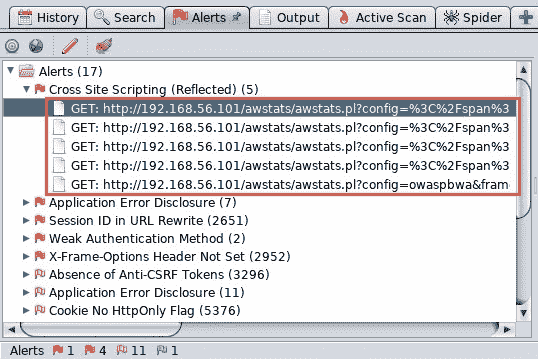

选择漏洞后，OWASP 将在从目标服务器返回 HTTP 头和正文时显示它们：


如果仔细查看前面的屏幕截图，您将看到 OWASP ZAP 突出显示了 web 编码的受影响区域。

4.  安全扫描完成后，您可以创建和导出报告。要执行此操作，请单击报告|生成 HTML 报告。应用程序将允许您将报告保存到桌面。以下是使用 OWASP ZAP 创建的示例报告：

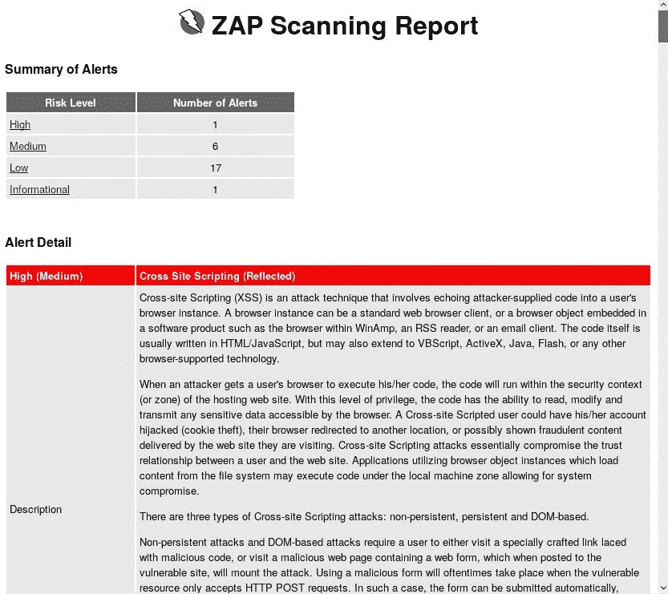

此外，OWASP ZAP 允许您根据需要生成多种格式的报告。一定要探索这个神奇工具的其他功能。

# 总结

完成本章后，您现在可以执行 web 应用程序渗透测试，使用 SQL 注入攻击绕过登录，在数据库中查找表并检索用户凭据，对 web 应用程序执行各种类型的 XSS 攻击，并使用 BeEF 成功启动客户端攻击。

我希望这一章能对你的学习和事业有所帮助。在下一章中，您将学习渗透测试最佳实践。

# 问题

以下是基于本章所述主题的一些问题：

1.  什么 SQL 语句用于指定数据库中的表？
2.  如何在 SQL 中关闭语句？
3.  如何在数据库中添加新记录？
4.  什么工具可以执行客户端攻击？

# 进一步阅读

*   **XSS**：[https://www.owasp.org/index.php/Cross-site_Scripting_（XSS）](https://www.owasp.org/index.php/Cross-site_Scripting_(XSS))
*   **SQL 注入**：[https://www.owasp.org/index.php/SQL_Injection](https://www.owasp.org/index.php/SQL_Injection)