# 九、利用之后——清理痕迹

在上一章中，我们介绍了使用 Metasploit 的权限提升技术。接下来，我们将进入下一阶段的后期攻击，即通过删除日志清理跟踪和跟踪，并通过禁用防火墙和防病毒系统保持未被发现。在本章中，我们将学习如何在系统受损时规避防火墙和防病毒系统警报。对于黑客来说，另一个重要的问题是他如何在无形中完成他的工作。这被称为清理痕迹和痕迹；在这里，恶意黑客会清除由于其入侵而创建的日志和任何警报。

# 禁用防火墙和其他网络防御

为什么防火墙很重要？防火墙基本上是阻止未经授权进入系统或网络的软件或硬件。防火墙还跟踪入侵和安全漏洞。如果防火墙配置良好，每个未经授权的入口都会被阻止并记录在安全日志中。它控制传入和传出的网络流量，并分析数据包；基于此，它决定是否允许数据包通过防火墙。因此，如果恶意用户能够远程攻击系统，第一步应该是禁用防火墙，这样防火墙就不会记录进一步的警报，从而显示入侵的证据。


防火墙分为三种不同类型：

1.  **包过滤防火墙**：这些类型的防火墙与 OSI 模型的前三层相关联，传输层也提供了一些帮助，用于源和目标端口号。当数据包向数据包过滤器防火墙移动时，它将借助于设置的规则进行分析，以进行匹配。如果数据包通过防火墙的过滤器，则允许其进入网络，否则将被阻止。
2.  **有状态防火墙**：这些也称为第二代防火墙。顾名思义，这些防火墙在网络连接状态下工作。在整个状态中，它决定是否允许数据包进入网络。
3.  **应用防火墙**：这些被称为第三代防火墙。应用程序防火墙在 HTTP、SMTP 和 SSH 等应用程序和协议上工作。它们还有助于检测不需要的协议是否试图绕过允许端口上的防火墙。

防火墙是恶意用户最大的敌人之一。它可以阻止恶意用户使用攻击后脚本，并为受损系统创建后门。因此，攻击者的第一个目标应该是在破坏系统后禁用防火墙。在本章中，我们将了解如何通过 Metasploit 禁用防火墙，然后处理未经授权的区域。

在本节中，我们将向您展示如何禁用受害者系统中的防火墙。在此之前，我们将检查受害者系统中防火墙的状态；也就是说，它是启用还是禁用的。为此，我们将使用一个利用后脚本。所以输入`run getcountermeasure`。


我们可以在前面的屏幕截图中看到，在受害者的系统中启用了防火墙。还有另一种方法可以检查受害者系统中的防火墙设置–通过访问他/她的命令提示符。为此，我们必须从流量计打开受害者的外壳。在前面的章节中已经介绍了从流量计打开外壳的技术。我们访问命令提示符并键入`netsh firewall show opmode`。

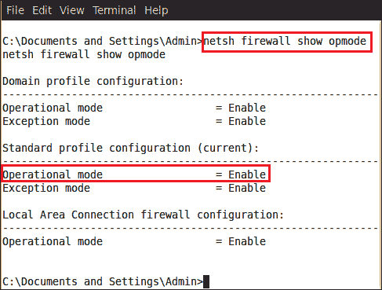

现在我们可以检查系统防火墙的防火墙设置。让我们通过检查受害者的系统来验证它，看看防火墙是否启用。


我们可以清楚地看到防火墙处于活动状态。所以现在我们需要禁用它。输入`netsh firewall show opmode mode=disable`。


执行上一个命令后，该命令将永久禁用防火墙。现在让我们检查受害者系统中的防火墙状态。

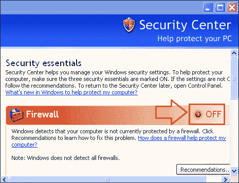

## 通过 VBScript 禁用防火墙

还有另一种禁用防火墙的方法，即在受害者的系统上执行一个小的 Visual Basic 脚本。首先，我们必须在一个文本文件中编写三行代码。

```
Set objFirewall = CreateObject("HNetCfg.FwMgr")
Set objPolicy = objFirewall.LocalPolicy.CurrentProfile

objPolicy.FirewallEnabled = FALSE
```

现在用`.vbs`扩展名保存此代码。例如，这里我们将其命名为`disable.vbs`。

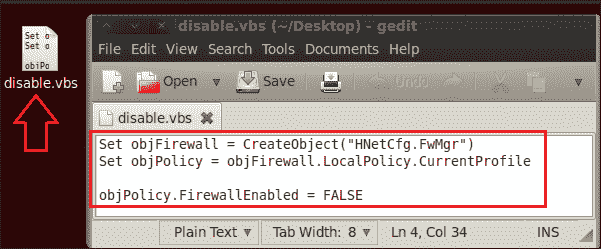

我们的剧本已经准备好了；现在我们必须将这个脚本上传到受害者的系统中。对于上传，我们将使用 meterpeterupload 命令。输入`upload <source file path> <destination file path>`；例如，在我们的例子中，我们输入`upload root/Desktop/disable.vbs C:\`。


因此，我们已经将我们的`disable.vbs`脚本上传到受害者的`C:`驱动器中。让我们检查一下受害者的`C:`驱动器，看看脚本是否上传。


我们可以在受害者的`C:`驱动器中看到我们的`disable.vbs`文件。我们现在可以远程执行此脚本。要执行此脚本，我们必须通过键入`cd C:\`转到此驱动器。

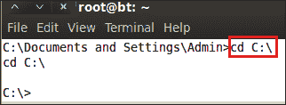

我们现在在受害者的`C:`驱动器中，我们可以执行脚本。因此，输入`disable.vbs`，它将在受害者的系统中执行。

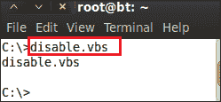

让我们检查我们的脚本是否禁用了受害者的系统防火墙。


是的，我们的 VBScript 代码已成功禁用防火墙。

## 杀毒和日志删除

让我们看看防病毒程序中的一些利用漏洞问题。攻击者在利用系统进行攻击后需要注意的事情很多。如果他想安全行事，不被发现，这是很重要的。防病毒软件是合法用户的主要防御系统之一，如果攻击者能够禁用它，他就成功地获得了对系统的完全控制，并且可以不被发现。因此，作为一种预防措施，攻击者禁用防病毒系统以隐藏其存在是非常重要的。在本章中，我们将学习如何通过 MeterMeter 后期攻击脚本禁用和杀死不同的防病毒程序。


在本节中，我们将看到如何通过杀死抗病毒药物的过程来阻止其使用。为此，我们将使用一个名为 killav 的利用后 MeterMeter 脚本。我们将向您展示 killav 脚本的源代码，并了解该脚本如何能够杀死防病毒程序的进程。

用文本编辑器打开`killav.rb`脚本，文本编辑器位于`opt/framework/msf3/scripts/killav.rb`。

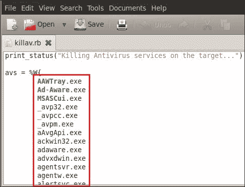

我们可以看到 killav 脚本中包含的著名的抗病毒药物的过程名称列表。当我们运行这个脚本时，它会在受害者的系统中查找进程名称，该名称也应该包含在这个脚本中，然后终止进程。

在我们的案例中，受害者正在使用 AVG 2012 防病毒软件。因此，首先，我们将从受害者的任务管理器中检查 AVG antivirus 的进程名称。


我们可以看到进程名`avgrsx.exe`正在为 AVG antivirus 程序运行。让我们检查`killav.rb`脚本中是否包含进程名称。


我们可以看到进程名已经包含在内，因此脚本将成功运行。输入`run killav`。


我们可以从前面屏幕截图中的结果中看到进程已被终止。现在，我们将访问受害者的命令提示符并输入`tasklist`以检查受害者系统中运行的所有进程。


我们还可以看到很多进程在受害者的系统中运行；我们现在将对流程进行分类，看看它们属于哪个组。输入`tasklist /svc`。

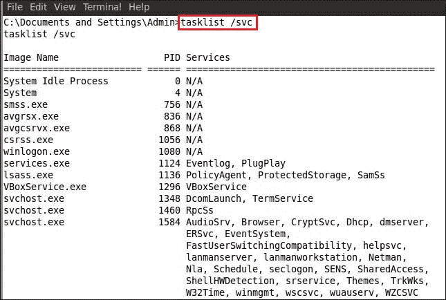

我们只对 AVG 防病毒服务感兴趣，对任务列表中显示的其他服务不感兴趣。因此，我们将通过键入`tasklist /svc | find /I "avg"`来优化搜索。

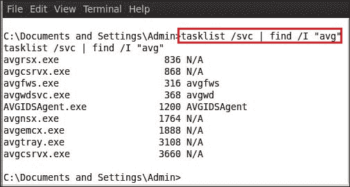

在执行前面屏幕截图中所示的命令后，我们可以看到仅显示与 AVG 相关的进程。我们必须杀掉所有进程，但是杀掉时两个进程`avgwdsvc.exe`和`AVGIDSAgent.exe`会造成麻烦。出现此问题的原因是，如下面的屏幕截图所示，这些无法停止。在这里，我们通过输入`sc queryex avgwd`来查看`avgwd`的属性。


您可能会在前面屏幕截图的状态部分注意到，此服务不可停止，也不能暂停。但我们可以禁用此服务来解决问题。

让我们检查另一个进程的属性，`AVGIDSAgent`。输入`sc queryex AVGIDSAgent`。

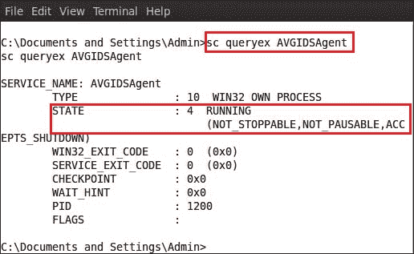

我们可以在这里看到相同的结果–服务不可停止，也不能暂停。

现在我们要禁用`avgwd`进程。输入`sc config avgwd start= disabled`。

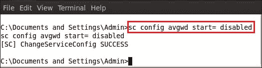

正如前面的屏幕截图所示，`avgwd`服务已被禁用。现在让我们禁用另一个进程，`AVGIDSAgent`。输入`sc config AVGIDSAgent start= disabled`。


现在我们退出受害者的命令提示符，并通过在 MeterMeter 会话中键入`reboot`命令重新启动受害者的系统。


成功重启后，我们再次在受害者的系统中进入 MeterMeter 会话。现在我们要做的是从受害者的任务列表中搜索所有 AVG 进程，并验证我们禁用的两个进程是否仍在运行。我们打开外壳并输入`tasklist /svc | find /I "avg"`。

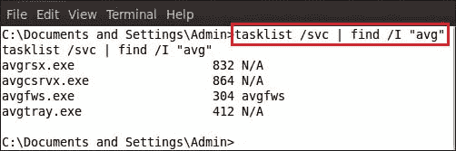

我们可以看到，`avgwd`和`AVGIDSAgent`这两个进程没有出现在前面的屏幕截图中。这意味着进程已成功禁用。我们可以轻松终止其他 AVG 进程。要终止进程，请键入`taskkill /F /IM "avg*"`。

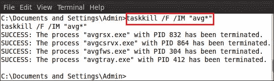

执行命令后，我们可以看到所有进程都已成功终止。

清除轨道的下一阶段将清除系统日志。系统和应用程序日志是由操作系统及其上运行的应用程序记录的事件。从法医学的角度来看，它们具有极其重要的意义，因为它们显示了系统中发生的变化或事件的状态。任何可疑活动也会被记录；因此，攻击者清除这些日志以保持隐藏变得非常重要。

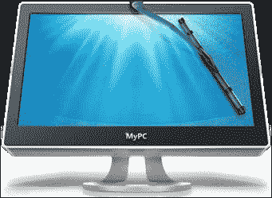

图片取自[https://paddle-static.s3.amazonaws.com/HR/CleanMyPC-BDJ/CleanMyPC-icon.png](https://paddle-static.s3.amazonaws.com/HR/CleanMyPC-BDJ/CleanMyPC-icon.png)

在成功禁用防火墙和防病毒软件后，我们要做的最后一件事就是清除计算机系统中的日志等所有证据。首先，我们将使用事件查看器检查受害者的系统，查看是否创建了任何日志。


我们可以在前面的截图中看到，有三个日志，分别为**应用**、**安全**和**系统**。在**应用程序**部分，我们可以看到有 118 个事件正在创建。现在我们必须清除所有这些日志。为了清理日志，我们将使用 meterpeter 命令`clearev`，它将从受害者的系统中清除所有日志。所以输入`clearev`。


执行命令后，我们可以在前面的屏幕截图中看到结果–118 条应用程序记录和 467 条系统记录已被删除。让我们使用受害者系统中的事件查看器确认这一点。

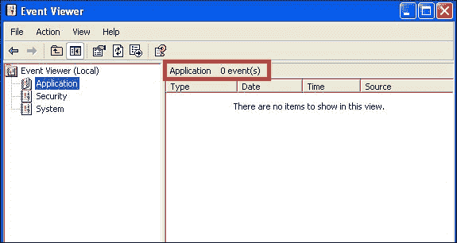

我们可以看到所有日志都已成功从受害者的系统中删除。

# 总结

在本章中，我们学习了通过使用简单的 MeterMeter 脚本来清除跟踪和避免被管理员捕获的策略。由于防火墙和抗病毒药物是针对攻击者攻击向量的主要防御手段，因此，对攻击者来说，注意这些事情变得极其重要。我们还遇到了多种技术来禁用系统防火墙，从而禁用受害者的防御。我们跟随攻击者的接近，通过清除我们的痕迹，安全地侵入了系统。因此，到目前为止，我们已经讨论了开采后的第二阶段，这是开采过程中最重要的阶段之一。在下一章中，我们将介绍使用后门并在受害者系统上设置它们以保持永久访问的技术。

# 参考文献

以下是一些有用的参考资料，进一步阐明了本章所涵盖的一些主题：

*   [http://en.wikipedia.org/wiki/Firewall_（计算）](http://en.wikipedia.org/wiki/Firewall_(computing))
*   [http://pentestlab.wordpress.com/2012/04/06/post-exploitation-disable-firewall-and-kill-antivirus/](http://pentestlab.wordpress.com/2012/04/06/post-exploitation-disable-firewall-and-kill-antivirus/)
*   [http://www.securitytube.net/video/2666](http://www.securitytube.net/video/2666)