# 七、物理攻击与社会工程

社会工程方面，特别是与目标系统的物理访问相结合时，是用于渗透测试或实际攻击的最成功的攻击向量。

作为一种支持杀伤链的攻击途径，社会工程侧重于攻击的非技术方面，即利用人的信任和天生的帮助来欺骗和操纵他们，从而破坏网络及其资源。

社会工程攻击的成功取决于两个关键因素：

*   侦察阶段获得的知识。攻击者必须知道与目标关联的名称和用户名；更重要的是，攻击者必须了解网络上用户的担忧。
*   了解如何应用这些知识，通过单击链接或执行程序说服潜在目标激活攻击。例如，如果目标公司刚刚与前竞争对手合并，员工的工作安全可能是首要考虑的问题。因此，与该主题相关的标题的电子邮件或文档可能会被目标个人打开。

Kali Linux 提供了几种工具和框架，如果社会工程被用作影响受害者打开文件或执行某些操作的借口，那么这些工具和框架的成功几率就会增加。示例包括脚本攻击（包括 Visual Basic、WMI 和 PowerShell 脚本）、Metasploit 框架创建的可执行文件以及**牛肉**（**浏览器攻击框架**）。

在本章中，我们将重点介绍社会工程工具包或 SEToolkit。使用这些工具所使用的技术将作为使用社会工程部署来自其他工具的攻击的模型。

本章结束时，您将学习如何使用 SEToolkit 执行以下操作：

*   使用 spear 网络钓鱼和 Java 小程序攻击获取远程 shell
*   使用凭据收割机攻击获取或收集用户名和密码
*   启动选项卡和网络劫持攻击
*   采用多攻击 web 方法
*   使用 PowerShell 的字母数字外壳代码注入攻击

为了支持 SET 的社会工程攻击，将描述以下一般实施实践：

*   隐藏恶意可执行文件并混淆攻击者的 URL
*   使用 DNS 重定向升级攻击

您还将学习如何创建和实现基于 Raspberry PI 微型计算机的恶意物理设备。

# 社会工程工具包

社会工程师工具包（SEToolkit）由 David Kennedy（ReL1K）创建和编写，并由一组活跃的合作者（[www.Social-Engineer.org](http://www.social-engineer.org)维护）。它是一个开放源码的 python 驱动框架，专门设计用于促进社会工程攻击。

SEToolkit 的一个显著优势是它与 Metasploit 框架的互连性，Metasploit 框架提供了攻击所需的有效负载、绕过反病毒的加密以及在将外壳发送回攻击者时连接到受损系统的侦听器模块。

在启动 SEToolkit 之前，您可能希望对配置文件进行一些修改。

社会工程工具包预先配置了常见的默认设置；但是，可以更改这些设置以使工具包适应特定的攻击场景。在 Kali 中，配置文件为`/usr/share/set/config/set_config`。通过修改此文件，您可以控制以下内容：

*   Metasploit 变量，包括位置、要使用的数据库、有效负载应编码多少次，以及建立 MeterMeter 会话后自动运行的命令。
*   **TTERCAP**和**dsniff**切换到有助于 DNS 重定向攻击和身份验证凭据的捕获。通过控制 DNS，攻击者可以自动将人群引导到使用`setoolkit`创建的虚假站点。
*   配置`sendmail`或其他邮件程序，用于需要伪造电子邮件地址的攻击；这使得社会工程师能够通过使用似乎来自可信来源（例如同一公司的高级经理）的电子邮件地址来增强攻击的可信度。
*   要使用的电子邮件提供商，包括 Gmail、Hotmail 和 Yahoo。
*   使用伪造的发布者创建自签名 Java 小程序、激活 SSL 证书和窃取数字签名。
*   其他变量，如 IP 地址、端口分配和编码参数。

要在 Kali 发行版中打开社会工程工具包（SET），请转到**应用****Kali Linux****利用工具****社会工程工具包****设置工具包**，或在 shell 提示下输入`setoolkit`。您将看到主菜单，如以下屏幕截图所示：


如果您选择`1) Social-Engineering Attacks`，将出现以下子菜单：

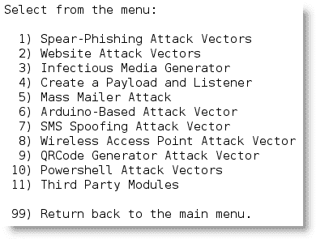

以下是对社会工程攻击的简要说明：

*   `Spear-Phishing Attack Vector`允许攻击者创建电子邮件，并通过附加漏洞将其发送给目标受害者。
*   `Website Attack Vectors`利用多个基于 web 的攻击，包括以下内容：

    *   `Java Applet Attack Method`欺骗 Java 证书并传递基于 Metasploit 的负载。这是最成功的攻击之一，对 Windows、Linux 或 OSX 目标有效。
    *   `Metasploit Browser Exploit Method`使用 iFrame 攻击交付 Metasploit 有效载荷。
    *   `Credential Harvester Attack Method`克隆网站并自动重写 POST 参数，允许攻击者拦截并获取用户凭证；当收割完成后，它会将受害者重定向回原始站点。
    *   `Tabnabbing Attack Method`将非活动浏览器选项卡上的信息替换为链接回攻击者的克隆页面。受害者登录时，会将凭据发送给攻击者。
    *   `Web Jacking Attack Method`利用 iFrame 替换使高亮显示的 URL 链接看起来合法；但是，当单击时，会弹出一个窗口，然后替换为恶意链接。
    *   `Multi-Attack Web Method`允许攻击者选择可同时发起的部分或全部攻击，包括`The Java Applet Attack Method`、`The Metasploit Browser Exploit Method`、`Credential Harvester Attack Method`、`Tabnabbing Attack Method`和`Man Left in the Middle Attack Method`。

*   `Infectious Media Generator`创建一个`autorun.inf`文件和 Metasploit 负载。一旦刻录或复制到 USB 设备或物理介质（CD 或 DVD）并插入目标系统，它将触发自动运行（如果启用自动运行）并危害系统。
*   `Create a Payload and Listener`模块是一种创建 Metasploit 有效载荷的快速菜单驱动方法。攻击者必须使用单独的社会工程攻击来说服目标发动攻击。
*   `MassMailer Attack`允许攻击者向单个电子邮件地址或收件人列表发送多封自定义电子邮件。
*   `Arduino-Based Attack Vector`程序基于 Arduino 的设备如 Teensy。由于这些设备在连接到物理 Windows 系统时注册为 USB 键盘，因此它们可以通过禁用自动运行或其他端点保护绕过安全性。
*   `SMS Spoofing Attack Vector`允许攻击者向某人的移动设备发送特制的短消息服务文本，并伪造消息来源。
*   `Wireless Access Point Attack Vector`将在攻击者的系统上创建一个虚假的无线接入点和 DHCP 服务器，并将所有 DNS 查询重定向给攻击者。然后，攻击者可以发起各种攻击，例如 Java 小程序攻击或凭证收割机攻击。
*   `QRcode Generator Attack Vector`创建一个 QRCode，该 QRCode 具有与攻击相关联的已定义 URL。
*   `Powershell Attack Vectors`允许攻击者利用 PowerShell 创建攻击，PowerShell 是所有 Windows Vista 及更高版本上可用的命令行 shell 和脚本语言。
*   `Third Party Modules`允许攻击者使用**远程管理工具 Tommy Edition**（**RATTE**）作为 Java 小程序攻击的一部分或作为单独的负载。RATTE 是一种文本菜单驱动的远程访问工具。

SEToolkit 还提供了`Fast-Track Penetration Testing`的菜单项，可快速访问一些支持 SQL 数据库暴力识别和密码破解的专用工具，以及一些基于 Python、SCCM 攻击向量、Dell 计算机 DRAC/机箱攻击、用户枚举、，和 PSEXEC PowerShell 注入。

该菜单还提供了更新 Metasploit 框架、SEToolkit 和 SEToolkit 配置的选项。但是，应避免使用这些附加选项，因为 Kali 不完全支持它们，并且可能会与依赖项发生冲突。

作为 SEToolkit 优势的一个初步示例，我们将了解如何使用它来获得远程 shell—从受损系统返回到攻击者系统的连接。

## 鱼叉式网络钓鱼攻击

网络钓鱼是一种针对大量受害者的电子邮件欺诈攻击，例如已知的美国互联网用户名单。目标公司通常没有联系，电子邮件也不会试图吸引任何特定的个人。相反，它包含一个普遍感兴趣的项目（例如，“单击此处购买廉价药物”）和一个恶意链接或附件。攻击者利用至少有人点击链接附件发起攻击的可能性。

另一方面，spear 网络钓鱼是一种非常特殊的网络钓鱼攻击形式，攻击者希望通过以特定方式制作电子邮件来吸引特定受众的注意。例如，如果攻击者知道销售部门使用特定的应用来管理其客户关系，他可能会伪造一封电子邮件，假装该电子邮件来自应用的供应商，主题行为“紧急修复<application>-单击链接下载”。</application>

### 提示

钓鱼攻击的成功率通常低于 5%；然而，矛式网络钓鱼攻击的成功率从 40%到 80%不等。这就是为什么侦察阶段的信息对于此类攻击的成功至关重要。

平均而言，在至少点击一封电子邮件之前，只需向目标发送十到十五封电子邮件。

在发起攻击之前，确保在 Kali（`apt-get install sendmail`上安装了`sendmail`，并将`set_config`文件从`SENDMAIL=OFF`更改为`SENDMAIL=ON`。

要启动攻击，请从 SEToolkit 主菜单中选择`Social Engineering Attacks`，然后从子菜单中选择`Spear-Phishing Attack Vectors`。这将启动攻击的开始选项，如以下屏幕截图所示：


选择`1`执行大规模电子邮件攻击；然后，您将看到攻击有效载荷列表，如以下屏幕截图所示：

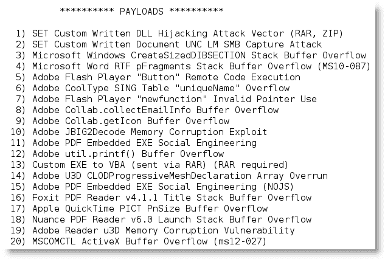

最有效的攻击之一是`15) Adobe PDF Embedded EXE Social Engineering`；但是，所选择的攻击将因攻击者对侦察阶段获得的可用目标的了解而有所不同。

当提示使用您自己的 PDF 或内置空白 PDF 进行攻击时，如以下屏幕截图所示，选择`2`作为内置空白有效负载。然后将提示您选择有效负载。


通过在多个网络上的测试，我们发现选项`1`和`2`（`Windows Reverse TCP shell`和`Windows Meterpreter Reverse TCP`是最可靠的有效负载。在本例中，我们将选择`Windows Meterpreter Reverse TCP`——当 PDF 打开时，它将执行一个反向 shell 返回攻击系统。

在隐形比可靠性更重要的情况下，`Windows Meterpreter Reverse HTTPS`是最佳选择。

SEToolkit 将提示输入有效负载侦听器（攻击者的 IP 地址）和侦听端口，默认端口为`443`。

下一个菜单提示更改 PDF 文件的文件名；默认名称为`moo.pdf`，如下图所示：

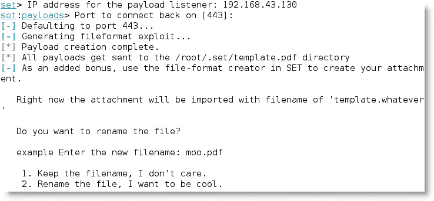

默认名称可能不会诱使潜在受害者打开文件；此外，它可以通过客户端安全性来识别。由于这些原因，应该更改文件名。名称应反映被攻击的目标受众。例如，如果您的目标是财务组，请为 PDF 文件提供一个标题，例如税法修正案。

您现在可以选择攻击单个电子邮件地址，也可以选择群发邮件（例如，目标公司的员工列表或公司内的特定组）。本例选择了选项`1`。

然后，SEToolkit 将提示使用预定义模板或创建一次性电子邮件模板。如果选择预定义模板，则以下选项将可用：

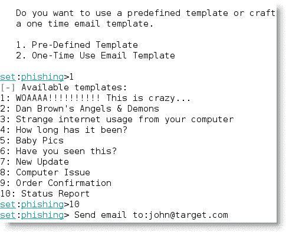

为目标精心设计了有效的社会工程攻击；因此，选择`2`、`One-Time Use Email Template`选项，创建一次性使用电子邮件模板，如下图所示：


您可以选择使用自己的 Gmail 帐户发起攻击（`1`或使用自己的服务器或开放中继（`2`）。如果您使用 Gmail 帐户，攻击可能会失败，您将收到以下消息：

```
[!] Unable to deliver email. Printing exceptions message
below, this is most likely due to an illegal attachment. If using GMAIL they inspect PDFs and it is most likely getting caught. 

```

Gmail 检查发送的电子邮件中是否有恶意文件，在识别 SEToolkit 和 Metasploit 框架产生的有效负载方面非常有效。如果您必须使用 GMail 发送有效负载，请先使用`Veil-Evasion`对其进行编码。

建议您使用`sendmail`选项发送可执行文件；此外，它还允许您伪造电子邮件的来源，使其看起来像来自可信来源。

目标将收到以下电子邮件：


为确保电子邮件有效，攻击者应注意以下几点：

*   内容应该提供一个“胡萝卜”（新的服务器速度更快，防病毒能力更强）和一个“大棒”（在你可以访问你的电子邮件之前，你必须进行*更改）。大多数人对立即采取行动的呼吁作出反应，特别是当他们受到影响时。*
*   在前面给出的示例中，随附的文档标题为`template.doc`。在真实场景中，这将更改为`Email instructions.doc`。
*   确保您的拼写和语法正确，并且邮件的语气与内容相匹配。
*   发送电子邮件的个人的标题应与内容匹配。如果目标组织很小，您可能必须伪造真实个人的姓名，并将电子邮件发送给通常不与该个人互动的小组。
*   包括一个电话号码它使电子邮件看起来更“正式”，并且有多种方法可以使用商业 IP 语音解决方案获得带有本地区号的短期电话号码。

一旦攻击电子邮件发送到目标，成功激活（接收者启动可执行文件）将创建一个指向攻击者系统的反向计量器隧道。然后，攻击者将使用 MeterMeter 和其他工具来执行典型的攻击后活动。

## 使用网站攻击向量-java applet 攻击方法

`Java Applet Attack Method`使用受感染的 Java 小程序将恶意应用加载到目标系统。这种攻击受到许多攻击者的青睐，因为它高度可靠，并且对 Windows、Linux 和 Mac OS X 系统有效。

要发起攻击，打开 SEToolkit，然后从主菜单中选择选项`2) Website Attack Vectors`。然后选择`1) Java Applet Attack Method`选项，启动初始菜单，如下图所示：

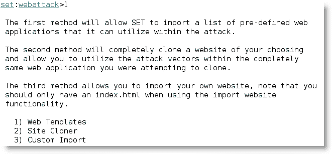

网页模板的选项有`Java Required`、`Gmail`、`Google`、`Facebook`、`Twitter`和`Yahoo`。如下面的屏幕截图所示，**Java Required**页面通常是有效的，因为它直接提示用户在继续之前更新重要的软件。

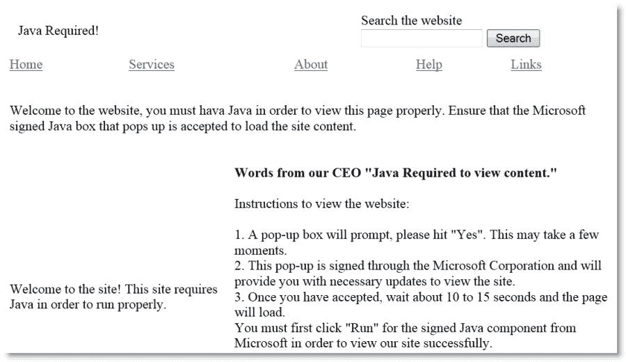

您还可以选择克隆现有网站，例如目标公司的公司网站。

选择后，提示攻击者确定是否使用端口/NAT 转发，并提供攻击机器的 IP 地址进行反向连接，如下图所示：


### 提示

SEToolkit 无法很好地处理单词换行，键入的响应通常会换行并覆盖命令行的一部分。

提供所需的 URL 后，SEToolkit 将启动站点克隆过程，如以下屏幕截图所示。完成后，应用将开始生成有效负载和支持文件（“T0”存档和克隆的“T1”文件）。


下一阶段包括有效载荷的选择。如果隐身特别重要，请使用选项`17`选择已使用`veil`编码的可执行文件，如以下屏幕截图所示：


选择编码选项，绕过目标系统本地杀毒；其中最有效的是第四个选项`Backdoored Executable`，如下图所示：


应用将提示输入监听端口，然后开始为受害者机器上的公共端口（`25`、`53`、`80`、`443`等）生成代码，如下图所示：


现在是社会工程步骤，攻击者必须说服目标用户连接到监听系统的 IP 地址。如果目标进入该系统，它们将被定向到侦听器上承载的克隆站点。

该站点将向目标用户显示一条安全警告，如以下屏幕截图所示，表明需要执行一个应用才能访问该站点。


如果此人选择执行该应用，则会在其计算机和攻击者的计算机之间形成一个反向外壳（取决于所选的有效负载）。

两次攻击展示了 SEToolkit 使用反向炮弹或类似有效载荷控制目标计算机的不同方法。攻击者可以通过多种方式扩展控制，例如使用 VNC 有效负载或放置 RATTE。

但是，这些攻击是侵入性的。当反向外壳连接到攻击者的机器时，可能会在防火墙上触发出口警报。更重要的是，有效负载可能被反向工程以识别有关攻击者的信息。

最后，攻击的目标可能不是立即妥协；相反，攻击者可能希望收集用户凭据以支持以后的攻击，或者在 Internet 上的多个位置重用凭据。那么，让我们检查一个凭证获取攻击。

## 使用网站攻击向量-凭证收割机攻击方法

凭证，通常是用户名和密码，允许个人访问网络、计算系统和数据。攻击者可以间接使用此信息（通过登录受害者的 Gmail 帐户并发送电子邮件来帮助攻击受害者的可信连接），也可以直接攻击用户的帐户。鉴于凭证的广泛重用，此攻击尤其重要。用户通常在多个位置重用密码。

特别值得注意的是具有特权访问权限的人员（如系统管理员或数据库管理员）的凭据，攻击者可以通过这些凭据访问多个帐户和数据存储库。

SEToolkit 的凭据获取攻击使用克隆站点收集凭据。

要发起此攻击，请从主菜单中选择`Website Attack Vectors`，然后选择`Credential Harvester Attack Method`。在本例中，我们将按照菜单选择来克隆网站，如 Facebook。

同样，必须将目标 IP 地址发送到预期目标。当目标点击链接或输入 IP 地址时，他们将看到一个类似于 Facebook 常规输入页面的克隆页面，并提示他们输入用户名和密码。

完成后，用户将被重定向到常规的 Facebook 站点，在那里他们将登录到自己的帐户。

在后台，他们的访问凭据将被收集并转发给攻击者。他们将在侦听器窗口中看到以下条目：

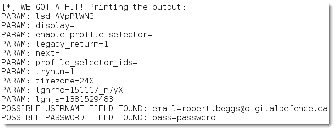

当攻击者收集完凭证后，输入*CTRL*+*C*将在`/SET/reports`目录中生成两个 XML 和 HTML 格式的报告。

类似的攻击选项是`Web Jacking Attack`。当受害者打开攻击者的链接时，他们将看到一个页面，通知他们所选页面已被移动，如以下屏幕截图所示：

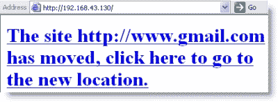

当用户点击链接转到新位置时，他们将看到一个克隆页面，该页面似乎是预期的页面，如下面的屏幕截图所示；同样，页面将获取他们的登录凭据。

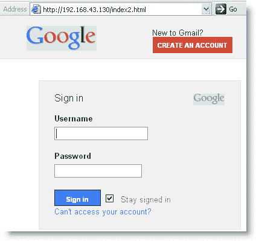

### 注

请注意，URL 栏中的地址不是谷歌的有效地址；如果能看到地址，大多数用户都会意识到出了问题。成功利用此漏洞需要攻击者为受害者准备合适的借口或故事，使受害者接受不寻常的 URL。例如，向目标群体的非技术管理人员发送电子邮件，宣布“本地 Google mail 站点现在由 IT 托管，以减少邮件系统的延迟。”

凭证获取攻击是评估公司网络安全性的一个极好工具。为了有效，组织必须首先培训所有员工如何识别和应对网络钓鱼攻击。大约两周后，发送一封公司范围的电子邮件，其中包含一些明显的错误（公司 CEO 的名字不正确或地址块包含错误的地址）和一个指向获取凭据的程序的链接。计算用他们的证书回复的收件人的百分比，然后调整培训计划以降低此百分比。

## 使用网站攻击向量——Tabnab 进攻攻击方法

Tabnabbing 通过在浏览器的一个打开的选项卡中加载一个虚假页面来利用用户的信任。通过模拟 Gmail、Facebook 或任何其他发布数据（通常是用户名和密码）的网站页面，选项卡攻击可以收集受害者的凭据。社会工程工具包调用我们前面描述的凭证收割机攻击。

要启动此攻击，请从控制台提示符启动社会工程工具包，然后选择`1) Social-Engineering Attacks`。在下一个菜单中，选择`2) Website Attack Vectors`。通过选择`4) Tabnabbing Attack Method`来发起制表攻击。

当攻击启动时，系统将提示您使用三个选项生成用于收集凭据的假网站。攻击者可以允许`setoolkit`导入预定义 web 应用列表、克隆网站（如 Gmail）或导入自己的网站。对于本例，我们将选择`2) Site Cloner`。

这将提示攻击者输入服务器将发布到的 IP 地址；这通常是攻击者系统的 IP 地址。然后会提示攻击者输入要克隆的网站的 URL。在下面的截图中，Gmail 的网站被选中。

然后，攻击者必须利用社会工程强制受害者访问 IP 地址以执行回发操作（例如，URL 缩短）。受害者将收到站点正在加载的消息（当攻击脚本在浏览器的不同选项卡下加载克隆站点时，如以下屏幕截图所示）：

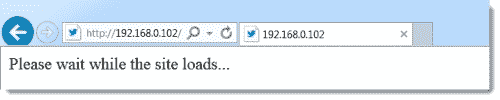

然后将向目标显示假页面（假 IP 地址仍然可见）。如果用户输入用户名和密码，数据将发布到攻击者系统上的侦听器。正如您在下面的屏幕截图中所看到的，它捕获了用户名和密码。


## 使用网站攻击向量-多攻击网页方法

针对网站攻击向量的“冰雹玛丽”攻击为`Multi-Attack Web Method`，如果攻击者选择，则允许攻击者同时实施多个不同的攻击。默认情况下，所有攻击都被禁用，攻击者选择针对受害者运行的攻击，如以下屏幕截图所示：


如果您不确定哪种攻击对目标组织有效，这是一种有效的选择；选择一名员工，确定成功的攻击，然后对其他员工重复使用这些攻击。

# 使用 PowerShell 字母数字外壳代码注入攻击

社交工程工具包还包含了基于 PowerShell 的更有效的攻击，在 Microsoft Vista 发布后，PowerShell 可在所有 Microsoft 操作系统上使用。由于 PowerShell 外壳代码可以轻松注入目标的物理内存，因此使用此向量的攻击不会触发防病毒警报。

要使用`setoolkit`启动 PowerShell 注入攻击，请从主菜单中选择`1) Social-Engineering Attacks`。然后从下一个菜单中选择`10) Powershell Attack Vectors`。

这将为攻击者提供四种攻击类型的选项；对于本例，选择`1`调用`PowerShell Alphanumeric Shellcode Injector`。

这将设置攻击参数并提示攻击者输入有效负载侦听器的 IP 地址，该地址通常是攻击者的 IP 地址。输入后，程序将创建利用漏洞代码并启动本地侦听器。

启动攻击的 PowerShell 外壳代码存储在`/root/.set/reports/powershell/x86_powershell_injection.txt`。

当攻击者说服目标受害者在命令提示符下复制`x86_powershell_injection.txt`的内容并执行代码时，就会发生攻击的社会工程方面，如下图所示。


如下面的屏幕截图所示，执行外壳代码不会在目标系统上触发防病毒警报。相反，当代码被执行时，它在攻击系统上打开了一个 MeterMeter 会话，并允许攻击者获得与远程系统的交互 shell。

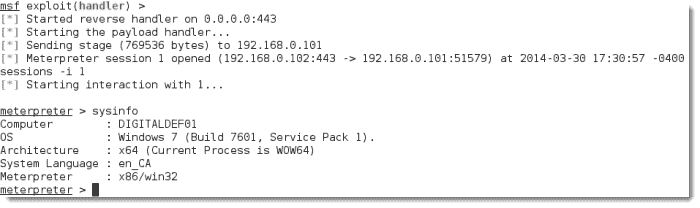

# 隐藏可执行文件并混淆攻击者的 URL

如前面的示例所示，成功发起社会工程攻击有两个关键。第一个是获取使 it 工作所需的信息用户名、业务信息以及有关网络、系统和应用的支持细节。

然而，大部分工作都集中在第二个方面：精心设计攻击，诱使目标打开可执行文件或单击链接。

一些攻击生成的模块要求受害者执行这些模块，以使攻击成功。不幸的是，用户对执行未知软件越来越谨慎。但是，有一些方法可以提高成功执行攻击的可能性，包括：

*   来自目标受害者已知和信任的系统的攻击，或欺骗攻击源。如果攻击似乎源自帮助台或 IT 支持，并声称是“紧急软件更新”，则可能会执行。
*   将可执行文件重命名为类似受信任的软件，例如“Java 更新”。
*   使用 Metasploit 的`adobe_pdf_embedded_exe_nojs`攻击等攻击将恶意负载嵌入良性文件（如 PDF 文件）。可执行文件还可以绑定到 Microsoft Office 文件、MSI 安装文件或配置为在桌面上静默运行的 BAT 文件。
*   让用户单击下载恶意可执行文件的链接。

由于 SEToolkit 使用攻击者的 URL 作为其攻击的目标，因此成功的关键因素是确保攻击者的 URL 对受害者可信。有几种技术可以实现这一点，包括：

*   使用[goo.gl](http://goo.gl)或[tinyurl.com](http://tinyurl.com)等服务缩短 URL。缩短的 URL 在 Twitter 等社交媒体中很常见，受害者在点击此类链接时很少采取预防措施。
*   在 Facebook 或 LinkedIn 等社交媒体网站上输入链接；该站点将创建自己的链接，用目标页面的图像替换您的链接。然后，删除您输入的链接，留下新的社交媒体链接。
*   在 LinkedIn 或 Facebook 上创建一个虚假网页作为攻击者，您可以控制内容，并可以创建一个引人注目的故事，以促使成员点击链接或下载可执行文件。一个执行良好的页面不仅针对员工，还针对供应商、合作伙伴及其客户，最大限度地提高社会工程攻击的成功率。
*   将链接嵌入到 PowerPoint 等文件中。

要在 PowerPoint 中嵌入链接，请启动该链接，并通过将扩展名保存为`.pps`来创建幻灯片放映。为演示文稿提供一个目标人员感兴趣的标题，并创建两个通用内容文件。在首页上，插入一个文本框并拖动该框以覆盖该幻灯片的整个表面。点击**插入**，然后选择动作选项卡。在对话框中，点击**超链接**至单选按钮，从下拉菜单中选择**URL**。输入用于发起攻击的 URL，如以下屏幕截图所示：

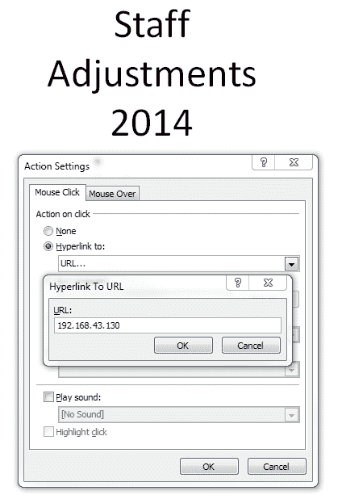

当文件打开时，它以全屏幻灯片形式启动。由于攻击是通过鼠标悬停发起的，因此用户在试图关闭文档时会发起攻击。

# 使用 DNS 重定向升级攻击

如果攻击者或渗透测试人员破坏了内部网络上的主机，他们可以使用 DNS 重定向升级攻击。这通常被认为是一种水平攻击（它会损害具有大致相同访问权限的人员）；但是，如果捕获特权人士的凭据，它也可能垂直升级。

在本例中，我们将使用 ettercap，它充当交换 LAN 的嗅探器、拦截器和记录器。它有助于中间人攻击，但我们将使用它发起 DNS 重定向攻击，将用户转移到用于我们的社会工程攻击的站点。

要启动攻击，我们必须首先修改位于`/etc/ettercap/etter.dns`的 ettercap 配置文件，将查询重定向到我们的敌对站点。在配置文件中可以找到使用 Microsoft 站点的示例；复制相同的详细信息，将目标站点请求定向到恶意 IP 地址，如以下屏幕截图所示：


在命令提示下键入`ettercap –G`以图形模式启动 eTerCap。在**嗅探**页签中，从下拉菜单中选择**统一**嗅探，如下图所示：


当提示选择网络接口时，为内部网络选择**eth0**（如您所见，当您选择其他接口时，ettercap 也将支持无线攻击）。您应该看到选项卡式菜单发生了变化，为您提供了更多选项。

从**主机**选项卡中，从下拉菜单中选择**扫描主机**。它将进行快速扫描，然后报告“x 台主机已添加到主机列表”。在**主机**页签中，选择**主机列表**查看可能的目标系统列表，如下图所示：

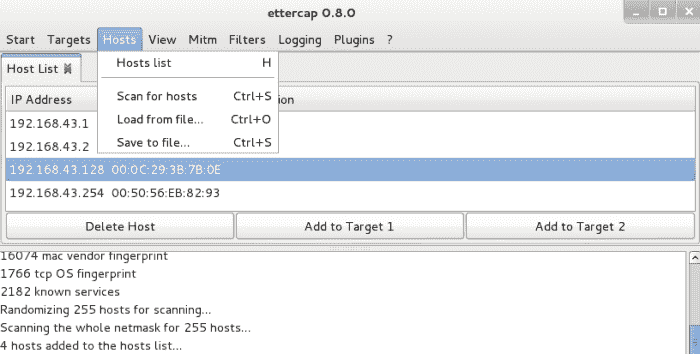

突出显示您希望针对的已识别系统（例如，位于交换 LAN 相同网段上的所有主机），并选择**添加到目标 1**选项卡。

完成后，选择**插件**选项卡，该选项卡将为您提供可供使用的 ettercap 插件列表。选择**ec_dns_spoof.so**插件，如下图所示：


要发起攻击，请选择**Mitm**选项卡，然后从下拉菜单中选择**Arp 中毒**，如下图所示。ETERCAP 将毒害所选系统上的地址解析协议表或缓存。

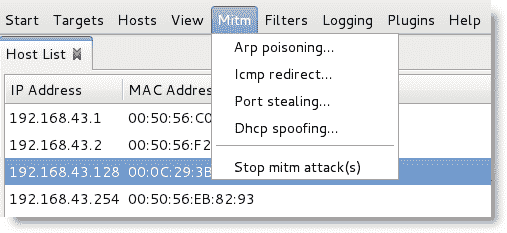

当选择 ARP 中毒时，将向您提供可选参数。选择用于嗅探远程连接的参数。然后，进入**启动**选项卡，选择启动统一嗅探。

当任何目标系统上的用户试图访问 Facebook 时，他们的缓存表不会向他们提供互联网上的位置。eTerCap 会将其查找转移到您在配置文件中提供的 URL，而用户将被定向到攻击者准备的恶意网页，并将受到诸如凭证获取之类的攻击。

在任何时候，被攻击的人都会在浏览器窗口中看到明显正确的 URL。

DNS 重定向可用于促进依赖用户单击 URL 链接发起攻击的所有攻击，这在有线和无线网络上都有效。

# 物理访问和敌对设备

Kali 和 SEToolkit 也有助于入侵者直接物理访问系统和网络的攻击。这可能是一种危险的攻击，因为入侵者可能被观察敏锐的人发现，或者被监视设备捕获。然而，回报可能是巨大的，因为入侵者可以破坏具有宝贵数据的特定系统。

物理访问通常是社会工程的直接结果，尤其是在使用模拟时。常见的模拟包括以下内容：

*   声称来自帮助台或 IT 支持部门的人员，只需通过安装系统升级快速中断受害者。
*   一个过来和客户交谈，然后找借口和别人交谈或去洗手间的小贩。
*   送包裹的送货员。攻击者可以选择在线购买送货制服；然而，由于大多数人认为任何一个穿着棕色衣服，推着装满箱子的手推车的人都是 UPS 送货员，所以制服很少是社会工程的必要条件！
*   穿着工作服、携带打印好的“工作单”的商人通常可以进入接线柜和其他区域，特别是当他们声称应建筑经理的要求在场时。
*   穿着昂贵的西装，拿着剪贴板，走得快，员工会认为你是一个不知名的经理。在进行这种类型的渗透时，我们通常会告知人们我们是审计师，我们的检查很少受到质疑。

敌对物理访问的目标是快速破坏选定的系统；这通常通过在目标上安装后门或类似设备来实现。

经典攻击之一是将 CD-ROM、DVD 或 USB 密钥放入系统中，并让系统使用自动播放选项进行安装；但是，许多组织在网络上禁用自动播放。

攻击者还可以在移动设备上创建“毒饵”陷阱，其中包含文件名，可邀请用户单击该文件并检查其内容。一些示例包括以下内容：

*   带有标签（如员工工资或医疗保险更新）的 USB 密钥。
*   Metasploit 允许攻击者将负载（如反向 shell）绑定到可执行文件（如屏幕保护程序）。攻击者可以使用公开的公司图像创建一个屏幕保护程序，并将带有新的*认可的屏幕保护程序*的 CD 邮寄给员工。当用户安装程序时，也会安装后门，并连接到攻击者。
*   如果您知道员工参加了最近的会议，攻击者可以冒充在场的供应商，并向目标发送一封信，暗示这是供应商展会的后续活动。典型的信息是：“如果您错过了我们的产品演示和一年免费试用，请单击 start.exe 查看随附 USB 密钥上的幻灯片”。

一个有趣的变体是 SanDisk U3 USB 密钥或智能驱动器。U3 密钥预先安装了 launchpad 软件，该软件在插入时自动允许密钥将文件或注册表信息直接写入主机，以帮助启动经批准的程序。`u3-pwn`工具（**Kali Linux****维护访问****OS 后门****u3**-**pwn**从 Sandisk u3 中删除原始 ISO 文件，并将其替换为恶意 Metasploit 负载，然后对其进行编码以避免在目标系统上检测。

不幸的是，对这些 USB 设备的支持正在减少，它们仍然容易受到与其他 Metasploit 有效负载相同程度的检测。

一个新兴的选择是使用 Teensy——一种小型集成电路设备，当插入基于 Windows 的系统时，它可以注册为 USB 键盘。这允许它绕过禁用自动运行或使用客户端防病毒软件的系统。从亚马逊网上购买一个 Teensy 大约需要 20 到 25 美元。

AUT0T0 生成 TENSEY 所需的代码，将其转换为攻击向量，如下面的截图所示：


一个被配置为敌对代理的小家伙是相当强大的；在对公司客户进行渗透测试期间，我们的测试人员已经证明，在每个被测试的网络上，有 100%的机会感染至少一个系统！

不幸的是，这些设备受到了很大的限制，它们只能执行编程设定的操作，而攻击者或渗透测试人员利用泄露后的任何发现的能力有限。

为了弥补这一短暂的下降，攻击者现在使用微型计算机，如树莓 PI 作为攻击向量。

## 树莓 Pi 攻击载体

Raspberry Pi 是一款微型计算机，它的尺寸约为 8.5 厘米 X 5.5 厘米，但能够打包 512 MB RAM、两个 USB 端口和一个以太网端口，该端口由 Broadcom 芯片支持，使用运行频率为 700 MHz 的 ARM 处理器（可超频至 1 GHz）。它不包括硬盘，但使用 SD 卡存储数据。如下图所示，树莓圆周率约为钢笔长度的三分之二；它很容易隐藏在网络上（在工作站或服务器后面，放置在服务器机柜内，或隐藏在数据中心的地板下）。


若要将 Raspberry Pi 配置为 AutoT0-攻击向量，则需要下列项目：

*   Raspberry Pi 型号 B 或更新版本
*   HDMI 电缆
*   微型 USB 电缆和充电块
*   以太网电缆或小型无线适配器
*   至少 8GB 的 10 级 SD 卡

所有的供应品加在一起，通常都可以在线购买，总价格不到 100 美元。

要配置 Raspberry，请下载最新版本的 Kali Linux ARM edition，并从源文件中解压缩。如果您是从基于 Windows 的桌面进行配置，请下载并解压缩 Win32DiskImager（[http://sourceforge.net/projects/win32diskimager/](http://sourceforge.net/projects/win32diskimager/) 。

使用读卡器，将 SD 卡连接到基于 Windows 的计算机，并打开**Win32DiskImager**。选择下载并先前提取的 Kali 的 ARM 版本`kali-custom-rpi.img`，并将其写入 SD 卡。这需要一些时间。

有关从 Mac 或 Linux 系统闪存 SD 卡的单独说明，请访问 Kali 网站。

将新闪存的 SD 卡插入 Raspberry Pi，并将以太网电缆或无线适配器连接到 Windows 工作站，将 HDMI 电缆连接到显示器，将 Micro USB 电源线连接到电源。一旦供电，它将直接引导到 Kali Linux。覆盆子依靠外部电源，没有单独的开/关开关；但是，Kali 仍然可以从命令行关闭。

安装 Kali 后，使用 apt get 命令确保它是最新的。

确保尽快更改 SSH 主机密钥，因为所有 Raspberry Pi 映像都具有相同的密钥。使用以下命令：

```
root@kali:~rm /etc/ssh/ssh_host_*
root@kali:~dpkg-reconfigure openssh-server
root@kali:~ service ssh restart

```

同时，确保更改了默认用户名和密码。

下一步是将 Raspberry 配置为使用**cron**定期连接回攻击者的计算机（使用静态 IP 地址或动态 DNS 寻址服务）。

然后，攻击者必须物理访问目标的场所，并将 Raspberry 连接到网络。大多数网络会自动为设备分配 DHCP 地址，并且对此类攻击的控制有限。

一旦 Raspberry 连接回攻击者的 IP 地址，攻击者就可以使用 SSH 发出命令，从远程位置对受害者的内部网络运行侦察和攻击应用。

如果连接了无线适配器，如 EW-7811Un，150 Mbps 无线 802.11b/g/nNano USB 适配器，攻击者可以无线连接，或使用 Pi 发起无线攻击（[第 8 章](08.html "Chapter 8. Exploiting Wireless Communications")、*利用无线通信*。

# 总结

社会工程是一种*黑客攻击人类*的方法——利用人与生俱来的信任和帮助来攻击网络及其设备。

在本章中，我们研究了如何使用社会工程来促进旨在获取网络凭据、激活恶意软件或协助发起进一步攻击的攻击。大多数攻击依赖于社会工程工具包；然而，Kali 还有其他几个应用可以使用社会工程方法进行改进。我们还研究了通常与社会工程结合使用的物理访问如何用于在目标网络上放置恶意设备。

在下一章中，我们将研究如何对无线网络进行侦察，并攻击开放网络以及受基于 WEP、WPA 和 WPA2 的加密方案保护的网络。我们还将研究无线协议中的一般弱点，这些弱点使它们容易受到拒绝服务攻击和模拟攻击。