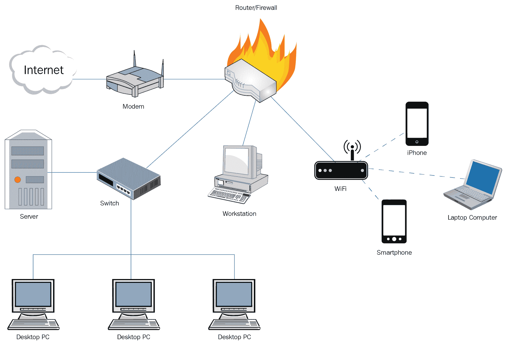
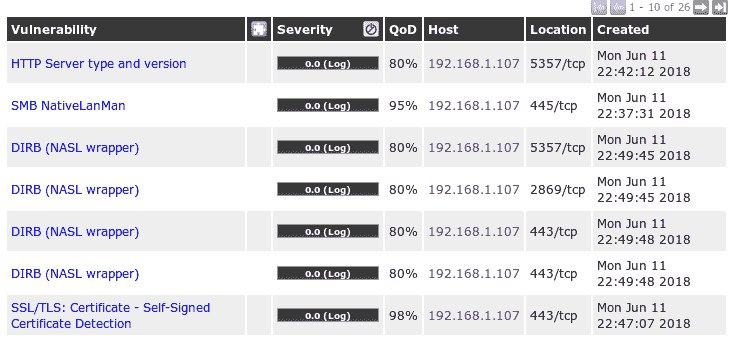

# 一、网络漏洞扫描简介

当今时代，黑客猖獗，每天在各种产品中都会发现关键漏洞，公司网络需要创建程序来实时识别、分析和缓解漏洞。在本课程中，我们将研究执行网络安全扫描所需的各种程序和工具，并了解所获得的结果并采取行动。

本课程将为任何读者提供计算机网络的基本知识，以及准备、计划和执行网络漏洞扫描的方法，并确定渗透测试的目标，或仅了解网络的安全态势。这将有助于初露头角的渗透测试人员征服并学会烹饪他们的方法，以执行识别漏洞的初步步骤。

本章将向您介绍计算机网络的基础知识。它也涉及到在执行网络漏洞扫描时要考虑的过程、用途和各种复杂性。本章将为您提供如何计划网络漏洞扫描的基本知识。

在本章中，我们将介绍以下内容：

*   基本网络及其组件
*   网络漏洞扫描
*   网络漏洞扫描中使用的程序流程
*   执行网络漏洞扫描的用途
*   执行网络扫描的复杂性
*   如何设计缓解计划并作出响应

# 基本网络及其组件

基本公司网络通常由诸如台式机/笔记本电脑、服务器、安全设备（如防火墙、代理、入侵检测和预防系统）以及网络设备（如集线器、交换机和路由器）等端点组成。大多数情况下，这些都是从不同的供应商处获得的，因此它们容易受到不同的攻击，并使网络暴露于更大的攻击面。黑客可利用公开的漏洞或零日漏洞攻击这些组件，以访问设备/机器，并有可能访问网络中的其他设备/机器或整个网络本身。请注意下图以说明这一点：

# 网络漏洞扫描

漏洞是系统或设备中存在的一种弱点，可能会受到攻击。网络漏洞扫描是一个使用各种自动化或手动工具和技术来识别和检测网络组件（如客户端、服务器、网络设备和端点）中漏洞的过程。它可以大致分为两种类型：内部网络漏洞扫描和外部网络漏洞扫描。

内部和外部漏洞扫描共享类似的过程，但在扫描设备或系统的网络位置上有所不同。外部漏洞扫描可以从攻击者通过互联网并通过网络的公共 IP 地址以网络为目标的角度识别漏洞，而内部漏洞扫描的操作考虑到攻击者是内部人，可以访问内部网络，并通过专用 IP 地址锁定网络。识别内部和外部威胁对于任何计算机网络来说都非常重要，以便根据识别的漏洞数量实时了解网络的安全性。

漏洞扫描对网络有其自身的副作用，如流量增加、网络资源无响应以及设备和服务器重新启动导致网络延迟增加。因此，组织内的所有内部网络扫描都应极其小心地进行，并获得适当的批准。一般来说，可以使用两种类型的扫描技术，经过身份验证的和未经身份验证的。我们将在[第 4 章](04.html)、*漏洞扫描、*和[第 5 章](05.html)、*配置审计*中看到这些扫描类型的配方。

初学者总是混淆漏洞扫描和渗透测试。漏洞扫描是识别可在其上执行渗透测试的主机的初步步骤。例如，作为漏洞扫描的一部分，您确定服务器上的端口`80`处于打开状态，容易受到**远程代码执行**（**RCE**攻击。对于渗透测试，将输入此信息，因为您已经知道服务器易受 RCE 攻击，并且将尝试执行攻击并危害服务器。

在执行网络漏洞扫描之前，始终建议通知利益相关者，并根据服务器和服务器上承载的数据的重要性（如果需要）获得停机时间。在开始扫描之前和扫描完成之后写一封电子邮件是一种很好的做法，因为这将有助于各个团队检查服务的连续性。

在本课程的后续章节中，我们将了解许多方法，以了解在网络漏洞扫描期间要遵循的各种最佳实践。

# 程序流程

网络漏洞扫描活动可分为三个阶段：

*   发现
*   端口扫描
*   漏洞扫描

# 发现

发现，也称为**主机发现**，是枚举活动主机的过程，是安全测试活动侦察阶段的一个非常重要的组成部分。这将帮助您从目标列表中删除不需要的主机，从而允许您使用这些枚举主机执行目标扫描和渗透测试。可用于执行网络发现的一些工具有 Nmap、Nessus、OpenVas 和 Wireshark。

以下屏幕截图显示了使用 Nmap 扫描以进行查找的示例主机。它显示主机已启动，因此我们可以确定主机处于活动状态：

如果在网络上禁用 ping，这些工具将派上用场。与其他工具相比，我总是更喜欢使用 Nmap，因为它易于使用，并且有**Nmap 脚本引擎**（**NSE**），允许用户编写和实现自定义脚本。我们将在接下来的章节中讨论 NSE。

在本课程中，我们将进一步向您介绍有关如何手动执行主机发现和使用工具的各种方法。

# 端口扫描

在此阶段，我们将根据特定主机端口上的主机与您的计算机之间的通信来检测该主机打开的端口。此技术有助于确定特定端口是打开的还是关闭的。这种技术因协议而异。例如，对于 TCP，与 UDP 相比，确定端口打开的通信和模式是不同的。可用于执行端口扫描的一些工具有 Nmap、Nessus、OpenVas 和 Wireshark。

下面的屏幕截图显示了使用端口`80`的 Nmap 扫描的示例主机。屏幕截图显示主机已启动并将`80`端口与`state`端口连接为`open`，因此我们可以确定主机处于活动状态。如果在网络上禁用 ping，则这些工具非常有用：

在本课程中，我们将进一步向您介绍如何手动和使用工具执行端口扫描的各种方法。

# 漏洞扫描

一旦在发现的活动主机上识别出打开的端口，我们就可以执行漏洞扫描。漏洞扫描可检测并识别主机上安装的软件和工具的已知问题，如使用中的旧版本软件、启用的易受攻击协议和默认密码。手动执行此活动很困难；因此，此阶段需要使用自动工具来执行，这些工具可以识别打开的端口，并尝试在端口上进行各种利用，以确定使用端口的特定进程/软件是否容易受到基于进程的利用。用于执行漏洞扫描的一些工具有 Nessus、OpenVas 和 Qualys。

以下屏幕截图显示了使用 OpenVas 扫描漏洞的示例主机。您可以看到，输出显示了主机受影响的漏洞列表：

在本课程中，我们将进一步向您介绍有关如何使用 Nessus 扫描主机漏洞的各种方法，以及如何自定义这些扫描以获得特定且更少的误报结果。

# 使用

如本章前面部分所述，执行网络漏洞扫描的主要优点是了解网络的安全态势。网络漏洞扫描的结果提供了一组对管理员和渗透测试人员都有用的信息，例如：

*   不需要的端口已打开，服务正在运行
*   默认用户帐户和密码信息
*   缺少修补程序、更新和升级
*   安装的软件的易受攻击版本
*   使用中的易受攻击协议
*   使用中的易受攻击算法
*   利用前面所有漏洞的信息进行攻击

网络漏洞扫描允许识别打开的不必要端口以及这些端口上运行的服务。例如，非军事区中的应用/web 服务器不需要打开 TCP 端口`22`并向 internet 公开。这些不需要的端口使主机/设备容易受到攻击。大多数扫描器在识别任何托管服务的登录界面时，都会尝试使用预先存在的用户名和密码数据库登录，并提供所有默认用户名和密码的报告，使用这些用户名和密码可能会危害服务。

经认证的修补程序扫描可以显示各种受支持平台的缺失修补程序和更新的详细信息。这些信息非常关键，因为这些缺失的补丁大部分都可以通过互联网进行攻击，可以利用这些漏洞在网络上重现类似的攻击。这还可能揭示网络机器上安装的第三方工具中缺少的各种补丁。此信息有助于攻击者将这些工具作为攻击目标，并获得对节点甚至整个网络的访问权限。

网络漏洞扫描还突出显示网络内或节点上使用的各种易受攻击的协议。例如，如果服务器正在运行支持 SMBv1 协议的 SMB 共享，它将突出显示为风险等级高于中等的漏洞，因为 SMBv1 易受各种已知恶意软件攻击。此外，扫描还突出显示了运行的服务所使用的易受已知中间人攻击的易受攻击的密码和身份验证方法。例如，如果 web 服务器使用 HTTP 协议上的基本身份验证，则在网络上执行中间人攻击时，很容易暴露用户凭据。

大多数漏洞扫描器，包括开源软件和付费软件，都提供与攻击相关的漏洞利用信息，作为漏洞描述的一部分。通过提供攻击方法或攻击代码本身的直接链接，这将使攻击者和渗透测试人员的生命变得容易。

以下屏幕截图提供了指向提供有关扫描仪报告的漏洞信息的文档的链接：

与前面的技术用例一样，从组织的角度来看，网络漏洞也有各种用途，例如：

*   重视和关注信息安全
*   帮助主动发现潜在风险
*   导致网络更新
*   推进行政知识的发展
*   防止关键基础设施的财务损失
*   优先考虑需要升级修补与延迟修补的漏洞

# 复杂性

今天的网络环境有一个复杂的结构，由防火墙、DMZ 和网络设备（如交换机和路由器）组成。这些设备由复杂的访问列表和虚拟网络配置组成，因此很难概括任何活动。上述任何配置的改变都可能导致整个网络架构的改变。

如果我们希望对任何网络组件执行基于 IP 的扫描，我们必须确保生成的所有数据包都完好无损地到达目的地，并且不会受到其间任何设备或解决方案的影响。例如，如果 Alice 正在网络上扫描 Bob 的计算机，并且两者都被防火墙隔开，Bob 的子网被配置为 WAN Ping 块模式，作为其中的一部分，Ping 数据包将在防火墙级别被识别和丢弃，Alice 对 Bob 计算机的主机发现扫描将导致机器不带电的假阳性。

为了使用网络漏洞扫描成功执行安全分析，需要考虑以下因素：

*   扫描范围
*   网络体系结构
*   网络接入

# 扫描范围

如果我们需要对特定应用的基础设施执行漏洞评估，那么识别数据传输源和端到端通信中涉及的组件是非常重要的。这将允许渗透测试人员在此范围内执行漏洞扫描，并识别特定于此应用的漏洞。相反，如果我们选择扫描子网或更大范围的 IP 地址，我们可能会突出显示不必要的漏洞，这在大多数情况下会导致修复阶段的混乱。例如，如果我们希望审核基于 web 的应用，我们可能希望将 web 应用、应用服务器、web 服务器和数据库服务器作为审核范围的一部分。

# 网络体系结构

了解 IP 地址或我们正在执行漏洞扫描的组件的位置始终很重要。这将帮助我们定制我们的方法并减少误报。例如，如果 Alice 试图扫描 web 应用防火墙后托管的 web 应用，她需要使用编码等技术自定义用于识别漏洞的有效负载或脚本，以确保有效负载不会被 web 应用防火墙阻止。

# 网络接入

当您被指派在大型网络上执行网络漏洞扫描时，了解您的设备或主机是否提供了执行扫描活动的正确访问权限是非常重要的。未正确访问网络而执行的网络漏洞扫描将产生不完整的结果。始终建议在网络设备上将扫描仪设备或主机 IP 地址列为白名单，以获得对扫描范围的完全访问。

# 回答

一旦获得网络漏洞扫描报告，制定缓解计划以缓解报告中突出显示的所有漏洞非常重要。以下是一些可作为网络安全扫描报告一部分的解决方案：

*   关闭不需要的端口并禁用不需要的服务
*   使用强密码和不常用密码
*   始终应用最新的修补程序和更新
*   卸载或更新旧版本的软件
*   禁用正在使用的旧协议和旧协议
*   使用强大的算法和身份验证机制

需要根据调查结果编写报告，并将任务分配给各部门。例如，负责维护 Windows 计算机的相应团队将缓解所有与 Windows 相关的漏洞。一旦各团队的职责得到了排序，各团队将对报告中提供的解决方案进行影响和可行性分析。团队必须对照安全目标、机密性、完整性和可用性检查解决方案。这些缓解措施可以用作创建强化文档的基线，包括公共或私有域中的任何其他可用基线。

一旦解决方案在受影响的主机上实施，团队就必须将这些建议的补救措施包括在现有策略中，以避免将来出现错误配置。这些政策将不时更新，以符合当前的安全标准。

任何组织或个人都需要遵守并创建以下活动的循环，以实现其信息安全目标：

1.  漏洞评估
2.  缓解分析
3.  修补、更新和缓解

如前所述，漏洞评估将导致网络中存在的所有开放缺口，之后需要进行缓解分析，以了解必须实施的补救措施，并对其是否会对网络组件的连续性产生任何影响进行可行性检查。确定所有补救措施后，实施补救措施并跳到步骤 1。如果每季度执行一次此周期，可以确保对网络提供最大程度的保护

始终确保解决方案已在测试环境中实施，对网络上承载的应用的连续性有任何影响；还要查找任何依赖项，以确保网络功能不受影响

# 总结

总之，网络漏洞扫描是一个三阶段的过程，包括发现、端口扫描和漏洞扫描。如果正确执行，这将有助于组织确定其当前的安全态势，并创建可操作的解决方案，以改善这种态势。我们在本章中看到了计划网络漏洞扫描的步骤以及涉及的各种因素。在接下来的章节中，我们将研究有关如何执行此网络漏洞扫描以识别漏洞并对其采取行动的教程