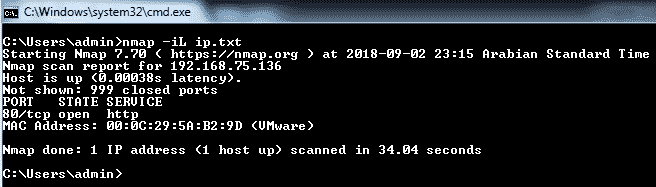
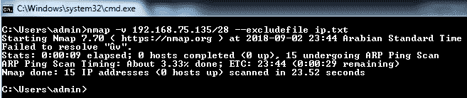
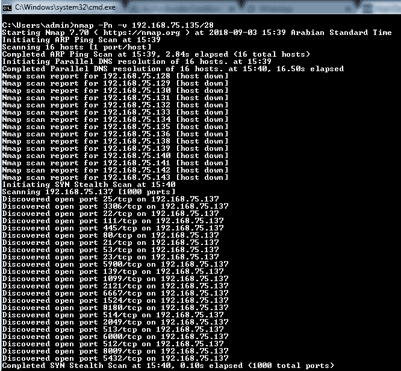
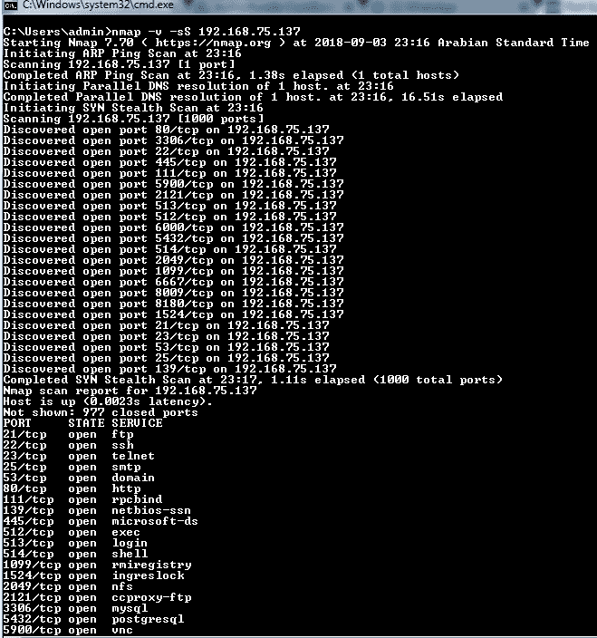
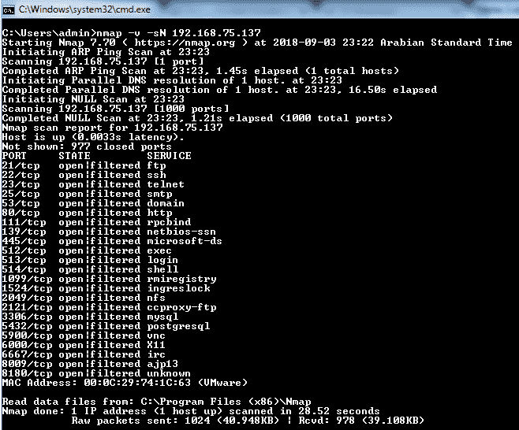
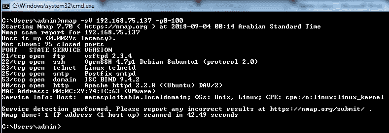
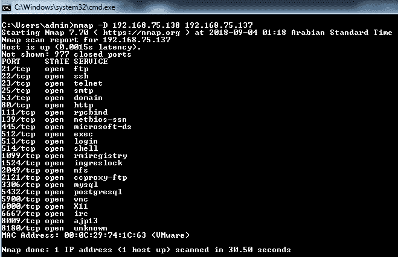
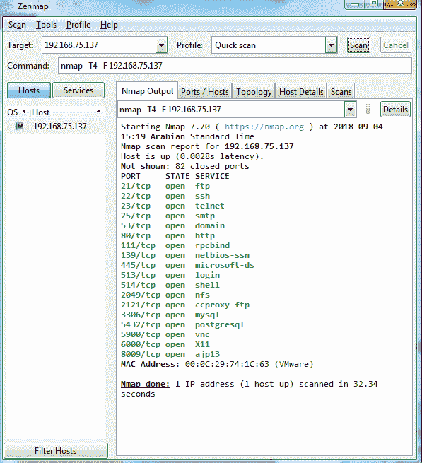

# 三、端口扫描

在本章中，我们将介绍以下配方：

*   如何指定目标
*   如何执行主机发现
*   如何识别开放端口
*   如何管理规范和扫描订单
*   如何执行脚本和版本扫描
*   如何检测操作系统
*   如何检测和绕过网络保护系统
*   如何使用 Zenmap

# 介绍

在本章中，我们将介绍各种方法，解释如何使用 Nmap 执行各种端口扫描技术。每个配方都包含在测试虚拟机上执行 Nmap 扫描的实际细节，使您能够了解 Nmap 支持的各种交换机的功能

# 如何指定目标

`nmap`命令将任何附加的没有关联开关的内容解释为目标。以下是一种基本语法，用于指定要扫描的 IP 地址或主机名，而无需任何关联的交换机：

```
nmap 127.0.0.1nmap localhost
```

主机名通过配置的 DNS 服务器解析，并获取 IP 地址以执行扫描。如果多个 IP 地址与一个主机名关联，将扫描第一个 IP 地址并显示结果。以下语法允许`nmap`对使用命令中提供的主机名解析的所有 IP 地址执行扫描：

```
nmap xyz.com*
```

Nmap 还支持扫描整个子网，前提是在 IP 地址或主机名的末尾附加掩码。然后，NMAP 将考虑在所述掩码范围内的所有解析 IP 地址。例如，`10.0.0.1/24`会扫描`10.0.0.1`和`10.0.0.255`之间的`256`主机，包括`.1`和`.255`。`10.0.0.21/24`将扫描完全相同的目标。

Nmap 还允许您解析整个子网，然后从扫描中排除某些主机。例如，以下语法允许您扫描解析为`10.0.0.1/24`的所有主机，但最后网络位为`.1`或`.255`的任何 IP 地址除外：

```
nmap 10.0.0.2-254
```

这可以用于四个网络位中的任何一个，例如`10.0.1-254.1-254`，这将允许您跳过 IP 地址`10.0.0.0`、`10.0.0.255`、`10.0.255.0`和`10.0.255.255`。Nmap 还支持完全限定的 IPv6 地址，但不支持八位字节范围。对于具有非全局作用域的 IPv6 地址，需要提及区域后缀 ID。

Nmap 支持用户指定目标的各种输入格式。以下是可用于提及指定格式的主机的开关：

```
nmap –iL <inputfilename>
```

这将允许用户创建一个文本文件，其中包含要扫描的所有 IP 地址/范围的列表。当您需要扫描多个 IP 地址时，这是一个可行的选择。例如，如果要扫描具有 10000 多个资产的中型组织的不同子网的所有 IP 地址，则无法在命令行中输入这些 IP 地址。相反，创建一个包含所有要扫描的 IP 地址列表的文本文件，并在`-iL`之后提及带有绝对路径的文件名。`Nmap`然后从文件中获取 IP 地址列表并执行扫描：

```
nmap -iR <num hosts> 
```

对于大型组织和基于 internet 的扫描，您可能希望扫描随机目标或识别未知目标。`–iR`开关和附加的扫描随机主机数量将允许用户执行这些操作。例如，如果您试图在 ftp 端口打开的情况下识别八个随机主机，则可以使用以下语法：

```
nmap –sS –Pn –p 21 –iR 8 --open
```

当您的输入是一系列服务器、子网或预先存在的大型服务器列表时，以下语法将帮助您排除服务器。扫描时忽略了与此开关一起提到的主机，从而防止服务器受到任何不必要的流量的影响：

```
nmap --exclude <host1>[,<host2>[,...]]
```

下面的命令与前面的语法类似，只是主机排除列表是从文件中提取的，而不是手动提及服务器列表。当要从扫描中排除的主机列表较长时，这是可行的：

```
nmap --excludefile <exclude_file>
```

# 准备

要执行此活动，您必须在计算机上满足以下先决条件：

*   安装 Nmap。
*   提供对要执行扫描的主机的网络访问。

要安装 Nmap，您可以按照[第 2 章](02.html)*了解网络扫描工具*中提供的说明进行操作。这将允许您下载兼容版本的 Nmap 并安装所有必需的插件。要检查您的计算机是否安装了 Nmap，请打开命令提示符并键入 Nmap。

如果安装了 Nmap，您将看到类似于以下屏幕截图的屏幕：


如果未看到此屏幕，请将命令提示符控件移动到安装了 n`map`的文件夹（`C:\Program Files\nmap`中），以重试该步骤。如果执行此操作后仍看不到屏幕，请卸下并重新安装 n`map`。

要在要进行扫描的主机上填充打开的端口，您需要具有对该特定主机的网络级访问权限。检查您是否可以访问特定主机的一种简单方法是通过 ICMP 向主机发送 ping 数据包。但这种方法只有在该网络中启用 ICMP 和 ping 时才有效。如果 ICMP 被禁用，则实时主机检测技术会有所不同，我们将在*How do it.中看到这一点。。*此配方的各个部分。

此配方的先决条件与本章中的所有其他配方相同

# 怎么做…

以下是步骤：

1.  在命令提示下打开`nmap`。
2.  在命令提示符下输入以下语法扫描 IP 地址`192.168.75.136`：

```
nmap  192.168.75.136
```


3.  在命令提示符中输入以下语法以扫描`ip.txt `文件中存在的 IP 地址：

```
 nmap  -iL ip.txt
```



4.  在命令提示符中输入以下语法，以从扫描列表中排除`192.168.75.136`IP 地址：

```
 nmap  -v 192.168.75.135/28 --exclude 192.168.75.136
```


5.  在命令提示符中输入以下语法，从扫描列表中排除`ip.txt`文件中提到的 IP 地址：

```
 nmap –v 192.168.75.135/28 --excludefile ip.txt
```



# 它是如何工作的。。。

此配方中提到的选项可帮助用户方便地选择目标，而不考虑其网络的大小或提供的主机列表。Nmap 不要求用户输入要扫描的主机的最终列表。相反，如本配方所示，它提供了各种选项，动态允许 Nmap 基于各种过滤器选择目标。基于文件的过滤器允许 Nmap 输入要扫描的主机的可用列表，从而减少定制或格式化列表所需的工作量

# 如何执行主机发现

识别正在运行的主机的基本技术之一是发送 ICMP ping 数据包并分析响应以得出结论。如果主机或网络在网络级别或主机级别阻止 ICMP 数据包，该怎么办？根据 ICMP 技术，主机或网络不会在实时主机列表中弹出。主机发现是网络渗透测试或漏洞扫描的核心组件之一。完成一半的主机发现可以忽略作用域中的主机或网络，并执行任何进一步的操作，从而使网络易受攻击。

Nmap 提供了各种选项和技术，通过发送定制的数据包来满足特定的网络条件，从而识别实时主机。如果未提供此类选项，Nmap 默认情况下会发送 ICMP 回显以识别活动主机。提供的探头选项可以组合使用，以增加识别其他端口的可能性。一旦 Nmap 探测活动主机并获得活动主机列表，默认情况下，它将扫描打开的端口。

Nmap 提供以下选项以执行主机发现：

*   `–sL`：此选项列出所提供子网中存在的 IP 地址。它还尝试将 IP 地址解析为它们的主机名。主机名可以帮助攻击者或渗透测试人员了解大量有关网络的信息。您将无法将此选项与任何其他选项（如操作系统发现）相结合，因为其功能只是列出 IP 地址。
*   `-sn`：此选项告知 Nmap 在执行主机发现后不要执行端口扫描。相反，它只是列出了找到的实时 IP 地址。这将使用 ICMP 回显来识别可用的主机，如果网络中存在防火墙，则这些主机将无法工作。

*   `-Pn`（无 ping）：通常，只有在发现主机处于活动状态时，Nmap 才会执行探测、端口检测、服务检测和操作系统检测选项等活动。此选项允许 Nmap 在提供给扫描的主机列表上执行所有操作。例如，如果指定了具有子网`/28`的类`C`IP 地址，则 Nmap 将在所有`255`主机上执行探测，而不是检查活动主机并在其上执行活动。这是一个广泛的扫描选项，会产生大量流量。
*   `-PS`（端口列表）：此选项发送设置了 SYN 标志的空 TCP 数据包。这也称为 syn-ping 数据包。通常，为了实现完整的 TCP 连接，主机在接收 SYN 数据包时会生成 ACK。接收到 ACK 数据包后，Nmap 主机生成 SYN/ACK 数据包，然后建立连接。相反，Nmap 发送一个 RST，它是一个重置标志数据包，用于断开连接，从而声明端口打开。这将允许您在不实际创建连接的情况下确定打开的端口，因为任何连接都将在网络和系统级别记录。此选项还允许攻击者在执行检测时不留下任何痕迹。

`-PS`和端口号之间没有空格。您还可以指定要在其上执行操作的端口范围。

*   `-PA`（端口列表）：这类似于 SYN 扫描，也称为 TCP 确认 ping 扫描。Nmap 使用 ACK 集合生成 TCP 数据包。ACK 基本上确认通过连接传输的任何数据，但 Nmap 机器与主机之间没有现有连接，因此它返回启用 RST 标志的数据包。这将允许 Nmap 确定端口已打开且服务正常运行。
*   `-PU`（端口列表）：这也类似于 TCP 扫描，但此 UDP ping 扫描用于 UDP 端口。对于大多数端口，数据包是空的，除了任何特定于服务的端口，如 DNS 和 NTP。如果 DNS ping 数据包到达一个关闭的端口，UDP 探测将触发主机的 ICMP 不可访问响应。如果未生成此响应或连接似乎处于空闲状态，则表示端口正在运行，并且端口上正在运行服务。

*   `-PY`（端口列表）：此交换机生成一个包含部分初始化数据的 SCTP 包。这意味着您正在尝试建立连接。如果目标端口关闭，则返回中止数据包；否则，通过使用 INIT-ACK 进行应答，连接将进入四向握手的下一步。收到 INIT-ACK 后，Nmap 机器将发送 INIT-ACK 并将端口标记为打开，而不是创建连接。
*   `-PO`（协议列表）：此协议列表扫描允许 Nmap 使用数据包头中启用的两个协议（如 ICMP 和 IGMP）配置数据包，以查看是否存在任何主机无法访问的响应，以确定目标端口不支持协议，从而将端口标记为关闭。
*   `-PR`（ARP Ping）：ARP 扫描允许 Nmap 向远程主机发送 ARP 请求。如果有任何响应，则 Nmap 将主机标记为活动主机，而不检查任何其他结果。这也支持 IPv6。
*   `--disable-arp-ping`：这允许用户在网络设备或代理响应 ARP 请求时获得特定结果，从而造成所有主机似乎都已启动的情况。
*   `--traceroute`：Traceroute 是一个扫描后模块，用于确定到达远程主机的最佳端口。这通过发送低 TTL 数据包来实现。
*   `-n`：允许用户跳过 DNS 解析过程。这可能很慢，因此扫描需要很多时间。
*   `-R`：此选项是`-n`的对应项。它要求 Nmap 对所有活动主机执行反向 DNS 解析。
*   `--system-dns`：这可用于指定用于解析的 DNS 服务器应为主机上配置的 DNS 服务器。
*   `--dns-servers <server1>[,<server2>[,...]]`：此选项可用于定义用于反向 DNS 解析的特定 DNS 地址。

# 怎么做…

以下是步骤：

1.  在命令提示下打开`nmap`。
2.  在命令提示符下运行以下语法以仅执行实时扫描，而不执行端口扫描的探测：

```
 nmap –sn -v 192.168.75.135/28
```


3.  在命令提示符下运行以下语法以执行无 ping 扫描：

```
 nmap –Pn -v 192.168.75.135/28
```



# 它是如何工作的…

这些选项有助于用户简化识别活动主机的需求，从而执行进一步的探测。使用这些不同的扫描选项，用户可以针对特定端口和协议来获取主机的当前状态。可以使用高级探测技术（例如服务检测和操作系统检测的参数）进一步配置这些选项中的大多数，以获取有关这些实例的更多信息。

# 如何识别开放端口

以下是 Nmap 中存在的六个端口状态：

*   `open`：这意味着该端口正在运行，并且有一个服务正在运行或访问它。因此，服务可以接受根据该端口上使用的协议和服务进行的任何连接。
*   `closed`：一个关闭的端口没有被任何服务访问，没有服务在其上运行。因此，在这些端口上不会成功进行任何外部连接。
*   `filtered`：此状态与由于网络中存在数据包过滤机制而未收到响应的端口相关。这可能是由中间网络保护设备引起的。
*   `unfiltered`：此状态与 Nmap 无法确定其是否打开或关闭的端口相关联。大多数确认扫描标签端口处于未过滤状态；此外，SYN 和 FIN 等扫描有助于解决此类问题。
*   `Open|filtered`：当没有收到来自 Nmap 的响应时，Nmap 会对此类端口进行分类。UDP、IP 协议、FIN、NULL 和 Xmas 扫描将此状态与端口关联。
*   `closed|filtered`：此状态与 Nmap 无法确定其是否打开或关闭的端口相关联。只有空闲扫描使用此状态。Nmap 为用户提供了各种扫描选项，以创建一个数据包，从而获得所需的结果，以便 Nmap 对端口是打开的还是关闭的进行分类。大多数扫描类型只允许管理用户使用，因为他们有权创建和发送原始数据包。
*   `-sS (TCP SYN Scan)`：这也称为半开放扫描，因为 TCP 需要在建立连接之前完成三方握手。Nmap 机器生成 TCP SYN 数据包，远程端口用 TCP ACK 响应该数据包，然后 Nmap 发送 RST 标志来破坏握手，而不是发送 SYN/ACK 数据包，从而阻止连接。如果 Nmap SYN 数据包接收到 ACK 或 SYN 数据包作为响应，则考虑该端口。
*   `-sT (TCP connect scan)`：如果用户没有发送原始数据包所需的权限，或者当 SYN 扫描不是选项时，则使用 TCP 连接扫描。顾名思义，NMAP 执行一个完整的三方握手，并创建一个连接来考虑端口是开放的。

*   `-sU (UDP scans)`：UDP 扫描向`53`和`61`等知名端口发送数据包，然后可以在所有端口上执行。它向著名端口发送特定于协议的数据包，并向其余端口发送通用 UDP 数据包。如果扫描的端口返回 ICMP 不可访问错误，则端口关闭。但如果没有来自端口的响应，则会将其标记为 open filtered。为了查明端口是否正在实际运行服务并处于打开状态，我们可以运行服务检测扫描。
*   ` -sY (SCTP INIT scan)`：SCTP 初始化扫描已经在*如何执行主机发现*一节中讨论过。为了执行此扫描，应该有一个正在运行的 SCTP 模块。
*   `-sN; -sF; -sX (TCP NULL, FIN, and Xmas scans)`：为了执行更深入的探测，Nmap 提供了一个选项来制作具有不同标志的数据包，如 FIN、PSH 和 URG。如果未设置任何标志，则称为空扫描。如果设置了 FIN 标志，则称为 FIN 扫描；如果设置了所有三个标志，则称为 Xmas 扫描。
*   `-sA (TCP ACK scan)`：TCP ACK 扫描已经在*如何执行主机发现*部分讨论过。
*   ` -sW (TCP Window scan)`：TCP 窗口扫描根据接收到的 RST 数据包的 TCP 窗口字段的值工作。大多数系统对于关闭端口的 RST 数据包有一个零窗口，对于打开端口有一个正值窗口。一旦收到 RST 数据包，这会将端口列为已关闭而不是未过滤。
*   `--scanflags (Custom TCP scan)`：`Custom TCP scan`允许用户在 TCP 数据包中设置各种标志，如 URG、SYN、ACK、FIN、PSH、URG 和 RST，从而允许用户为探测器创建自定义数据包。
*   `-sO (IP protocol scan)`：此扫描允许您定义正在执行扫描的协议，如 TCP、UDP、ICMP 和 IGMP，从而为探测器创建特定的数据包。
*   `-b <FTP relay host> (FTP bounce scan)`：这允许用户连接到一个 FTP 主机，然后将文件中继到另一个 FTP 主机，如参数中所述。

# 怎么做…

以下是步骤：

1.  在命令提示下打开`nmap`。
2.  在命令提示符下运行以下语法以执行 TCP SYN 扫描：

```
 nmap –v –sS 192.168.75.137
```



3.  在命令提示符下运行以下语法以执行 TCP 连接扫描：

```
 nmap –v –sT 192.168.75.137
```


4.  在命令提示符下运行以下语法以执行 TCP NULL 扫描：

```
 nmap –v –sN 192.168.75.137
```



# 它是如何工作的…

这些选项可帮助用户简化识别开放端口的要求，从而执行进一步的攻击。使用这些不同的端口扫描选项，用户可以针对特定的端口和协议来获取端口的当前状态。通过获取准确的服务名称和版本，可以在端口上执行进一步的侦察，我们将在本书的后续章节中看到。

# 如何管理规范和扫描订单

Nmap 提供了各种选项来指定以随机或顺序扫描的端口。所有 Nmap 扫描，没有指定任何端口或作为参数提供任何特定 NSE 脚本，默认情况下仅扫描前 1000 个端口：

*   `-p <port ranges>`：此选项可用于配置要以多种格式扫描的端口。它可以是范围或列表。如果要执行全端口扫描，语法的一般表示形式为`–p1-65535`，或者`–p1`、`2`、`3`或`4`作为随机列表，本质上可以是非串行的。
*   `--exclude-ports <port ranges>`：当要求是一个完整的端口，但有一些例外情况时，准备要扫描的端口列表是一项繁琐的任务。在这种情况下，可以使用 exclude ports 标志排除不需要扫描的端口。
*   `-F (Fast (limited port) scan)`：快速扫描进一步将默认扫描端口数从 1000 减少到 100。顾名思义，这将大大缩短扫描时间，从而提供更快的结果。
*   `-r (Don't randomize ports)`：默认情况下，Nmap 随机化扫描的端口顺序。此选项允许用户指示 Nmap 遵循要扫描端口的严格顺序。
*   `--port-ratio <ratio>`：以大于给定的比率扫描 Nmap 服务文件中的所有端口。`<ratio>`必须介于`0.0`和`1.0`之间。
*   `--top-ports <n>`：在排除`--exclude-ports`指定的所有端口后，扫描 Nmap 服务文件中找到的`<n>`比率最高的端口。`<n>`必须为`1`或更高。

# 怎么做…

以下是步骤：

1.  在命令提示下打开`nmap`。
2.  在命令提示符下运行以下语法，在端口`0-100`之间执行扫描：

```
 nmap 192.168.75.137 –p0-100
```


3.  在命令提示符下运行以下语法，对顶部`100`端口执行快速扫描：

```
 nmap –F 192.168.75.137
```


4.  在命令提示符下运行以下语法，以执行不带任何端口规范的扫描：

```
 nmap 192.168.75.137
```


# 它是如何工作的…

提供在两个范围和列表中指定端口的选项将允许用户优化其扫描，从而提供更快的结果，因为全端口扫描通常比 1000 端口扫描或端口指定扫描花费的时间长 10 倍。这还允许用户查找特定端口打开的主机。

# 如何执行脚本和版本扫描

在进行渗透测试时，侦察对于通知下一步测试非常重要。即使 Nmap 提供了开放端口和在端口上运行的服务的版本，您也需要知道正在运行的服务的确切版本或名称，以便准备进一步利用这些服务或进一步了解系统。

Nmap 服务探测数据库包含特定的数据包构造技术，用于探测特定的服务并分析从它们接收到的响应。Nmap 提供有关服务协议、应用名称、版本号、主机名、设备类型和操作系统系列的信息。它有时还确定服务是否对连接开放，或者是否有任何默认登录可用于该服务：

*   `-sV`（版本检测）：此标志允许 Nmap 在特定主机上执行版本检测。此标志具有可与之结合使用的选项。
*   `--allports`：Nmap 跳过一些在建立连接时启用了默认功能的端口。此选项将允许用户跳过任何此类排除，并根据提供的语法执行全端口扫描。
*   `--version-intensity <intensity>`：定义配置探头以确定版本的强度。此标志的值的范围在`0-9`之间，默认为`7`。值越高，服务版本越有可能准确。

*   `--version-light`：用于配置打火机探头，减少扫描时间。
*   `--version-all`：这将探头强度设置为`9`，从而使扫描速度变慢，结果有可能更准确。
*   `--version-trace`：这会打印出很多关于正在执行的版本扫描的信息。

# 怎么做…

以下是步骤：

1.  在命令提示下打开`nmap`。
2.  在命令提示符下运行以下语法，在端口范围`0-100`上执行服务扫描：

```
 nmap –sV 192.168.75.137 –p0-100
```



3.  在命令提示符下运行以下语法，对端口范围`0-100`执行服务扫描，查看扫描的调试信息：

```
 nmap –sV 192.168.75.137 –p0-100 –version-trace
```


# 它是如何工作的…

版本扫描可帮助用户获得运行的服务的大致版本和名称。例如，如果用户确定某个 FTP 版本正在远程主机上运行，他们可以搜索该版本的相关漏洞，因为存在版本相关漏洞。

# 如何检测操作系统

Nmap 使用 TCP/IP 堆栈指纹进行操作系统检测。这是通过制作自定义 TCP 和 UDP 数据包并分析其响应来完成的。在生成各种此类探针并将结果与 2600 多个已知操作系统指纹的`Nmap-os-db`数据库进行比较后，提供操作系统版本。指纹提供了详细信息，如供应商名称、操作系统名称、操作系统生成、设备类型，以及它们的公共平台枚举（CPE）表示。如果操作签名的 Nmap 数据库中不存在指纹，Nmap 还为用户提供了一个提交指纹的选项：

*   *`-O`（启用 OS 检测）：启用 Nmap 扫描的 OS 检测。此标志还具有可与之结合使用的选项。*
**   `--osscan-limit`：当扫描主机列表时，此选项将跳过没有打开用于操作系统检测的端口的主机，从而缩短扫描时间，从而为实时主机提供更快的结果。*   `--osscan-guess; --fuzzy`：如果 Nmap 无法识别操作系统，则会尝试提供最接近的签名，签名之间的相似度应该非常高。这里列出的标志将允许 Nmap 更积极地猜测是否找到了确切的操作系统。*   `--max-os-tries`：如果操作系统探测无法识别完美匹配，Nmap 默认重试五次。这将允许用户限制这些尝试，从而节省大量扫描时间。*

 *# 怎么做…

以下是步骤：

1.  在命令提示下打开`nmap`。
2.  在命令提示符中运行以下语法以执行操作系统检测：

```
nmap –O 192.168.75.137
```


# 它是如何工作的…

识别远程主机上运行的操作系统对于任何漏洞扫描或渗透测试过程都非常有用，因为这将允许您区分适用的漏洞和漏洞利用。

# 如何检测和绕过网络保护系统

Nmap 的基本功能是生成自定义数据包，并在发送到远程主机后分析其响应。网络保护系统（如防火墙、入侵预防和检测系统）有时不允许这样做。在本配方中，我们将讨论可用于绕过这些保护的一些方法：

*   `-f`（片段数据包）：大多数防火墙执行有状态和无状态数据包检查，检查数据包的内容，并根据其内容决定是否允许数据包或丢弃数据包。为了绕过这一点，Nmap 提供了一个选项来对数据包进行分段，以便网络设备将无法构造数据包来读取正确的内容，从而绕过保护。
*   `--mtu`（最大传输单元规格）：其工作原理与前面创建不同大小数据包的方法类似。使用 MTU，您可以以`8`的倍数指定数据包大小，例如`8`、`16`、`24`、`32`等。这将允许 Nmap 创建此大小的数据包，从而绕过保护。
*   `-D`（诱饵地址）：这将允许 Nmap 从诱饵地址生成数据包。这将产生具有多个源 IP 地址的类似流量，从而使网络保护系统难以确定流量产生的来源。
*   `--source-port`（源端口规范）：如果网络设备配置为不允许 Nmap 从特定端口生成流量，则使用此选项设置随机端口号将允许您绕过网络保护系统上的此配置。
*   `--data-length`（随机数据追加）：使用此选项，您可以将数据添加到 Nmap 生成的数据包中，然后创建一个包含大量不必要的随机数据的数据包，使网络保护系统难以理解和阻止流量。
*   `--randomize-hosts`（随机主机）：此选项将允许 Nmap 通过生成无模式流量来随机扫描主机，网络保护系统可能会忽略此流量。
*   ` --spoof-mac`（MAC 地址欺骗）：此选项允许用户绕过网络保护系统设置的任何 MAC 地址限制。

# 怎么做…

以下是步骤：

1.  在命令提示下打开`nmap`。
2.  在命令提示符下运行以下语法以执行扫描以生成碎片数据包：

```
 nmap -f 192.168.75.137
```


3.  在命令提示符中运行以下语法以执行扫描以生成具有 MTU 规范的数据包：

```
 nmap –mtu 24 192.168.75.137 
```


4.  在命令提示符下运行以下语法，从所述 IP 地址执行诱饵扫描：

```
 nmap –D 192.168.75.138 192.168.75.137
```



5.  在命令提示符下运行以下语法以执行扫描，将随机数据附加到数据包中：

```
 nmap -v  --data-length 25 192.168.75.137
```


# 它是如何工作的…

网络保护系统（如防火墙、入侵预防和检测系统）可能通过丢弃由 Nmap 生成的探测组成的数据包而导致误报。旁路技术可用于提高侦察效果。

# 如何使用 Zenmap

Zenmap 是 Nmap 的图形界面。它是开源的，与 Nmap 在同一安装包中：


有时，使用命令行工具对管理员来说可能很乏味，因此 Zenmap 充当了另一个 GUI 选项。

# 怎么做…

以下是步骤：

1.  从程序列表中打开 Zenmap。
2.  在提供的文本字段中输入要扫描的目标，如下所示：


3.  从配置文件下拉列表中选择快速扫描，如下所示：


4.  这将使用`–F`选项执行快速扫描，从而给出前 100 个端口的结果以及不同选项卡中的详细分析，如以下屏幕截图所示：



“端口/主机”选项卡根据扫描中选择的选项显示各种打开的端口以及在其上运行的服务和版本：


拓扑选项卡显示检测到的网络拓扑。这将有助于攻击者在扫描整个子网时映射整个网络：


“主机详细信息”选项卡提供有关 MAC 地址、主机状态、打开和筛选的端口数等信息：


# 它是如何工作的…

一旦用户选择扫描类型和 Zenmap 提供的各种其他选项并继续扫描，Zenmap 界面将在后端调用 Nmap 引擎，以执行与命令行界面类似的操作：


Zenmap 还提供各种其他选项来过滤主机、比较结果、搜索扫描结果、保存扫描结果等。*