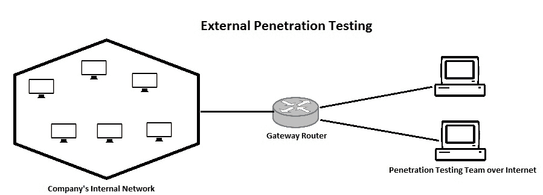

# 十一、安全评估先决条件

在我们开始实际使用安全评估之前，需要做大量的基础工作，包括规划、范围界定、选择正确的测试、资源分配、测试计划以及签署和批准文档。所有这些先决条件将有助于确保安全评估的顺利进行。本章讨论的主题如下：

*   目标范围界定和规划
*   收集要求
*   决定漏洞评估的类型
*   估计资源和可交付成果
*   准备测试计划和测试边界
*   获得批准并签署 NDA

# 目标范围界定和规划

定义和决定正式范围是漏洞评估的最重要因素之一。虽然可能有很多关于使用各种漏洞评估工具和技术的信息和指南，但漏洞评估的准备阶段往往被忽视。忽略正确完成的参与前活动可能会导致潜在问题，例如：

*   范围蠕变
*   顾客不满
*   法律纠纷

项目的范围旨在精确定义要测试的内容。

从理论上讲，最好测试网络中的每一项资产；然而，这实际上可能不太可能。与所有业务部门进行详细讨论可以帮助您收集关键资产的列表。然后，这些资产可以纳入漏洞评估的范围。漏洞评估范围内的一些公共资产如下：

*   通信线路
*   电子商务平台
*   任何面向互联网的网站
*   专用设备（调制解调器、收音机等）
*   应用和应用 API
*   电子邮件网关
*   远程访问平台
*   邮件服务器
*   域名服务器
*   防火墙
*   FTP 服务器
*   数据库服务器
*   网络服务器

虽然上述资产列表对于要包括在漏洞评估范围内的候选资产来说非常明显，但可能还有一些其他资产经常被忽略，但可能为攻击者打开一个入口点。这些资产包括：

*   印刷工
*   无线接入点
*   共享驱动器
*   IP 摄像机
*   智能电视
*   生物特征访问控制系统

范围的详细概述将有助于漏洞评估团队规划资源和时间表。

# 收集要求

在我们考虑开始漏洞评估之前，非常清楚地了解客户需求是非常重要的。客户可能是组织的内部或外部。对于 VA 测试人员，了解客户对测试的期望是很重要的。为了识别和记录客户需求，需要做以下工作。

# 准备测试要求的详细检查表

测试人员需要与客户召开多次会议，以了解他们的需求。结果应包括但不限于以下内容：

*   客户希望遵守的安全法规遵从性
*   各安全合规部规定的要求和行为准则（如有）
*   范围内的网段列表
*   作用域网段中的网络安全设备列表
*   要扫描的资产列表（以及 IP 范围）
*   暴露于公共网络的资产列表（以及 IP 范围）
*   具有网络范围访问权限的资产列表（以及 IP 范围）

*   业务关键资产列表（以及 IP 范围）
*   客户环境中可接受的漏洞评估工具列表
*   客户或从犯建议的工具许可证的可用性
*   客户环境中严格禁止使用的工具列表
*   最近的漏洞评估报告（如有）

# 适当的时间框架和测试时间

某些安全合规性要求定期对范围内的基础设施进行漏洞评估。例如，PCI/DSS 要求每半年对业务关键资产进行一次漏洞评估，每年对 PCI/DSS 认证范围内的非关键资产进行一次漏洞评估。

测试人员和客户在准备评估时间表时，需要牢记这些法规遵从性驱动的要求。同时，考虑作为评估范围的一部分的环境中正在进行的和关键的变化总是有益的。如果安全合规部强制执行的时间框架允许，最好在完成关键更改后执行评估，这将有助于提供当前安全态势的长期视图。

在漏洞评估中，计划和安排的另一个有趣部分是测试时间。通常，自动扫描配置文件用于执行漏洞评估并消耗大量网络流量（每个主机/资产的每个端口的请求/响应），还可能消耗正在扫描的资产/主机上的大量资源。在极少数情况下，可能会发生某个资产/主机停止响应，进入**拒绝服务**（**DoS**）模式和/或完全关闭模式。这也可能发生在业务关键型系统上。现在设想一个业务关键型系统/服务在高峰工作时间不响应任何请求。这也可能影响其他服务，覆盖更广的用户空间。这可能会导致数据、声誉和收入的损失。此外，在这样一个混乱的场景中，恢复和恢复业务功能也是一个挑战。因此，始终建议在工作时间之外执行漏洞评估。这样做的好处是：

*   没有额外的网络开销，因为没有正常的业务/合法流量
*   随着网络带宽的增加，自动扫描完成的时间相对缩短

*   当网络流量已经减少时，可以很快观察到漏洞评估的影响（如果有的话）
*   影响和副作用可以轻松处理（恢复/恢复），因为业务/收入和声誉损失的风险可以最小化到可接受的限度

但是这种方法也可能有一些例外，测试人员也需要在工作时间运行评估。可能需要其中一种场景来评估用户工作站的漏洞。由于用户工作站仅在营业高峰时间可用，因此只有该网段应在营业时间进行扫描。

总而言之，这一阶段的结果是：

*   进行漏洞评估的业务和合规需求
*   进行漏洞评估的时间框架（可能由某些安全合规部门强制执行）
*   营业时间和非营业时间
*   关键资产和非关键资产的测试时间
*   终端用户工作站列表及相应 IP 的测试时间

# 确定利益相关者

漏洞管理采用自上而下的方法。以下是可能参与漏洞评估和/或受其影响的利益相关者：

*   **执行/最高管理层**：为了在漏洞评估计划中取得预期的成功，最高管理层应通过分配所有所需资源来支持该活动。
*   **IT 安全负责人**：这可以是专门的职责，也可以是分配给胜任人员的额外职责。通常，该职位直接向执行/最高管理层报告，向最高管理层提供安全态势的鸟瞰图。为了维护安全合规性，该职位负责组织内运行的多个 IT 安全计划。
*   **VA lead tester**：该职位是指通常向 IT 安全负责人报告的主题专家。VA 负责人负责：
    *   签署**工作说明书**（**工作说明书**）
    *   维持保密协议
    *   检查在特定环境中进行此类测试的法律方面
    *   收集需求和定义范围
    *   规划漏洞评估
    *   管理漏洞评估所需的工具、设备和许可证
    *   管理作为漏洞评估一部分的团队和团队活动
    *   在参与漏洞评估计划的所有利益相关者之间保持**单一联络点**（**SPOC**）
    *   使所有利益相关者了解作为漏洞评估一部分的活动的最新情况
    *   生成并签署漏洞评估的执行摘要
*   **VA 测试员**：VA 测试员执行 VA 项目所需的以下活动：
    *   配置和更新自动扫描仪工具/设备
    *   监控自动扫描是否存在任何中断或未经请求的影响
    *   进行手动测试
    *   进行**概念验证**（**PoCs**）
    *   生成详细报告
    *   及时更新 VA lead tester
*   **资产所有者**：作为漏洞评估一部分的每个服务/系统/应用/网络/设备都参与了该计划。业主负责应对可能发生的任何中断。业主应了解其所拥有资产的详细评估计划，并应准备好恢复和恢复计划，以减少影响。
*   **第三方服务提供商**：货架（**COTS**应用的**商业所有权属于各自的服务提供商。如果范围要求对此类 COTS 资产进行评估，则需要各第三方的参与。最近，组织选择了越来越多的云服务。因此，各云服务提供商的 SPOC 需要参与该计划，以确保 VA 的顺利执行。**
*   **最终用户**：最终用户很少也会受到 VA 计划修复的影响。

# 决定漏洞评估的类型

在理解了客户的需求之后，测试人员需要根据漏洞管理计划的期望、环境、过去的经验以及每种类型提供的暴露创建自己的测试模型

以下是测试人员需要了解的漏洞评估的基本类型。

# 漏洞评估的类型

下图概述了不同类型的漏洞评估：

# 基于位置的漏洞评估类型

根据测试地点，漏洞评估可分为两种主要类型：

*   外部漏洞评估
*   内部漏洞评估

# 外部漏洞评估

外部漏洞评估最适合于通过承载公共服务的公共网络暴露的资产。它是从目标网络外部完成的，因此有助于模拟真实攻击者攻击目标的实际场景。进行外部漏洞评估的主要目的是发现目标系统安全方面的潜在弱点，如下图所示：

外部漏洞评估主要集中于与目标相关的服务器、基础设施和底层软件组件。这种类型的测试将涉及深入分析有关目标的公开可用信息、识别和分析所有活动目标主机的网络枚举阶段，以及防火墙等中间安全屏蔽设备的行为。然后识别、验证漏洞，并评估影响。这是最传统的漏洞评估方法。

# 内部漏洞评估

内部漏洞评估是在暴露于托管内部服务的专用网络（公司内部）的资产上进行的。进行内部漏洞评估主要是为了确保网络内部人员不能通过滥用自己的权限获得对任何系统的未经授权的访问，如下所示：

内部漏洞评估用于识别组织网络内特定系统的弱点。当漏洞评估团队在目标网络内执行测试时，所有外部网关、过滤器和防火墙都会被绕过，测试直接针对范围内的系统。内部漏洞评估可能涉及从各个网段进行测试，以检查虚拟隔离。

# 基于对环境/基础设施的了解

以下是基于攻击者对环境/基础设施的了解，从攻击者的角度模拟暴露的漏洞评估类型。

# 黑盒测试

在黑盒漏洞评估方法中，VA 测试人员在不了解目标系统的情况下执行所有测试。这种类型的测试最接近于模拟真实世界的攻击。在理想的黑盒测试场景中，VA 测试人员可能只知道目标组织的名称。他必须从头开始收集有关目标的信息，然后逐步构建和执行各种攻击场景。这种类型的测试通常需要更长的时间来完成，并且需要更多的资源。

# 白盒试验

白盒漏洞评估是在完全了解和理解测试目标的基础设施、防御机制和通信渠道的情况下进行的测试。此测试专门用于模拟通常以完全权限和完全访问目标系统的权限执行的内部攻击。为了启动白盒漏洞评估，目标组织与 VA 测试人员共享所有详细信息，如资产清单、网络拓扑图等。

# 灰盒试验

顾名思义，灰盒测试是黑盒和白盒测试的结合。在这种类型的测试中，VA 测试人员对要进行测试的目标的基础设施、防御机制和通信通道有部分了解。它试图模拟由具有有限访问权限的内部人员或外部人员执行的攻击。与黑盒测试相比，这相对较少的时间和资源密集型测试。

# 公布和未公布的测试

在已宣布的漏洞评估中，在目标 IT 员工的充分合作和事先了解的情况下，尝试破坏目标系统。VA 测试人员可能会与 IT 人员讨论对特定系统进行优先级排序，以便进行妥协。在未经宣布的漏洞评估中，漏洞评估小组未事先告知目标员工。这是一种突击测试，旨在检查目标组织的安全准备和响应能力。只有上级管理层才了解测试情况。

# 自动测试

一些组织和安全测试团队宁愿自动化安全测试，而不是利用个人专业知识。这通常借助于针对目标系统主机运行的工具来完成，以评估安全态势。该工具试图模拟入侵者可能使用的真实攻击。根据攻击成功与否，该工具将生成一份详细的调查结果报告。自动化测试可以简单快速地执行，但它可能会产生大量误报。自动化测试也不能评估体系结构级别的安全缺陷（设计缺陷）、业务逻辑缺陷和任何其他程序缺陷。

# 经过身份验证和未经身份验证的扫描

为了执行经过身份验证的扫描，可以使用由集中目录（域控制器/AD/LDAP）控制的凭据配置扫描工具。在执行扫描时，扫描程序尝试使用配置的凭据与资产建立**远程过程调用**（**RPC**），并在成功登录时，在与提供的凭据相同的权限级别上执行测试。

经过身份验证的扫描会向经过身份验证的系统用户报告暴露的弱点，因为所有托管服务都可以使用一组正确的凭据进行访问。未经验证的扫描从系统的公共角度（未经验证的用户认为系统就是这样）报告弱点。

与未经验证的扫描相比，经过验证的扫描具有以下优点：

*   从用户的角度模拟安全姿势的视图
*   提供全面扫描，覆盖更多暴露的攻击面
*   该报告提供了资产上暴露的可被恶意用户利用的详细漏洞
*   少误报
*   提高报告的准确性

与未经验证扫描相比，经验证扫描的缺点如下：

*   完成扫描需要更多的时间，因为它覆盖了更多的扫描签名
*   增加了管理用于扫描的凭据的开销
*   参与密集测试签名可能会中断资产托管的服务

# 无代理和基于代理的扫描

最新的自动扫描工具方便代理在各自的资产上安装扫描服务。此服务通常以尽可能高的权限运行。一旦主机上运行的服务接收到来自扫描仪的触发器，该服务将从在资产本身上运行本机扫描的扫描仪获取该特定资产的相应扫描配置文件。

与无代理扫描相比，基于代理的扫描具有以下优点：

*   由于扫描在系统上本机运行，因此网络上没有开销
*   无需等待非营业时间启动对非关键资产的测试
*   扫描间隔可以缩短，这有助于保持最新的安全态势
*   无需维护专门用于扫描的单独凭据
*   提供全面扫描，覆盖更多暴露的攻击面
*   该报告提供了资产上暴露的详细漏洞
*   少误报
*   提高报告的准确性

与无代理扫描相比，基于代理的扫描的缺点如下：

*   代理可能不支持特殊设备（调制解调器、收音机等）以及所有操作系统和固件
*   在每个兼容的资产上安装代理即使这在大型环境中是一次性活动，这也是一个挑战
*   管理和保护代理本身由于代理正在运行具有更高权限的服务，因此需要非常谨慎地管理和保护这些代理

# 手动测试

手动漏洞评估是最好的选择之一。它得益于训练有素的安全专业人员的专业知识。手动测试方法包括详细的范围界定、规划、信息收集、漏洞扫描、评估和利用。因此，它肯定比自动测试更耗时和资源消耗，但是，产生误报的可能性更小。

通常，组织和漏洞评估团队更喜欢使用自动测试和手动测试的组合，以便从两者中获得最佳效果。

# 估计资源和可交付成果

正如适用于任何项目一样，漏洞评估的成功取决于接近实际情况的估计。范围界定和规划阶段的输出有助于估计漏洞评估中最重要的因素以及完成评估所需的时间。

如果测试人员在一个限定范围的环境或类似环境中有很好的运行评估的经验，那么评估是基于以前的经验进行的。如果测试人员是环境新手，则参考以前的测试报告和通信进行评估。此外，测试人员会考虑范围的增加和更改，以及第三方服务/服务提供商（如果有）的参与，并相应地更新估计值。

一旦准备好粗略的估算，就会考虑时间填充，并在预期所需时间内添加时间。这一次填充通常设置为 20%。这有助于测试人员处理执行过程中可能遇到的任何未经请求的挑战。

以下是在执行漏洞评估期间可能面临的一些未经请求的挑战/问题：

*   **网络安全设备拦截扫描**：防火墙、**入侵防御系统**（**IPS**）和**统一威胁管理**（**UTM**等网络安全设备将扫描流量检测为恶意流量，并阻止漏洞扫描程序发送的所有请求。在相应的网络安全设备上生成警报后，测试仪需要要求网络管理员将自动扫描仪 IP 和手动测试机 IP 列入白名单。
*   ‎ **资产因某些测试**的副作用而没有响应：一些扫描签名使资产处于 DoS 模式。在这种情况下，测试人员需要识别此类资产并微调扫描配置文件，以便在这些系统上执行全面扫描。通常，此类扫描敏感系统是封闭源代码和现成的解决方案。
*   ‎ **扫描会影响业务关键型服务，因此需要突然停止扫描**：某些漏洞扫描签名可能会破坏系统上的某些服务。由于业务始终是优先事项，因此必须停止扫描并恢复业务关键型服务。测试人员需要在非营业时间分别对此类资产执行扫描，扫描强度和/或微调的扫描配置文件较少。

*   **屏蔽分配用于扫描的用户 ID**：由于集中式**身份访问管理系统**（**IDAM**流量过大，在执行身份验证扫描时，登录尝试可能被归类为恶意，扫描账户可能被屏蔽。
*   ‎ **由于扫描流量而减慢网络速度，因此在报告生成**中引入延迟：在执行自动扫描时，主动和密集的扫描配置文件会对网络流量造成开销。这可能会降低网络速度或使某些网络设备处于故障关闭状态，从而阻止扫描请求到达资产。

通常，这种填充物没有被完全利用。在这种情况下，为了公平对待客户，测试人员可以利用这段额外的时间为漏洞报告增加更多的价值。例如：

*   深入研究已识别的关键漏洞，以了解漏洞对整体基础设施安全的影响
*   在报告的严重漏洞上运行更多手动 POC，以最大限度地减少误报
*   为利益相关者详细演练漏洞报告
*   提供关于漏洞关闭的额外指导

时间估计是以测试所需的工时的形式进行的，但是测试人员也应该考虑，为一个项目部署更多的人员并不总是会减少时间。

例如，当自动漏洞评估套件/扫描器在网络段或资产组上启动测试时，执行测试所需的时间取决于所涉及的基础设施、要扫描的资产数量、资产性能、网络流量、测试配置文件的强度以及许多其他外部因素。由于自动扫描几乎不需要测试人员交互，因此在此阶段部署更多测试人员不会减少时间。然而，手动测试并非如此。手动测试用例可以由多个测试人员同时并行执行，大大缩短了时间。

另一个要考虑的因素是在资产上运行的测试的程度或强度。对于关键资产，需要使用更密集的扫描配置文件进行深入测试，而对于非关键资产，通常只需概述即可。运行自动和手动测试的密集扫描配置文件比正常扫描配置文件花费的时间要多得多。

时间估算的结果是确定的截止日期。漏洞评估应始终在预先计划的日期开始，并应在预计的结束日期完成。由于漏洞评估涵盖了庞大的基础设施，许多系统所有者和第三方都积极参与了这项工作。支持漏洞评估的额外责任通常是相关利益相关者的开销。因此，为了在 VA 演习期间保持他们的组织性、同步性、积极性和支持性，有限的截止日期非常重要。

# 准备测试计划

漏洞评估通常是一项定期重复的持续性工作。然而，在给定的时间段内，无论执行何种类型的测试，漏洞评估都有一个特定的起点和终点。因此，为了确保成功的漏洞评估，有必要制定详细的计划。该计划可包含以下几个要素：

*   **概述**：本节为测试计划提供了高层次的指导。
*   **目的**：本节说明了进行试验的总体目的和意图。可能有一些法规要求或客户的任何明确要求。
*   **适用法律法规**：本节列出了与计划测试相关的所有适用法律法规。这些法律可能包括当地法律和国际法律。
*   **适用标准和指南**：本节列出了与计划测试相关的所有适用标准和指南（如有）。例如，在 web 应用漏洞评估的情况下，可以遵循 OWASP 等标准。
*   **范围**：范围是计划的一个重要部分，因为它基本上列出了将要进行测试的系统。不适当的范围可能会严重影响未来的测试可交付成果。必须详细概述范围，包括目标系统、web 应用和数据库（如果有）的主机和 IP 地址，以及将用于测试的权限。
*   **假设**：本节主要概述测试的先决条件应及时提供给 VA 测试人员。这将确保不会因运营问题而出现任何延误。这还可能包括以下事实，即范围内的系统在测试期间不会经历重大升级或更改。
*   **方法学**：本节涉及测试将采用的方法学类型。它可以是黑框、灰框或白框，具体取决于组织的需求。

*   **测试计划**：本节详细说明了谁将执行测试、每日日程安排、详细任务和联系方式。
*   **约定规则**：本节列出了测试过程中需要遵守的专有条款和条件。例如，组织可能希望将某一组系统排除在自动扫描之外。这种明确的条件和要求可以在交战规则中提出。
*   **利益相关者沟通**：本节列出了整个测试过程中涉及的所有利益相关者。让所有利益相关者及时了解测试的进展是非常重要的。要纳入的利益相关者必须得到高级管理层的批准。
*   **责任**：本节强调测试期间可能发生的可能对业务运营产生不利影响的任何行为或事件的责任。责任是双方的，即组织和 VA 测试人员。
*   **授权批准和签字**：一旦仔细起草并商定了上述所有章节，则有必要由相关部门签署该计划。

综合测试计划也称为**工作说明书**（**工作说明书**。

# 获得批准并签署 NDA

根据具体要求，组织可以选择进行前面章节中讨论的任何类型的漏洞评估。然而，漏洞评估必须得到高级管理层的批准和授权。尽管大多数专业漏洞评估都是以可控的方式进行的，但仍有可能发生破坏性事件。在这种情况下，高级管理层预先批准的支持至关重要。

保密协议是 VA 测试人员在测试开始前必须签署的最重要文件之一。本协议确保测试结果以高度保密的方式处理，且结果仅向授权的利益相关者披露。一个组织的内部漏洞评估团队可能不需要为每项测试签署 NDA，但是，外部团队进行的任何测试都绝对需要签署 NDA。

# 保密和保密协议

任何在组织外部执行漏洞评估的个人都需要在测试启动之前签署保密和不泄露协议。漏洞评估的整个过程涉及包含关键信息的多个文档。这些文件如果泄露给任何第三方，都可能造成潜在的损害。因此，VA 测试人员和组织必须相互同意并正式签署保密和保密协议中的条款和条件。以下是签署保密和保密协议的一些好处：

*   确保组织的信息以高度保密的方式处理
*   为其他一些领域提供保险，如过失和发生事故时的责任

保密协议和保密协议都是强有力的工具。一旦协议正式签署，如果有意或无意地将信息披露给未经授权的各方，该组织甚至有权对测试人员提起诉讼。

# 总结

要真正开始基础设施的漏洞评估，有很多先决条件。在本章中，我们试图简要介绍所有这些先决条件。从下一章开始，我们将讨论实际的漏洞评估方法。