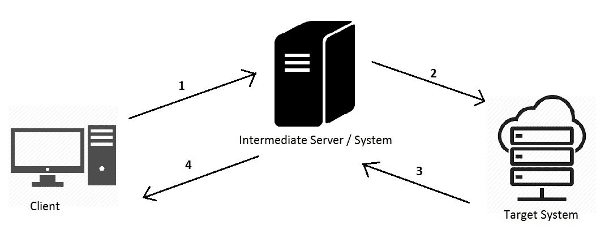
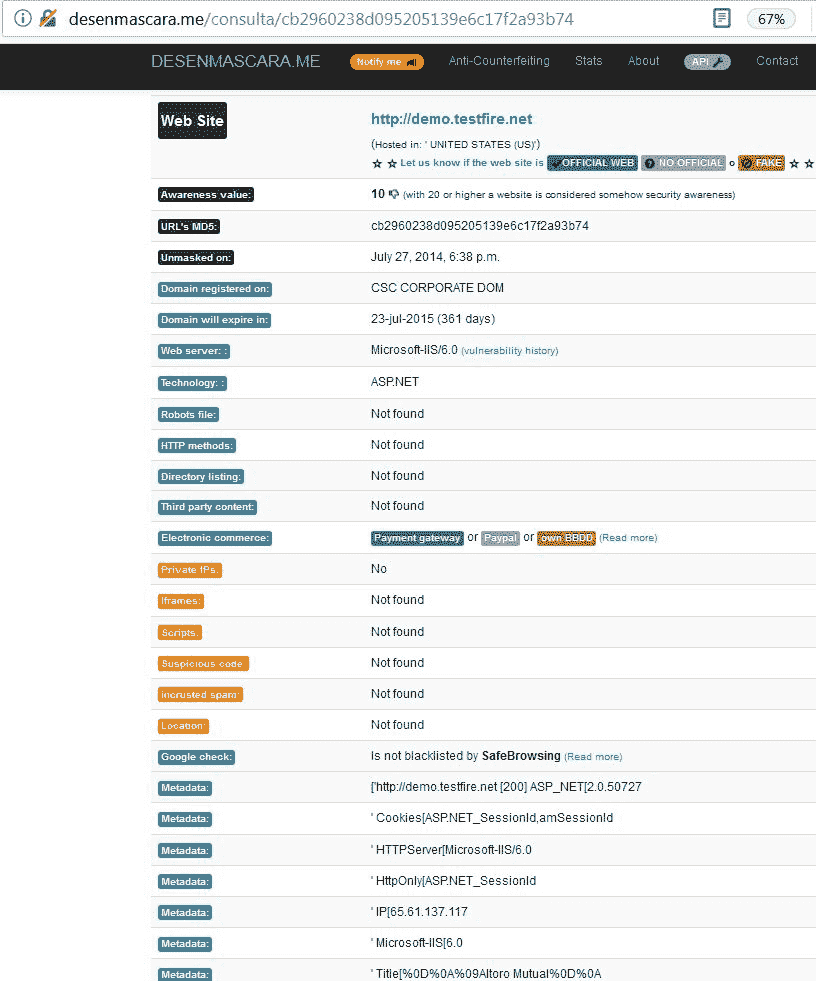
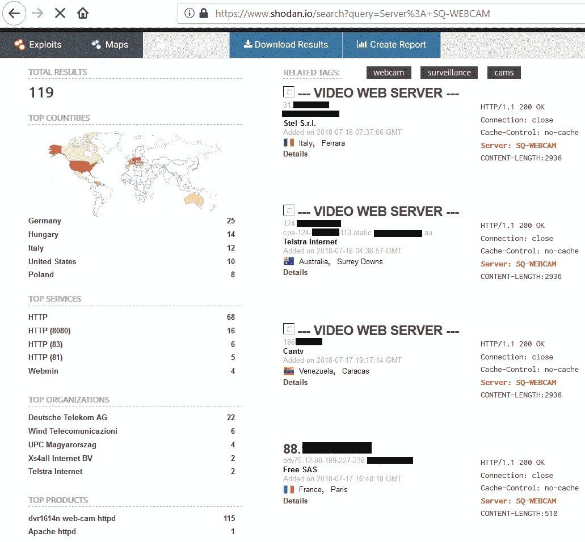
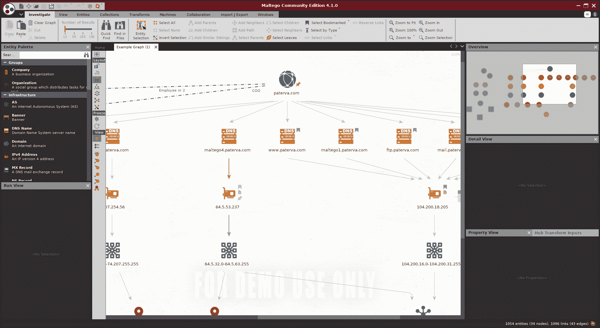
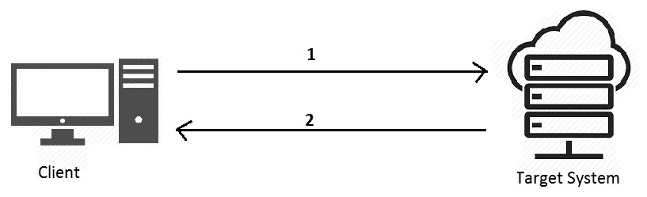
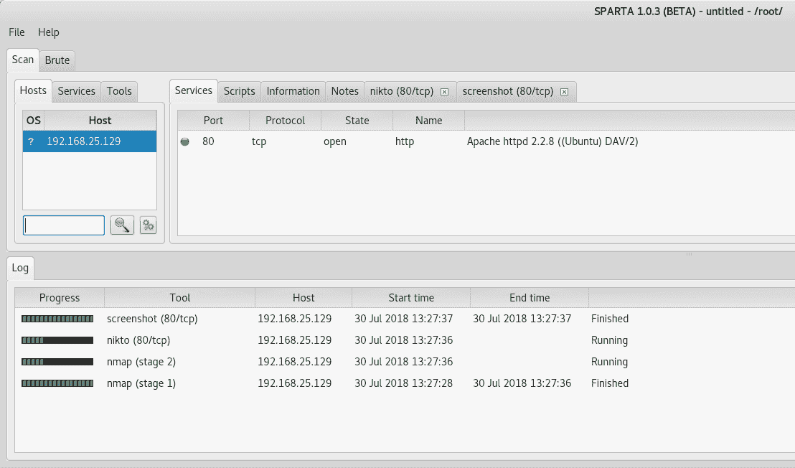

# 十二、信息收集

在最后一章中，我们讨论了漏洞管理计划的范围和规划。本章将学习收集目标系统信息的各种工具和技术。我们将学习应用各种技术，并使用多种工具来有效收集范围内目标的尽可能多的信息。从本阶段收集的信息将用作下一阶段的输入。

在本章中，我们将介绍以下主题：

*   定义信息收集
*   被动信息收集
*   积极收集信息

# 什么是信息收集？

信息收集是实际评估的第一步。在使用漏洞扫描器扫描目标之前，测试人员应该了解测试范围内资产的更多详细信息。这将帮助测试团队确定扫描资产的优先级。

# 信息收集的重要性

“给我六个小时砍树，前四个小时我要磨斧子。”

这是亚伯拉罕·林肯（Abraham Lincoln）的一句非常古老而著名的名言。这同样适用于在执行任何安全评估之前收集尽可能多的信息所花费的时间。除非并且直到你彻底了解你的目标，否则你永远不会成功地执行它的安全评估。拥有目标的 360 度视图并通过所有可用来源收集所有可能的信息是至关重要的。

一旦您确信收集了足够的信息，您就可以非常有效地规划实际评估。信息收集可分为两种类型，如下节所述：被动信息收集和主动信息收集。

# 被动信息收集

被动信息收集是一种不与目标直接接触以收集信息的技术。所有信息都是通过公开的中间来源获得的。互联网有许多有用的资源，可以帮助我们被动地收集信息。下面将讨论一些此类技术。

下图描述了被动信息收集的工作原理：



以下是它的工作原理：

1.  客户端系统首先向中间系统发送请求
2.  中间系统探测目标系统
3.  目标系统将结果发送回中间系统
4.  中间系统将其转发回客户端

因此，客户机和目标系统之间没有直接联系。因此，客户端对目标系统是部分匿名的。

# 反向 IP 查找

反向 IP 查找是一种用于探测其承载的所有域的任何给定 IP 地址的技术。因此，您只需输入目标 IP 地址，然后您将返回到该 IP 地址上承载的所有域。其中一个用于反向 IP 查找的工具可在线访问[http://www.yougetsignal.com/tools/web-sites-on-web-server/](http://www.yougetsignal.com/tools/web-sites-on-web-server/) 。

反向 IP 查找仅适用于面向 Internet 的网站，不适用于托管在 intranet 上的网站。

# 现场报告

一旦您拥有了目标域，您就可以获得许多关于该域的有用信息，例如其注册器、名称服务器、DNS 管理员、使用的技术等等。Netcraft，可在[上获得 http://toolbar.netcraft.com/site_report](http://toolbar.netcraft.com/site_report) 是一个非常方便的在线指纹域信息工具：


# 站点存档和返回方式

对于任何给定的站点来说，定期进行更改是非常常见的。通常，当站点更新时，最终用户无法看到其以前的版本。然而，网站[https://archive.org/](https://archive.org/) 带您访问给定站点的过去版本。这可能会显示一些您正在查找但在最新版本的网站中未显示的信息：


# 站点元数据

访问目标站点的元数据可以提供很多有用的信息。网站[http://desenmascara.me](http://desenmascara.me) 提供任何给定目标站点的元数据。元数据通常包括域信息、头标志等，如以下屏幕截图所示：



# 使用 Shodan 查找易受攻击的系统

Shodan 是一个搜索引擎，可以从漏洞利用的角度提供非常有趣的结果。Shodan 可以有效地用于查找所有互联网连接设备的弱点，如网络摄像头、IP 设备、路由器、智能设备、工业控制系统等。可通过[访问 Shodanhttps://www.shodan.io/.](https://www.shodan.io/)

下面的屏幕截图显示了 Shodan 的主屏幕。您需要创建帐户并登录才能启动搜索查询：


如以下屏幕截图所示，Shodan 提供了一个开箱即用的浏览选项，可提供属于最流行搜索查询的搜索结果：


以下屏幕截图显示了在线网络摄像头的搜索结果。搜索结果可根据其地理位置进一步分类：



# 使用 Maltego 进行高级信息收集

Maltego 是一个非常强大、功能强大且专业化的信息收集工具。默认情况下，它是 Kali Linux 的一部分。Maltego 有许多来源，通过这些来源，它可以收集任何给定目标的信息。从 Maltego 的角度来看，目标可以是姓名、电子邮件地址、域名、电话号码等。

您需要注册一个免费帐户才能访问 Maltego。

以下屏幕截图显示了 Maltego 主屏幕：


以下屏幕截图显示域[的示例搜索结果 https://www.paterva.com](https://www.paterva.com) 。搜索查询在 Maltego 中称为**转换**。一旦转换完成，它将显示所获得信息的图形。可以根据需要进一步变换图中的所有节点：



# 收割机

在渗透测试的进一步阶段，拥有属于目标系统/组织的电子邮件地址可以证明是有用的。Harvester 帮助我们收集属于目标系统/组织的各种电子邮件地址。它使用各种在线来源来收集这些信息。以下屏幕截图显示了收割机的各种参数：


```
root@kali:~# theharvester -d demo.testfire.net -l 20 -b google -h output.html
```

上述语法将在域[demo.testfire.net](http://demo.testfire.net)上执行`theharvester`，并使用 Google 作为搜索引擎查找多达 20 个电子邮件 ID，然后将输出存储在`output.html`文件中

# 积极收集信息

与被动信息收集不同，被动信息收集涉及收集信息的中间系统，主动信息收集涉及与目标的直接连接。客户端直接与目标探测信息，中间没有中间系统。虽然这种技术可能比被动信息收集揭示更多的信息，但目标系统上总有可能发出安全警报。由于与目标系统有直接连接，所有的信息请求都会被记录下来，以后可以追溯到源系统。下图描述了客户端直接探测目标系统时的活动信息收集：



# 与 SPARTA 的主动信息收集

SPARTA 是一个优秀的主动信息收集工具。它是默认 Kali 设置的一部分。下面的屏幕截图显示了斯巴达的主屏幕。在左侧窗格中，您只需添加要探测的 IP/主机：



在将 IP/主机提供给 SPARTA 之后，它会通过触发以 Nmap 开始的各种工具和脚本来快速启动操作。它进行快速端口扫描，并进一步进行服务标识。它还提供目标可能正在运行的各种 web 界面的屏幕截图，最有趣的是，它还自动尝试检索目标系统上运行的各种服务的密码。

以下屏幕截图显示了其中一次 SPARTA 扫描的示例结果：


# 侦察

侦察是一种非常强大和灵活的工具，能够进行被动和主动信息收集。它有许多模块可以插入并触发，以根据需要收集信息。它的功能与 Metasploit 非常相似。

以下屏幕截图显示了作为 Recon ng 一部分提供的各种模块：


我们可以选择我们选择的任何模块，然后执行它，如以下屏幕截图所示：


侦察是一种提供大量目标系统信息的工具。您可以探索 Recon ng 的各个模块，以更好地了解其方面和可用性。

# 德米特里

Dmitry 是 Kali Linux 中的另一个多功能工具，能够进行被动和主动信息收集。它可以执行 whois 查找和反向查找。它还可以搜索子域、电子邮件地址，并执行端口扫描。它非常易于使用，如以下屏幕截图所示：


```
root@kali:~# dmitry -wn -o output.txt demo.testfire.ne
```

前面的命令执行 whois 查找并从 Netcraft 检索站点信息，然后将输出写入文件`output.txt`。

# 总结

在本章中，我们了解了信息收集的重要性以及各种类型的信息收集，如被动和主动。我们还研究了各种工具的使用情况，以协助我们进行信息收集。