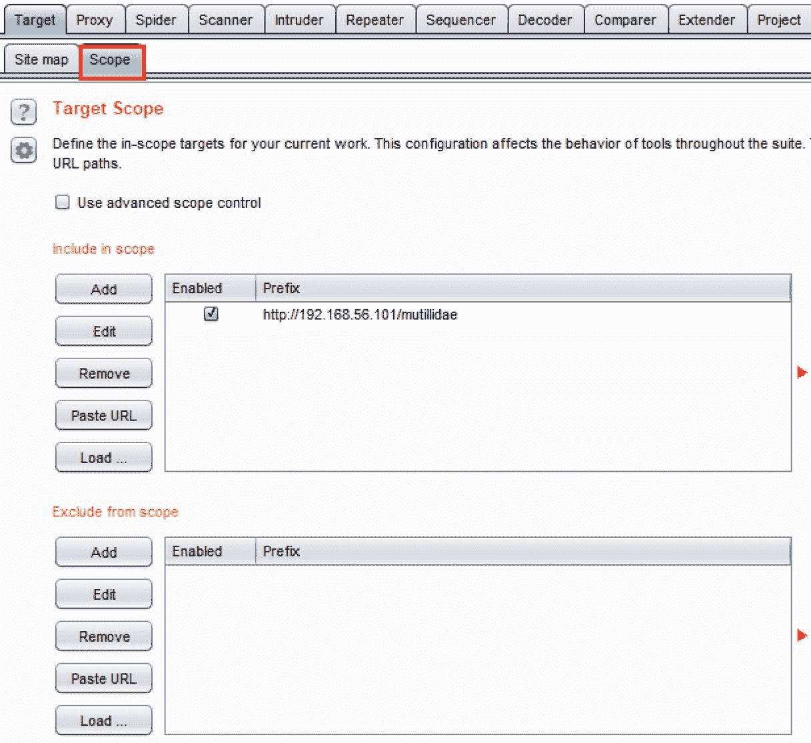
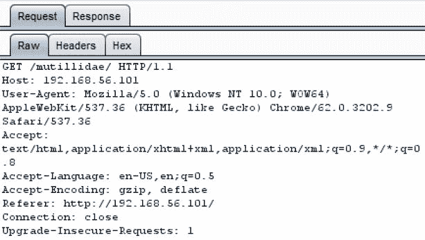
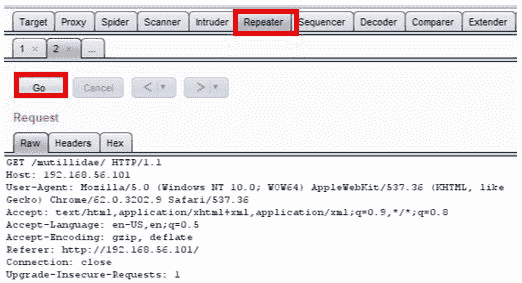
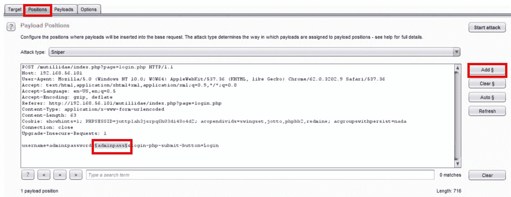
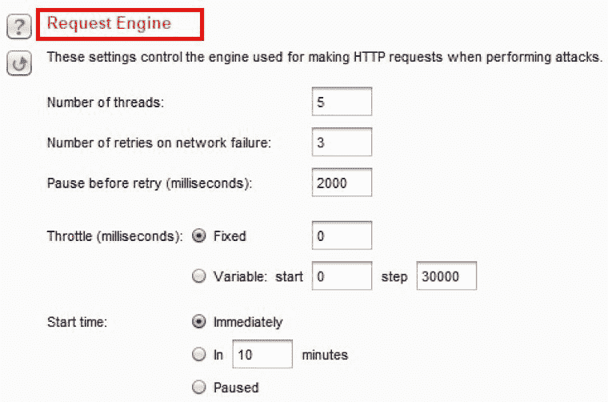
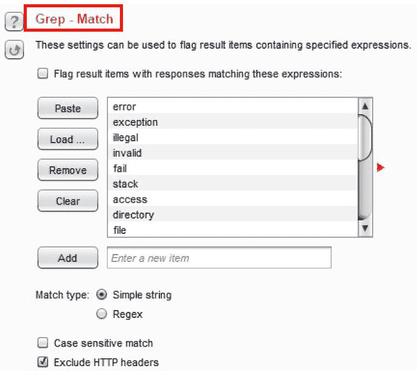
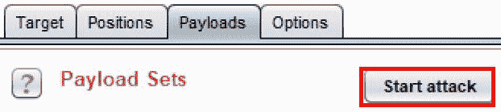
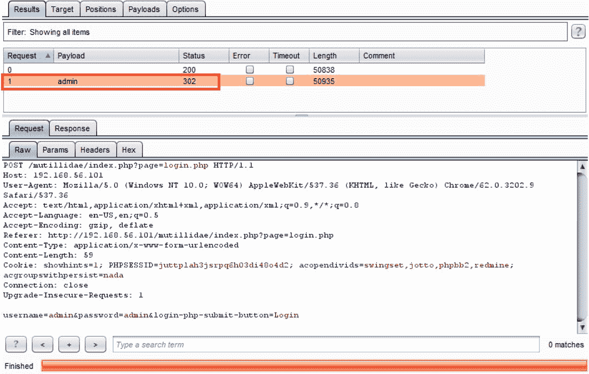

# 二、了解 BurpSuite 工具

在本章中，我们将介绍以下配方：

*   设置目标站点地图
*   理解消息编辑器
*   用中继器重复
*   用解码器解码
*   入侵者闯入

# 介绍

本章概述了 Burp 套件中最常用的工具。本章首先在目标站点地图中确定目标范围。接下来介绍消息编辑器。然后，将有一些使用**OWASP Mutillidae II**的实践方法，以熟悉代理、中继器、解码器和入侵者。

# 软件工具要求

要完成本章中的食谱，您需要以下内容：

*   Burp代理社区或专业人员（[https://portswigger.net/burp/](https://portswigger.net/burp/) ）
*   配置为允许 Burp 代理流量的 Firefox 浏览器（[https://www.mozilla.org/en-US/firefox/new/](https://www.mozilla.org/en-US/firefox/new/) ）

# 设置目标站点地图

现在，您的浏览器、Burp 和 OWASP BWA 虚拟机之间有了流量，我们可以开始设置测试范围了。对于此配方，我们将使用 OWASP BWA VM 中可用的 OWASP Mutillidae II 链接（`http://<Your_VM_Assigned_IP_Address>/mutillidae/`）作为我们的目标应用程序。

仔细查看 Target 选项卡，您会发现有两个子选项卡可用：sitemap 和 Scope。从浏览器、Burp 和 web 服务器之间的初始代理设置中，您现在应该在目标站点地图选项卡中显示一些 URL、文件夹和文件。您可能会发现信息量巨大，但为我们的项目设定范围将有助于更好地集中我们的注意力。

# 准备

使用 Target | Site map 和 Target | Scope 选项卡，我们将 mutillidae 的 URL（`http://<Your_VM_Assigned_IP_Address>/mutillidae/`指定为**范围。**

# 怎么做。。。

执行以下步骤以设置目标站点地图：

1.  搜索文件夹`mutillidae`并右击**添加到范围。请注意目标|范围子选项卡的简要突出显示，如下所示：**

 **

2.  将文件夹`mutillidae`添加到您的作用域后，您可能会看到一个代理历史记录对话框，如下所示。您可以通过单击“是”来避免收集超出范围的邮件。或者您可以选择继续让**代理 HTTP 历史记录**表收集通过 Burp 的任何消息，即使这些消息不在您确定的范围内。出于我们的目的，我们将选择**是**：

3.  翻开 Target | Scope 选项卡，您现在应该可以看到 OWASP Mutillidae II 的完整 URL，如 Include in Scope 表所示，如下所示：

# 它是如何工作的。。。

消息编辑器显示流经代理侦听器的任何 HTTP 消息的详细信息。设置代理以捕获 HTTP 流量后，如您的目标|站点地图和 Burp Proxy | HTTP 历史选项卡中所示，您可以选择任何单个消息以显示消息编辑器。每个编辑器都包含消息的请求和响应端，只要消息通过 Burp 正确代理。

# 理解消息编辑器

在 Burp 套件中显示 HTTP 消息的几乎每个工具和选项卡上，您都会看到一个编辑器，用于识别请求和响应。这通常称为消息编辑器。消息编辑器允许查看和编辑具有特殊功能的 HTTP 请求和响应。

消息编辑器中有多个子选项卡。请求消息的子选项卡至少包括以下内容：

*   **未加工**
*   **标题**
*   **十六进制**

响应消息的子选项卡包括以下内容：

*   **未加工**
*   **标题**
*   **十六进制**
*   **HTML**（有时）
*   **渲染**（有时）

“原始”选项卡以原始 HTTP 形式提供消息。“标题”选项卡以表格格式显示 HTTP 标题参数。这些参数是可编辑的，可以在代理和转发器等工具的表中添加、删除或修改列。

对于包含参数或 cookie 的请求，将显示“参数”选项卡。参数是可编辑的，可以在代理和转发器等工具的表中添加、删除或修改列。

最后是 Hex 选项卡，它以十六进制格式显示消息；它本质上是一个十六进制编辑器。允许您在代理和转发器等工具中编辑单个字节，但这些值必须以两位十六进制形式给出，从 00 到 FF。

# 准备

让我们研究一下消息编辑器中为 Burp 中捕获的每个请求和响应提供的多个选项卡。

# 怎么做。。。

确保您的浏览器、Burp 和 OWASP BWA 虚拟机之间有流量。

1.  查看目标|站点地图选项卡，注意消息编辑器部分：

2.  查看请求时，请注意，可用的子选项卡至少包括原始、标题和十六进制。但是，对于包含参数或 cookie 的请求，Params 子选项卡也可用：

3.  消息的另一面是**响应**选项卡，包含**原始**、**头**、**十六进制**子选项卡，有时还包含**HTML**和**呈现**子选项卡。这些是为请求的 HTTP 响应提供的各种格式。如果内容是 HTML，则会出现该选项卡。类似地，**呈现**选项卡启用 HTML 显示，就像在浏览器中显示一样，但不执行任何 JavaScript：

# 用中继器重复

Repeater 允许对请求进行轻微更改或调整，并显示在左侧窗口中。一个**Go**按钮允许重新发出请求，响应显示在右侧窗口中。

与您的 HTTP 请求相关的详细信息包括标准消息编辑器详细信息，如**原始**、**参数**（对于带有参数或 cookie 的请求）、**头**和**十六进制**。

与 HTTP 响应相关的详细信息包括标准消息编辑器详细信息，包括**原始**、**头**、**十六进制**，有时还有**HTML**和**呈现**。

在每个面板的底部都有一个搜索文本框，允许测试仪快速查找消息中的值。

# 准备

Repeater 允许您手动修改并重新发出单个 HTTP 请求，分析您收到的响应。

# 怎么做。。。

1.  从**目标****站点地图**或**代理****HTTP 历史记录**选项卡（如下截图所示），右击消息并选择**发送至中继器**：

2.  切换到**中继器**选项卡。注意**HTTP 请求**已准备好供测试人员调整参数，然后通过**Go**按钮将请求发送给应用程序。

注意每个面板底部的搜索框：

在本书中，我们将大量使用 Repeater。本章只是对中继器的介绍，旨在了解其用途。

# 用解码器解码

**Burp解码器**是一种允许测试人员将原始数据转换为编码数据或将编码数据转换回纯文本的工具。解码器支持多种格式，包括 URL 编码、HTML 编码、Base64 编码、二进制代码、哈希数据等。解码器还包括一个内置的十六进制编辑器。

# 准备

随着 web 渗透测试的进行，测试人员可能会根据编码值进行测试。Burp 允许测试人员将编码值发送到解码器并尝试各种可用的解码功能，从而简化了解码过程。

# 怎么做。。。

让我们尝试解码在 OWASP Mutillidae II 应用程序中找到的会话令牌 PHPSESSID 的值。当用户最初浏览 URL（`http://<Your_VM_Assigned_IP_Address>/mutillidae/`时，将为该用户分配一个 PHPSESSID cookie。PHPSESSID 值似乎是加密的，然后用 base 64 编码进行包装。使用解码器，我们可以打开值。

1.  浏览至`http://<Your_VM_Assigned_IP_Address>/mutillidae/`应用程序。
2.  在**代理****HTTP 历史记录**选项卡中查找您刚刚通过浏览生成的 HTTP 请求（如下图所示）。突出显示 PHPSESSID 值，而不是参数名称，单击鼠标右键，选择**发送到解码器**：

3.  在**解码器**选项卡中，在如下**解码为…**下拉列表中，选择**Base 64**。注：结果在**十六进制**编辑器中查看并加密：

在这个例子中，我们不能再继续下去了。我们可以确认，该值确实是用 Base 64 包装的。但是，展开的值是加密的。本配方的目的是向您展示如何使用解码器操作编码值。

# 入侵者闯入

Burp 入侵者允许测试人员使用定制的有效负载对 HTTP 消息的特定部分进行暴力或模糊处理。

为了在入侵者中正确设置自定义攻击，测试人员需要使用**入侵者**的四个子选项卡中的可用设置：

********

 ****# 准备

测试人员可能希望模糊或暴力处理消息中的参数值。Burp 入侵者通过提供各种入侵者攻击类型、有效载荷和选项来简化此过程。

# 怎么做。。。

1.  浏览到 Mutillidae 的登录屏幕并尝试登录到应用程序。例如，输入用户名`admin`和密码`adminpass`。
2.  在**代理****HTTP 历史记录**页签中查找登录尝试。您的申请编号（即左侧的**标志）将与下面显示的编号不同。选择捕获您尝试登录的消息。**

 **3.  由于登录尝试消息在**HTTP 历史记录**表中突出显示，右键点击**请求**选项卡，选择**发送给入侵者**：

# 目标

入侵者**目标**选项卡定义了您的目标 web 应用程序。这些设置是通过 Burp 为您预先填充的：

# 位置

**位置**选项卡标识在**有效载荷**|**位置**部分中定义有效载荷标记的位置。出于我们的目的，单击右侧菜单中的**清除§**（即有效载荷标记）。用光标高亮显示密码字段，手动选择密码字段。现在单击右侧菜单上的**添加§**按钮。您应该将有效负载标记环绕在密码字段周围，如下所示：

# 有效载荷

**位置**页签后为**有效载荷**页签。**有效载荷**选项卡标识您希望插入到上一选项卡上标识的位置的字表值或数字。**有效载荷**选项卡中有几个部分，包括**有效载荷集**、**有效载荷选项**、**有效载荷处理**和**有效载荷编码**。

# 有效载荷组

**有效载荷集**允许设置有效载荷的数量和类型。出于我们的目的，我们将使用狙击手的默认设置，允许我们使用一个有效载荷，其**有效载荷类型**为**简单列表**：

# 有效载荷选项

在**有效载荷选项**部分，测试人员可以配置自定义有效载荷或从文件中加载预配置的有效载荷。

出于我们的目的，我们将为有效载荷增加一个值。在文本框中，键入`admin`，然后单击**添加**按钮以创建我们的自定义负载：

# 有效载荷处理

当入侵者将有效载荷替换到有效载荷标记位置时，配置要使用的特殊规则时，有效载荷处理非常有用。对于此配方，我们不需要任何特殊的有效负载处理规则：

# 有效载荷编码

有效负载编码在将请求发送到 web 服务器之前应用于有效负载值。许多 web 服务器可能会阻止攻击性的有效负载（例如，`<script>`标记），因此编码功能是绕过任何黑名单阻止的一种手段。

对于此配方，请选中默认框：

# 选择权

最后，**入侵者****选项**选项卡提供了攻击表定制，特别是与捕获的响应（如特定错误消息）相关。在**入侵者****选项**选项卡中有几个部分，包括**请求头**、**请求引擎**、**攻击结果**、**Grep 匹配**、**Grep 提取**、**Grep-有效载荷**和**重定向**：

# 请求头

**请求头**提供入侵者运行攻击时特定于头参数的配置。对于此配方，请选中默认框：

# 请求引擎

如果测试人员希望在运行入侵者时减少网络噪音，则应修改**请求引擎**。例如，测试人员可以使用可变的时间限制攻击请求，使它们对网络设备来说更随机。这也是降低入侵者将针对目标应用程序运行的线程数的位置。

对于本配方，保留默认设置为：

# 攻击结果

开始攻击后，入侵者创建一个攻击表。**攻击结果**部分提供了一些关于该表中捕获内容的设置。

出于本配方的目的，保留默认设置：

# Grep-Match

**Grep-Match**是一项非常有用的功能，启用后，会在攻击表结果中创建额外的列，以快速识别响应中的错误、异常甚至自定义字符串。

出于本配方的目的，保留默认设置：

********

 ****# Grep-Extract

**Grep-Extract**在启用时，是在攻击表中添加列的另一个选项，该列的标签特定于响应中找到的字符串。此选项与**Grep-Match**不同，因为 Grep-Extract 值取自实际的 HTTP 响应，而不是任意字符串。

出于本配方的目的，保留默认设置：

# Grep-有效载荷

**Grep-Payloads**为测试人员提供了在攻击表中添加列的能力，其中响应包含有效负载的反射。

出于本配方的目的，保留默认设置：

# 重定向

**重定向**指示入侵者永远、有条件地或始终遵循重定向。此功能非常有用，特别是在强制登录时，因为 302 重定向通常表示进入。

出于本配方的目的，保留默认设置：

# 开始攻击按钮

最后，我们准备启动入侵者。在**有效载荷**或**选项**选项卡上，单击**开始攻击**按钮开始：

攻击开始后，将显示攻击结果表。这允许测试仪使用有效负载标记位置内的有效负载来审查所有请求。它还允许我们查看显示**状态**、**错误**、**超时**、**长度**和**注释**的所有响应和列。

在本配方中，我们注意到，`password`参数中 admin 的有效负载产生了一个状态代码`302`，这是一个重定向。这意味着我们成功登录到 Mutillidae 应用程序：

通过查看攻击表中的**响应****呈现**，我们可以看到 web 应用程序如何响应我们的负载。如您所见，我们已以管理员身份成功登录：

************