# 三、使用 Burp 配置、爬取、扫描和报告

在本章中，我们将介绍以下配方：

*   通过 HTTPS 建立信任
*   设置项目选项
*   设置用户选项
*   蜘蛛爬行
*   用扫描仪扫描
*   报告问题

# 介绍

本章帮助测试人员校准Burp设置，以减少对目标应用程序的滥用。Spider 和 Scanner 选项中的调整有助于解决此问题。同样，渗透测试人员在试图达到目标时，会发现自己处于有趣的网络环境中。因此，对于通过 HTTPS 运行的测试站点，或者只能通过 SOCKS 代理或端口转发访问的站点，包含了一些技巧。这些设置在项目和用户选项中可用。最后，Burp 提供了生成问题报告的功能。

# 软件工具要求

为了完成本章中的食谱，您需要以下内容：

*   OWASP 断开的 Web 应用程序（VM）
*   多天线链路
*   Burp代理社区或专业人员（[https://portswigger.net/burp/](https://portswigger.net/burp/) ）
*   Firefox 浏览器配置为允许 Burp 代理流量（[https://www.mozilla.org/en-US/firefox/new/](https://www.mozilla.org/en-US/firefox/new/) ）
*   第章介绍了代理配置步骤

# 通过 HTTPS 建立信任

由于大多数网站都实现了**超文本传输协议安全**（**HTTPS**），因此了解如何使 Burp 能够与此类网站进行通信是有益的。HTTPS 是通过**超文本传输协议**（**HTTP**运行的加密隧道。

HTTPS 的目的是加密客户端浏览器和 web 应用程序之间的通信，以防止窃听。然而，作为测试人员，我们希望允许 Burp 窃听，因为这是使用拦截代理的要点。Burp 提供一个根、**证书颁发机构**（**CA**签名的证书。此证书可用于在 Burp 和目标 web 应用程序之间建立信任。

默认情况下，Burp 的代理可以在与通过 HTTPS 运行的目标建立加密握手时生成每个目标 CA 证书。它负责隧道的 Burp-to-web 应用程序部分。我们还需要解决浏览器Burp部分。

为了在客户端浏览器、Burp 和目标应用程序之间创建完整的 HTTPS 隧道连接，客户端需要信任 PortSwigger 证书作为浏览器中的受信任机构。

# 准备

在需要使用通过 HTTPS 运行的网站进行渗透测试的情况下，测试人员必须在其浏览器中将 PortSwigger CA 证书作为受信任的机构导入。

# 怎么做。。。

确保 Burp 已启动并正在运行，然后执行以下步骤：

1.  打开 Firefox 浏览器至[http://burp](http://burp) URL。您必须按所示准确键入 URL 才能访问此页面。您应该在浏览器中看到以下屏幕。注意右侧标有 CA 证书的链接。单击链接下载 PortSwigger CA 证书：

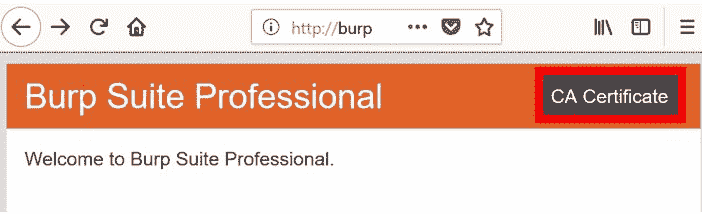

2.  您将看到一个对话框，提示您下载 PortSwigger CA 证书。文件标记为`cacert.der`。将文件下载到硬盘上的某个位置。
3.  在 Firefox 中，打开 Firefox 菜单。点击选项。

4.  单击左侧的隐私和安全，向下滚动至`Certificates`部分。单击查看证书…按钮：

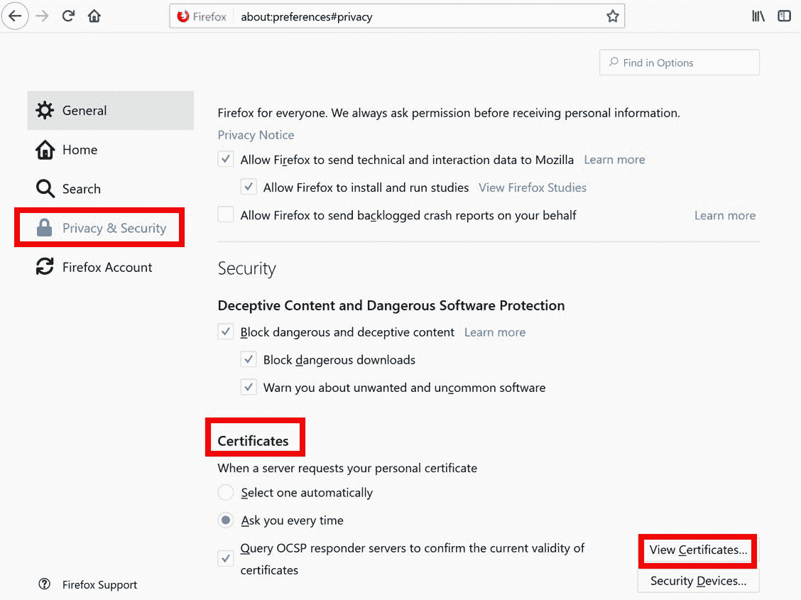

5.  选择“权限”选项卡。单击导入，选择先前保存的 Burp CA 证书文件，然后单击打开：

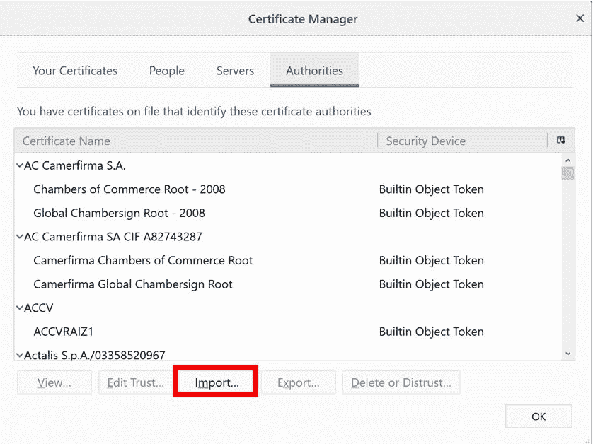

6.  在弹出的对话框中，选中“信任此 CA 以识别网站”框，然后单击“确定”。在“证书管理器”对话框中单击“确定”：

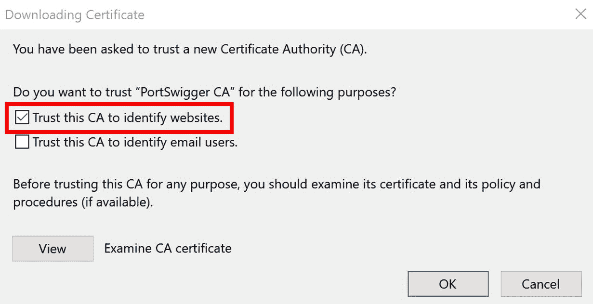

关闭所有对话框并重新启动 Firefox。如果安装成功，您现在应该能够访问浏览器中的任何 HTTPS URL，同时通过 Burp 代理流量，而不会出现任何安全警告。

# 设置项目选项

项目选项允许测试人员保存或设置特定于项目或范围目标的配置。“项目选项”选项卡下有多个子选项卡，其中包括连接、HTTP、SSL、会话和杂项。在评估特定目标时，渗透测试人员需要这些选项中的许多，这就是为什么在这里介绍这些选项。

# 怎么做。。。

在本书中，我们将不使用这些功能中的许多功能，但了解它们的存在并理解它们的用途仍然很重要：

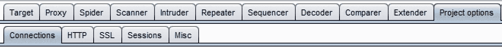

# “连接”选项卡

在“连接”选项卡下，测试仪具有以下选项：

*   **平台身份验证**：如果测试人员希望与针对目标应用程序使用的身份验证类型相关的项目选项取代用户选项中的任何身份验证设置，则提供一个覆盖按钮。

单击复选框覆盖用户选项后，测试仪将显示一个表，用于启用特定于目标应用程序的身份验证选项（例如，Basic、NTLMv2、NTLMv1 和 Digest）。如果测试人员发现需要使用此选项，则目标主机通常设置为通配符`*`：

*   **上游代理服务器**：如果测试人员希望针对目标应用程序使用的与上游代理服务器相关的项目选项取代用户选项中包含的任何代理设置，则提供覆盖按钮。

单击复选框覆盖用户选项后，测试人员将看到一个表，该表启用了特定于此项目的上游代理选项。单击添加按钮将显示一个名为`Add upstream proxy rule`的弹出框。此规则特定于目标应用程序的环境。如果目标应用程序的环境前面有一个 web 代理，该代理需要一组与应用程序登录不同的凭据，则此功能非常有用：

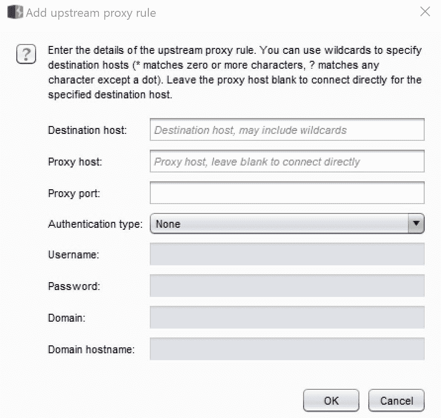

*   **SOCKS 代理**：如果测试人员希望针对目标应用程序使用与 SOCKS 代理配置相关的项目选项来取代用户选项中的任何 SOCKS 代理设置，则它会提供一个覆盖按钮。

单击复选框覆盖用户选项后，测试人员将看到一个表单，用于配置特定于此项目的 SOCKS 代理。在某些情况下，必须通过使用套接字连接和身份验证（通常称为 SOCKS）的附加协议访问 web 应用程序：

*   **超时**：允许不同网络场景的超时设置，如域名解析失败：

*   **主机名解析**：允许本地机器上类似主机文件的条目覆盖**域名系统**（**DNS**解析：

*   **范围外请求**：它提供了关于范围外请求的Burp规则。通常，最常用的是 Use suite scope[在目标选项卡中定义]的默认设置：

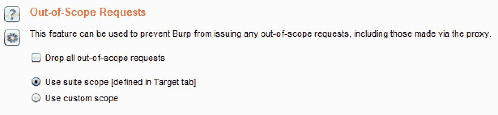

# HTTP 选项卡

在 HTTP 选项卡下，测试人员具有以下选项：

*   **重定向**：提供配置重定向时 Burp 遵循的规则。最常见的情况是，此处使用默认设置：

*   **流式响应**：提供与无限流式响应相关的配置。这里通常使用默认设置：

*   **状态 100 响应**s：提供 Burp 处理 HTTP 状态码 100 响应的设置。最常见的情况是，此处使用默认设置：

# SSL 选项卡

在 SSL 选项卡下，测试仪具有以下选项：

*   **SSL 协商**：当 Burp 通过 SSL 与目标应用程序通信时，此选项提供使用预配置 SSL 密码或指定不同密码的能力：

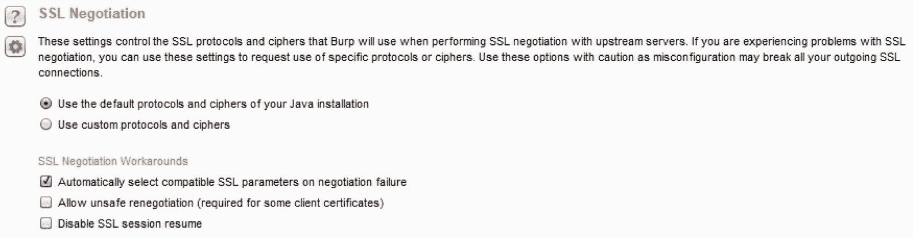

如果测试人员希望自定义密码，他们将单击使用自定义协议和密码单选按钮。出现一个表，允许选择 Burp 在与目标应用程序通信时可以使用的协议和密码：

*   **客户端 SSL 证书**：当测试人员必须对目标应用程序使用客户端证书时，它提供了一个覆盖按钮。此选项将取代用户选项中配置的任何客户端证书。

单击复选框覆盖用户选项后，测试仪将显示一个表，用于配置特定于此项目的客户端证书。您必须拥有客户端证书的私钥，才能将其成功导入 Burp：

*   **服务器 SSL 证书**：提供服务器端证书列表。测试人员可以双击这些行项目中的任何一项来查看每个证书的详细信息：

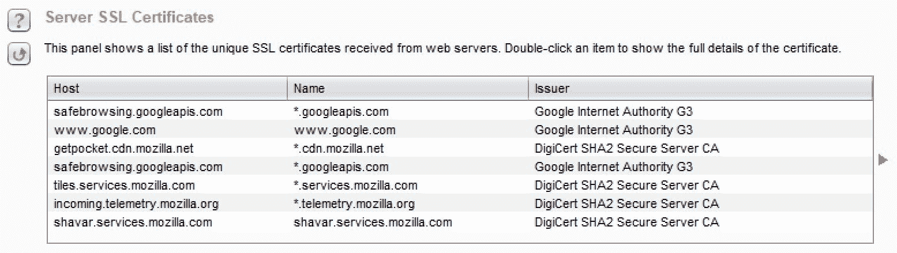

# 会话选项卡

本书将介绍[第 10 章](10.html#7CGBG0-081e72392608484dbc31f30a654ff7bf)、*使用Burp宏和扩展*中会话选项卡中包含的所有功能。为了完整起见，这里提供了会话选项卡中每个部分的回顾。

在会话选项卡下，测试仪具有以下选项：

*   **会话处理规则**：提供在评估 web 应用程序时配置自定义会话处理规则的能力：

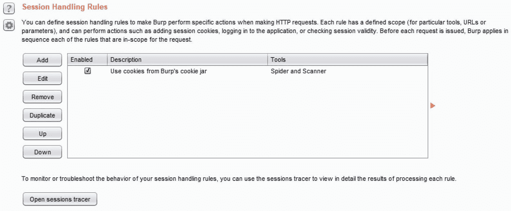

*   **Cookie Jar**：它提供了 Burp 代理捕获的 Cookie、域、路径和名称/值对的列表（默认情况下）：

*   **宏**：它提供测试人员编写以前执行的任务脚本的能力，以便在与目标应用程序交互时自动执行活动：

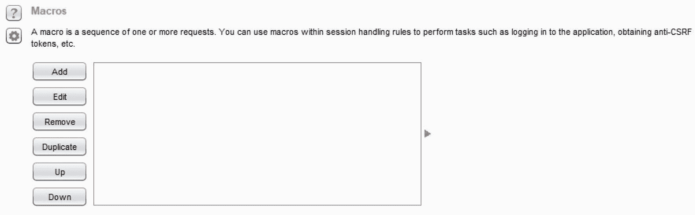

# 杂项选项卡

在“杂项”选项卡下，测试仪具有以下选项：

*   **计划任务**：提供在特定时间安排活动的能力：

单击“添加”按钮时，弹出窗口显示可用于计划的活动类型：

*   **Burp Collaborator Server**：它提供使用目标应用程序外部的服务来发现目标应用程序中的漏洞的能力。本书将涵盖[第 11 章](11.html#83CP00-081e72392608484dbc31f30a654ff7bf)、*实施高级主题攻击*中与Burp合作者相关的食谱。此处提供了本节的完整性审查：

*   **日志记录**：提供根据特定工具记录所有请求和响应或过滤日志记录的功能。如果选中，系统将提示用户输入文件名和位置，以便在本地计算机上保存日志文件：

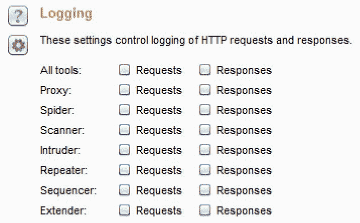

# 设置用户选项

用户选项允许测试人员保存或设置特定于启动时如何配置Burp的配置。用户选项选项卡下有多个子选项卡，包括连接、SSL、显示和杂项。对于本书中的食谱，我们将不使用任何用户选项。但是，此处对信息进行了完整性审查。

# 怎么做。。。

使用 Burp 用户选项，让我们以最适合渗透测试需求的方式配置 Burp UI。本章的“项目选项”部分已经介绍了“连接”选项卡下的每个项目，因此，我们将直接从 SSL 选项卡开始。

# SSL 选项卡

在 SSL 选项卡下，测试仪具有以下选项：

*   **Java SSL 选项**：提供配置 Burp 用于 SSL 连接的 Java 安全库的功能。默认值是最常用的：

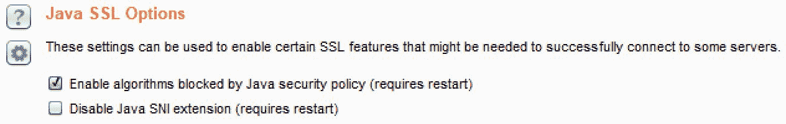

*   **客户端 SSL 证书：**本节已包含在本章*项目选项*节中。

# “显示”选项卡

在“显示”选项卡下，测试仪具有以下选项：

*   **用户界面**：提供修改Burp界面本身默认字体大小的功能：

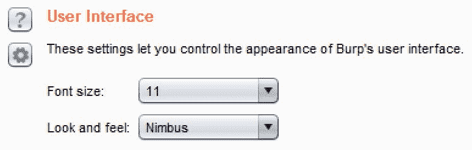

*   **HTTP 消息显示**：提供修改消息编辑器中显示的所有 HTTP 消息的默认字体和大小的功能：

*   **字符集**：提供更改 Burp 确定的字符集以使用特定集或显示为原始字节的能力：

*   **HTML 呈现：**通过 HTTP 响应中可用的呈现选项卡控制 HTML 页面的显示方式：

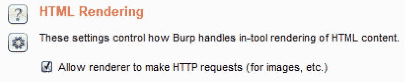

# 杂项选项卡

在“杂项”选项卡下，测试仪具有以下选项：

*   **热键**：允许用户配置常用执行命令的热键：

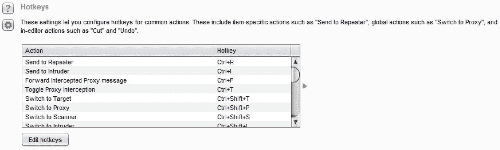

*   **自动项目备份【仅限磁盘项目】**：它提供了确定项目文件备份频率的功能。默认情况下，使用 Burp Professional 时，备份设置为每 30 分钟进行一次：

*   **临时文件位置**：提供运行 Burp 时更改临时文件存储位置的功能：

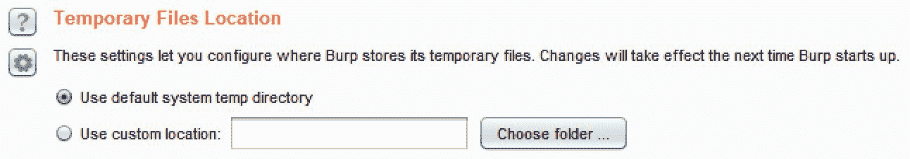

*   **代理拦截**：提供在初始启动 Burp 时始终启用或禁用代理拦截的能力：

*   **代理历史记录**：提供目标范围变化时自定义范围外项目提示的功能：

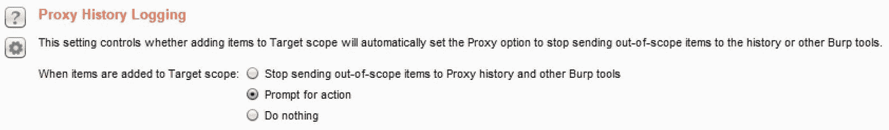

*   **性能反馈**：向 PortSwigger 提供关于Burp性能的匿名数据：

# 蜘蛛爬行

爬行是映射或爬行 web 应用程序的另一个术语。此映射练习对于发现目标应用程序中存在的链接、文件夹和文件是必需的。

除了爬行，Burp Spider 还可以自动提交表单。爬行应该在扫描之前发生，因为 Pentester 希望在查找漏洞之前识别所有可能的路径和功能。

Burp 提供了持续的爬行能力。这意味着当 pentester 发现新内容时，Spider 将自动在后台运行，寻找要添加到目标站点地图的表单、文件和文件夹。

Burp 套件的 Spider 模块中有两个选项卡可用。选项卡包括**控制**和**选项**，我们将在本配方的*准备*部分学习。

# 准备

使用 OWASP BWA VM 中的 OWASP Mutillidae II 应用程序，我们将配置并使用 Burp Spider 在应用程序中爬行。

# 控制选项卡

在“控制”选项卡下，测试仪具有以下选项：

*   **爬行器状态**：提供开启或关闭（暂停）爬行功能的能力。它还允许我们监视排队的 Spider 请求以及传输的字节，等等。此部分允许通过单击“清除队列”按钮清除排队的任何表单：

*   **爬行器范围**：提供基于目标站点地图选项卡或自定义范围设置爬行器范围的功能：

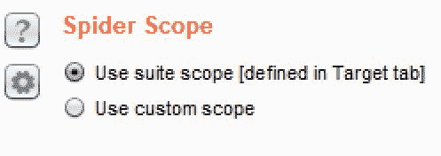

如果单击使用自定义范围单选按钮，将显示两个表，允许测试人员定义要从范围中包括和排除的 URL：

# 选项选项卡

在“选项”选项卡下，测试仪具有以下选项：

*   **爬虫设置**：提供调整深度爬虫将跟随的链接数量的能力；还标识了蜘蛛在网站上的基本 web 内容，如`robots.txt`文件：

*   **被动爬行**：爬行器在后台新发现的内容，默认打开：

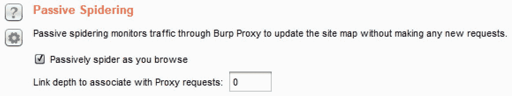

*   **表单提交**：它提供了确定 Spider 如何与表单交互的能力。有几个选项可用，包括忽略、提示指导、使用提供的表中的默认值提交，或使用任意值（例如，`555-555-0199@example.com`）：

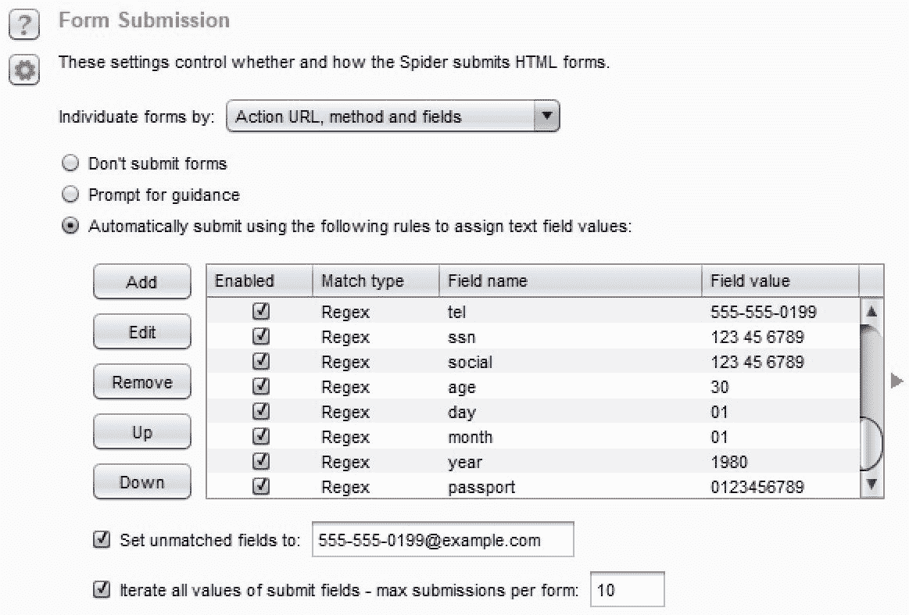

*   **应用程序登录**：它提供了确定 Spider 如何与登录表单交互的能力。有几个选项可用，包括忽略、提示提供指导、作为标准表单提交或使用文本框中提供的凭据：

*   **蜘蛛引擎**：提供编辑由于网络故障而使用的线程数以及重试尝试设置的功能。明智地使用线程数，因为过多的线程请求可能会阻塞应用程序并影响其性能：

*   **请求头**：提供修改源自 Burp Spider 的 HTTP 请求外观的功能。例如，测试人员可以修改用户代理，使 Spider 看起来像手机：

# 怎么做。。。

1.  确保 Burp 和 OWASP BWA VM 正在运行，并且在用于查看 OWASP BWA 应用程序的 Firefox 浏览器中配置了 Burp。

2.  在 OWASP BWA 登录页中，单击指向 OWASP Mutillidae II 应用程序的链接：

3.  转到 Burp Spider 选项卡，然后转到选项子选项卡，向下滚动到应用程序登录部分。选择自动提交这些凭据单选按钮。在用户名文本框中键入单词`admin`；在密码文本框中键入单词`admin`：

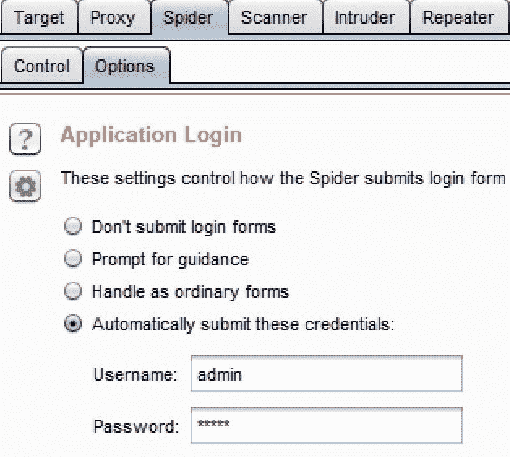

4.  返回目标站点地图，右键点击`mutillidae`文件夹并选择添加到范围，确保`mutillidae`文件夹已添加到范围：

5.  或者，您可以通过单击`Filter: Hiding out of scope and not found items; hiding CSS, image and general binary content; hiding 4xx responses; hiding empty folders`清理站点地图，以仅显示范围内的项目：

6.  点击`Filter: ….`后，会出现一个下拉菜单。在此下拉菜单中，选中“仅在范围项目中显示”框。现在，单击下拉菜单外 Burp 中的任意位置，使过滤器再次消失：

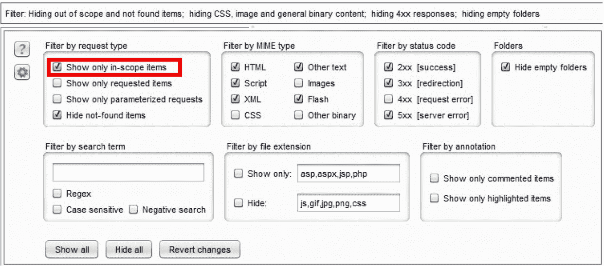

7.  您现在应该有一个干净的站点地图。右键单击 mutillidae 文件夹并选择此分支。

如果提示允许范围外项目，请单击“是”。

8.  您应该立即看到星形选项卡变成橙色：

9.  转到 Spider | Control 选项卡查看队列中的请求数、传输的字节数和表单数：

让蜘蛛跑完。

10.  请注意，Spider 使用您在“选项”选项卡中提供的凭据登录到应用程序。在目标站点地图上，查找`/mutillidae/index.php/`文件夹结构：

11.  搜索包含`password=admin&login-php-submit-button=Login&username=admin`的信封图标：

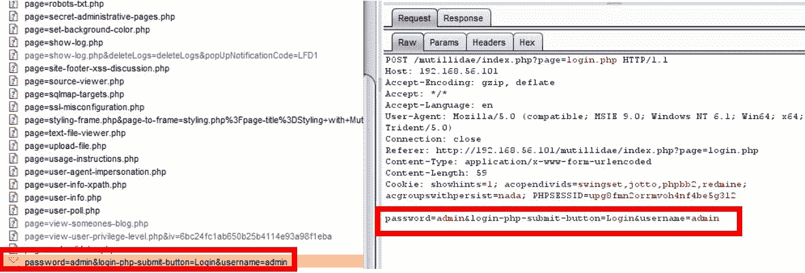

这证明信息爬行器使用了您在爬行器|选项|应用程序登录部分中提供的信息。

# 用扫描仪扫描

扫描仪功能仅在 Burp Professional edition 中提供。

**Burp Scanner 是一种自动搜索应用程序运行时版本中弱点的工具。扫描程序尝试根据应用程序的行为查找安全漏洞。**

 **扫描仪将识别可能导致识别安全漏洞的指标。Burp扫描仪非常可靠，但是，在报告之前，pentester 负责验证任何发现。

Burp扫描仪有两种扫描模式：

*   **被动扫描器**：分析通过代理侦听器的流量。这就是为什么正确配置目标范围非常重要，这样您就不会扫描过多的内容。
*   **活动扫描程序**：发送大量从原始形式调整的请求。这些请求修改旨在触发可能表明存在漏洞的行为（[https://portswigger.net/kb/issues](https://portswigger.net/kb/issues) ）。Active scanner 主要关注应用程序客户端和服务器端可能存在的基于输入的错误。

扫描任务应在爬取完成后执行。在此之前，我们了解了蜘蛛如何在发现新内容时继续爬行。类似地，被动扫描会在应用程序爬取时继续识别漏洞。

在“选项”选项卡下，测试人员具有以下选项：问题活动、扫描队列、实时扫描、问题定义和选项：

*   **发布活动**：以表格形式显示所有扫描结果；包括被动和主动扫描仪问题：

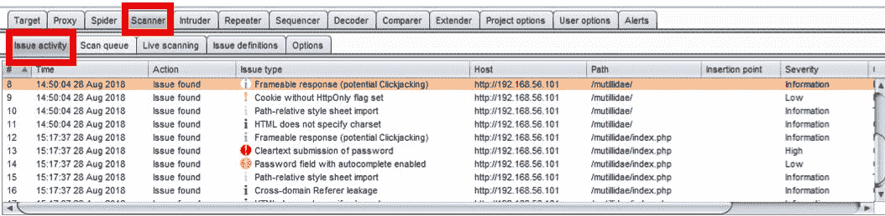

通过在表中选择问题，将显示消息详细信息，包括特定于查找的建议以及与请求和响应相关的消息编辑器详细信息：

*   **扫描队列：**显示活动扫描仪运行状态；提供每运行线程数的完成百分比，以及发送的请求数、测试的插入点、开始时间、结束时间、目标主机和受攻击的 URL。

通过右键单击并选择“暂停扫描仪”，可以从表中暂停扫描仪；同样，可以通过右键单击并选择 Resume scanner 来恢复扫描仪。扫描队列中等待的项目也可以取消：

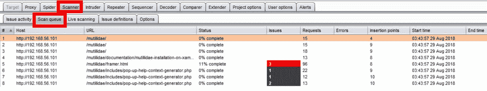

*   **实时主动扫描**：当主动扫描器执行扫描活动时，允许定制：

*   **实时被动扫描**：当被动扫描仪执行扫描活动时，允许定制。默认情况下，被动扫描仪始终打开并扫描所有内容：

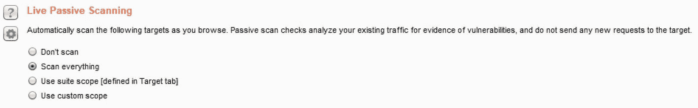

*   **发布定义**：显示Burp扫描仪（主动和被动）已知的所有漏洞的定义。该列表可以通过扩展器扩展，但使用 Burp core，这是一个详尽的列表，其中包括标题、描述文本、补救措辞、引用和严重性级别：

*   **选项**：提供攻击插入点、主动扫描引擎、攻击扫描优化、静态代码分析等部分。
    *   **攻击插入点**：可定制Burp插入点；插入点是请求不同位置内有效负载的占位符。这类似于[第 2 章](02.html#19UOO0-081e72392608484dbc31f30a654ff7bf)、*了解Burp工具套件*中讨论的入侵者有效载荷标记概念：

这里的建议包括在执行评估时添加 URL 到正文、正文到 URL、cookie 到 URL、URL 到 cookie、正文到 cookie 以及 cookie 到正文的插入点。这允许 Burp 模糊任何给定请求中的几乎所有可用参数。

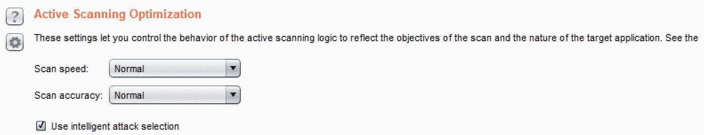

*   **扫描问题**：提供设置测试哪些漏洞以及针对哪个扫描器（即被动或主动）的功能。默认情况下，启用所有漏洞检查：

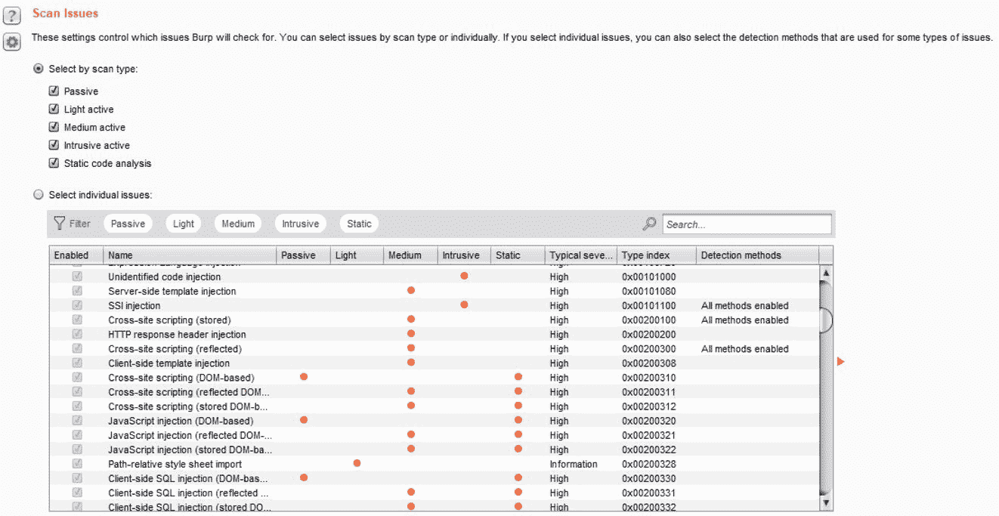

# 准备

使用 OWASP BWA VM 中的 OWASP Mutillidae II 应用程序，我们将开始扫描过程，并使用扫描队列选项卡监视我们的进度。

# 怎么做。。。

在用于查看 OWASP BWA 应用程序的 Firefox 浏览器中配置 Burp 时，确保 Burp 和 OWASP BWA VM 正在运行。

在 OWASP BWA 登录页中，单击指向 OWASP Mutillidae II 应用程序的链接：

1.  从目标站点地图选项卡中，右键单击`mutillidae`文件夹并选择被动扫描此分支。被动扫描程序将查找漏洞，这些漏洞将出现在问题窗口中：

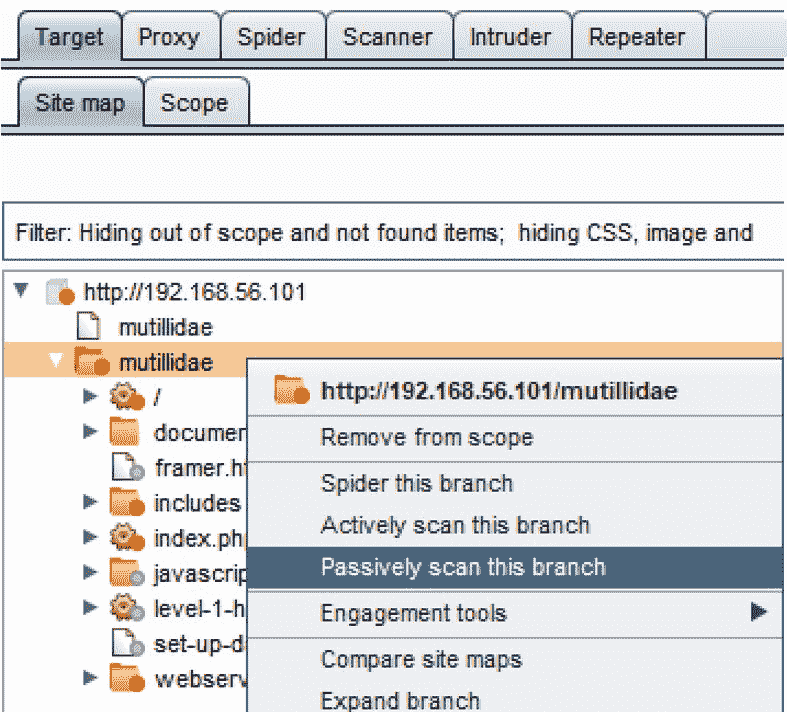

2.  从目标站点地图选项卡，右键单击`mutillidae`文件夹并选择主动扫描此分支：

3.  启动活动扫描仪后，会出现一个弹出对话框，提示删除重复项目、无参数项目、具有介质响应的项目或某些文件类型的项目。此弹出窗口是活动扫描向导。对于此配方，使用默认设置并单击下一步：

4.  验证显示的所有路径是否都需要扫描。使用“删除”按钮可以删除任何不需要的文件类型或路径。完成后，单击“确定”：

可能会提示您有关超出范围的项目。如果是，请单击“是”以包括这些项目。扫描仪将开始。

5.  通过查看“扫描仪队列”选项卡检查扫描仪的状态：

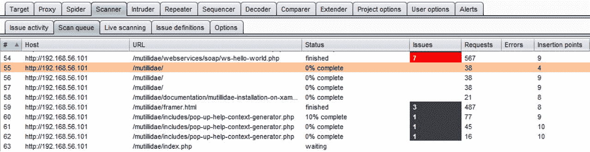

6.  当扫描仪发现问题时，它们将显示在“问题”面板的“目标”选项卡上。此面板仅在专业版中可用，因为它补充了扫描仪的功能：

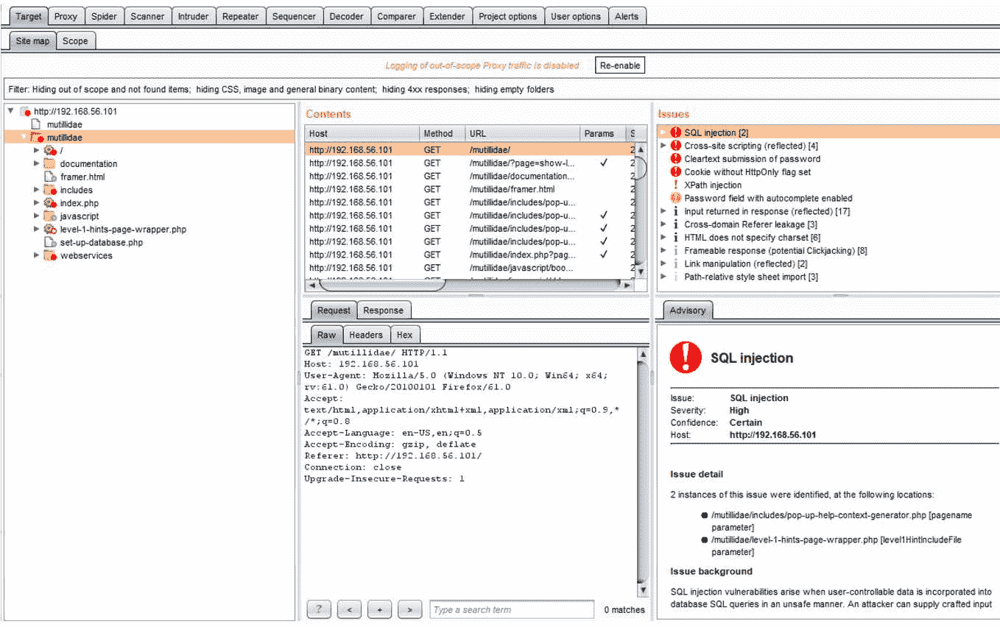

# 报告问题

报告功能仅在 Burp Professional edition 中提供。

在 Burp Professional 中，当扫描程序发现漏洞时，它将被添加到 UI 右侧目标选项卡上的问题列表中。问题以颜色编码，以指示严重性和置信水平。带有红色感叹号的问题表示其严重性很高，并且置信水平是确定的。例如，这里显示的 SQL 注入问题包含这两个属性。

严重性或置信度较低的项目将为低信息性项目，颜色为黄色、灰色或黑色。这些项目需要手动渗透测试，以验证漏洞是否存在。例如，响应中返回的输入是扫描器识别的潜在漏洞，如下屏幕截图所示。这可能是一个攻击向量，用于 To.T0.跨站点脚本[OTT1]（Po.T2A.XSS AUTT3TY），或者它可能是假阳性。验证此类问题取决于渗透测试人员及其经验水平：

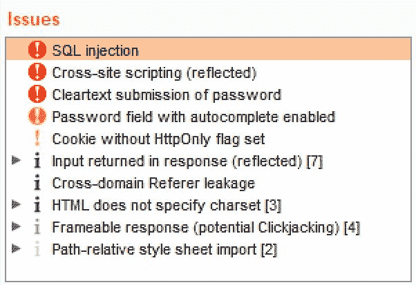

*   **严重级别**：可用的严重级别包括高、中、低、信息、假阳性。任何标记为假阳性的结果都不会出现在生成的报告中。误报是一种严重程度，必须由渗透测试仪在问题上手动设置。
*   **置信水平**：可用的置信水平包括确定、确定和暂定。

# 准备

扫描过程完成后，我们需要验证我们的发现，相应地调整严重程度，并生成报告。

# 怎么做。。。

1.  对于此配方，选择问题标题下未设置 HttpOnly 标志的 Cookie：

2.  查看该消息的 Response 选项卡以验证查找结果。我们可以清楚地看到`PHPSESSID`cookie 没有设置`HttpOnly`标志。因此，我们可以将严重性从低变高，将置信水平从坚定变为确定：

3.  右键单击问题，并通过选择设置严重性|高，将严重性更改为高：

4.  右键单击问题，并通过选择设置置信度|确定，将严重性更改为确定：

5.  对于此配方，选择要包含在报告中的具有最高置信度和严重性级别的问题。选中（高亮显示+*Shift*键）此处显示的项目后，右键点击并选择报告所选问题：

单击“报告选定问题”后，会出现一个弹出框，提示我们输入报告的格式。此弹出窗口是 Burp Scanner 报告向导。

6.  对于此配方，允许默认设置为 HTML。单击下一步。
7.  此屏幕提示输入要包含在报告中的详细信息类型。对于此配方，允许使用默认设置。单击下一步。

8.  此屏幕提示如何在报告中显示消息。对于此配方，允许使用默认设置。单击下一步。
9.  此屏幕提示报告中应包括哪些类型的问题。对于此配方，允许使用默认设置。单击下一步。
10.  此屏幕提示保存报告的位置。对于此配方，单击选择文件…，选择一个位置，并提供一个文件名，后跟`.html`扩展名；允许所有其他默认设置。单击下一步：

11.  此屏幕反映报告生成的完成情况。单击“关闭”并浏览到文件的保存位置。

12.  双击文件名以将报告加载到浏览器中：

祝贺您已经创建了第一份Burp报告！**