# 四、评估认证方案

在本章中，我们将介绍以下配方：

*   帐户枚举和可猜测帐户的测试
*   弱锁定机构的测试
*   绕过身份验证方案的测试
*   测试浏览器缓存的弱点
*   通过 RESTAPI 测试帐户设置过程

# 介绍

本章介绍身份验证方案的基本渗透测试。*认证*是验证人或物的主张是否真实的行为。Web 渗透测试人员必须进行关键评估，以确定目标应用程序的身份验证方案的强度。此类测试包括发起攻击、确定是否存在帐户枚举和可猜测帐户、是否存在弱锁定机制、是否可以绕过应用程序方案、应用程序是否包含浏览器缓存漏洞，以及是否可以通过 REST API 调用在无需验证的情况下设置帐户。您将学习如何使用 Burp 来执行此类测试。

# 软件工具要求

要完成本章中的食谱，您需要以下内容：

*   OWASP 断开的 Web 应用程序（VM）
*   多天线链路

*   GetBoo 链接
*   Burp 代理社区或专业人员（[https://portswigger.net/burp/](https://portswigger.net/burp/) ）
*   配置为允许 Burp 代理流量的 Firefox 浏览器（[https://www.mozilla.org/en-US/firefox/new/](https://www.mozilla.org/en-US/firefox/new/) ）

# 帐户枚举和可猜测帐户的测试

通过与身份验证机制交互，测试人员可能会发现收集一组有效用户名是可能的。一旦识别出有效的帐户，就有可能暴力破解密码。这个配方解释了如何使用 Burp 入侵者收集有效用户名列表。

# 准备

对目标应用程序执行用户名枚举。

# 怎么做。。。

确保 Burp 和 OWASP BWA VM 正在运行，并且在用于查看 OWASP BWA 应用程序的 Firefox 浏览器中配置了 Burp。

1.  从 OWASP BWA 登录页，单击指向 GetBoo 应用程序的链接：

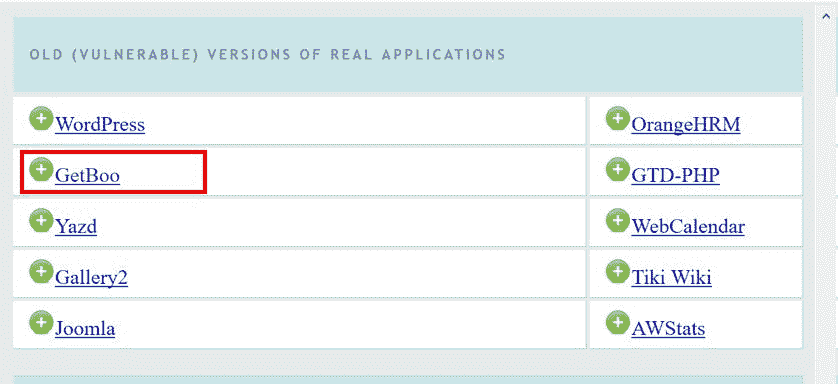

2.  点击**登录**按钮，在登录界面，尝试使用`admin`账号用户名和`aaaaa`密码登录：


3.  注意返回的消息为**密码无效**。从这些信息中，我们知道 admin 是一个有效的帐户。让我们使用 Burp**入侵者**来查找更多帐户。
4.  在 Burp 的**代理****HTTP 历史记录**选项卡中，找到失败的登录尝试消息。查看**响应****原始**选项卡，发现相同的过于详细的错误消息，**密码无效**：

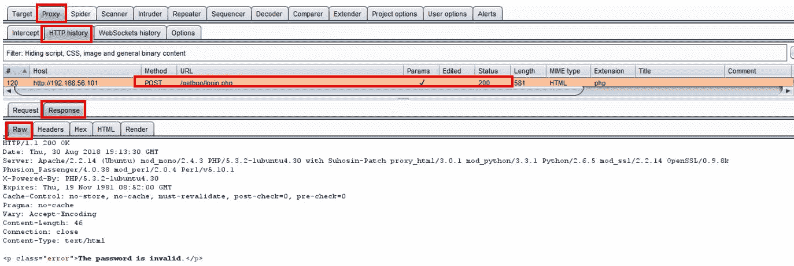

5.  翻回到**请求****原始**选项卡，右击将此请求发送给**入侵者**：


6.  进入 Burp 的**入侵者**选项卡，保持**入侵者**|**目标**选项卡设置不变。继续进入**入侵者**|**位置**选项卡。请注意 Burp 如何在找到的每个参数值周围放置有效负载标记。但是，我们只需要在密码值周围有一个有效负载标记。单击**清除§**按钮以移除 Burp 放置的有效负载标记：


7.  然后，用光标突出显示 admin 的名称值，并单击**添加§**按钮：

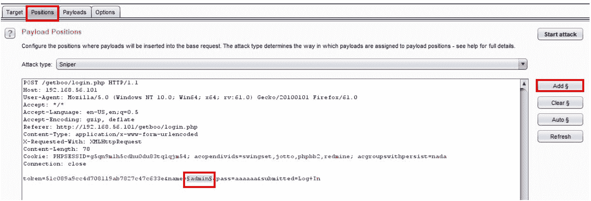

8.  继续进入**入侵者****有效载荷**选项卡。许多测试人员使用单词列表来枚举有效负载标记占位符中常用的用户名。对于这个配方，我们将输入一些常用用户名，以创建一个自定义负载列表。

9.  在**有效载荷选项【简单列表】**部分，键入字符串`user`并点击**添加**按钮：

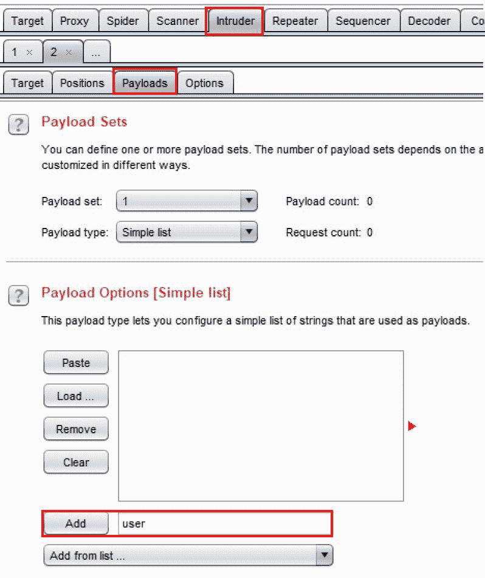

10.  在有效负载列表框中添加更多字符串，例如`john`、`tom`、`demo`，最后添加`admin`：

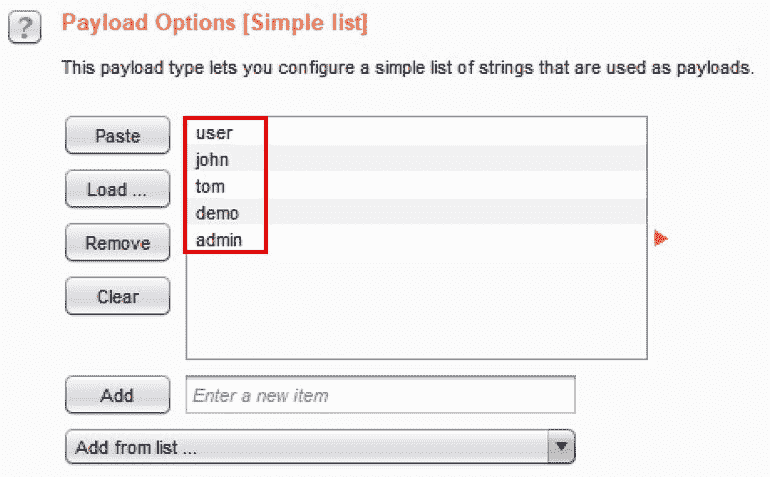

11.  进入**入侵者****选项**选项卡，向下滚动至**Grep–Match**部分。单击复选框**标记结果****项，其响应与这些表达式**匹配。点击**清除**按钮，删除当前列表中的项目：


12.  点击**是**确认要清除列表。
13.  在文本框中键入字符串`The password is invalid`，然后单击**添加**按钮。您的**Grep–Match**部分应如以下屏幕截图所示：

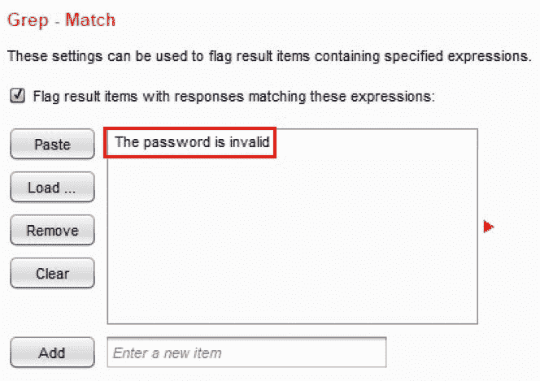

14.  点击**选项**页面顶部的**开始攻击**按钮。此时会出现一个弹出对话框，显示定义的有效载荷，以及我们在**Grep–Match**部分下添加的新列。此弹出窗口是攻击结果表。
15.  攻击结果表显示，具有给定有效载荷的每个请求都会导致状态代码为**200**，其中两个有效载荷**john**和**tom**在响应中没有生成消息**密码无效**。相反，这两个有效载荷返回了一条消息**用户不存在**：

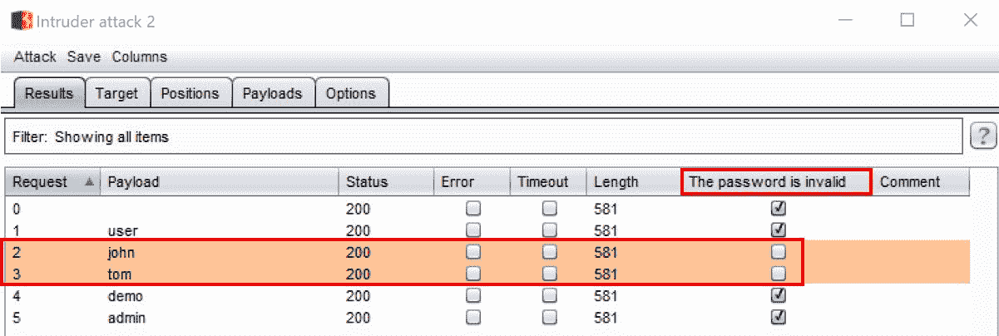

16.  此攻击结果表的结果根据过于详细的错误消息**提供了一个用户名枚举漏洞。密码无效**，这确认了系统上存在用户帐户：


这意味着我们能够确认系统中已经存在用户`user`、`demo`和`admin`的账户。

# 弱锁定机构的测试

应用程序中应存在帐户锁定机制，以减轻暴力登录攻击。通常，应用程序会在三到五次尝试之间设置一个阈值。许多应用程序锁定一段时间后才允许重新尝试。

渗透测试人员必须测试登录保护的所有方面，包括质疑问题和响应（如果存在）。

# 准备

确定应用程序是否包含适当的锁定机制。如果它们不存在，请尝试对登录页面强制使用凭据，以实现对应用程序的未经授权访问。使用 OWASP Mutillidae II 应用程序，尝试使用有效用户名但无效密码登录五次。

# 怎么做。。。

确保 Burp 和 OWASP BWA VM 正在运行，并且在用于查看 OWASP BWA 应用程序的 Firefox 浏览器中配置了 Burp。

1.  在 OWASP BWA 登录页中，单击指向 OWASP Mutillidae II 应用程序的链接。
2.  打开 Firefox 浏览器，进入 OWASP Mutillidae II 的登录屏幕。在顶部菜单中，点击**登录**。
3.  在登录屏幕上，尝试使用用户名`admin`和错误的密码`aaaaaa`登录五次。请注意，在五次尝试期间，应用程序的反应没有任何不同。应用程序不会更改显示的错误消息，并且管理员帐户未被锁定。这意味着登录可能容易受到暴力密码猜测攻击：


让我们继续测试，以强制登录页面并获得对应用程序的未经授权访问。

4.  进入**代理****HTTP 历史记录**页签，查找失败的登录尝试。右键单击五个请求中的一个并将其发送给**入侵者**：

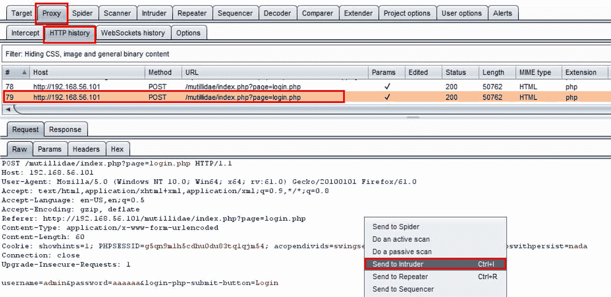

5.  进入 Burp 的**入侵者**选项卡，保持**入侵者**|**目标**选项卡设置不变。继续进入**入侵者**|**位置**选项卡，注意 Burp 如何在找到的每个参数值周围放置有效负载标记。但是，我们只需要在密码值周围设置一个有效负载标记。单击**清除§**按钮以移除 Burp 放置的有效负载标记：


6.  然后，突出显示**AAAAA**的密码值，点击**添加§**按钮。
7.  继续进入**入侵者****有效载荷**选项卡。许多测试人员使用单词列表在有效负载标记占位符中强制使用常用密码。对于这个配方，我们将输入一些常用密码来创建我们自己的唯一有效载荷列表。
8.  在**有效载荷选项【简单列表】**部分，键入字符串`admin123`并点击**添加**按钮：

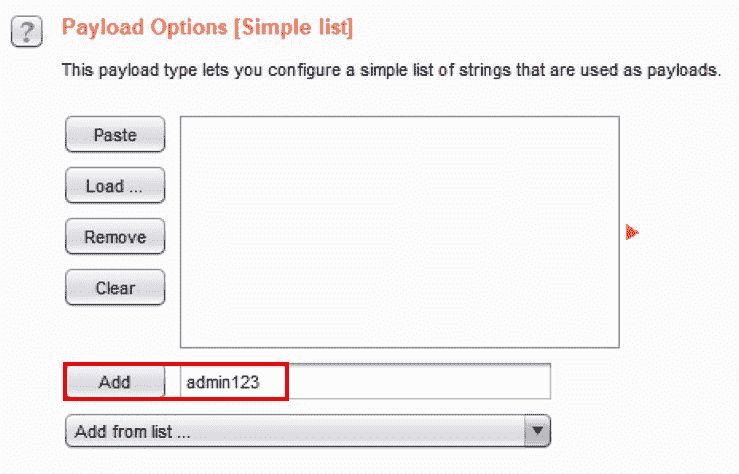

9.  在有效负载列表框中再添加几个字符串，例如`adminpass`、`welcome1`，最后添加`admin`：


10.  进入**入侵者****选项**选项卡，向下滚动至**Grep–摘录**部分：


11.  点击复选框**从响应**中提取以下项目，然后点击**添加**按钮。此时会出现一个弹出框，显示您对`admin`/`aaaaaa`请求的登录尝试失败的响应。
12.  在底部的搜索框中，搜索单词`Not Logged In`。找到匹配项后，必须突出显示**未登录**字样，才能正确分配 grep 匹配项：

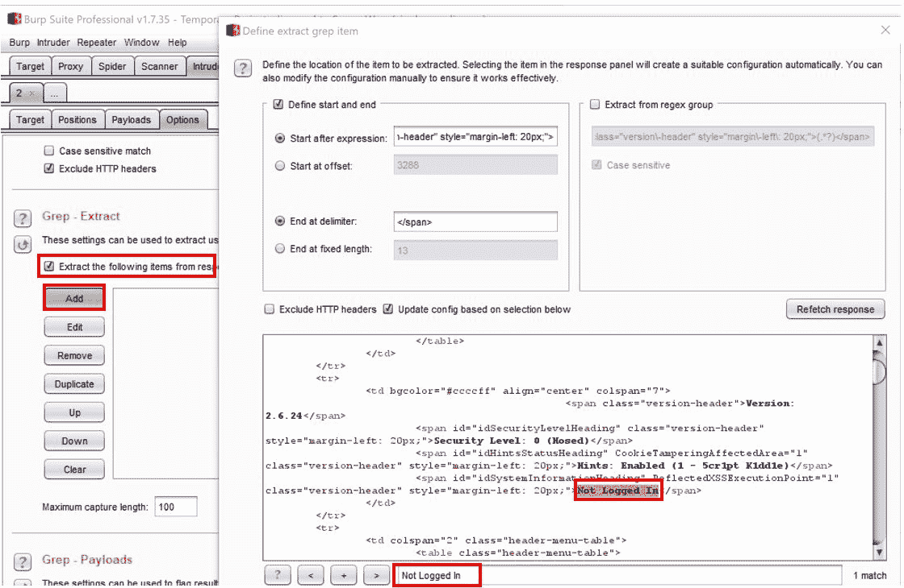

13.  如果您没有正确突出显示单词，单击**确定**后，您将在**Grep–Extract**框中看到**【无效】**。如果出现这种情况，请单击**删除**按钮删除条目，然后单击**添加**按钮重试，执行搜索并突出显示单词。
14.  如果您正确地突出显示单词，您应该在**Grep–Extract**框中看到以下内容：

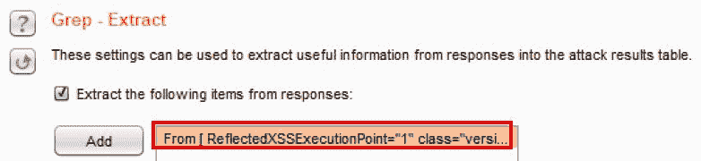

15.  现在，点击**选项**页面右上方的**开始攻击**按钮。
16.  此时会出现一个弹出式攻击结果表，其中显示了将定义的有效载荷放置在有效载荷标记位置的请求。请注意，生成的攻击表显示了一个名为**ReflectedXSSExecution**的额外列。此列是前面设置的**Grep–Extract 选项**的结果。
17.  从这个攻击表中，查看附加列，测试人员可以很容易地确定哪个请求号成功地强行进入登录屏幕。在这种情况下，**请求 4**，使用用户名`admin`和密码`admin`的凭证将我们登录到应用程序：


18.  在攻击表中选择**请求 4**，查看**响应****渲染**页签。您应该会在右上方看到消息**登录 Admin:Admin（g0t r00t？**：

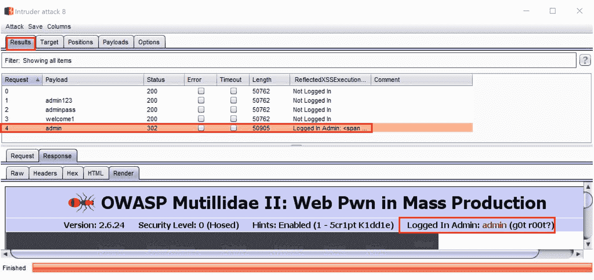

19.  点击右上角的**X**关闭攻击表。

由于应用程序具有较弱的锁定机制，您成功地强制系统上有效帐户的密码。

# 绕过身份验证方案的测试

应用程序可能包含缺陷，允许通过绕过现有的身份验证措施进行未经授权的访问。绕过技术包括**直接页面请求**（即强制浏览）、**参数修改**、**会话 ID 预测**和**SQL 注入**等。

在本配方中，我们将使用参数修改。

# 准备

在未经身份验证的请求中添加和编辑参数，以匹配先前捕获的经身份验证的请求。重播修改后的未经验证的请求，以通过绕过登录机制获得对应用程序的访问。

# 怎么做。。。

1.  使用顶部菜单左侧的**主页**按钮，打开 Firefox 浏览器至 OWASP Mutillidae II 主页。确保您未登录应用程序。如果您已登录，请从菜单中选择**注销**：

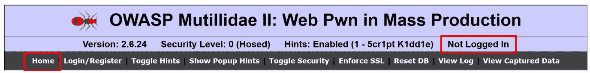

2.  在 Burp 中，进入**代理****HTTP 历史记录**选项卡，选择您刚刚提出的请求，以未经验证的身份浏览主页。右键单击，然后选择**发送至中继器**：


3.  使用相同的请求和位置，再次右键单击，然后选择**发送到比较器**（请求）：

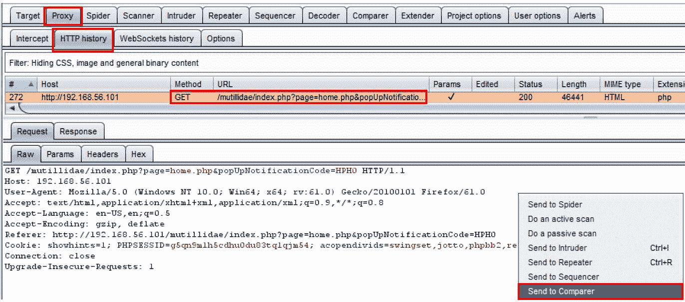

4.  返回浏览器主页，点击**登录/注册**按钮。在登录页面，使用用户名`admin`和密码`admin`登录。点击**登录**。
5.  登录后，继续并注销。确保您按下**注销**按钮并从管理员帐户中注销。

6.  在 Burp 中，进入**代理**|**HTTP 历史记录**选项卡，选择您刚刚提出的请求，以`admin`身份登录。在`POST 302`重定向后立即选择`GET`请求。右击选择**发送至****直放站**（请求）：

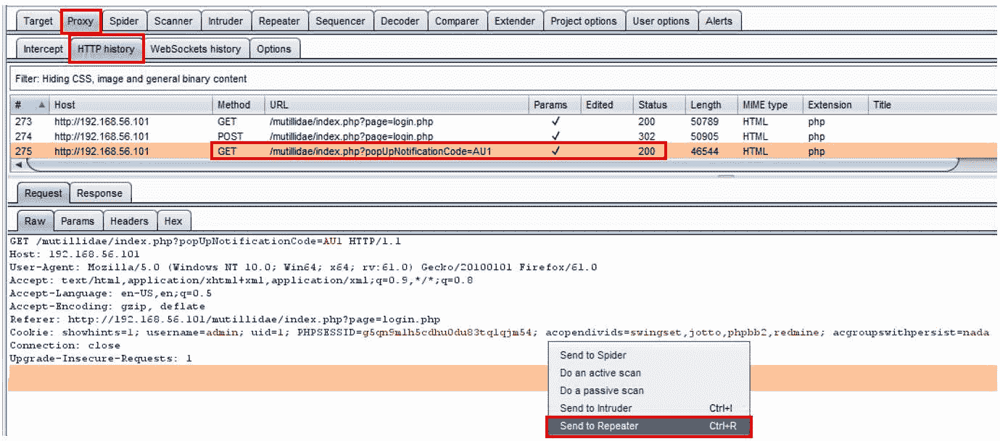

7.  使用相同的请求和位置，再次右键单击并**发送到比较器**（请求）：

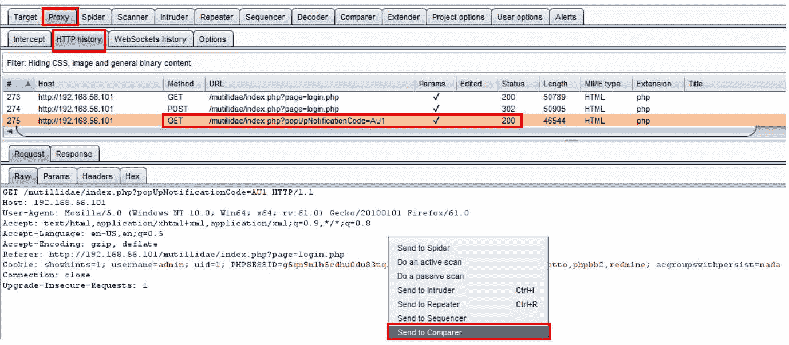

8.  转到 Burp 的**比较器**选项卡。请注意，您发送的两个请求被突出显示。按下右下方的**字**按钮，同时比较两个请求：


9.  一个对话框弹出显示这两个带有颜色编码的高光的请求，以吸引您的注意力。请注意**Referer**标题中的更改以及管理员帐户 cookie 中的附加名称/值对。用右侧的**X**关闭弹出框：

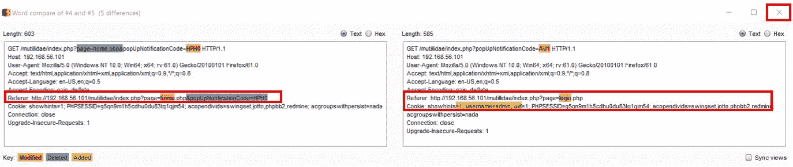

10.  返回到**中继器**，其中包含您未经验证执行的第一个`GET`请求。在执行此攻击之前，请确保您已完全注销应用程序。

11.  您可以通过点击**中继器**中与您未经验证的请求相关联的**Go**按钮来验证您已注销：

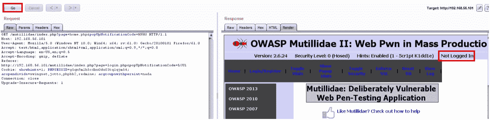

12.  现在转到**中继器**选项卡，其中包含您作为身份验证用户`admin`的第二个`GET`请求。从经过身份验证的请求复制**Referer**头和**Cookie**的值。此攻击是为了绕过身份验证而修改参数：


13.  从已验证的`GET`请求复制突出显示的标题（**Referer 和 Cookie**。您将把这些值粘贴到未经验证的`GET`请求中。
14.  通过突出显示并右键单击替换未经验证的`GET`请求中的相同标题，然后选择**粘贴**。
15.  右键单击并在您执行为未经验证的第一个`GET`请求的**中继器****原始**选项卡中选择**粘贴**。

16.  点击**Go**按钮发送修改后的`GET`请求。请记住，这是您执行的第一个未经验证的`GET`请求。
17.  验证您现在已在**响应****呈现**选项卡中以管理员身份登录。我们能够通过执行参数操作绕过身份验证机制（即登录页面）：

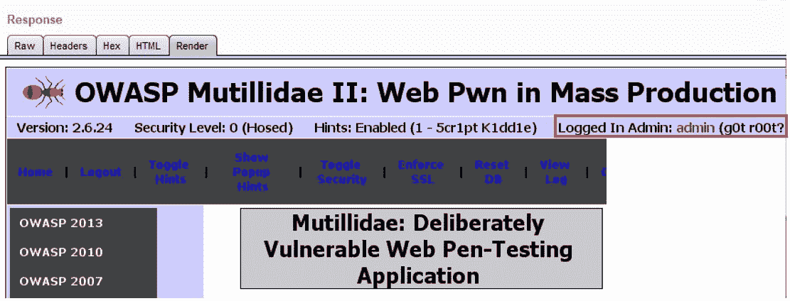

# 工作原理

通过将 cookie 中找到的令牌和经过身份验证的请求的 referer 值重放到未经身份验证的请求中，我们能够绕过身份验证方案并获得对应用程序的未经授权访问。

# 测试浏览器缓存的弱点

浏览器缓存是为了提高性能和更好的最终用户体验而提供的。但是，当用户在浏览器中键入敏感数据时，这些数据也可以缓存在浏览器历史记录中。通过检查浏览器的缓存或只需按下浏览器的*后退*按钮，即可看到缓存的数据。

# 准备

使用浏览器的“后退”按钮，确定是否缓存登录凭据，以允许未经授权的访问。在 Burp 中检查这些步骤，以了解漏洞。

# 怎么做。。。

1.  使用密码`admin`以`admin`的身份登录 Mutillidae 应用程序。
2.  现在，单击顶部菜单中的**注销**按钮退出应用程序。
3.  注意**未登录**消息，确认您已注销。
4.  在 Burp 的**代理****历史记录**中也可以将这些步骤视为消息。注意：注销执行**302**重定向，以避免在浏览器中缓存 cookie 或凭据：


5.  在 Firefox 浏览器中，单击“上一步”按钮，注意您现在以管理员身份登录，即使您没有登录！这是可能的，因为缓存凭据存储在浏览器中，并且应用程序中没有设置任何缓存控制保护。
6.  现在在浏览器中刷新/重新加载页面，您将看到您再次注销。
7.  检查**代理****HTTP 历史记录**选项卡中的步骤。对照**代理****HTTP 历史记录**表中捕获的消息，查看您通过浏览器执行的步骤：
    *   以下屏幕截图中的请求 1 未经验证
    *   请求 35 是成功登录（302）为``admin``
    *   请求 37 是注销`admin`帐户
    *   请求 38 和 39 是刷新或重新加载浏览器页面，使我们再次注销

8.  按浏览器的“后退”按钮时，不会捕获任何请求。这是因为后退按钮动作包含在浏览器中。没有通过 Burp 向 web 服务器发送执行此操作的消息。这是一个需要注意的重要区别。尽管如此，我们发现了一个与弱浏览器缓存保护相关的漏洞。在这种情况下，渗透测试人员将拍摄登录缓存页面的屏幕截图，单击“上一步”按钮后可以看到：

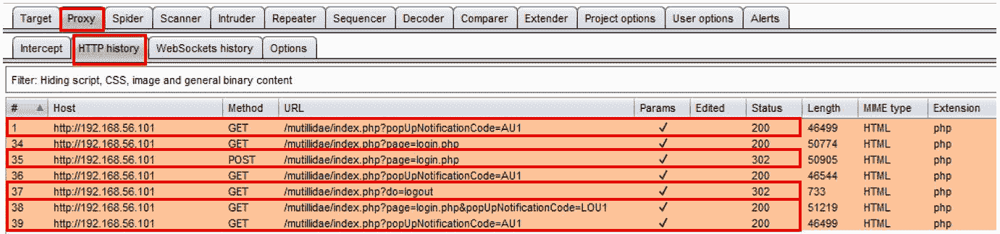

# 通过 RESTAPI 测试帐户设置过程

帐户设置是在应用程序中建立和维护用户帐户的过程。资源调配功能通常仅限于管理员帐户。渗透测试人员必须验证帐户设置功能是否由提供适当标识和授权的用户完成。账户设置的一个常见场所是通过**代表性状态转移**（**REST**API 调用。很多时候，开发人员可能不会对应用程序 UI 部分中使用的 API 调用执行相同的授权检查。

# 准备

使用 OWASP Mutillidae II 应用程序中可用的 REST API 调用，确定未经验证的 API 调用是否可以配置或修改用户。

# 怎么做。。。

确保您没有登录到应用程序。如果是，请单击顶部菜单中的**注销**按钮。

1.  在 Mutillidae 中，浏览到**用户查找（SQL）页面**并选择**OWASP 2013****A1 注入（SQL）****SQLi–提取数据****用户信息（SQL）**：

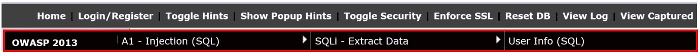

2.  为**名称**输入`user`，为**密码****输入`user`，点击**查看账户详情***。*您应该会在下一个屏幕截图中看到结果。这是我们将使用 REST 调用测试配置功能的帐户：**

 **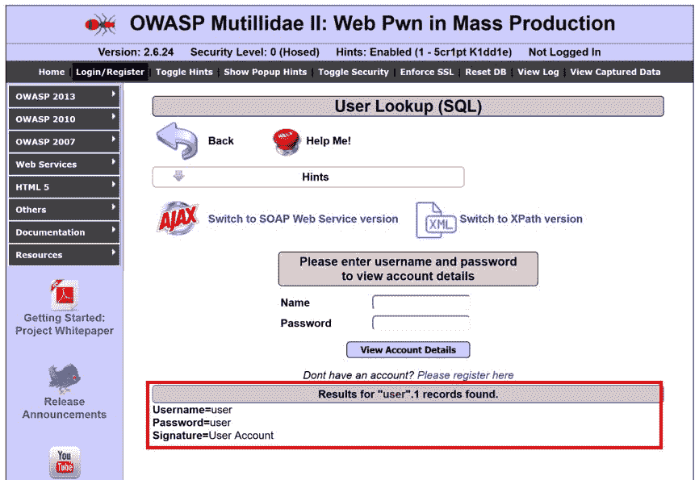

通过爬行，Burp 可以找到`/api`或`/rest`文件夹。这些文件夹是应用程序启用 RESTAPI 的线索。测试人员需要确定哪些函数可以通过这些 API 调用使用。

3.  对于 Mutillidae，`/webservices/rest/`文件夹结构通过 REST API 调用提供帐户设置。
4.  要直接进入 Mutillidae 中的此结构，请选择**Web 服务****REST****SQL 注入****用户****账户管理**：

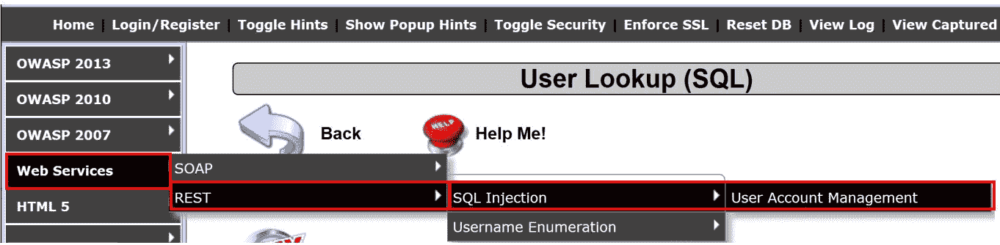

您将看到一个屏幕，描述支持的 REST 调用和每个调用所需的参数：


5.  让我们尝试调用其余调用之一。进入**代理****HTTP 历史**表，从菜单中选择您发送的最新请求，进入**用户账户管理**页面。右击并将此请求发送至**中继器**：


6.  在 Burp 的**中继器**中，添加`?`，然后在 URL 中添加一个参数名/值对`username=user`。新 URL 应如下所示：

```
/mutillidae/webservices/rest/ws-user-account.php?username=user
```

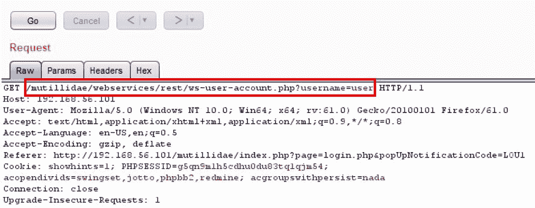

7.  点击**Go**按钮，注意我们可以作为未经身份验证的用户检索数据！执行此类操作不需要身份验证令牌：


8.  让我们看看还能做些什么。使用**用户帐户管理**页面上给出的 SQL 注入字符串，让我们尝试转储整个用户表。
9.  在`username=`之后追加以下值：

```
user'+union+select+concat('The+password+for+',username,'+is+',+password),mysignature+from+accounts+--+
```

新 URL 应为以下 URL：

```
/mutillidae/webservices/rest/ws-user-account.php?username=user'+union+select+concat('The+password+for+',username,'+is+',+password),mysignature+from+accounts+--+
```

10.  修改`username`参数后，点击**Go**按钮。您的请求应如以下屏幕截图所示：


11.  请注意，我们转储了数据库中的所有帐户，显示了所有用户名、密码和签名：

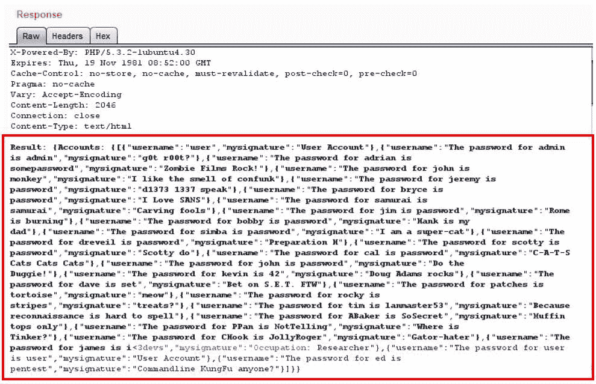

12.  有了这些信息，返回**代理****HTTP 历史**，选择您请求查看**用户****账户管理**页面，右击，发送到**直放站**。
13.  在**中继器**中，修改**请求**的**原始**选项卡中的`GET`动词，并将其替换为`DELETE`：


14.  移动到**参数**页签，点击**添加**按钮，添加两个`Body`类型参数：第一个是用户名，值设置为`user`，第二个是密码，值设置为`user`，然后点击**Go**按钮：

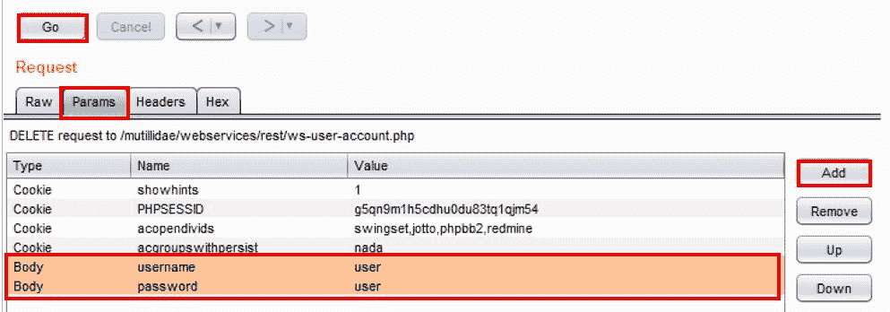

15.  注意，我们删除了该帐户！我们能够检索信息，甚至在数据库中修改（删除）行，而不显示 API 密钥或身份验证令牌！


注意：如果您希望重新创建用户帐户，请重复前面的步骤，将*删除*替换为*放置*。签名是可选的。点击**进入**按钮。再次重新创建用户帐户。**