# 评估会议管理机制

在本章中，我们将介绍以下配方：

*   使用 Sequencer 测试会话令牌强度
*   测试 cookie 属性
*   会话固定测试
*   测试公开的会话变量
*   跨站点请求伪造测试

# 介绍

本章介绍用于绕过和评估会话管理方案的技术。应用程序使用会话管理方案来跟踪用户活动，通常是通过会话令牌。会话管理的 Web 评估还包括确定使用的会话令牌的强度以及这些令牌是否得到适当保护。我们将学习如何使用打嗝来执行此类测试。

# 软件工具要求

要完成本章中的食谱，您需要以下内容：

*   OWASP 断开的 Web 应用程序（VM）
*   多天线链路
*   打嗝代理社区或专业人员（[https://portswigger.net/burp/](https://portswigger.net/burp/) ）
*   配置为允许 Burp 代理流量的 Firefox 浏览器（[https://www.mozilla.org/en-US/firefox/new/](https://www.mozilla.org/en-US/firefox/new/) ）

# 使用 Sequencer 测试会话令牌强度

为了在应用程序中逐页跟踪用户活动，开发人员创建并为每个用户分配唯一的会话令牌值。大多数会话令牌机制包括会话 ID、隐藏表单字段或 cookie。Cookie 被放置在客户端的用户浏览器中。

这些会话令牌应由渗透测试人员检查，以确保其唯一性、随机性和加密强度，从而防止信息泄漏。

如果会话令牌值很容易猜测或在登录后保持不变，则攻击者可以向用户应用（或修复）一个已知的令牌值。这被称为**会话固定攻击**。一般来说，攻击的目的是获取用户帐户中的敏感数据，因为攻击者知道会话令牌。

# 准备

我们将检查 OWASP Mutillidae II 中使用的会话令牌，以确保它们是以安全且不可预测的方式创建的。能够预测和伪造弱会话令牌的攻击者可以执行会话固定攻击。

# 怎么做。。。

确保 Burp 和 OWASP BWA VM 正在运行，并且在用于查看 OWASP BWA 应用程序的 Firefox 浏览器中配置了 Burp。

1.  在**OWASP BWA 着陆**页面中，单击指向 OWASP Mutillidae II 应用程序的链接。
2.  打开 Firefox 浏览器进入 OWASP Mutillidae II 主页（URL:`http://<your_VM_assigned_IP_address>/mutillidae/`）。确保您正在启动 Mutillidae 应用程序的新会话，并且尚未登录到该会话：


3.  切换到 Proxy | HTTP History 选项卡，并选择显示初始浏览 Mutillidae 主页的请求。
4.  查找`GET`请求和包含`Set-Cookie:`分配的相关响应。每当您看到此任务时，您都可以确保为您的会话获得一个新创建的 cookie。具体而言，我们对`PHPSESSID`cookie 值感兴趣：

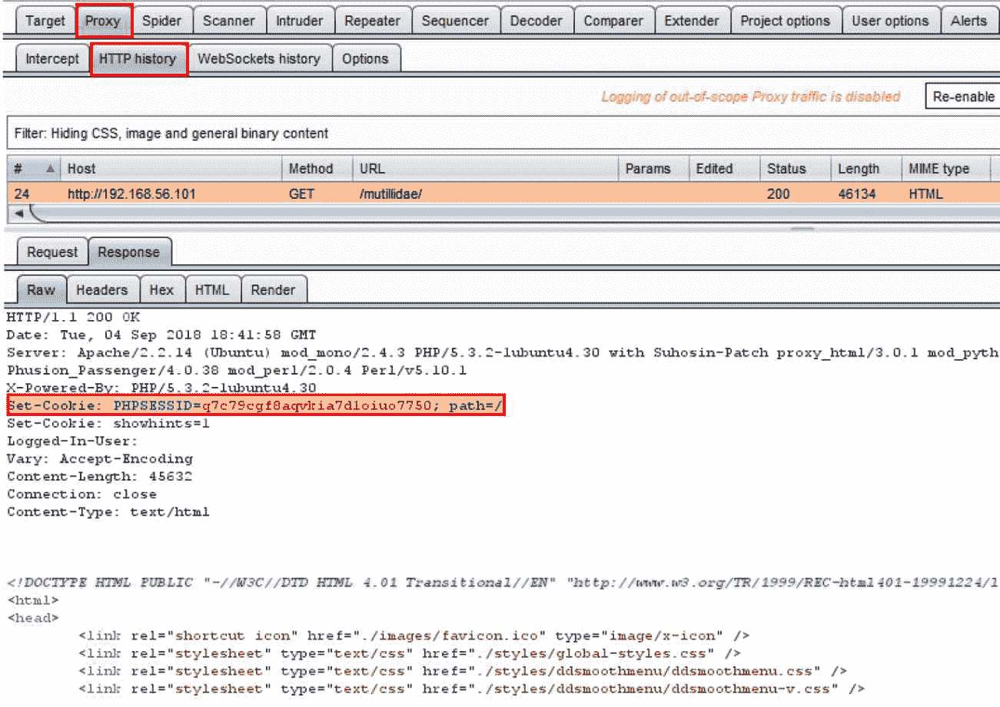

5.  突出显示`PHPSESSID`cookie 的值，右键单击，然后选择发送到 Sequencer：


Sequencer 是 Burp 中的一个工具，用于确定会话令牌中创建的随机性的强度或质量。

6.  将`PHPSESSID`参数的值发送给 Sequencer 后，您将在 Select Live Capture Request 表中看到加载的值。
7.  在按下开始实时捕获按钮之前，向下滚动至响应部分内的令牌位置。在 Cookie 下拉列表中，选择`PHPSESSID=<captured session token value>`：


8.  因为我们选择了正确的 cookie 值，所以可以开始实时捕获过程。单击 Start live capture 按钮，Burp 将发送多个请求，从每个响应中提取 PHPSESSID cookie。每次捕获后，Sequencer 对每个标记中的随机性水平进行统计分析。

9.  允许捕获收集和分析至少 200 个令牌，但如果您愿意，可以让捕获运行更长时间：

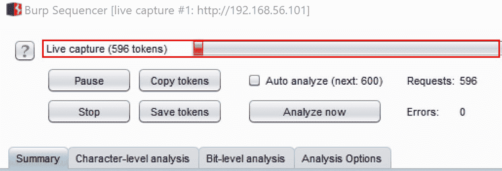

10.  至少有 200 个样本后，单击“立即分析”按钮。当您准备停止捕获过程时，按下停止按钮并确认是：

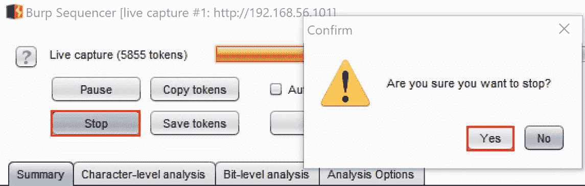

11.  分析完成后，Sequencer 的输出将提供一个总体结果。在这种情况下，PHPSESSID 会话令牌的随机性质量非常好。有效熵的量估计为 112 比特。从 web pentester 的角度来看，这些会话令牌非常强大，因此这里没有需要报告的漏洞。但是，尽管不存在漏洞，但最好对会话令牌执行此类检查：


# 它是如何工作的。。。

为了更好地理解 Sequencer 背后的数学和假设，请参考 Portswigger 关于以下主题的文档：[https://portswigger.net/burp/documentation/desktop/tools/sequencer/tests](https://portswigger.net/burp/documentation/desktop/tools/sequencer/tests) 。

# 测试 cookie 属性

重要的用户特定信息（如会话令牌）通常存储在客户端浏览器中的 cookie 中。由于 Cookie 的重要性，需要保护其免受恶意攻击。这种保护通常以两种标志的形式出现-**安全**和**HttpOnly**。

如果协议已加密（例如 HTTPS、TLS），则安全标志通知浏览器仅将 cookie 发送到 web 服务器。此标志保护 cookie 不被未加密的通道窃听。

HttpOnly 标志指示浏览器不允许通过 JavaScript 访问或操纵 cookie。此标志保护 cookie 免受跨站点脚本攻击。

# 准备

检查 OWASP Mutillidae II 应用程序中使用的 cookie，以确保存在保护标志。由于 Mutillidae 应用程序在未加密的通道（例如 HTTP）上运行，因此我们只能检查 HttpOnly 标志是否存在。因此，安全标志超出此配方的范围。

# 怎么做。。。

确保 Burp 和 OWASP BWA VM 正在运行，并且在用于查看 OWASP BWA 应用程序的 Firefox 浏览器中配置了 Burp。

1.  在**OWASP BWA 着陆**页面中，单击指向 OWASP Mutillidae II 应用程序的链接。
2.  打开 Firefox 浏览器，进入 OWASP Mutillidae II 主页（URL:`http://<your_VM_assigned_IP_address>/mutillidae/`）。确保您正在启动新会话，并且未登录到 Mutillidae 应用程序：

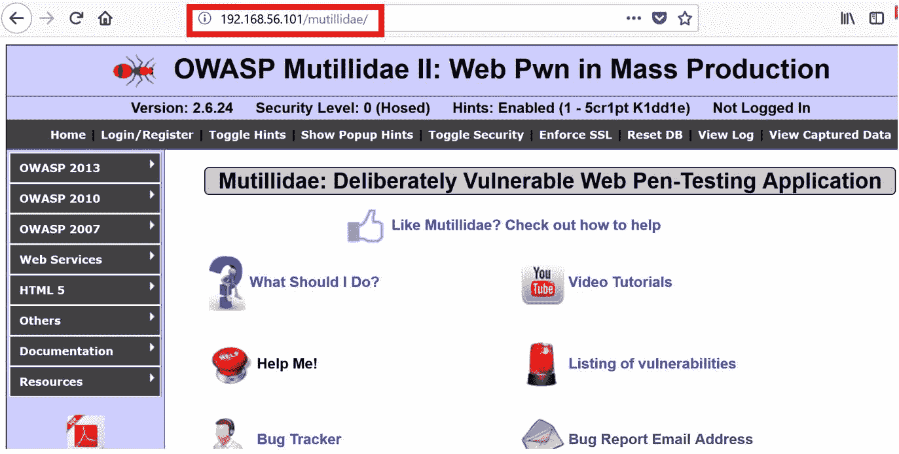

3.  切换到 Proxy | HTTP history 选项卡，然后选择显示初始浏览 Mutillidae 主页的请求。查找`GET`请求及其包含`Set-Cookie:`赋值的相关响应。每当您看到此任务时，您都可以确保为您的会话获得一个新创建的 cookie。具体来说，我们对`PHPSESSID`cookie 值感兴趣。
4.  检查`Set-Cookie:`作业行的结尾。请注意，这两行都没有 HttpOnly 标志。这意味着 PHPSESSID 和 showHitts cookie 值不受 JavaScript 操作的保护。这是您将在报告中包含的安全性调查结果：

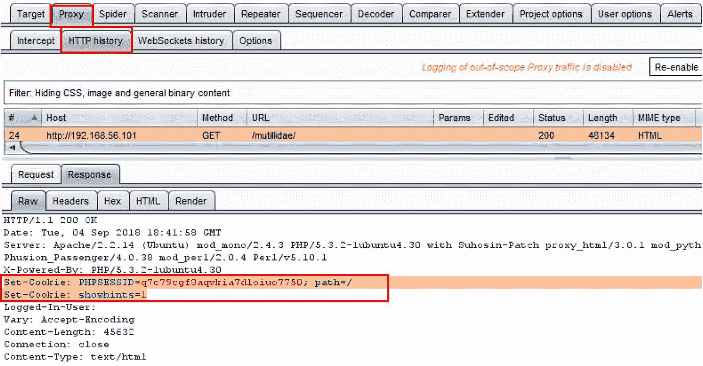

# 它是如何工作的。。。

如果这两个 Cookie 设置了 HttpOnly 标志，那么这些标志将出现在设置的 Cookie 分配行的末尾。当标志出现时，它将紧接着一个分号，结束 cookie 的路径范围，后跟字符串 HttpOnly。`Secure`标志的显示也类似：

```
Set-Cookie: PHPSESSID=<session token value>;path=/;Secure;HttpOnly;
```

# 会话固定测试

会话令牌分配给用户用于跟踪目的。这意味着，当以未经身份验证的方式浏览应用程序时，会为用户分配一个唯一的会话 ID，该 ID 通常存储在 cookie 中。应用程序开发人员应始终在用户登录网站后创建新的会话令牌。如果此会话令牌未更改，则应用程序可能会受到会话固定攻击。web 渗透测试人员负责确定此令牌是否将值从未经验证的状态更改为已验证的状态。

当应用程序开发人员不使未经身份验证的会话令牌无效，允许用户在身份验证后使用相同的会话令牌时，就会出现会话固定。此场景允许攻击者使用被盗会话令牌伪装成用户。

# 准备

使用 OWASP Mutillidae II 应用程序和 Burp 的代理 HTTP 历史记录和比较器，我们将检查未经验证的 PHPSESSID 会话令牌值。然后，我们将登录到应用程序，并将未经验证的值与已验证的值进行比较，以确定会话固定漏洞的存在。

# 怎么做。。。

1.  导航到登录屏幕（单击顶部菜单中的登录/注册），但暂时不要登录。
2.  切换到 Burp 的**代理**HTTP 历史记录选项卡，在浏览登录屏幕时查找显示的`GET`请求。记下分配给放置在 cookie 中的`PHPSESSID`参数的值：


3.  右键点击`PHPSESSID`参数，将请求发送到比较器：


4.  返回登录屏幕（点击顶部菜单中的登录/注册），这次以用户名`ed`和密码`pentest`登录。
5.  登录后，切换到 Burp 的**代理**HTTP 历史选项卡。查找显示您登录的`POST`请求（例如 302 HTTP 状态码）以及`POST`之后的即时`GET`请求。注意登录后分配的`PHPSESSID`。右键单击并将此请求发送到 Comparer。
6.  切换到 Burp 的比较器。应该已经为您突出显示了相应的请求。单击右下角的文字按钮：


弹出窗口显示两个请求之间差异的详细比较。注意，`PHPSESSID`的值在未经验证的会话（左侧）和已验证的会话（右侧）之间没有变化。这意味着应用程序存在会话固定漏洞：


# 它是如何工作的。。。

在这个配方中，我们检查了分配给未经身份验证的用户的`PHPSESSID`值如何在身份验证后保持不变。这是一个允许会话固定攻击的安全漏洞。

# 测试公开的会话变量

应用程序开发人员使用令牌、cookie 或隐藏表单字段等会话变量在客户端和服务器之间发送数据。由于这些变量是在客户端公开的，攻击者可以操纵它们，试图访问未经授权的数据或捕获敏感信息。

Burp 的代理选项提供了一个增强所谓的*隐藏*表单字段可见性的功能。此功能允许 web 应用程序渗透测试人员确定这些变量中数据的敏感性级别。同样，pentester 可以确定这些值的操作是否会在应用程序中产生不同的行为。

# 准备

使用 OWASP Mutillidae II 应用程序和 Burp 代理的取消隐藏隐藏表单字段功能，我们将确定操纵隐藏表单字段值是否会导致访问未经授权的数据。

# 怎么做。。。

1.  切换到 Burp 的**代理**选项卡，向下滚动至响应修改部分，选中取消隐藏隐藏表单字段的复选框，并突出显示未隐藏的字段：


2.  导航至**用户信息**页面。OWASP 2013 | A1–注入（SQL）| SQLi–提取数据|用户信息（SQL）：

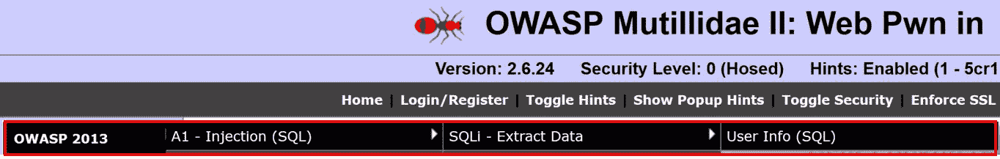

3.  请注意，隐藏的表单字段现在显著显示在页面上：


4.  让我们尝试操作显示的值`user-info.php`，将其更改为`admin.php`，并查看应用程序的反应。将隐藏字段[页面]文本框内的`user-info.php`修改为`admin.php`：

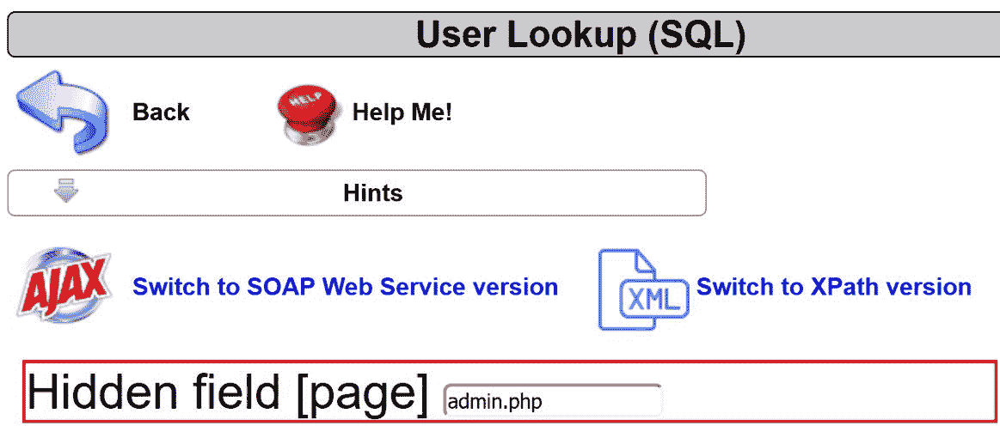

5.  更改后按*回车*键。您现在应该会看到加载的新页面，显示**PHP 服务器配置**信息：

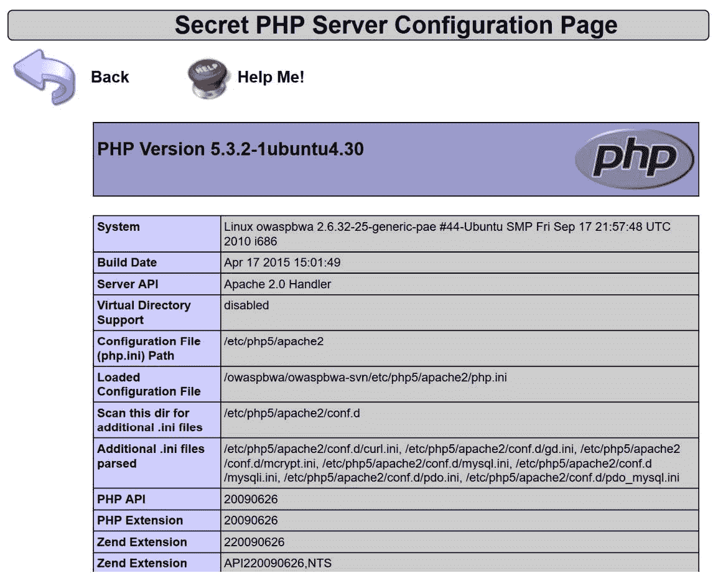

# 它是如何工作的。。。

如本配方所示，隐藏的表单字段没有任何隐藏的内容。作为渗透测试人员，我们应该检查和操纵这些值，以确定敏感信息是否在无意中暴露，或者我们是否可以根据我们的角色和身份验证状态改变应用程序的行为。在这个配方中，我们甚至没有登录到应用程序。我们操纵标记为**页面**的隐藏表单字段来访问包含指纹信息的页面。对此类信息的访问应受到保护，以防未经验证的用户访问。

# 跨站点请求伪造测试

**跨站点请求伪造**（**CSRF**是一种通过身份验证的用户会话进行的攻击，允许攻击者强制用户代表攻击者执行不必要的操作。此攻击的最初诱因可能是钓鱼电子邮件或通过受害者网站上发现的跨站点脚本漏洞执行的恶意链接。利用 CSRF 可能导致数据泄露，甚至导致 web 应用程序完全受损。

# 准备

使用 OWASP Mutillidae II 应用程序注册表单，确定在经过身份验证的用户登录到应用程序时，同一浏览器（不同选项卡）内是否可能发生 CSRF 攻击。

# 怎么做。。。

要设置此配方的级别，首先让我们确定 account 表中当前记录数的基线，并执行 SQL 注入以查看以下内容：

1.  导航至**用户信息**页面：OWASP 2013 | A1–注入（SQL）| SQLi–提取数据|用户信息（SQL）。
2.  在用户名提示下，键入 SQL 注入负载以转储整个帐户表内容。有效载荷为`' or 1=1--`<空间>（勾选或 1 等于 1 个破折号空间）。然后按查看帐户详细信息按钮。

3.  记住在两个破折号后面加空格，因为这是一个 MySQL 数据库；否则，有效载荷将无法工作：

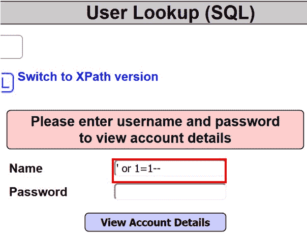

4.  正确执行后，将显示一条消息，表明在数据库中为用户找到了 24 条记录。消息后面显示的数据显示了所有 24 个帐户的用户名、密码和签名字符串。此处仅显示两个帐户详细信息作为示例：


我们确认数据库的 accounts 表中目前存在 24 条记录。

5.  现在，返回登录屏幕（单击顶部菜单中的登录/注册）并选择“请在此处注册”链接。
6.  单击“请在此处注册”链接后，您将收到一份注册表格。
7.  填写表格以创建测试人员帐户。输入用户名为*测试仪*，密码为*测试仪*，签名为`This is a tester account`：


8.  单击“创建帐户”按钮后，您将收到一条绿色横幅，确认帐户已创建：


9.  返回**用户信息**页面：**OWASP 2013【A1–注入（SQL）【SQLi–提取数据】用户信息（SQL）**。
10.  再次执行 SQL 注入攻击，并验证您现在可以在 account 表中看到 25 行，而不是之前的 24 行：


11.  切换到 Burp 的 Proxy HTTP history 选项卡，查看为测试人员创建帐户的`POST`请求。

12.  研究此`POST`请求将显示`POST`动作（`register.php`和执行该动作所需的身体数据，在本例中为`username`、`password`、`confirm_password`和`my_signature`。还请注意，没有使用 CSRF 令牌。CSRF 令牌放置在 web 表单中，以防止我们即将执行的攻击。让我们继续吧。

13.  右键点击`POST`请求，点击发送至中继器：


14.  如果您使用的是 Burp Professional，右键单击选择接洽工具|生成 CSRF PoC:


15.  单击此功能后，弹出框将生成注册页面上使用的相同表单，但没有任何 CSRF 令牌保护：

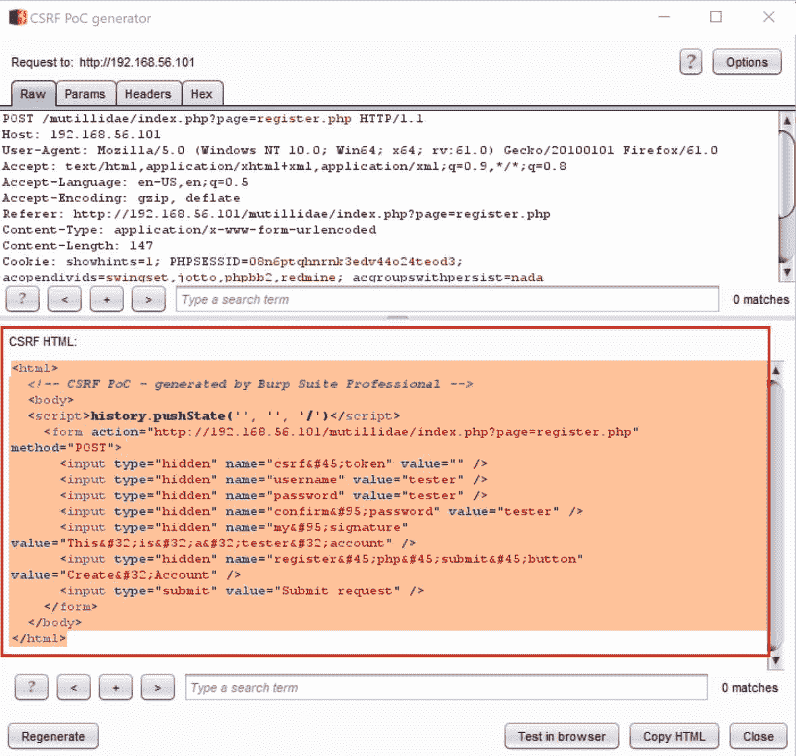

16.  如果您使用的是 Burp 社区，您可以通过查看注册页面的源代码轻松重新创建**CSRF PoC**表单：


17.  查看页面来源时，向下滚动至`<form>`标记部分。为简洁起见，接下来将重新创建表单。插入`attacker`作为用户名、密码和签名的值。复制以下 HTML 代码并将其保存在名为`csrf.html`的文件中：

```
<html>
  <body>
  <script>history.pushState('', '', '/')</script>
    <form action="http://192.168.56.101/mutillidae/index.php?page=register.php" method="POST">
      <input type="hidden" name="csrf-token" value="" />
      <input type="hidden" name="username" value="attacker" />
      <input type="hidden" name="password" value="attacker" />
      <input type="hidden" name="confirm_password" value="attacker" 
/>      <input type="hidden" name="my_signature" value="attacker account" />
      <input type="hidden" name="register-php-submit-button" value="Create Account" />
      <input type="submit" value="Submit request" />
    </form>
  </body>
</html>
```

18.  现在，返回登录屏幕（单击顶部菜单中的登录/注册），使用用户名`ed`和密码`pentest`登录应用程序。
19.  打开机器上保存`csrf.html`文件的位置。将文件拖到浏览器中，ed 将在其中进行身份验证。将文件拖动到此浏览器后，`csrf.html`将在同一浏览器中显示为单独的选项卡：


20.  出于演示目的，有一个提交请求按钮。但是，在野外，JavaScript 函数会自动执行为攻击者创建帐户的操作。单击“提交请求”按钮：


您应收到攻击者帐户已创建的确认：


21.  切换到 Burp 的 Proxy | HTTP history 选项卡，查找恶意执行的用于为攻击者创建帐户的`POST`，同时使用 ed 的身份验证会话：

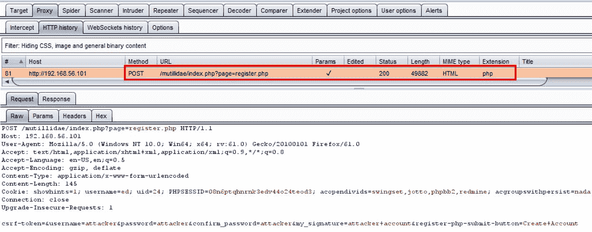

22.  返回**用户信息**页面：OWASP 2013 | A1–注入（SQL）| SQLi–提取数据|用户信息（SQL），再次执行 SQL 注入攻击。您现在将在 account 表中看到 26 行，而不是之前的 25 行：


# 它是如何工作的。。。

CSRF 攻击要求经过身份验证的用户会话代表攻击者在应用程序内秘密执行操作。在这种情况下，攻击者利用 ed 的会话重新运行注册表，为攻击者创建帐户。如果`ed`是管理员，那么也可以提升帐户角色。