# 评估输入验证检查

在本章中，我们将介绍以下配方：

*   测试反射式跨站点脚本
*   测试存储的跨站点脚本
*   HTTP 动词篡改测试
*   HTTP 参数污染测试
*   SQL 注入测试
*   命令注入测试

# 介绍

在应用程序代码中使用客户端输入之前，无法验证从客户端接收的任何输入是 web 应用程序中最常见的安全漏洞之一。此漏洞是主要安全问题的根源，例如 SQL 注入和**跨站点脚本编制**（**XSS**）。Web 渗透测试人员必须评估并确定应用程序是否反射或执行任何输入。我们将学习如何使用打嗝来执行此类测试。

# 软件工具要求

为了完成本章中的食谱，您需要以下内容：

*   OWASP 断开的 Web 应用程序（VM）
*   多天线链路
*   打嗝代理社区或专业人员（[https://portswigger.net/burp/](https://portswigger.net/burp/) ）

# 测试反射式跨站点脚本

当恶意 JavaScript 被注入到输入字段、参数或头中，并从 web 服务器返回后在浏览器中执行时，会发生反射式跨站点脚本。当 JavaScript 的执行只反映在浏览器中，而不是网页的永久部分时，就会发生反射 XSS。渗透测试人员需要测试发送到 web 服务器的所有客户端值，以确定 XSS 是否可行。

# 准备

使用 OWASP Mutillidae II，我们来确定应用程序是否能够防止反射的**跨站点脚本**（**XSS**）。

# 怎么做。。。

1.  从 OWASP Mutilliae II 菜单中，通过导航至 OWASP 2013 | A3-跨站点脚本（XSS）|反射（一阶）|笔测试工具查找选择登录：

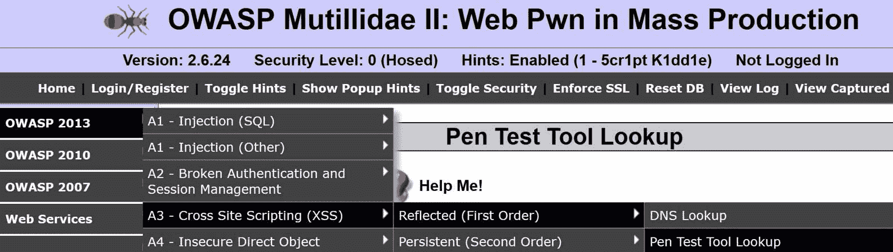

2.  从下拉列表中选择一个工具，然后单击“查找工具”按钮。下拉列表中的任何值都适用于此配方：

3.  切换到 Burp Proxy | HTTP history 并通过选择查找工具查找您刚刚创建的 HTTP 消息。请注意，请求中有一个名为`ToolID`的参数。在以下示例中，值为`16`：

4.  翻到 Response 选项卡，注意从请求返回的 JSON。通过在底部的搜索框中键入`PenTest`，您可以更容易地在响应中找到 JavaScript 函数。注意，`tool_id`反映在一个名为`toolIDRequested`的响应参数中。这可能是 XSS 的攻击向量：

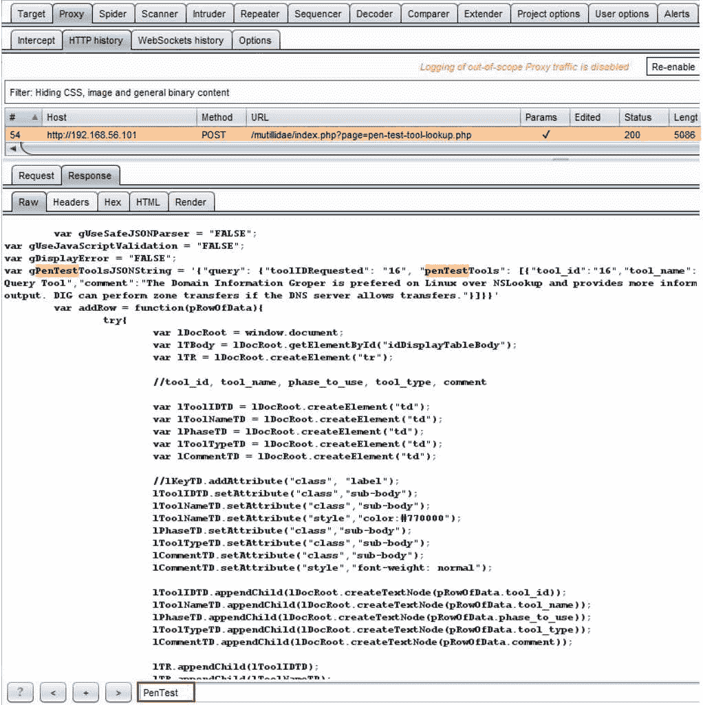

5.  将请求发送到中继器。在紧跟数字之后的`ToolID`参数中添加 XSS 有效负载。使用简单的有效载荷，如``：

6.  单击 Go 并检查返回的 JSON 响应，搜索`PenTest`。请注意，我们的有效负载返回的与输入的完全相同。看起来开发人员在使用任何输入数据之前都没有对其进行清理。让我们利用这个缺陷：

7.  由于我们使用的是 JSON 而不是 HTML，因此需要调整负载以匹配返回的 JSON 的结构。我们将欺骗 JSON，使其认为有效负载是合法的。我们将把原来的``有效载荷改为`"}} )%3balert(1)%3b//`。
8.  切换到 Burp Proxy | Intercept 选项卡。在 Intercept（截取）按钮打开时打开 Interceptor（截取）。
9.  返回 Firefox，从下拉列表中选择另一个工具，然后单击查找工具按钮。

10.  当代理截取器暂停请求时，在`Tool ID`号之后立即插入新的有效负载`"}} )%3balert(1)%3b//`：

11.  单击“前进”按钮。通过切换到 Intercept（截取）处于关闭状态来关闭拦截器。
12.  返回 Firefox 浏览器并查看弹出的警报框。您已成功展示了反映的 XSS 漏洞的**概念验证**（**PoC**）：

# 它是如何工作的。。。

由于在使用从客户端接收的数据之前输入清理不足。在这种情况下，渗透测试工具标识符在响应时反映在客户端接收到的，允许攻击向量用于 XSS 攻击。

# 测试存储的跨站点脚本

当恶意 JavaScript 被注入到输入字段、参数或标题中，并且从 web 服务器返回后，在浏览器中执行并成为页面的永久部分时，就会发生存储的跨站点脚本。当恶意 JavaScript 存储在数据库中并稍后用于填充网页显示时，就会发生存储 XSS。渗透测试人员需要测试发送到 web 服务器的所有客户端值，以确定 XSS 是否可行。

# 准备

使用 OWASP Mutillidae II，让我们确定应用程序是否可以防止存储的跨站点脚本。

# 怎么做。。。

1.  从 OWASP Mutilliae II 菜单中，选择登录，导航至 OWASP 2013 | A3-跨站点脚本（XSS）|持久（第一顺序）|添加到您的博客：

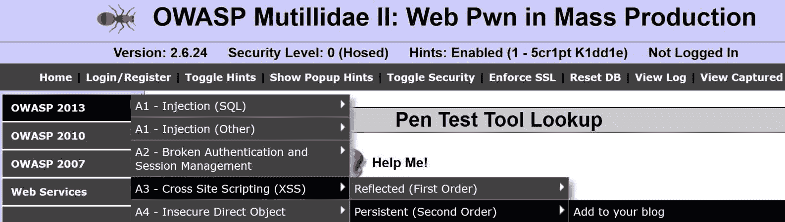

2.  在文本区域放置一些措辞。在单击“保存博客条目”按钮之前，让我们尝试使用该条目的有效负载：

3.  切换到 Burp Proxy | Intercept 选项卡。在 Intercept（截取）按钮打开时打开 Interceptor（截取）。
4.  当代理截取器暂停请求时，在您添加到博客的措辞之后立即插入新的有效负载``：

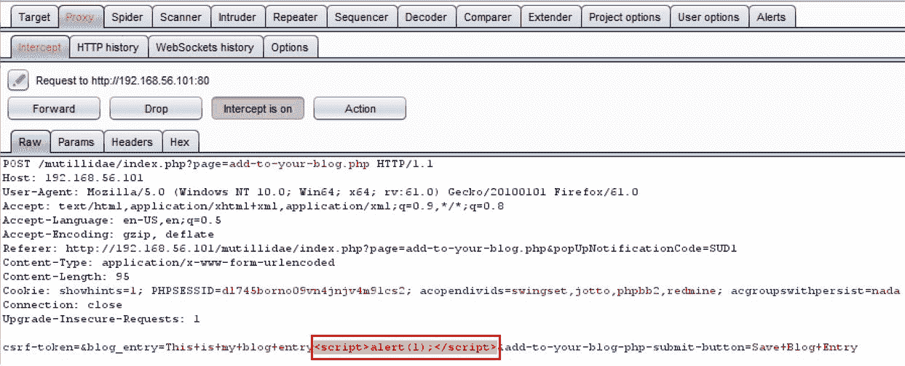

5.  单击“前进”按钮。通过切换到 Intercept（截取）处于关闭状态来关闭拦截器。
6.  返回 Firefox 浏览器并查看弹出的警报框：

7.  单击“确定”按钮关闭弹出窗口。重新加载页面，您将再次看到警报弹出窗口。这是因为恶意脚本已成为页面的永久部分。您已成功为存储的 XSS 漏洞展示了一个**概念验证**（**PoC**）！

# 它是如何工作的。。。

发生存储或持久 XSS 是因为应用程序不仅忽略了对输入进行清理，而且还将输入存储在数据库中。因此，当重新加载页面并填充数据库数据时，恶意脚本将与该数据一起执行。

# HTTP 动词篡改测试

HTTP 请求可以包括 GET 和 POST 之外的方法。作为渗透测试人员，确定 web 服务器允许哪些其他 HTTP 谓词（即方法）非常重要。对其他动词的支持可能会泄露敏感信息（例如，跟踪）或允许危险地调用应用程序代码（例如，删除）。让我们看看 Burp 如何帮助测试 HTTP 动词篡改。

# 准备

使用 OWASP Mutillidae II，让我们确定应用程序是否允许 GET 和 POST 之外的 HTTP 谓词。

# 怎么做。。。

1.  导航到 OWASP Mutillidae II 的主页。
2.  切换到 Burp Proxy | HTTP history，查找您在浏览 Mutillidae 主页时刚刚创建的 HTTP 请求。注意，使用的方法是 GET。右键单击并向入侵者发送请求：

3.  在入侵者|位置选项卡中，清除所有建议的有效负载标记。突出显示`GET`动词，然后单击 Add$按钮在动词周围放置有效负载标记：

4.  在入侵者|有效载荷选项卡中，将以下值添加到有效载荷选项[简单列表]文本框中：
    *   选择权
    *   头
    *   邮递
    *   放
    *   删去
    *   查出
    *   轨道
    *   连接
    *   PROPFIND
    *   支撑块
    *   MKCOL
    *   复制

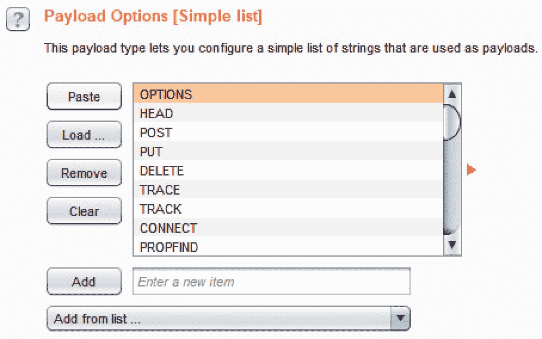

5.  取消选中有效负载页面底部的有效负载编码框，然后单击开始攻击按钮。

6.  当攻击结果表出现且攻击完成时，请注意所有返回状态代码为 200 的动词。这令人担忧，因为大多数 web 服务器不应该支持这么多动词。特别是，对跟踪和跟踪的支持将作为漏洞包括在调查结果和最终报告中：

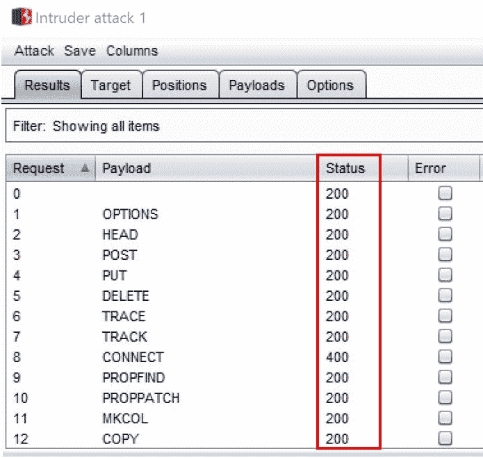

# 它是如何工作的。。。

测试 HTTP 谓词篡改包括使用不同的 HTTP 方法发送针对应用程序的请求，并分析收到的响应。测试人员需要确定是否为测试的任何谓词返回了 200 的状态代码，这表明 web 服务器允许这种谓词类型的请求。

# HTTP 参数污染测试

**HTTP 参数污染**（**HPP**是一种将多个 HTTP 参数发送到同名 web 服务器的攻击。目的是确定应用程序是否以意外的方式响应，从而允许利用。例如，在 GET 请求中，可以通过以下方式向查询字符串添加其他参数：`“&name=value”`-其中名称是应用程序代码已知的重复参数名称。同样，通过复制 POST 正文数据中的参数名称，可以对 POST 请求执行 HPP 攻击。

# 准备

使用 OWASP Mutillidae II，让我们确定应用程序是否允许 HPP 攻击。

# 怎么做。。。

1.  从 OWASP Mutilliae II 菜单中，通过导航至 OWASP 2013 | A1-注射（其他）| HTTP 参数污染|投票问题选择登录：

2.  从单选按钮中选择一个工具，添加您的姓名首字母，然后单击提交投票按钮：

3.  切换到 Burp Proxy | HTTP history 选项卡，并从 User Poll 页面查找刚刚执行的请求。注意名为`choice`的参数。此参数的值为 Nmap。右键单击并将此请求发送到中继器：

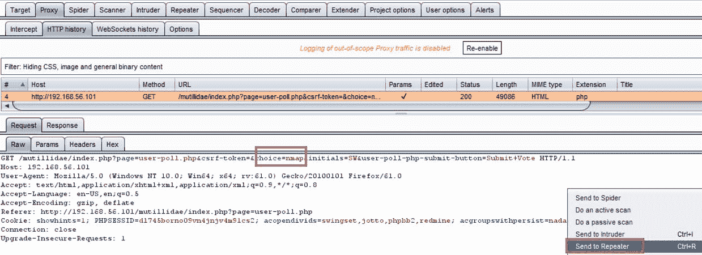

4.  切换到 Burp Repeater 并将另一个同名参数添加到查询字符串中。让我们从用户轮询列表中选择另一个工具，并将其附加到查询字符串中，例如，`“&choice=tcpdump”`。单击“转到”发送请求：

5.  检查响应。应用程序代码接受哪种选择？通过搜索`Your choice was`字符串很容易找到。显然，duplicate choice 参数值是应用程序代码在用户投票中接受计算的值：

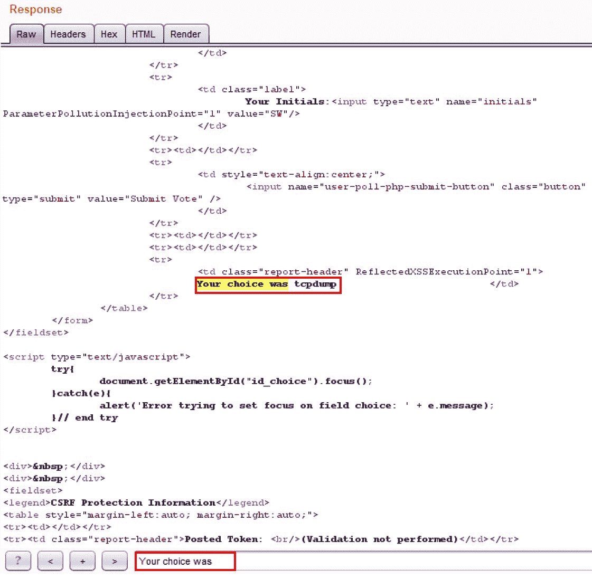

# 它是如何工作的。。。

当将应用程序代码传递到函数中时，无法对照多个同名参数进行检查。结果是，应用程序通常根据提供的最后一个参数匹配进行操作。这可能会导致奇怪的行为和意外的结果。

# SQL 注入测试

SQL 注入攻击涉及攻击者向数据库提供输入，该数据库在未经任何验证或清理的情况下被接收和使用。其结果是泄露敏感数据、修改数据，甚至绕过身份验证机制。

# 准备

使用 OWASP Mutillidae II 登录页面，我们来确定应用程序是否容易受到**SQL 注入**（**SQLi**攻击。

# 怎么做。。。

1.  从 OWASP Mutilliae II 菜单中，通过导航至 OWASP 2013 | A1 注入（SQL）| SQLi–绕过身份验证|登录选择登录：

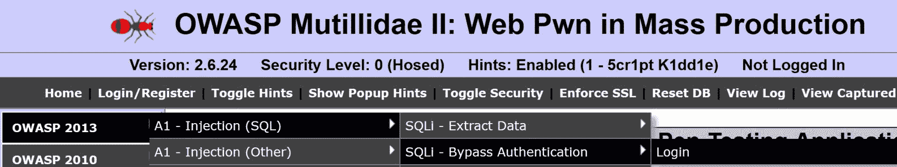

2.  在登录屏幕上，将无效凭证放入`username`和`password`文本框中。例如，`username`是`tester`，而`password`是`tester`。在单击登录按钮之前，让我们打开 Proxy | Interceptor。
3.  切换到 Burp Proxy | Intercept 选项卡。通过切换到 Intercept is on（截取打开），打开拦截器。

4.  当代理截取器暂停请求时，在用户名参数中插入新的有效负载`' or 1=1--<space>`，然后单击登录按钮：

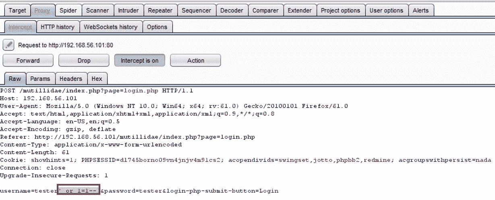

5.  单击“前进”按钮。通过切换到 Intercept（截取）处于关闭状态来关闭拦截器。
6.  返回 Firefox 浏览器，注意您现在以管理员身份登录！

# 它是如何工作的。。。

数据库中不存在 tester 帐户；然而，`' or 1=1--<space>`负载导致绕过身份验证机制，因为 SQL 代码基于未初始化的用户输入构造查询。admin 帐户是数据库中创建的第一个帐户，因此数据库默认为该帐户。

# 还有更多。。。

我们在 Burp 入侵者中使用了 wfuzz 中的 SQLi 单词列表来测试同一用户名字段中的许多不同有效负载。检查结果表中每个攻击的响应，以确定负载是否成功执行了 SQL 注入。

SQL 注入有效负载的构造需要一些后端数据库知识和所需的特定语法。

# 命令注入测试

命令注入涉及攻击者试图在 HTTP 请求中调用通常在终端会话中执行的系统命令。许多 web 应用程序允许系统命令通过 UI 进行故障排除。web 渗透测试人员必须测试网页是否允许系统上通常应限制的进一步命令。

# 准备

对于此配方，您需要 Unix 命令的 SecLists 有效负载：

*   SecLists master | Fuzzing |`FUZZDB_UnixAttacks.txt`
    *   从 GitHub 下载：[https://github.com/danielmiessler/SecLists](https://github.com/danielmiessler/SecLists)

使用 OWASP Mutillidae II DNS 查找页面，确定应用程序是否容易受到命令注入攻击。

# 怎么做。。。

1.  从 OWASP Mutilliae II 菜单中，导航至 OWASP 2013 | A1 注入（其他）|命令注入| DNS 查找，选择 DNS 查找：

2.  在 DNS 查找页面上，在文本框中键入 IP 地址`127.0.0.1`，然后单击查找 DNS 按钮：

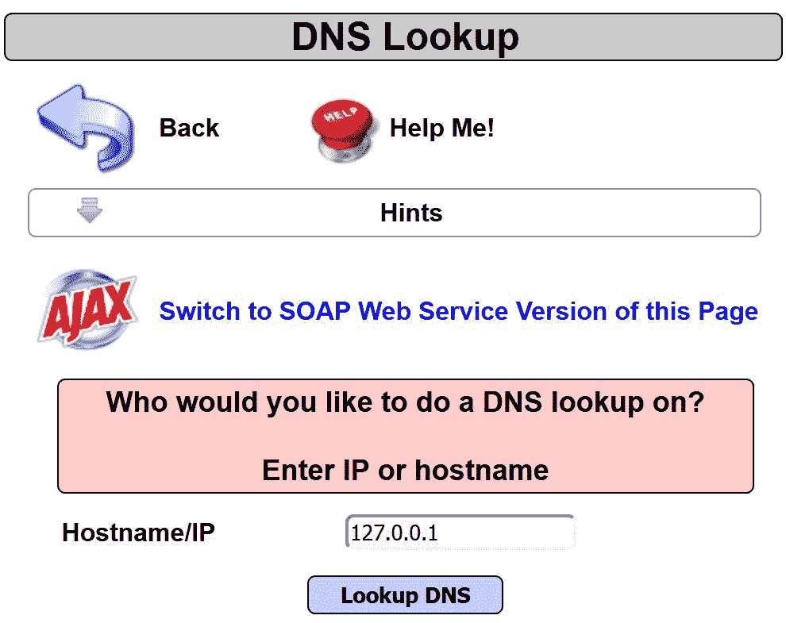

3.  切换到 Burp Proxy | HTTP history 选项卡，查找刚才执行的请求。右键单击发送到入侵者：

4.  在入侵者|位置选项卡中，使用 clear$按钮清除所有建议的有效负载标记。在`target_host`参数中，将管道符号（`|`紧跟在`127.0.0.1`IP 地址之后。在管道符号后，放置一个`X`。突出显示`X`并单击添加$按钮，用有效负载标记将`X`包装起来：

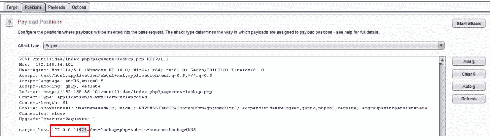

5.  在入侵者有效载荷选项卡中，单击载荷按钮。浏览至从 GitHub 下载 SecList 主单词列表的位置。导航到`FUZZDB_UnixAttacks.txt`单词列表的位置，并使用以下内容填充有效负载选项[简单列表]框：SecLists master | Fuzzing |`FUZZDB_UnixAttacks.txt`

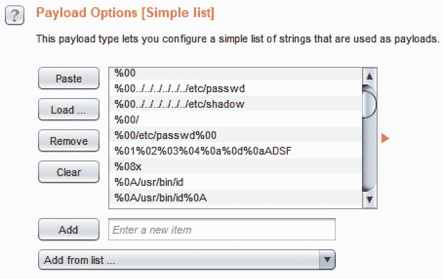

6.  取消选中有效负载选项卡页面底部的有效负载编码框，然后单击开始攻击按钮。
7.  允许攻击继续，直到达到有效载荷`50`。通过负载`45`左右的“渲染”选项卡注意响应。我们能够在操作系统上执行命令，如`id`，在网页上显示命令的结果：

# 它是如何工作的。。。

未能根据可接受的系统命令列表定义和验证用户输入可能导致命令注入漏洞。在这种情况下，应用程序代码不限制通过 UI 可用的系统命令，允许在操作系统上查看和执行应受到限制的命令。