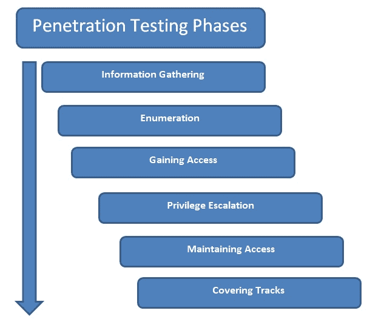
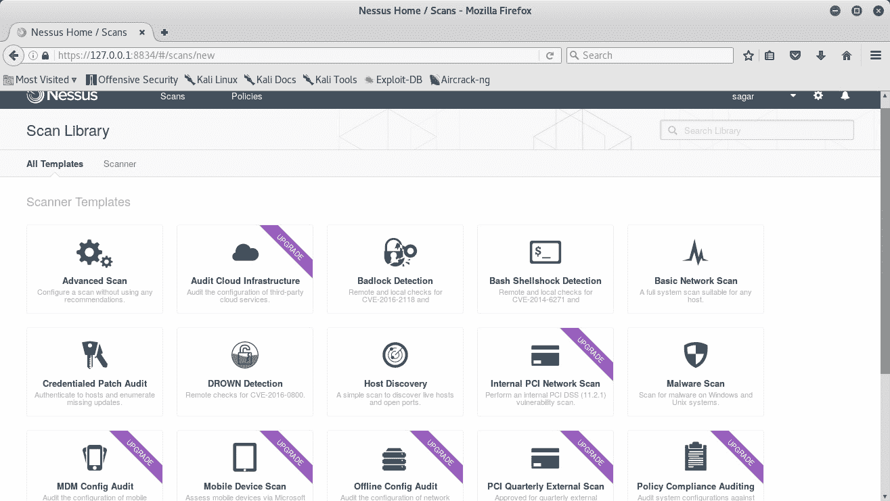

# Metasploit 和支持工具简介

在深入研究元模型框架的各个方面之前，让我们先为一些绝对的基础打下坚实的基础。在本章中，我们将从概念上理解渗透测试的全部内容，以及 Metasploit 框架的确切位置。我们还将浏览一些增强 Metasploit 框架功能的附加工具。在本章中，我们将介绍以下主题：

*   渗透测试的重要性
*   区分脆弱性评估和渗透测试
*   需要一个渗透测试框架
*   Metasploit 简介
*   在渗透测试的所有阶段了解 Metasploit 的适用性
*   介绍有助于扩展 Metasploit 功能的支持工具

# 渗透测试的重要性

十多年来，技术的使用呈指数级增长。几乎所有的企业都部分或完全依赖于技术的使用。从比特币到云，再到物联网（**物联网**），新技术每天都在涌现。虽然这些技术完全改变了我们做事的方式，但它们也带来了威胁。攻击者发现新的和创新的方式来操纵这些技术的乐趣和利润！这是全世界数千个组织和企业关注的问题。世界各地的组织都非常关心如何确保数据的安全。保护数据当然很重要，但是，测试是否有足够的保护机制发挥作用也同样重要。保护机制可能会失败，因此在有人真正利用它们之前对它们进行测试是一项具有挑战性的任务。话虽如此，脆弱性评估和渗透测试已经变得非常重要，现在已被琐碎地纳入所有合规计划。通过以正确的方式进行漏洞评估和渗透测试，组织可以确保他们已经实施了正确的安全控制，并且按照预期运行！

# 脆弱性评估与渗透测试

脆弱性评估和渗透测试是最常用的两个词，经常互换使用。然而，了解两者之间的区别很重要。为了理解确切的差异，让我们考虑一个真实的场景：

小偷打算抢劫房子。为了继续他的抢劫计划，他决定侦察他的抢劫目标。他随意地参观（他打算抢劫的）房子，并试图确定有什么安全措施。他注意到房子后面有一扇窗户经常开着，很容易破门而入。按照我们的说法，小偷只是进行了一次脆弱性评估。现在，几天后，小偷实际上又来到了房子，并通过他在侦察阶段发现的背面窗户进入了房子。在本案中，窃贼以抢劫为目的，对其目标房屋进行了实际渗透。

这正是我们在计算系统和网络方面所能涉及到的。首先可以对目标进行脆弱性评估，以评估系统中的整体弱点，然后执行计划的渗透测试，以实际检查目标是否脆弱。如果不进行漏洞评估，就不可能计划和执行实际的渗透。

虽然大多数脆弱性评估本质上是非侵入性的，但如果不以受控方式进行渗透测试，可能会对目标造成损害。根据特定的法规遵从性需求，一些组织选择仅执行漏洞评估，而其他组织则继续执行渗透测试。

# 对渗透测试框架的需求

渗透测试不仅仅是针对您的目标运行一组自动化工具。这是一个涉及多个阶段的完整过程，每个阶段对项目的成功都同样重要。现在，为了在渗透测试的所有阶段执行所有任务，我们需要使用各种不同的工具，并且可能需要手动执行一些任务。然后，在最后，我们需要将这么多不同工具的结果结合在一起，以便生成一份有意义的报告。这当然是一项艰巨的任务。如果一个工具可以帮助我们执行渗透测试所需的所有任务，那么这将非常简单和省时。这种确切的需求可以通过 Metasploit 之类的框架来满足。

# Metasploit 简介

Metasploit 的诞生可以追溯到 14 年前，H.D Moore 在 2003 年使用 Perl 编写了一个便携式网络工具。到 2007 年，它被改写成 Ruby。当 Rapid7 于 2009 年收购该项目时，Metasploit 项目获得了巨大的商业推动。Metasploit 本质上是一个健壮且通用的渗透测试框架。它可以执行渗透测试生命周期中涉及的所有任务。有了 Metasploit 的使用，你真的不需要重新发明轮子！你只需要专注于核心目标；支持行动都将通过框架的各个组成部分和模块执行。此外，由于它是一个完整的框架，而不仅仅是一个应用程序，因此可以根据我们的需求进行定制和扩展。

Metasploit 无疑是渗透测试的一个非常强大的工具。然而，它肯定不是一根魔杖，可以帮助你侵入任何给定的目标系统。了解 Metasploit 的功能非常重要，这样就可以在渗透测试期间以最佳方式利用它。

虽然最初的 Metasploit 项目是开源的，但在 Rapid7 收购之后，Metasploit 的商业级版本也出现了。对于本书的范围，我们将使用*Metasploit 框架*版本。

你知道吗？Metasploit 框架有 3000 多个不同的模块可用于开发各种应用程序、产品和平台，并且这个数字正在定期增长。

# 何时使用 Metasploit？

实际上，有很多工具可用于执行与渗透测试相关的各种任务。然而，大多数工具只有一个独特的用途。与这些工具不同，Metasploit 可以在渗透测试生命周期中执行多项任务。在检查 Metasploit 在渗透测试中的确切使用之前，让我们简要概述渗透测试的各个阶段。下图显示了渗透测试生命周期的典型阶段：

渗透测试生命周期的阶段

1.  **信息收集**：虽然信息收集阶段看起来很琐碎，但它是渗透测试项目成功的最重要阶段之一。您对目标了解得越多，就越有可能找到适合您的漏洞和漏洞。因此，值得投入大量的时间和精力来收集尽可能多的关于范围内目标的信息。信息收集可分为两种类型，如下所示：
    *   **被动信息收集**：被动信息收集包括通过社交媒体和搜索引擎等公开来源收集有关目标的信息。没有与目标直接接触。
    *   **主动信息采集**：主动信息采集涉及使用端口扫描仪等专用工具获取目标系统信息。它涉及与目标系统直接联系，因此可能会有信息收集尝试被目标网络中的防火墙、IDS 或 IP 注意到。
2.  **列举**：使用主动和/或被动信息收集技术，可以初步了解目标系统/网络。更进一步，枚举允许我们知道目标系统上运行的确切服务（包括类型和版本）以及其他信息，如用户、共享和 DNS 条目。枚举为我们试图渗透的目标准备了更清晰的蓝图。
3.  **获取访问**：根据我们从信息收集和枚举阶段获得的目标蓝图，现在是时候利用目标系统中的漏洞并获取访问权限了。访问此目标系统涉及利用早期发现的一个或多个漏洞，并可能绕过目标系统中部署的安全控制（如防病毒、防火墙、IDS 和 IPS）。
4.  **权限提升**：通常，利用目标上的漏洞会限制对系统的访问。但是，我们需要对目标进行完全的根/管理员级别的访问，以便从我们的练习中获得最大的收益。这可以通过使用各种技术来升级现有用户的权限来实现。一旦成功，我们可以以最高权限完全控制系统，并可能深入目标。

5.  **维护访问**：到目前为止，为了获得对目标系统的根/管理员级访问权，我们付出了大量努力。现在，如果目标系统的管理员重新启动系统怎么办？我们所有的努力都将白费。为了避免这种情况，我们需要对目标系统进行持久访问，这样目标系统的任何重启都不会影响我们的访问。
6.  **覆盖轨道**：虽然我们确实努力利用漏洞，提升权限，并使我们的访问持久化，但我们的活动很可能触发了目标系统安全系统的警报。事件响应小组可能已经开始行动，追踪可能导致我们的所有证据。根据约定的渗透测试合同条款，我们需要清除在妥协期间上传到目标上的所有工具、漏洞和后门。

有趣的是，Metasploit 确实可以在前面列出的所有渗透测试阶段帮助我们。

下表列出了可在渗透测试所有阶段使用的各种 Metasploit 组件和模块：

| **序号** | **渗透测试阶段** | **Metasploit 的使用** |
| 1. | 信息收集 | `Auxiliary modules: portscan/syn`、`portscan/tcp, smb_version`、`db_nmap`、`scanner/ftp/ftp_version`、`gather/shodan_search` |
| 2. | 列举 | `smb/smb_enumshares`、`smb/smb_enumusers`和`smb/smb_login` |
| 3. | 获取访问权限 | 所有 Metasploit 漏洞利用和有效负载 |
| 4. | 特权升级 | `meterpreter-use priv`和`meterpreter-getsystem` |
| 5. | 维护访问权限 | `meterpreter - run persistence` |
| 6. | 覆盖轨道 | Metasploit 反取证项目 |

随着本书的阅读，我们将逐步介绍前面的所有组件和模块。

# 使用辅助工具使 Metasploit 有效且功能强大

到目前为止，我们已经看到 Metasploit 确实是一个强大的渗透测试框架。但是，如果与其他一些工具集成，它将变得更加有用。本节介绍了一些工具，这些工具增强了 Metasploit 对目标系统执行更精确穿透的能力。

# 内苏斯

Nessus 是 Tenable Network Security 的产品，是最流行的漏洞评估工具之一。它属于漏洞扫描程序类别。它非常易于使用，并且可以快速发现目标系统中的基础架构级漏洞。一旦 Nessus 告诉我们目标系统上存在哪些漏洞，我们就可以将这些漏洞提供给 Metasploit，看看它们是否可以被真正利用。

其官方网站为[https://www.tenable.com/](https://www.tenable.com/) 。下图显示了 Nessus 主页：

Nessus 启动漏洞评估的 web 界面

以下是 Nessus 基于操作系统的不同安装步骤：

*   **在 Windows**上安装：
    1.  导航到 URL[https://www.tenable.com/products/nessus/select-your-operating-system.](https://www.tenable.com/products/nessus/select-your-operating-system)
    2.  在 Microsoft Windows 类别下，选择适当的版本（32 位/64 位）。
    3.  下载并安装`msi`文件。
    4.  打开浏览器并导航至 URL[https://localhost:8834/.](https://localhost:8834/)
    5.  设置新用户名和密码以访问 Nessus 控制台。
    6.  要进行注册，请单击“注册此扫描仪”选项。
    7.  访问时[http://www.tenable.com/products/nessus/nessus-plugins/obtain-an-activation-code](http://www.tenable.com/products/nessus/nessus-plugins/obtain-an-activation-code) ，选择 Nessus Home 并输入您的注册详细信息。
    8.  输入您在电子邮件中收到的注册码。
*   **在 Linux 上安装（基于 Debian）：**
    1.  导航到 URL[https://www.tenable.com/products/nessus/select-your-operating-system.](https://www.tenable.com/products/nessus/select-your-operating-system)
    2.  在 Linux 类别 Debian 6,7,8/Kali Linux 1 下，选择适当的版本（32 位/AMD64）。
    3.  下载文件。
    4.  打开终端并浏览到下载安装程序（`.deb`文件的文件夹。
    5.  键入命令`dpkg -i <name_of_installer>.deb`。
    6.  打开浏览器并导航至 URL[https://localhost:8834/.](https://localhost:8834/)
    7.  设置新用户名和密码以访问 Nessus 控制台。
    8.  要进行注册，请单击“注册此扫描仪”选项。
    9.  访问时[http://www.tenable.com/products/nessus/nessus-plugins/obtain-an-activation-code](http://www.tenable.com/products/nessus/nessus-plugins/obtain-an-activation-code) ，选择 Nessus Home 并输入您的注册详细信息。
    10.  输入您在电子邮件中收到的注册码。

# NMAP

NMAP（网络映射器的缩写）是一个事实上的网络信息收集工具。它属于信息收集和枚举类别。乍一看，它似乎是一个非常小和简单的工具。然而，它是如此全面，以至于一本完整的书可以专门介绍如何根据我们的需求调优和配置 NMAP。NMAP 可以让我们快速了解哪些端口是开放的，哪些服务正在目标网络中运行。可以将此提要提供给 Metasploit 以供进一步操作。虽然关于 NMAP 的详细讨论超出了本书的范围，但我们肯定会在后面的章节中介绍 NMAP 的所有重要方面。

其官方网站为[https://nmap.org/.](https://nmap.org/) 以下屏幕截图显示了 NMAP 扫描示例：

使用命令行界面的 NMAP 扫描示例

虽然访问 NMAP 的最常见方式是通过命令行，但 NMAP 还有一个称为 Zenmap 的图形界面，它是 NMAP 引擎上的一个简化界面，如下所示：

用于 NMAP 的 Zenmap 图形用户界面（GUI）

以下是 NMAP 基于操作系统的不同安装步骤：

*   **Windows 上的安装：**
    1.  导航到站点[https://nmap.org/download.html.](https://nmap.org/download.html)
    2.  在 Microsoft Windows 二进制文件部分下，选择最新版本（`.exe`文件）。
    3.  将下载的文件与 WinPCAP 一起安装（如果尚未安装）。

WinPCAP 是运行 NMAP、Nessus 和 Wireshark 等工具所需的程序。它包含一组库，允许其他应用程序捕获和传输网络数据包。

*   **Linux 安装（基于 Debian）：**NMAP 默认安装在 Kali Linux 中；但是，如果未安装，可以使用以下命令进行安装：

`root@kali:~#apt-get install nmap`

# w3af

w3af 是一个开源的 web 应用程序安全扫描工具。它属于 web 应用程序安全扫描程序类别。它可以快速扫描目标 web 应用程序以查找常见的 web 应用程序漏洞，包括 OWASP 前 10 个漏洞。w3af 还可以有效地与 Metasploit 集成，使其功能更加强大。

其官方网站为[http://w3af.org/.](http://w3af.org/) 我们可以在下图中看到用于扫描 web 应用程序漏洞的 w3af 控制台：

用于扫描 web 应用程序漏洞的 w3af 控制台

以下是 w3af 的各种基于操作系统的安装步骤：

*   **Windows 上的安装：**w3af 不适用于 Windows 平台
*   **Linux 安装（基于 Debian）：**w3af 默认安装在 Kali Linux 上；但是，如果未安装，可以使用以下命令进行安装：

`root@kali:~# apt-get install w3af`

# 阿米蒂奇

Armitage 是一个在后端使用 Metasploit 的漏洞利用自动化框架。它属于利用自动化类别。它提供了一个易于使用的用户界面，用于查找网络中的主机、扫描、枚举、查找漏洞，以及使用 Metasploit 漏洞和有效负载利用漏洞。我们将在本书后面详细介绍阿米蒂奇。

其官方网站为[http://www.fastandeasyhacking.com/index.html.](http://www.fastandeasyhacking.com/index.html) [我们可以在下面的屏幕截图中看到用于漏洞攻击自动化的 Armitage 控制台：](http://w3af.org/)

用于利用自动化的 Armitage 控制台。

以下是 Armitage 基于操作系统的各种安装步骤：

*   **Windows 上安装：**Windows 上不支持 Armitage
*   **Linux 安装（基于 Debian）：**Armitage 默认安装在 Kali Linux 上；但是，如果未安装，可以使用以下命令进行安装：

`root@kali:~# apt-get install armitage`

设置和运行 Armitage 需要 PostgreSQL、Metasploit 和 Java。但是，它们已经安装在 Kali Linux 系统上。

# 总结

现在我们已经对 Metasploit 的内容、它在渗透测试中的适用性以及支持工具有了一个高层次的概述，我们将在下一章浏览 Metasploit 的安装和环境设置。

# 练习

您可以尝试以下练习：

*   访问 Metasploit 的官方网站，尝试了解 Metasploit 不同版本的差异
*   尝试探索 Nessus 和 NMAP 在渗透测试期间如何帮助我们的更多信息。