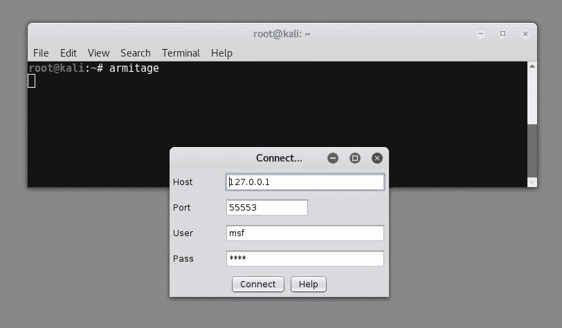

# 九、将 Armitage 用于网络攻击管理

到目前为止，在本书中，您已经学习了在渗透测试生命周期的所有阶段使用 Metasploit 的各种基本和高级技术。我们已经使用 Metasploit 命令行界面`msfconsole`执行了所有这些操作。既然我们已经熟悉了使用`msfconsole`，那么让我们继续使用一个图形界面，它将使我们的渗透测试任务更加容易。在本章中，我们将介绍以下主题：

*   Armitage简介
*   启动Armitage控制台
*   扫描和枚举
*   寻找合适的攻击
*   利用目标

# Armitage是什么？

简单来说，Armitage 只是一个 GUI 工具，用于执行和管理通过`msfconsole`本来可以执行的所有任务。

Armitage 帮助可视化目标，自动推荐合适的利用，并在框架中公开高级的利用后功能。

记住，Armitage 在其后端使用 Metasploit；因此，为了使用 Armitage，您需要在系统上有一个正在运行的 Metasploit 实例。Armitage 不仅与 Metasploit 集成，还与其他工具（如 NMAP）集成，用于高级端口扫描和枚举。

Armitage 预装在默认的 Kali Linux 安装上。

# 启动 Armitage 控制台

在实际启动 Armitage 控制台之前，作为先决条件，首先需要启动`postgresql`服务和 Metasploit 服务，如以下屏幕截图所示：

一旦 postgresql 和 Metasploit 服务启动并运行，我们可以通过在命令 shell 上键入`armitage`来启动 Armitage 控制台，如以下屏幕截图所示：

初始启动时，`armitage`控制台出现，如下图所示：

现在 Armitage 控制台已经启动并运行，让我们添加希望攻击的主机。要添加新主机，请单击主机菜单，然后选择添加主机选项。您可以为每行添加一台主机或多台主机，如以下屏幕截图所示：

# 扫描和枚举

现在我们已经向 Armitage 控制台添加了一个目标主机，我们将执行一个快速端口扫描，以查看哪些端口在此处打开。要执行端口扫描，右键单击主机并选择扫描选项，如以下屏幕截图所示。这将在 Armitage 控制台的底部窗格中列出目标系统上所有打开的端口：

正如我们前面所看到的，Armitage 还与 NMAP 很好地集成。现在，我们将对目标执行 NMAP 扫描，以枚举服务并检测远程操作系统的版本，如下面的屏幕截图所示。要启动 NMAP 扫描，请单击主机选项，选择 NMAP 扫描，然后选择快速扫描（OS 检测）选项：

一旦 NMAP 扫描完成，您就会注意到目标主机上的 Linux 图标。

# 查找并发起攻击

在前面的部分中，我们向 Armitage 控制台添加了一个主机，并使用 NMAP 对其执行端口扫描和枚举。现在，我们知道它运行的是基于 Debian 的 Linux 系统。下一步是找到与目标主机匹配的所有可能攻击。要获取所有适用的攻击，请选择攻击菜单并单击查找攻击。现在，Armitage 控制台将查询后端数据库，查找我们在前面的枚举过程中发现的针对开放端口的所有可能的匹配漏洞，如以下屏幕截图所示：

一旦 Armitage 控制台完成查询可能的漏洞，您可以通过右键单击主机并选择攻击菜单来查看适用漏洞的列表。在这种情况下，我们将尝试利用`postgresql`漏洞，如以下屏幕截图所示：

在选择攻击类型为 PostgreSQL for Linux Payload Execution 时，我们将看到以下屏幕截图中所示的几个利用漏洞选项。我们可以将其保留为`default`，然后单击启动按钮：

我们一发动攻击，攻击就被执行了。请注意主机图标中的更改，如下面的屏幕截图所示。主机已成功被破坏：

现在，我们的主机已被破坏，我们的系统上有一个反向连接。我们可以进一步与它进行交互，上传任何文件和有效载荷，或者使用任何攻击后模块。为此，只需右键单击受损主机，选择 Shell 1 选项，然后选择 Interact 选项，如以下屏幕截图所示：

为了与受损主机进行交互，在 Armitage 控制台的底部窗格中打开了一个名为“Shell 1”的新选项卡，如以下屏幕截图所示。从这里，我们可以在受损目标上远程执行所有 Linux 命令：

# 总结

在本章中，您熟悉了在后端使用 Metasploit 使用 Armitage 工具进行网络攻击管理。在一次对多个目标执行渗透测试时，Armitage 工具绝对可以派上用场并节省大量时间。在下一章和最后一章中，我们将学习如何通过添加自定义漏洞来进一步扩展 Metasploit 框架。

# 练习

尝试详细研究 Armitage 的各种功能，并使用它来破坏任何目标 Windows 主机。