# 使用 Metasploit 测试服务

现在，让我们谈谈测试各种专门服务。在您作为渗透测试人员的职业生涯中，您可能会遇到一个可测试的环境，该环境只需要在数据库、VOIP 或 SCADA 等服务中执行测试。在本章中，我们将研究在对这些服务进行渗透测试时要使用的各种开发策略。在本章中，我们将介绍以下几点：

*   了解 SCADA 开发
*   ICS 的基本原理及其批判性
*   执行数据库渗透测试
*   测试 VOIP 服务

基于服务的渗透测试需要敏锐的技能和对我们能够成功利用的服务的良好理解。因此，在本章中，我们将研究在面向服务的渗透测试中可能面临的理论和实践挑战。

# SCADA 系统测试基础

**监控和数据采集**（**SCADA**）是一个由软件和硬件组成的系统，用于控制大坝、电站、炼油厂、大型服务器控制服务等的活动。

SCADA 系统是为高度特定的任务而构建的，如控制调度水位、控制输气管线、控制电网以管理特定城市的电力以及各种其他操作。

# 集成电路及其元件的基本原理

SCADA 系统是**工业控制系统**（**ICS**系统），用于关键环境中，或在出现任何问题时危及生命的情况下使用。工业控制系统是负责控制各种过程的系统，如按一定比例混合两种化学品、在特定环境中加入二氧化碳、在锅炉中加入适量水等。

此类 SCADA 系统的组件如下所示：

| **组件** | **使用** |
| **远程终端单元**（**RTU**） | RTU 是将模拟测量值转换为数字信息的设备。此外，最广泛使用的通信协议是**ModBus****。** |
| **可编程逻辑控制器**（**PLC**） | PLC 与 I/O 服务器和实时操作系统集成；它的工作原理与 RTU 完全相同。它还使用 FTP 和 SSH 等协议。 |
| **人机界面**（**人机界面** | HMI 是环境的图形表示，环境处于观察状态或由 SCADA 系统控制。HMI 是 GUI 界面，也是攻击者利用的区域之一。 |
| **智能电子设备**（**IED** | IED 是一种微芯片，或者更具体地说是一种控制器，它可以发送命令来执行特定操作，例如在特定量的特定物质与另一种物质混合后关闭阀门。 |

# ICS-SCADA 的意义

ICS 系统非常关键，如果将其控制权交给错误的人，可能会发生灾难性的情况。试想一下，当一条输气管线的 ICS 控制被一个恶意参与者入侵时，我们所能想到的不仅仅是拒绝服务；某些 SCADA 系统的损坏甚至可能导致人员伤亡。你可能看过电影*Die Hard 4.0*，在这部电影中，黑客将输气管道重定向到特定的加油站看起来很酷，而交通混乱似乎是一种乐趣。然而，在现实中，当出现这种情况时，会对财产造成严重损害，并可能造成生命损失。

正如我们过去所看到的，随着**Stuxnet 蠕虫**的出现，有关 ICS 和 SCADA 系统安全性的对话遭到了严重破坏。让我们再进一步讨论如何进入 SCADA 系统或测试它们，以便我们能够为更好的未来提供保障。

# 利用 SCADA 服务器中的人机界面

在本节中，我们将讨论如何测试 SCADA 系统的安全性。我们有很多可以测试 SCADA 系统的框架，但考虑到所有这些框架，我们将超出本书的范围。因此，为了简单起见，我们将继续讨论仅使用 Metasploit 进行的 SCADA HMI 开发。

# SCADA 测试基础

让我们了解利用 SCADA 系统的基础知识。SCADA 系统可能会因 Metasploit 中最近添加到框架中的各种漏洞而受损。internet 上的某些 SCADA 服务器可能具有默认用户名和密码。然而，由于安全性方面的进步，找到一个具有默认凭据的证书是非常不可能的，但这可能是一种可能性。

流行的互联网扫描仪网站，如[https://shodan.io](https://shodan.io) 是查找面向 internet 的 SCADA 服务器的优秀资源；让我们看看将 Shodan 与 Metasploit 集成需要执行的步骤：

首先，我们需要在[上创建一个账户 https://shodan.io](https://shodan.io) 网站：

1.  注册后，我们只需在帐户中查找 API 密钥即可。通过获取 API 密钥，我们可以在 Metasploit 中搜索各种服务。
2.  启动 Metasploit 并加载`auxiliary/gather/shodan_search`模块。
3.  将模块中的`SHODAN_API`key 选项设置为您账户的 API key。

4.  让我们通过将`QUERY`选项设置为`Rockwell`来尝试使用罗克韦尔自动化公司开发的系统查找 SCADA 服务器，如以下屏幕截图所示：

5.  我们设置了所需的`SHODAN_APIKEY`选项和`QUERY`选项，如上图所示。让我们通过运行以下模块来分析结果：

我们在互联网上发现大量系统通过罗克韦尔自动化轻松使用 Metasploit 模块运行 SCADA 服务。但是，最好不要尝试对您一无所知的网络进行任何攻击，尤其是那些您无权访问的网络。

# 基于 SCADA 的漏洞利用

最近，我们看到 SCADA 系统的利用率比过去高得多。SCADA 系统可能存在各种漏洞，如基于堆栈的溢出、整数溢出、跨站点脚本和 SQL 注入。

此外，正如我们之前所讨论的，这些脆弱性的影响可能会对生命和财产造成危险。SCADA 设备可能遭到黑客攻击的原因主要在于 SCADA 开发商和运营商粗心的编程和糟糕的操作程序。

让我们看一个 SCADA 服务的示例，并尝试使用 Metasploit 对其进行开发。在以下情况下，我们将使用 Metasploit 开发基于 Windows XP 系统的 DATAC RealWin SCADA Server 2.0 系统。

该服务在端口`912`上运行，该端口在`sprintf`C 函数中容易发生缓冲区溢出。在 DATAC RealWin SCADA 服务器的源代码中使用`sprintf`功能，以显示根据用户输入构建的特定字符串。当攻击者滥用此易受攻击的功能时，可能会导致目标系统完全受损。

让我们尝试使用 Metasploit 利用 DATAC RealWin SCADA Server 2.0，使用`exploit/windows/scada/realwin_scpc_initialize`漏洞，如下所示：

我们将 RHOST 设置为`192.168.10.108`，有效载荷设置为`windows/meterpreter/bind_tcp`。DATAC RealWin SCADA 的默认端口为`912`。让我们利用目标并检查是否可以利用该漏洞：

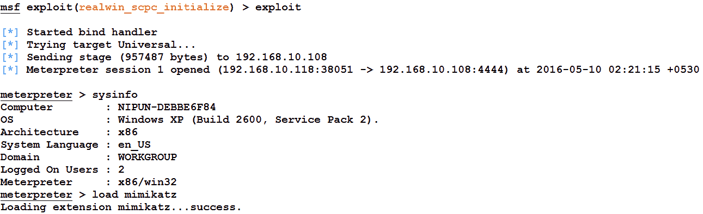

答对 了我们成功地攻击了目标。让我们加载`mimikatz`模块，以明文形式查找系统密码，如下所示：

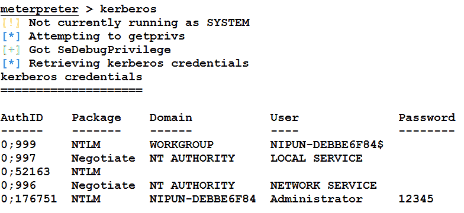

我们可以看到，通过发出`kerberos`命令，我们可以在明文中找到密码。我们将在本书后半部分进一步讨论`mimikatz`功能和附加库。

# 攻击 Modbus 协议

大多数 SCADA 服务器位于内部/气隙网络上。然而，考虑攻击者已经获得了对 Internet 面向服务器的初始访问并从同一服务器进行枢转的可能性；他可以改变 PLC 的状态，读取和写入控制器的值，并造成严重破坏。让我们看一个例子来说明这一点，如下所示：

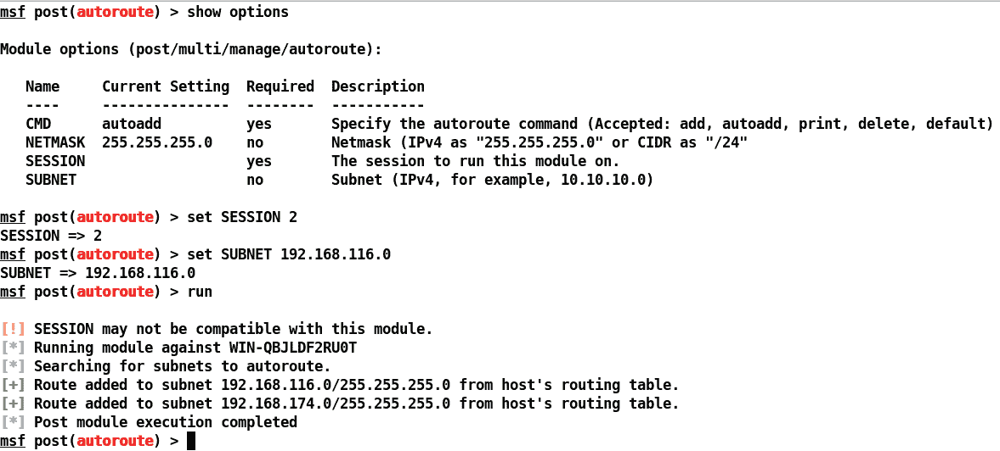

我们可以在前面的屏幕截图中看到，攻击者已经获得了对 IP 范围`192.168.174.0`上的系统的访问权限，并且已经识别并添加了到内部网络范围`192.168.116.0`的路由。

此时，攻击者将在内部网络中的主机上执行端口扫描。假设我们在内部网络上发现一个 IP 为`192.168.116.131`的系统。需要进行广泛的端口扫描，因为此处的不良做法可能会导致严重问题。让我们看看在这种情况下如何执行端口扫描：

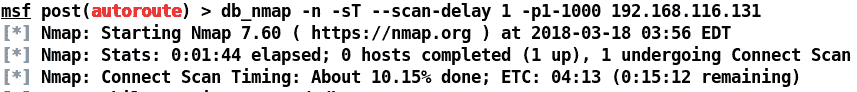

我们可以看到，前面的扫描不是常规扫描。我们使用`-n`开关禁用 DNS 解析。`-sT`开关表示 TCP 连接扫描，扫描延迟为 1 秒，这意味着将顺序扫描端口，一次扫描一个端口。Nmap 扫描产生以下结果：

端口号`502`是标准 Modbus/TCP 服务器端口，允许从 SCADA 软件与 PLC 进行通信。有趣的是，我们有一个 Metasploit`modbusclient`模块，可以与 Modbus 端口通信，并允许我们更改 PLC 中寄存器的值。让我们看一个例子：

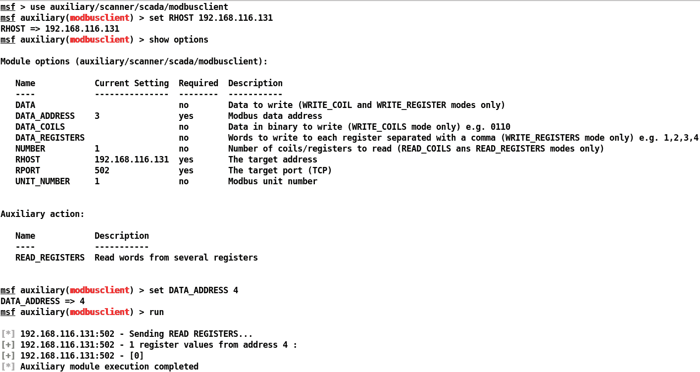

我们可以看到，辅助模块的默认操作是读取寄存器。将四个寄存器设置为`DATA_ADDRESS`将产生驻留在第四个数据寄存器中的值。我们可以看到该值为`0`。让我们在另一个寄存器上进行尝试，该寄存器位于`DATA_ADDRESS 3`：

那么，将该值设置为`3`将读取`56`作为输出，这意味着第三个数据寄存器中的值为`56`。我们可以将该值视为温度，如下图所示：

攻击者可以通过将辅助模块的操作更改为`WRITE_REGISTERS`来更改这些值，如以下屏幕截图所示：

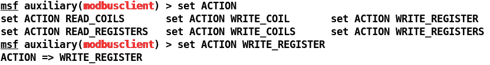

让我们看看是否可以将值写入寄存器：

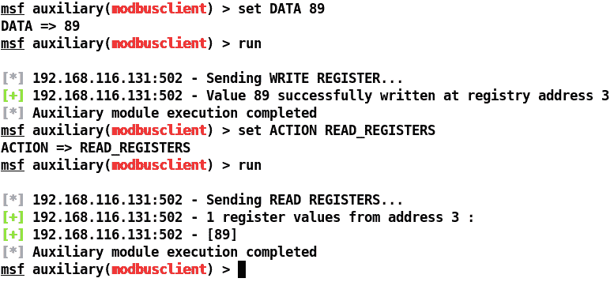

我们可以看到该值已成功更改，这也意味着 HMI 上的温度读数可能会不可避免地增加，如下图所示：

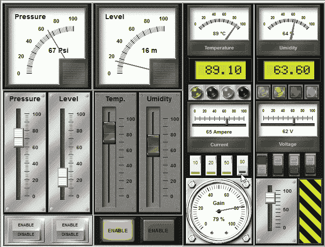

前面的示例界面仅用于说明目的，并演示 SCADA 和 ICS 系统的重要性。我们还可以通过将动作设置为`READ_COILS`来操纵线圈中的值。此外，通过如下设置`NUMBER`选项，我们可以在多个寄存器和线圈中读取/写入数据：

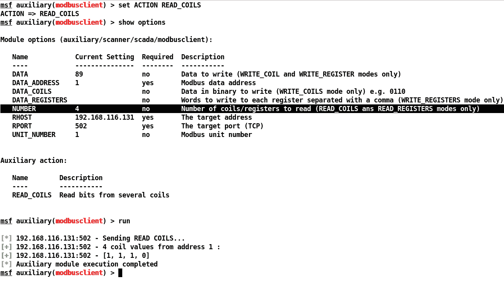

我们在 Metasploit 中有很多漏洞，专门针对 SCADA 系统中的漏洞。要了解有关这些漏洞的更多信息，您可以参考网络上最重要的 SCADA 黑客攻击和安全资源：[http://www.scadahacker.com](http://www.scadahacker.com) 。您应该能够在[中的*msf scada*部分中看到许多漏洞利用 http://scadahacker.com/resources/msf-scada.html](http://scadahacker.com/resources/msf-scada.html) 。

# 保护 SCADA

确保 SCADA 网络的安全是任何在职渗透测试人员的主要目标。让我们继续下一节，学习如何安全地实现 SCADA 服务并对其施加限制。

# 实现安全的 SCADA

当 SCADA 必须实际执行时，确保其安全是一项艰巨的工作；但是，在保护 SCADA 系统时，我们可以寻找以下一些关键点：

*   密切关注与 SCADA 网络的每个连接，并检查是否有任何未经授权的尝试
*   确保在不需要时断开所有网络连接
*   实施系统供应商提供的所有安全功能
*   为内部和外部系统实施 IDPS 技术，并实施 24 小时事件监控
*   记录所有网络基础设施，并为管理员和编辑定义个人角色
*   建立 IR 团队和蓝色团队，定期识别攻击向量

# 限制网络

在发生与未授权访问、不必要的开放服务等相关的攻击时，可以对网络进行监管。通过删除或卸载服务来实施补救措施是抵御各种 SCADA 攻击的最佳防御措施。

SCADA 系统主要在 Windows XP 机箱上实现，这大大增加了攻击面。如果您正在部署 SCADA 系统，请确保您的 Windows 机箱是最新的，以防止更常见的攻击。

# 数据库利用

在介绍了 SCADA 利用的基础知识之后，让我们继续测试数据库服务。在本节中，我们的主要目标是测试数据库并检查各种漏洞。数据库包含关键业务数据。因此，如果数据库管理系统中存在漏洞，则可能导致远程代码执行或整个网络受损，从而导致公司机密数据的泄露。与金融交易、医疗记录、犯罪记录、产品、销售、营销等相关的数据可能对地下社区中这些数据库的购买者有利。

为了确保数据库完全安全，我们需要开发针对各种类型的攻击测试这些服务的方法。现在，让我们开始测试数据库，看看在数据库上进行渗透测试的不同阶段。

# SQL server

微软早在 1989 年就推出了它的数据库服务器。如今，很大一部分网站运行在最新版本的 MSSQL server 上，MSSQL server 是网站的后端。但是，如果网站规模庞大或一天内处理了许多交易，那么数据库是否没有任何漏洞和问题至关重要。

在关于测试数据库的这一节中，我们将重点介绍有效测试数据库管理系统的策略。默认情况下，MSSQL 在 TCP 端口号`1433`上运行，UDP 服务在端口`1434`上运行。那么，让我们开始测试在 Windows8 上运行的 MSSQL Server 2008。

# 使用 Metasploit 模块扫描 MSSQL

让我们跳转到测试 MSSQL 服务器的特定于 Metasploit 的模块，看看使用它们可以获得什么样的信息。我们将使用的第一个辅助模块是`mssql_ping`。此模块将收集其他服务信息。

那么，让我们加载模块并按如下方式开始扫描过程：

从之前的结果可以看出，我们从扫描中获得了大量信息。Nmap 提供了一个类似的模块来扫描 MSSQL 数据库。然而，Metasploit 辅助设备在可读性方面比 Nmap 的输出具有竞争优势。让我们看看还有哪些模块可以用来测试 MSSQL 服务器。

# 强制密码

渗透测试数据库的下一步是精确地检查身份验证。Metasploit 有一个名为`mssql_login`的内置模块，我们可以使用它作为身份验证测试仪来强制执行 MSSQL 服务器数据库的用户名和密码。

让我们加载模块并分析结果：

我们运行此模块后，它会在第一步测试默认凭据，即用户名`sa`和密码为空，并发现登录成功。因此，我们可以得出结论，默认凭证仍在使用中。此外，我们必须尝试测试更多凭据，以防无法立即找到`sa`帐户。为此，我们将使用包含字典的文件名设置`USER_FILE`和`PASS_FILE`参数，以强制 DBMS 的用户名和密码：

让我们设置成功运行此模块所需的参数，即`USER_FILE`列表、`PASS_FILE`列表和`RHOSTS`，如下所示：

在目标数据库服务器上运行此模块时，我们将获得类似于以下屏幕截图的输出：

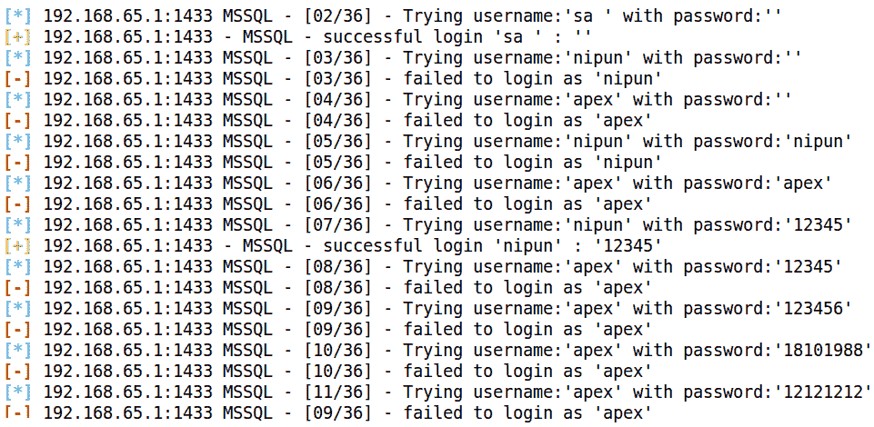

从前面的结果可以看出，我们有两个条目对应于用户在数据库中成功登录。我们找到了一个默认用户`sa`，密码为空，另一个用户`nipun`，密码为`12345`。

# 查找/捕获服务器密码

我们知道我们有两个用户：`sa`和`nipun`。让我们使用其中一个并尝试查找其他用户凭据。我们可以在`mssql_hashdump`模块的帮助下实现这一点。让我们检查它是否正常工作，并调查所有其他哈希值，如下所示：

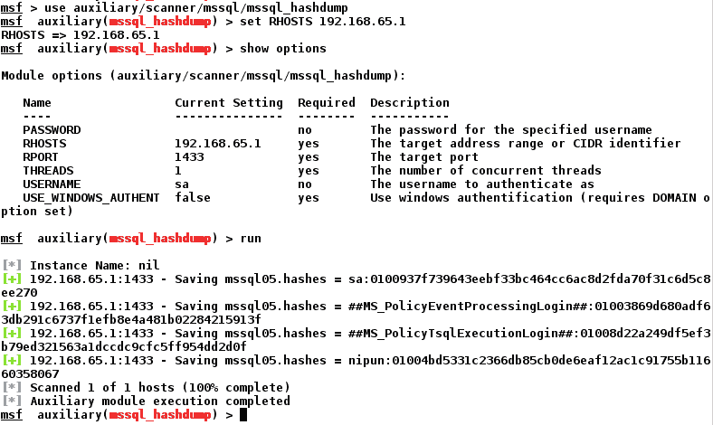

我们可以看到，我们已经获得了对数据库服务器上其他帐户的密码哈希的访问权。我们现在可以使用第三方工具破解它们，还可以提升或访问其他数据库和表。

# 浏览 SQL server

我们在上一节中找到了用户及其相应的密码。现在，让我们登录到服务器并收集有关数据库服务器的基本信息，例如存储过程、数据库的数量和名称、可以登录到数据库服务器的 Windows 组、数据库中的文件以及参数。

我们将要使用的模块是`mssql_enum`。让我们看看如何在目标数据库上运行此模块：

在运行`mssql_enum`模块后，我们将能够收集大量关于数据库服务器的信息。让我们看看它提供了什么样的信息：

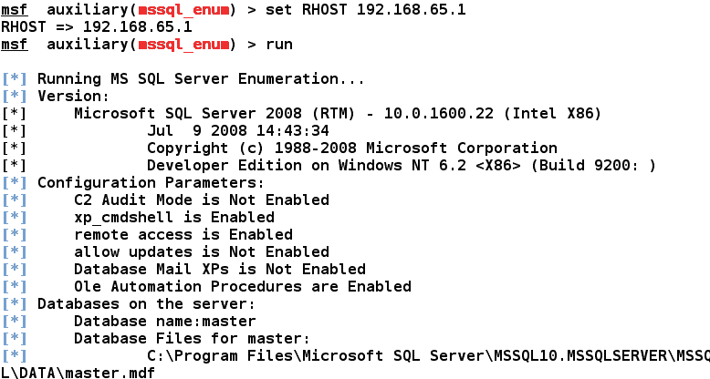

如我们所见，该模块向我们提供了几乎所有关于数据库服务器的信息，如存储过程、名称、存在的数据库数量、禁用的帐户等。

我们还将在即将到来的*重新加载 xp_cmdshell 功能*一节中看到，我们可以绕过一些已禁用的存储过程。此外，诸如`xp_cmdshell`之类的过程可能会导致整个服务器受到威胁。我们可以在前面的屏幕截图中看到服务器上启用了`xp_cmdshell`。让我们看看`mssql_enum`模块为我们提供了哪些其他信息：

运行该模块时，我们有一个存储过程列表、密码为空的帐户、数据库的窗口登录和管理员登录。

# 后开发/执行系统命令

在收集了有关目标数据库的足够信息后，让我们执行一些后期开发。为了实现后期开发，我们有两个非常方便的不同模块。第一个是`mssql_sql`，它允许我们对数据库运行 SQL 查询，第二个是`msssql_exec`，它允许我们在禁用`xp_cmdshell`过程的情况下通过启用`xp_cmdshell`过程来运行系统级命令。

# 重新加载 xp\u cmdshell 功能

`mssql_exec`模块将通过重新加载禁用的`xp_cmdshell`功能来尝试运行系统级命令。此模块要求我们将`CMD`选项设置为要执行的`system`命令。让我们看看它是如何工作的：

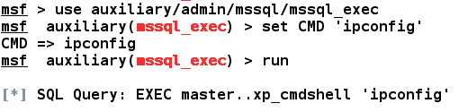

当我们运行完`mssql_exec`模块后，结果将闪烁到屏幕上，如下图所示：

结果窗口显示针对目标数据库服务器成功执行了`system`命令。

# 运行基于 SQL 的查询

我们还可以使用`mssql_sql`模块对目标数据库服务器运行基于 SQL 的查询。将`SQL`选项设置为任何有效的数据库查询都将执行它，如以下屏幕截图所示：

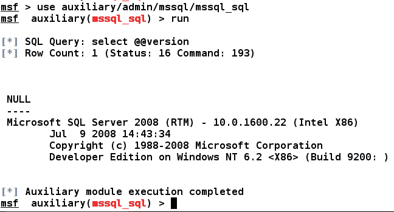

我们将`SQL`参数设置为`select @@version`。数据库服务器成功运行了查询，我们获得了数据库的版本。

因此，按照前面的步骤，我们可以使用 Metasploit 测试各种数据库的漏洞。

我的另一本书*Metasploit 训练营*（[中介绍了测试 MySQL 数据库 https://www.packtpub.com/networking-and-servers/metasploit-bootcamp](https://www.packtpub.com/networking-and-servers/metasploit-bootcamp) ；试试看。

请参阅以下资源以保护 MSSQL 数据库：
[https://www.mssqltips.com/sql-server-tip-category/19/security/](https://www.mssqltips.com/sql-server-tip-category/19/security/) 。MySQL 的

：
[http://www.hexatier.com/mysql-database-security-best-practices-2/](http://www.hexatier.com/mysql-database-security-best-practices-2/) 。

# 测试 VOIP 服务

现在，让我们重点测试支持 VOIP 的服务，并了解如何检查可能影响 VOIP 服务的各种缺陷。

# VOIP 基础知识

**互联网语音协议**（**VOIP**）与传统电话服务相比，成本更低。VOIP 在电信方面提供了比传统电话更大的灵活性，并提供了各种功能，如多个分机、来电显示服务、日志记录、每次通话记录等。多家公司已经在支持 IP 的手机上推出了其**专用交换机**（**PBX**）。

传统和现有的电话系统仍然容易通过物理访问被拦截，因此，如果攻击者改变电话线的连接并连接其发射机，他们将能够在受害者的设备上拨打和接听电话，并享受互联网和传真服务。

然而，在 VOIP 服务的情况下，我们可以在不接触电线的情况下破坏安全性。然而，如果您不了解 VOIP 服务的基本工作原理，那么攻击 VOIP 服务是一项乏味的任务。本节介绍了如何在不拦截线路的情况下在网络中破坏 VOIP。

# PBX 简介

PBX 是中小型公司提供电话服务的一种经济高效的解决方案，因为它提供了更大的灵活性以及公司客舱和楼层之间的相互通信。大型公司也可能更喜欢 PBX，因为在大型组织中，将每条电话线连接到外线变得非常麻烦。PBX 包括以下内容：

*   终止于 PBX 的电话中继线
*   一种计算机，用于管理 PBX 内和内外呼叫的切换
*   PBX 内的通信线路网络
*   操作员的控制台或总机

# VOIP 服务的类型

我们可以将 VOIP 技术分为三类。让我们看看它们是什么。

# 自托管网络

在这种类型的网络中，PBX 安装在客户端站点，并进一步连接到**互联网服务提供商**（**ISP**）。此类系统通过多个虚拟局域网向 PBX 设备发送 VOIP 业务流，然后 PBX 设备将其发送至**公共交换电话网**（**PSTN**）进行电路交换，以及互联网连接的 ISP。下图很好地演示了该网络：

# 托管服务

在托管服务类型的 VOIP 技术中，客户端没有 PBX。然而，客户端的所有设备都通过互联网连接到服务提供商的 PBX，即通过使用 IP/VPN 技术的**会话发起协议**（**SIP**线路。

让我们通过下图来了解这项技术的工作原理：

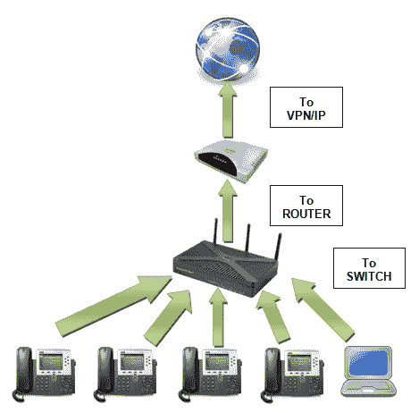

# SIP 服务提供商

互联网上的许多 SIP 服务提供商为软电话提供连接，可直接使用软电话享受 VOIP 服务。此外，我们可以使用任何客户端软电话访问 VOIP 服务，如 Xlite，如以下屏幕截图所示：

# 指纹 VOIP 服务

我们可以使用 Metasploit 内置的 SIP 扫描模块在网络上对 VOIP 设备进行指纹识别。一种常见的 SIP 扫描器是**SIP 端点扫描器**。我们可以使用此扫描仪通过从网络中的各种 SIP 设备发出选项请求来识别启用 SIP 的设备。

让我们使用`/auxiliary/scanner/sip`下的`options`辅助模块进行 VOIP 扫描，并分析结果。这里的目标是运行星号 PBX VOIP 客户端的 Windows XP 系统。我们首先加载用于通过网络扫描 SIP 服务的辅助模块，如以下屏幕截图所示：

我们可以看到，我们有很多选项可以与`auxiliary/scanner/sip/options`辅助模块一起使用。我们只需要配置`RHOSTS`选项。但是，对于大型网络，我们可以使用**无类域间路由**（**CIDR**标识符）定义 IP 范围。一旦运行，模块将开始扫描可能正在使用 SIP 服务的 IP。让我们按如下方式运行此模块：

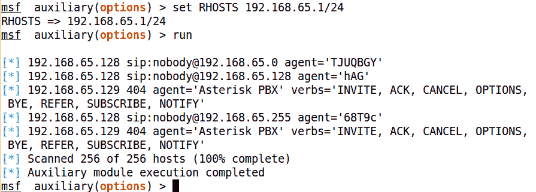

正如我们所看到的，当这个模块运行时，它返回许多与运行 SIP 服务的系统相关的信息。该信息包含名为**代理**的响应，表示 PBX 的名称和版本，以及定义 PBX 支持的请求类型的动词。因此，我们可以使用此模块收集有关网络上 SIP 服务的大量知识。

# 扫描 VOIP 服务

在找到目标支持的各种选项请求的相关信息后，现在让我们使用另一个 Metasploit 模块（即`auxiliary/scanner/sip/enumerator`）扫描并枚举 VOIP 服务的用户。此模块将检查目标范围内的 VOIP 服务，并尝试枚举其用户。让我们看看如何实现这一点：

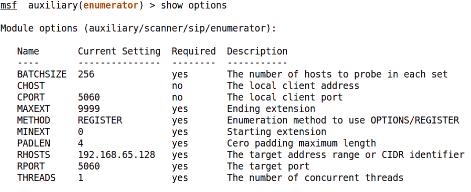

我们有前面的选项可用于此模块。我们将设置以下一些选项以成功运行此模块：

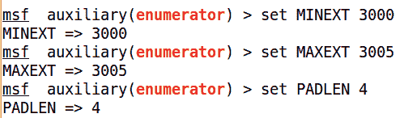

我们可以看到，我们已经设置了`MAXEXT`、`MINEXT`、`PADLEN`和`RHOSTS`选项。

在前面截图中使用的枚举器模块中，我们分别将`MINEXT`和`MAXEXT`定义为`3000`和`3005`。`MINEXT`是搜索开始的分机号码，`MAXEXT`是搜索结束的最后一个分机号码。这些选项可以设置的范围很广，例如`MINEXT`到`0`和`MAXEXT`到`9999`，以了解在分机号码`0`到`9999`上使用 VOIP 服务的各种用户。

让我们在目标范围内运行此模块，方法是将 RHOSTS 变量设置为 CIDR 值，如下所示：

将`RHOSTS`放置为`192.168.65.0/24`将扫描整个子网。现在，让我们运行这个模块，看看它显示了什么输出：

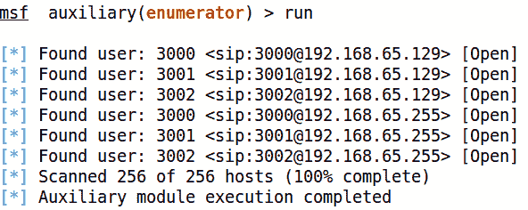

此搜索返回了许多使用 SIP 服务的用户。另外，`MAXEXT`和`MINEXT`的效果只扫描从`3000`扩展到`3005`的用户。扩展可以被认为是特定网络中某些用户的通用地址。

# 欺骗 VOIP 呼叫

在获得了关于使用 SIP 服务的各种用户的足够知识之后，让我们尝试使用 Metasploit 对用户进行假调用。当用户在 Windows XP 平台上运行 SipXphone 2.0.6.27 时，让我们使用`auxiliary/voip/sip_invite_spoof`模块向用户发送虚假邀请请求，如下所示：

我们将使用目标的 IP 地址设置`RHOSTS`选项，并将目标的`EXTENSION`设置为`4444`。让我们将`SRCADDR`设置为`192.168.1.1`，这将欺骗拨打电话的地址源。

因此，让我们按如下方式运行模块：

让我们看看受害者那边发生了什么，如下所示：

我们可以看到软电话正在响，显示呼叫方为 192.168.1.1，并显示来自 Metasploit 的预定义消息。

# 利用 VOIP

为了完全访问该系统，我们还可以尝试开发软电话软件。从前面的场景中，我们得到了目标的 IP 地址。让我们用 Metasploit 扫描并利用它。但是，Kali 操作系统中有专门的 VOIP 扫描工具，专门用于测试 VOIP 服务。以下是我们可以用来利用 VOIP 服务的工具列表：

*   Smap
*   Sipscan
*   西普萨克
*   沃邦
*   Svmap

回到开发部分，我们在 Metasploit 中有一些可以在软电话上使用的开发。让我们看一个例子。

我们将在这里开发的应用程序是 SipXphone 版本 2.0.6.27。此应用程序的界面可能类似于以下屏幕截图：

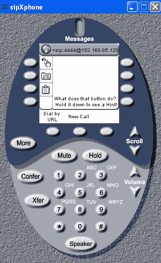

# 关于脆弱性

该漏洞存在于应用程序对`Cseq`值的处理中。发送超长字符串会导致应用程序崩溃，在大多数情况下，它会允许攻击者运行恶意代码并访问系统。

# 开发应用程序

现在，让我们利用带有 Metasploit 的 SipXphone 2.0.6.27 版应用程序。我们将在这里使用的漏洞是`exploit/windows/sip/sipxphone_cseq`。让我们将此模块加载到 Metasploit 中，并设置所需的选项：

我们需要设置`RHOST`、`LHOST`和`payload`的值。让我们按如下方式利用目标应用程序：

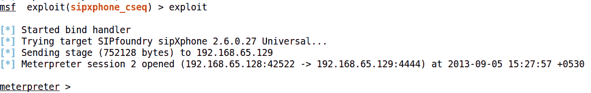

瞧！我们很快就拿到了仪表。因此，在使用 Metasploit 的有缺陷软件的情况下，利用 VOIP 是很容易的。但是，在测试 VOIP 设备和其他与服务相关的缺陷时，我们可以使用第三方工具进行有效测试。

测试 VOIP 的优秀资源位于：[http://www.viproy.com/](http://www.viproy.com/) 。

有关保护 VOIP 网络的更多信息，请参阅这些优秀指南：
[https://searchsecurity.techtarget.com/feature/Securing-VoIP-Keeping-Your-VoIP-Networks-Safe](https://searchsecurity.techtarget.com/feature/Securing-VoIP-Keeping-Your-VoIP-Networks-Safe) 和[https://www.sans.org/reading-room/whitepapers/voip/security-issues-countermeasure-voip-1701](https://www.sans.org/reading-room/whitepapers/voip/security-issues-countermeasure-voip-1701) 。

# 总结

在本章中，我们看到了一些利用和渗透测试场景，这些场景使我们能够测试各种服务，如数据库、VOIP 和 SCADA。在本章中，我们学习了 SCADA 及其基本原理。我们了解了如何获得有关数据库服务器的各种信息以及如何获得对它的完全控制。我们还了解了如何通过扫描网络中的 VOIP 客户端和欺骗 VOIP 呼叫来测试 VOIP 服务。

在继续下一章之前，您应该执行以下练习：

*   使用 Metasploit 设置和测试 MySQL、Oracle 和 PostgreSQL，并查找和开发缺失模块的模块
*   尝试自动化 Metasploit 中的 SQL 注入错误
*   如果您对 SCADA 和 ICS 感兴趣，请尝试使用武士 STFU（[http://www.samuraistfu.org/](http://www.samuraistfu.org/) ）
*   利用演示中使用的 VOIP 软件以外的至少一个 VOIP 软件进行攻击

在下一章中，我们将看到如何使用 Metasploit 执行完整的渗透测试，以及如何在 Metasploit 中集成渗透测试中使用的各种其他常用扫描工具。我们将介绍如何在对给定主题进行渗透测试时系统地进行测试。我们还将研究如何创建报告，以及这些报告中应包含或排除哪些内容。