# 安装 Kali Linux

我们到了。请加入我，开始安装 Kali Linux。我们的一些读者可能已经熟悉安装过程，甚至可能熟悉一些高级功能，如分区和网络。对于初学者和 Kali Linux 新手，我们鼓励您特别关注本章，因为我们从下载 Kali Linux 的绝对基础开始，一直到成功安装为止。

我们将在本章中介绍的主题包括：

*   软件版本
*   下载 Kali Linux
*   安装 Kali Linux
*   在 VirtualBox 中安装 Kali Linux

# 软件版本

卡莉已经在这里呆了很长时间了。Kali Linux 以前被称为 BackTrack，版本从 1 到 5，最早出现于 2015 年，并以 Kali 1.0 的形式发布。从 2016 年起，卡利根据年份命名。例如，在撰写本书时，使用的版本是 2017 年 9 月发布的 Kali 2017.2。

对于那些运行旧版本 Kali 的用户，或者在可能提供新版本 Kali Linux 的日后购买本书的用户，您可以使用本章末尾演示的`sudo apt-get update distro`命令轻松更新您的 Kali Linux 实例。

# 下载 Kali Linux

出于安全考虑，最好直接从其创建者的网站下载 Kali Linux，**攻击性安全**。主要原因是，在其他页面上下载的 Kali 可能是伪造的，或者更糟的是，感染了木马、rootkit 甚至勒索软件等恶意软件。攻击性安全还包括其网站上所有版本的 Kali 下载哈希，允许用户将其下载版本的 Kali 哈希与攻击性安全在其网站上生成和发布的内容进行比较（[https://www.kali.org](https://www.kali.org) ）。到达后，您可以单击下载链接，或通过访问[直接进入 Kali Linux 下载页面 https://www.kali.org/downloads/](https://www.kali.org/downloads/) 。

在下载页面上，我们可以看到六个可供下载的 Kali 下载版本，每个版本都有特定的类别信息：

*   *镜像名称*：指定下载的名称以及操作系统是 32 位还是 64 位。

32 位操作系统仅限于使用 4 GB 的 RAM。如果您的系统内存超过 4GB，您可能希望下载 64 位版本的 Kali Linux。

*   *下载*：**ISO**（简称**国际标准组织**）直接通过用户浏览器下载。Torrent 需要安装特殊软件才能下载。

ISO 文件（通常称为 ISO 图像）是复制数据时专门使用的数据的精确副本。

*   *大小*：以 GB 为单位的文件大小。
*   *版本*：Kali Linux 版本。
*   `*sha256sum*`：Linux 中用于生成表示现有数据的校验和或数字输出的命令，然后可以使用该命令与下载副本的校验和进行比较，以确保数据或位未被更改或篡改：

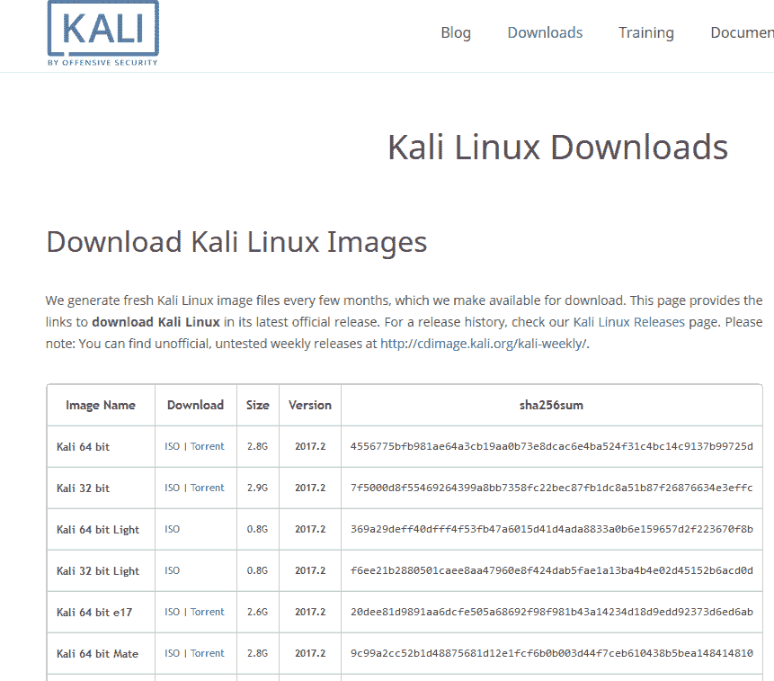

对于本书，我们将使用 Kali 64 位，下载为 ISO 图像，如下所示：

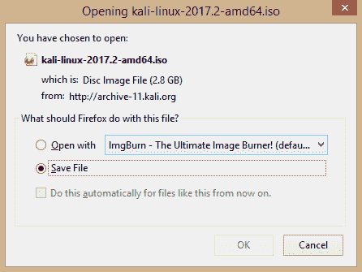

# 安装 Kali Linux

如[第 1 章](01.html)、*数字取证简介*所述，Kali Linux 既可以作为实时响应操作系统，也可以作为完整的操作系统，通过硬盘安装和运行。下载 Kali Linux 后，可以使用任何 ISO 文件刻录工具（如 ImgBurn）将 ISO 映像刻录到 DVD。DVD 可以用作实时操作系统，也可以用于将 Kali 安装到硬盘上。UNetbootin 等工具也可用于将 Kali Linux 安装到可移动存储介质，包括闪存驱动器、SD 卡或外部硬盘驱动器，具体取决于用户的偏好。

为了与本书一起使用，我建议您首先将 Kali Linux 刻录到 DVD 上，然后将 Kali 安装到新的硬盘驱动器上，从而满足取证准备的概念。在这种情况下，法医准备是指硬盘是全新的，未被触碰，因此不会以任何方式受到损害，以保持调查员和调查人员的完整性。

对于那些可能没有可用资源在全新驱动器上安装 Kali Linux 的人，还可以选择在虚拟环境中安装 Kali Linux。用户可以使用虚拟化技术（如 VMware 和 VirtualBox）在其主机内作为客户机运行 Kali Linux 操作系统。

# 在 VirtualBox 中安装 Kali Linux

VirtualBox 可以在许多平台上运行，包括 Windows、macOS、Linux 和 Solaris。在本节中，我们将**VirtualBox 5.1.28**安装到我们的主机中，并从主机中获取它。

VirtualBox 可在[找到 https://www.virtualbox.org/wiki/Downloads](https://www.virtualbox.org/wiki/Downloads) ：

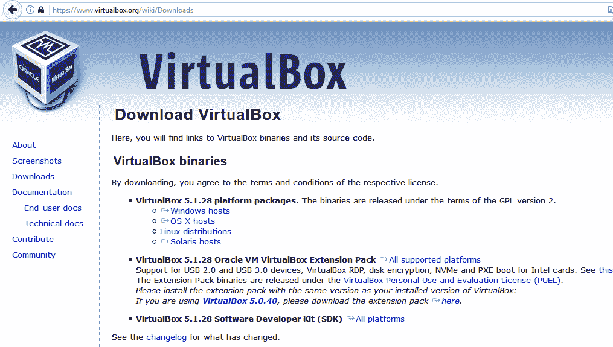

# 准备 Kali Linux 虚拟机

一旦下载 VirtualBox，就可以安装它，然后根据可用的 RAM 数量将其配置为运行 Kali Linux 和许多其他操作系统。

设置新的来宾操作系统或来宾虚拟机时，我们首先单击“新建”，然后填写以下详细信息：

*   **姓名**：`Kali-Forensic`（或您选择的姓名）
*   **类型**：Linux
*   **版本**：Debian（64 位）

然后单击下一步，在内存大小提示中继续分配 RAM：

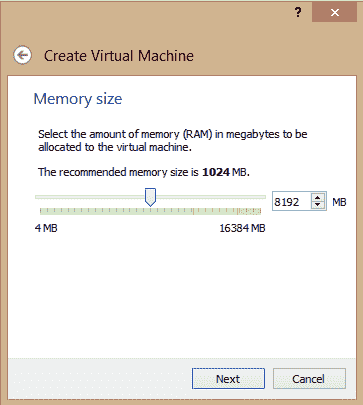

在前面的内存大小屏幕截图中，我们可以看到屏幕右侧的最大 RAM 容量。我使用的机器有 16384MB（四舍五入到 16GB）的 RAM。尽管 Kali 推荐的内存大小只有 1024MB（1GB），但我还是建议在使用取证工具时至少使用 4GB 的 RAM，以实现流畅的功能。我已经分配了 8192MB 的 RAM 用于我的虚拟机。

接下来，我们通过添加虚拟硬盘来创建虚拟机。我建议从新的虚拟硬盘开始，这是选择中的第二个选项。单击“创建”继续，然后选择 VDI（VirtualBox 磁盘映像）作为硬盘文件类型：

选择 VDI 并单击下一步：

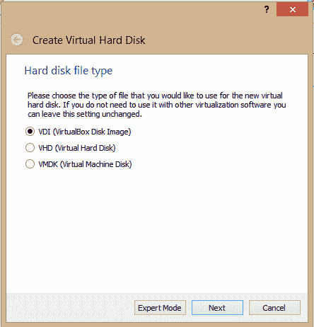

选择 VDI 后，如果需要，请选择动态分配选项以允许扩展虚拟硬盘：

对于下一步，我们选择文件位置和所选虚拟硬盘的大小。Kali Linux VDI 的建议大小为 8 GB，但我为可能需要在 Kali VM（虚拟机）上存储文件和映像驱动器副本的情况分配了大量 64 GB。

完成后，单击创建以完成虚拟硬盘的创建：

# 在虚拟机上安装 Kali Linux

按照上一节中的步骤准备并完成虚拟硬盘后，我们就可以开始实际的 Kali Linux 安装过程。在 Oracle VM VirtualBox Manager 中，这是 VirtualBox 的主要操作系统管理窗口，我们可以看到为我们的 Kali Linux 安装准备的 VM 现在可用。

在屏幕中间，我们还可以看到分配的资源，如 General 部分中的名称和操作系统类型，以及 System 部分中分配的 RAM 数量。其他设置，如**VRAM**（**视频 RAM**的缩写）、网络和显示设置也可以在本节中访问。

要开始我们的 Kali Linux 安装，请单击左侧的 Kali Forensic 条目，然后单击绿色的开始箭头：

在下一步中，我们必须找到从攻击性安全网站下载的 Kali Linux ISO 映像。单击主机驱动器“D:”旁边的文件夹图标，搜索下载的 Kali Linux ISO 映像：

选择 ISO 映像后，您将注意到所选条目更改为 kali-linux-2017.2-amd64.ISO（2.81 GB）。单击 Start 开始启动过程：

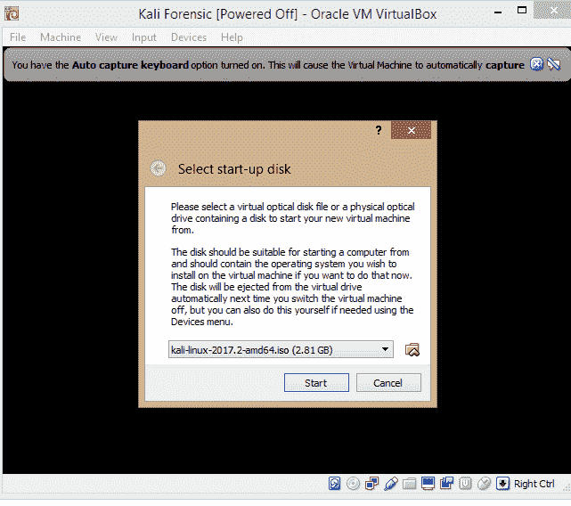

单击开始后，启动菜单将显示各种可用选项，包括 Kali 的实时版本。在本演示中，我们将选择图形安装选项将 Kali 安装到虚拟硬盘：

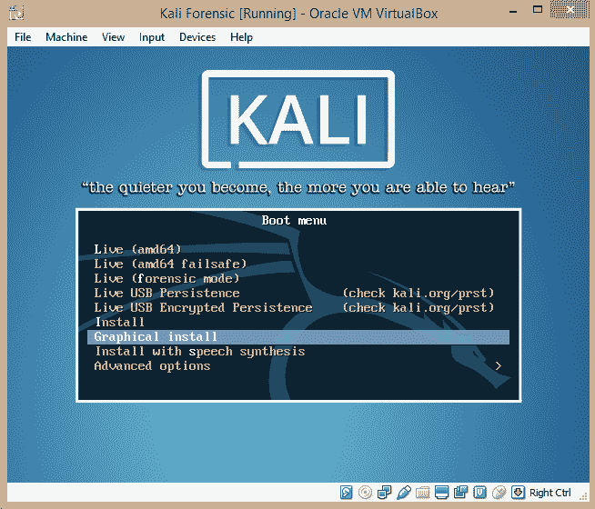

作为补充说明，我还应该提请您注意 Live（取证模式）选项，当从 DVD、闪存驱动器或其他可移动存储介质引导时，我们可以使用该选项。如果需要实时响应，最好总是有一份 Kali Linux 的副本。

好的，回到我们的安装。单击启动菜单中的图形安装选项后，系统会提示我们选择语言、位置和键盘布局。

在下一步中，我们将为 Kali Linux 来宾提供一个主机名，该主机名与 Windows 环境中的用户名相同：

对于域名区域，我将此区域留空，因为我不会将此主机加入域。

设置密码时，请确保使用您能记住的密码。如果启动时无法记住密码，则使用 16 个字符长、由大小写字母和字母数字字符组成的复杂密码是没有意义的：

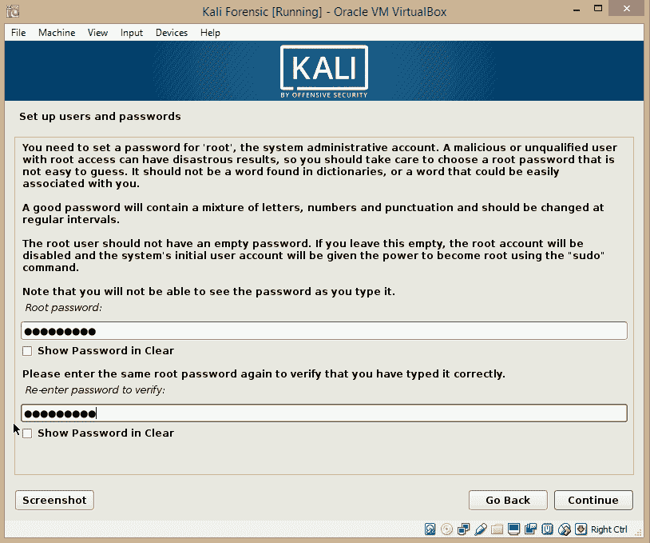

# 磁盘分区

硬盘分区（无论是虚拟磁盘还是物理磁盘）涉及将驱动器拆分为逻辑驱动器。把它想象成拥有一个由一个大房间组成的大公寓工作室。现在想象一下，你已经竖起一堵墙将公寓一分为二。它实际上仍然是一套公寓，但现在它被分为两个房间。一个可以用作主公寓，另一个用作储藏室，或者你甚至可以有两个较小的公寓与你自己和朋友共享。同样，分区可以允许在硬盘上安装多个操作系统，甚至可以创建额外的卷用作存储空间。

继续我们的 Kali Linux 安装，下一步将提供使用虚拟磁盘进行分区的选项。由于这是一个虚拟磁盘，我建议使用引导-使用整个磁盘分区方法。此方法非常简单，并使用前面步骤中分配给虚拟磁盘的所有可用分配空间。首先，让我们选择推荐的分区方法：

上面屏幕截图中的其他选项为用户提供了设置 LVM（逻辑卷管理器）和加密 LVM 的选项。LVM 管理逻辑分区，可以创建、调整和删除 Linux 分区。

如果选择此选项，提示警告磁盘上的所有数据（如果有）将被擦除；但是，这是一个新的虚拟磁盘，上面没有现有数据，因此我们可以继续安装。

选择 VirtualBox 磁盘（如以下屏幕截图所示）后，请确保选择一个分区中的所有文件：

当我们继续分区过程时，我推荐**引导分区**选项的主要原因之一是因为它几乎为我们做了所有事情。从这里，我们只需选择最后一个可用选项，即完成分区并将更改写入磁盘，然后单击“继续”：

分区过程的最后一步要求确认将指定的配置和更改写入磁盘。在单击“继续”之前，请确保选择*是*：

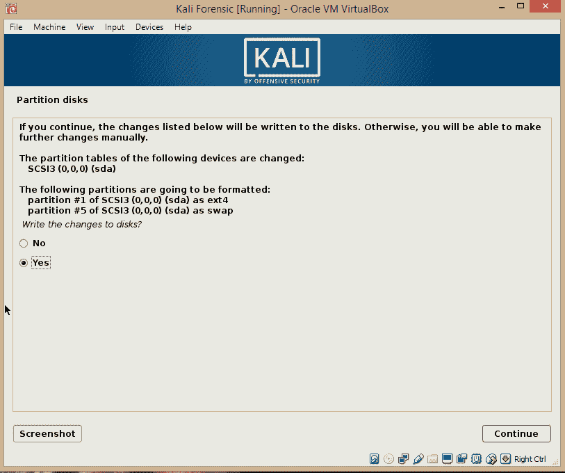

我们现在只需点击几下就可以安装和运行 Kali Linux 虚拟机。

安装完成后，软件包管理器会提示选择网络镜像，这允许我们访问更新版本的软件。我建议通过单击“否”跳过这一步，因为一旦启动并运行，我们将很快手动安装 Kali 的更新。

安装过程中要采取的最后步骤之一是在硬盘上安装 GRUB 引导加载程序。无需太多细节，**GRUB**（**GRand Unified Bootloader**）允许用户在引导屏幕上安全地拥有和选择操作系统，并保留每个已安装操作系统的引导条目，从而允许多引导环境。

虽然我们可以选择不安装 GRUB（因为我们的虚拟硬盘上只安装了一个操作系统），但如果与其他操作系统进行双引导或多引导，则应选择 Yes 选项：

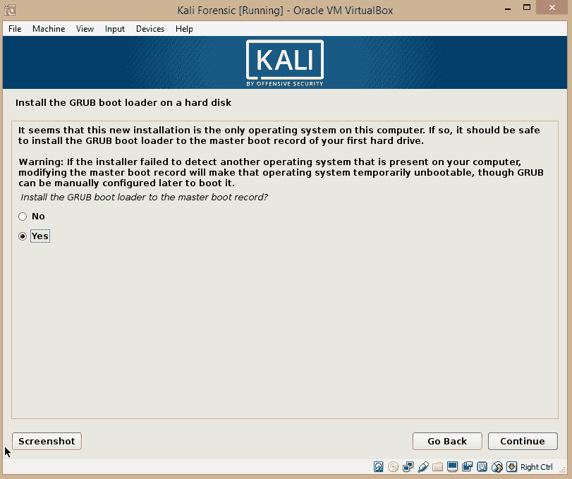

如果选择“是”安装 GRUB，请确保选择可引导设备：

单击 Continue 之后，安装完成并引导到 Kali Linux。

# 探索 Kali Linux

一旦安装完成，我们就可以启动 Kali Linux 了。要登录，请输入`root`作为您之前配置的用户名和密码：

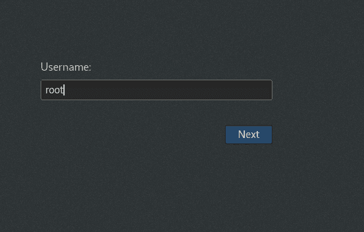

登录时，我们首先要做的事情之一是在终端中输入三个命令来更新 Kali。

要访问终端（相当于 Windows 中的命令提示符），请单击应用程序|终端。

终端打开时，输入以下命令，以便 Kali 可以检查软件包更新、软件升级和分发/发行版更新：

*   `apt-get update`
*   `apt-get upgrade`
*   `apt-get dist-update`

现在，我们已经成功地更新了 Kali Linux 的安装。由于本书涉及 Kali Linux 中的数字取证，我们可以通过查看菜单上提供的一些取证工具来深入了解。

在 Kali Linux 中，有两种方法可以访问取证菜单：

*   首先是单击应用程序，然后向下移动到菜单项 11-取证，如以下屏幕截图所示：

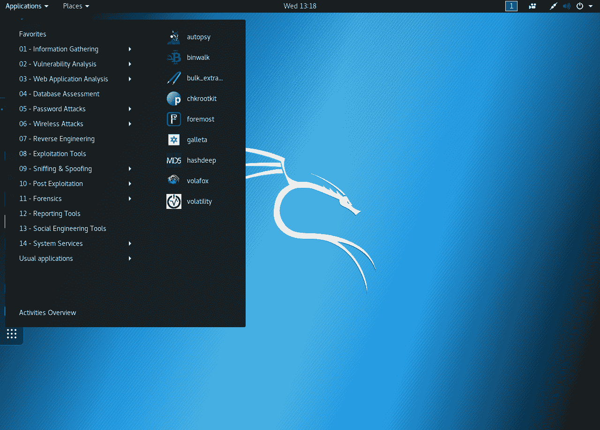

*   对于第二种方法，只需点击**显示应用程序**项（浮动侧菜单中的最后一个图标）并选择取证：

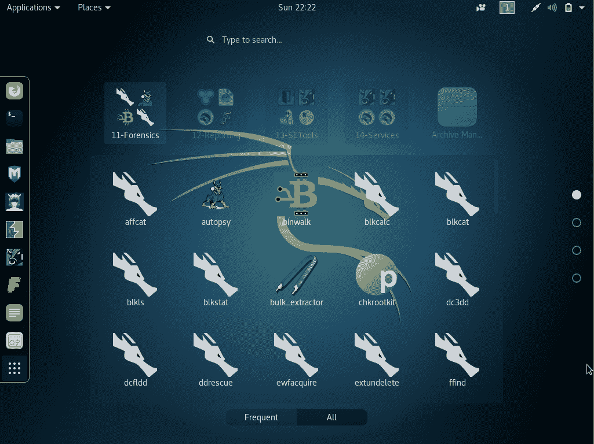

您会注意到，在第二个选项中有更多可用的工具。这并不是说这些都是我们在 Kali Linux 中可以使用的所有取证工具。许多都可以通过终端访问，其中一些将在后面的章节中以这种方式访问。

我还鼓励您探索 Kali Linux，它的许多精彩特性也使它成为一个功能齐全的操作系统，而不仅仅是用于取证和渗透测试。

如果您有兴趣了解更多关于 Kali 作为**渗透测试**（**笔测试**）发行版的信息，*Packt*有许多关于 Kali Linux 的详细书籍，我衷心支持。我有很多平装本，经常在工作中使用，也经常在备课时使用。

# 总结

在本章中，我们深入研究了 Kali Linux 的技术方面，并通过 Kali Linux ISO 映像发现了可用的模式类型，无论是从实时 DVD 运行还是在虚拟环境中安装。除了用作 DVD 的实时响应取证工具外，Kali 还可以安装到可移动存储设备上，如闪存驱动器或 SD 卡。作为一个多功能的操作系统，我们还可以将 Kali 安装为一个成熟的操作系统。

我们还深入研究了使用 VirtualBox 在虚拟环境中安装 Kali Linux。对于初学者，我绝对推荐这种安装方法，因为它允许在隔离环境中进行反复试验。请确保分配足够的 RAM，还请记住，32 位版本的 Kali 只允许识别和利用多达 4 GB 的 RAM。作为提醒，我再次建议您可以访问 Kali Linux live DVD 和操作系统安装（无论是物理还是虚拟），以确保涵盖所有基础。

了解 Kali 中使用的取证工具是进行调查的一个很好的方法，但我们还需要了解存储介质、文件系统、数据类型和位置的工作原理。在下一章中，我们将通过首先理解这些基本概念，继续我们的数字取证之旅。在[第 3 章](03.html)*了解文件系统和存储介质*中见。