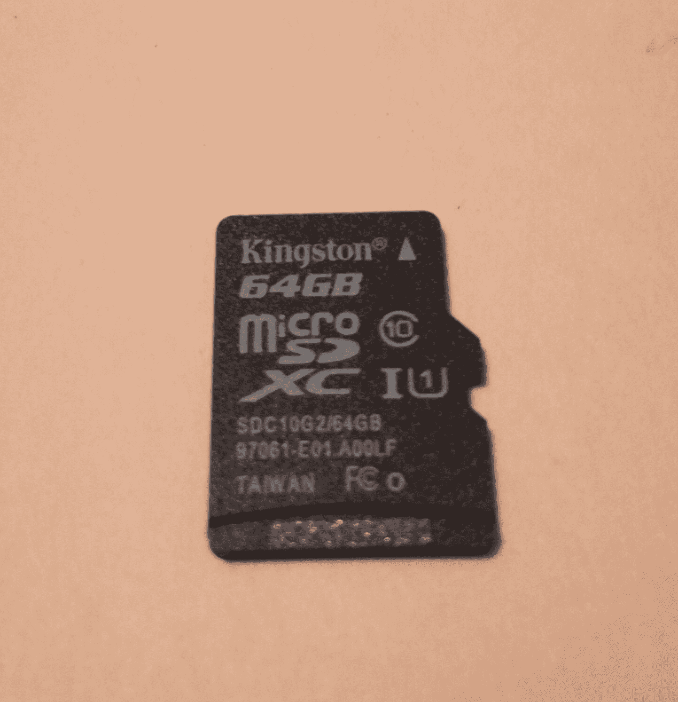
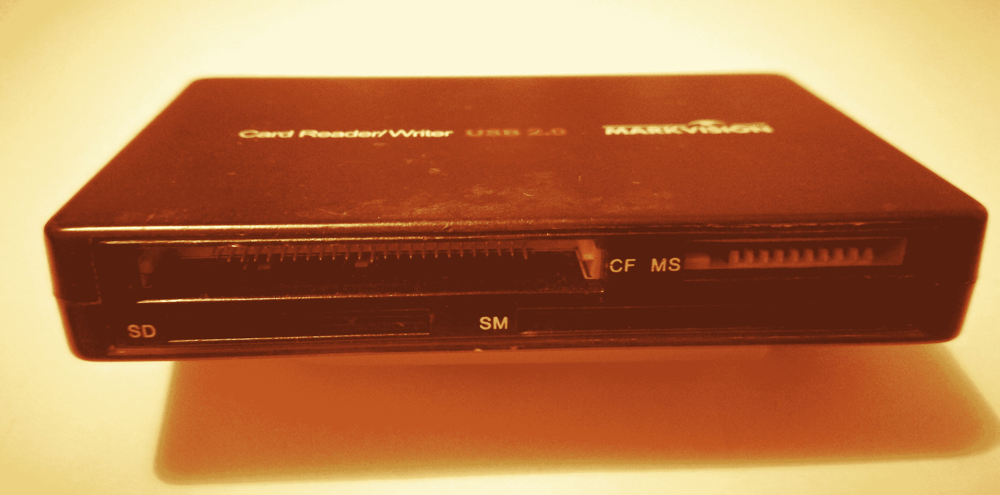
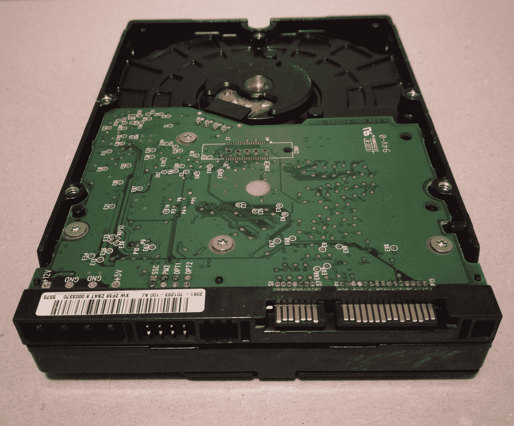
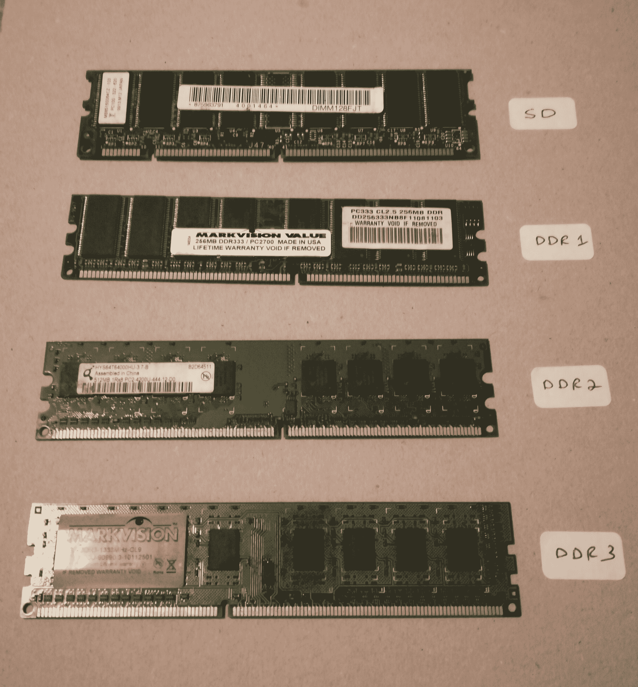

# 三、了解文件系统和存储介质

成为一名数字法医调查员需要的不仅仅是技术知识。有很多研究、流程和分析也涉及到了案例本身。考虑一个需要建造房子的场景。当然，我们需要木材、钉子、水泥、金属、玻璃和所有其他原材料，我们还需要熟练的工人和承包商来建造结构并将其组装在一起。除了材料、工具和资源之外，我们还将进行研究，以确保我们了解这是一个成功的项目需要什么。

例如，我们将不得不获得许可证建造，执行土壤分析，考虑天气，然后选择指定的材料类型，根据天气，地点，土壤类型，等等。不言而喻，为了有效地执行任务，必须理解该领域的基本概念。同样，我们需要了解文件系统、操作系统、数据类型和位置，并彻底了解保存数据、存储介质和一般证据的方法和过程。

在本章中，我们将学习以下主题：

*   存储介质的历史
*   文件系统和操作系统
*   数据呢？
*   数据 Volatility
*   分页文件及其在数字取证中的重要性

# 存储介质

任何调查的最终结果都是证明某事是否存在或发生。在笔记本电脑、台式机、移动设备和智能设备中，数据必须存储在某个地方，即使只是暂时的。我们大多数人可能熟悉笔记本电脑、台式机、移动设备等中的硬盘驱动器，但我们也需要关注可移动和便携式存储设备。这些包括 DVD、便携式驱动器、拇指或闪存驱动器、SD 和 microSD 卡、CD 和软盘等旧媒体，以及无数其他。

我们还应该考虑到许多便携式闪存驱动器有许多有趣的形状和尺寸作为新颖的项目，并且可能不采取通常形状的普通矩形驱动器。另一个要考虑的问题是，这些存储介质设备中的许多在过去几年中已经发生了尺寸的变化，并且尺寸通常较小，通常是由于技术的不断发展。

# IBM 与存储介质的历史

任何关于硬盘和存储介质历史的故事、杂志、书籍甚至讨论都必须提到三个字母：IBM。我们都熟悉这个著名的科技巨头，但我们可能并不都熟悉它的一些伟大成就。

**国际商业机器，我们所知道的**或**IBM**已经存在了相当长的一段时间。早在 20 世纪初，IBM 就被称为**计算制表记录**（或**CTR】****公司**，它以制造第一个硬盘驱动器、第一台 PC、服务器、台式机和笔记本电脑而闻名。

1956 年至 1957 年间，IBM 在 305**RAMAC**（会计和控制的**随机存取方法**的缩写）的开发和发布方面取得了重大进展，该方法使用了第一种磁盘存储技术。这项革命性技术的重量约为 1 吨，面积约为 16 平方英尺。然而，这个庞然大物的磁盘空间容量只有 5MB（兆字节——是的，我说的是*兆字节*）。

尽管按照今天的标准，5MB 大致相当于用移动设备拍摄的高清照片的大小，但从各方面考虑，这确实是当时的一项巨大成就。在 IBM 发明之前，数据存储在穿孔卡上，穿孔卡最多可容纳数百万张卡，只需容纳几兆字节。

当时采用这种数字存储器面临的一个主要问题是设备的尺寸。飞机和卡车运输可能不是许多人的选择；存储空间也是一个问题。

随着技术的进步，IBM 在 1975 年宣布了一种更便携的计算机，即 IBM5100 便携式计算机。在 20 世纪 80 年代，特别是 1981 年，我们看到了 IBM 个人计算机的诞生。这款便携式电脑的重量远低于其前身，价格在 8000 美元至 20000 美元之间，也更实惠。

直到 1981 年 IBM 发布第一台个人电脑时，电脑的便携性才成为现实。售价为 1565 美元，车主可以得到一个键盘和鼠标，以及显示器、打印机和软盘驱动器。除了软驱之外，这也是今天个人电脑的标准配置。

随着这项更新、更便携的技术的发展，数据存储介质在过去几年中也得到了改进，从磁带存储到软盘和软盘、CD、DVD、蓝光光盘，当然还有机械和固态驱动器。

# 可移动存储介质

继续我们的存储介质主题，我想首先讨论可移动存储介质，因为它们在当今世界中的作用与固定存储介质一样重要。

# 磁带机

由 IBM 在 20 世纪 50 年代推出的**磁带**是一种以与处理时间相等的速度存储数据的简单而快速的方法。IBM 726 磁带读取器和记录器是最早提供这种存储的设备之一，其容量或磁带密度为每线性英寸磁带 100 位。*英寸的胶带*应该显示缠绕在一个大轮子上的胶带的大小，类似于旧胶卷胶带。

使用磁带介质时，数据被写入由块组成的间隙隔开的框架中的磁性涂层塑料条的宽度。磁带在今天仍然被大量使用，并且像许多其他存储介质类型一样，在提高容量和速度的同时，其尺寸也显著减小。

为了了解到 2017 年磁带存储的发展程度，IBM 开发了一种更新的磁带存储介质，在一个盒式磁带上的磁带密度为每英寸 200 Gbps，可记录多达 333 GB 的数据。这些盒带（对于像我这样的老年人来说）只有盒式磁带那么大，或者（对于年轻人来说）比普通的智能手机小不了多少，而智能手机正好放在你的手里。

# 软盘

IBM 再次推出的**软盘**于 1971 年首次与其软盘驱动器一起出现。尽管当时的大型机已经有了硬盘和磁带存储介质，但仍需要一种简单、廉价的方法来保存软件和指令并将其传递给大型机，以前使用的穿孔卡速度要慢得多。

软盘的核心是一个小型磁盘，尽管它比当时的磁带存储和硬盘驱动器便携得多，但它的存储量比我们提到的其他介质少得多。

# 软盘的发展

尺寸：8 英寸

年份：1971 年

最大容量：80 KB（千字节）

尺寸：5.25 英寸

年份：1976 年

最大容量：360 KB

尺寸：3.5 英寸

引入年份：1984 年

最大容量：1.2MB（兆字节）

1986 年，软盘的容量增加到 1.44MB，直到 2011 年索尼（最后一家软盘制造商）停止生产，软盘的容量一直保持不变。

# 光存储介质

**光存储介质**之所以被称为光存储介质，是因为数据写入各种介质类型的方式涉及到在磁盘本身表面使用不同类型的激光器。

虽然在没有默认标签的情况下，可能有点难以区分各种光盘，但由于向它们写入数据时使用的激光的大小，它们的颜色和色调确实略有不同。

# 光盘

**光盘**（或**光盘**由凹坑和凸台构成，在光盘的底面上有明显的凸块，表面涂有一层薄薄的铝，形成反射面。数据以同心圆写入，进一步分成 512 字节的扇区，每个扇区称为光盘上从磁盘内部到外部（或边缘）的**磁道**：

*   **直径**：120 毫米
*   **用于写入数据的激光器类型**：780 nm（纳米）红外激光器
*   **一张 CD 的最大容量**：650-700 MB

各种类型的 CD：

*   **光盘-只读存储器**（**CD-ROM**）：该光盘上带有程序、游戏、音乐等形式的数据，只能从中读取
*   **可刻录光盘**（**CD-R**）：数据可以写入该光盘，但只能写入一次
*   **光盘-可重写**（**CD-RW**）：数据可以多次写入该光盘

# 数字多功能磁盘

**数字多功能磁盘**（或**DVD**）虽然直径相同，但可以存储比 CD 多得多的数据：

*   **直径**：120 毫米（与 CD 相同）
*   **用于写入数据的激光器类型**：650 纳米红色激光器
*   **DVD 的最大容量**：4.7GB（千兆字节）和 15.9GB（双层 DVD）

各种类型的 DVD：

*   **数字多功能磁盘-只读存储器**（**DVD-ROM**）：DVD 附带已经写入的数据，很像 CD-ROM。
*   **数字多功能盘-可刻录**（**DVD-R**）：数据可一次性写入 DVD。
*   **数字多功能盘+可录**（**DVD+R**）：数据可以一次写入 DVD+R DVD 采用了更先进的错误检测和管理技术。
*   **数字多功能盘-可重写**（**DVD-RW**）：数据可以多次写入 DVD。
*   **数字多功能磁盘-可记录双层**（**DVD-R DL**）：DVD 包含双层，因此在 DVD-9 磁盘上的存储容量为 7.95 GB，在 DVD-18 磁盘上的存储容量为 15.9 GB。
*   **数字多功能磁盘-可记录双层**（**DVD+R DL**）：与 DVD-R DL 相同，但被认为是更有效的格式，错误更少。
*   **数字多功能磁盘-随机存取存储器**（**DVD-RAM**）：由于其弹性（长达二十年）和重写数据的能力，主要用于视频记录设备。此光盘比其他 DVD 格式更贵，并且与许多常见的 DVD 驱动器和播放机不兼容。

# 蓝光光盘

**蓝光磁盘**是可移动磁盘介质的当前标准，其名称来源于用于读取和写入磁盘的激光的颜色。由于蓝光磁盘的高容量存储，**高清**（**高清**内容可以轻松存储在蓝光磁盘上，而不会造成质量损失：

*   **直径**：120 毫米（与 CD、DVD 相同）
*   **用于写入数据的激光器类型**：405 纳米蓝光激光器
*   **DVD**的最大容量：27 GB（千兆字节）和 50 GB（双层蓝光）

# 闪存存储介质

**闪存**之所以如此命名，是因为数据是通过电荷写入和擦除的。你可能听过有人说他们不得不*闪存*他们的移动设备。这与擦除智能手机和智能设备上的闪存存储介质非常相似，不同的是，具有 Android 和 iOS 等操作系统的设备需要更广泛的闪存和重新安装操作系统的过程。然而，最终的结果是非常相同的，内存和存储区域被重置或擦除。

**闪存芯片**分为 NAND 和 NOR 闪存两种，负责在闪存介质上高速大容量存储数据。它们是较新型的**EEPROM**芯片（是**电可擦除可编程只读存储器**的缩写），可以擦除数据块或整个驱动器，而不是像速度较慢的 EEPROM 那样一次只擦除一个字节。这种类型的闪存芯片是非易失性的，这意味着即使芯片断电，数据仍然存储在芯片上。当特定指令以电信号的形式通过电路写入中称为**的方法**发送到芯片时，数据被擦除，该方法相应地改变数据。

下图显示了我的一个旧 1 GB 闪存驱动器，它带有三星 NAND 芯片，存储数据。如果您想深入了解芯片的技术细节，可以查看[中的数据表 PDFhttp://datasheet.iiic.cc/datasheets-1/samsung_semiconductor_division/K9K4G08U0M-PCB00.pdf](http://datasheet.iiic.cc/datasheets-1/samsung_semiconductor_division/K9K4G08U0M-PCB00.pdf) ：

迄今为止，闪存媒体存储已成为便携性的终极选择，有多种类型，从拇指大小到小指指甲大小不等。闪存的寿命完全取决于使用情况，因为它们都具有平均读写使用情况，有时显示在设备的包装上。读写速度在这一点上也是最快的，这就是为什么硬盘驱动器已经从传统的机械磁盘机制转移到固态磁盘机制。有关 SSD 的更多信息将在本章后面讨论。

闪存存储介质容量从 2 GB 到 256 GB 不等，特别是在 SD、microSD 和闪存驱动器上，这些存储介质现在可以充当安装了操作系统的非常快速的可移动驱动器，甚至可以使用各种工具进行分区。的确，Kali Linux 可以安装在闪存驱动器、SD 或 microSD 卡上（并且可以启动），存储空间只有 8GB。

# USB 闪存驱动器

1995 年发布的**通用串行总线**（**USB**）端口或接口已成为所有设备的标准，取代了连接到计算机上特定并行端口的旧设备。几乎任何设备或外围设备都可以通过 USB 连接连接到计算机，包括鼠标、键盘、闪存驱动器、打印机、扫描仪、照相机、移动设备，以及几乎所有其他设备

USB 端口的演变：

| **USB 版本** | **发布年份** | **数据传输速度** |
| USB 1.0 和 1.1 | 1995 | 12Mbps |
| USB 2.0 | 2000 | 480 Mbps |
| USB 3.0 | 2008 | 5 GBps |
| USB 3.1 | 2013 | 10 GBps |

如今，USB 闪存驱动器有各种形状和尺寸，从标准的矩形到各种可以想象的形状。USB 闪存驱动器使用 NAND EEPROM 芯片来存储数据，目前有多种版本可供选择，这些版本定义了闪存驱动器的读/写速度。

下图显示了从最旧到最新、从左到右的各种闪存驱动器。前三个驱动器都是 USB 2.1；不过，前两个是 8GB 闪存驱动器，第三个则更小，是 32GB 闪存驱动器。第四个驱动器（Corsair）是 64 GB USB 3.1 驱动器：

我应该特别提到房间里的大象，它是一种新颖的闪存驱动器，可以很容易地作为钥匙链或玩具传递，而且由于组织内数据的敏感性质，它实际上可能会对不允许员工带闪存驱动器上班或离开的组织构成威胁。

# 闪存卡

与闪存驱动器一样，**闪存卡**（或人们亲切地称之为存储卡）也使用 NAND 闪存，正如我们之前了解到的，NAND 闪存是非易失性固态存储器。但是，与 USB 闪存驱动器不同，这些卡没有 USB 接口，必须与适配器或读卡器一起使用。

在过去的几年甚至几十年里，我们的台式机、笔记本电脑、手机和其他设备，包括相机、MP3 播放器，甚至玩具，都有多种格式的存储卡。虽然我只介绍一些今天比较流行的卡片，但重要的是你至少熟悉存储卡，并且能够识别它们。

闪存卡类型：

*   **记忆棒 PRO Duo**（**MSPD**，索尼开发的专有卡）
*   **安全数字****SD**
*   **MicroSD**
*   **紧凑型闪存**（**CF**）
*   **多媒体卡**（**MMC**）
*   **xD 图片**（**xD**）
*   **智能媒体****SM**

在上面提到的这些中，我选择在下图中展示我收藏中的三个。左边的卡片是索尼记忆棒专业二重唱。中间的卡是一个 SD 卡，侧面有一个滑动锁，用于防止数据被覆盖。右边的卡片是今天更常见的卡片，microSD：

我想对 PRO Duo（左边的卡）、SD（中间的卡）和 microSD（右边的卡）做一个简单的比较。较旧的 PRO Duo 卡至少相隔十年开发，更大，容量为 2 GB。虽然在 SD 卡上看不到，但它的容量是 4GB，而右边最小最新的卡（microSD）实际上有高达 64GB 的存储容量。

请看下图以获得 microSD 卡的特写。它显示 64 GB 的容量，以及 microSD 卡的级别（10 级）。一个指甲大小的东西上有 64 GB 的数据！尽管如此，microSD 卡仍在开发中，容量更大，达到 128 GB 甚至 256 GB：

各类 microSD 卡确定了它们的读/写速度和建议用途。我建议购买 10 级 microSD 卡，因为 C10 比其他类别（2、4 和 6）快得多，并且支持恒定高清甚至 4k 视频录制。

如前所述，闪存卡需要读卡器，读卡器使用 USB 端口连接到笔记本电脑、台式机和其他媒体播放器。下图显示了我的众多读卡器之一，它支持 Compact Flash、Memory Stick PRO Duo、Secure Digital 甚至智能媒体卡：

# 硬盘驱动器

现在，我们已经很好地了解了非易失性存储，包括磁带存储和闪存存储，让我们更深入地了解硬盘驱动器的世界，硬盘驱动器作为固定存储介质。我会尽量让事情简单明了，特别是专注于法医调查员所需的知识。

硬盘驱动器技术与 IBM 大型机上最早出现的庞大存储设备相比，无疑已经走过了漫长的道路，现在更紧凑、更快、更经济，容量达到 TB。

尽管较新的固态驱动器使用闪存设备中相同类型的内存，但与机械驱动器相比，它们仍然有点昂贵。当我们想知道为什么仍在使用较旧的机械传动技术时，这可能是一个促成因素。机械传动装置由活动部件组成，包括盘片、执行器臂和非常强大的磁铁。尽管在今天的笔记本电脑和硬盘驱动器中仍然可以找到这些机械 HDD 是很常见的，但它们比更新的固态驱动器慢得多，后者没有移动部件，看起来非常类似于 USB 闪存驱动器的芯片组。

在您的取证调查和冒险中，您可能会遇到或看到旧的 HDD，它们可以具有不同的接口，并使用不同的电缆技术连接到主板。让我们看看，好吗？

# IDE 硬盘

20 世纪 80 年代中期，许多最早的个人电脑都配备了使用**PATA**（并行高级技术附件的首字母缩写）和**IDE**（集成驱动器电子设备的首字母缩写）技术的硬盘。与当时所有的旧设备一样，并行传输是当今的主流，允许非常有限的吞吐量。识别旧 IDE 驱动器的一个简单方法是查看数据和电源线连接到驱动器的接口。

如下图所示，这些较旧的驱动器有四个电源插脚，它们连接到 Molex 连接器，由用于将设备设置为主设备或从设备的八个插脚分开，然后是 IDE 数据电缆的 40 个插脚，IDE 数据电缆将数据传输到主板：

1994 年，技术的进步导致了**EIDE**（增强型集成驱动电子设备的首字母缩写）的发布，数据电缆的引脚数量从 40 个增加到 80 个，传输速度也从 4 Mbps 提高到了 133 Mbps。

然而，IDE/EIDE 仍然限制为每台计算机最多四个 IDE/EIDE 驱动器，因为驱动器上的跳线引脚仅允许两个主驱动器和两个辅助驱动器，设置为主驱动器和从驱动器配置。还必须考虑到，CD-ROM 和 RW 设备以及 DVD-ROM 和 RW 设备当时也在使用 IDE/EIDE 技术。

# SATA 硬盘

2002 年，希捷发布了一种名为**SATA**（是**串行高级技术附件**的首字母缩写）的硬盘技术，该技术使用串行传输，而不是较慢的并行传输。PATA 驱动器的速度为 33/66/133 Mbps，而 SATA 驱动器的速度为 150/300/600 Mbps。这意味着最低的 SATA 传输速度（150 Mbps）比最高的 PATA 传输速度（133 Mbps）快。

SATA 驱动器的连接器接口也有所不同，但当时常见的是 SATA 驱动器带有用于 SATA 和 PATA 电源线的连接器，以实现向后兼容性。

SATA 数据电缆比 PATA 电缆薄得多，因为它们只包含七根连接到七个引脚的导线。SATA 设备每个驱动器使用一根电缆，与 PATA 设备不同，PATA 设备在主/从配置中连接的一根 IDE/EIDE 电缆上连接两个驱动器。

下图显示了一个较旧的 SATA 驱动器，其右侧带有 SATA 数据和电源连接器，左侧是一根传统的 IDE Molex 电源线（四针）：

SATA 至今仍然是台式机和笔记本电脑驱动器技术的标准配置，并已进行了几次修订，如下所示。列出的速度单位为 MBps，而非 MBps：

*   **SATA 1**：150 MBps
*   **SATA 2**：300 MBps
*   **SATA 3**：600 MBps

下图显示了两个 SATA 笔记本电脑 2.5 英寸驱动器。左边的那个已经损坏了，我们打开它可以看到中间的圆形碟子，执行器臂在顶部，略微位于碟子上方。在执行器臂的末端有一个读/写磁头，它实际上对盘片进行数据的读取和写入。

图中右边的驱动器实际上是一个混合型驱动器，或者是一个**SSHD**（是**固态混合型驱动器**的缩写）。这实际上是一个类似于左边的机械驱动器，但也有闪存，以便更快地访问盘片上的数据：

# 固态驱动器

如前所述，SSD 是非易失性存储介质，在阵列中使用 NAND 闪存来保存数据。SSD 已经存在了相当长的一段时间；然而，由于驱动器的高成本，主流应用将受到极大的阻碍。三星于 1996 年首次发布了带有 PATA 接口的 32 GB SSD，随后是 SanDisk 的 32 GB SSD，但带有 SATA 接口。

尽管 SSD 驱动器使用闪存，但使用的材料比闪存驱动器中的材料更高端，这使其成为硬盘驱动器的首选，但同样，这也导致了非常高的成本。

SSD 的一些优点来自于 SSD 中没有活动部件这一事实。没有移动部件使 SSD 更耐用，以防掉落或快速移动到 PC 塔上，因为没有盘片或执行器臂被刮伤或撞击。此外，更快的读/写速度和访问时间大大减少了设备引导或启动所需的时间，甚至在使用资源密集型软件和游戏时提供了更好的体验。

就数字取证而言，SSD 仍然是一项相对较新的技术，在未来一段时间内将不断改进。重要的是要记住，您不是在处理机械驱动器，并且要记住 SSD 上的数据，就像闪存驱动器或存储卡一样，可能会在几分钟甚至几秒钟内丢失或擦除。虽然传统的工具可以用于从 SSD 映像和恢复数据，但我强烈建议在执行任何取证活动之前研究任何 SSD 驱动器，以便更好地了解其工作原理和复杂性，如去芯片和磨损均衡算法。

# 文件系统和操作系统

既然我们已经讨论了物理问题，那就让我们讲逻辑吧！任何类型的存储介质都需要使用特定的文件系统进行格式化。选择的文件系统还将决定介质上可以安装哪些操作系统，以及文件和分区大小。

考虑这一点的一个简单方法是将一张空白纸想象成任何类型的新的或擦除的存储介质。我们可以将多种类型的信息放在这张纸上，但我们可能首先希望以一种使数据易于理解、访问甚至存储的方式组织或准备这张纸。我们可以选择在上面用英语从左到右书写句子和段落，也可以用行和列创建表格。我们甚至可以使用打印的幻灯片来显示数据，甚至可以使用图像、图表和流程图。此外，我们可以以最适合存储和使用的数据的方式格式化存储介质。

文件系统确保数据的组织方式使其易于识别和索引。考虑有多个隔间的文件柜内的存储空间。有些可能专门用于按字母顺序存储文件，另一些则按时间顺序存储，有些隔间用于存放文具用品、杂项甚至随机物品。尽管它们都用于储存不同的物品，但它们都可以贴上标签并易于识别，而且它们的组织方式也可以使每个隔间的内容物易于存取甚至移除。

要在硬盘驱动器或可移动存储介质上安装任何操作系统，必须首先通过选择适当的文件系统对设备进行格式化并为操作系统做好准备。Windows、macOS、Android、Kali 等都有文件系统来组织存储介质，以便成功安装操作系统。

一些比较流行的操作系统及其文件系统包括：

*   **微软视窗**：
    *   **文件系统**：**NTFS**（**网络技术文件系统）**
    *   **支持的版本**：Windows 10、8、7、Vista、XP、2000、NT
    *   **最大卷大小**：16**EB**（**EB**）
    *   **支持的最大文件大小**：256 TB
    *   **NTFS 特性**：压缩，**EFS**（**加密文件系统**），磁盘配额

旧版本的 Microsoft Windows 默认支持**FAT**（**文件分配系统**文件系统）。较新版本的 Windows 也支持 FAT 和 FAT32，但有驱动器大小限制（8 TB）和文件大小限制（4 GB）。创建 exFAT 是为了消除 FAT32 的限制，但可能没有 FAT32 得到广泛支持。

*   **Macintosh****macOS**：
    *   **文件系统**：**HFS+**（**层次文件系统**）
    *   **支持的版本**：macOS 直到版本 10
    *   **最大卷大小**：2 TB
    *   **支持的最大文件大小**：2GB

在撰写本文时，苹果已经升级到一个名为**APFS**（**苹果文件系统**）的较新文件系统，以取代专门为 SSD 优化的 HFS+。APFS 将在 macOS 10.12.4 和 iOS 10.3 中提供。

*   **Linux**：
    *   **文件系统**：**Ext4**（**第四扩展文件系统**。Linux 有几种可用的文件系统，但如果您不确定应该使用哪种文件系统，我建议使用这种文件系统
    *   **支持的版本**：RedHat、Kali、Ubuntu 等
    *   **最大容积**：1EB
    *   **支持的最大文件大小**：16 TB

Many open source operating system distros are based on Linux including Kali Linux and Android, and so use the ext2/ext3/ext 4 filesystems. They are also able to use the FAT32 filesystem.
FAT32 can be used across any platform, including older versions of Windows, Mac, and Linux, and is supported by almost any device with a USB port.

# 数据呢？

到目前为止，在本章中，我们已经了解了用于存储数据的各种媒体。现在我想谈谈实际的数据本身，它的一些状态，以及当它被访问时会发生什么。

# 数据状态

首先，有**数据在传输**，也称**数据在运动**。这些只是描述移动中的数据，可能在设备之间甚至存储介质之间通过网络，在位置之间主动移动。

然后有**数据在使用**。此状态的数据当前正由用户访问或由 CPU 处理。当访问或使用数据时，数据会从硬盘驱动器中取出并临时存储在 RAM 中，这比硬盘驱动器（尤其是机械驱动器）快得多，只要用户访问数据并且设备通电，数据就会一直存储在 RAM 中。

当数据不在运动或传输中，也不在使用中时，将其描述为**静止数据**。在此状态下，数据*位于*或驻留在非易失性介质上，如硬盘驱动器、光盘介质、闪存驱动器和存储卡。

# 元数据

元数据只是关于数据的数据。例如，以存储在仓库中的笔记本电脑等物品为例。在仓库中的某个地方（也可能在云计算等其他位置），可能存在关于该笔记本电脑的多条信息，这些信息可以称为关于该笔记本电脑的数据，甚至可以称为笔记本电脑元数据，例如：

*   笔记本电脑在仓库内的位置
*   笔记本电脑品牌与型号
*   生产日期
*   保修日期和信息
*   硬件和软件规格
*   颜色和大小

此外，数据可能至少有一些关于它的基本信息，不管它是静止的还是运动的。在静止状态下，可以在文件表的硬盘上对数据进行索引，以识别数据的位置，以及数据是否可供用户使用，或者是否正在等待被覆盖。传输中的数据还将包含头信息（将在后面的章节中讨论），它提供了有关源地址和目标地址以及数据大小的信息，仅举几个例子。

# 空闲空间

群集是存储介质上存储数据的最小磁盘空间或分配单元。格式化驱动器时，我们需要定义这些分配单元的大小，或者我们可以使用默认的 4 KB 集群大小。这就是空闲空间的来源。

**Slack space**是集群中包含数据但未完全填充数据的空白未使用空间。要完全理解这一点，我们首先需要了解操作系统指定的默认集群大小。使用 NTFS 格式化的驱动器（适用于 Windows）具有默认群集大小或 4 KB。假设您已将一个文件大小为 3KB 的文本文件保存到磁盘。这意味着您在该集群中仍有 1KB 的未使用或空闲空间。

松弛空间是法医调查员特别感兴趣的，因为数据可以很容易地隐藏在松弛空间中。幸运的是，我们在 Kali Linux 中有几个可用的工具，例如**Sleuth 工具包**和**Autopsy**，可以帮助调查空闲空间并找到隐藏的文件。

# 数据 Volatility

在本节中，我们将了解当易失性存储器断电时数据丢失的原因。

只要存储数据的介质能够存储数据，数据就可以存在。硬盘驱动器（机械和固态）、闪存驱动器和存储卡都是非易失性存储介质。尽管 SSD 在数据访问时间方面已经并将继续做出巨大的改进，但迄今为止，RAM 仍然是设备内部速度更快的内存类型，通常仅称为**内存**。

然而，RAM 是**易失性存储器**。与硬盘和闪存中的非易失性存储器不同，存储在 RAM 中的数据暂时保存在那里，只要有电流提供给芯片。我们需要注意的 RAM 有两种类型：**静态 RAM**（**SRAM**）和**动态 RAM**（**DRAM**）。

SRAM 优于 DRAM，但由于在制造芯片时使用了大量的材料，因此其成本远远高于 DRAM。SRAM 在物理上也比 DRAM 大得多。SRAM 可以在 CPU 缓存（**L1**或**1 级**中找到，也可以在主板上的一些芯片（**L2**/**L3**中找到，尽管由于成本和物理尺寸的原因，SRAM 的大小非常小（KB）。

尽管 DRAM 的速度较慢，但它的价格要便宜得多，并且仍然是将其用作设备主存储器的原因之一。使 RAM 易失性的是其组件，例如**晶体管**和**电容器**。你们中的一些人可能已经在**A+**等认证课程中熟悉了这个主题，但为了所有读者的利益，请允许我更详细地介绍一下。

DRAM 使用电容器，作为刷新电路的一部分暂时存储电荷。芯片需要不断刷新，以便在访问时保存数据。然而，在刷新之间会产生等待状态，这使得 DRAM 比 SRAM 慢，因为它使用晶体管而不是没有等待状态的电容器。

在过去的几十年中，已经出现了许多类型的 DRAM 或记忆棒，尺寸略有不同，并且增加了与主板接触的引脚。按年龄顺序排列的一些 RAM 类型包括：

*   **扩展数据输出 RAM**（**EDO RAM**）：早期 DRAM 类型之一。
*   **同步动态 RAM**（**SDRAM**）：开始与 CPU 时钟速度同步。最大传输速率为 133 MT/s（每秒传输数百万次）。标签为 PC100、PC133、PC166。
*   **DDR-SDRAM**/**DDR**1（**双数据速率**-**SDRAM**）：有效地将 SD RAM 的传输速率提高了一倍。最大传输速率为 400 MT/s。
*   DDR2：最大传输速率为 800 MT/s。
*   DDR3：功耗比 DDR2 低三分之一。最大传输速率为 1600 MT/s。
*   DDR4：最大传输速率为 3200 MT/s。

在今天的笔记本电脑和台式机中，可能会遇到 DDR3 和 DDR4，但在使用 DD2 或（奇迹般地）DDR1 的旧式机器上运行可能并不罕见。下图显示了从上到下的不同 RAM 类型**DIMM**（**双列直插存储模块**）、SDRAM（顶部）、DDR1、DDR2，最后是 DDR3：

笔记本电脑也使用 DDR RAM，但有更紧凑的称为**SODIMM**（**小外形 DIMM**模块。

# 分页文件及其在数字取证中的重要性

操作系统能够使用硬盘的一部分作为 RAM 的扩展。这被称为**虚拟内存**，如果计算机或笔记本电脑的 RAM 有限，这通常是个好主意。尽管硬盘驱动器比 RAM 慢得多，但磁盘上的交换文件或分页文件可以存储访问较少的文件和程序，从而使 RAM 可用于存储频繁访问的数据。此过程涉及操作系统交换不太常用的数据页，并将数据移动到硬盘上的专用分页文件区域。

在法医调查中，分页文件对我们非常重要。虽然由于存储在硬盘上，所以不像 RAM 本身那么易失，但它在 Windows 中是一个名为`pagefile.sys`的隐藏文件，应始终使用您选择的工具进行检查，因为该文件可能会显示加密区域的密码、访问站点的信息、打开的文档、登录用户、打印项目等。

尤其是机械传动装置上的数据以零碎的方式存储；然而，分页或交换文件的优点是，数据可以以连续的方式存储，一个接一个地存储，允许更快的访问时间。

建议将分页文件的大小设置为内存量的 1.5 倍，并在可能的情况下存储在单独的驱动器上，而不仅仅是单独的分区。

`Pagefile.sys` can be located in the Windows registry path: `HKEY_LOCAL_MACHINE\SYSTEM\CurrentControlSet\Control\Session Manager\Memory Management`.

# 总结

在本章中，我们花了一些时间介绍了非易失性存储介质的一些基本知识，该介质即使在没有电源供应的情况下也会存储数据。非易失性介质包括不同类型的硬盘驱动器，如机械和固态 PATA 和 SATA 驱动器、闪存驱动器和存储卡。

较新的存储媒体设备（包括 SSD）使用一种称为 NAND 闪存的特殊类型的闪存来存储数据。这种闪存比传统的机械驱动器快得多，也更耐用，因为这些设备不包含运动部件；然而，目前它们仍然相当昂贵。

我们还研究了与各种操作系统关联的各种文件系统，发现最小的数据分配称为集群，它可以驻留在空闲空间中。空闲空间是集群中未使用的空间，可以在其中隐藏数据。数据本身具有不同的状态，可以处于静止、运动或使用状态。不管数据的状态如何，总是存在一些关于数据本身的信息，称为元数据。

用户或操作系统访问的任何数据都临时存储在易失性存储器或 RAM 中。尽管数据可以在非易失性存储器上长时间存储，但当进入易失性存储器（RAM）的电荷也丢失时，数据就会丢失。硬盘的一个称为分页文件的区域可以充当虚拟 RAM，让计算机认为它的 RAM 比安装的要多。

我鼓励你们在这些主题上做更多的研究和扩展你们的知识，让你们对所涉及的内容有更多的了解。现在让我们进入下一章，在那里我们将学习事件响应的调查程序和最佳实践，例如获取易失性数据以及使用和分析实时机器的程序。