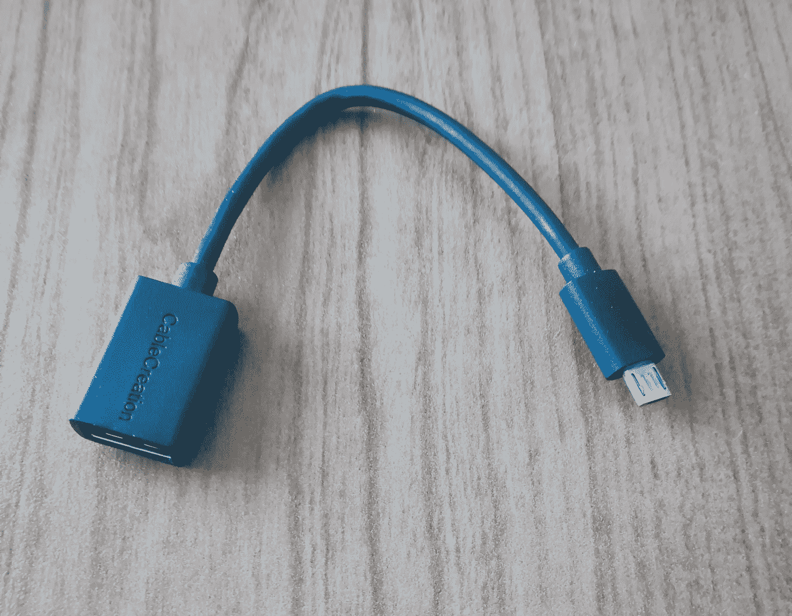
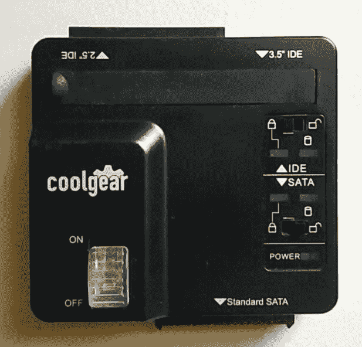

# 四、事件响应和数据采集

有时很难确切地确定什么是证据，尤其是在调查的确切开始时，当时发生的一切事实可能尚未收集或陈述。在任何调查中，我们都应该了解并遵循获取证据的指导原则、做法和程序，以确保证据不会被篡改，或者在最坏的情况下不会丢失。

在犯罪现场，比如说枪击案，有一些特定的物品可以立即成为证据。物证很容易收集，放入证据袋，贴上标签，然后运到实验室和安全的储存区进行安全保管。这些证据可能包括用过的弹壳、枪支、指纹和血样。让我们不要忘记证人陈述和**CCTV**（闭路电视的缩写）的镜头。考虑到执法机构的个人将在现场，以及他们可能到达的顺序也是令人感兴趣的。看起来很简单。

当报告涉及计算机或智能设备的违反或犯罪时，收集证据有时并不简单，因为在将任何物品标记为证据之前有许多因素要考虑。

例如，如果一台台式机参与了这一行动，我们是单独使用塔台还是同时使用显示器、键盘、鼠标和扬声器？其他的外围设备如打印机和扫描仪呢？现场是否有其他固定或可移动存储介质，我们是否也没收了它们？

本章回答了所有这些问题，并提供了事件响应、证据获取和其他主题的指南和最佳实践，包括：

*   数字证据获取程序
*   维护证据完整性
*   写阻塞和散列
*   通电与断电设备采集
*   实时采集最佳实践
*   数据成像和散列
*   证据链

# 数字证据的获取和程序

正如我们在上一章所述，数据可以存储在固定和移动存储介质上。然而，数据很容易被删除或完全丢失，这取决于我们要确保数据的保存必须考虑的多种因素。甚至有人可能会说，数字存储面临的威胁比纸质存储更大。以下是对这两种威胁的一些比较：

*   对纸质存储的威胁包括：
    *   水
    *   火湿
    *   漏洞
    *   年龄
    *   自然灾害洪水、地震、龙卷风、飓风等
*   对存储介质上数据的威胁包括：
    *   人为错误和疏忽
    *   磁场和电磁场
    *   水与冷凝
    *   热
    *   灰尘
    *   影响
    *   电压
    *   静电
    *   自然灾害洪水、地震、龙卷风、飓风等

数据究竟何时成为证据？在考虑发生的事件时，特定数据可能具有与调查相关的值

# 事件响应和第一响应者

保存证据不仅始于获取数据，而且早于对可疑设备的实际查看。对于涉嫌犯罪或违规行为，应采取与向警方报告犯罪行为相同的方式，采取某种结构化的应对措施。同样，一个人向应急服务部门打电话，然后由其派遣警察、消防、救护人员和其他急救人员，然后将问题上报 FBI 或其他机构。在处理需要数字调查的报告时，也应该有类似的指挥链。

当发现或怀疑违规或犯罪时，应配备一名专门的第一响应人员，并向其发出警报并呼叫至现场。此人通常对设备、网络、甚至组织中的 IT 基础设施（如适用）的工作原理有一定的了解。

第一响应人员可包括：

*   系统管理员
*   网络管理员
*   安全管理员
*   IT 经理

虽然担任上述职务的人员可能不擅长数字取证或数字调查，但他们将负责保护现场，并确保未经授权的个人不会使用、篡改、删除或泄露数据、外围设备、设备和存储。

第一响应者的职责包括：

*   第一个回应现场（顾名思义）并进行初步评估
*   使用房间中心作为焦点，以圆形方式完整记录场景和房间
*   通过不允许未经授权的用户或嫌疑人访问设备或区域，尤其是访问易失性数据和存储介质，保护现场安全
*   保存和包装运输证据，确保使用**保管链**（**CoC**表格

# 文件和证据收集

现场记录也应由急救人员进行，以协助调查。现场记录应包括照片、视频、语音记录和以下手动记录：

*   设备所在的房间（桌子、天花板、入口/出口、窗户、照明、电源插座和数据滴）
*   设备状态（打开、关闭、电源指示灯闪烁）
*   如果设备处于打开状态，屏幕内容（操作系统、正在运行的程序、日期和时间、有线和/或无线网络连接）
*   书、笔记、纸片
*   连接和断开的电缆

一旦现场被第一响应者保护并记录在案，如果还没有发出警报，也应召集法医调查员。

如果第一响应者接受了证据收集和保存方面的培训，他们也可以开始获取可视为实物证据的过程。

物证的例子包括：

*   **电脑塔**。
*   **笔记本电脑**。
*   **片**。
*   **固定和可移动存储介质**：硬盘、光盘、磁带存储、存储卡、读卡器、适配器、扩展底座、打印机、扫描仪、手机和 iPod。媒体和 MP3 播放器以及其他可能用于实施违规的设备。路由器和交换机还可能包含连接日志、源和目标地址，甚至访问过的网站等证据。
*   **电缆和充电器**。

# 物证收集和保存

应考虑证据收集阶段的物理方面。与任何其他调查一样，应在遵循适当指南和最佳实践的同时进行记录、收集和保存，以确保调查的完整性。例如，在犯罪现场，必须正确识别证据，将其标记为由授权人员处理，并对其进行调查程序培训，以便在法庭上进行仔细审查。

第一响应者工具包应包含以下项目，以备现场记录、证据收集和保存：

*   防护服，包括护目镜和手套
*   防静电垫或腕带
*   识别标签、标签和便携式标签设备（如有）
*   各种笔和记号笔，便于识别
*   电缆扎带
*   工具箱，配有各种尺寸的 Philip、平头、Torx 和专用螺丝刀或螺丝刀头
*   手电筒和放大镜
*   扣押和保管链表格
*   容器、箱子和包装材料，包括防静电袋和堡垒袋

这里有一个预算，但便携式和组织良好的螺丝刀工具包，我在我的第一反应工具包。它具有用于打开台式机、笔记本电脑、平板电脑的所有附件，还可用于移除甚至打开可移动存储介质，如硬盘驱动器、光盘驱动器，甚至软盘驱动器（如果我遇到它们）：

# 物理采集工具

我们已经研究了收集和获取实物证据所需的工具，但是我们需要什么工具来获取和提取数字证据呢？还记得我们在[第 3 章](03.html)中介绍不同类型的存储介质时，*了解文件系统和存储介质*吗？我们看到，它们中的许多都有自己的连接器，因为它们的尺寸各不相同。

以下列出了从证据中获取数据时所需的一些设备：

*   写阻止程序（也可以是基于软件的）
*   读卡器
*   各种适配器（USB 到 SATA 和 EIDE，USB 到各种类型的 USB）
*   设备电缆，如电源、SATA、EIDE、HDMI、VGA
*   网络电缆，如直通、交叉、控制台

下图显示了各种 USB 适配器的集合，它们的价格都在 10 美元以下，并且都可以在 Amazon 上买到：

对于笔记本电脑驱动器，我还使用 SATA 到 USB 3.0 适配器，如下所示：

为了连接到路由器和交换机，您的套件中还可以包括控制台电缆和串行至 USB 电缆，如下所示：

包括手机和平板电脑在内的所有移动设备也可以通过 USB 端口连接到笔记本电脑和台式机。下图显示了 OTG 电缆，它可以将 USB 设备连接到具有 OTG 功能的手机或平板电脑：

实物收集和保存指南：

*   标记所有电缆和连接器
*   根据需要使用带标签的证据收集袋
*   储存具有无线和无线电功能的设备时，可能必须使用特殊的堡垒包，以防止与其他设备通信
*   将敏感设备（如硬盘驱动器和闪存驱动器）存放在防静电袋和保护壳中
*   在运输过程中用于储存的容器上贴上标签
*   将证据从一个人/经办人传递给另一个人时，维护保管链表格（本章后面将讨论）

# 波动顺序

在收集证据时，我们应该牢记数据的Volatility。如本章前面所述，数据很容易丢失或销毁。因此，在收集数据时，一个有充分文件证明且通用的最佳做法是尽可能按Volatility最大到最小的顺序收集证据。

**数字证据科学工作组**（**SWGDE**实时系统捕获文件）列出了Volatility从最大到最小的顺序，关键如下：

*   内存
*   运行进程
*   活动网络连接
*   系统设置
*   存储介质

# 监管链

保管链是一种在个人之间交换证据时合法确保证据完整性的形式，因此它还提供了一定程度的责任，因为填写表格时需要个人身份证明。该表格提供了从现场收集到法庭陈述的运输和双方交换的准确日志和账目。

保管链表单上的一些典型字段包括：

*   案件编号
*   违法行为
*   被害人和嫌疑人姓名
*   扣押日期和时间：
    *   扣押时的位置
    *   项目编号
    *   项目说明
    *   发放和接收物品的个人签名和 ID
*   处置授权书
*   毁灭证据的证人
*   释放给合法拥有人

保管链表格样本可直接从**国家标准与技术研究所**（**NIST**下载）：

[https://www.nist.gov/document/sample-chain-custody-formdocx](https://www.nist.gov/document/sample-chain-custody-formdocx)

# 通电与断电设备采集

在调查通电和断电的设备时，必须特别考虑数据的Volatility。引导、重新引导或关闭设备可能会导致数据写入硬盘，甚至在 RAM 和分页文件中丢失。

# 通电设备

调查通电设备时，应采取以下预防措施：

*   如果您怀疑设备可能处于*睡眠*状态，请移动鼠标或在触摸板上滑动手指。不要单击按钮，因为这可能会打开或关闭程序和进程。
*   拍摄并记录屏幕和所有可见的程序、数据、时间和桌面项目。
*   拔下台式机上的电源线，如果可能的话，取出便携机上的电池。

在收集存储在 RAM 和分页文件中的数据时，尽可能少地修改数据，这一点非常重要。关于这一点的更多信息将在后面的章节中使用成像工具（如 Kali Linux 中的 Guymager 和 DC3DD）进行介绍。其他实时采集工具，如 C.A.I.N.E 和 Helix，也可用于采集 RAM 和分页文件。

对 RAM 进行成像和获取有很多原因。如前一章所述，可能已经由用户加密的数据可以存储在未加密的 RAM 状态中。如果分析 RAM 和分页文件，则可以提取和分析登录的用户、打开的程序、访问的文件和正在运行的进程。但是，如果设备关闭或重新启动，这些数据和证据很容易丢失。

对于已通电的便携式设备和已通电的设备，如有可能，应卸下电池。但是，有些设备可能没有可拆卸的电池。在这些情况下，应按住电源按钮 30 至 40 秒，这将迫使设备关闭电源。

# 断电设备

除非法医调查员打开，否则不得打开断电设备。必须采取特殊步骤确保现有数据不被擦除，新数据不被写入。

设备通常看起来好像关闭了，但它们可能处于睡眠或休眠状态。作为一个简单的测试，鼠标可以移动，监视器（如果有的话）可以打开，以确定它们实际上是否处于这两种状态中的任何一种。即使它们处于关闭状态，仍应拍摄屏幕和端口。

在调查处于已关闭状态的便携式和移动设备时，建议卸下电池（如果可能）并将其放在证据袋中，以确保在拔下电源插头后不会意外打开设备。根据*NIST.SP.800-101r1*-*移动取证指南*，应注意，即使在关闭状态下，移除电池也会改变易失性存储器中的内容。

# 写块

一旦我们的证据得到适当的记录和收集，我们就可以开始获取实际的数字证据。为了阐明这一点，我将多次提到这一点，但原始证据只应用于创建法医副本或图像，这将在本章和其他章节中进一步讨论。

处理原始证据可以而且通常会修改媒体的内容。例如，将被扣押的笔记本电脑引导到其本机操作系统将允许将数据写入硬盘，还可能擦除和修改 RAM 和分页文件中包含的内容。

为了防止这种情况发生，必须使用写阻止程序。顾名思义，写阻止程序阻止数据写入证据媒体。写入阻止程序可以在硬件和软件类型中找到。如[第 1 章](01.html)、*数字取证导论*中所述，如果没有硬件写阻止程序，软件版本可以作为独立功能在包括 C.a.I.N.E 在内的取证操作系统中随时可用，也作为一些商业和开源工具的一部分，如 EnCase 和Autopsy。

同样，在调查中使用写阻止程序以保护和保存原始证据不被修改，这一点非常重要。下图显示了一种廉价高效的便携式 SATA 和 IDE 适配器，带有写阻塞开关，用于驱动器采集和恢复：

# 数据成像和散列

映像是指将数据精确复制为文件、文件夹、分区或整个存储介质或驱动器。在对文件和文件夹进行常规复制时，并非所有文件都可以根据其设置为系统的属性（甚至是隐藏的属性）进行复制。为了防止文件被遗漏，我们执行了一种特殊类型的复制，其中每一位的复制或成像都与当前介质上的完全相同，就像拍摄数据的照片或快照一样。

按原样创建每个数据位的副本称为**物理图像**。执行**比特流复制**可确保复制的完整性。为了进一步证明这一点，计算并比较原始证据和物理图像的散列。如果拷贝被关闭了一位数据，散列值就会大不相同。

原始证据只能由合格且经授权的专业人员处理，并且只能用于创建具有法医学意义的物理图像。否则，不得使用原始证据，因为这会损害完整性和调查。

# 消息摘要（MD5）哈希

散列值由特定算法生成，用于通过证明数据未被修改来验证证据的完整性。散列值可以被认为是数字指纹，因为它们是唯一的，在证据和物理图像的识别中起着重要作用。

其中一种算法虽然较旧且存在漏洞，但它是**消息摘要**（**MD5**）加密哈希算法，该算法产生 128 位十六进制输出值。

举个工作示例，让我们打开一个浏览器，转到[http://passwordsgenerator.net/md5-hash-generator/](http://passwordsgenerator.net/md5-hash-generator/) 。

这个网站创建单词和句子的散列作为字符串。在本例中，我输入了不带括号的字符串`Digital Forensics with Kali Linux`。自动计算的 MD5 值显示为 7E9506C4D9DD85220FB3DF671F09DA35，如以下屏幕截图所示：

通过从`Kali`中删除`K`，从现在读取`Digital Forensics with ali Linux`的同一字符串中，MD5 现在读取 7A4C7AA85B114E91F247779D6A0B3022，如以下屏幕截图所示：

作为一个快速的比较，我们可以看到仅仅从`Kali`中删除`K`会产生一个明显不同的结果：

*   `Digital Forensics with Kali Linux`：7E9506C4D9DD85220FB3DF671F09DA35
*   `Digital Forensics with ali Linux`：7A4C7AA85B114E91F247779D6A0B3022

我鼓励您自己尝试一下，也可以在字符串中添加逗号或句点，以进一步比较散列值。

# 安全哈希算法（SHA）

另一种常用于取证和下一章中的加密哈希算法是 SHA1。**安全哈希算法-1**（**SHA1**）比 MD5 更安全，因为它产生 160 位输出，而不是 MD5 的 128 位输出。由于已知针对 MD5 和 SHA-1 的冲突攻击，哈希的更安全、更健壮的选项现在是*SHA-2*。

SHA-2 实际上是一组散列，而不是像 SHA-1 那样的一组散列，最常见的位长度是 SHA-256，它产生 256 位的输出。SHA-2 的交替比特长度算法是 SHA-224、SHA-384 和 SHA-512。

使用的加密算法越强，受到攻击或破坏的可能性就越小。这意味着所创造的证据和实物图像的完整性保持不变，这将在法医案件和专家证词中证明是有用的。

关于创建哈希的更多信息将在[第 5 章](05.html)*中演示，使用 DC3DD 和 GYMAGER*获取和保存证据，使用 DC3DD 和 GYMAGER。

# 设备和数据采集指南及最佳实践

虽然我试图向您概括介绍收集和保存证据的程序，但我强烈建议您阅读并熟悉一些官方文件，因为它们都提供了有关现场记录、证据收集和数据采集的详细信息和指南。

2014 年 9 月发布的**SWGDE****数字证据科学工作组***计算机取证最佳实践**版本 3.1*概述了以下领域的计算机取证最佳实践：

*   证据收集和处理
*   证据获取和运输
*   调查通电和断电系统介质和服务器的指南
*   审查和报告

完整的 SWGDE 计算机取证最佳实践文件可从以下位置下载：

[https://www.swgde.org/documents/Current%20Documents/SWGDE%20Best%20Practices%20for%20Computer%20Forensics](https://www.swgde.org/documents/Current%20Documents/SWGDE%20Best%20Practices%20for%20Computer%20Forensics)

2014 年 9 月发布的*SWGDE 实时系统捕获*文档，版本 2.0，虽然很短，也不太详细，但仍然适用于涉及实时（通电）系统的法医调查。本文档在调查实时系统（包括波动顺序）、内存取证（包括分页文件取证）以及实时物理和文件系统获取时提供了指导原则。

本文件仅六页，可在此下载：
[https://www.swgde.org/documents/Current%20Documents/SWGDE%20Capture%20of%20Live%20Systems](https://www.swgde.org/documents/Current%20Documents/SWGDE%20Capture%20of%20Live%20Systems)

**NIST**（**国家标准与技术研究所***移动设备取证指南*也是另一份特别适用于移动设备的非常有用的文件。2014 年发布的本文件第一次修订版详细介绍了移动取证调查的各个方面。其内容包括：

*   移动和蜂窝特性
*   现场评估和记录
*   设备隔离和封装
*   设备和存储器获取
*   检查、分析和报告

可在此处下载完整文档：

[http://nvlpubs.nist.gov/nistpubs/SpecialPublications/NIST.SP.800-101r1.pdf](http://nvlpubs.nist.gov/nistpubs/SpecialPublications/NIST.SP.800-101r1.pdf)

# 总结

如果我只想让你从本章中了解一件事，那就是记住原始证据，特别是硬盘驱动器、存储介质和 RAM 图像，应该只用于创建取证声音比特流副本。原始证据永远不会被处理。

综上所述，当报告有违规行为时，应当有一名既定的第一响应者，根据协议，负责记录和保护现场以及收集和保存证据。第一响应者应拥有一个工具包，其中包含获取证据的各种工具和物品，并在将证据移交给其他方时，确保保持保管链。

我们还了解了在调查通电和断电设备时的各种程序和最佳实践，并讨论了使用写阻止程序防止原始证据被篡改，然后使用哈希工具进行完整性验证的重要性。

你已经走到了这一步，我知道这一定有点信息过载，但现在我们可以进入本书的实践部分，在那里我们可以使用 Kali Linux 中的数字取证工具开始我们的调查。走吧！