# 五、使用 DC3DD 和 GYMAGER 获取和保存证据

在上一章中，我们了解到文件和适当的程序是任何调查的关键。通过提供数据真实性证明和原始证据和文件的保存，确保调查的完整性。如果重复使用工具和方法，原始证据和文件可用于实现相同的准确结果。

在本章中，我们将演示使用比特流拷贝（包括创建数据散列）获取数据的取证技术。

我们将用于获取的第一个工具称为**DC3DD**（**国防部网络犯罪中心**。DC3DD 是非常流行的数据转储或 DD 工具的一个补丁，用于法医采集和散列。

以下是**数据转储**（**DD**的特点：

*   比特流（原始）磁盘采集和克隆
*   复制磁盘分区
*   复制文件夹和文件
*   硬盘驱动器错误检查
*   对硬盘驱动器上的所有数据进行取证擦除

然后，我们将探索另一个非常流行的采集工具 Guymager，它在 GUI 中提供了许多相同的功能。

# Linux 中的驱动器和分区识别

刚接触 Kali 或任何 Linux 变体的用户可能会发现，Kali 中的驱动器和分区识别和命名与 Windows 设备不同。

Linux 中的典型设备可以被寻址或识别为`/dev/sda`，而 Windows 中的驱动器通常被识别为`Disk 0`和`Disk 1`，以此类推：

*   `/dev`：指 Linux 能够识别的所有设备和驱动器的读写路径
*   `/sda`：指**SCSI**（**小型计算机系统接口**）、SATA、USB 设备

**sd**代表**SCSI 大容量存储驱动器**，驱动器号后面的字母：

*   `sda`：驱动器`0`或识别的第一个驱动器
*   `sdb`：第二个驱动器

Windows 将分区识别为主分区、逻辑分区和扩展分区，而 Linux 分区识别为数字分区，位于驱动器号之后：

*   `sda1`：第一个磁盘上的分区 1（`sda`）
*   `sda2`：第一个磁盘上的分区 2
*   `sdb1`：第二个磁盘上的分区 1（`sdb`）
*   `sdb2`：第二个磁盘上的分区 2

# 使用 fdisk 命令进行设备标识

在开始使用 DD 之前，我需要再次提醒您注意 DD 的一个特性，即擦除数据、分区和驱动器的能力。因此，您可能会发现 DD 有时也被亲切地称为**数据破坏者**。在使用 DD 和 DC3DD 时，请务必首先确定您的设备、分区、输入和输出文件以及参数。

在本章中的练习中，我将使用一个旧的 2GB 闪存驱动器，用于使用 DC3DD 的采集过程。为了在执行任何采集操作之前列出您的设备并确保您知道它们，应先运行`fdisk -l`命令，然后再运行其他命令。如果前一个命令不起作用，可能必须使用`sudo fdisk -l`命令。

在下面的屏幕截图中，`fdisk -l`命令已在连接 2 GB 闪存驱动器之前运行，以列出已连接的设备。有一个硬盘被列为`sda`。主分区列为`sda1`，其中`Extended`和`Linux swap`分区分别列为`sda2`和`sda5`：

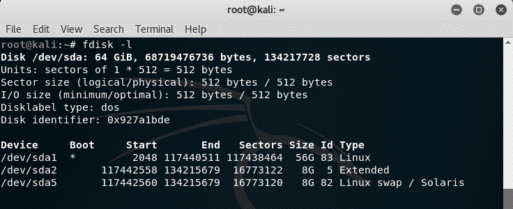

连接 2 GB 闪存驱动器进行采集后，`fdisk -l`命令再次运行，可以在以下屏幕截图中看到这些细节：

*   **磁盘**：`sdb`
*   **尺寸**：`1.9 GB`
*   **扇区大小**：`512 bytes`
*   **文件系统**：`FAT32`


如前面的屏幕截图所示（本章前面也进行了解释），Kali Linux 可识别两种设备：

*   `sda`：三分区主硬盘
*   `sdb`：待取证或成像的闪存驱动器

现在我们已经区分并确定要对哪个驱动器进行成像（`sdb`，我们可以开始使用 DC3DD 进行法医成像。

虽然我使用了一个较旧的 2 GB 闪存驱动器来演示 DC3DD 的使用，但您可以使用任何驱动器（便携式或其他）来练习使用本章中的工具。确保使用`fdisk -l`命令来识别驱动器和分区。

# 维护证据完整性

为了提供证据证明证据未被篡改，应在收购之前、期间或之后提供证据散列。

在 Kali Linux 中，我们可以使用跟随设备路径的`md5sum`命令来创建证据/输入文件的 MD5 散列。例如，`md5sum /dev/sdx`。

您也可以通过键入`sudo md5sum /dev/sdx`以超级用户权限尝试该命令。

在本例中，我将使用的 2GB 闪存驱动器（名为`test_usb`）被识别为`sdb`，因此我将使用的命令显示在以下屏幕截图中：

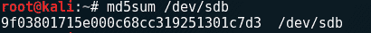

在上一个示例中，当使用 DC3DD 对驱动器执行采集或取证成像时，2 GB 闪存驱动器的`md5sum`输出显示为`9f038....1c7d3  /dev/sdb.`，我们在散列创建的图像文件输出时也应该有准确的结果，以确保原始证据和副本完全相同，从而保持证据的完整性。

我还使用以下语法创建了一个 SHA-1 哈希（将用于比较目的）：


# 在 Kali-Linux 中使用 DC3DD

DC3DD 由国防部网络犯罪中心开发，并在 DD 更新时更新。DC3DD 提供了最佳的 DD 和更多功能，包括：

*   使用更多算法选项（MD5、SHA-1、SHA-256 和 SHA-512）进行动态哈希
*   监测进度和采集时间的仪表
*   将错误写入文件
*   分割输出文件
*   文件核查
*   输出文件的擦除（模式擦除）

虽然我们将只讨论 DD 和 DC3DD，但还有另一个工具称为**DCFLDD**，它可以安装在基于 Linux 的系统上。DCFLDD 是 DD 的增强版，由**国防计算机取证实验室**（**DCFL**）维护和支持，并有自己的发布时间表，而 DC3DD 的更新与 DD 同步。

DC3DD 是一种 CLI，通过首先打开终端并键入`dc3dd`，可以在 Kali Linux 中轻松运行。首先，我建议使用`dc3dd --help`命令，该命令列出了与`dc3dd`一起使用的可用参数：

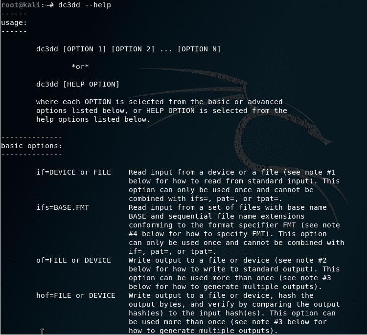

如前面使用`dc3dd --help`命令的屏幕截图所示，DC3DD 命令的典型用法如下所示：

```
dc3dd [option 1] [option 2] ... [option n]
```

在前面的示例中，我使用了以下选项：

```
dc3dd if=/dev/sdb hash=md5 log=dc3ddusb of=test_usb.dd
```


*   `if`：指定*输入文件*，这是我们将要成像的设备。
*   `hash`：指定我们将用于完整性验证的哈希算法的类型。在本例中，我使用了旧的 MD5 哈希。
*   `log`：指定记录设备和采集详细信息（包括错误）的日志文件的名称。
*   `of`：指定 DC3DD 创建的法医图像的输出文件名。尽管在本例中指定了`.dd`图像文件类型，但其他格式由 DC3DD 识别，包括`.img`，如后面的示例所示。

应注意设备大小（以扇区和字节为单位），然后与设备字段的*输出结果进行比较。*

最后一行还显示采集过程的进度和状态，显示复制的数据量、已用时间（以秒为单位）和成像过程的速度（以 Mbps 为单位）：


要获取的驱动器或文件越大，所需时间越长。我建议您喝杯咖啡或清凉饮料，或者甚至可以在[的 Packt 网站上看一看其他精彩的作品 https://www.packtpub.com/](https://www.packtpub.com/) 。

采集过程完成后，将显示输入和输出结果：


分析结果，我们可以看到相同数量的扇区（`3913664`已成像，没有坏扇区被零替换。我们还可以看到，为该图像创建了精确的 MD5 散列，这向我们保证了在不进行修改的情况下创建了精确的副本。

在终端中，我们也可以使用`ls`命令列出目录内容，以确保 DC3DD 输出文件（`test_usb.dd`和日志（`dc3ddusb`已经创建：

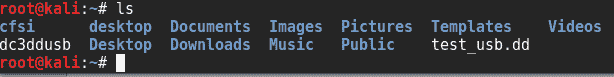

要访问我们的法医图像和日志文件，我们可以点击位置（左上角）然后点击`Home`进入`/home`目录。

在我的`Home`文件夹中，第一个文件`2GBdcedd.dd`是 DC3DD 使用`of=test_usb.dd`命令创建的输出图像。最后一个文件`dc3ddusb`是我们使用`log=dc3ddusb`命令时创建的日志文件：

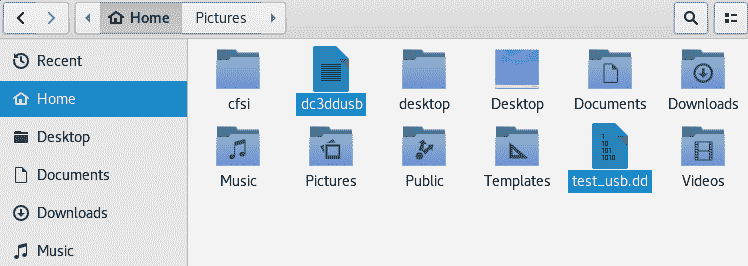

保存此日志文件以记录采集过程及其结果非常重要，采集过程及其结果在完成后显示在屏幕上：


在未来的章节中，我们将使用各种工具分析获得的法医图像；但是，如果研究人员愿意，也可以将图像复制或直接克隆到其他设备。

例如，我们可以将先前获取的法医图像（`test_usb.dd`克隆到一个新的驱动器上，该驱动器被识别为`sdc`。用于执行此任务的命令为：

```
dc3dd if=test_usb.dd of=/dev/sdc log=drivecopy.log
```

将映像复制到驱动器时，目标驱动器大小应等于或大于映像文件的大小。

# 使用 DC3DD 进行文件分割

根据证据的大小，可管理性和可移植性可能成为一个问题。DC3DD 能够将取证获取的图像分割为多个部分。

这是通过使用`ofsz`和`ofs`选项实现的：

*   `ofsz`指定每个输出文件部分的大小
*   `ofs`指定具有数字文件扩展名的输出文件，通常为`.000`、`.001`、`.002`等

始终确保为文件扩展名指定了足够的零。逻辑上，`.000`允许比`.00`更多的部件。

在本例中，我使用了与以前相同的 2GB 闪存驱动器；但是，出于演示目的，您将注意到两个更改。

我没有使用 MD5 散列，而是指定使用 SHA-1，输出文件类型将是`.img`，而不是以前使用的`.dd`。

在本例中，成像的 2GB 闪存大小将改为使用名为`2GBdc3dd2.img.ooo`、`2GBdc3dd2.img.oo1`、`2GBdc3dd2.img.oo2`和`2GBdc3dd2.img.oo3`的部分`ofsz=500M`拆分为多个 500Mbs 的部分（总共四个）。

用于实现此目的的命令是：

```
dc3dd if=/dev/sdb  hash=sha1  log=dd_split_usb  ofsz=500M ofs=split_test_usb.img.ooo
```

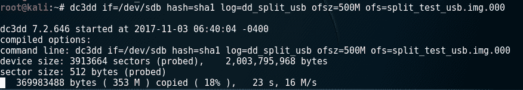

完成后，设备的输入结果将显示 SHA-1 哈希输出，并显示分割图像文件的第一部分：

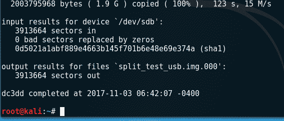

再次使用`ls`命令，我们可以看到四个拆分输出文件的扩展名都是从`.000`到`.003`的数字格式：

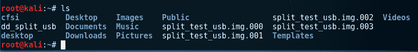

在`Home`文件夹中可以找到映像文件的所有分割部分以及日志文件：

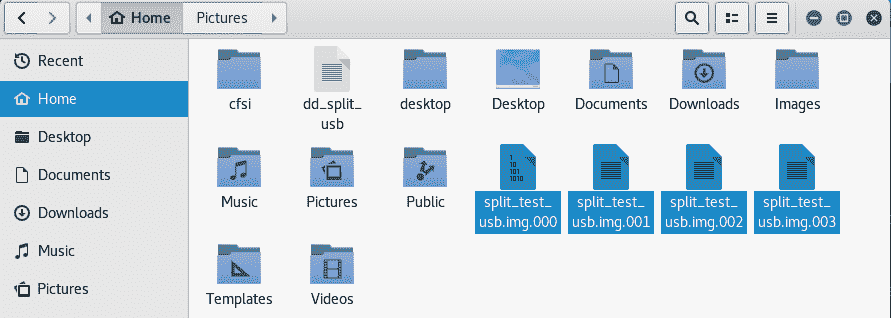

# 验证分割图像文件的哈希

要验证分割文件的哈希，可以使用以下命令：

```
cat split_test_usb.img.* | sha1sum
```

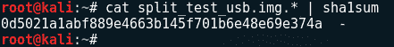

这也与 2 GB 闪存驱动器本身的`sha1sum`输出相匹配，通过使用以下命令显示：

```
sha1sum /dev/sdb
```


# 使用 DC3DD 擦除驱动器

我们已经看到了 DC3DD 作为一个非常令人印象深刻的法医采集工具的强大功能，但我还想进一步向您介绍它作为数据擦除工具的功能。DC3DD 可以通过三种方式覆盖数据来擦除数据和擦除驱动器：

*   覆盖并用零填充数据和驱动器。使用的命令为`dc3dd wipe=/dev/sdb`：

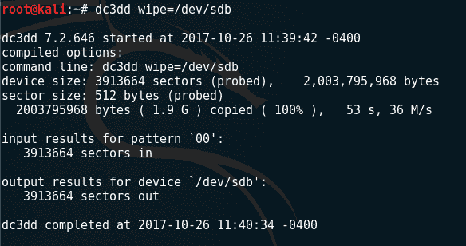

*   使用 pat 选项以十六进制模式覆盖和填充数据和驱动器。使用的命令为`dc3dd wipe=/dev/sdb pat=000111`：

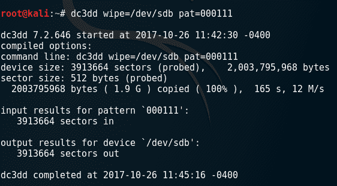

*   使用`tpat`选项，使用文本模式覆盖和填充数据和驱动器。使用的命令为`dc3dd wipe=/dev/sdb tpat=cfsi`：

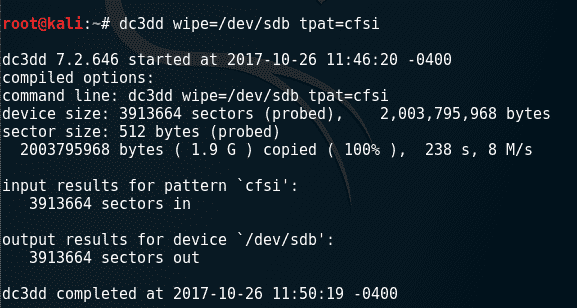

# 利用 Guymager 进行图像采集

Guymager 是另一个独立的采集工具，可用于创建法医图像和执行磁盘克隆。Guymager 由 Guy Voncken 开发，完全开源，具有许多与 DC3DD 相同的特性，并且仅适用于基于 Linux 的主机。虽然一些研究人员可能更喜欢 CLI 工具，但 Guymager 是一种 GUI 工具，适合初学者使用，因此可能会首选它。

对于这次采集，我还将使用与 DC3DD 示例中使用的相同的 2GB 闪存驱动器，最后我们可以比较结果。在获取和创建证据和驱动器的法医图像时，记住继续使用写阻止程序也很重要，以避免将数据写入驱动器或修改原始证据文件。

正如之前在 DC3DD 采集中所做的那样，我们应该首先使用`fdisk -l`或`sudo fdisk -l`命令确保熟悉连接到机器上的设备。

# 跑步机

通过使用 Kali 中的菜单并单击侧菜单上的应用程序，然后单击取证并向下滚动到 Guymager，可以启动 Guymager：


也可以通过输入`guymager`使用终端启动 GYMAGER。您也可以尝试使用`sudo guymager`命令。一旦启动，日志文件和配置（`cfg`文件）的默认位置可以根据需要更改：

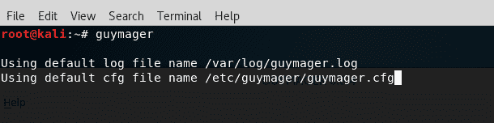

Guymager 应用程序运行，然后显示在 Kali Linux 中识别的现有驱动器。如以下屏幕截图所示，显示了正在使用的 2 GB 闪存驱动器的详细信息，包括以下内容：

*   Linux 设备：识别为`/dev/sdb`
*   型号：`USB_Flash_Memory`
*   状态：显示为空闲，因为图像采集尚未开始
*   尺寸：`2.0GB`

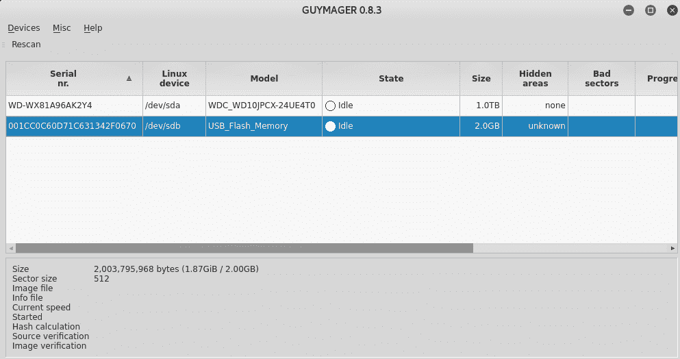

如果您的设备未在 GYMAGER 中列出，或者您需要添加其他设备，请单击应用程序左上角的“重新扫描”按钮。

# 通过 Guymager 获取证据

要开始采集过程，右键单击证据驱动器（本例中为`/dev/sdb`，然后选择采集图像。请注意，如果您希望将证据驱动器克隆到另一个驱动器，克隆设备选项也可用。同样，如前所述，克隆设备时，目标设备的容量必须等于或超过源（原始）证据驱动器的容量：


在实际采集过程开始之前，将提示调查人员在以下三个部分中输入关于自己和证据的详细信息：

*   文件格式：
    *   **文件扩展名**：`.dd`、`.xxx`和`.Exx`
    *   **分割大小**：允许研究者选择多个图像部分的大小
    *   **案件管理信息**：案件编号、证据编号、审查员姓名、描述、备注

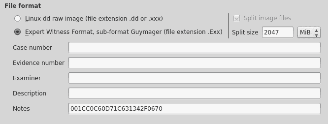

*   目的地：
    *   图像目录：创建的图像文件和日志（信息文件）的位置
    *   图像文件名：图像文件的名称


*   哈希计算/验证：
    *   可以选择和计算多个散列算法，允许研究者从 MD5、SHA-1 和 SHA256 中进行选择
    *   采集后重新读取源进行验证：验证源
    *   采集后验证图像：验证目的地

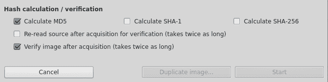

Guymager 还增加了复制图像的便利性。。。按钮创建副本，而无需重复数据输入过程。

对于新用户，您可能需要指定将保存图像文件的目录。在 destination 部分，单击 Image directory 按钮并选择您的位置。对于这次采集，我选择了`Desktop`目录作为图像和日志/信息文件的位置：


下面的屏幕截图显示了我用于 Guymager 采集的数据，选择了`Desktop`作为图像目录以及 MD5 和 SHA-1 哈希算法：

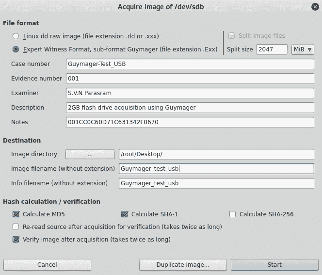

单击开始按钮后，您将注意到状态从空闲变为正在运行。“进度”字段现在还显示一个进度条：


仔细查看屏幕左下角的详细信息，我们可以看到大小、图像和信息文件路径、名称和扩展名、当前速度以及选择的哈希计算。我们还看到图像验证已打开：


采集过程完成后，状态字段按钮的颜色从蓝色变为绿色，表示采集过程已完成，如果在哈希验证/计算区域中选择了验证选项，则还会显示 finished-Verified&ok。进度条还显示 100%：


我们的输出文件和信息文件可以在`Desktop`上找到，因为这是在前面的“获取图像”部分中指定的。如果您选择了不同的目录，请在新终端中使用`cd`命令切换到新目录。在下面的屏幕截图中，我使用`cd Desktop`命令切换到`Desktop`目录，然后使用`ls`命令列出内容：

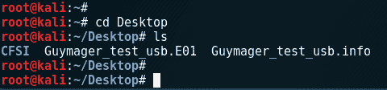

我们也可以浏览`Desktop`，甚至`Desktop`文件夹，打开信息文件，向我们展示收购细节信息：


# 散列验证

双击图像目录位置中的 info 文件，可以检查从开始到完成的采集过程的各种细节，包括散列输出。

此信息文件包含的数据比 DC3DD 生成的日志文件多得多，包括案例管理详细信息：

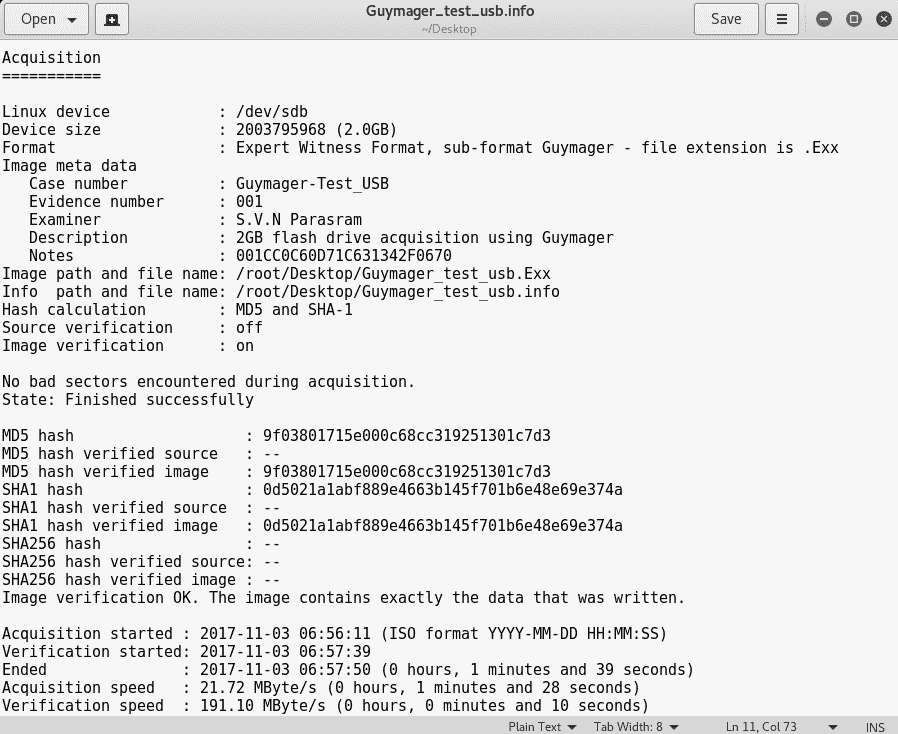

让我们仔细看看`.info`文件中的哈希细节。

我们可以看到 MD5 和 SHA-1 散列已经创建和验证，如以下屏幕截图的最后一行所述，`Image verification OK. The image contains exactly the data that was written`：

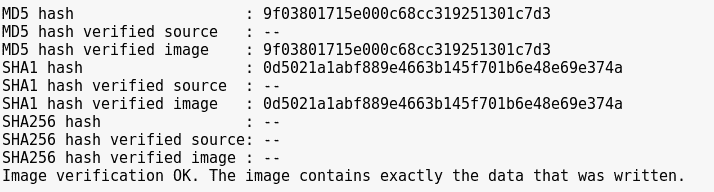

如果我们将这些散列与使用 DC3DD 创建的散列进行比较，我们将获得完全相同的 MD5 和 SHA-1 输出，从而证明这些图像是原始证据的精确法医副本。

将 DC3DD 创建的以下屏幕截图中的哈希值与 Guymager 创建的先前屏幕截图中的哈希值进行比较：

*   **DC3DD MD5 哈希**：


*   **DC3DD SHA-1 哈希表**：

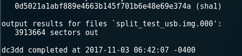

# 总结

在本章中，我们介绍了两种在 Kali Linux 中随时可用的用于获取数字证据的工具。能够区分您的设备非常重要，这样您就可以使用`fdisk -l`命令准确地获取证据文件的法医和准确副本或图像。对于法医学分析，需要证据的比特流副本，因为它们提供了证据的精确副本，一点一点地，这就是我们使用 DC3DD 和 GYMAGER 的原因。

首先，我们使用数据转储工具的增强功能 DC3DD，并通过终端执行了许多任务，包括设备成像、哈希、文件分割和文件验证。虽然 DC3DD 是一个命令行界面程序，但选项保持不变，使其易于学习和使用。

我们的第二个工具，Guymager，具有内置的案例管理功能，并且与 DC3DD 有许多功能上的相似之处，但它是作为 GUI 工具提供的，可能更易于使用。

这两种工具都能提供准确可靠的结果。对于那些可能不经常使用 GYMAGER、DD 和 DC3DD 的人来说，GYMAGER 可能是更容易使用的工具，因为所有采集选项（包括克隆）都可以通过 GUI 随时使用，并且有一个易于阅读的日志，其中提供了案例管理的详细信息。但是，对于驱动器擦除等高级用途，您可能希望使用 DC3DD。但最终，选择权仍在你手中。

对于我们在 Kali Linux 中的第一个取证工具来说，这还不错。接下来，我们将使用**NIST**（**国家标准与技术研究所**创建的实际法医图像，继续介绍一些分析和文件恢复工具。令人兴奋的东西！